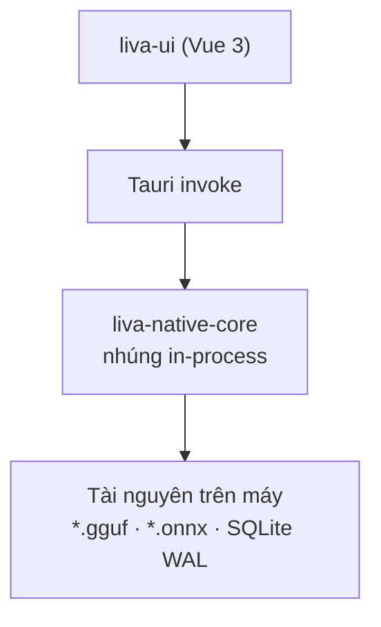
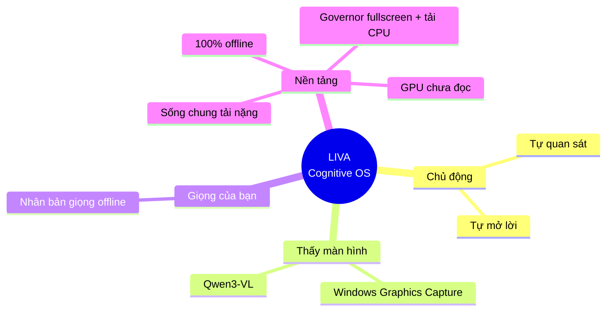

# Tổng quan hệ thống LIVA

[⬆ Mục lục](../README.md) · [Kiến trúc tổng thể ▶](01-kien-truc-tong-the.md)

---

> Đây là **cửa vào** của toàn bộ bộ tài liệu. Đọc hết file này là đủ để hiểu LIVA là gì, được lắp ráp thế nào, phần nào đang chạy thật và phần nào chỉ mới có code. Các file còn lại đào sâu từng lớp.

## Quy ước nhãn trạng thái

Toàn bộ bộ tài liệu dùng ba nhãn thống nhất:

| Nhãn | Ý nghĩa |
|---|---|
| **[OK]** | Đang chạy thật trong đường chạy chính, đã kiểm chứng bằng code |
| **[MỘT PHẦN]** | Có code hoàn chỉnh hoặc gần hoàn chỉnh nhưng bị tắt, chỉ bật opt-in, chỉ sống ở một profile chạy, hoặc chưa được nối dây vào luồng chính |
| **[THIẾU]** | Chưa có, chỉ là stub, hoặc đã bị bỏ hoang / xoá nội dung |

Ba nhãn trên là **trục trạng thái duy nhất**. Trong một số bảng còn có cột phụ dùng ký hiệu `✅` / `❌` / `⚠️` — chúng **không** phải nhãn trạng thái mà chỉ trả lời một câu hỏi có/không cụ thể của chính bảng đó (ví dụ: file có trên đĩa hay không, có chạy trong CI hay không, có bẫy cần lưu ý hay không).

---

## 1. LIVA là gì

LIVA là một **trợ lý ảo cá nhân chạy hoàn toàn trên máy người dùng** (Windows 11). Không có backend cloud trong đường chạy chính: mô hình ngôn ngữ, nhận dạng giọng nói, tổng hợp giọng nói, thị giác màn hình và cơ sở dữ liệu đều nằm trên máy.

Hệ thống gồm **ba lớp**:

| Lớp | Crate / package | Vai trò |
|---|---|---|
| **Lõi Rust** | `liva-native-core` | Engine LLM / STT / TTS / vision / bộ nhớ, dựng trên `llama.cpp` (qua `llama-cpp-2`) và ONNX Runtime (qua `ort`) |
| **Vỏ desktop** | `liva-desktop/src-tauri` | Ứng dụng Tauri v2 **nhúng lõi Rust in-process** (không phải tiến trình con), mở hai cửa sổ: widget overlay trong suốt và dashboard |
| **Giao diện** | `liva-ui` | Vue 3 + Vite, dựng thành hai trang tĩnh `widget.html` và `dashboard.html` |

Điểm kiến trúc quan trọng nhất cần nắm ngay: **lõi Rust được nhúng thẳng vào tiến trình Tauri**, không phải một service riêng mà UI gọi qua mạng. Điều này giải thích vì sao có tới hai "profile chạy" khác nhau (xem §3.A) — cùng một `AppState` nhưng được dựng hai lần bởi hai `main` khác nhau.

Ngoài ba lớp chính, repo còn chứa các vệ tinh:

- `liva-voice/` — dịch vụ Python thí nghiệm nhân bản giọng nói (FastAPI, port 8765).
- `mobile_client/` — PoC Capacitor Android.
- `packages/liva-common` — type TypeScript dùng chung giữa UI và (trên lý thuyết) lõi.
- `teamwork_projects/obsidian_llm_wiki` — MCP server TypeScript phục vụ IDE agent, không phải LIVA gọi.

Sơ đồ tối giản ba lớp — mọi thứ đều nằm trên máy, không có chặng mạng ra ngoài:



> 📌 Nguồn đầy đủ (sơ đồ kiến trúc tổng thể có đủ hai profile chạy, các vệ tinh và chiều dữ liệu): [Kiến trúc tổng thể](01-kien-truc-tong-the.md)

---

## 2. Tầm nhìn gốc và ba trụ cột

Theo `README.md:4,14` — *"A Foundation for a Cognitive OS"*, lấy cảm hứng Jarvis, tác giả Nguyễn Anh Dương.

Ba trụ cột định hướng (theo memory dự án và roadmap `README.md:205-215`):

1. **Chủ động** — LIVA tự quan sát và tự mở lời, không chỉ đáp khi được hỏi.
2. **Thấy màn hình** — thị giác đa phương thức trên nội dung màn hình người dùng.
3. **Giọng của bạn** — nhân bản giọng nói offline.

Hai ràng buộc nền xuyên suốt:

- **100% offline** — không phụ thuộc dịch vụ đám mây cho các năng lực lõi.
- **Sống chung được với tải nặng** — game AAA, render, build; LIVA phải nhường tài nguyên chứ không độc chiếm máy. Governor hiện đọc tải CPU ngoài tiến trình LIVA và GPU ngoài tiến trình qua NVML khi driver cho phép; fullscreen vẫn là tín hiệu riêng cho watcher đổi GPU layer và crop vision. Khi không tách được tải GPU của chính LIVA, nó bỏ tín hiệu thay vì tự throttle sai.



---

## 3. Hiện trạng — đánh giá thẳng

Kết quả khảo sát cho thấy một hệ thống **có hạ tầng rất sâu nhưng nối dây rất nông**. Nhiều năng lực đã được viết đầy đủ trong Rust nhưng không có ai gọi tới, hoặc chỉ sống ở profile chạy mà người dùng thật không dùng.

> **Cập nhật 22/07/2026 — ba module mồ côi đã bị loại khỏi build mặc định.** Commit `4c08f18` đưa `src/passive/` (647 dòng), `src/evolution/` (428 dòng) và `src/agent/dispatcher.rs` (187 dòng) — tổng **1.262 dòng** — ra sau `#[cfg(feature = "experimental")]` (`Cargo.toml:75`; điểm gate: `lib.rs:12,14` và `agent/mod.rs:4`). Code **không bị xoá**, nhưng **không còn được biên dịch** vào binary mặc định. Với `passive/` đây còn là quyết định an toàn: `passive/hook.rs` là một keylogger đầy đủ chức năng chưa có cổng đồng ý người dùng, không nên nằm trong bản giao cho beta tester. Bật lại để phát triển tiếp: `cargo test --features experimental`.

Ba phát hiện cấu trúc quan trọng nhất:

### A. MỘT lõi, HAI vỏ — và từ 26/07/2026 chúng dựng giống nhau

Cùng một `AppState` + `handle_command`, dựng ở hai điểm vào, nhưng cả hai nay gọi **cùng một hàm**: `boot.rs#build_app_state` dựng trạng thái và `boot.rs#spawn_background_services` bật dịch vụ nền. Cả hai vỏ đều có WS gateway 8002, VAD/denoise/AEC/turn-shadow, WakeGate, bot Telegram (khi có token), giải phóng TTS lúc rảnh, governor. Khác biệt còn lại chỉ là **đường IPC**: gateway đọc stdin/stdout, vỏ Tauri dùng `invoke`.

⇒ Đường song công (barge-in, VAD, khử ồn, wake word Rust) **có** sống ở luồng `npm run dev`. Giới hạn còn lại là giới hạn **đo lường**, không phải nối dây: chưa có bản ghi một phiên barge-in đầu-cuối trên vỏ desktop thật.

> **Bản trước viết ngược lại** — *"profile chính thức là profile nghèo hơn… bốn module thoại bị đóng cứng thành `None`… `start_all.ps1` không hề khởi động binary lõi"*. Hai khẳng định đầu **đã sai từ trước** bản gộp (vỏ Tauri vẫn spawn WS server và vẫn gọi `VoiceRuntimeComponents::from_env`); khẳng định thứ ba **đúng nhưng không phải lỗi** — chính vỏ Tauri bind 8002, nên dọn cổng trước là điều kiện cần. Chỉ "không có Telegram" là đúng, và đã đóng 26/07/2026.

> 📌 Nguồn đầy đủ (đối chiếu từng khẳng định cũ, bảng khác biệt còn lại): [Kiến trúc tổng thể §0](01-kien-truc-tong-the.md)

### B. Bộ nhớ dài hạn có producer + projection consumer, chưa có semantic consolidator

Schema v5 tạo **20 bảng** (gồm FTS5/vec0) kèm tìm kiếm lai RRF; 14 bảng có production
writer và sáu bảng còn schema/UI-only. Đường hội thoại recall/persist chạy trên voice, typed chat
và Telegram/API. Mỗi lượt được embed ghi atomic một event pending và ba biểu diễn truy hồi; worker
nền kiểm projection theo batch, checkpoint và xử lý DLQ.

⇒ Nhãn vẫn là **[MỘT PHẦN]**: producer, recall và projection finalization chạy thật; `turn_layer_nodes`/L3 chưa có writer và chưa có Reflection/semantic extraction.

> 📌 Nguồn đầy đủ (ERD 20 bảng, production writer): [Persistence runtime](../03-he-thong-con/persistence.md) · snapshot lịch sử của thiết kế bộ nhớ phân tầng: [Hệ agent, bộ nhớ và tiến hoá](05-agent-bo-nho-va-tien-hoa.md)

### C. Một lỗi ngữ nghĩa khiến hội thoại không có trí nhớ đa lượt

`webrtc/pipeline.rs` dùng `thread_id = session_id.to_string()` làm khoá checkpoint, nhưng `session_id += 1` ở **mọi** sự kiện VAD (qua `cancel_active_operations`). Hệ quả: `load_checkpoint` **luôn trả `None`**; bảng `agent_checkpoints` phình một hàng mỗi lượt nói và không bao giờ được đọc lại. Đây là lỗi một dòng nhưng vô hiệu hoá toàn bộ trí nhớ hội thoại đa lượt trong đường webrtc.

> 📌 Nguồn đầy đủ (xếp hạng rủi ro): [Nợ kỹ thuật và rủi ro](../03-danh-gia/02-no-ky-thuat-va-rui-ro.md) · cách sửa từng bước: [Lộ trình sửa lỗi và nâng cấp](../03-danh-gia/03-lo-trinh-sua-loi-va-nang-cap.md)

### Điểm mạnh thực chất đã kiểm chứng

Đánh giá thẳng không có nghĩa là dự án yếu. Những phần sau **đã kiểm chứng là chạy thật**:

- Ngăn xếp thoại offline: Nemotron RNN-T (ASR) + Piper VITS song ngữ tự chọn giọng (TTS).
- Thị giác màn hình thuần Rust qua Windows Graphics Capture + Qwen3-VL.
- Governor dựng trên Win32: nhận diện cửa sổ fullscreen **và** đọc tải CPU thật (`GetSystemTimes`), có trừ phần CPU của chính LIVA (`GetProcessTimes`) để không tự hạ priority của mình khi đang chạy LLM. **Chưa đọc tải GPU/NVML.**
- Ghost Mode click-through end-to-end (widget overlay trong suốt).
- Mã hoá AES-256-GCM cho bảng `facts`.
- SQLite WAL với pool writer/reader tách biệt.
- Một bộ binary kiểm chứng chuyên biệt: **17 file** trong `src/bin/`.

> 📌 Nguồn đầy đủ (bảng đối chiếu từng tuyên bố với bằng chứng code, kiểm chứng tính offline): [Đối chiếu tuyên bố và thực tế](../03-danh-gia/01-doi-chieu-tuyen-bo-vs-thuc-te.md)

---

## 4. Bảng chỉ số dự án

| Chỉ số | Giá trị | Nguồn |
|---|---|---|
| Workspace Cargo | 2 crate: `liva-native-core` + `liva-desktop/src-tauri` | `Cargo.toml` gốc, `resolver = "2"` |
| Workspace npm | 5 workspace | [root package.json](../../package.json) |
| Lệnh IPC | **77 lệnh có tên / 11 miền**; dispatcher đã tách khỏi `lib.rs` | [Catalog IPC hiện hành](02-giao-thuc-ipc-va-websocket.md#7-handle_command--catalog-lệnh-theo-miền) |
| Tài liệu sống được checker đọc | **61** | `node scripts/docs-check.mjs --strict-stale=docs/03-danh-gia` tại `bd11c84` |
| CI bắt buộc | docs + citation, npm audit, fmt, cargo audit, typecheck, ESLint, UI coverage, build web, vault, Rust test/e2e, Tauri, experimental và Clippy | `.github/workflows/test.yml` |
| Mốc đo chất lượng | Không sao chép số test/coverage vào đây; mốc có ngày, SHA và lệnh tái lập nằm ở backlog đánh giá | [Đường cơ sở 14 cổng](../03-danh-gia/05-nang-cap-toan-dien.md#1-đường-cơ-sở-đã-đo--02082026-tại-260c643-thay-bảng-2907) |

**Cách đọc bảng này:** chỉ giữ các contract cấu trúc ổn định. Số test, coverage, LOC và kích thước index đổi theo từng commit nên nguồn sở hữu của chúng là đường cơ sở có ngày/SHA; chép lại ở tổng quan chính là cách tạo thêm một bản lỗi thời.

---

## 5. Bản đồ workspace và cây thư mục

### 5.1 Bảng thư mục

Cột **Vòng đời** phân loại theo ba trạng thái thực dụng: **còn sống** (đang nằm trong đường chạy hoặc build), **bỏ hoang** (có nội dung nhưng không ai gọi/không còn đúng), **rác** (nên xoá hoặc đã rỗng).

| Thư mục | Vai trò | Trạng thái | Vòng đời | Ghi chú then chốt |
|---|---|---|---|---|
| `liva-native-core/` | Lõi Rust: LLM, STT, TTS, vision, DB, agent, webrtc, MCP, governor | **[OK]** — trái tim dự án | còn sống | edition 2024, Rust ≥1.85. Build ra **root `target/`** (workspace). `liva-native-core/target/` là **rác** tiền-workspace. Từ 22/07/2026, `src/passive/`, `src/evolution/`, `src/agent/dispatcher.rs` chỉ biên dịch với `--features experimental` (`Cargo.toml:75`) |
| `liva-desktop/src-tauri/` | Vỏ Tauri v2, nhúng core in-process | **[OK]** | còn sống | edition **2021** (lệch với core), version `25.0.0`. Chỉ 3 file `.rs`: `main.rs` (7 dòng), `lib.rs` (577 dòng), `build.rs` (3 dòng) |
| `liva-desktop/` (ngoài `src-tauri`) | `index.html`, `src/`, `vite.config.ts`, `dist/` — một app Vite riêng | **[THIẾU]** bỏ hoang | bỏ hoang | Tauri nạp `../liva-ui/dist` (`tauri.conf.json` → `frontendDist`). Script `build:desktop` (`package.json:19`) build đúng cái app vô dụng này, **không** chạy `tauri build` |
| `liva-ui/` | Frontend Vue 3 + Vite (dev 5173) | **[OK]** | còn sống | Build 2 entry: `widget.html`, `dashboard.html`. `index.html` + `main.ts` + `App.vue` **không** nằm trong `rollupOptions.input` (`vite.config.ts:18-21`) ⇒ chỉ chạy được ở `vite dev` |
| `packages/liva-common/` | Type TS dùng chung (`config.ts`, `websocket.ts`) | **[MỘT PHẦN]** | còn sống (nhưng trôi) | `main`/`types` trỏ thẳng `./src/index.ts`, không build. `peerDependencies: zod` **không được dùng**. Hợp đồng `WSClientEvent` đã trôi xa khỏi core |
| `liva-voice/` | Dịch vụ Python nhân bản giọng, FastAPI `0.0.0.0:8765` | **[MỘT PHẦN]** chạy tay | bỏ hoang (chạy tay được) | **Không tiến trình nào khởi động nó**; grep `8765` toàn repo chỉ ra 4 hit (2 tài liệu, 2 trong chính `liva_api.py`). Không file `.rs/.ts/.vue` nào chạm tới |
| `mobile_client/` | PoC Capacitor 8 + Vue 3 (Android) | **[MỘT PHẦN]** đóng băng | bỏ hoang | 1 commit duy nhất (`4d61d54`, 27/06/2026). Protocol `VoiceFrame` **đúng 9 byte** nhưng mic là sóng sin giả (`src/App.vue:189-208`), không phát được TTS, Manifest thiếu `RECORD_AUDIO` |
| `liva-computer-use/` | — | **[THIẾU]** thư mục **RỖNG** | rác | Nội dung 5 file Python (UI Automation agent) bị xoá ở `d2f0d12` (03/07/2026), commit ghi rõ *"thí nghiệm đã bỏ"* |
| `teamwork_projects/obsidian_llm_wiki/` | MCP server TypeScript trên vault Obsidian | **[OK]** nhưng ngoài LIVA | còn sống (ngoài LIVA) | `@modelcontextprotocol/sdk ^1.29.0`, `StdioServerTransport`. Phục vụ IDE agent, **không phải** LIVA gọi |
| `teamwork_projects/liva_upgrade_plan/` | `upgrade_plan.md` 37KB, status "Proposal" | **[THIẾU]** tài liệu tham chiếu | bỏ hoang | |
| `teamwork_projects/omnivoice_poc/` | PoC voice cloning + `rust_cli/` riêng | **[THIẾU]** đóng băng | bỏ hoang | Không nằm trong workspace Cargo gốc; đầy `output_concur_*.wav` **rác** |
| `models/` | Trọng số ONNX + fixture | **[OK]** | còn sống | Toàn bộ `*.onnx`, `*.onnx.data`, `*.gguf`, `*.wav` bị gitignore (`.gitignore:31-37,142-150`). `models/nemotron-asr` là **nested git repo có LFS, KHÔNG phải submodule** — luôn hiện "modified content", để yên |
| `data/` | Config + DB + secret | **[MỘT PHẦN]** | còn sống (một phần rác) | 4 file tracked (`liva-config.json`, `models.config.json`, `skill_whitelist.json`, `research/`); 4 file gitignored chứa PII/secret |
| `scripts/` | `start_all.ps1`, `ai-pre-commit.cjs`, `generate_hey_liva_model.py`, `legacy/` | **[OK]** | còn sống | ESLint ignore toàn bộ `scripts/**/*` (`eslint.config.js:35`) |
| `tests/` (gốc repo) | 4 script stress rời | **[THIẾU]** mồ côi | rác | Không npm script nào trỏ tới; ESLint ignore `**/tests/**/*`. `memory_stress_benchmark.ts` import `../liva-gateway/...` — thư mục **đã bị xoá** ⇒ fail ngay |
| `docs/` | 7 bản vẽ kiến trúc + reports + archive | **[THIẾU]** phần lớn lỗi thời | bỏ hoang (đang thay bằng bộ này) | 7 file `docs/architecture/*.md` đều sửa 30/05/2026, mô tả stack **Node.js đã bị xoá** |
| `.agents/` | 358 entry vết agent audit | **[THIẾU]** đóng băng 27/06 | rác | untracked (`.gitignore:10`). `AGENTS.md` bên trong đã lỗi thời (nhắc `liva-gateway`) |
| `release/`, `static/`, `logs/` | Artifact build tay, thư mục rỗng, log runtime | **[THIẾU]** | rác | Tất cả untracked. `release/desktop-client.exe` trỏ về `desktop_client/` **không còn tồn tại** |

### 5.2 Cây thư mục rút gọn

```
E:\Project\LIVA\
├── Cargo.toml                    [OK]    workspace 2 crate, resolver = "2"
├── package.json                  [OK]    npm workspace 5 package
├── liva-native-core/             [OK]    ★ trái tim — 82 file .rs, 18.687 LOC (không kể src/bin/)
│   ├── src/                              llm, stt, tts, vision, db, agent, webrtc, mcp, governor
│   │                             [MỘT PHẦN] passive/, evolution/, agent/dispatcher.rs nằm sau
│   │                                     #[cfg(feature = "experimental")] — ngoài build mặc định
│   ├── src/bin/                  [OK]    17 binary kiểm chứng (14 khai báo [[bin]] test=false)
│   ├── tests/                    [OK]    6 file — mặc định chỉ 3 file sinh test (9 hàm);
│   │                                     3 file *_stress sinh 0 test trừ khi --features experimental (19 hàm)
│   └── target/                   rác     leftover tiền-workspace, build thật ra root target/
├── liva-desktop/
│   ├── src-tauri/                [OK]    main.rs (7) + lib.rs (577) + build.rs (3)
│   ├── src/, index.html, dist/   bỏ hoang app Vite riêng, Tauri không nạp
│   └── vite.config.ts            bỏ hoang
├── liva-ui/                      [OK]    ★ frontend thật — widget.html + dashboard.html
│   └── tests/                    [OK]    22 file vitest, ~242 it()/test()
├── packages/liva-common/         [MỘT PHẦN] type TS dùng chung, không build, hợp đồng đã trôi
├── liva-voice/                   [MỘT PHẦN] FastAPI :8765 — không ai khởi động
├── mobile_client/                [MỘT PHẦN] PoC Capacitor, 1 commit, mic là sóng sin giả
├── liva-computer-use/            rác     THƯ MỤC RỖNG (xoá ở d2f0d12)
├── teamwork_projects/
│   ├── obsidian_llm_wiki/        [OK]    MCP server cho IDE agent (ngoài LIVA)
│   ├── liva_upgrade_plan/        bỏ hoang upgrade_plan.md 37KB, "Proposal"
│   └── omnivoice_poc/            bỏ hoang PoC + output_concur_*.wav rác
├── models/                       [OK]    trọng số gitignore; nemotron-asr = nested git repo LFS
├── data/                         [MỘT PHẦN] 4 file tracked + 4 file gitignored (PII/secret)
├── scripts/                      [OK]    start_all.ps1, ai-pre-commit.cjs, legacy/
├── tests/                        rác     4 script mồ côi, import liva-gateway đã xoá
├── docs/                         bỏ hoang 7 bản vẽ mô tả stack Node.js đã xoá
├── .agents/                      rác     358 entry audit, đóng băng 27/06, untracked
├── release/ static/ logs/        rác     untracked, trỏ về desktop_client/ không tồn tại
└── .aiexclude                    rác     bản sao .gitignore cũ, còn tên openclaw-gateway/
```

### 5.3 Ba tàn dư dễ gây hiểu lầm nhất

Đây là ba file **tracked trong git** nên trông rất "chính thức", nhưng không có code nào đọc chúng. Người đọc mới rất dễ kết luận sai từ chúng:

1. **`data/models.config.json`** (tracked): ghi `"llm.model": "gemma-4-26B-A4B-it-UD-Q6_K.gguf"` và `"tts.provider": "edge-tts"`. Grep toàn repo: **không file `.rs`/`.ts`/`.vue`/`.py` nào đọc file này**. Đọc lên rất giống bằng chứng "LIVA dùng cloud TTS" — hoàn toàn sai.
2. **`data/skill_whitelist.json`** (tracked): whitelist 4 skill nhạy cảm (`send_zalo_rpa`, `read_emails`, `system_audit`, `privacy_dashboard`). Grep: **0 reader**. ⇒ cổng kiểm soát kỹ năng **không được thực thi ở runtime**.
3. **`.aiexclude`** (70 dòng): bản sao lỗi thời của `.gitignore` cũ, còn dùng tên `openclaw-gateway/` — dự án đời trước cả tên "LIVA".

---

## 6. Đọc tiếp theo hướng nào

| Nếu bạn muốn... | Đọc |
|---|---|
| Hiểu bức tranh kiến trúc và hai profile chạy | [Kiến trúc tổng thể](01-kien-truc-tong-the.md) |
| Hiểu lõi Rust được chia module thế nào | [Phụ thuộc module và tra cứu file](10-phu-thuoc-module-va-tra-cuu.md) |
| Biết cách chạy, biến môi trường, model cần có | [Cấu hình và biến môi trường](../02-van-hanh/01-cau-hinh-va-bien-moi-truong.md) |
| Xem danh sách đầy đủ những gì đang tắt / mồ côi | [Nợ kỹ thuật và rủi ro](../03-danh-gia/02-no-ky-thuat-va-rui-ro.md) |
| Nắm CI, pre-commit hook, bộ test | [Kiểm thử và CI](../02-van-hanh/04-kiem-thu-va-ci.md) |

---

## Liên quan

**Đọc tiếp theo mạch:** [⬆ Mục lục](../README.md) · [Kiến trúc tổng thể ▶](01-kien-truc-tong-the.md) — đây là file đầu chuỗi nên không có tài liệu trước.

**Tài liệu này dựa vào (nguồn sự thật ở nơi khác):**
- [Kiến trúc tổng thể](01-kien-truc-tong-the.md) — bảng so sánh hai profile chạy và sơ đồ kiến trúc đầy đủ, dùng cho §3.A.
- [Persistence runtime](../03-he-thong-con/persistence.md) — ERD và danh mục 20 bảng SQLite hiện hành, dùng cho §3.B và dòng "Bảng SQLite" trong bảng chỉ số.
- [Hệ agent, bộ nhớ và tiến hoá](05-agent-bo-nho-va-tien-hoa.md) — thiết kế bộ nhớ phân tầng và checkpoint agent.
- [Giao thức IPC và WebSocket](02-giao-thuc-ipc-va-websocket.md) — bảng 42 lệnh `handle_command`, dùng cho dòng "Lệnh IPC" trong bảng chỉ số.
- [Đối chiếu tuyên bố và thực tế](../03-danh-gia/01-doi-chieu-tuyen-bo-vs-thuc-te.md) — bằng chứng cho mục "Điểm mạnh thực chất đã kiểm chứng".
- [Nợ kỹ thuật và rủi ro](../03-danh-gia/02-no-ky-thuat-va-rui-ro.md) — xếp hạng rủi ro và bảng code mồ côi, dùng cho §3.C và dòng "Code mồ côi".
- [Lộ trình sửa lỗi và nâng cấp](../03-danh-gia/03-lo-trinh-sua-loi-va-nang-cap.md) — cách sửa lỗi khoá checkpoint ở §3.C.
- [Kiểm thử và CI](../02-van-hanh/04-kiem-thu-va-ci.md) — số liệu test và CI gate trong bảng chỉ số.

**Tài liệu khác dựa vào tài liệu này:**
- [Kiến trúc tổng thể](01-kien-truc-tong-the.md) — lấy bản đồ workspace và phân vai ba lớp làm nền.
- [Phụ thuộc module và tra cứu file](10-phu-thuoc-module-va-tra-cuu.md) — lấy bảng chỉ số (LOC, số file `.rs`, số binary) làm mốc đối chiếu.
- [Triển khai và runtime](../02-van-hanh/03-trien-khai-va-runtime.md) — lấy cây thư mục và trạng thái vòng đời từng thư mục.
- [Nợ kỹ thuật và rủi ro](../03-danh-gia/02-no-ky-thuat-va-rui-ro.md) — lấy danh sách thư mục "rác / bỏ hoang" và ba tàn dư dễ gây hiểu lầm (§5.3).
- [Đối chiếu tuyên bố và thực tế](../03-danh-gia/01-doi-chieu-tuyen-bo-vs-thuc-te.md) — lấy quy ước ba nhãn trạng thái `[OK]` / `[MỘT PHẦN]` / `[THIẾU]`.

**Khi sửa code sau đây thì phải cập nhật tài liệu này:**
- `Cargo.toml` + `package.json` (gốc repo) — bảng chỉ số dự án (§4: số crate, số npm workspace, số binary) và cây thư mục §5.2.
- `liva-desktop/src-tauri/src/lib.rs`, `liva-native-core/src/commands/*` — §3.A (hai profile chạy) và catalog IPC 77 lệnh trong bảng chỉ số.
- `liva-native-core/src/db.rs` — §3.B và các dòng "Bảng SQLite" / "Bảng có writer" / "Cột được mã hoá".
- `liva-native-core/src/webrtc/pipeline.rs` — §3.C (lỗi khoá checkpoint làm mất trí nhớ đa lượt).
- `scripts/*` (nhất là `start_all.ps1`) — §3.A và mô tả thư mục `scripts/` trong bảng §5.1.
- `liva-ui/vite.config.ts` — mô tả `liva-ui/` ở §5.1 (hai entry `widget.html` / `dashboard.html`).
- `liva-desktop/src-tauri/tauri.conf.json` — dòng `liva-desktop/` bỏ hoang ở §5.1 (`frontendDist` trỏ `../liva-ui/dist`).
- `data/*` — §5.3 (ba tàn dư dễ gây hiểu lầm) và dòng `data/` trong bảng §5.1.
- `.github/workflows/test.yml` — dòng "CI gate" trong bảng chỉ số §4.
