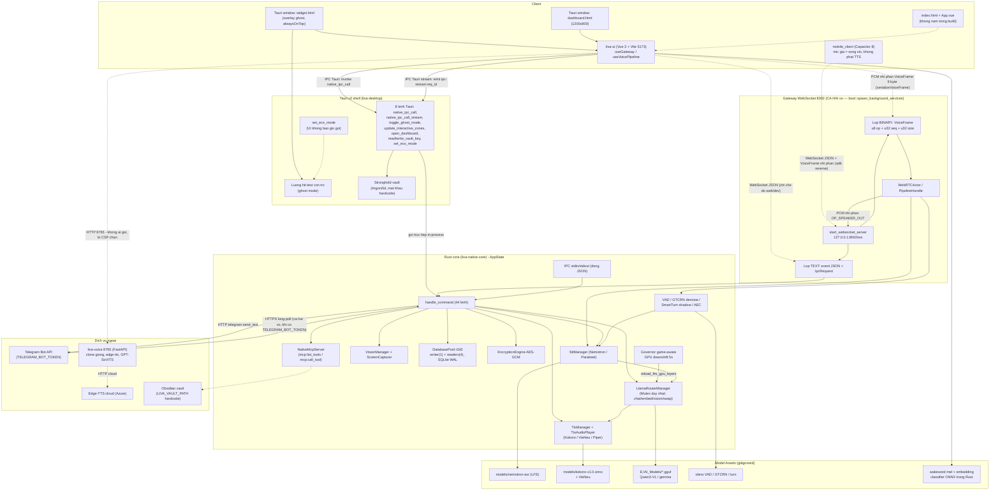

# Kiến trúc tổng thể LIVA

> **§0 đã được viết lại 26/07/2026.** Bản trước nói LIVA có "hai profile chạy không tương
> đương" và vỏ Tauri là "profile nghèo hơn". Điều đó **không còn đúng** — và một phần
> *chưa bao giờ* đúng. Từ `e2ecdf1`, cả hai vỏ đi chung một đường khởi động
> (`liva-native-core/src/boot.rs`); khác biệt thật thu về ba dòng trong
> `boot::ServiceOptions`. Chi tiết và đối chiếu từng khẳng định cũ nằm ngay dưới.

[⬆ Mục lục](../README.md) · [◀ Tổng quan hệ thống](00-tong-quan-he-thong.md) · [Giao thức IPC và WebSocket ▶](02-giao-thuc-ipc-va-websocket.md)

---

## 0. ĐỌC TRƯỚC TIÊN — MỘT lõi, HAI vỏ, và chúng dựng GIỐNG NHAU

> **Viết lại 26/07/2026.** Mục này trước đây mang tiêu đề *"LIVA có HAI PROFILE CHẠY khác nhau"*
> và tự nhận là "điều quan trọng nhất trong toàn bộ tài liệu kiến trúc" — nên nó cũng là chỗ sai
> đắt nhất khi lệch. Đối chiếu lại mã nguồn: **hai trong ba khác biệt nó nêu đã sai từ trước**, và
> phần còn lại đã đóng bằng builder chung. Nguyên văn cũ giữ ở §0.4 làm hồ sơ.

Cùng một `AppState`, cùng một `handle_command`, dựng ở hai điểm vào — nhưng từ 26/07/2026 cả hai
gọi **cùng một hàm**:

| | dựng trạng thái | bật dịch vụ nền |
|---|---|---|
| **Vỏ A — gateway** `liva-native-core.exe` | `boot.rs#build_app_state` | `boot.rs#spawn_background_services` |
| **Vỏ B — desktop** `liva-desktop` (`npm run dev`) | *cùng hàm đó* | *cùng hàm đó* |

Doc-comment của `spawn_background_services` tự khai là **"nguồn sự thật duy nhất cho câu hỏi LIVA
chạy những gì ở nền"** — thêm dịch vụ mới thì thêm ở một chỗ, không còn cửa để hai vỏ lệch nhau.

### 0.1 Bảng năng lực theo profile — nguồn sự thật duy nhất

WebSocket server 8002 · tự nạp model router · phóng chiếu bộ nhớ (event→vector) · hạ lớp GPU khi có
game · **giải phóng session TTS sau 5 phút rảnh** · **bot Telegram** (khi có `TELEGRAM_BOT_TOKEN`) ·
governor ưu tiên CPU · cụm thoại VAD/denoise/turn-shadow/AEC theo `VoiceRuntimeComponents::from_env`.

| Năng lực / giao diện | Gateway standalone `liva-native-core.exe` | Desktop Tauri `npm run dev` |
|---|---|---|
| Dựng `AppState` | **CÓ** — `boot::build_app_state` | **CÓ** — cùng hàm |
| WebSocket `127.0.0.1:8002/ws` | **CÓ** | **CÓ** — cùng `spawn_background_services` |
| VAD + denoise | **CÓ**, mặc định bật | **CÓ**, cùng biến môi trường |
| Turn-shadow + AEC | **CÓ** khi opt-in | **CÓ** khi opt-in |
| WakeGate + barge-in | **CÓ** trên đường WebSocket | **CÓ** trên cùng đường WebSocket |
| Telegram | **CÓ** khi có token; allow-list rỗng thì từ chối mọi người | **CÓ**, cùng điều kiện |
| Phóng chiếu bộ nhớ · retention opt-in · tự nạp router · governor GPU · TTS idle-unload | **CÓ** | **CÓ** — cùng `spawn_background_services` |
| UI widget + dashboard | KHÔNG | **CÓ** — hai WebView Tauri |
| IPC lệnh chính | stdin/stdout JSON; client ngoài có thể dùng WebSocket | Tauri `invoke("native_ipc_call")`; voice/binary vẫn qua WebSocket |
| Session ticket WebSocket cho WebView đặc quyền | KHÔNG | **CÓ** — `on_websocket_sessions_ready` |
| `ipc_tx` cho bot ghi ra stdout | **CÓ** | KHÔNG — bot vẫn chạy, chỉ không có kênh stdout phụ |
| Báo `gateway-ready` cho cửa sổ | Không cần | **CÓ** — phát sau khi bind thật, kèm cổng thật |
| Hiện lỗi boot / escrow khoá | stderr + `exit 1` | Hộp thoại |

Ba khác biệt callback/kênh nền cuối bảng được đóng khung trong `boot::ServiceOptions`; vòng đọc stdin
và cách hiện lỗi nằm ở từng vỏ. Không có khác biệt nào làm desktop mất năng lực thoại.

### 0.2 Ba khẳng định cũ nay không còn đúng

| Khẳng định trong bản trước | Thực tế |
|---|---|
| "Tauri **KHÔNG** có WS gateway 8002" | **Sai từ trước bản gộp** — vỏ Tauri vẫn spawn `WebSocketServer::bind_from_env()` trong `setup()`. Hệ quả kéo theo cũng sai: barge-in/VAD/khử ồn/AEC/wake **có** sống ở luồng `npm run dev` |
| "VAD/denoise/AEC/turn-shadow = **`None` hard-code**" | **Sai từ trước bản gộp** — vỏ Tauri gọi `VoiceRuntimeComponents::from_env(&stt_model_dir)` như gateway. Khối `AppState { … vad: None … }` mà bản trước trích dẫn là mã đã bị thay từ lâu |
| "Telegram bot: **KHÔNG** (grep = 0 hit)" | **Đúng cho tới 26/07/2026**. Nay bot chạy ở bất kỳ vỏ nào khi có token — `get_system_status` phân biệt "đã cấu hình" với "đang chạy" qua `telegram.rs#bot_running` |

Cùng đợt vá thêm một lệch **chưa từng được ghi** và cùng hướng: vỏ desktop không có tác vụ
`check_idle_unload`, nên nó **không bao giờ trả lại session ONNX của TTS** — trên một app chạy cả
ngày, đó là RAM giữ vĩnh viễn.

**Chống tái lệch:** `boot.rs#khong_vo_nao_tu_dung_lai_app_state` **đọc mã nguồn hai vỏ** và đỏ ngay
nếu vỏ nào tự dựng lại `AppState` — vì không có gì trong trình biên dịch ngăn ai đó chép lại 155
dòng khởi động, và đó đúng là cách hai bản sao cũ ra đời.

### 0.3 Kịch bản khởi động thật sự làm gì

`scripts/start_all.ps1` giải phóng cổng 5173 + 8002 rồi chạy `liva-ui` và
`npx tauri dev --no-dev-server`; **không** khởi động `liva-native-core.exe`. Trước đây đó là bằng
chứng của một lỗ hổng ("kill 8002 rồi không bật lại"); nay nó **đúng**, vì chính vỏ Tauri bind
8002 — dọn cổng trước là điều kiện cần để nó bind được.

Sự kiện `gateway-ready` cũng đã hết giả: nó phát từ callback `on_gateway_ready` **sau khi** server
bind xong, mang cổng thật (`server.local_addr()`), thay cho payload cứng `{"port":8002}` kèm comment
sai sự thật của bản trước.

⇒ Đường song công **không còn thuộc nhóm [MỘT PHẦN] vì lý do "sai profile"**. Giới hạn còn lại là
giới hạn đo lường: chưa có bản ghi một phiên barge-in đầu-cuối trên vỏ desktop thật.

### 0.4 Nguyên văn bản trước (hồ sơ)

<details><summary>Kết luận "hai profile không tương đương" cũ — giữ để đối chiếu, <b>đừng dùng làm nguồn</b></summary>

> Nghịch lý cốt lõi: **profile chính thức (Tauri) là profile nghèo hơn.**
>
> Bản cũ khẳng định gateway standalone có WS 8002, VAD/denoise/AEC/turn-shadow, WakeGate và
> Telegram còn Tauri thì không; chỉ IPC stdin/stdout được ghi đúng là riêng standalone.
>
> Kèm một khối `AppState { … vad: None, denoiser: None … }` trích từ vỏ Tauri, và kết luận
> "toàn bộ đường song công chỉ sống khi chạy tay binary standalone".

Các khẳng định năng lực đã được đối chiếu lại ở §0.2. `WakeGate` sống trên đường WebSocket
(`websocket.rs` import `wake`) nên nó theo WS server — tức là **có ở cả hai vỏ**, không phải chỉ ở
gateway.

</details>

### 0.5 Hệ quả thực tế cần nhớ

| Câu hỏi thường gặp | Câu trả lời |
|---|---|
| Có mở cổng TCP nào không? | **Cả hai vỏ** đều bind `127.0.0.1:8002/ws`. Hệ quả: **đừng chạy đồng thời hai vỏ** — chúng tranh cùng một cổng |
| UI nói chuyện với lõi kiểu gì? | Vỏ desktop: `invoke("native_ipc_call")` in-process. Client ngoài: WebSocket JSON + khung nhị phân. Cả hai đổ về **cùng** `handle_command` |
| Có phát hiện im lặng / ngắt lời không? | **Có, ở cả hai vỏ** — `LIVA_VAD_ENABLED` và `LIVA_DENOISE_ENABLED` mặc định **bật**; `LIVA_TURN_SHADOW_ENABLED` và `LIVA_AEC_ENABLED` mặc định **tắt** (opt-in) |
| Bot Telegram có chạy không? | **Cả hai vỏ**, khi đặt `TELEGRAM_BOT_TOKEN`. Phân biệt "đã cấu hình" với "đang chạy" bằng `telegram.rs#bot_running` |
| Lệnh `handle_command` có khác nhau không? | **Không** — cùng một hàm, **51 nhánh lệnh** (đếm lại 26/07/2026) |

> **Quy ước đọc sơ đồ bên dưới:** nét liền = đường đang chạy thật trong luồng dev chuẩn
> (`npm run dev` → Vue UI ↔ Tauri IPC ↔ core in-process); **nét đứt = opt-in, chạy tay,
> hoặc chưa nối dây.**

---

## 1. Sơ đồ kiến trúc tổng thể



---

## 2. Diễn giải từng khối

### 2.1 Khối `CLIENT` — các mặt tiền người dùng

| Nút sơ đồ | Thực chất là gì | Trạng thái |
|---|---|---|
| `WIDGET` — `widget.html` | Cửa sổ Tauri overlay trong suốt, `alwaysOnTop`, có Ghost Mode click-through | **[OK]** |
| `DASH` — `dashboard.html` | Cửa sổ Tauri 1200×800, mở bằng lệnh `open_dashboard` | **[OK]** |
| `UIAPP` — `liva-ui` | Vue 3 + Vite (dev 5173). Hai composable trục: `useGateway` (kênh lệnh) và `useVoicePipeline` (kênh mic) | **[OK]** |
| `INDEXHTML` — `index.html` + `App.vue` | **Không** nằm trong `rollupOptions.input` của `vite.config.ts:18-21` ⇒ không có trong bản build, chỉ chạy được ở `vite dev` | **[MỘT PHẦN]** |
| `MOBILE` — `mobile_client` | PoC Capacitor 8 + Vue 3 (Android), 1 commit duy nhất. Protocol `VoiceFrame` **đúng 9 byte** nhưng mic là sóng sin giả, không phát được TTS | **[MỘT PHẦN]** đóng băng |

Điểm cần nhớ: **cả hai cửa sổ Tauri đều nạp cùng một codebase `liva-ui`**, khác nhau ở entry
HTML. Tauri trỏ `frontendDist` sang `../liva-ui/dist`; app Vite riêng nằm trong
`liva-desktop/` (ngoài `src-tauri`) là **thư mục bỏ hoang** — script `build:desktop` build
đúng cái app vô dụng đó.

### 2.2 Khối `SHELL` — vỏ Tauri v2 (`liva-desktop/src-tauri`)

Vỏ Tauri chỉ có **3 file `.rs`**: `main.rs` (6 dòng), `lib.rs` (593 dòng), `build.rs` (3 dòng).
Nó phơi ra **8 lệnh Tauri**, trong đó chỉ **hai lệnh** là trục kiến trúc:
`native_ipc_call` (cầu chính UI → `handle_command`, gọi **trực tiếp in-process**,
`lib.rs:229-235`) và `native_ipc_call_stream` (biến thể streaming, phát
`window.emit("ipc-stream:{req_id}")`, `lib.rs:237-258`). Sáu lệnh còn lại phục vụ cửa sổ và
vault: `toggle_ghost_mode`, `update_interactive_zones`, `open_dashboard`,
`read_vault_key` / `write_vault_key` (Stronghold, mật khẩu hardcode) và `set_eco_mode`
(**code chết**, xem §3.5).

> 📌 Nguồn đầy đủ: [Desktop Tauri](../03-he-thong-con/desktop-tauri.md)

`HITTEST` là một **luồng riêng** liên tục đọc vị trí con trỏ để quyết định cửa sổ widget có
"ăn" sự kiện chuột hay không — đây là cơ chế Ghost Mode end-to-end và nó **chạy thật**.

### 2.3 Khối `GATEWAY` — WebSocket 8002

**Chỉ tồn tại trong binary standalone.** Cấu trúc hai lớp trên cùng một kết nối
`ws://127.0.0.1:8002/ws`:

- **Lớp TEXT** — JSON: sự kiện phát ra cho client + `IpcRequest` đi vào `handle_command`.
- **Lớp BINARY** — `VoiceFrame`: header 9 byte `[op u8][seq_id u32 LE][payload_size u32 LE]`
  rồi tới payload PCM. Đây là kênh mic lên / loa xuống.
- `WebRTCActor` / `PipelineHandle` — actor điều phối vòng đời phiên thoại song công.

> 📌 Nguồn đầy đủ (bảng opcode, chi tiết khung 9 byte, bảng lệnh `handle_command`): [Giao thức IPC và WebSocket](02-giao-thuc-ipc-va-websocket.md)

`WebSocketServer::bind_from_env` đọc `LIVA_SERVER_PORT` (mặc định `8002`) và
`LIVA_SERVER_HOST` (mặc định `127.0.0.1`) rồi bind listener
(`liva-native-core/src/websocket.rs:286-405`). `boot::spawn_background_services`
khởi động server này cho **cả binary standalone lẫn vỏ Tauri**
(`liva-native-core/src/boot.rs:360-380`). UI desktop vẫn ưu tiên Tauri IPC cho command;
WebSocket chạy song song cho voice/binary transport và client ngoài.

### 2.4 Khối `CORE` — lõi Rust `liva-native-core` (`AppState`)

Đây là trái tim dự án. `AppState` (`lib.rs:33-52`) có **13 field**, trong đó **9 field** bọc
`tokio::sync::Mutex` (`stt`, `tts`, `llm`, `vad`, `denoiser`, `turn_shadow`, `aec`, `vision`,
`embedder`). Bốn field còn lại **không** bọc Mutex: `db: DatabasePool` (`lib.rs:34`),
`crypto: EncryptionEngine` (`lib.rs:35`), `tts_player: TtsAudioPlayer` (`lib.rs:38`) — ba cái
này tự khoá bên trong — và `mcp_server: Arc<NativeMcpServer>` (`lib.rs:44`), chỉ bọc `Arc`
vì server MCP là read-only.
~~"toàn bộ field trong `AppState` đều bọc `tokio::sync::Mutex`"~~ — câu này từng đúng ở bản
`AppState` cũ, nhưng nay sai; sửa 22/07/2026.

| Thành phần | Vai trò | Ghi chú then chốt |
|---|---|---|
| `handle_command` | Bộ định tuyến lệnh trung tâm — một `match` lớn + `_ => Err("Unknown command")` | Dùng chung cho **cả hai** vỏ, không khác một nhánh nào. **Số nhánh cố ý không ghi ở đây** — nó do [Giao thức IPC và WebSocket](02-giao-thuc-ipc-va-websocket.md) sở hữu; ghi lại ở hai nơi là cách bộ tài liệu này từng có ba con số khác nhau (42 / 44 / 51) cho cùng một bảng |
| `LlamaRouterManager` | LLM qua `llama.cpp` (`llama-cpp-2`). Một `Mutex` **duy nhất** phục vụ cả chat / embed / vision / swap model | Điểm nghẽn tuần tự hoá lớn nhất của hệ thống |
| `SttManager` | ASR: Nemotron RNN-T (mặc định) hoặc Parakeet-vi (opt-in qua `LIVA_STT_VI_ENGINE`) | ONNX Runtime, CPU |
| `TtsManager` + `TtsAudioPlayer` | TTS: Piper / VieNeu (opt-in) / Kokoro | `models/kokoro-v1.0.onnx` **không tồn tại** mặc định |
| `VisionManager` + `ScreenCapturer` | Chụp màn hình thuần Rust qua Windows Graphics Capture, đưa ảnh vào Qwen3-VL | Cần build **release** |
| `DatabasePool` (r2d2) | SQLite WAL, tách **writer(1) + readers(4)** | 13 bảng thường + 2 bảng ảo |
| `EncryptionEngine` | AES-256-GCM | Chỉ **1 cột** được mã hoá: `facts.value` |
| Governor game-aware | Vòng lặp 5s, hạ `n_gpu_layers` khi phát hiện tải nặng, gọi `reload_llm_gpu_layers` | Win32; early-return nếu `n_gpu_layers` vốn đã bằng 0 |
| `VAD` / GTCRN denoise / SmartTurn shadow / AEC | Cụm xử lý tín hiệu tiếng nói | Dựng qua `VoiceRuntimeComponents::from_env` ở **cả hai vỏ**; `None` khi thiếu model hoặc bị tắt bằng `LIVA_*_ENABLED=0` |
| `NativeMcpServer` | Server MCP nội bộ | Đã nối vào dispatcher: `mcp:list_tools` (`liva-native-core/src/lib.rs#handle_command`) và `mcp:call_tool` (`liva-native-core/src/lib.rs#handle_command`); **chưa client UI nào gọi** — xem điểm 4 của §3 |
| `STDIO` | IPC dòng JSON qua stdin/stdout (`liva-native-core/src/main.rs:173-244`) | Chỉ binary standalone |

Chuỗi xử lý cốt lõi trong sơ đồ: `VAD → STT → LLM → TTS` — đây là đường thoại; và
`handle_command → {LLM, STT, TTS, VISION, DB, CRYPTO}` — đây là đường lệnh.

> 📌 Nguồn đầy đủ cho từng khối: [Đường ống thoại](03-duong-ong-thoai.md) (bảng engine STT,
> bảng backend TTS, ngưỡng VAD/AEC) · [Hệ LLM và prompt](04-he-llm-va-prompt.md) (cấu hình LLM) ·
> [Thị giác, quan sát thụ động và governor](06-thi-giac-passive-va-governor.md) (ngưỡng governor) ·
> [Persistence runtime](../03-he-thong-con/persistence.md) (ERD SQLite 20 bảng) · [Threat model](../05-chat-luong/threat-model.md) (mã hóa và trust boundary)

### 2.5 Khối `MODELS` — trọng số (toàn bộ gitignored)

Về mặt kiến trúc chỉ cần nhớ ba điều: trọng số STT/TTS/VAD nằm trong `models/` (riêng
`models/nemotron-asr` là nested git repo có LFS, **không** phải submodule — để yên), còn
GGUF của LLM/vision nằm **ngoài repo** ở `E:/AI_Models/` và được trỏ qua
`data/liva-config.json`. Kokoro vắng mặt mặc định ⇒ init TTS lỗi cho tới khi cấp file.
Wake worker phía UI chỉ cắt utterance và gửi `OP_WAKE_PROBE`; nó không nhận dạng nội
dung bằng RMS. Quyết định nằm ở `WakeGate` + classifier ONNX/STT trong Rust, dựng trong
`websocket.rs` nên **đi theo WS server và có ở cả hai vỏ**. MLP năng lượng,
`hey_liva_weights.json` và browser `hey_liva.onnx` cũ đã bị gỡ ngày 31/07/2026.

> 📌 Nguồn đầy đủ: [Mô hình AI và tài nguyên](../02-van-hanh/02-mo-hinh-ai-va-tai-nguyen.md)

### 2.6 Khối `EXT` — dịch vụ ngoài

Bốn điểm chạm ra ngoài lõi, **tất cả đều [MỘT PHẦN]**: Telegram Bot API (long-poll, chạy ở
**cả hai vỏ** từ 26/07/2026, cần `TELEGRAM_BOT_TOKEN`), `liva-voice` FastAPI 8765 (khởi động thủ công, **không code nào trong
repo gọi tới** và còn bị CSP chặn), Edge-TTS cloud do `liva-voice` gọi ra — **điểm chạm
Internet duy nhất** của hệ thống, và Obsidian vault (đích của `NativeMcpServer` — nay đã có
hai lệnh dispatcher `mcp:list_tools` / `mcp:call_tool` gọi tới, nhưng chưa client UI nào dùng).

> 📌 Nguồn đầy đủ: [Tích hợp ngoài](09-tich-hop-ngoai.md)

---

## 3. Năm điểm cần biết khi đọc sơ đồ

**Nét liền = đường đang chạy thật; nét đứt = opt-in, chạy tay, hoặc chưa nối dây.**

1. **Đường chạy chính thức là Tauri IPC, không phải WebSocket.** `useGateway.ts:210` kiểm
   `window.__TAURI_INTERNALS__`; nếu có thì `connect()` **return sớm**
   (`useGateway.ts:274-289`), không tạo WebSocket, mọi lệnh đi qua
   `invoke("native_ipc_call", {command, payload})` →
   `liva-desktop/src-tauri/src/lib.rs:229-235` → `handle_command`. Streaming thì qua
   `native_ipc_call_stream` + `window.emit("ipc-stream:{req_id}")` (`lib.rs:237-258`).

2. **Gateway 8002 dùng chung cho cả hai vỏ.** Desktop dựng cùng `AppState` và gọi
   `boot::spawn_background_services`; command UI chính đi qua Tauri IPC, còn WebSocket
   phục vụ voice/binary transport và client ngoài với principal-aware authorization.

3. **Hợp đồng khung mic lên đã được vá (22/07/2026).** `useVoicePipeline.ts` nay import
   `serializeVoiceFrame` / `OP_MIC_IN` từ `liva-ui/src/utils/voiceFrame.ts`
   (`useVoicePipeline.ts:4`) và gửi ở `useVoicePipeline.ts:353`:
   ```ts
   wsRef.send(serializeVoiceFrame(OP_MIC_IN, micSeqId, new Uint8Array(buffer.buffer)));
   ```
   `voiceFrame.ts` đóng đúng header **9 byte** (`VOICE_FRAME_HEADER_SIZE = 9`,
   `view.setUint32(1, seqId >>> 0, true)`, `view.setUint32(5, payload.byteLength, true)`),
   khớp `VoiceFrame::decode` (`webrtc/frame.rs:32-56`) vốn đòi
   `[op u8][seq_id u32 LE][payload_size u32 LE]`.
   > **Bối cảnh lịch sử — bug đã sửa.** Trước đây chỗ này ghi
   > ~~`const msg = new Uint8Array(1 + pcmBuffer.byteLength); msg[0] = 0x01;`~~ tức header
   > **1 byte**; core đọc 4 byte PCM đầu làm `seq_id`, 4 byte kế làm `payload_size` → gần
   > như chắc chắn `>1 MiB` → `Err("Payload exceeds 1MB limit")` (`webrtc/frame.rs:41`) ⇒
   > mọi khung mic từ trình duyệt bị từ chối và barge-in không chạy được. Chuỗi suy luận đó
   > **nay chỉ còn giá trị lịch sử**; comment giải thích chính bug này còn nằm ngay trên
   > dòng gửi (`useVoicePipeline.ts:348-352`).

   Lưu ý đừng nhầm: hai chỗ `msg[0] = 0x02` còn lại (`useVoicePipeline.ts:196`, `:266`) là
   tiền tố 1 byte của nhánh **MessagePack**, một giao thức khác. Chiều **xuống** thì UI parse
   đúng 9 byte (`utils/speakerFrame.ts:5-13`, `App.vue:143-150`), và
   `mobile_client/src/services/WebSocketClient.ts:226-235` (`serializeVoiceFrame`) cũng tạo
   **đúng** 9 byte.

4. **`NativeMcpServer` đã nối vào dispatcher, nhưng chưa có client nào gọi.** Nó nằm trong
   `AppState` (`lib.rs:44`), khởi tạo ở cả `main.rs:171` và `src-tauri/src/lib.rs:349`.
   Từ 22/07/2026 `handle_command` có hai nhánh `mcp:*`: `"mcp:list_tools"` (`liva-native-core/src/lib.rs#handle_command`,
   gọi thẳng `state.mcp_server.list_tools()`) và `"mcp:call_tool"` (`liva-native-core/src/lib.rs#handle_command`).
   `list_tools()` (`mcp/server.rs:39`) vì thế có caller thật, cộng thêm test tích hợp
   `liva-native-core/tests/integration_tests.rs:539` ("2.7 — `mcp:list_tools` /
   `mcp:call_tool` phải đi qua `handle_command`").
   ~~"`handle_command` không có nhánh `mcp:*` nào; `list_tools()` có 0 caller kể cả test"~~
   — nhận định cũ, nay sai cả hai vế.
   Phần **vẫn đúng**: `grep "mcp:list_tools" liva-ui/src` = 0 hit ⇒ chưa client UI nào phát
   lệnh này, nên mũi tên `MCPSRV -.-> VAULT` vẫn để nét đứt.

5. **`set_eco_mode` là code chết ở phía UI.** Grep toàn repo (trừ `node_modules`): 2 hit,
   đều là định nghĩa (`lib.rs:82`) và đăng ký (`lib.rs:583`, trong
   `.invoke_handler(tauri::generate_handler![` ở `lib.rs:581`). `WidgetApp.vue:735` chỉ **xử lý
   sự kiện** `eco_mode_changed` từ WS, không hề `invoke('set_eco_mode')` ⇒ `EcoModeState`
   luôn `false`, nhánh eco trong luồng hit-test không bao giờ chạy.

---

## 4. Trạng thái từng thành phần trên sơ đồ

### 4.1 Thành phần hệ thống

Bảng này là **chú giải trạng thái cho sơ đồ §1**: mỗi nút trong sơ đồ ứng với một dòng ở đây,
kèm công nghệ và mức độ "đã nối dây" của nó. Cột tiến trình / cổng đã được lược bỏ khỏi bảng
này để tránh trùng — xem §4.2.

| Thành phần | Công nghệ & ghi chú kiến trúc | Trạng thái |
|---|---|---|
| `liva-native-core` (lõi) | Rust edition 2024 (≥1.85), `llama-cpp-2`, `ort` (ONNX Runtime), `tokio`, `r2d2` + SQLite. Nhúng **in-process** trong `LIVA.exe` | **[OK]** |
| `liva-desktop/src-tauri` (vỏ) | Tauri v2, Rust edition **2021** (lệch với core), version `25.0.0`. **Bind `127.0.0.1:8002`** qua `boot::spawn_background_services` | **[OK]** |
| `liva-ui` (giao diện) | Vue 3 + Vite, build 2 entry `widget.html` + `dashboard.html`; bản build nạp từ `frontendDist` | **[OK]** |
| WebView2 | `msedgewebview2.exe`, tiến trình con của `LIVA.exe`, 2 cửa sổ | **[OK]** |
| Gateway WebSocket | `tokio-tungstenite`, hai lớp TEXT/BINARY; **cả hai vỏ** (`boot::spawn_background_services`) | **[OK]** — cập nhật 26/07/2026 |
| IPC stdin/stdout | Dòng JSON, **chỉ** binary standalone (`main.rs:140-142`) — vỏ desktop dùng `invoke` | **[MỘT PHẦN]** — khác biệt có chủ đích, xem `boot::ServiceOptions` |
| STT | Nemotron RNN-T (ONNX, CPU); Parakeet-vi opt-in | **[OK]** (Parakeet **[MỘT PHẦN]**) |
| TTS | Piper VITS (vi + en), VieNeu (opt-in), Kokoro; shell-out `espeak-ng.exe` cho G2P | **[OK]** (Kokoro **[THIẾU]** — thiếu file model) |
| LLM router | `llama.cpp` GGUF; một `Mutex` duy nhất cho chat/embed/vision/swap | **[OK]** |
| Vision màn hình | Windows Graphics Capture thuần Rust + Qwen3-VL; **cần build release** | **[OK]** |
| VAD / denoise / AEC / turn-shadow | silero VAD v6, GTCRN, smart-turn v3.2 (ONNX); **cả hai vỏ** qua `VoiceRuntimeComponents::from_env` | **[OK]** cho VAD + denoise (mặc định bật); **[MỘT PHẦN]** cho turn-shadow + AEC (opt-in, mặc định tắt) |
| Wake candidate (UI) | `LivaWakeWorker` chỉ cắt utterance, gửi `OP_WAKE_PROBE`; không tự nhận dạng bằng RMS | **[OK]** |
| `WakeGate` + classifier (Rust) | Dựng trong `websocket.rs` và xác minh bằng ONNX hoặc STT phrase; có ở cả hai vỏ | **[MỘT PHẦN]** — artifact hiện tại chưa đạt “Hey Liva” trần |
| Governor game-aware | Win32 API, vòng lặp 5s, `reload_llm_gpu_layers` | **[OK]** (early-return khi `n_gpu_layers`=0) |
| Ghost Mode / hit-test | Win32, luồng riêng trong vỏ Tauri (`LIVA.exe`) | **[OK]** |
| Stronghold vault | Tauri plugin Stronghold, Argon2id; file trong `AppData/Local/com.liva.cognitive-os/` | **[MỘT PHẦN]** — mật khẩu hardcode |
| Lưu trữ | SQLite WAL, pool writer(1)+readers(4), `data/agents/liva_core/structured_memory.sqlite` | **[MỘT PHẦN]** — chỉ 4 bảng thường + 2 bảng ảo có writer |
| Mã hoá | AES-256-GCM, khoá từ `LIVA_ENCRYPTION_KEY` | **[MỘT PHẦN]** — chỉ 1 cột `facts.value` |
| `NativeMcpServer` | MCP nội bộ, đích là Obsidian vault; cấp phát ở cả hai điểm vào | **[MỘT PHẦN]** — đã nối dispatcher (`liva-native-core/src/lib.rs#handle_command`, `liva-native-core/src/lib.rs#handle_command`), chưa client UI nào gọi |
| Telegram bot | HTTPS long-poll `api.telegram.org`; shell-out `ffmpeg.exe` cho voice; **cả hai vỏ** từ 26/07/2026 | **[MỘT PHẦN]** — cần `TELEGRAM_BOT_TOKEN`, không phải vì profile |
| `liva-voice` | Python + FastAPI `0.0.0.0:8765`, edge-tts / GPT-SoVITS, khởi động thủ công | **[MỘT PHẦN]** — không auth/CORS/rate-limit |
| `mobile_client` | Capacitor 8 + Vue 3 (Android), `adb reverse` | **[MỘT PHẦN]** — mic giả |
| `packages/liva-common` | Type TS dùng chung, không build | **[MỘT PHẦN]** — hợp đồng đã trôi khỏi core |

> 📌 Nguồn đầy đủ về LOC và phụ thuộc từng module: [Phụ thuộc module và tra cứu file](10-phu-thuoc-module-va-tra-cuu.md)

### 4.2 Tiến trình và cổng — bản rút gọn

Ở luồng dev chuẩn chỉ có **hai tiến trình bắt buộc**: `node`/Vite dev cho `liva-ui`
(`127.0.0.1:5173`) và **`LIVA.exe`** (Tauri v2 + core nhúng — UI↔core qua `invoke`, **và bind
`ws://127.0.0.1:8002/ws`** cho client ngoài). `TelegramBotManager` chạy trong chính tiến trình
đó khi có `TELEGRAM_BOT_TOKEN`.

Còn lại đều tuỳ chọn hoặc chạy tay: `liva-native-core.exe` standalone (**cũng** mở
`ws://127.0.0.1:8002/ws`, khác biệt duy nhất là có thêm stdio IPC — ⚠ đừng chạy cùng lúc với
`LIVA.exe`, hai bên tranh cổng), `liva-voice` (`0.0.0.0:8765`), cùng hai binary shell-out
`espeak-ng.exe` và `ffmpeg.exe`.

> 📌 Nguồn đầy đủ (lệnh khởi động, phụ thuộc, cách chạy đúng): [Triển khai và runtime](../02-van-hanh/03-trien-khai-va-runtime.md)

---

## 5. Ba lát cắt kiến trúc đáng chú ý

1. **Không có ranh giới tiến trình giữa UI và lõi ở profile chuẩn.** Vỏ Tauri gọi
   `handle_command` **trực tiếp in-process**. Điều đó cho độ trễ gần bằng 0 nhưng cũng nghĩa
   là một panic trong lõi sẽ hạ luôn cả cửa sổ ứng dụng, và không có sandbox giữa hai lớp.

2. **Một `Mutex` duy nhất cho LLM.** `LlamaRouterManager` phục vụ chat, embed, vision và
   swap model qua cùng một khoá ⇒ mọi tác vụ LLM xếp hàng tuần tự. Đây là điểm nghẽn cần
   biết trước khi thiết kế bất kỳ tính năng "chủ động" nào chạy nền.

3. **Đường dữ liệu và đường lệnh đã tách, nhưng đường bộ nhớ mới nối một phần.** Sơ đồ cho
   thấy `HC → DB` là nét liền; đếm câu `INSERT` thật trong Rust chỉ được **4 bảng thường**
   — `facts` (`db.rs:477`), `vectors_meta` (`db.rs:608`), `tasks` (`lib.rs:700`),
   `agent_checkpoints` (`agent/memory.rs:24`) — cộng **2 bảng ảo** `vec_idx` (`db.rs:655`)
   và `vectors_fts` (`db.rs:661`). Đường ghi vector là đường **có thật trong production**,
   gọi được qua nhánh `"memory:upsert_vector"` của `liva-native-core/src/commands/memory.rs#handle`. Phần
   còn lại của schema bộ nhớ dài hạn vẫn là **schema rỗng**.
   > ~~"chỉ 3/15 bảng thực sự có câu `INSERT` (`facts`, `tasks`, `agent_checkpoints`)"~~ —
   > bản đếm cũ bỏ sót nhánh vector; sửa 22/07/2026.
   > 📌 Nguồn đầy đủ: [Persistence runtime](../03-he-thong-con/persistence.md)

---

## Liên quan

**Đọc tiếp theo mạch:** [⬆ Mục lục](../README.md) · [◀ Tổng quan hệ thống](00-tong-quan-he-thong.md) · [Giao thức IPC và WebSocket ▶](02-giao-thuc-ipc-va-websocket.md)

**Tài liệu này dựa vào (nguồn sự thật ở nơi khác):**

- [Tổng quan hệ thống](00-tong-quan-he-thong.md) — bảng chỉ số dự án và bản đồ workspace mà sơ đồ §1 vẽ lại
- [Giao thức IPC và WebSocket](02-giao-thuc-ipc-va-websocket.md) — khung nhị phân 9 byte, bảng opcode, bảng lệnh `handle_command` (§2.3, §3.3)
- [Đường ống thoại](03-duong-ong-thoai.md) — bảng engine STT, bảng backend TTS, ngưỡng VAD/AEC/denoise (§2.4, §4.1)
- [Hệ LLM và prompt](04-he-llm-va-prompt.md) — cấu hình LLM (`n_ctx`, `n_gpu_layers`, model router)
- [Thị giác, quan sát thụ động và governor](06-thi-giac-passive-va-governor.md) — ngưỡng và hành vi governor game-aware
- [Persistence runtime](../03-he-thong-con/persistence.md) và [Threat model](../05-chat-luong/threat-model.md) — schema v5 và mã hóa hiện hành (§4.1, §5.3)
- [Frontend runtime](../03-he-thong-con/frontend.md) và [Desktop Tauri](../03-he-thong-con/desktop-tauri.md) — entry Vue, bảng màn hình, command và cấu hình cửa sổ (§2.1, §2.2)
- [Tích hợp ngoài](09-tich-hop-ngoai.md) — bảng tích hợp Telegram / `liva-voice` / Edge-TTS / Obsidian (§2.6)
- [Phụ thuộc module và tra cứu file](10-phu-thuoc-module-va-tra-cuu.md) — LOC và phụ thuộc từng module (§4.1)
- [Cấu hình và biến môi trường](../02-van-hanh/01-cau-hinh-va-bien-moi-truong.md) — mọi biến `LIVA_*` và `data/liva-config.json`
- [Mô hình AI và tài nguyên](../02-van-hanh/02-mo-hinh-ai-va-tai-nguyen.md) — bảng model và tài nguyên RAM/VRAM (§2.5)
- [Triển khai và runtime](../02-van-hanh/03-trien-khai-va-runtime.md) — bảng tiến trình, cổng, cách chạy đúng (§4.2)
- [Báo cáo khảo sát kiến trúc gốc 2026-07](../03-danh-gia/00-bao-cao-khao-sat-goc-2026-07.md) — dữ liệu khảo sát gốc (đóng băng)

**Tài liệu khác dựa vào tài liệu này:**

- [Mục lục bộ tài liệu](../README.md) — trích cảnh báo "hai profile chạy" ngay ở đầu trang
- [Giao thức IPC và WebSocket](02-giao-thuc-ipc-va-websocket.md) — lấy ranh giới hai vỏ; ⚠ tài liệu đó vẫn giải thích "WS 8002 vắng mặt ở Tauri", **khẳng định đã sai**, cần rà lại
- [Đường ống thoại](03-duong-ong-thoai.md) — ⚠ vẫn lấy "VAD/AEC/denoise/turn-shadow = `None` ở profile Tauri" làm tiền đề, **khẳng định đã sai** (xem §0.2), cần rà lại
- [Desktop Tauri](../03-he-thong-con/desktop-tauri.md) — định vị vỏ Tauri và security boundary trong hệ
- [Triển khai và runtime](../02-van-hanh/03-trien-khai-va-runtime.md) — lấy hai profile để mô tả cách chạy đúng
- [Đối chiếu tuyên bố và thực tế](../03-danh-gia/01-doi-chieu-tuyen-bo-vs-thuc-te.md) — lấy trạng thái [OK]/[MỘT PHẦN]/[THIẾU] ở §4.1
- [Nợ kỹ thuật và rủi ro](../03-danh-gia/02-no-ky-thuat-va-rui-ro.md) — lấy 5 điểm ở §3 (lịch sử lệch header 9 byte, MCP chưa có client UI, `set_eco_mode` chết)

**Khi sửa code sau đây thì phải cập nhật tài liệu này:**

- `liva-native-core/src/main.rs` — điểm vào A; đổi thứ tự dựng state hoặc bỏ/thêm thành phần ⇒ sai §0.1, §2.3, §4.1
- `liva-desktop/src-tauri/src/lib.rs` — điểm vào B; đổi 4 field `None` hoặc danh sách lệnh Tauri ⇒ sai §0.1, §2.2
- `scripts/start_all.ps1` — kịch bản khởi động; đổi tiến trình được bật ⇒ sai §0.2, §4.2
- `liva-native-core/src/webrtc/frame.rs` — định nghĩa `VoiceFrame`; đổi header ⇒ sai §2.3 và điểm 3 của §3
- `liva-ui/src/composables/useGateway.ts` — chọn kênh Tauri IPC vs WebSocket ⇒ sai điểm 1 của §3
- `liva-ui/src/composables/useVoicePipeline.ts` + `liva-ui/src/utils/speakerFrame.ts` — hợp đồng khung mic lên / loa xuống ⇒ sai điểm 3 của §3
- `liva-native-core/src/mcp/server.rs` — nếu đổi danh sách tool hoặc hai nhánh `mcp:*` trong `handle_command` ⇒ sai điểm 4 của §3 và §4.1
- `data/liva-config.json` + `liva-ui/vite.config.ts` — đường dẫn model và danh sách entry HTML ⇒ sai §2.1, §2.5
