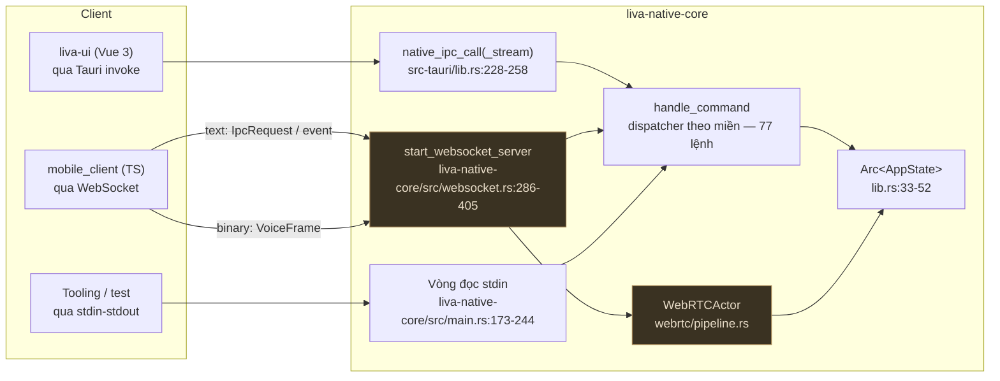
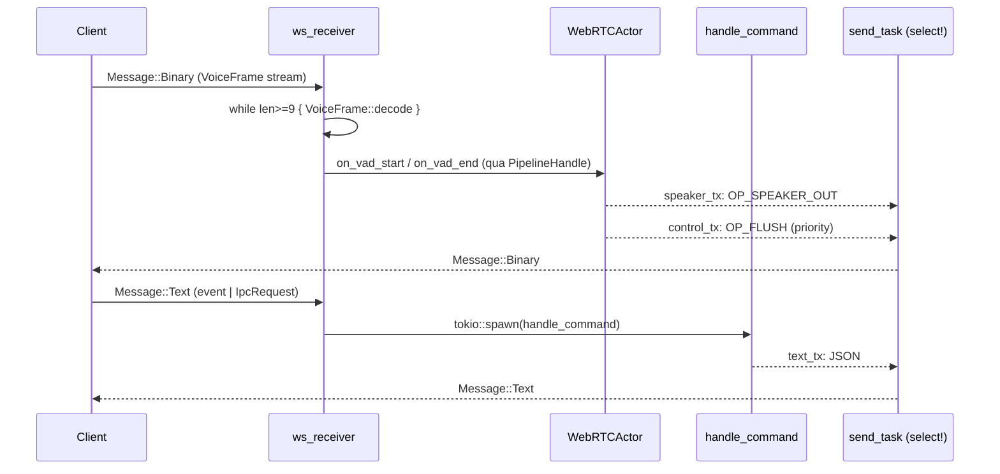
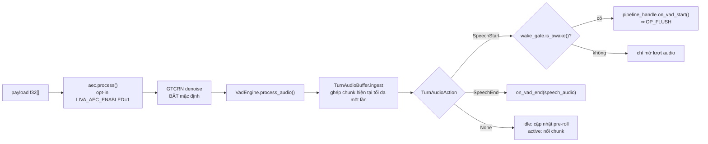
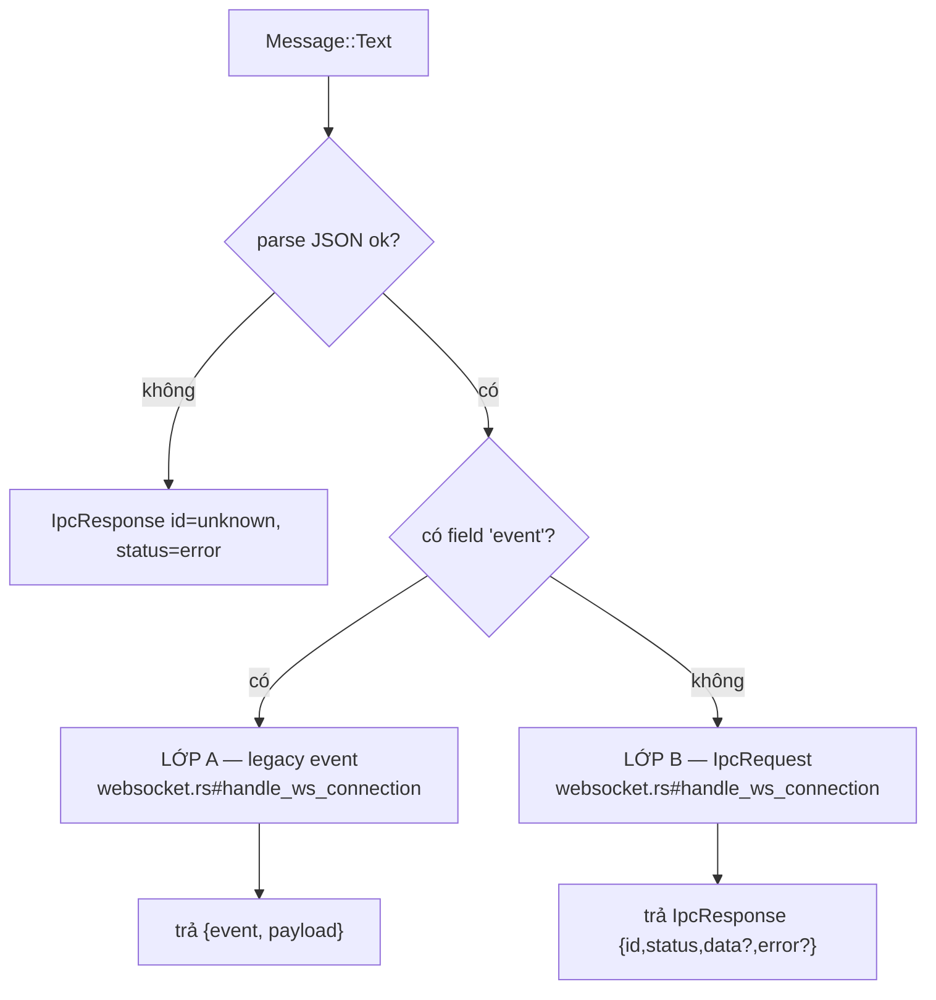
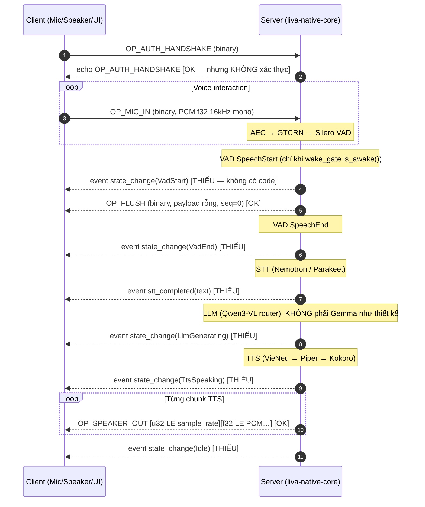

# Giao thức IPC và WebSocket

[⬆ Mục lục](../README.md) · [◀ Kiến trúc tổng thể](01-kien-truc-tong-the.md) · [Đường ống thoại ▶](03-duong-ong-thoai.md)

---

> **Đây là HỢP ĐỒNG GIAO THỨC.** Bất kỳ ai viết client cho LIVA (web, Tauri, mobile, CLI, thiết bị nhúng) đều phải theo đúng tài liệu này. Mọi mục đều được trích dẫn tới dòng code thật; chỗ nào code lệch với thiết kế gốc đều được nêu rõ ở §10.

---

## Mục lục

1. [Phạm vi & hai điểm vào](#1-phạm-vi--hai-điểm-vào)
2. [`AppState` — trạng thái dùng chung](#2-appstate--trạng-thái-dùng-chung)
3. [Vòng đời khởi động — 26 bước](#3-vòng-đời-khởi-động--26-bước)
4. [Kênh vận chuyển: WebSocket server & stdio IPC](#4-kênh-vận-chuyển-websocket-server--stdio-ipc)
5. [Lớp nhị phân — khung `VoiceFrame`](#5-lớp-nhị-phân--khung-voiceframe)
6. [Lớp text — hai giao thức trên cùng một socket](#6-lớp-text--hai-giao-thức-trên-cùng-một-socket)
7. [`handle_command` — catalog lệnh theo miền](#7-handle_command--catalog-lệnh-theo-miền)
8. [Khung streaming — hai định dạng khác nhau](#8-khung-streaming--hai-định-dạng-khác-nhau)
9. [Lệnh UI gửi mà core không có handler](#9-lệnh-ui-gửi-mà-core-không-có-handler)
10. [Đối chiếu THIẾT KẾ GỐC vs AS-BUILT](#10-đối-chiếu-thiết-kế-gốc-vs-as-built)
11. [Checklist cho người viết client](#11-checklist-cho-người-viết-client)
12. [Bắt đầu nhanh — client chạy được trong một file](#12-bắt-đầu-nhanh--client-chạy-được-trong-một-file)

---

## 1. Phạm vi & hai điểm vào

> **Viết lại 26/07/2026.** Mục này trước đây mở đầu bằng *"không phải điểm vào nào cũng mở
> WebSocket"* và kết luận đường voice duplex **[MỘT PHẦN]** — chỉ sống khi chạy tay binary
> standalone. Đối chiếu lại mã nguồn: **sai**. Vỏ Tauri vẫn spawn WS server (đã vậy từ trước bản
> gộp boot), và từ 26/07/2026 hai vỏ dùng chung `boot.rs#build_app_state` +
> `#spawn_background_services`. Nguyên văn cũ ở §1.2.

Cùng một `AppState` + `handle_command`, dựng ở hai điểm vào — nhưng cả hai đi qua **cùng một** hàm
khởi động, nên **cả hai đều mở WebSocket 8002**. Khác biệt ở góc nhìn giao thức chỉ còn một dòng:

- **`liva-native-core`** (bin standalone, `liva-native-core/src/main.rs#main`) — WS 8002 **+** stdio IPC.
- **`liva-desktop`** (vỏ Tauri, `lib.rs#run`) — WS 8002 **+** Tauri `invoke` (không dùng stdio).

Cụm thoại VAD/denoise/turn-shadow/AEC dựng qua `VoiceRuntimeComponents::from_env` ở **cả hai**, và
bot Telegram chạy ở cả hai khi có `TELEGRAM_BOT_TOKEN`.

> ⚠ **Hệ quả mới:** hai vỏ tranh cùng cổng 8002 — chạy đồng thời thì vỏ sau **bind lỗi**.

> 📌 Nguồn đầy đủ (đối chiếu từng khẳng định cũ): [Kiến trúc tổng thể §0](01-kien-truc-tong-the.md) ·
> cách chạy: [Triển khai và runtime](../02-van-hanh/03-trien-khai-va-runtime.md)

⇒ **Đường voice duplex nhị phân** (OP_MIC_IN → VAD → barge-in → OP_SPEAKER_OUT) sống ở luồng
`npm run dev`. Trạng thái **[OK]** về mặt nối dây; giới hạn còn lại là **đo lường** — chưa có bản
ghi một phiên barge-in đầu-cuối trên vỏ desktop thật.

### 1.1 Ba kênh IPC tồn tại trong repo

| Kênh | Điểm vào | Định dạng | Trạng thái |
|---|---|---|---|
| WebSocket `ws://127.0.0.1:8002/ws` | `websocket.rs#WebSocketServer::run` | nhị phân `VoiceFrame` + text (2 lớp) | **[OK]** — mở ở **cả hai** vỏ |
| stdin/stdout dòng-JSON | `main.rs#async_main` | `IpcRequest` → `IpcResponse`, mỗi bản ghi 1 dòng + `\n` + flush | **[OK]** — chỉ ở gateway standalone |
| Tauri `invoke` | `liva-desktop/src-tauri/src/lib.rs#native_ipc_call` | `native_ipc_call` / `native_ipc_call_stream` | **[OK]** — kênh UI desktop thật đang dùng |

Cả ba kênh cuối cùng đều đổ vào **cùng một** `handle_command` (§7).

### 1.2 Nguyên văn bản trước (hồ sơ)

<details><summary>Kết luận cũ về hai điểm vào — <b>đừng dùng làm nguồn</b></summary>

> - **`liva-desktop`** (vỏ Tauri) — **KHÔNG** mở WS, **KHÔNG** dùng stdio (chỉ Tauri `invoke`), và
>   `vad/denoiser/turn_shadow/aec` hard-code `None`.
> - Luồng dev chuẩn **KHÔNG khởi động binary `liva-native-core`** ⇒ **gateway WebSocket 8002 không
>   chạy**; vỏ Tauri vẫn `emit("gateway-ready", {"port": 8002, "token": null})` kèm comment sai sự
>   thật ("Gateway is already running on port 8002 (started by start_all.ps1)").
>
> ⇒ Toàn bộ đường voice duplex nhị phân chỉ sống khi chạy binary `liva-native-core` **thủ công**.

Cả ba vế đều đã hết đúng: vỏ Tauri **có** mở WS và **có** cụm thoại (sai từ trước bản gộp);
`gateway-ready` nay phát **sau khi bind thật**, mang cổng thật từ `server.local_addr()`; comment sai
sự thật đã không còn trong mã. `start_all.ps1` dọn 8002 trước khi bật là **điều kiện cần** để vỏ
Tauri bind được, không phải một lỗ hổng.

</details>

### 1.2 Sơ đồ tổng thể các kênh



---

## 2. `AppState` — trạng thái dùng chung

`liva-native-core/src/lib.rs:33-52` — **đủ 13 field, kèm kiểu**:

```rust
pub struct AppState {
    pub db: DatabasePool,                                                     // r2d2: .writer + .readers pools
    pub crypto: EncryptionEngine,                                             // AES-GCM, KHÔNG khoá
    pub stt: tokio::sync::Mutex<SttManager>,
    pub tts: tokio::sync::Mutex<Option<TtsManager>>,
    pub tts_player: TtsAudioPlayer,                                           // KHÔNG khoá (nội bộ tự khoá)
    pub llm: tokio::sync::Mutex<LlamaRouterManager>,
    pub vad: tokio::sync::Mutex<Option<webrtc::vad::VadEngine>>,
    pub denoiser: tokio::sync::Mutex<Option<webrtc::denoise::GtcrnDenoiser>>,
    pub turn_shadow: tokio::sync::Mutex<Option<webrtc::turn_shadow::SmartTurnClassifier>>,
    pub aec: tokio::sync::Mutex<Option<webrtc::aec::SelfEchoCanceller>>,
    pub mcp_server: Arc<mcp::server::NativeMcpServer>,
    pub vision: tokio::sync::Mutex<VisionManager>,
    pub embedder: tokio::sync::Mutex<Option<llm::embedder::EmbeddingEngine>>,   // model ONNX riêng, KHÔNG dùng LlamaContext
}
```

| # | Field | Kiểu | Có khoá? | Ghi chú |
|---:|---|---|---|---|
| 1 | `db` | `DatabasePool` | không (pool riêng) | `writer` `max_size(1)` + `readers` `max_size(4)` mở `SQLITE_OPEN_READ_ONLY` — `db.rs:147-161` |
| 2 | `crypto` | `EncryptionEngine` | không | AES-256-GCM, chỉ dùng cho `facts.value` |
| 3 | `stt` | `tokio::sync::Mutex<SttManager>` | có | Nemotron RNN-T / Parakeet CTC |
| 4 | `tts` | `tokio::sync::Mutex<Option<TtsManager>>` | có | `None` nếu model TTS thiếu |
| 5 | `tts_player` | `TtsAudioPlayer` | không | tự khoá bên trong |
| 6 | `llm` | `tokio::sync::Mutex<LlamaRouterManager>` | có | **một** Mutex cho chat + embed + vision + swap |
| 7 | `vad` | `tokio::sync::Mutex<Option<VadEngine>>` | có | `None` trong Tauri |
| 8 | `denoiser` | `tokio::sync::Mutex<Option<GtcrnDenoiser>>` | có | `None` trong Tauri |
| 9 | `turn_shadow` | `tokio::sync::Mutex<Option<SmartTurnClassifier>>` | có | `None` trong Tauri |
| 10 | `aec` | `tokio::sync::Mutex<Option<SelfEchoCanceller>>` | có | `None` trong Tauri |
| 11 | `mcp_server` | `Arc<NativeMcpServer>` | không | đã nối vào dispatcher: `mcp:list_tools` (`liva-native-core/src/lib.rs#handle_command`) + `mcp:call_tool` (`liva-native-core/src/lib.rs#handle_command`) |
| 12 | `vision` | `tokio::sync::Mutex<VisionManager>` | có | WGC qua `xcap` |
| 13 | `embedder` | `tokio::sync::Mutex<Option<EmbeddingEngine>>` | có | model ONNX 384 chiều **tách khỏi** `llm` (`llm/embedder.rs`); `None` khi thiếu `models/embedding/` ⇒ RAG im lặng bỏ qua |

Đặc điểm quan trọng đối với người viết client:

- **Toàn bộ dùng `tokio::sync::Mutex`, không có `RwLock` nào.** Không có `Arc` bên trong trừ `mcp_server`.
- Chia sẻ bằng `Arc<AppState>` clone cho từng task (`main.rs:274, 286, 313, 321, 346, 409`) và **cho mỗi kết nối WS** (`liva-native-core/src/websocket.rs:300-465`).
- Chuỗi DSP của mic chạy trong `spawn_blocking`; các mutex đồng bộ bên trong
  `VoiceSessionAudio::process_mic` không chặn Tokio worker.
- **Điểm nghẽn kiến trúc:** `state.llm` là **một** Mutex duy nhất cho chat + embed + vision + swap_model. Một lượt sinh token (blocking) khoá luôn mọi lệnh LLM khác ⇒ client **không nên** phát song song `chat:completion` và `vision:ask`.
- **Model audio dùng chung, stream state per-WebSocket (23/07/2026).**
  `AppState.vad`/`denoiser` giữ model ONNX đã load; mỗi `handle_ws_connection` tạo một
  `VoiceSessionAudio`. `VadEngine::fork_session()` và
  `GtcrnDenoiser::fork_session()` dùng chung `Arc<Mutex<Session>>` nhưng cấp mới
  toàn bộ recurrent/debounce/STFT cache. AEC tạo object + render/capture queue
  mới và handle đó được truyền thẳng vào `WebRTCActor` của cùng socket. Hai client
  không còn trộn audio state; inference trên cùng model vẫn được serialize để
  `ort::Session::run` an toàn.

  > 📌 Nguồn đầy đủ (chi tiết state hồi quy từng engine): [Đường ống thoại](03-duong-ong-thoai.md)

---

## 3. Vòng đời khởi động — 26 bước

### 3.1 `fn main()` — dựng runtime thủ công

`liva-native-core/src/main.rs:30-49` — **không** dùng `#[tokio::main]`:

| Bước | Việc | Dòng | Mặc định |
|---|---|---|---|
| 1 | `LIVA_TOKIO_WORKER_THREADS` | 31-34 | `available_parallelism()` → fallback 4 |
| 2 | `LIVA_TOKIO_MAX_BLOCKING_THREADS` | 36-39 | **512** |
| 3 | `Builder::new_multi_thread().enable_all().build()` → `rt.block_on(async_main())` | 41-48 | |

### 3.2 Trình tự khởi động — nay DÙNG CHUNG cho cả hai vỏ

> **Viết lại 26/07/2026.** Bảng cũ liệt kê "26 bước của `async_main()`" và có cột "Tauri **không**
> có bước này". Cả hai đã hết đúng: từ bản gộp boot, `async_main` chỉ còn dựng logger, gọi
> `boot::build_app_state` + `boot::spawn_background_services`, rồi chạy vòng stdin. Mọi bước dựng và
> mọi dịch vụ nền nằm trong `boot.rs` và **giống hệt nhau ở hai vỏ**.

**A · `boot.rs#build_app_state` — dựng trạng thái (dùng chung).** Lỗi ở đây trả `BootError` có
`context` + `detail` + gợi ý khắc phục; vỏ tự chọn cách hiện (stderr+`exit 1` hay hộp thoại).

| # | Việc | Ghi chú lỗi |
|---|---|---|
| 1 | `LIVA_DB_PATH` + `create_dir_all(parent)` | |
| 2 | `env_flag("LIVA_DB_IN_MEMORY", false)` → `DatabasePool::new_in_memory()` hoặc `::new(&db_path)` | **`BootError::db`** — kèm gợi ý thiếu `vec0` |
| 3 | `resolve_and_rekey` — khoá thật từ env → khoá thiết bị DPAPI, rekey facts | lỗi → `BootError`, có chỉ dẫn khôi phục |
| 4 | `rodio::OutputStream::try_default()` + `Sink::try_new` | lỗi → `None` + `error!`, **không** fatal |
| 5 | Resolve 3 đường model qua `resolve_resource_path` | thử prefix `""`, `".."`, `"../.."` |
| 6 | `stt::SttManager::new(&stt_model_dir)` | |
| 7 | `TtsAudioPlayer::new` + `TtsManager::from_bin(...)` | lỗi → `None` + `error!` |
| 8 | `LIVA_LLM_N_CTX` (4096) · `LIVA_LLM_N_GPU_LAYERS` (0) → `LlamaRouterManager::new` | lỗi → `BootError` |
| 9 | `LIVA_VAULT_PATH` → `NativeMcpServer::new` | |
| 10 | `NativeScreenCapturer::new(0)` → `VisionManager::new` | hard-code display 0 |
| 11 | `llm::embedder::EmbeddingEngine::load` — model embedding cho RAG | thiếu model → `None` + `warn!` (**không** fatal) |
| 12 | `VoiceRuntimeComponents::from_env` — VAD · denoise · turn-shadow · AEC | VAD+denoise **bật** mặc định; turn-shadow+AEC **opt-in** |
| 13 | `Arc::new(AppState { … })` | |

**B · `boot.rs#spawn_background_services` — dịch vụ nền (dùng chung).**

| # | Dịch vụ | Ghi chú |
|---|---|---|
| 14 | `memory_consolidation::spawn_projection_consumer` | phóng chiếu event→vector ngoài đường nóng |
| 15 | `load_configured_router_model(state, false)` | autoload router LLM |
| 16 | Vòng GPU downshift game-aware (`LIVA_GAME_N_GPU_LAYERS`) | **early-return nếu `normal_layers == 0`** |
| 17 | `WebSocketServer::bind_from_env()` → `run(state)` | ⇐ **giao thức WS bắt đầu sống từ đây, ở CẢ HAI vỏ** |
| 18 | interval 60s → `tts.check_idle_unload()` | trước 26/07/2026 **chỉ gateway có** — vỏ desktop giữ session ONNX vĩnh viễn |
| 19 | Telegram: `TELEGRAM_BOT_TOKEN` + `TELEGRAM_ALLOWED_IDS` (CSV) | trước 26/07/2026 **chỉ gateway có**; bỏ qua nếu không có token |
| 20 | `std::thread` poll `Governor::game_mode_active()` mỗi 5s | ưu tiên CPU, không cần runtime async |

**C · Riêng gateway (`main.rs#async_main`).**

| # | Việc | Ghi chú |
|---|---|---|
| 21 | `FmtSubscriber` + `tracing_env_filter()`, **writer = stderr** | stdout dành riêng cho IPC |
| 22 | `mpsc::channel::<String>(100)` → truyền vào `ServiceOptions.ipc_tx` | phải dựng **trước** bước 19 |
| 23 | Task ghi stdout: mỗi msg + `\n` + `flush` | |
| 24 | Vòng đọc stdin line-by-line → `IpcRequest` → `tokio::spawn(handle_command(...))` | |
| 25 | `boot::stop_background_services` → `drop(tx)` → `writer_handle.await` | huỷ sạch trước khi đóng stdout |

> **Đính chính 22/07/2026 cho bước 3:** trước đây chỗ này chỉ hỏi biến **có tồn tại hay không** (`.is_ok()`), nên `LIVA_DB_IN_MEMORY=false` — đúng như `.env.example` hướng dẫn — lại **bật** DB in-memory và xoá sạch dữ liệu mỗi lần khởi động. Nay đi qua helper `env_flag(key, default)` (`lib.rs:84`): chỉ `1/true/yes/on` mới bật. ~~"`LIVA_DB_IN_MEMORY` (chỉ cần *tồn tại*)"~~ — mô tả cũ, không còn đúng.

Bảng trên chỉ ghi giá trị mặc định **tại đúng chỗ nó được đọc trong `main.rs`**, đủ để hiểu thứ tự khởi động; nó không phải danh mục biến môi trường.

> 📌 Nguồn đầy đủ (bảng biến môi trường, lệch `.env.example` vs code): [Cấu hình và biến môi trường](../02-van-hanh/01-cau-hinh-va-bien-moi-truong.md)

### 3.3 `liva-desktop/src-tauri/src/lib.rs#run` — Tauri shell (khác biệt)

> **Viết lại 26/07/2026.** Bản trước liệt kê "4 luồng nền" riêng của Tauri và kết luận
> *"**Không** spawn `start_websocket_server`; **không** có task unload TTS idle 60s"*. Cả hai vế đã
> hết đúng — vỏ Tauri gọi `boot::spawn_background_services` như gateway.

Trình tự **giống hệt** gateway ở phần A và B của §3.2. Chỉ khác:

- `tracing_subscriber::fmt()...try_init()` thay cho `FmtSubscriber` + writer stderr — vỏ Tauri
  không dùng stdout cho IPC nên không cần tách. Filter đọc từ `RUST_LOG` bằng cùng
  `tracing_env_filter()`, để hai vỏ không trôi dạt.
- Escrow khoá và lỗi boot hiện bằng **hộp thoại** (`keystore::show_message_box`), vì vỏ Tauri không
  có console.
- `std::mem::forget(audio_stream)` giữ `rodio::OutputStream` sống vĩnh viễn (gateway giữ nó bằng
  một binding sống hết `async_main` — cùng hiệu quả).
- `ServiceOptions.on_gateway_ready` phát sự kiện `gateway-ready` cho cửa sổ **sau khi** WS bind
  xong, mang cổng thật; `ipc_tx: None` vì không có stdout IPC.
- Luồng nền **riêng của vỏ**: hit-test con trỏ 30 ms cho ghost mode (`std::thread`, không thuộc
  `boot`).
- Vault Stronghold: khoá per-machine niêm phong DPAPI qua
  `liva-desktop/src-tauri/src/lib.rs#get_vault_key` — plugin `tauri_plugin_stronghold` và mật khẩu
  hard-code **đã gỡ** (H2, 23/07/2026).

> 📌 Nguồn đầy đủ (bảng lệnh Tauri `invoke`, cấu hình cửa sổ, ghost mode): [Desktop Tauri](../03-he-thong-con/desktop-tauri.md)

---

## 4. Kênh vận chuyển: WebSocket server & stdio IPC

### 4.1 Server và handshake

`WebSocketServer::bind_from_env()` + `WebSocketServer::run(state)` — `websocket.rs`.

| Thuộc tính | Giá trị | Dòng |
|---|---|---|
| Bind | `LIVA_SERVER_HOST:LIVA_SERVER_PORT` = `127.0.0.1:8002` | 469-471 |
| Endpoint | `/ws` | 490-506 |
| Log | `WebSocket server listening on ws://{addr}/ws` | — |
| Kiểm path | `accept_hdr_async` callback từ chối **ngay ở tầng HTTP**: `path != "/ws"` → `Err(reject(StatusCode::NOT_FOUND, "invalid path"))` ⇒ `WebSocketStream` không bao giờ được dựng | 490-493 |
| Kiểm `Origin` | allow-list `origin_allowed()`; không khớp → HTTP **403 `"origin not allowed"`** | 494-504 |
| Auth | Loopback mặc định remote; non-loopback bắt buộc Bearer 32–4096 visible ASCII byte; widget/dashboard đặc quyền dùng session ticket 256-bit TTL 30 giây, single-use do Tauri capability cấp | `websocket.rs` |

**Allow-list `Origin`** (`liva-native-core/src/lib.rs#DEFAULT_WS_ALLOWED_ORIGINS`, kiểm ở `liva-native-core/src/lib.rs#origin_allowed`): `http://localhost:5173`, `http://127.0.0.1:5173`, `tauri://localhost`, `https://tauri.localhost`; mở rộng bằng `LIVA_WS_ALLOWED_ORIGINS` (CSV). Hai quy tắc biên mà người viết client phải biết:

- **Không có header `Origin` (`None`) thì CHO QUA** — chủ ý, vì client gốc (vỏ Tauri, `verify_duplex`, script kiểm thử) không gửi `Origin`. Hàng rào này nhắm vào **trang web**, nơi kẻ tấn công không đặt được `Origin`.
- `Origin` **rỗng** (`""` / toàn khoảng trắng) thì **BỊ CHẶN** — đó là dấu hiệu trình duyệt bị sandbox.

`OP_AUTH_HANDSHAKE` vẫn chỉ echo payload (§5.3), không phải authentication. Danh tính command-plane
được chốt ở HTTP upgrade: không có session thì là `WebSocketRemote`; `principal=` luôn bị 403;
session đặc quyền chỉ hợp lệ trên loopback, được cấp qua capability Tauri widget/dashboard, lưu
digest, TTL 30 giây và bị xóa khi dùng. Bearer/Origin được kiểm trước khi tiêu thụ session. Vì mọi
lệnh legacy/generic đều đi qua allow-list của principal, tiến trình local không session không thể
gọi lệnh dashboard như `llm:swap_model`.

### 4.2 `handle_ws_connection` — vòng đời một kết nối

`async fn handle_ws_connection(ws_stream: WebSocketStream<TcpStream>, state: Arc<AppState>) -> Result<(), String>` — `websocket.rs#handle_ws_connection`:

1. `ws_stream.split()` → `ws_sender` / `ws_receiver`.
2. Ba kênh ra: speaker `VoiceFrame` (capacity 128), control `VoiceFrame` (capacity 16) và text (capacity 128). `OP_FLUSH`/handshake không xếp sau audio.
3. `conversation_id = Uuid::new_v4()` — **ổn định suốt kết nối** để bộ nhớ hội thoại đọc lại được (`session_id` tăng mỗi lượt VAD nên không dùng làm khoá được) — `liva-native-core/src/websocket.rs:451-465`.
4. `VoiceSessionAudio::from_app_state(&state)` fork VAD/GTCRN stream state và tạo AEC riêng cho socket.
5. `WebRTCActor::new(state, VoiceOutbound::new(...), conversation_id, voice_session.aec_handle())`
   → `(WebRTCPipelineHandle, WebRTCActor)`; TTS chỉ feed far-end reference vào AEC của socket này.
6. `send_task` là writer duy nhất của socket. `tokio::select! { biased; ... }` ưu tiên control, sau đó speaker rồi text. Khi gửi `OP_FLUSH(epoch)`, writer nâng epoch watermark và bỏ mọi speaker frame có epoch thấp hơn còn tồn trong queue.
7. State cục bộ khác: `TurnAudioBuffer` giữ tối đa 1536 mẫu idle làm pre-roll lịch sử và
   ghép mỗi chunk đã làm sạch đúng một lần; `wake_gate = wake::WakeGate::from_env()`.
8. Vòng `while let Some(msg_res) = ws_receiver.next().await` với 3 nhánh: `Binary` (§5), `Text` (§6), `Close` → break.
9. Cleanup: `pipeline_handle.on_interrupted()`, `send_task.abort()`, `actor_handle.abort()`; `VoiceSessionAudio` drop theo kết nối.



### 4.3 stdio IPC — cùng schema, khác vận chuyển

- **Vào:** mỗi dòng stdin là một JSON `IpcRequest` (`liva-native-core/src/main.rs:173-244`, parse ở `:389`).
- **Ra:** mỗi phản hồi là một JSON `IpcResponse` + `\n` + flush (`liva-native-core/src/main.rs:158-171`).
- **stdout là kênh dữ liệu thuần** — log đi stderr (bước 1 §3.2). Client **không** được kỳ vọng log trên stdout.

Struct dây (`main.rs:13-28`):

```rust
#[derive(Debug, Deserialize)]
struct IpcRequest {
    id: String,
    command: String,
    payload: serde_json::Value,
}

#[derive(Debug, Serialize)]
struct IpcResponse {
    id: String,
    status: String,                                       // "ok" | "error"
    #[serde(skip_serializing_if = "Option::is_none")]
    data: Option<serde_json::Value>,
    #[serde(skip_serializing_if = "Option::is_none")]
    error: Option<String>,
}
```

> **Lưu ý dây quan trọng:** `data` và `error` dùng `skip_serializing_if = "Option::is_none"` ⇒ khi thành công, trường `error` **hoàn toàn vắng mặt** (không phải `null`). Thiết kế gốc ghi `"error": null` — client phải chấp nhận cả hai (§10).

---

## 5. Lớp nhị phân — khung `VoiceFrame`

### 5.1 Định nghĩa

`liva-native-core/src/webrtc/frame.rs` (191 dòng; phần hợp đồng dây là 1-57, phần còn lại là `mod frame_tests` từ dòng 60):

```rust
pub const OP_AUTH_HANDSHAKE: u8 = 0x00;
pub const OP_MIC_IN: u8 = 0x01;
pub const OP_SPEAKER_OUT: u8 = 0x02;
pub const OP_FLUSH: u8 = 0x03;
pub const OP_ACK_PLAYING: u8 = 0x04;

pub struct VoiceFrame { pub op_code: u8, pub seq_id: u32, pub payload: Bytes }
impl VoiceFrame {
    pub fn encode(&self) -> Result<Bytes, String>;                 // giới hạn payload 1 MiB
    pub fn decode(src: &mut BytesMut) -> Result<Option<Self>, String>;
}
```

### 5.2 Sơ đồ header 9 byte

Header **9 byte, little-endian**, rồi payload thô:

```
 byte 0     byte 1   byte 2   byte 3   byte 4
+---------+--------+--------+--------+--------+
| op_code |          seq_id  (u32 LE)         |
+---------+--------+--------+--------+--------+
 byte 5     byte 6   byte 7   byte 8
+--------+--------+--------+--------+
|        payload_len (u32 LE)       |
+--------+--------+--------+--------+
 byte 9 …
+-----------------------------------------------+
|            payload (payload_len byte)          |
+-----------------------------------------------+
```

Quy tắc mã hoá / giải mã (`frame.rs:20-56`):

| Quy tắc | Chi tiết | Dòng |
|---|---|---|
| Giới hạn payload khi **encode** | `payload.len() > 1024*1024` → `Err("Payload exceeds 1MB limit")` | 21-23 |
| Thứ tự ghi | `put_u8(op_code)` → `put_u32_le(seq_id)` → `put_u32_le(len)` → `put_slice(payload)` | 25-28 |
| Thiếu header khi **decode** | `src.len() < 9` → `Ok(None)` (chưa đủ khung) | 33-35 |
| Giới hạn payload khi **decode** | `payload_size > 1024*1024` → `Err` | 40-42 |
| Thiếu payload | `src.len() < 9 + payload_size` → `Ok(None)` | 44-46 |
| Tiêu thụ | `src.advance(9)` + `src.split_to(payload_size)` | 48-49 |

> **1 MiB = 1.048.576 byte**, áp dụng cho **payload**, không tính 9 byte header. Với PCM f32 mono 16 kHz, 1 MiB ≈ 262.144 mẫu ≈ 16,4 giây audio — thực tế client nên gửi chunk ~20-100 ms.

**Framing kiểu stream:** server đọc trong vòng `while bytes_mut.len() >= 9 { VoiceFrame::decode(...) }` (`liva-native-core/src/websocket.rs:555-567`) ⇒ **nhiều `VoiceFrame` có thể nằm trong một WebSocket binary message**, và một khung dở dang sẽ bị bỏ (`Ok(None)` → `break`) chứ **không** được nối sang message kế tiếp. ⇒ **Client PHẢI gửi trọn vẹn từng khung trong một WS message** (hoặc gửi nhiều khung nguyên vẹn trong một message), không được cắt khung ngang giữa hai message.

### 5.3 Bảng 6 opcode — đầy đủ

| Op | Hex | Hướng | Payload | Server xử lý | Client xử lý | Trạng thái |
|---|---|---|---|---|---|---|
| `OP_AUTH_HANDSHAKE` | `0x00` | C↔S | tuỳ ý (mobile gửi chuỗi UTF-8 `"auth_token"`) | Echo nguyên payload + `seq_id` để tương thích framing (`liva-native-core/src/websocket.rs:569-578`); xác thực thật đã diễn ra ở HTTP handshake/session principal trước đó | `mobile_client/src/services/WebSocketClient.ts:185` chờ frame cùng `seqId` | **[OK tương thích]** — không được xem opcode này là hàng rào auth |
| `OP_MIC_IN` | `0x01` | C→S | PCM **f32 LE mono 16 kHz** thô, **không** header sample-rate | Cắt cho chia hết 4 (`len_rounded = (len/4)*4`, `liva-native-core/src/websocket.rs:415-430`), `bytemuck::cast_slice` nếu con trỏ căn 4-byte, ngược lại decode thủ công `f32::from_le_bytes` (`liva-native-core/src/websocket.rs:415-430`). Chuỗi trong **một** `spawn_blocking`: AEC → GTCRN → VAD (`liva-native-core/src/websocket.rs:707-790`) | `liva-ui/src/composables/useVoicePipeline.ts:353` qua `serializeVoiceFrame(OP_MIC_IN, micSeqId, …)`; `mobile_client` cũng 9 byte | **[OK]** — cả hai client đúng hợp đồng (sửa 22/07/2026, xem §10.2) |
| `OP_SPEAKER_OUT` | `0x02` | S→C | `[u32 LE turn_epoch][u32 LE sample_rate][f32 LE PCM…]` | Tách thành frame 100 ms; `seq_id` là thứ tự chunk trong lượt. Sender lấy permit rồi kiểm lại cancellation epoch trước khi enqueue | UI parse epoch + sample rate; `SpeakerEpochGate` bỏ frame cũ | **[OK]** |
| `OP_FLUSH` | `0x03` | S→C | rỗng; `seq_id = generation_epoch` | Gửi qua control queue riêng trong `cancel_active_operations()` sau khi tăng epoch | Nâng epoch watermark, dừng queue đang phát; frame có epoch thấp hơn bị bỏ | **[OK]** |
| `OP_ACK_PLAYING` | `0x04` | C→S (thiết kế) | — | **Không nơi nào trong Rust đọc/ghi**; rơi vào `_ => {}` (`liva-native-core/src/websocket.rs:825`) | Chỉ có hằng số trong TS (`WebSocketClient.ts:8`) và doc-comment giữ chỗ (`frame.rs:7-10`) | **[THIẾU]** code chết hai đầu |
| `OP_WAKE_PROBE` | `0x05` | C→S | PCM **f32 LE mono 16 kHz** — MỘT câu ứng viên đã cắt sẵn (không phải luồng) | Từ chối ngoài khoảng 0,3–4,0 s trước khi tốn STT. Rồi `wake_gate.score_clip` (classifier) HOẶC `stt.transcribe_for_wake` + `wake_gate.matches_phrase`. **Không chạm pipeline**: không AEC/GTCRN/VAD, không `TurnAudioBuffer`, không `on_vad_end` | `useVoicePipeline.ts` gửi khi `LivaWakeWorker` cắt được một cụm; nghe sự kiện text trả về | **[OK]** — thêm 27/07/2026, xem [Đường ống thoại §9](03-duong-ong-thoai.md) |

**Vì sao `OP_WAKE_PROBE` phải là opcode riêng chứ không tái dùng `OP_MIC_IN`:** khung `OP_MIC_IN`
chạy thẳng vào `TurnAudioBuffer` → pipeline → LLM, mà `WakeGate` mặc định là `Off` (`is_awake()`
luôn `true`). Nạp audio lúc PASSIVE qua đường đó tức là biến mọi tiếng động trong phòng thành một
lượt hội thoại thật. Probe là **đường cụt có chủ đích**: nó chỉ trả lời một câu hỏi.

Hai sự kiện text trả về (đều `payload: {source, tier, score, transcript, seq_id}`):

| Sự kiện | Khi nào | Client làm gì |
|---|---|---|
| `wake_word_triggered` | classifier vượt ngưỡng **hoặc** transcript chứa cụm đánh thức | `PASSIVE → ACTIVE` |
| `wake_probe_rejected` | không tầng nào khớp | Không thức. `transcript` là **bề mặt chẩn đoán duy nhất** cho câu hỏi "sao gọi mà không thức" — soi nó rồi bổ sung `LIVA_WAKE_PHRASES` |

### 5.4 Định dạng payload từng loại — chi tiết

#### `OP_MIC_IN` (0x01) — client → server

```
payload = [f32 LE][f32 LE][f32 LE] …          // KHÔNG có sample_rate trong payload
```

- Sample rate **ngầm định 16.000 Hz mono** — server **không kiểm tra và không resample**. Nếu client gửi 48 kHz, VAD/STT vẫn chạy nhưng kết quả sai.
- Biên độ: f32 chuẩn `[-1.0, 1.0]`.
- Byte thừa (`len % 4 != 0`) bị **cắt bỏ im lặng** (`liva-native-core/src/websocket.rs:415-430`).
- Xử lý sau khi decode (`liva-native-core/src/websocket.rs:707-790`, trong một `spawn_blocking`, dùng `blocking_lock()`):



Điều **client cần biết** về barge-in: server **chỉ phát `OP_FLUSH` khi
`wake_gate.is_awake()`** — `VadEvent::SpeechStart` lúc gate đóng vẫn mở lượt audio trong
`TurnAudioBuffer`, nhưng client sẽ không thấy tín hiệu nào trên socket. Vì `LIVA_WAKE_MODE` mặc định
là **Off** (gate mở toàn phần, UX push-to-talk), hành vi mặc định là: mỗi lần VAD bắt đầu → có
`OP_FLUSH`. VAD hiện chỉ trả event theo chunk, không trả offset mẫu; do đó biên start/end và pre-roll
được xác định ở độ phân giải chunk.

> 📌 Nguồn đầy đủ (ngưỡng VAD/AEC/denoise, các mode wake `AsrPrefix`/`Hybrid`/`TrainedModel`, cụm từ đánh thức, cửa sổ tỉnh, prefill chống cắt đầu câu): [Đường ống thoại](03-duong-ong-thoai.md)

#### `OP_SPEAKER_OUT` (0x02) — server → client

```
payload = [u32 LE turn_epoch][u32 LE sample_rate][f32 LE][f32 LE] …
          └──── 4 byte ──────┘└───── 4 byte ──────┘└─ PCM, chia hết 4 ─┘
```

Hợp đồng được tạo bởi `speaker_frames(turn_epoch, sample_rate, samples)` trong `webrtc/frame.rs`:

```rust
payload.extend_from_slice(&turn_epoch.to_le_bytes());
payload.extend_from_slice(&sample_rate.to_le_bytes());
for sample in chunk_100ms { payload.extend_from_slice(&sample.to_le_bytes()); }
```

Client tham chiếu (`liva-ui/src/utils/speakerFrame.ts:36-66`) validate:
- `byteLength >= 12` (8 byte metadata + ít nhất 1 mẫu f32);
- `(byteLength - 8) % 4 == 0`;
- `8000 <= sampleRate <= 96000` (giới hạn Web Audio `AudioBuffer`);
- **luôn tôn trọng `byteOffset`** — payload bắt đầu ở byte 9 của WS frame nên **không căn 4-byte**, phải đọc qua `DataView.getFloat32(..., true)` thay vì `new Float32Array(buffer, 9, n)` (sẽ ném lỗi alignment).
- payload không parse được bị WebSocket handler **bỏ fail-closed**; không được đi qua legacy decoder vì không có epoch để chứng minh nó thuộc turn hiện tại.

> Đây là cái bẫy #1 khi viết client mới: **offset 9 không chia hết cho 4**.

#### `OP_FLUSH` (0x03) — server → client

```
payload = (rỗng, 0 byte)     seq_id = generation_epoch
```

Hành động client bắt buộc: nâng watermark lên `seq_id`, **xoá ngay hàng đợi phát và tắt tiếng**. Speaker frame đến sau nhưng có `turn_epoch < watermark` vẫn phải bị bỏ. Server đồng thời tăng `session_id`, abort 3 handle, dừng player và gửi FLUSH qua control queue ưu tiên.

> **Ghi chú mâu thuẫn nguồn (đã giải quyết):** một sơ đồ trình tự trong báo cáo khảo sát chú thích `OP_FLUSH` là "CHƯA CÓ TRONG CODE HIỆN TẠI". **Ba khu vực khảo sát độc lập** (`core-entry`, `webrtc`, `tts`) đều trích dẫn khối gửi `OP_FLUSH` (nay ở `pipeline.rs:461-466`), và `bin/verify_duplex.rs:126-145` assert `on_vad_start()` → nhận `OP_FLUSH` **< 10 ms**. Tài liệu này kết luận theo trích dẫn code: **`OP_FLUSH` được gửi thật**.

#### `OP_AUTH_HANDSHAKE` (0x00) — echo tương thích, không phải hàng rào auth

```rust
OP_AUTH_HANDSHAKE => {
    // Echo handshake back to acknowledge
    let handshake_frame = VoiceFrame {
        op_code: OP_AUTH_HANDSHAKE,
        seq_id: frame.seq_id,
        payload: frame.payload.clone(),
    };
    let _ = outgoing_tx.send(handshake_frame).await;
}
```
(`liva-native-core/src/websocket.rs:569-578`) — dùng được như **ping/pong đo RTT**.
Identity được chốt trước khi vào hàm này: Origin/path/bearer ở HTTP handshake, sau đó
session ticket Tauri ánh xạ sang principal; mọi command lại qua allow-list theo principal.

#### `OP_ACK_PLAYING` (0x04)

Không có mã xử lý. Gửi lên sẽ rơi vào `_ => {}` (`liva-native-core/src/websocket.rs:825`) và bị **nuốt im lặng** — client không nhận lỗi.

### 5.5 Máy trạng thái pipeline (ngữ cảnh cho client)

`webrtc/pipeline.rs:8-39`:

```rust
enum PipelineState { Idle, VadStart, VadEnd, SttProcessing, LlmGenerating, TtsSpeaking, Interrupted }
enum PipelineEvent {
    VadStart, VadEnd(Vec<f32>), Interrupted,
    SttCompleted { session_id, result },
    TtsSpeaking { session_id },
    LlmCompleted { … }, TtsCompleted { … },
}
```

Chống kết quả cũ bằng `active_session_id: Arc<AtomicU64>`, so khớp `session_id` ở **mọi** callback.

📌 **Dọn dẹp 22/07/2026:** ~~"`WebRTCPipelineHandle::feed_rtp_pcm(&self, _samples: &[f32])` là TODO rỗng ⇒ code chết; crate `webrtc = "0.12.0"` có trong `Cargo.toml`"~~ — cả hai đã bị **xoá khỏi mã nguồn**. Không còn `feed_rtp_pcm` ở bất cứ đâu trong `liva-native-core/src` hay `liva-desktop/src-tauri/src`, `Cargo.toml` không còn dependency `webrtc`, và `webrtc/signaling.rs` cũng đã bị xoá (`webrtc/mod.rs` nay chỉ còn `frame, vad, denoise, turn_shadow, aec, pipeline`). `impl WebRTCPipelineHandle` (`pipeline.rs:47-70`) nay chỉ còn `state` / `on_vad_start` / `on_vad_end` / `on_interrupted`. Giữ lại bối cảnh vì kết luận giao thức không đổi: **luồng thật đi qua WebSocket nhị phân, không phải RTP.**

⚠️ **Các `PipelineState` KHÔNG được phát ra socket** dưới dạng sự kiện `state_change` — xem §10.

---

## 6. Lớp text — hai giao thức trên cùng một socket

Nhánh `Message::Text` (`websocket.rs#handle_ws_connection`) thử **theo thứ tự**:

1. Parse JSON. Nếu có field `event` (chuỗi) → **Lớp A (legacy client event)**, xử lý rồi `continue`.
2. Ngược lại parse thành `IpcRequest` → **Lớp B**. Parse lỗi → trả `IpcResponse{ id: "unknown", status: "error", error: "Invalid JSON query: …" }`.



### 6.1 Lớp A — legacy client event

Vào: `{"event": "<tên>", "payload": <bất kỳ>}`. Ra: `{"event": "<tên khác>", "payload": <kết quả>}`.

**Bảng ánh xạ đầy đủ** (`websocket.rs#handle_ws_connection`):

| # | Event vào | Payload vào | → `handle_command` | Event ra | Dòng |
|---:|---|---|---|---|---|
| 1 | `get_config` | `{}` | `get_config` | `config_data` | 808 |
| 2 | `get_ai_config` | `{}` | `get_ai_config` | `ai_config` | 816 |
| 3 | `get_voice_status` | `{}` | `get_voice_status` | `voice_status` | 824 |
| 4 | `get_voice_profiles` | `{}` | `get_voice_profiles` | `voice_profiles` | 832 |
| 5 | `get_system_status` | `{}` | `get_system_status` | `system_status` | 840 |
| 6 | `get_skills_list` | `{}` | `get_skills_list` | `skills_list` | 848 |
| 7 | `get_user_profile` | `{}` | `get_user_profile` | `user_profile` | 856 |
| 8 | `get_tasks` | `{}` | `get_tasks` | `tasks_list` | 864 |
| 9 | `get_avatar_models` | `{}` | `get_avatar_models` | `avatar_models_list` | 872 |
| 10 | `get_memory_data` | `{}` | `get_memory_data` | `memory_data` | 880 |
| 11 | `user_voice_command` | `{text}` | **luồng riêng, KHÔNG qua `handle_command`** | `ai_thinking_start` → `ai_stream_start` → n×`ai_stream_chunk{textChunk,isThought}` → `ai_spoken_response{text}` → `ai_thinking_end` | 888-1010 |
| 12 | *mọi event khác* | tuỳ | `handle_command(event_name, payload, None, None)` | `Ok` → `"{event}_response"`; `Err` → `"{event}_error"` với `payload {command, error}` | 1011-1041 |

Hệ quả trực tiếp của dòng 12:
- `vision:ask` → `vision:ask_response` (khớp `liva-ui/src/composables/useGateway.ts:444`).
- `update_config` → `update_config_response`, **chứ không phải** `config_updated` — nên client không cập nhật `configData` từ phản hồi này (`useGateway.ts:391-392` chỉ khớp `config_data`/`config_updated`). **[MỘT PHẦN]**

📌 **Đính chính 22/07/2026 — lỗi không còn bị nuốt.** ~~"tất cả nhánh Lớp A đều bọc bằng `if let Ok(res) = handle_command(...)`; khi trả `Err` thì không có gì được gửi về client"~~ chỉ còn đúng với **11 nhánh có tên** (`get_config` … `user_voice_command`). Nhánh mặc định `_` nay `match` cả hai vế (`websocket.rs#handle_ws_connection`): `Err` được `warn!` rồi gửi về `{"event": "<tên>_error", "payload": {command, error}}`. Comment trong code nêu đúng lý do sửa: `vision:ask` ở build debug trả lỗi ngay nhưng người dùng phải đợi 120 giây để nhận một thông báo timeout sai. ⇒ **Người viết client vẫn nên dùng Lớp B** nếu muốn `id`/`status` chuẩn, nhưng Lớp A không còn im lặng tuyệt đối.

### 6.2 Chi tiết `user_voice_command`

`websocket.rs#handle_ws_connection`:

| Điều kiện | Nhánh | Lỗi → |
|---|---|---|
| `text.to_lowercase()` chứa `"màn hình"` hoặc `"screen"` | **vision**: `capture_for_vision()` + `llm.answer_with_image(VisionImage::Rgb{…}, TEMP_DEFAULT, TOP_P_DEFAULT, cb streaming)` | chuỗi cứng `"Xin lỗi, hiện mình chưa xem được màn hình."` |
| ngược lại | dựng `[system = PERSONA_LIVA, user = text]` → `compile_prompt` → `generate_completion` streaming | `"Xin lỗi, đã xảy ra lỗi trong quá trình xử lý."` |

Chuỗi sự kiện ra (cả hai nhánh):

```
ai_thinking_start
ai_stream_start
ai_stream_chunk  { textChunk: "...", isThought: bool }   × n
ai_spoken_response { text: "<toàn văn>" }
ai_thinking_end
```

### 6.3 Lớp B — `IpcRequest`

Vào (`websocket.rs#handle_ws_connection`):

```json
{ "id": "req_001", "command": "chat:completion", "payload": { "...": "..." } }
```

Ra:

```json
{ "id": "req_001", "status": "ok", "data": { "...": "..." } }
```
hoặc
```json
{ "id": "req_001", "status": "error", "error": "Unknown command: foo" }
```

Khác biệt then chốt so với Lớp A: `handle_command` được gọi **kèm `tx` và `req_id`** (`websocket.rs#handle_ws_connection`) ⇒ **chỉ Lớp B mới stream được**. Lớp A luôn truyền `None, None`.

---

## 7. `handle_command` — catalog lệnh theo miền

Chữ ký (`liva-native-core/src/lib.rs:320-326`):

```rust
pub async fn handle_command(
    state: Arc<AppState>,
    command: &str,
    payload: serde_json::Value,
    tx: Option<tokio::sync::mpsc::Sender<String>>,
    req_id: Option<String>,
) -> Result<serde_json::Value, String>
```

Nhánh mặc định: `Err(format!("Unknown command: {}", command))`.

**Hiện hành 07/08/2026: 77 lệnh có tên, thuộc 11 miền.** Con số được đếm từ
`commands/*::{owns,handle}` và các arm MCP/skill còn ở dispatcher; không được dùng
như một hằng số giao thức. Nguồn sự thật là danh sách lệnh ngay trong từng module:

| Miền | Số lệnh | Lệnh hiện hành | Nguồn |
|---|---:|---|---|
| Cấu hình/trạng thái | 13 | `ping`, `echo`, `status`, `get_config`, `update_config`, `get_ai_config`, `get_voice_status`, `get_voice_profiles`, `get_system_status`, `get_preflight_status`, `get_skills_list`, `get_user_profile`, `get_avatar_models` | `commands/config.rs::OWNED` |
| Task | 4 | `get_tasks`, `add_task`, `delete_task`, `update_task` | `commands/task.rs::OWNED` |
| LLM/chat | 5 | `llm:swap_model`, `llm:embed`, `llm:health_check`, `chat:completion`, `task_plan_chat` | `commands/llm.rs::OWNED` |
| Memory | 11 | `get_memory_data`, `memory:set_fact`, `memory:get_fact`, `delete_memory_fact`, `memory:delete_conversation`, `memory:delete_subject`, `memory:sweep_retention`, `consolidate_memory`, `reset_memory`, `memory:search_hybrid`, `memory:upsert_vector` | `commands/memory.rs::OWNED` |
| Vision | 6 | `vision:capture`, `vision:add_region`, `vision:remove_region`, `vision:get_changed_regions`, `vision:set_config`, `vision:ask` | `commands/vision.rs::handle` |
| Voice | 9 | `voice:stt_start`, `voice:stt_flush`, `voice:stt_chunk`, `voice:stt_stop`, `voice:set_language`, `voice:list_vieneu_voices`, `voice:set_vieneu_voice`, `voice:tts_speak`, `voice:tts_stop` | `commands/voice.rs::handle` |
| Consent | 3 | `consent:get`, `consent:grant`, `consent:revoke` | `commands/consent.rs::handle` |
| Setup | 3 | `setup:status`, `setup:fetch`, `setup:paths` | `commands/setup.rs::handle` |
| Tích hợp | 3 | `telegram:send_text`, `integration:smart_home_control`, `integrations:list` | `commands/integrations.rs::OWNED` |
| Danh bạ/nhắn tin | 8 | `contacts:list`, `contacts:upsert`, `contacts:delete`, `message:draft`, `message:confirm`, `message:cancel`, `message:pending`, `messenger:status` | `commands/messaging.rs::OWNED` |
| MCP/skill store | 12 | `mcp:list_tools`, `mcp:call_tool`, `mcp_client:list_servers`, `mcp_client:list_tools`, `mcp_client:call_tool`, `skills:sync`, `skills:list`, `skills:search`, `skills:signal`, `skills:signals`, `skills:history`, `skills:pin_ids` | match cuối `handle_command` |

Các hợp đồng quan trọng mới:

- `memory:delete_conversation` mặc định `dryRun=true`; chỉ xoá khi gửi
  `{"conversationId":"…","dryRun":false}`. Lệnh bị khoá owner `local`, xoá trong
  transaction và trả số projection đã xoá cùng trạng thái WAL checkpoint.
- `memory:delete_subject` cũng mặc định dry-run, local-only và Settings gửi
  `dryRun:false` sau modal xác nhận. Non-local owner bị core từ chối.
- `memory:sweep_retention` nhận `maxAgeDays` + `batchLimit≤25`; eligibility dựa
  trên hoạt động mới nhất. Scheduler nền mặc định tắt.
- `consolidate_memory` chỉ validation/finalization event→vector hiện hành;
  không tạo fact, summary hay L3 semantic graph.
- `message:draft` chỉ ghi bản nháp mã hoá vào SQLite; đường gửi duy nhất là
  `message:confirm` với `draftId`. Bản nháp sống qua restart, hết hạn sau 300 giây
  và không có lệnh `message:send` một nhịp.
- `setup:fetch` stream tiến độ và kiểm SHA-256; `setup:paths` trả đúng các thư mục
  trên máy đang chạy.
- `llm:swap_model` hiện kiểm đường dẫn phải nằm dưới thư mục model được cấu hình;
  khẳng định “không validate path” trong snapshot cũ đã hết đúng.
- `get_preflight_status` chỉ được cấp cho Dashboard local. Nó trả
  `{items:[{name,available,status,consequence}]}` từ chính `preflight::thu_thap`, nên CLI
  `--preflight` và màn hình System không tự suy diễn hai bộ trạng thái khác nhau.

<details>
<summary>Snapshot 44 lệnh ngày 22/07/2026 — chỉ để truy nguyên, không dùng làm contract</summary>

Các số dòng và cột “UI gọi?” dưới đây là ảnh chụp trước khi dispatcher được tách
theo miền. Chúng được giữ lại để giải thích lịch sử, không phải danh sách đầy đủ
hay toạ độ code hiện hành.

Ký hiệu: `*` = bắt buộc. Cột "Dòng" là số dòng trong `liva-native-core/src/lib.rs`.

| # | Lệnh | Payload | Trả về (Ok) | Dòng | UI gọi? | Trạng thái |
|---:|---|---|---|---|---|---|
| 1 | `ping` | — | `{"pong": true}` | 330 | mobile | **[OK]** |
| 2 | `vision:capture` | — | `{width, height, format:"png", data(base64), raw_bytes, png_bytes}`; cập nhật `last_frame` | 333-379 | **không** | **[OK]** — từ 22/07/2026 trả **PNG**: đo thật 1920×1080 payload **10,55 MB → 1,01 MB** (giảm 90,4%). `format` nay là `"png"`, KHÔNG còn là tên biến thể `PixelFormat`, và `data` là file PNG hoàn chỉnh |
| 3 | `vision:add_region` | `ScreenRegion{id,name,x,y,width,height,threshold}` | `{"success":true}` | 358-364 | **không** | **[MỘT PHẦN]** |
| 4 | `vision:remove_region` | `{id*}` | `{"success":true}` | 365-372 | **không** | **[MỘT PHẦN]** |
| 5 | `vision:get_changed_regions` | — | `[RegionDiffResult{region_id,name,difference,is_changed}]`; lần đầu (`last_frame=None`) trả baseline `difference=1.0, is_changed=true` | 409-456 | **không** | **[OK]** — UI "Canh chừng màn hình" poll mỗi 3 s từ 22/07/2026 |
| 6 | `vision:set_config` | `VisionConfig{color_tolerance,max_regions}` | `{"success":true}` | 421-427 | **không** | **[MỘT PHẦN]** |
| 7 | `echo` | bất kỳ | chính payload | 429 | không | **[OK]** |
| 8 | `status` | — | `{engine:"LIVA Native Engine", status:"healthy", version:CARGO_PKG_VERSION}` | 430-434 | không | **[OK]** |
| 9 | `get_config` | — | nội dung `data/liva-config.json`; thiếu file → object mặc định lớn (`avatar/ai/ui/system/voice`) | 435-487 | có | **[OK]** |
| 10 | `update_config` | patch JSON | `{"success":true}`; deep-merge `merge_json` rồi ghi file; có key `ai` → spawn `load_configured_router_model(state, force=true)` | 488-511 | có | **[OK]** |
| 11 | `get_ai_config` | — | phần `ai` của config, hoặc defaults | 512-535 | có | **[OK]** |
| 12 | `get_voice_status` | — | `{stt: "ready"\|"offline", tts: …}` (`stt.model_dir.exists()`, `tts.is_some()`; hack test: `model_dir == "non_existent_dir"` ⇒ ready) | 536-556 | có | **[OK]** |
| 13 | `get_voice_profiles` | — | mảng **chuỗi** tên file trong `data/voices` (path tương đối, **không** qua `resolve_resource_path`) | 557-572 | có | **[MỘT PHẦN]** — UI mong mảng object |
| 14 | `get_system_status` | — | object health lớn — **phần lớn là số cứng giả** (`cpuUsage:12`, `uptime:3600`, `totalMemory:16000000000`…); chỉ `modelLoaded`/`model`/`aiEngine.status` là thật | 573-611 | có (poll 3s) | **[MỘT PHẦN]** |
| 15 | `get_skills_list` | — | `mcp_server.list_skills()` — **7 tool**, cùng nguồn với `system_status` (sửa 07/08/2026, mục U23) | `commands/config.rs` | có | **[OK]** |
| 16 | `get_user_profile` | — | `data/user_profile.json`, hoặc profile hardcode | 617-638 | có | **[OK]** |
| 17 | `get_tasks` | — | `{tasks:[{id,title,description,status,priority,result,createdAt,updatedAt}]}` từ SQLite `tasks` | 639-673 | có | **[OK]** |
| 18 | `add_task` | `{title*, description, priority="medium", status="pending", id?}` | `{"success":true,"id":…}` (id = `rand::random::<u64>()` nếu thiếu) | 674-709 | có | **[OK]** |
| 19 | `delete_task` | `{id*}` | `{"success":true}` | 710-731 | có | **[OK]** |
| 20 | `update_task` | `{id*, updates:{title?,description?,status?,priority?,result?}}` | `{"success":true}` (transaction read-modify-write) | 732-791 | có | **[OK]** |
| 21 | `task_plan_chat` | `{taskId*, message\|text*, temperature?, top_p?, stream?}` — `stream` mặc định `tx.is_some()` | stream: chunk `{taskId, message, done:false}`; cuối `{taskId, message, done:true}`. Prompt `SYS_TASK_PLANNER`; title/desc bọc `<user_task_title>` + `sanitize_untrusted` | 792-892 | có | **[OK]** — chunk **không** bọc `IpcResponse` |
| 22 | `get_avatar_models` | — | `{models2d, models3d}` mảng **chuỗi**, từ `models/live2d`, `models/vrm` | 893-927 | có | **[MỘT PHẦN]** — lệch schema UI |
| 23 | `get_memory_data` | — | `{l0, l0_5:"", facts, events, vectors}`; `facts.value` được `crypto.decrypt` | 928-1063 | có | **[MỘT PHẦN]** — events/vectors + projection consumer có thật; `l0`/L3 và semantic consolidator chưa có |
| 24 | `memory:set_fact` | `db::Fact` (13 field, **không** `serde(default)`) | `{"success":true}` | 1064-1083 | **không** | **[MỘT PHẦN]** |
| 25 | `memory:get_fact` | `{key*}` | `Fact` hoặc `null` | 1084-1107 | **không** | **[MỘT PHẦN]** |
| 26 | `memory:search_hybrid` | `{query_text*, query_vector?:[f32], top_k=5, filter:{type*:string,...}, dense_weight=1.0, sparse_weight=1.0}` | kết quả `search_hybrid_vectors` (RRF K=60) | 1138-1215 | **không** | **[OK]** — command thô bắt buộc `filter.type` rõ ràng và từ chối `conversation_turn` vì chưa có owner identity do server xác thực; domain client tự khai không phải ranh giới bảo mật. `query_vector` tuỳ chọn: thiếu thì server tự embed; thiếu model embedding thì trả lỗi có hướng khắc phục |
| 27 | `memory:upsert_vector` | `{vecId*, type*, content*, vector*:[f32], domain?, category?, traceKeywords?, fileTarget?, sourceEventIds?}` | `{"success":true}` | 1168-1253 | **không** | **[MỘT PHẦN]** |
| 28 | `voice:stt_start` | — | `{"success":true}` (`reset_stream`) | 1254-1257 | **không** | **[MỘT PHẦN]** |
| 29 | `voice:stt_chunk` | `{chunk*: base64 f32 LE PCM, isLast=false}` | `{text}` | 1258-1288 | **không** | **[MỘT PHẦN]** |
| 30 | `voice:stt_stop` | — | `{text}` (`feed_audio(&[], true)`) | 1289-1299 | mobile | **[MỘT PHẦN]** |
| 31 | `voice:stt_flush` | — | `{"success":true}` (giống `stt_start`) | 1300-1303 | **không** | **[MỘT PHẦN]** |
| 32 | `voice:set_language` | `{language*}` | `{"success":true, language}` — set cả STT lẫn TTS | 1304-1317 | **không** | **[MỘT PHẦN]** — ngôn ngữ thực tế cố định bằng env |
| 33 | `voice:tts_speak` | `{text*, flush=false}` | `{"success":true}`; lỗi `"TTS engine not initialized"` nếu `tts=None` | 1318-1335 | **không** | **[MỘT PHẦN]** |
| 34 | `voice:tts_stop` | — | `{"success":true}` — `tts_player.stop()` **trước**, rồi spawn task lock `tts` | 1336-1348 | **không** | **[MỘT PHẦN]** |
| 35 | `llm:swap_model` | `{model_path*, n_ctx?, n_gpu_layers?, vocab_only?}` | `{"success":true}` | 1349-1365 | **không** | **[MỘT PHẦN]** — **không validate path** (rủi ro bảo mật) |
| 36 | `llm:embed` | `{input*: String \| [String]}` | vector đơn nếu input là chuỗi, mảng vector nếu là mảng; lỗi nếu `vocab_only` hoặc chưa load model | 1366-1401 | **không** | **[MỘT PHẦN]** — không có consumer |
| 37 | `chat:completion` | `{messages*:[{role,content}], temperature=TEMP_DEFAULT, top_p=TOP_P_DEFAULT, stream=false}` | stream: `IpcResponse{data:{token, done:false}}` từng token (cần **cả** `tx` **và** `req_id`); cuối `{text, done:true, usage:{prompt_tokens, completion_tokens, total_tokens}}`. **Tự chèn `PERSONA_LIVA`** nếu client không gửi system | 1402-1477 | **không** | **[MỘT PHẦN]** — API cho tool ngoài |
| 38 | `vision:ask` | `{question?, temperature=0.7, top_p=0.8, image?: base64}` — thiếu `question` → mặc định `"Trên màn hình đang hiển thị gì? Mô tả ngắn gọn bằng tiếng Việt."`; thiếu `image` → `capture_for_vision()` | `{text, usage:{prompt_tokens, completion_tokens}}` — **không stream** (callback `\|_\| true`) | 1478-1529 | **có** | **[MỘT PHẦN]** — cần build RELEASE |
| 39 | `llm:health_check` | — | `{status:"healthy", model_loaded, model_path, n_ctx, n_gpu_layers}` | 1530-1542 | **không** | **[MỘT PHẦN]** |
| 40 | `telegram:send_text` | `{chatId*: chuỗi số, text*}` | `{"success":true}` fire-and-forget (tạo `Bot` mới mỗi lần từ env) | 1543-1557 | **không** | **[MỘT PHẦN]** |
| 41 | `integration:smart_home_control` | `SmartHomeArgs` (tuỳ `smart_home::execute`) | `{result}` | 1558-1561 | **không** | **[THIẾU]** — `execute` là stub |
| 42 | `integrations:list` | — | `[smart_home::get_metadata()]` | 1562-1566 | có | **[MỘT PHẦN]** |
| 43 | `mcp:list_tools` | — | `state.mcp_server.list_tools()` serialize thẳng ra JSON | 1575-1576 | **không** | **[MỘT PHẦN]** — core có, chưa client nào gọi |
| 44 | `mcp:call_tool` | `{name*, arguments?}` — thiếu `arguments` ⇒ `{}` | kết quả `CallToolRequest` của `NativeMcpServer`; mọi thao tác file đi qua `resolve_path` (chặn path tuyệt đối và `..`, ghim dưới `LIVA_VAULT_PATH`) | 1578-1597 | **không** | **[MỘT PHẦN]** — core có, chưa client nào gọi |

</details>

---

## 8. Khung streaming — hai định dạng khác nhau

`tx` / `req_id` có ý nghĩa với `chat:completion`, `task_plan_chat` và
`setup:fetch`. Ba lệnh này không dùng chung hoàn toàn một payload dữ liệu; lớp
vận chuyển `setup:fetch` giống `chat:completion` vì có bọc `IpcResponse`.

| Lệnh | Chunk giữa chừng | Chunk cuối | Có bọc `IpcResponse`? |
|---|---|---|---|
| `chat:completion` | `{"id":"<req_id>","status":"ok","data":{"token":"…","done":false}}` | Trả qua **giá trị `Ok`** của `handle_command` → server bọc thành `IpcResponse{data:{text,done:true,usage:{…}}}` | **CÓ** |
| `task_plan_chat` | `{"taskId":…,"message":"…","done":false}` | `{"taskId":…,"message":"…","done":true}` | **KHÔNG** — thiếu `id` và `status` |
| `setup:fetch` | `{"id":"<req_id>","status":"ok","data":{"progress":{…},"done":false}}` | `IpcResponse{data:{downloaded,failed,skippedManual,status,done:true}}` | **CÓ** |

⇒ **Client phải parse hai dạng khung stream khác nhau trên cùng một socket.** Cách phân biệt an toàn: nếu JSON có field `status` → là `IpcResponse`; nếu có field `taskId` → là chunk `task_plan_chat`; nếu có field `event` → là sự kiện Lớp A.

Với Tauri, chunk stream không đi qua socket mà qua `window.emit(&format!("ipc-stream:{}", req_id), resp)` (`liva-desktop/src-tauri/src/lib.rs:252`, kênh `mpsc(100)`).

---

## 9. Lệnh UI gửi mà core không có handler

Frontend vẫn có các tên sự kiện không khớp handler, nhưng phép đếm 24 ngày
22/07/2026 đã bị loại bỏ: nó so chuỗi bằng grep, bỏ sót tên truyền qua biến và
đã tính `reset_memory` là mồ côi dù core hiện sở hữu tên này. Khi sửa hợp đồng,
phải kiểm bằng test adapter/dispatcher thay vì tiếp tục cập nhật một con số grep
không đáng tin. Các ví dụ lịch sử còn đáng chú ý là `consolidate_memory`,
`select_voice_profile` và `save_env_config`.

**Điểm giao thức quan trọng:** với Lớp A, `Err` nay **có** sinh ra khung phản hồi — nhánh mặc định trả `{"event": "<tên>_error", "payload": {command, error}}` (`websocket.rs#handle_ws_connection`), nên client thấy được `Unknown command`. Nhưng 11 nhánh **có tên** (`get_config` … `user_voice_command`, §6.1) vẫn bọc bằng `if let Ok(res)` và vẫn nuốt lỗi im lặng. Người viết client mới **nên dùng Lớp B** (§6.3) để luôn có `id`/`status` chuẩn. Trạng thái: **[MỘT PHẦN]** ở phía core.

> 📌 Nguồn đầy đủ (danh sách sự kiện mồ côi, lệnh core không client nào gọi, `mobile_client` sai contract): [Nợ kỹ thuật và rủi ro](../03-danh-gia/02-no-ky-thuat-va-rui-ro.md)

---

## 10. Đối chiếu THIẾT KẾ GỐC vs AS-BUILT

Nguồn thiết kế: [`docs/99-luu-tru/thiet-ke-goc/LIVA_CLIENT_SERVER_DESIGN.md`](../99-luu-tru/thiet-ke-goc/LIVA_CLIENT_SERVER_DESIGN.md).

### 10.1 Bảng đối chiếu tổng hợp

| Hạng mục thiết kế | Thiết kế gốc nói | AS-BUILT (code thật) | Kết luận |
|---|---|---|---|
| Giao thức | WebSocket WS/WSS | WebSocket, `tokio-tungstenite` 0.21 | **KHỚP** |
| Port & endpoint | `8002`, `/ws`, đổi được bằng `LIVA_SERVER_PORT` | `liva-native-core/src/websocket.rs:286-405`, `LIVA_SERVER_HOST` + `LIVA_SERVER_PORT`, path `/ws` | **KHỚP** (có thêm `LIVA_SERVER_HOST`) |
| Bind từ xa `0.0.0.0` | "remote deployments bind to `0.0.0.0:8002/ws`" | Mặc định `127.0.0.1`; đổi được bằng env nhưng **không có token/TLS** (chỉ có allow-list `Origin`, vô dụng với client native) | **LỆCH** — mở ra ngoài là không an toàn |
| WSS / TLS qua `rustls` hoặc reverse proxy | có nêu | **Không có code TLS nào trong core** | **THIẾU** |
| Header nhị phân 9 byte | `[op u8][seq u32 LE][len u32 LE]` | `frame.rs:25-28` y hệt | **KHỚP CHÍNH XÁC** |
| Giới hạn payload 1.048.576 | có | `frame.rs:21`, `:40` | **KHỚP CHÍNH XÁC** |
| 5 opcode `0x00`-`0x04` | có | `frame.rs:3-10` y hệt | **KHỚP** về hằng số |
| `OP_AUTH_HANDSHAKE` "ping-pong authentication" | ngụ ý opcode tự xác thực | Opcode chỉ echo để tương thích; auth thật nằm ở HTTP handshake + session principal (`liva-native-core/src/websocket.rs:118-185`, `liva-native-core/src/websocket.rs:300-405`) | **THIẾT KẾ CŨ ĐÃ ĐƯỢC THAY THẾ** |
| `OP_ACK_PLAYING` theo dõi tiến độ phát | có đặc tả | **Không nơi nào trong Rust đọc/ghi**; `_ => {}` (`liva-native-core/src/websocket.rs:825`) | **THIẾU** |
| Payload `OP_MIC_IN` = f32 PCM 16 kHz mono | có | đúng, thêm quy tắc cắt `len/4*4` (`liva-native-core/src/websocket.rs:415-430`) | **KHỚP** |
| Payload `OP_SPEAKER_OUT` = f32 PCM **16 kHz** | thiết kế ghi 16 kHz | **Thực tế có prefix `[u32 LE sample_rate]`**, và sample rate lấy từ backend TTS đang chạy: `e.sample_rate()` (VieNeu) / `v.sample_rate()` (Piper) / `24000` (Kokoro) — `pipeline.rs:384-393, 345, 349, 365` | **LỆCH** — as-built giàu hơn thiết kế; **client phải đọc sample_rate từ payload**, không được giả định 16 kHz |
| `OP_FLUSH` server→client khi barge-in | có | `pipeline.rs:461-466`, gửi ở `handle_vad_start`/`handle_vad_end`/`handle_interrupted` | **KHỚP** |
| `IpcRequest` `{id, command, payload}` | có, ví dụ `chat:completion` | `main.rs:13-18` y hệt | **KHỚP** |
| `IpcResponse` có `"error": null` khi ok | ví dụ JSON ghi `"error": null` | `skip_serializing_if = "Option::is_none"` ⇒ **trường vắng mặt** (`main.rs:22-28`) | **LỆCH nhẹ** — client phải chịu được cả hai |
| Chunk stream `{"id","status","data":{"token","done"}}` | có | đúng với `chat:completion`; **`task_plan_chat` KHÔNG bọc `IpcResponse`** | **LỆCH MỘT PHẦN** |
| Sự kiện `state_change` (`VadStart`, `LlmGenerating`, `TtsSpeaking`, `Idle`) | 5 lần xuất hiện trong sơ đồ trình tự | **Không có mã nào phát `state_change` ra socket**; `PipelineState` chỉ sống nội bộ (`pipeline.rs:8-17`) | **THIẾU** |
| Sự kiện `stt_completed` gửi text về UI | có | Không có event `stt_completed` trên socket; text chỉ đi qua chuỗi `ai_stream_*` của `user_voice_command` | **THIẾU / thay bằng cơ chế khác** |
| Sự kiện telemetry `system_status` đẩy định kỳ | có | **Chỉ tồn tại kiểu pull**: client phải gửi `{"event":"get_system_status"}` (`liva-native-core/src/websocket.rs:956-975`); không có push định kỳ | **LỆCH** |
| "Two frame types" (JSON text + binary) trên **một** kết nối | có | `send_task` `tokio::select!` multiplex (`liva-native-core/src/websocket.rs:475-538`) | **KHỚP** |
| Giữ stdin/stdout legacy, **dùng chung `Arc<AppState>`** | có | `liva-native-core/src/main.rs:173-244` dùng chính `state` đã dựng ở bước 17 | **KHỚP** |
| Model phía server (router Gemma, TTS Kokoro) | "Gemma-4-E4B-it router model" + Kokoro | Router hiện lại là **Gemma-4 E4B QAT**; TTS định tuyến VieNeu → Piper → Kokoro | Tên họ router đã khớp lại, nhưng contract dây không được phụ thuộc một filename/model cụ thể |
| Client "ultra-lightweight" không load model AI | có | `liva-ui` vẫn chạy **WakeWordWorker** phía client (`useVoicePipeline.ts:338-341`) | **LỆCH nhẹ** |
| MCP server native | có | `NativeMcpServer` được khởi tạo **và đã nối vào dispatcher**: `mcp:list_tools` (`liva-native-core/src/lib.rs#handle_command`) + `mcp:call_tool` (`liva-native-core/src/lib.rs#handle_command`); ~~"không có nhánh `mcp:*` trong `handle_command`"~~ đúng cho tới trước 22/07/2026. Chưa client nào (UI hay mobile) gọi hai lệnh này. | **KHỚP** ở lớp lệnh, **[MỘT PHẦN]** ở phía client |

> 📌 Nguồn đầy đủ về model: cấu hình LLM và persona ở [Hệ LLM và prompt](04-he-llm-va-prompt.md), bảng model + RAM/VRAM ở [Mô hình AI và tài nguyên](../02-van-hanh/02-mo-hinh-ai-va-tai-nguyen.md), bảng backend TTS ở [Đường ống thoại](03-duong-ong-thoai.md). Đối chiếu **tuyên bố sản phẩm** (khác với đối chiếu thiết kế gốc ở bảng trên): [Đối chiếu tuyên bố vs thực tế](../03-danh-gia/01-doi-chieu-tuyen-bo-vs-thuc-te.md).

### 10.2 ✅ ĐÃ SỬA (22/07/2026) — header 1 byte của `liva-ui`

**Hiện trạng: cả hai client đều đúng hợp đồng 9 byte.** `useVoicePipeline.ts:353` gửi mic qua

```ts
wsRef.send(serializeVoiceFrame(OP_MIC_IN, micSeqId, new Uint8Array(buffer.buffer)));
micSeqId = (micSeqId + 1) >>> 0;
```

`serializeVoiceFrame` nằm ở `liva-ui/src/utils/voiceFrame.ts` (`VOICE_FRAME_HEADER_SIZE = 9`, `setUint8(0, opcode)` + `setUint32(1, seqId, true)` + `setUint32(5, len, true)`, ném `RangeError` nếu payload vượt 1 MiB) — đối xứng với `speakerFrame.ts` ở chiều ngược lại và khớp `mobile_client/src/services/WebSocketClient.ts:176-182`. Trạng thái: **[OK]**.

⚠️ **Đừng nhầm:** tiền tố **1 byte** `0x02` vẫn còn trong `useVoicePipeline.ts:196,266` — nhưng đó là **giao thức khác** (sự kiện MessagePack), không phải đường mic.

#### Bối cảnh lịch sử — vì sao lỗi này từng chí mạng

*(Giữ lại vì nó giải thích thiết kế của `voiceFrame.ts` và là bài học cho người viết client mới. Mô tả dưới đây KHÔNG còn là hiện trạng.)*

~~"Thiết kế gốc và server đều dùng header 9 byte. `liva-ui` gửi header 1 byte."~~ Đoạn code cũ chỉ ghi `msg[0] = 0x01` rồi nối thẳng PCM — không có `seq_id`, không có `payload_len`. **Hậu quả cơ học** khi server decode (`liva-native-core/src/websocket.rs:555-567` + `frame.rs:32-56`):

| Byte của message cũ | Server diễn giải là | Thực chất là |
|---|---|---|
| `[0]` = `0x01` | `op_code` = `OP_MIC_IN` ✔ tình cờ đúng | header 1 byte |
| `[1..5]` | `seq_id` (u32 LE) | **4 byte đầu của mẫu PCM f32 thứ nhất** |
| `[5..9]` | `payload_len` (u32 LE) | **4 byte của mẫu PCM f32 thứ hai** |
| `[9..]` | payload | audio bị lệch 9 byte |

Vì `payload_len` được đọc từ **bit pattern của một mẫu f32 audio**, giá trị nó nhận gần như luôn vượt `1 MiB` ⇒ `decode` trả `Err("Payload exceeds 1MB limit")` ⇒ `error!("Frame decode error")` + `break` (`liva-native-core/src/websocket.rs:555-567`) ⇒ khung bị vứt, không mẫu audio nào tới VAD. Chỉ khi mẫu thứ hai đúng bằng `0.0` (im lặng tuyệt đối) thì `payload_len = 0` và server "decode thành công" một khung rỗng — vẫn không có audio.

Lỗi tồn tại lâu vì nó **bị che** bởi sự thật ở §1: luồng dev chuẩn không chạy gateway 8002, nên `liva-ui` không có server để nói chuyện và lỗi không bao giờ nổi lên. Đây là lý do §11 mục 2 nhấn mạnh test bằng `OP_AUTH_HANDSHAKE` — nó là cách rẻ nhất để phát hiện lệch header trước khi mất hàng giờ nghi ngờ micro.

### 10.3 Sơ đồ trình tự — thiết kế gốc, kèm đính chính as-built

Sơ đồ dưới đây giữ nguyên tinh thần của `LIVA_CLIENT_SERVER_DESIGN.md` §3, các bước **không tồn tại trong code** được đánh dấu rõ.



**Đọc sơ đồ:** phần **nhị phân** (`OP_AUTH_HANDSHAKE`, `OP_MIC_IN`, `OP_FLUSH`, `OP_SPEAKER_OUT`) là **có thật**. Toàn bộ **kênh sự kiện trạng thái** (`state_change`, `stt_completed`) trong thiết kế gốc **chưa được hiện thực** — client hiện chỉ có thể suy ra trạng thái gián tiếp qua `OP_FLUSH` (bắt đầu lượt mới) và luồng chunk `OP_SPEAKER_OUT` (đang nói).

---

## 11. Checklist cho người viết client

1. **Chọn kênh.** Voice duplex dùng `ws://127.0.0.1:8002/ws`; gateway này được
   mở bởi cả vỏ Tauri lẫn binary standalone. Chỉ chạy **một** vỏ tại một thời
   điểm. Lệnh điều khiển có thể dùng WebSocket, stdio (standalone) hoặc Tauri
   `invoke` (desktop).
2. **Khung nhị phân LUÔN 9 byte header.** Không có ngoại lệ. Test bằng cách gửi `OP_AUTH_HANDSHAKE` và chờ echo cùng `seq_id`.
3. **Gửi trọn khung trong một WS message.** Server không nối khung dở dang qua ranh giới message.
4. **`OP_MIC_IN`: f32 LE, 16 kHz, mono, không header sample-rate.** Chunk nên ~20-100 ms; giới hạn cứng 1 MiB payload.
5. **`OP_SPEAKER_OUT`: đọc `turn_epoch` ở byte 0..3 và `sample_rate` ở byte 4..7 của payload.** PCM bắt đầu tại payload offset 8; payload toàn khung bắt đầu ở byte 9 nên vẫn phải đọc bằng `DataView` khi không căn hàng.
6. **`OP_FLUSH`: `seq_id` là epoch mới.** Nâng watermark, xoá hàng đợi ngay; bỏ mọi speaker frame có `turn_epoch` thấp hơn dù nó tới sau FLUSH.
7. **Đừng gửi `OP_ACK_PLAYING`** — server nuốt im lặng.
8. **Lệnh điều khiển: ưu tiên Lớp B (`IpcRequest`).** Lớp A (`event`) chỉ báo lỗi ở nhánh mặc định (`<tên>_error`); 11 nhánh có tên vẫn **nuốt lỗi im lặng**.
9. **Streaming: chỉ Lớp B mới stream.** Phân biệt khung bằng `status` (IpcResponse) / `taskId` (task_plan_chat) / `event` (Lớp A).
10. **`error` vắng mặt khi thành công** (không phải `null`) — code client phải chịu được cả hai.
11. **Có thể nhận nhiều client voice mà không trộn DSP state.** Model ONNX dùng chung và
    serialize inference; STT/LLM/TTS manager vẫn là tài nguyên process-level có mutex, nên đây
    là cô lập đúng dữ liệu chứ không phải cam kết tăng throughput tuyến tính.
12. **Không phát song song lệnh LLM.** `state.llm` là một Mutex duy nhất.
13. **Chỉ có hàng rào `Origin`, không có token/TLS.** Client trình duyệt phải chạy từ một origin trong allow-list (hoặc thêm vào `LIVA_WS_ALLOWED_ORIGINS`); client native không gửi `Origin` nên đi lọt. Đừng bind ra `0.0.0.0` khi chưa có TLS + token.

---

## 12. Bắt đầu nhanh — client chạy được trong một file

> Mười ba mục ở §11 là thứ cần khi bạn **đã** kết nối được. Mục này lo đúng đoạn trước đó: từ con số không tới một socket đang nói chuyện.

**File:** `examples/gateway-quickstart.mjs` — Node thuần, **0 dependency**, tự dựng WebSocket trên `node:net`. Cố ý không import gì từ repo (kể cả `scripts/lib/ws-client.mjs`): một ví dụ mở đầu mà phải kéo theo file khác thì không còn là "chép một file rồi chạy".

```bash
node examples/gateway-quickstart.mjs
```

**Đã chạy thật ngày 06/08/2026** trên build debug, gateway `LIVA_SERVER_PORT=8099` + `LIVA_DB_IN_MEMORY=1`:

```
LIVA gateway: ws://127.0.0.1:8099/ws

✅ Bắt tay WebSocket — Origin: http://localhost:5173
✅ Lệnh hợp lệ trả *_response — llm:health_check_response
✅ Lệnh sai tên trả *_error (không im lặng) — principal WebSocketRemote is not
   authorized for command 'lenh_khong_ton_tai'

3/3 đạt
```

### Ba thứ làm hỏng lần thử đầu tiên

**1. Thiếu `Origin` hợp lệ ⇒ `HTTP/1.1 403 Forbidden`, không phải 101.** Đo lại 06/08/2026 bằng một handshake mang `Origin: http://evil.example.com`. Đây là chế độ hỏng khó chịu nhất vì triệu chứng phía client — kết nối mở rồi đóng ngay — **giống hệt "server chưa chạy"**. Allow-list mặc định ở §4.3; mở rộng bằng `LIVA_WS_ALLOWED_ORIGINS`.

**2. Lệnh gõ sai trả về lỗi PHÂN QUYỀN, không phải "unknown command".** Cổng phân quyền chạy **trước** khi phân giải tên lệnh, nên một cái tên bịa cũng nhận:

```
principal WebSocketRemote is not authorized for command '<tên bạn vừa gõ>'
```

Đọc câu đó là **"sai tên HOẶC bị chặn"**. Người mới rất dễ đọc thành "tôi thiếu quyền" rồi đi tìm cách cấp quyền cho một lệnh không tồn tại.

**3. Socket này KHÔNG phải toàn quyền.** Kết nối mang principal `WebSocketRemote`; `mcp:*` và `vision:ask` bị chặn **theo thiết kế** — `e2e-gateway.mjs` khẳng định đúng việc chặn đó. Cần toàn quyền thì dùng đường IPC stdin (§4.4), không phải WebSocket.

### Đi tiếp

| Muốn gì | Đọc mục nào |
|---|---|
| Danh sách lệnh đầy đủ | [§7 catalog lệnh theo miền](#7-handle_command--catalog-lệnh-theo-miền) |
| Gửi/nhận audio | [§5 khung `VoiceFrame`](#5-lớp-nhị-phân--khung-voiceframe) — **bẫy #1: offset 9 không chia hết cho 4** |
| Nhận token LLM theo luồng | [§8 khung streaming](#8-khung-streaming--hai-định-dạng-khác-nhau) — dùng Lớp B |
| Chỗ code lệch thiết kế | [§10 đối chiếu](#10-đối-chiếu-thiết-kế-gốc-vs-as-built) |

Client tham chiếu đầy đủ hơn (có `guiVaDoi` để đợi sự kiện kết thúc của một luồng): `scripts/lib/ws-client.mjs`, dùng bởi `scripts/e2e-gateway.mjs` và `scripts/e2e-memory.mjs`.

---

## Liên quan

**Đọc tiếp theo mạch:** [⬆ Mục lục](../README.md) · [◀ Kiến trúc tổng thể](01-kien-truc-tong-the.md) · [Đường ống thoại ▶](03-duong-ong-thoai.md)

**Tài liệu này dựa vào (nguồn sự thật ở nơi khác):**

- [Kiến trúc tổng thể](01-kien-truc-tong-the.md) — §0 "một lõi, hai vỏ", dùng ở §1 để nói **cả hai** vỏ đều mở gateway 8002.
- [Đường ống thoại](03-duong-ong-thoai.md) — ngưỡng VAD/AEC/denoise, các mode wake gate, bảng backend TTS; §5.4 chỉ giữ hệ quả giao thức (khi nào có `OP_FLUSH`, `sample_rate` nào xuất hiện trong `OP_SPEAKER_OUT`).
- [Hệ LLM và prompt](04-he-llm-va-prompt.md) — cấu hình LLM, `PERSONA_LIVA`, `sanitize_untrusted`; §6.2 và §7 (#21, #37, #38) chỉ mô tả phần dây, không lặp lại nội dung prompt.
- [Cấu hình và biến môi trường](../02-van-hanh/01-cau-hinh-va-bien-moi-truong.md) — bảng biến môi trường đầy đủ; §3.2 chỉ ghi mặc định tại đúng chỗ đọc trong `main.rs`.
- [Mô hình AI và tài nguyên](../02-van-hanh/02-mo-hinh-ai-va-tai-nguyen.md) — bảng model và RAM/VRAM hiện hành; §10.1 chỉ ghi contract dây, không đóng đinh router.
- [Triển khai và runtime](../02-van-hanh/03-trien-khai-va-runtime.md) — cách chạy đúng từng profile, tức cách để gateway 8002 thực sự sống.
- [Desktop Tauri](../03-he-thong-con/desktop-tauri.md) — bảng lệnh Tauri `invoke` và cấu hình cửa sổ, bổ sung cho §3.3 và §8.
- [Nợ kỹ thuật và rủi ro](../03-danh-gia/02-no-ky-thuat-va-rui-ro.md) — danh sách đầy đủ lệnh mồ côi hai chiều core ↔ client, nền cho §9.
- [Đối chiếu tuyên bố vs thực tế](../03-danh-gia/01-doi-chieu-tuyen-bo-vs-thuc-te.md) — đối chiếu tuyên bố sản phẩm, khác với đối chiếu thiết kế gốc ở §10.
- [Thiết kế gốc: LIVA Client-Server Design](../99-luu-tru/thiet-ke-goc/LIVA_CLIENT_SERVER_DESIGN.md) — văn bản thiết kế được §10 đem ra đối chiếu.
- [Báo cáo khảo sát gốc 2026-07](../03-danh-gia/00-bao-cao-khao-sat-goc-2026-07.md) — nguồn khảo sát thô, đã giải quyết mâu thuẫn về `OP_FLUSH` ở §5.4.

**Tài liệu khác dựa vào tài liệu này:**

- [Đường ống thoại](03-duong-ong-thoai.md) — lấy khung nhị phân 9 byte và ý nghĩa 5 opcode để mô tả chặng vận chuyển audio.
- [Frontend runtime](../03-he-thong-con/frontend.md) — lấy catalog màn hình và transport để nói màn hình nào gọi lệnh nào.
- [Agent và tool runtime](../03-he-thong-con/agent-tools.md) — lấy ranh giới `handle_command`, MCP direct-call guard và trạng thái swarm experimental.
- [Tích hợp ngoài](09-tich-hop-ngoai.md) — lấy hợp đồng `telegram:send_text` và cơ chế `ipc_tx` ghi ra stdout.
- [Nợ kỹ thuật và rủi ro](../03-danh-gia/02-no-ky-thuat-va-rui-ro.md) — lưu lịch sử C1/C2 và trạng thái identity/authorization hiện hành.
- [Lộ trình sửa lỗi và nâng cấp](../03-danh-gia/03-lo-trinh-sua-loi-va-nang-cap.md) — lấy §10.2 (header 1 byte của `liva-ui`) làm một hạng mục sửa.
- [Phụ thuộc module và tra cứu](10-phu-thuoc-module-va-tra-cuu.md) — lấy vị trí `lib.rs`/`main.rs`/`webrtc/` để dựng bản đồ tra cứu.

**Khi sửa code sau đây thì phải cập nhật tài liệu này:**

- `liva-native-core/src/lib.rs` và `liva-native-core/src/commands/*` — chữ ký,
  routing và catalog theo miền ở §7; thêm/xoá lệnh phải sửa đúng hàng miền. Cả
  `origin_allowed()` + `DEFAULT_WS_ALLOWED_ORIGINS` ở §4.1.
- `liva-native-core/src/main.rs` — §3 (26 bước khởi động), §4 (server WS + stdio IPC), §5.4 (xử lý `OP_MIC_IN`), §6 (hai lớp text).
- `liva-native-core/src/webrtc/frame.rs` — §5.1, §5.2 (khung 9 byte), §5.3 (bảng opcode). Đây là phần lõi tài liệu sở hữu.
- `liva-native-core/src/webrtc/pipeline.rs` — §5.4 (`OP_SPEAKER_OUT`, `OP_FLUSH`), §5.5 (máy trạng thái pipeline).
- `liva-desktop/src-tauri/src/lib.rs` — §1 (điểm vào thứ hai, **cũng** mở WS), §3.3 (khác biệt vỏ Tauri), §8 (stream qua `window.emit`).
- `liva-ui/src/composables/` (`useVoicePipeline.ts`, `useGateway.ts`, `useSpeakerPlayback.ts`) — §6.1 (ánh xạ event), §9, §10.2 (lịch sử lỗi header 1 byte).
- `liva-ui/src/utils/speakerFrame.ts` — §5.4 (bẫy alignment offset 9) và §11 mục 5.
- `liva-ui/src/utils/voiceFrame.ts` — §5.3 (`OP_MIC_IN` phía client) và §10.2; đây là bản đối xứng của `frame.rs` ở phía TS.
- `scripts/start_all.ps1` — §1: nếu script bắt đầu khởi động binary `liva-native-core` thì kết luận "gateway 8002 không chạy" hết đúng.
