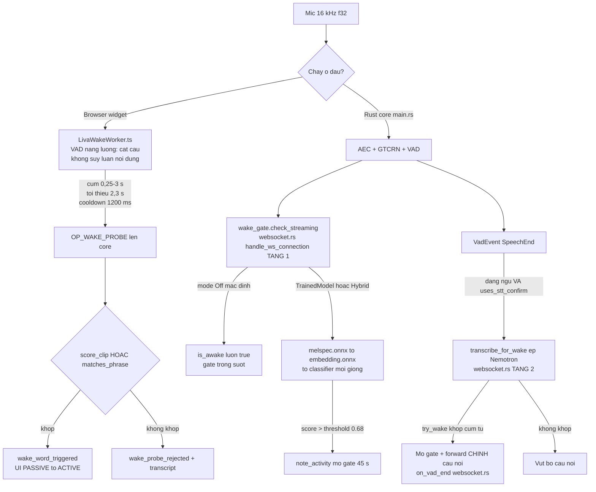

# Đường ống thoại LIVA

> **ĐÓNG BĂNG 30/07/2026.** Đây là khảo sát chi tiết theo các commit lịch sử; không sửa tọa độ
> để khớp HEAD. Canonical hiện hành:
> [Voice runtime](../03-he-thong-con/voice.md) và
> [Voice SLO](../05-chat-luong/voice-slo.md).

> **Runtime delta 23/07/2026:** client mic đã chuyển sang `AudioWorkletNode`
> (`src/worklets/mic-capture.worklet.js`), gom 512 mẫu = 32 ms ở 16 kHz và chuyển buffer
> transferable. Standalone và Tauri cùng dùng `websocket::WebSocketServer`,
> `VoiceRuntimeComponents` và một `AppState`. Các đoạn khảo sát bên dưới còn nhắc
> `ScriptProcessorNode`/128 ms hoặc Tauri `None` là mô tả lịch sử trước thay đổi này.

[⬆ Mục lục](../README.md) · [◀ Giao thức IPC và WebSocket](02-giao-thuc-ipc-va-websocket.md) · [Hệ LLM và prompt ▶](04-he-llm-va-prompt.md)

---

Tài liệu này mô tả **toàn bộ chuỗi xử lý âm thanh** của LIVA: mic trình duyệt → khung nhị phân
WebSocket → AEC → GTCRN denoise → Silero VAD → (Smart Turn shadow / wake gate) → STT →
agent + LLM → TTS → loa client, cùng cơ chế **barge-in**.

Từ 23/07/2026, mỗi WebSocket sở hữu một `VoiceSessionAudio`: recurrent/buffer
state của VAD, GTCRN và AEC hoàn toàn riêng. Chỉ model ONNX/FFT plan bất biến được
dùng chung; `Session::run` được serialize qua mutex.

Quy ước nhãn trạng thái dùng xuyên suốt:

| Nhãn | Nghĩa |
|---|---|
| **[OK]** | Đang chạy thật, đã nối dây trên đường sản xuất |
| **[MỘT PHẦN]** | Có code chạy được nhưng tắt mặc định / opt-in / chưa nối dây đầy đủ |
| **[THIẾU]** | Chưa có, là stub, hoặc model vắng mặt trên đĩa |

---

## 1. Sơ đồ trình tự tổng thể

```mermaid
sequenceDiagram
    autonumber
    participant MIC as Mic Browser useVoicePipeline.ts
    participant AW as AudioWorker ScriptProcessorNode 2048
    participant WS as WS Gateway main.rs handle_ws_connection
    participant DSP as AEC Denoise aec.rs denoise.rs
    participant VAD as VAD vad.rs Silero v6
    participant PIPE as WebRTCActor pipeline.rs
    participant STT as SttManager stt/mod.rs
    participant LLM as agent graph + LlamaEngine
    participant TTS as TtsChunker + VieNeu Piper Kokoro
    participant SPK as Speaker useSpeakerPlayback.ts

    Note over MIC,AW: getUserMedia sampleRate 16000 mono, AudioContext 16 kHz

    MIC->>AW: MediaStream -> onaudioprocess, Float32Array 2048 mau = 128 ms
    AW->>WS: ws.send serializeVoiceFrame(OP_MIC_IN, micSeqId, f32 LE PCM)
    Note over AW,WS: HOP DONG KHOP: voiceFrame.ts dong goi [op u8][seqId u32 LE][payloadSize u32 LE]<br/>dung y het VoiceFrame::decode. Sua 22/07/2026 - truoc do client chi gui 1 byte.

    WS->>WS: VoiceFrame::decode(&mut bytes_mut) -> op_code == OP_MIC_IN 0x01
    WS->>WS: bytemuck::cast_slice -> Vec f32
    WS->>DSP: spawn_blocking: aec.process_capture(&working) khoi 160 mau 10 ms
    Note right of DSP: AEC3 qua sonora, OPT-IN LIVA_AEC_ENABLED=1, mac dinh TAT
    DSP->>DSP: denoiser.process_audio(&working) GTCRN, WIN 512 HOP 256, tre 32 ms
    DSP->>VAD: vad.process_audio(&cleaned_samples) khung 512 mau
    VAD-->>WS: Vec of VadEvent + confidence f32

    alt VadEvent::SpeechStart (3 khung lien tiep, ~96 ms)
        WS->>PIPE: pipeline_handle.on_vad_start() -> PipelineEvent::VadStart
        PIPE->>PIPE: handle_vad_start -> cancel_active_operations -> transition_to(VadStart)
        WS->>WS: TurnAudioBuffer mo luot, nap toi da 1536 mau idle lich su
    end

    loop Trong khi luot audio dang active
        WS->>WS: noi cleaned_samples hien tai toi da mot lan
    end

    VAD-->>WS: VadEvent::SpeechEnd (45 khung im lang, ~1.44 s)
    WS->>WS: noi chunk SpeechEnd truoc khi lay speech_audio
    opt LIVA_TURN_SHADOW_ENABLED=1
        WS-)WS: spawn SmartTurn::predict - CHI LOG, khong gate
    end
    WS->>PIPE: pipeline_handle.on_vad_end(speech_audio Vec f32) -> PipelineEvent::VadEnd

    PIPE->>PIPE: transition_to(VadEnd) -> transition_to(SttProcessing)
    PIPE->>STT: spawn_blocking: stt.blocking_lock().feed_audio(&audio_data, is_last=true)
    STT->>STT: SttDsp::compute_log_mel_spectrogram - 10640 mau -> 65 x 128 f32 time-major
    STT->>STT: SttEngine::run_chunk - encoder + decoder + joint RNN-T greedy -> Vec u32
    STT->>STT: SttTokenizer::decode - BPE + byte-fallback 0xNN
    STT-->>PIPE: PipelineEvent::SttCompleted { session_id u64, Ok(Some(String)) }

    PIPE->>PIPE: handle_stt_completed - bo qua neu session_id != self.session_id
    PIPE->>PIPE: transition_to(LlmGenerating) -> spawn_llm_and_tts(text)
    PIPE->>LLM: build_pipeline_graph(AgentState, llm_chunk_tx, session_id) + graph.run
    Note right of LLM: router keyword -> vision | tool_exec | chat_completion<br/>compile_prompt tu chon ChatML hay Gemma

    loop Stream token
        LLM->>LLM: VisibleOutputFilter an think/analysis ke ca delimiter bi chia token
        LLM-)TTS: chi visible/final vao mpsc capacity 100<br/>heartbeat rong chi kiem epoch; deadline backpressure 2 s
        TTS->>TTS: TtsChunker::push -> chunk cau -> normalizer::normalize
        TTS->>TTS: vieneu_for_chunk -> piper_for_chunk -> fallback Kokoro -> Vec f32
        TTS->>DSP: session_aec.push_render(&audio_samples, sample_rate) - far-end reference cua dung WS
        TTS->>WS: speaker_tx try_reserve fail-fast + epoch re-check<br/>frame 100 ms, payload [turn_epoch][sample_rate][PCM]
        WS->>SPK: priority writer sends Message::Binary
        SPK->>SPK: epoch gate -> parseSpeakerPayload -> scheduleBuffer gapless
    end

    opt Chunk TTS dau tien
        TTS-->>PIPE: PipelineEvent::TtsSpeaking -> transition_to(TtsSpeaking)
    end

    alt BARGE-IN - nguoi dung cat loi khi state == TtsSpeaking
        MIC->>AW: nguoi dung noi de len giong LIVA
        AW->>WS: [0x01] PCM mic (co lan echo cua LIVA)
        WS->>DSP: aec.process_capture - khu echo far-end da push_render
        DSP->>VAD: audio da sach -> vad.process_audio
        VAD-->>WS: VadEvent::SpeechStart
        WS->>PIPE: on_vad_start() -> PipelineEvent::VadStart
        PIPE->>PIPE: cancel_active_operations - tang session_id + tts_player.stop()
        Note over PIPE,TTS: abort khong giet spawn_blocking; token gate kiem epoch khi cho queue<br/>va kiem lai sau inference truoc moi persist/checkpoint
        PIPE--)WS: control_tx OP_FLUSH(seq_id = generation_epoch)
        WS--)SPK: biased priority send -> tang epoch watermark + huy playback
        Note over WS,SPK: speaker frame epoch cu con trong queue bi bo o ca server va client
        PIPE->>PIPE: transition_to(VadStart) - bat dau luot moi
    else Khong bi cat loi
        LLM-->>PIPE: PipelineEvent::LlmCompleted { session_id, Ok }
        TTS-->>PIPE: chunker.flush() -> PipelineEvent::TtsCompleted
        PIPE->>PIPE: handle_tts_completed -> transition_to(Idle)
    end
```

> **Ghi chú xác minh:**
>
> 1. `OP_FLUSH` được gửi thật qua control queue riêng ở cuối `cancel_active_operations`:
>    ```rust
>    let flush_frame = VoiceFrame {
>        op_code: OP_FLUSH,
>        seq_id: self.session_id as u32,
>        payload: bytes::Bytes::new(),
>    };
>    let _ = self.outgoing.send_control(flush_frame).await;
>    ```
>    Unit test còn phủ trường hợp speaker queue đầy và sender cũ bị block khi epoch đổi.
> 2. Chú thích "SpeechEnd (45 khung im lặng, ~1.44 s)" là giá trị `VadConfig::default()`.
>    Đường chạy thật dùng `VadConfig::from_env()` (`main.rs:157`), trong đó
>    `speech_end_threshold` được đặt cứng mặc định **22 khung ≈ 704 ms**
>    (`vad.rs:49` — đã xác minh lại: `speech_end_threshold: get_usize("LIVA_VAD_END_FRAMES", 22)`).

---

## 2. Điểm vào KHÔNG nằm trong `webrtc/`

Đây là điều dễ hiểu nhầm nhất của toàn bộ đường ống: `handle_ws_connection` nhận mic rồi gọi
`VoiceSessionAudio::process_mic` (`webrtc/session.rs`) trong `spawn_blocking`; nó **không** nằm
trong `webrtc/pipeline.rs`. `pipeline.rs` điều phối STT → LLM → TTS và giữ handle AEC của cùng
WebSocket để feed far-end reference.

Chuỗi chính xác (tên hàm + dòng):

```
main.rs:623  Message::Binary(data)
 └ main.rs:627  VoiceFrame::decode          (frame.rs:32)
   └ main.rs:646  op_code == OP_MIC_IN
     ├ main.rs:647-657  bytes → Vec<f32>  (bytemuck::cast_slice, fallback từng chunk 4 byte LE)
     └ main.rs  spawn_blocking → VoiceSessionAudio::process_mic:
        ├ session.rs  session-local aec.process_capture      [opt-in]
        ├ session.rs  session-local denoiser.process_audio
        └ session.rs  session-local vad.process_audio
     ├ main.rs  wake_gate.check_streaming  (tier-1 wake)
     └ session.rs  TurnAudioBuffer::ingest(cleaned_samples, events)
        ├ SpeechStart → nạp pre-roll idle lịch sử + on_vad_start (nếu awake)
        ├ active/không event → nối chunk hiện tại tối đa một lần
        └ SpeechEnd → nối chunk cuối, rồi shadow SmartTurn (chỉ log) + on_vad_end
```

**Quan trọng:** audio nạp vào `TurnAudioBuffer` (rồi sang STT) là audio **sau AEC + sau GTCRN**,
không phải audio thô. Wake tier-1 (`check_streaming`) cũng nhận audio đã làm sạch. `VadEvent` chưa
có offset mẫu trong chunk, nên `TurnAudioBuffer` chỉ có thể đặt biên start/end ở độ phân giải chunk.

### 2.1 Máy trạng thái phía sau — `WebRTCActor`

```rust
pub enum PipelineState { Idle, VadStart, VadEnd, SttProcessing, LlmGenerating, TtsSpeaking, Interrupted }   // pipeline.rs:9

pub enum PipelineEvent {                                       // pipeline.rs:20
    VadStart,
    VadEnd(Vec<f32>),
    Interrupted,
    SttCompleted { session_id: u64, result: Result<Option<String>, String> },
    TtsSpeaking { session_id: u64 },
    LlmCompleted { session_id: u64, result: Result<(), String> },
    TtsCompleted { session_id: u64, result: Result<(), String> },
}

#[derive(Clone)]
pub struct WebRTCPipelineHandle {                              // pipeline.rs:42
    pub event_tx: mpsc::Sender<PipelineEvent>,   // capacity 128 (pipeline.rs:105)
    pub state_rx: watch::Receiver<PipelineState>,
}
```

```mermaid
stateDiagram-v2
    [*] --> Idle
    Idle --> VadStart: PipelineEvent::VadStart<br/>handle_vad_start pipeline.rs:168
    VadStart --> VadEnd: PipelineEvent::VadEnd(Vec f32)<br/>handle_vad_end pipeline.rs:174
    VadEnd --> SttProcessing: transition_to pipeline.rs:161
    SttProcessing --> LlmGenerating: SttCompleted Ok(Some(text))<br/>handle_stt_completed pipeline.rs:213
    SttProcessing --> Idle: text rong hoac Err
    LlmGenerating --> TtsSpeaking: TtsSpeaking (chunk dau tien)
    TtsSpeaking --> Idle: TtsCompleted<br/>handle_tts_completed pipeline.rs:437
    LlmGenerating --> Idle: LlmCompleted Err pipeline.rs:430
    TtsSpeaking --> VadStart: BARGE-IN<br/>cancel_active_operations pipeline.rs:445
    LlmGenerating --> VadStart: BARGE-IN
    SttProcessing --> VadStart: BARGE-IN
    Idle --> Interrupted: PipelineEvent::Interrupted<br/>handle_interrupted pipeline.rs:206
    Interrupted --> Idle
```

`transition_to` (`pipeline.rs:161`) log `🔄 [State Transition] old ➡️ new` và bắn qua `watch::Sender`.

**Loa nằm ở CLIENT, không phải server.** Actor chỉ đẩy `VoiceFrame{OP_SPEAKER_OUT}` qua
`outgoing_tx` → forwarder `main.rs:552-587` → `ws_sender.send(Message::Binary(...))`. Phía Vue:
`App.vue:137-152` → `speaker.enqueueSpeakerPayload()` → `useSpeakerPlayback.ts:133` →
`parseSpeakerPayload` (`speakerFrame.ts:36`) → `ctx.createBuffer` + `scheduleBuffer` (gapless qua
con trỏ `nextStartTime`, `useSpeakerPlayback.ts:111-131`).

Song song có đường phát cục bộ trên máy server qua `rodio`: `AppState.tts_player: TtsAudioPlayer`
(`lib.rs:38`, khởi tạo `main.rs:118`) — nhưng nhánh WebRTC actor **không gọi** `play()`; nó chỉ gọi
`tts_player.stop()` khi huỷ (`pipeline.rs:459`). Đường `play()` thuộc về `tts::TtsManager` /
`handle_command` / telegram.

---

## 3. Bảng trạng thái từng tầng (tra nhanh)

| Tầng | File | Model / thư viện | Bật mặc định? | Trạng thái |
|---|---|---|---|---|
| Khung nhị phân | `webrtc/frame.rs` | — | có | **[OK]** |
| AEC3 | `webrtc/aec.rs` | crate `sonora 0.1` (BSD-3) | **không**, `LIVA_AEC_ENABLED=1` | **[MỘT PHẦN]** |
| Denoise | `webrtc/denoise.rs` | `models/gtcrn_simple.onnx` (535 638 B) | **có** (opt-out `=0`) | **[OK]** trên đường WS |
| VAD | `webrtc/vad.rs` | `models/silero_vad_v6.onnx` (2 327 524 B) | có | **[OK]** |
| Smart Turn | `webrtc/turn_shadow.rs` | `models/smart_turn_v3.2_cpu.onnx` (8,68 MB) | không, `=1` | **[MỘT PHẦN]** — chỉ log |
| Wake gate (Rust, streaming) | `wake.rs` + `wake_model.rs` | `wakeword_melspec/embedding.onnx` + `wake_liva_{en,vi}.onnx` | **không** (`off`) | **[MỘT PHẦN]** |
| Wake probe (Rust, một phát) | `wake.rs::score_clip` + `matches_phrase` | `wake_liva_en.onnx` (tự dò trong `models/`) | **có** — mọi mode | **[OK]** — nạp lười ở probe đầu |
| Cắt câu (JS) | `liva-ui/src/workers/LivaWakeWorker.ts` | không dùng model | **có** | **[OK]** — chỉ cắt câu, không quyết định |
| STT Nemotron | `stt/engine.rs` | `encoder/decoder/joint.onnx` | có | **[OK]** |
| STT Parakeet | `stt/parakeet.rs` | `parakeet_vi.onnx` + `.data` 2,48 GB | không, `LIVA_STT_VI_ENGINE=parakeet` | **[MỘT PHẦN]** |
| TTS Piper | `tts/piper.rs` | `vi_VN-vais1000-medium.onnx`, `en_US-lessac-medium.onnx` | có | **[OK]** |
| TTS VieNeu | `tts/vieneu/*` | 4 ONNX trong `models/vieneu/` | không, `LIVA_TTS_VIENEU=1` | **[MỘT PHẦN]** |
| TTS Kokoro | `tts/engine.rs` | `models/kokoro-v1.0.onnx` | fallback | **[THIẾU]** — file không tồn tại |
| Chuẩn hoá VN | `tts/normalizer.rs` | — | có, mọi backend | **[OK]** |
| Barge-in | `webrtc/pipeline.rs` | — | có | **[OK]** |
| ~~Signaling WebRTC thật~~ | ~~`webrtc/signaling.rs`~~ | ~~crate `webrtc 0.12`~~ | — | **ĐÃ XOÁ 22/07/2026** — xem ghi chú dưới |

> **Ghi chú lịch sử (22/07/2026).** Hàng cuối bảng trước đây ghi `webrtc/signaling.rs` là
> ~~"[THIẾU] — code chết, 0 caller"~~. File đó **không còn trong repo**: thư mục
> `liva-native-core/src/webrtc/` nay chỉ có `aec.rs`, `denoise.rs`, `frame.rs`, `mod.rs`,
> `pipeline.rs`, `turn_shadow.rs`, `vad.rs`. Xem [Nợ kỹ thuật và rủi ro](../03-danh-gia/02-no-ky-thuat-va-rui-ro.md)
> (nhóm code chết đã xoá hẳn: `src/prng.rs`, `src/webrtc/signaling.rs`,
> `WebRTCPipelineHandle::feed_rtp_pcm`).

> **Không có WebRTC chuẩn nào ở đây.** Không ICE/STUN/TURN/SDP/DTLS/SRTP. Grep
> `RTCPeerConnection|peer_connection|ice_servers|ICEServer|media_engine|APIBuilder` toàn bộ `*.rs`
> ⇒ **0 kết quả** (đã chạy lại 22/07/2026). Crate `webrtc = "0.12.0"` — thứ từng được
> ~~khai báo nhưng không dùng~~ — **đã bị gỡ khỏi mọi `Cargo.toml`**, nên chuyện
> `pub mod webrtc;` (`lib.rs:6`) che tên crate ngoài ở mức crate-root cũng không còn ý nghĩa.
> Thứ duy nhất thực sự "WebRTC" là **thuật toán AEC3** mượn qua crate `sonora`.
> `turn_shadow.rs` **không** liên quan tới TURN server — "turn" ở đây là **lượt nói**.

---

## 4. Tầng 0 — khung nhị phân và thu mic

### 4.1 `webrtc/frame.rs` — codec khung [OK]

Khung nhị phân dùng **header 9 byte** `[op_code u8][seq_id u32 LE][payload_size u32 LE]` + payload
(trần cứng **1 MiB**), với 5 opcode: `OP_AUTH_HANDSHAKE 0x00`, `OP_MIC_IN 0x01`,
`OP_SPEAKER_OUT 0x02`, `OP_FLUSH 0x03`, `OP_ACK_PLAYING 0x04`. `VoiceFrame::decode` trả `Ok(None)`
khi chưa đủ dữ liệu; server lặp `while bytes_mut.len() >= 9` (`main.rs:626`).

> 📌 Nguồn đầy đủ: [Giao thức IPC và WebSocket](02-giao-thuc-ipc-va-websocket.md)

Phần chỉ riêng đường ống thoại quan tâm:

- `OP_MIC_IN`: PCM **f32 LE mono** thô, **không** có header sample-rate; server *giả định* 16 kHz
  (AEC/GTCRN/VAD/STT đều 16 kHz). Server căn lề `len/4*4` và có nhánh copy không-aligned
  (`main.rs:647-657`).
- `OP_SPEAKER_OUT`: `[u32 LE sample_rate][f32 LE mono PCM…]` (`pipeline.rs:384-392`; client parse
  `speakerFrame.ts:36-66`, chấp nhận 8 k–96 kHz). Thực tế 22050 Hz (Piper) / 24000 Hz (Kokoro) /
  `vieneu.sample_rate()` = 48000 Hz.
- `OP_ACK_PLAYING` (0x04) là **[THIẾU]**: server có hằng số nhưng handler rơi vào `_ => {}`
  (`main.rs:791`).
- `OP_AUTH_HANDSHAKE` chỉ echo lại nguyên payload (`main.rs:637-645`) — **không xác thực gì**.
  `App.vue:124` gắn `?token=…` nhưng callback handshake chỉ so `req.uri().path() == "/ws"`
  (`main.rs:491`), mà `uri().path()` không bao gồm query ⇒ **token vẫn bị bỏ qua**.
- **Hàng rào thật là `Origin`, không phải token** (bổ sung 22/07/2026): cùng callback đó đọc header
  `origin` và đối chiếu allow-list `liva_native_core::origin_allowed` (`lib.rs:128`); không khớp thì
  trả thẳng **403 Forbidden** ở tầng HTTP trước khi dựng `WebSocketStream` (`main.rs:496-503`,
  mở rộng bằng `LIVA_WS_ALLOWED_ORIGINS`). WebSocket không chịu Same-Origin Policy nên đây là thứ
  duy nhất chặn một trang web bất kỳ nối vào cổng 8002.

### 4.2 Thu mic phía client

`useVoicePipeline.ts:306-325`: `getUserMedia({ channelCount: 1, sampleRate: {ideal: 16000},
echoCancellation / noiseSuppression / autoGainControl = true })` (`:306`, `:309`),
`AudioContext({sampleRate: 16000})` (`:317`), `createScriptProcessor(2048, 1, 1)` (`:325`)
⇒ **2048 mẫu = 128 ms @16 kHz = 4 frame VAD**.

### 4.3 Hợp đồng khung mic — `liva-ui` ↔ core [OK, sửa 22/07/2026]

UI đóng gói khung mic bằng helper dùng chung `liva-ui/src/utils/voiceFrame.ts` (58 dòng):

```ts
// voiceFrame.ts:48-56 — VOICE_FRAME_HEADER_SIZE = 9
const buffer = new ArrayBuffer(VOICE_FRAME_HEADER_SIZE + payload.byteLength);
const view = new DataView(buffer);
view.setUint8(0, opcode & 0xff);
view.setUint32(1, seqId >>> 0, true);   // seq_id u32 LE
view.setUint32(5, payload.byteLength, true); // payload_size u32 LE
```

Điểm gọi duy nhất trên đường mic là `useVoicePipeline.ts:353`:
`wsRef.send(serializeVoiceFrame(OP_MIC_IN, micSeqId, new Uint8Array(buffer.buffer)))`
(import ở `:4`). Đối chiếu `VoiceFrame::decode` (`frame.rs:32-56`) đọc `op_code = src[0]`,
`seq_id = src[1..5]`, `payload_size = src[5..9]` ⇒ **hai phía khớp nhau hoàn toàn**.

> **Ghi chú lịch sử (22/07/2026).** Mục này trước đây mang tiêu đề *"⚠ Bất khớp hợp đồng khung mic"*
> và mô tả một khối `const msg = new Uint8Array(1 + pcmBuffer.byteLength); msg[0] = 0x01;` — tức
> client chỉ gửi header **1 byte**, khiến `decode` đọc nhầm 8 byte PCM làm `seq_id` + độ dài, gần như
> chắc chắn ~~`payload_size > 1 MiB ⇒ Err("Payload exceeds 1MB limit") ⇒ audio bị vứt bỏ`~~. Khối
> code đó **không còn tồn tại** trong `useVoicePipeline.ts`, và kết luận "audio bị vứt bỏ" nay **SAI**.
> Giữ đoạn này để ai đọc bản tài liệu cũ biết vấn đề đã được sửa chứ không phải bị bỏ quên.

- Hai event MsgPack (`msg[0]=0x02`, `useVoicePipeline.ts:196` và `:266`) là **giao thức khác**, đi
  nhánh khác — tiền tố 1 byte ở đó là đúng thiết kế, không phải lỗi (doc-comment `voiceFrame.ts:11-13`
  nói rõ điều này).
- Phía **nhận** UI xử lý đúng 9-byte header (`App.vue:143-150`, `utils/speakerFrame.ts:5-13`) —
  `voiceFrame.ts` là bản đối xứng phía gửi.
- `liva-ui/src/App.vue` **không có** đường thu mic nào (grep `getUserMedia` = 0 hit); chỉ
  `WidgetApp.vue:230` dùng `useVoicePipeline()`.
- Chỉ có 1 endpoint `/ws` (`main.rs:491`) và 1 handler binary duy nhất, không có nhánh dự phòng.

**Đánh giá:** chắc chắn về logic encode/decode (đọc cả hai phía); *chưa chạy thử runtime* để đo
end-to-end. Đường thoại nhị phân này sống ở **cả hai vỏ** — vỏ desktop cũng bind WS 8002 — và
song song với nó UI desktop vẫn có đường **Tauri IPC** cho lệnh text. Xem
[Kiến trúc tổng thể §0](01-kien-truc-tong-the.md) — một lõi, hai vỏ.

---

## 5. Tầng AEC — `webrtc/aec.rs` [MỘT PHẦN]

```rust
const SAMPLE_RATE: u32 = 16000;                         // aec.rs:17
const FRAME_SIZE: usize = (SAMPLE_RATE / 100) as usize; // 160 mẫu = 10 ms   aec.rs:18

pub struct SelfEchoCanceller {                          // aec.rs:20
    apm: sonora::AudioProcessing,
    render_queue: VecDeque<f32>,
    capture_pending: VecDeque<f32>,
}
impl SelfEchoCanceller {
    pub fn new() -> Self;                                              // aec.rs:27
    pub fn push_render(&mut self, samples: &[f32], source_rate: u32);  // aec.rs:49
    pub fn process_capture(&mut self, samples: &[f32]) -> Result<Vec<f32>, String>; // aec.rs:72
}
```

| Hạng mục | Giá trị thật |
|---|---|
| Thuật toán | WebRTC **AEC3** thuần Rust qua crate `sonora = "0.1"` (`Cargo.toml:61-63`, BSD-3) |
| Cấu hình | `Config { echo_canceller: Some(EchoCanceller::default()), ..Default::default() }` — **dùng nguyên tham số mặc định AEC3** |
| Stream config | `StreamConfig::new(16000, 1)` cho cả capture lẫn render |
| Khối xử lý | đúng **160 mẫu (10 ms)**; đuôi < 160 mẫu giữ lại sang lần gọi sau |
| Far-end | `push_render` resample **tuyến tính** (nội suy 2 điểm, `aec.rs:57-66`) từ 22050/24000/48000 → 16 kHz |
| Env bật | `LIVA_AEC_ENABLED=1` (`main.rs:234`), **mặc định TẮT** |

- LIVA **không** đặt filter length, delay estimate, hay chế độ mobile/desktop — mọi thứ đó do AEC3
  nội bộ Sonora quyết định, không lộ ra ở tầng LIVA. **Không tồn tại env nào cấu hình filter
  length/delay của AEC.**
- **Không có cơ chế căn chỉnh trễ tường minh.** Render được nạp ngay khi server *gửi* chunk
  (`pipeline.rs:376`), còn echo thực tế quay lại mic sau khi client giải mã + phát (mạng + jitter +
  độ trễ card âm thanh). Nếu hàng đợi render chưa đủ 160 mẫu thì frame đó **bỏ qua bước render hoàn
  toàn** (`aec.rs:82-88`) ⇒ AEC3 phải tự ước lượng delay. (Suy đoán: đây là lý do tính năng vẫn để
  opt-in.)
- Chỉ khử **giọng của chính LIVA**; tiếng game/Discord phát qua OS mixer không nhìn thấy được
  (doc-comment `aec.rs:10-12`).
- Test đã có: `leftover_tail_shorter_than_one_frame_is_carried_over` (`aec.rs:136`).

---

## 6. Tầng khử nhiễu — `webrtc/denoise.rs` (GTCRN) [OK]

```rust
const WIN: usize = 512;        // denoise.rs:16
const HOP: usize = 256;        // denoise.rs:17
const FREQ_BINS: usize = 257;  // denoise.rs:18
const CONV_CACHE_LEN: usize  = 2*1*16*16*33;  // 16896   denoise.rs:20
const TRA_CACHE_LEN: usize   = 2*3*1*1*16;    // 96      denoise.rs:21
const INTER_CACHE_LEN: usize = 2*1*33*16;     // 1056    denoise.rs:22
```

| Hạng mục | Giá trị thật |
|---|---|
| Model | `models/gtcrn_simple.onnx` — **535 638 byte**, có thật trên đĩa |
| Kiến trúc | GTCRN (ICASSP 2024), **23,7K params / 33 MMACs**, causal streaming (doc `denoise.rs:1-10`) |
| DSP | `n_fft = 512`, `hop = 256` (overlap 50%), cửa sổ **sqrt-Hann** dùng cho cả phân tích và tổng hợp (COLA), mono 16 kHz |
| Độ trễ thuật toán | 1 cửa sổ = 512 mẫu = **32 ms** |
| ONNX inputs | `mix [1,257,1,2]` (re/im), `conv_cache [2,1,16,16,33]`, `tra_cache [2,3,1,1,16]`, `inter_cache [2,1,33,16]` |
| ONNX outputs | `enh`, `conv_cache_out`, `tra_cache_out`, `inter_cache_out` — state hồi quy ghi đè mỗi hop (`denoise.rs:203-205`) |
| Session | `with_intra_threads(1)`; model runner dùng chung qua `Arc<Mutex<Session>>`, cache bên dưới per-WebSocket |
| Env | `LIVA_DENOISE_ENABLED` (`main.rs:181-184`) — **BẬT mặc định**, `0`/`false`/`off` để tắt; `LIVA_DENOISE_MODEL_PATH` (`denoise.rs:28`) |
| Resolve model | `LIVA_DENOISE_MODEL_PATH` → `models/` → `../models/` → `../../models/` (`denoise.rs:26-44`) |

ISTFT: dựng lại phổ đối xứng liên hợp, `ifft`, nhân `1/WIN`, nhân cửa sổ tổng hợp, overlap-add, xuất
`HOP` mẫu mỗi lần (`denoise.rs:130-146`).

**Cô lập phiên (23/07/2026):** `GtcrnDenoiser::fork_session()` clone model runner/FFT plan nhưng
khởi tạo mới `analysis_hist`, overlap-add, pending input và cả ba recurrent cache. Vì vậy kết nối mới
không cần reset prototype trong `AppState`, và hai kết nối đồng thời không thể ghi đè cache của nhau.

---

## 7. Tầng VAD — `webrtc/vad.rs` (Silero v6) [OK]

```rust
pub enum VadEvent { SpeechStart, SpeechEnd, None }        // vad.rs:5

pub struct VadConfig {                                     // vad.rs:11
    pub sample_rate: i64,               // 16000
    pub frame_size: usize,              // 512  (= 32 ms)
    pub threshold: f32,                 // 0.5
    pub speech_start_threshold: usize,  // 3    (~96 ms)
    pub speech_end_threshold: usize,    // 45   (~1,44 s)  ← Default
}
impl VadConfig { pub fn from_env() -> Self; }              // vad.rs:35
```

**Ngưỡng thật khi chạy** — `main.rs:157` dùng `VadConfig::from_env()`:

| Tham số | Giá trị `Default` | Giá trị `from_env` (đường sản xuất) | Env |
|---|---|---|---|
| `threshold` | 0.5 | 0.5 | `LIVA_VAD_THRESHOLD` |
| `speech_start_threshold` | 3 frame ≈ **96 ms** | 3 frame | `LIVA_VAD_START_FRAMES` |
| `speech_end_threshold` | 45 frame ≈ 1,44 s | **22 frame ≈ 704 ms** | `LIVA_VAD_END_FRAMES` |
| `frame_size` | 512 mẫu = **32 ms** | 512 | — (không có env) |

Doc-comment trong code nói rõ chủ ý: *"Product config: `Default` values overridable via env, with a
snappier end-of-turn (22 frames ≈ 0.7s vs the conservative 1.44s default) so barge-in and turn-taking
feel responsive."* (`vad.rs:32-34`). Binary `verify_duplex.rs:28` dùng `VadConfig::default()` nên nó
assert theo 45 frame (`verify_duplex.rs:43-48`) — đừng nhầm đó là cấu hình sản xuất.

| Hạng mục | Giá trị thật |
|---|---|
| Model | `models/silero_vad_v6.onnx` — **2 327 524 byte**, có thật |
| Resolve | `LIVA_VAD_MODEL_PATH` (tôn trọng cả khi file không tồn tại) → `models/silero_vad_v6.onnx` → `../` → `../../` → fallback legacy `{stt_model_dir}/silero_vad.onnx` (`vad.rs:62-80`) |
| ONNX inputs | `input [1,512]`, `sr [1] i64 = 16000`, `state [2,1,128]` (256 float) |
| ONNX outputs | `output` (confidence scalar), `stateN` (chép ngược vào `self.state`, `vad.rs:178`) |
| Session | `with_intra_threads(1).with_inter_threads(1)`; model runner dùng chung qua `Arc<Mutex<Session>>`, recurrent/debounce state per-WebSocket |
| Debounce | đếm frame liên tiếp; speech reset counter silence và ngược lại (`vad.rs:185-204`). **Không hysteresis 2 ngưỡng** — chỉ 1 threshold + đếm frame |
| Đo được | inference **< 15 ms/frame** (assert `verify_duplex.rs:65`) |

- **Không có pre-roll trong VAD** — `TurnAudioBuffer` ở tầng WebSocket giữ tối đa **1536 mẫu
  (96 ms) idle lịch sử** trước `SpeechStart`. Chunk phát event được nối vào lượt đúng một lần; chunk
  phát `SpeechEnd` được nối trước khi hoàn tất lượt và không được đưa lại vào pre-roll của lượt sau.
- `VadEngine::fork_session()` tạo `state [2,1,128]`, residual buffer và debounce counter mới cho
  từng WebSocket nhưng giữ chung model đã load. `reset()` vẫn dùng được cho ranh giới stream nội bộ,
  không còn là hàng rào giữa các client.

---

## 8. Smart Turn v3.2 — `webrtc/turn_shadow.rs` [MỘT PHẦN — chỉ log]

Phát hiện **kết thúc lượt nói theo ngữ nghĩa** (semantic end-of-turn), khác hẳn VAD (chỉ nghe im lặng).

```rust
const SAMPLE_RATE: usize = 16000;
const N_SAMPLES: usize = 128_000;   // 8 giây cố định   turn_shadow.rs:34
const N_FFT: usize = 400; const HOP: usize = 160; const N_MELS: usize = 80; const N_FRAMES: usize = 800;

pub struct TurnVerdict { pub probability: f32, pub complete: bool }   // turn_shadow.rs:71
pub fn predict(&mut self, samples: &[f32]) -> Result<TurnVerdict, String>; // turn_shadow.rs:107
```

| Hạng mục | Giá trị thật |
|---|---|
| Model | `models/smart_turn_v3.2_cpu.onnx` — **8,68 MB**, có thật. Env `LIVA_TURN_MODEL_PATH` (`turn_shadow.rs:44`) |
| Input | `input_features [1,80,800]` |
| Output | `logits [1,1]` — **đã sigmoid sẵn**, `> 0.5` ⇒ hết lượt |
| Đặc trưng | tự tính ở Rust (graph ONNX không có op trích đặc trưng): neo đuôi 8 s, chuẩn hoá zero-mean/unit-var trên **toàn bộ** buffer kể cả padding, center-STFT reflect-pad `N_FFT/2`, Hann tuần hoàn, 80 mel Slaney (dùng lại `stt::dsp::compute_mel_filterbank`), log10, floor `max-8`, `(x+4)/4` |
| Env bật | `LIVA_TURN_SHADOW_ENABLED=1` (`main.rs:214`), **mặc định TẮT** |
| Nối dây | `main.rs:730-745`, **chỉ trong nhánh `VadEvent::SpeechEnd`** (bắt đầu ở `main.rs:722`), `tokio::spawn` fire-and-forget |
| Kết quả đi đâu | chỉ vào log `[shadow:smart-turn] probability=… complete=… (VAD already decided: ended)` — **KHÔNG gate quyết định nào** |

**Lý do giữ ở chế độ bóng:** tiếng Việt là ngôn ngữ yếu nhất của model — **81,27 % accuracy vs
94,31 % EN** (`turn_shadow.rs:4-7`, đối chiếu `LIVA_OSS_Research_2026-07.md:106-107`).

---

## 9. Wake word — hai hệ, nay đã nối vào nhau

> **Sửa 27/07/2026 — đọc trước phần còn lại của mục này.** Trước ngày này widget đánh thức
> bằng một MLP chạy trên **16 giá trị RMS energy**, tức nó chỉ thấy biên dạng to/nhỏ chứ không
> thấy âm vị: "hey Liva" và "xin chào" là cùng một vector đầu vào. Trọng số lại sinh từ
> `np.random.uniform` (`scripts/generate_hey_liva_model.py`). Hệ quả là nó nhảy với **mọi**
> tiếng nói — đúng hành vi của thứ nó thực sự là, một bộ dò *có người đang nói*.
>
> Nay `LivaWakeWorker.ts` chỉ còn **cắt câu** bằng VAD năng lượng và gửi cụm ứng viên lên core
> qua `OP_WAKE_PROBE` (0x05). Phán quyết đánh thức do core ra, bằng chính hai tầng ở §9.1:
> classifier đã train (`score_clip`) HOẶC STT + so cụm từ (`matches_phrase`). Không khớp thì
> core trả `wake_probe_rejected` **kèm transcript nó nghe được** — đó là bề mặt duy nhất để
> chẩn đoán "sao gọi mà không thức".
>
> Kiểm chứng 27/07/2026 qua socket thật (`scripts/e2e-wake-probe.mjs`, giọng Piper tổng hợp,
> STT Nemotron thật): "Này Liva ơi, bật nhạc lên giúp tôi" → **đánh thức**; "Hôm nay trời đẹp
> quá, đi ăn cơm không" → **từ chối**; "Hey Liva, what is the weather today in Hanoi" →
> **đánh thức**. Lần chạy đầu câu tiếng Việt bị **âm tính giả**: Nemotron nghe thành
> "Này Li Vơ oi…" ⇒ chuẩn hoá ra `livo`, nên `li vơ` đã được thêm vào danh sách mặc định.



### 9.1 Hệ Rust — `WakeGate` 4 chế độ [MỘT PHẦN]

```rust
pub enum WakeMode { Off, AsrPrefix, TrainedModel, Hybrid }   // wake.rs:34-46

pub struct WakeGate {                                        // wake.rs:48-54
    mode: WakeMode,
    phrases: Vec<String>,            // đã normalize, đã bỏ space
    window: Duration,
    awake_until: Option<Instant>,
    trained_detector: Option<TrainedWakeDetector>,
}
```

API công khai:

```rust
pub fn from_env() -> Self                                                    // wake.rs:57
pub fn check_streaming(&mut self, samples: &[f32]) -> Option<(String, f32)>  // wake.rs:134  ← TẦNG 1
pub fn try_wake(&mut self, transcript: &str) -> bool                         // wake.rs:185  ← TẦNG 2
pub fn uses_stt_confirm(&self) -> bool   // true cho AsrPrefix | Hybrid         wake.rs:147
pub fn uses_model(&self) -> bool         // true cho TrainedModel | Hybrid      wake.rs:153
pub fn is_awake(&self) -> bool           // Off ⇒ LUÔN true                     wake.rs:162
pub fn note_activity(&mut self)          // gia hạn cửa sổ                      wake.rs:172
pub fn sleep(&mut self)                                                      // wake.rs:178
pub fn normalize_for_match(s: &str) -> String                                // wake.rs:203
```

**Bốn chế độ:**

| Mode | Chuỗi env chấp nhận (`wake.rs:58-67`) | Tầng 1 (ONNX) | Tầng 2 (STT) | Ghi chú |
|---|---|---|---|---|
| `Off` | mọi giá trị khác, **kể cả không set** | không | không | **mặc định** — `is_awake()` luôn `true`, gate trong suốt (UX push-to-talk) |
| `AsrPrefix` | `asr_prefix` \| `asr` \| `on` | không | **có** | khuyến nghị cho tiếng Việt |
| `TrainedModel` | `trained_model` \| `trained` \| `model` | **có** | không | paths rỗng → `error!`, gate **không bao giờ mở được** (`wake.rs:96-108`) |
| `Hybrid` | `hybrid` \| `both` | **có** | **có** | logic **OR**; paths rỗng → `warn!` *"running STT-only (tier 2)"*, vẫn hoạt động |

**HYBRID = OR hai tầng ở hai vị trí khác nhau trong vòng lặp audio:**

- **Tầng 1 — classifier ONNX streaming (mạnh tiếng Anh).** `websocket.rs#handle_ws_connection`
  `wake_gate.check_streaming(&samples_vec)` chạy trên **MỌI frame mic sau denoise/AEC, độc lập hoàn
  toàn với VAD** (nằm ngoài vòng `for (event, _) in events`). Hit ⇒ `note_activity()` mở gate ngay
  (`wake.rs:134-138`). Log: `info!("Wake word detected (trained model): {} ({:.3})", name, score)`.
- **Tầng 2 — xác nhận bằng transcript.** `websocket.rs#handle_ws_connection`, chỉ khi `VadEvent::SpeechEnd` **VÀ**
  `!wake_gate.is_awake()` **VÀ** `wake_gate.uses_stt_confirm()`. Gọi
  `stt.transcribe_for_wake(&audio_for_stt)` (Nemotron ép buộc, cùng hàm) → `try_wake`. Khớp thì
  log `"Wake word detected (tier-2 STT)"` rồi **forward chính câu nói đó** vào pipeline
  (`pipeline_handle.on_vad_end(speech_audio)`) ⇒ *"Liva, nhắn tin cho Nam"* xong trong
  một hơi. Không khớp: câu nói **bị vứt, không bao giờ tới LLM**.

**Khớp chuỗi ở tầng 2** (`wake.rs:185-197`): normalize transcript → lấy **8 từ đầu** → **ghép bỏ hết
space** → `head.contains(phrase)`. Normalize = lowercase + **fold dấu tiếng Việt sang ASCII** (bảng 7
dòng `wake.rs:219-227`, gồm `đ`→`d`) + bỏ ký tự không alnum thành space. Nhờ vậy `"li vào"` →
`"livao"` ⊃ `"liva"` (test `wake.rs:324-330`).

**Env & ngưỡng:**

| Env | Mặc định trong code | Khuyến nghị `.env.example` |
|---|---|---|
| `LIVA_WAKE_MODE` | `off` (`wake.rs:66`) | `off` (`:128`) |
| `LIVA_WAKE_THRESHOLD` | **0.68** (`wake.rs:92-95`) | **0.77** (`:142`) |
| `LIVA_WAKE_WINDOW_SECS` | **45** (`wake.rs:83`) | 45 (`:132`) |
| `LIVA_WAKE_MODEL_PATHS` | rỗng (`wake.rs:86`) | rỗng (`:138`) |
| `LIVA_WAKE_PHRASES` | `liva,hey liva,ê liva,này liva,liva ơi,laiva,leva,lyva,li goa` (`wake.rs:72-73`) | y hệt (`:131`) |
| `LIVA_WAKE_MELSPEC_PATH` / `LIVA_WAKE_EMBEDDING_PATH` | auto-resolve | rỗng (`:145-146`) |

(Cột phải là số dòng trong `.env.example` — file này đã được đại tu nên toàn bộ toạ độ cũ
`:86`–`:97` không còn đúng; **giá trị** thì không đổi.)

Lệch **0,68 vs 0,77** là có chủ ý: 0,68 là con số benchmark của livekit-wakeword (comment
`wake_model.rs:152-155`), 0,77 là ngưỡng tối ưu riêng cho `wake_liva_en.onnx` theo eval 17,85 h
(`models/README.md:19`).

### 9.2 `wake_model.rs` — pipeline 3 model ONNX

Hằng số (`wake_model.rs:40-49`): `SAMPLE_RATE=16000`, `RING_SECONDS=2.5` → `RING_LEN=40000`,
`PREDICT_INTERVAL_SAMPLES=3200` (**~200 ms**), `MEL_BINS=32`, `EMBEDDING_WINDOW=76`,
`EMBEDDING_STRIDE=8`, `EMBEDDING_DIM=96`, `MIN_EMBEDDINGS=16`.

| # | Model | Tensor in → out | Ghi chú |
|---|---|---|---|
| 1 | `models/wakeword_melspec.onnx` | `"input" [1, N]` f32 → `"output" [_,_,T,32]` | hậu xử lý **`x/10 + 2`** khớp openWakeWord `melspec_transform` (`wake_model.rs:103`) |
| 2 | `models/wakeword_embedding.onnx` | `"input_1" [1, 76, 32, 1]` → `"conv2d_19"` 96-dim | tên output lạ đời `conv2d_19`, đã verify bằng `onnx_probe` |
| 3 | classifier (mỗi giọng 1 file) | `"embeddings" [1, 16, 96]` → `"score"` | 1 hit ở **BẤT KỲ** classifier nào = wake |

Luồng `predict_raw` (`:220-257`): mel toàn clip → trượt cửa sổ 76 frame stride 8 → nếu `< 16`
embedding thì trả rỗng (⇒ **cần ~2 s audio tối thiểu**: 76 + 15×8 = 196 mel frame) → lấy **16
embedding cuối**, flatten 1536 float → chạy **mọi** classifier → `push_and_check` lọc `> threshold`
rồi `max_by` điểm cao nhất (`wake_model.rs:199-208`).

`resolve_bundled_model(env_var, default_name)` (`:51-69`) thử `models/`, `../models/`,
`../../models/` (cho Tauri chạy từ `liva-desktop/src-tauri`).

**Chất lượng model** (`models/README.md:19-20`, eval 17,85 h — đều có thật trên đĩa):

- `wake_liva_en.onnx`: recall **98,8 %** / FPPH **1,74** @0.5; ngưỡng tối ưu **0,77** → recall
  98,15 %, FPPH **0,168**. Không hard-code ở bất kỳ file Rust nào — chỉ vào qua CSV
  `LIVA_WAKE_MODEL_PATHS`.
- `wake_liva_vi.onnx`: recall **91,5 %** / **FPPH 19,4** @0.5; ngưỡng 0,91 thì recall tụt còn
  **63,2 %**. README **tự đánh giá KÉM**, nguyên nhân ghi rõ: embedding lõi English-centric + giọng
  VoxCPM kém đa dạng; khuyến nghị tiếng Việt dùng `asr_prefix`. ⇒ **Đây chính là lý do tồn tại của
  mode Hybrid.**
- Fixture qua pipeline Rust: `hey_livekit` **0,9997 positive / 0,0009 negative**
  (`LIVA_OSS_Research_2026-07.md:19`); `wake_liva_en` trên 16 clip augmented thật: positive
  **0,846–0,961**, negative **0,004–0,015**.
- Test tự động: `wake_model.rs:299-318` (`matches_reference_positive_and_negative_fixtures`) và
  `:320-333` (`short_audio_returns_no_scores`) — **tự skip** nếu thiếu `models/wake_fixtures/`.

**Ghi chú kiến trúc bắt buộc đọc** (`wake_model.rs:1-35` + `models/README.md:24`): **cấm thêm crate
`livekit-wakeword` vào `Cargo.toml`** — trên Windows x86_64 nó bật feature `ort/alternative-backend`
(backend `ort-tract`), Cargo hợp nhất feature toàn graph ⇒ **mọi `ort::Session` khác trong process
(VAD / GTCRN / Smart Turn / STT / TTS) chết** với `"attempted to use ort APIs before initializing a
backend"`. Đã bắt được bằng `cargo test` thật ⇒ `wake_model.rs` là **bản port tay**.

### 9.3 Hệ JS trong browser — nay chỉ CẮT CÂU [OK]

`liva-ui/src/workers/LivaWakeWorker.ts` chạy trong Web Worker, nạp từ `useVoicePipeline.ts`.
Từ 27/07/2026 nó **không suy luận nội dung nữa** — không model, không trọng số, không ONNX.

- **Máy trạng thái cắt câu**: `SILENCE` --(rms ≥ `speechFloor`, 2 khung)--> `SPEECH`
  --(rms < sàn, 8 khung)--> phát `candidate`. Vòng đệm 64 000 mẫu (4 s), mốc mẫu tuyệt đối.
- **Sàn độ dài là ràng buộc CỨNG từ core, không phải tinh chỉnh** (`minProbeMs = 2300`, nới
  ngược bằng audio thật chứ không đệm số 0): classifier cần 196 mel frame ≈ **1,96 s** mới
  chạy (`wake_model.rs`), Nemotron cần ≳ **1,3 s** mới ra chữ (đo 27/07/2026: cùng nội dung ở
  0,8 s ra rỗng, từ 1,3 s mới có transcript).
- **Không lọc theo `rms` khi nạp worker** (`useVoicePipeline.ts`). Bản cũ có `rms > 0.002` vì nó
  suy luận từng khung độc lập; bộ cắt câu thì nhận biết dứt câu bằng cách đếm khung LIÊN TIẾP
  dưới sàn, chặn khung im lặng lại là bộ đếm đó không bao giờ chạy ⇒ **không cụm nào được phát**.
- Sàn RMS lưu ở `localStorage['liva_wake_speech_floor']`, mặc định **0,015**. Khoá **mới** có
  chủ đích: khoá cũ `liva_wake_threshold` chứa confidence 0–1 của MLP đã bỏ (mặc định 0,15);
  đem 0,15 làm sàn RMS thì gần như không câu nói nào vượt nổi.
- File chết còn lại trên đĩa: `liva-ui/public/models/hey_liva*.onnx`,
  `liva-ui/src/workers/hey_liva_weights.json`, `scripts/generate_hey_liva_model.py`.

⇒ **Phán quyết đánh thức nay do core ra, ở cả bốn mode** — `score_clip` (classifier, ~35 ms,
nạp lười) HOẶC `matches_phrase` (STT). Widget chỉ đề xuất ứng viên.

---

## 10. Tầng STT

### 10.1 Nemotron RNN-T — mặc định [OK]

`SttEngine` (`stt/engine.rs:4-22`) — **3 phiên ONNX riêng biệt** (không phải CTC):

```rust
pub struct SttEngine {
    encoder_session: Session,   // encoder.onnx (+ encoder.onnx.data)
    decoder_session: Session,   // decoder.onnx — prediction network LSTM
    joint_session: Session,     // joint.onnx   — joiner
    cache_last_channel: Vec<f32>,      // [1, 24, 56, 1024]
    cache_last_time: Vec<f32>,         // [1, 24, 1024, 8]
    cache_last_channel_len: Vec<i64>,  // [1]
    decoder_hidden_state: Vec<f32>,    // [2, 1, 640]  (LSTM 2 layer × 640)
    decoder_cell_state: Vec<f32>,      // [2, 1, 640]
    last_decoder_token: i64,
    blank_id: i64,       // 13087
    lang_id: i64,
    cached_decoder_output: Vec<f32>,   // 640
}
```

Chữ ký chính:

```rust
pub fn new<P: AsRef<Path>>(model_dir: P) -> Result<Self, String>                      // engine.rs:25
pub fn run_chunk(&mut self, log_mel: &[f32], num_frames: usize) -> Result<Vec<u32>, String>  // engine.rs:137
pub fn reset_states(&mut self)                                                        // engine.rs:91
pub fn set_lang_id(&mut self, id: i64) / pub fn lang_id(&self) -> i64                 // engine.rs:83, 87
```

- Thiếu bất kỳ file nào trong `encoder.onnx` / `decoder.onnx` / `joint.onnx` ⇒
  `"Nemotron ONNX model files missing…"` (`engine.rs:30-32`).
- **I/O encoder** (`engine.rs:138-145`): `audio_signal [1,65,128]` **time-major**, `length [1]`,
  `cache_last_channel [1,24,56,1024]`, `cache_last_time [1,24,1024,8]`, `cache_last_channel_len [1]`,
  `lang_id [1]` → `outputs`, `encoded_lengths`, `cache_last_*_next`. ⇒ **24 layer Conformer,
  d_model 1024, left-context 56 frame**.
- **Giải mã**: greedy RNN-T thuần Rust (`engine.rs:194-279`), `max_symbols_per_step = 10`, mỗi frame
  encoder (stride 1024 float) chạy joint → argmax toàn bộ logits phẳng → nếu ≠ blank thì push token +
  chạy lại decoder LSTM. **Không beam search, không LM.**
- Session: `with_intra_threads(2).with_inter_threads(1)`, **CPU-only** (không CUDA EP).
- `reset_states` zero cache + **chạy decoder 1 lần với blank để bootstrap** `cached_decoder_output`;
  dùng `.expect()` ⇒ panic nếu decoder lỗi.
- Vocab `models/nemotron-asr/vocab.txt` = **13088 dòng**, dòng cuối `<blank>` ⇒ blank id **13087**
  (`engine.rs:71-72`, `tokenizer.rs:25`).

### 10.2 Parakeet-CTC-0.6B vi — opt-in [MỘT PHẦN]

`ParakeetVi` (`stt/parakeet.rs:150-154`): **1 session ONNX duy nhất**, FastConformer-**CTC**, không
encoder/decoder tách rời, không state.

```rust
pub fn load(model_path: &Path, vocab_path: &Path) -> Result<Self, String>   // parakeet.rs:159
pub fn transcribe(&mut self, samples: &[f32]) -> Result<String, String>     // parakeet.rs:209
pub fn vocab_len(&self) -> usize                                            // parakeet.rs:238
fn ctc_decode(vocab, logprobs, t_frames, vocab_size) -> String              // parakeet.rs:245
fn detokenize(vocab: &[String], ids: &[usize]) -> String                    // parakeet.rs:271
```

- **Contract** (comment `parakeet.rs:11-14`, đã verify bằng `onnx_probe`): input
  `audio_signal [B, 80, T]` **feature-major** (ngược layout so với Nemotron), `length [B]` i64 →
  output `logprobs [B, T, 1025]` = 1024 BPE + 1 blank (id = `vocab_size - 1`, `parakeet.rs:246`).
- Threads: `LIVA_PARAKEET_THREADS`, mặc định **4** (`parakeet.rs:186-190`); intra=N, inter=1, **không
  có CUDA EP** (comment `:181-185` nói rõ: bật feature `cuda` của `ort` sẽ đụng pitfall backend-init).
- **Lazy load**: `SttManager::ensure_parakeet_loaded(&mut self) -> bool` (`mod.rs:108`) chỉ nạp
  2,4 GB ở utterance tiếng Việt đầu tiên; load fail → `use_parakeet_vi = false` **vĩnh viễn** trong
  process (`mod.rs:132`) và rơi về Nemotron.
- **Batch thuần**: `feed_audio_inner` gom `raw_audio_buffer` và chỉ transcribe khi `is_last`
  (`mod.rs:211-220`); `!is_last` → `Ok(None)`. **Không có partial streaming** ở mode này.
- Kích hoạt: `should_use_parakeet()` (`mod.rs:98-103`) = `LIVA_STT_VI_ENGINE=parakeet` **AND**
  `language` bắt đầu bằng `vi`.
- Files trên đĩa (**đều có thật**): `models/parakeet_vi.onnx` + `parakeet_vi.onnx.data` (2,48 GB) +
  `parakeet_vi_vocab.json`.
- Số đo **qua đúng đường ống STT sản xuất của LIVA** trên 100 câu FLEURS `vi_vn`
  ([báo cáo và lệnh tái lập](../05-chat-luong/wer-fleurs-vi.md)): Parakeet đạt **12,00% WER**,
  Nemotron đạt **15,01% WER** — Parakeet tốt hơn khoảng **1,25×** về WER và nhanh hơn khoảng
  **5,4×** về thời gian xử lý (RTF **0,077** so với **0,414**).

### 10.3 Định tuyến engine

`SttManager::feed_audio_inner(&mut self, audio: &[f32], is_last: bool, allow_parakeet: bool)`
(`mod.rs:188`) là điểm rẽ duy nhất. Hai wrapper public:

```rust
pub fn feed_audio(&mut self, audio: &[f32], is_last: bool) -> Result<Option<String>, String>  // mod.rs:174 → allow_parakeet = true
pub fn transcribe_for_wake(&mut self, audio: &[f32]) -> Result<Option<String>, String>        // mod.rs:184 → allow_parakeet = false, is_last = true
```

`transcribe_for_wake` **luôn ép Nemotron nhẹ** kể cả khi cấu hình Parakeet — để trạng thái "ngủ"
không phải nạp model 2,4 GB chỉ để nghe chữ "liva" (comment `mod.rs:178-183`, caller `websocket.rs#handle_ws_connection`).

### 10.4 DSP mel-spectrogram — `stt/dsp.rs`

`SttDsp::new(fft_size, win_length, hop_length, num_mels, sample_rate: f64, log_eps: f32)`
(`dsp.rs:77`). Tham số thực tế truyền vào tại `mod.rs:40-47`:

| Tham số | Giá trị | Ghi chú |
|---|---|---|
| `fft_size` | **512** | |
| `win_length` | **400** | 25 ms |
| `hop_length` | **160** | 10 ms |
| `num_mels` | **128** | |
| `sample_rate` | **16000.0** | chỉ dùng để dựng filterbank, KHÔNG lưu vào struct |
| `log_eps` | **5.96046448e-08** (= 2⁻²⁴) | |

`compute_log_mel_spectrogram(&self, samples: &[f32]) -> Result<Vec<f32>, String>` (`dsp.rs:108`):

- **Hard-code chỉ nhận đúng 10 640 mẫu**, khác là `Err` (`dsp.rs:109-114`).
- Xuất **65 frame × 128 mel = 8320 float**, layout **time-major** `features[f * 128 + m]`.
- Framing: frame `f` tâm tại `f * 160`, cửa sổ Hann **periodic** (mẫu số = `win_length`,
  `dsp.rs:88`), pad **reflect** quanh `[0, n-1]` (`dsp.rs:126-131`), rồi **center-pad cửa sổ 400 vào
  FFT 512 với offset 56** (`dsp.rs:137`).
- Power spectrum `|FFT|²` (`norm_sqr`), 257 bin → mel → `ln(e + log_eps)`. **Không CMVN, không
  normalize** (khớp `normalize: "NA"` trong config).
- Thang mel `hz_to_mel`/`mel_to_hz` (`dsp.rs:6-30`) là **Slaney/HTK-linear-below-1kHz**
  (`f_sp = 200/3`, logstep = `ln(6.4)/27`), filterbank có `enorm = 2/(mel[i+2]-mel[i])` ⇒ **Slaney
  normalization**, giống librosa `norm='slaney'`.
- `pub fn compute_mel_filterbank(fft_size, num_mels, sample_rate: f64) -> Vec<Vec<f32>>`
  (`dsp.rs:32`) được **Parakeet dùng lại** (`num_mels=80`, `parakeet.rs:55`) và **Smart Turn dùng
  lại** (80 mel).

**Đối chiếu `models/nemotron-asr/audio_processor_config.json`**: `n_fft 512, hop 160, n_mels 128,
win 400, hann, mag_power 2.0, center true, preemphasis 0.97, normalize "NA"` — khớp. **Hai chỗ lệch:**

1. config ghi `log_zero_guard_value: 1e-10`, code dùng `2⁻²⁴ ≈ 5,96e-8`;
2. config ghi `dither: 1e-05` nhưng **code không cài dither** (grep không có).

**Front-end riêng của Parakeet — `ParakeetDsp`** (`parakeet.rs:70`):

- Hằng số (`parakeet.rs:27-37`): `N_MELS=80`, `FFT_SIZE=512`, `WIN_LENGTH=400`, `HOP_LENGTH=160`,
  `SAMPLE_RATE=16000.0`, `LOG_GUARD=5.9604645e-8`, `NORM_EPS=1e-5`, `EXPECTED_VOCAB=1024`.
- `T = 1 + n_samples / hop` (mô phỏng `torch.stft(center=True)`), **feature-major** `feat[m*T + t]`.
- **`per_feature` normalization**: mỗi hàng mel trừ mean, chia `(std_unbiased + 1e-5)`
  (`parakeet.rs:125-138`).
- **KHÔNG preemphasis** (khác Nemotron 0.97) — điểm khác biệt then chốt, ghi ở `parakeet.rs:16-18`.

**Resample: `dsp.rs` KHÔNG có hàm resample nào.** Toàn hệ giả định 16 kHz mono f32 đến sẵn:

- Browser: `new AudioCtx({ sampleRate: 16000 })` (`useVoicePipeline.ts:317`) +
  `getUserMedia({sampleRate:{ideal:16000}})` (`useVoicePipeline.ts:306, 309`).
- Telegram: shell `ffmpeg -ar 16000 -ac 1 -f f32le` (`telegram.rs:333-345`).
- Chỉ bin chẩn đoán mới tự nội suy tuyến tính: `bin/stt_lang_probe.rs:35-47`, `bin/parakeet_probe.rs:37+`.
- Ngoài STT: `webrtc/aec.rs:47` resample tuyến tính far-end TTS về 16 kHz.

### 10.5 Tokenizer — `stt/tokenizer.rs`

`SttTokenizer` (`tokenizer.rs:6-9`) bọc crate `tokenizers` (HuggingFace), nạp
`<model_dir>/tokenizer.json`. `blank_id = 13087` **hard-code** (`tokenizer.rs:25`).

**Decode viết tay, KHÔNG dùng `Tokenizer::decode`** — lý do ghi rõ `tokenizer.rs:33-38`: hàm generic
nối mọi piece bằng dấu cách, làm nát tiếng Việt (`"Xin chào"` → `"X in ch à o"`) vì chữ có dấu tách
thành nhiều sub-word.

- `▁` = ranh giới từ → thêm space; piece khác → nối trực tiếp (`tokenizer.rs:69-76`).
- Gom run byte-fallback `<0xNN>` vào `byte_buf`, flush thành UTF-8 khi gặp piece thường
  (`tokenizer.rs:51-62`) — thiết yếu cho dấu tiếng Việt đa byte.
- Bỏ token điều khiển/locale dạng `<…>` (`tokenizer.rs:64-67`).

Parakeet dùng vocab **khác hẳn**: `Vec<String>` từ `parakeet_vi_vocab.json` (index = id), có
`detokenize` riêng (`parakeet.rs:271`) **bổ sung xử lý dấu câu**: `▁.` `▁,` `▁?` `▁!` `▁:` `▁;` `▁%`
`▁)` không thêm space đứng trước (`parakeet.rs:299-305`) — Nemotron tokenizer **không** có phần này.

### 10.6 `stt/lang.rs` — KHÔNG có phát hiện ngôn ngữ tự động

**Không có language identification (LID) nào chạy.** `lang.rs` chỉ là bảng ánh xạ locale → `lang_id`
cho input conditioning của encoder.

```rust
pub const VERIFIED_LANG_IDS: [(&str, i64); 2] = [("vi-VN", 33), ("en-US", 0)];  // lang.rs:20
pub const DEFAULT_LANGUAGE: &str = "vi";      // lang.rs:26
pub const DEFAULT_LANG_ID: i64 = 33;          // lang.rs:29
pub fn lang_id_for(code: &str) -> Option<i64> // lang.rs:34
```

- `lang_id_for` chuẩn hoá lowercase, `_`→`-`, so khớp full locale **hoặc** phần "bare" trước dấu `-`
  ⇒ `"EN-GB"` → 0 (`lang.rs:61`). Locale chưa verify trả `None` (**cố ý**, không đoán id).
- Bảng này xác định **thực nghiệm** bằng bin `stt_lang_probe` (quét cả 39 id ngày 2026-07-03, module
  doc `lang.rs:1-17`). Model **không ship bảng id**.
- Chuyển ngôn ngữ **thủ công**: `SttManager::set_language(&mut self, code: &str)` (`mod.rs:140`) →
  reset stream. Nguồn: env `LIVA_STT_LANGUAGE` lúc khởi tạo (`mod.rs:58-59`) hoặc command
  `"voice:set_language"` (`liva-native-core/src/commands/voice.rs#set_language`, đồng thời set cả TTS).
- **⚠️ Không tìm thấy caller nào phía UI** cho `voice:set_language` (grep `liva-ui/src` +
  `liva-desktop/src-tauri/src` = 0 hit) ⇒ trên thực tế ngôn ngữ **cố định bằng env**, mặc định
  `vi` / lang_id 33.
- Nemotron output có emit token locale `<vi-VN>` nhưng tokenizer **vứt bỏ** mọi token `<…>` ⇒ không
  dùng nó để suy ra ngôn ngữ.

### 10.7 Streaming hay batch?

- **Nemotron: streaming thật về mặt engine** — `feed_audio(audio, is_last=false)` trả partial text
  mỗi khi có token mới (`mod.rs:276-281`), state cache/LSTM giữ giữa các lần gọi. Cửa sổ trượt
  **10 640 mẫu = 665 ms**, hop **8960 mẫu = 560 ms**, overlap **1680 mẫu = 105 ms**
  (`mod.rs:238-252`). Flush cuối (`mod.rs:256-268`): nếu còn > 1680 mẫu dư hoặc chưa từng chạy
  encoder, zero-pad lên đúng 10 640 rồi chạy nốt 1 chunk.
- **Parakeet: batch thuần** (CTC không causal).
- **NHƯNG**: đường sản xuất duy nhất (`webrtc/pipeline.rs:194`) gọi `feed_audio(&audio_data, true)`
  với **cả câu, `is_last = true`**. ⇒ trên thực tế **Nemotron cũng đang chạy dạng batch** (nội bộ vẫn
  trượt cửa sổ 665 ms nhưng không partial nào được emit ra ngoài). Telegram cũng vậy
  (`telegram.rs:367`).
- **Đường B — command `voice:stt_*` [THIẾU nối dây]**: `liva-native-core/src/commands/voice.rs#handle` có `voice:stt_start` /
  `voice:stt_chunk` (base64 f32le, `isLast`) / `voice:stt_stop` / `voice:stt_flush`. **Grep 0 caller**
  trong `liva-ui/src` và `liva-desktop/src-tauri/src` ⇒ nhánh streaming-partial hiện **không được ai
  dùng** (chỉ tới được qua bridge generic `native_ipc_call`).

### 10.8 Hiệu năng STT — có bộ đo, không có số

**Không có** RTF/latency nào của Nemotron hay Parakeet được ghi bằng số trong source hoặc README —
đây là khoảng trống dữ liệu thật, không phải quên chép. Repo chỉ có **bộ đo**: `voice_stress.exe`
(`SttEngine::run_chunk` với mel giả, 10 vòng), `parakeet_probe.exe` (**RTF thật** `t0.elapsed()/dur`),
`wakeword_probe.exe` (latency `predict_raw`), `stt_lang_probe.exe` (quét lang_id), `verify_round2.exe`
(one-shot vs chunked streaming) — chưa binary nào được chạy và ghi số vào tài liệu.

> 📌 Nguồn đầy đủ: [Kiểm thử và CI](../02-van-hanh/04-kiem-thu-va-ci.md)

---

## 11. Tầng TTS

### 11.1 Cây quyết định 3 backend

Policy nằm một chỗ trong `TtsSynthesisPlan::synthesize` (`tts/mod.rs`); cả local playback
(`TtsManager::process_chunk`) và WebRTC streaming (`webrtc/pipeline.rs`) đều tạo cùng một
`synthesis_plan`, không còn hai bản định tuyến có thể drift:

```
chunk → normalizer::normalize(chunk, lang)
      → 1. VieNeu (48 kHz)                 [nếu đã load; lỗi runtime → bước 2]
      → 2. Piper VITS (22,05 kHz)          [nếu có voice; lỗi runtime → bước 3]
      → 3. Kokoro ONNX (24 kHz)            [fallback cuối]
```

Fallback chỉ xảy ra ở **ranh giới clause**: mỗi backend được thử tối đa một lần, không đổi model
giữa một waveform đang phát. Trước mỗi attempt, policy kiểm cancellation; sau inference, caller kiểm
lại epoch/stop-id trước AEC, playback hoặc enqueue. Log thành công mang `backend`, `fallback_count`,
`sample_rate`; log lỗi ghi backend thất bại trước khi thử candidate kế tiếp. Nếu cả chuỗi lỗi, một
`Err` tổng hợp kết thúc lượt thay vì retry/backoff trong hot path realtime.

| Backend | Kích hoạt | Sample rate | Trạng thái |
|---|---|---|---|
| **Piper VITS** | mặc định; `load_piper_voices` quét `vi*.onnx`/`en*.onnx` trong `LIVA_TTS_PIPER_DIR` (`mod.rs:193`) | 22 050 Hz | **[OK]** — cả 2 giọng có thật |
| **VieNeu-TTS v3 Turbo** | `LIVA_TTS_VIENEU` qua `env_flag` — `1\|true\|yes\|on` (`mod.rs:158`) | 48 000 Hz | **[MỘT PHẦN]** — model đủ file, **RTF 0,31–0,35 ở build release** |
| **Kokoro ONNX** | fallback EN | 24 000 Hz | **[THIẾU]** — `models/kokoro-v1.0.onnx` **KHÔNG tồn tại** |

Bản đồ file `tts/` gọn: `mod.rs` (`TtsManager` — điểm vào duy nhất), `piper.rs` + `espeak.rs` (đường
mặc định), `vieneu/{mod,g2p,punc}.rs` (opt-in), `normalizer.rs` (chạy trên **mọi** nhánh),
`audio.rs` (phát local `rodio`). Ba file chỉ phục vụ Kokoro nên **thực tế không chạy**: `engine.rs`,
`g2p.rs`, `tokenizer.rs`; `style_vector.rs` là code chết (0 caller).

> 📌 Nguồn đầy đủ (LOC từng file, sơ đồ phụ thuộc module): [Phụ thuộc module và tra cứu](10-phu-thuoc-module-va-tra-cuu.md)

Hai điểm khởi tạo thật, cả hai **đều dùng `TtsManager::from_bin`** (đường Kokoro):
`liva-native-core/src/main.rs:119` và `liva-desktop/src-tauri/src/lib.rs:325`.

**Chọn giọng Piper per-chunk** (`mod.rs:263`):

```rust
let lang = if is_vietnamese_text(chunk) { "vi" } else { self.language.as_str() };
if lang.starts_with("vi") { self.piper_vi.clone().or_else(|| self.piper_en.clone()) }
else                      { self.piper_en.clone().or_else(|| self.piper_vi.clone()) }
```

`is_vietnamese_text(text)` (`mod.rs:99`) quét bảng ký tự có dấu tiếng Việt ⇒ **định tuyến
per-chunk**, câu trả lời LLM lẫn vi/en vẫn được đọc đúng giọng từng đoạn.
`vieneu_for_chunk(&self, _chunk: &str)` **bỏ qua nội dung chunk** — VieNeu song ngữ
(phonemizer riêng), nên khi đã load thì nó là candidate đầu cho *mọi* chunk. Piper được dùng khi
VieNeu không load **hoặc** `synthesize()` lỗi runtime; Kokoro tương tự là candidate cuối khi Piper
không có hoặc lỗi.

**Điểm giòn đã được sửa (22/07/2026):** `TtsManager::from_bin` (`tts/mod.rs:284`) vẫn đọc file
`af_heart.bin` của Kokoro ngay lúc khởi tạo, nhưng nay **bắt lỗi đọc**: `match std::fs::read(...)`
→ `Err` ⇒ `tracing::warn!` + `Vec::new()` (`tts/mod.rs:296-306`), không còn trả `Err`. Vì vậy khẳng
định cũ ~~"bin thiếu → `Err` ⇒ `tts = None` ⇒ mất luôn Piper và VieNeu"~~ nay SAI: thiếu
`af_heart.bin` chỉ làm Kokoro không dùng được, Piper/VieNeu chạy bình thường. Có **test hồi quy**
`thieu_voice_kokoro_van_dung_duoc_tts` (`tts/mod.rs:501`) assert `res.is_ok()`. Điểm khởi tạo
(`main.rs:119-128`) vẫn giữ nhánh `Err ⇒ None` như lưới an toàn cuối. `TtsEngine::new` thì **lazy**
(`engine.rs:27-31`) nên thiếu `kokoro-v1.0.onnx` cũng không sao.

`TtsEngine` có **auto-unload session sau 5 phút idle**: `check_idle_unload(Duration::from_secs(300))`
(`mod.rs:363-366`, `engine.rs:50-54`). Piper/VieNeu **không** có cơ chế này — session giữ mãi trong RAM.

### 11.2 Env TTS đầy đủ (đọc từ code)

| Env | File:dòng | Mặc định |
|---|---|---|
| `LIVA_TTS_PIPER_DIR` | `mod.rs:131` | `models/piper` |
| `LIVA_TTS_LANGUAGE` | `mod.rs:134` | `vi` |
| `LIVA_TTS_VIENEU` | `mod.rs:158` (qua `env_flag`) | tắt |
| `LIVA_VIENEU_MODEL_DIR` | `mod.rs:162` | `models/vieneu` |
| `LIVA_VIENEU_VOICE` | `mod.rs:177` | `default_voice` của file |
| `LIVA_VIENEU_THREADS` | `vieneu/mod.rs:126` | `4` |
| `LIVA_VIENEU_SEED` | `vieneu/mod.rs:211` | entropy (không tất định) |
| `LIVA_TTS_MODEL_PATH` | `main.rs:104` | `models/kokoro-v1.0.onnx` |
| `LIVA_TTS_VOICE_PATH` | `main.rs:110` | `node_modules/kokoro-js/voices/af_heart.bin` |
| `LIVA_ESPEAK_PATH` | `espeak.rs:12` | tự dò |

**Lệch tài liệu — ĐÃ HẾT (22/07/2026):** bản trước ghi ~~"`.env.example` (mục 5, dòng 63-70) **không
hề có `LIVA_TTS_VIENEU` / `LIVA_VIENEU_*`**"~~. Sau đợt đại tu, `.env.example` (239 dòng) khai đủ 5
biến VieNeu kèm chú thích: `LIVA_TTS_VIENEU=0` (`:104`), `LIVA_VIENEU_MODEL_DIR=models/vieneu`
(`:106`), `LIVA_VIENEU_VOICE=` (`:108`), `LIVA_VIENEU_THREADS=` (`:110`), `LIVA_VIENEU_SEED=`
(`:112`) — nằm ngay dưới khối TTS Piper/Kokoro (`:94-98`). `models/README.md:13` vẫn là nguồn mô tả
model chi tiết.

### 11.3 Piper — G2P bằng espeak-ng [OK]

`espeak.rs` — `resolve_espeak()` (`:11-36`), cache bằng `OnceLock<PathBuf>` (`:39`), thứ tự dò:

1. `LIVA_ESPEAK_PATH` (nếu file tồn tại)
2. `espeak-ng` trên PATH (thử `--version`)
3. `C:\Program Files\eSpeak NG\espeak-ng.exe`, rồi `(x86)` (chỉ `#[cfg(windows)]`)
4. Cuối cùng trả tên trần để lỗi spawn có message rõ.

`espeak_ipa(voice, text)` (`:44`) chạy `espeak-ng -q --ipa -v <voice> -- <text>`; `--` chặn text bị
hiểu là flag; exit code ≠ 0 ⇒ `Err` kèm stderr.

- **Phoneme set = IPA của espeak-ng**, voice lấy từ `<voice>.onnx.json` → `espeak.voice`
  (`piper.rs:35-37, 117`) — với model có sẵn là `vi` và `en-us`.
- Hậu xử lý IPA (`piper.rs:150-152`): strip nhãn chuyển ngôn ngữ giữa câu bằng regex `\([a-z-]+\)`
  (`lang_switch_re`, `:71-74`) — espeak in `(en)`/`(vi)` khi đổi ngữ, đó là annotation chứ không phải
  phoneme; rồi thay `\r\n` bằng space.
- Ánh xạ id — `phoneme_ids(&self, phonemes)` (`piper.rs:135`): `[BOS=1, (ids…, PAD=0)*, EOS=2]`, mỗi
  codepoint IPA tra `char_ids` (build từ `phoneme_id_map`, **chỉ nhận key 1 ký tự** — `:98-103`);
  codepoint không có trong map bị **bỏ im lặng**. `ids.len() <= 2` ⇒ `Err("no phonemes mapped…")`.
- Input ONNX Piper (`:160-169`): `input (1,L) i64`, `input_lengths (1,) i64`,
  `scales (3,) f32 = [noise_scale, length_scale, noise_w]` (mặc định **0.667 / 1.0 / 0.8**, `:59-67`).
  Output tensor tên `"output"` → `Vec<f32>` mono ở `cfg.audio.sample_rate`.

### 11.4 VieNeu-TTS — port thuần Rust [MỘT PHẦN]

Kiến trúc (doc-comment `vieneu/mod.rs:1-21`): VieNeu-TTS v3 Turbo = **tự hồi quy** — backbone Qwen3
phát 1 hidden state / frame audio; acoustic decoder 1 lớp biến mỗi hidden thành **16 mã residual-VQ**
của 1 frame **12,5 Hz**; codec MOSS-Audio-Tokenizer-Nano decode ra sóng **48 kHz**. Port từ engine
tham chiếu torch-free `onnx_runtime_lite.py` (Apache-2.0).

```rust
pub struct VieNeuVoice {
    sess_pre: Session,      // vieneu_prefill.onnx
    sess_dec: Session,      // vieneu_decode_step.onnx
    sess_ac:  Session,      // vieneu_acoustic_cached.onnx
    sess_codec: Session,    // moss_audio_tokenizer_decode_full.onnx
    text_emb:  Array2<f32>, // (Vt, H)
    audio_emb: Array3<f32>, // (n_vq, Va, H)
    anchor:    Array1<f32>, // (H,) speaker anchor
    cfg: Cfg, style_id: i64, ref_codes: Vec<Vec<i64>>,
    g2p: G2PEngine, tokenizer: Tokenizer, rng: StdRng,
    voice_name: String, sample_rate: u32,   // = 48_000 hard-coded (mod.rs:241)
}
```

Pipeline `synthesize` (`:255`) từng bước:

1. **punc norm** — `punc::apply_punc_norm(text)` (`:256`).
2. **G2P** — `self.g2p.phonemize(...)`; rỗng ⇒ `Err`.
3. **Tokenize** — `self.tokenizer.encode(phonemes, false)` → `Vec<i64>` (`:263-266`),
   `add_special_tokens=false`.
4. **Dựng ma trận prompt `(T, n_vq+1)`** (`:268-291`): hàng text = `[style_id, tps] + phones + [tpe]`
   ở cột 0, các cột khác `audio_pad`; rồi các hàng ref in-context: cột 0 = `ref_slot`, cột 1.. = ref codes.
5. **Embed** — `embed_rows` (`:381`): `text_emb[row0]` + Σ `audio_emb[ch][row[ch+1]]` (bỏ qua pad) +
   `anchor` (cộng vào **mọi** hàng).
6. **Prefill** — `sess_pre.run({inputs_embeds: (1,T,H)})` → `present_k_i/present_v_i` cho `n_layers`
   lớp + `hidden`; lấy hàng `T-1` làm `h` (`:294-314`).
7. **Vòng tự hồi quy** ≤ `MAX_NEW_FRAMES = 300` (~24 s @12,5 Hz, `:40`): mỗi vòng gọi
   `acoustic_frame(&h, &mut hist)` → `(16 codes, eos)`; nếu chưa EOS thì embed lại frame (cột 0 =
   `sgs`) và chạy `sess_dec` với `position_ids` + toàn bộ KV-cache. Cache được **chuyển quyền sở hữu
   bằng `std::mem::take`** chứ không sao chép (`:349` cho `past_k[i]`, `:355` cho `past_v[i]`) — hợp
   lệ vì `run()` ghi đè ngay bằng `present_*`. Bản tài liệu trước ghi ~~"toàn bộ KV-cache clone lại
   mỗi bước (`:343-352` — `past_k[i].clone()`, tốn kém)"~~; comment tại `:340-344` giải thích chính
   xác lý do bỏ `clone()`.
8. **Decode codec** — `decode_codes` (`:506`): feed `audio_codes: (1,T,n_vq)` **i32** +
   `audio_code_lengths: (1,) i32`; output `audio: (1, channels, samples)` f32 → **trung bình theo
   channel ⇒ mono**.

Sampling — `fn sample(logits, prev, rng) -> i64` (`:587`): repetition penalty (**`REP_PEN=1.2`**,
chia nếu logit>0, nhân nếu <0) → temperature **0.8** → top-k **25** → top-p **0.95** (nucleus, cắt
theo cumulative **exclusive**) → multinomial. Bốn hằng số **hard-code** (`:36-39`), **không có env
override**.

> Quan sát: `hist` (`:317`) tạo 1 lần mỗi `synthesize` và **không bao giờ clear** — tập rep-penalty
> tăng đơn điệu suốt câu. Comment nói "mirror `_sample`" nên nhiều khả năng đúng với bản tham chiếu
> (suy đoán).

**G2P riêng của VieNeu (`vieneu/g2p.rs`) — KHÔNG dùng espeak.** Vendored từ `pnnbao97/sea-g2p`
(Apache-2.0), doc `:1-10` nói rõ lý do: *đây chính là phonemizer VieNeu-TTS được train cùng, nên
vocab 419 phoneme khớp `tokenizer.json` — espeak-ng (dùng bởi Piper) thì không*. Hỗ trợ tag
`<en>…</en>` ép tiếng Anh tường minh; `propagate_language` (`:506`) dò neo vi/en trái/phải, dừng ở
dấu câu ngắt `.!?;:()[]{}`; OOV dùng DP segmentation ưu tiên segment dài nhất (`segment_oov`, `:295`),
thất bại ⇒ `char_fallback`.

**Gotcha đã ghi trong code:**

- **`tokenizers` = 0.21** (`Cargo.toml:43`, lock resolve **0.21.4**). `models/README.md:13` nêu lý do:
  `tokenizer.json` dùng merges dạng mảng + `ignore_merges` ⇒ crate < 0.21 parse không được.
- **ort 0-dim** — `vieneu/mod.rs:428-431`: `ort`'s `(shape, Vec)` constructor từ chối chiều kích thước
  0, nên KV cache rỗng phải dựng qua allocator:
  ```rust
  let alloc = ort::memory::Allocator::default();
  let empty_k = ort::value::Tensor::<f32>::new(&alloc, [1usize, loc_heads, 0, loc_hd])?;
  ```
  `ort` khai báo `2.0.0-rc.9`, lock resolve `2.0.0-rc.11`.
- **RTF: 0,31–0,35 ở build RELEASE**, tức **nhanh hơn realtime ~3×**. Con số ~~"RTF ~1,75 trên CPU
  (chậm hơn real-time)"~~ mà `models/README.md:13` vẫn ghi là số đo ở build **debug** — chênh lệch
  debug/release hơn 5 lần. Phép đo lại bằng `vieneu_probe` ở release: 0,309 (13 ký tự) → 0,324
  (64) → 0,347 (≈25 từ) → 0,437 (253 ký tự); vì `TtsChunker` có trần 25 từ nên vùng thật là
  **~0,35**. Nguồn: [Lộ trình sửa lỗi và nâng cấp](../03-danh-gia/03-lo-trinh-sua-loi-va-nang-cap.md)
  §7.2 (`:210-238`). (`models/README.md:13` là nguồn cũ, cần sửa riêng.)
- Bin smoke test: `src/bin/vieneu_probe.rs` (ghi WAV 48 kHz, in RTF, mặc định `LIVA_VIENEU_SEED=42`).
- **Voice cloning từ wav người dùng CHƯA có**: hiện chỉ là **preset** — `speaker_emb` 192-d +
  `ref_codes` in-context đọc sẵn từ `voices_v3_turbo.json`. Doc `vieneu/mod.rs:15-17` nói rõ:
  *speaker-encoder/denoiser là việc tiếp theo*.

### 11.5 Chuẩn hoá tiếng Việt — `tts/normalizer.rs` (986 dòng, chạy trên MỌI backend) [OK]

`pub fn normalize(text: &str, lang: &str) -> String` (`:657`). `lang` bắt đầu `"en"` ⇒ chỉ collapse
whitespace (`:688-690`); **mọi giá trị khác (kể cả rỗng) ⇒ `normalize_vi`**. Thuần hàm, không I/O,
infallible. Gọi ở `mod.rs:383` (local) và `webrtc/pipeline.rs:333` (duplex) — **trước** khi chọn engine.

Đây là port native của `liva-voice/src/vietnamese_normalizer.py`, **cố ý sửa bug** của bản Python
(doc `:6-19`). 11 luật theo thứ tự — **thứ tự có ý nghĩa**, mỗi pass tiêu thụ hết chữ số nên pass sau
không match lại được:

| # | Hàm | Luật | Ví dụ (từ test) |
|---|---|---|---|
| 1 | `expand_dotted_abbreviations` :347 | `tp.hcm→thành phố hồ chí minh`, `tp.`, `ths.`, `ts.`, `pgs.`, `gs.`, `bs.`, `ks.`, `kts.`, `v.v.`; rồi `Q.1`→quận một, `P.5`→phường năm (regex `(?i)\b([qp])\.\s?([0-9]{1,2})\b`) | `(TP.HCM)`→`(thành phố hồ chí minh)` |
| 2 | `expand_phone` :378 | `\b0[35789](?:[\s.\-]?[0-9]){8,9}\b` → đọc **từng chữ số** | `0912345678` |
| 3 | `expand_dates` :389 | `tháng M/YYYY` (bắt buộc chữ "tháng", M∈1..12) → `d/m/yyyy` (d∈1..31) → `d/m`. Chữ "ngày" đứng trước được **tái sử dụng, không nhân đôi** (regex crate không có lookbehind) | `5/3`→`ngày năm tháng ba`; `15/30` giữ nguyên |
| 4 | `expand_times` :435 | `H:MM(:SS)?`; `:00` **câm**; phút giữ số 0 đầu đọc từng chữ; ngoài range (h>23/m>59/s>59) trả nguyên | `10:30`→"mười giờ ba mươi phút"; `7:05`→"bảy giờ không năm phút"; `99:99` không đổi |
| 5 | `expand_currency` :463 | `NUM` + `vnđ\|vnd\|đồng\|đ` (word-boundary) hoặc `₫`; `$NUM`→"đô la" | `5.000đ`→"năm nghìn đồng"; `5 đen`→"năm đen" |
| 6 | `expand_percent` :475 | `NUM %` | `3,5%`→"ba phẩy năm phần trăm" |
| 7 | `expand_number_units` :504 | alternation **dài trước ngắn**: `km\|kg\|kb\|gb\|mb\|ml\|mm\|cm\|m\|l\|g\|k` | `5k`→"năm nghìn"; `100mb`→"một trăm mê ga bai" |
| 8 | `expand_numbers` :518 | composite `\b[0-9]+(?:[.,][0-9]+)+\b` trước, rồi integer trần `\b[0-9]+\b` | `1.000`→"một nghìn" |
| 9 | `expand_word_abbreviations` :567 | ~30 mục (`vn`, `cpu`, `gpu`, `hdd`, `ssd`, `usb`, `hdmi`, `vga`, `tphcm`, `ubnd`, `thpt`…); `re_upper_abbr` **case-SENSITIVE** chỉ `AI`→"a i", `IT`→"i t" | `ai đó gọi` giữ nguyên |
| 10 | `expand_foreign_words` :627 | ~40 mục Việt hoá (`livestream`, `wifi`, `chatgpt`, `youtube`, `google`, `facebook`, `zalo`, `windows`, `linux`, `usd`…), **whole-word only** | `book` giữ nguyên |
| 11 | `cleanup_whitespace` :639 | collapse `\s+`, xoá space trước `[.,!?;:]`, trim | |

**Lõi đọc số** (`:41-192`):

- `digit_name(d)` (`:41`) — không…chín.
- `read_group3(n, full)` (`:60`): `full` bật "không trăm" cho nhóm sau nhóm cao hơn. Luật đặc biệt:
  **`linh`** (105 → "một trăm linh năm"), **`mười`** (hàng chục =1), **`lăm`** (15/25), **`mốt`** (21),
  **`tư`** (24).
- `read_u64(n)` (`:108`): thang `tỷ / triệu / nghìn / ""`; **nhóm 0 câm**;
  `n > MAX_SCALED = 999_999_999_999` ⇒ đọc từng chữ số.
- `read_digits` (`:139`) / `read_integer_str` (`:149`): chuỗi **>1 ký tự có số 0 đứng đầu** ⇒ đọc từng
  chữ số (mã, phút "05").
- `read_number_string` (`:167`): tách `,` làm dấu thập phân; phần nguyên có `.` thì kiểm tra grouping
  hợp lệ (`segs[0].len() ∈ 1..=3`, mọi segment sau `len == 3`) ⇒ đọc như số nguyên; **không hợp lệ
  (vd `3.14.1`) ⇒ đọc "chấm" giữa các nhóm**. Phần thập phân đọc **từng chữ số**: `3,14` → "ba phẩy
  một bốn".

Chi tiết kỹ thuật (`:201-206`): dùng `[0-9]` chứ **không** `\d` — vì `\d` của regex crate match cả chữ
số Unicode. Sub-pattern chung `NUM = [0-9]+(?:\.[0-9]{3})*(?:,[0-9]+)?`. Regex compile lazy qua
`OnceLock<Regex>`. **Giữ nguyên case** (khác bản Python).

**Bug bản Python đã sửa trong Rust:** `1.000` bị đọc "một phẩy không không không"; thiếu
date/time/currency; viết tắt đòi space hai bên; `5km`→"năm nghìn mét" (alternation `k` trước `km`);
số điện thoại là no-op; thay thế từ ngoại lai không có ranh giới từ.

### 11.6 Streaming theo chunk dưới câu — `TtsChunker`

```rust
pub struct TtsChunker { buffer: String }                        // mod.rs:19
pub fn push(&mut self, text: &str) -> Vec<String>               // mod.rs:30
pub fn flush(&mut self) -> Option<String>                       // mod.rs:82
pub fn reset(&mut self)                                         // mod.rs:92
```

Luật cắt (quét char-by-char, `:39-65`):

1. `.` `!` `?` → **luôn cắt** (ngay sau dấu).
2. `,` `;` `:` `—` → chỉ cắt khi **đã đủ ≥ 6 từ** trong buffer.
3. **Trần 25 từ**: `word_count > 25` → cắt tại `idx` hiện tại.

Test xác nhận (`mod.rs:445-487`): `"Hello world. How are you today?"` → 2 chunk; câu 30 từ không dấu
câu → chunk đầu đúng 25 từ.

Luồng streaming thật (`webrtc/pipeline.rs:399-411`):

```rust
while let Some(token) = llm_chunk_rx.blocking_recv() {
    let chunks = chunker.push(&token);
    for chunk in chunks { process_and_send_chunk(&chunk)?; }
}
if let Some(remainder) = chunker.flush() { process_and_send_chunk(&remainder)?; }
```

⇒ **Streaming ở mức chunk**: TTFA (time-to-first-audio) = thời gian synth **chunk đầu**, không phải cả
câu. Nhưng **inference bản thân nó không streaming** — mỗi chunk sinh trọn `Vec<f32>` rồi mới phát.

### 11.7 Fade-out và preemption cục bộ — `tts/audio.rs`

```rust
#[derive(Clone)]
pub struct TtsAudioPlayer {
    sink: Option<Arc<Sink>>,      // rodio
    stop_id: Arc<AtomicUsize>,
    lock: Arc<Mutex<()>>,
}
```

- **Định dạng**: `f32` mono, `rodio::buffer::SamplesBuffer::new(1, sample_rate, samples)` (`:35`).
  Rodio tự resample về device rate.
- **Sample rate theo engine**: `play(samples)` mặc định **24000** (Kokoro, `:24-26`);
  `play_with_rate(samples, sample_rate)` (`:30`) cho Piper **22050** và VieNeu **48000**.
- **Preemption bằng generation counter**: `stop_id: AtomicUsize`. Cả `play_with_rate` lẫn `stop` đều
  `fetch_add(1)`. `process_chunk` chụp `initial_stop_id` trước khi inference và **chỉ phát nếu
  `get_stop_id() == initial_stop_id`** (`mod.rs:396, 414, 436`); vòng `speak()` cũng `break` khi id đổi
  (`mod.rs:340-342`).
- **Fade-out an toàn** (`:41-82`): `stop()` async, tăng `stop_id` **dưới lock**, rồi `tokio::spawn`
  một task: sink rỗng thì stop ngay; ngược lại giảm volume **21 bước `i/20`** với `sleep(250 µs)` ⇒
  **~5 ms danh nghĩa**, sau đó `sink.stop()` + `set_volume(1.0)`. Mỗi bước **kiểm lại
  `stop_id == active_id`**, khác thì bỏ dở — chống race giữa fade và phát mới.
- **Thực đo**: `verify_round2.rs:280` ghi rõ *"5 ms fade-out loop (which can take ~320 ms on
  Windows due to OS timer resolution limit on sleep)"*, assert **< 500 ms** khi có sink thật
  (`:283`) và **< 10 ms** khi `sink = None` (`:289`).

**Cạm bẫy:** toàn bộ thân `stop()` nằm trong `if let Some(ref sink) = self.sink` (`audio.rs:42`). Khi
`sink = None` (không có audio device — `main.rs:87-93` cho phép), `stop()` **không tăng `stop_id`** ⇒
preemption cục bộ im lặng vô hiệu. **Không ảnh hưởng đường WebRTC** (dùng cơ chế `active_session_id`).

**Lệnh TTS phía local (WebSocket `handle_command`, `lib.rs`):**

- `"voice:tts_speak"` (`:1318`) → `tts_mgr.speak(text)` + `flush()` nếu payload có `flush: true`.
- `"voice:tts_stop"` (`:1336`) → `state.tts_player.stop().await` **ngay lập tức, không cần lock
  Mutex `tts`**, rồi mới spawn task lock `tts` để `tts_mgr.stop()` (reset chunker). Chủ ý: latency
  stop không bị chặn bởi `speak()` đang giữ lock — `verify_round2.rs:266-269` ghi lại đúng chủ ý này.
- `"voice:set_language"` (`:1304`) đổi đồng thời STT và TTS language (nhưng **0 caller UI**).

---

## 12. Barge-in — bốn lớp bảo vệ

`cancel_active_operations` (`pipeline.rs:445-467`) — trích nguyên văn code đã xác minh lại:

```rust
async fn cancel_active_operations(&mut self) {
    self.session_id += 1;
    self.active_session_id.store(self.session_id, std::sync::atomic::Ordering::SeqCst);

    if let Some(h) = self.stt_handle.take() {
        h.abort();
    }
    if let Some(h) = self.llm_handle.take() {
        h.abort();
    }
    if let Some(h) = self.tts_handle.take() {
        h.abort();
    }

    self.state_shared.tts_player.stop().await;

    let flush_frame = VoiceFrame {
        op_code: OP_FLUSH,
        seq_id: 0,
        payload: bytes::Bytes::new(),
    };
    let _ = self.outgoing_tx.send(flush_frame).await;
}
```

1. **Epoch atomic** `active_session_id: Arc<AtomicU64>` — tăng đơn điệu. Task TTS kiểm **5 lần** trong
   một chunk (`pipeline.rs:315, 339, 358, 368, 401`); STT kiểm **trước và sau** khi lấy lock
   (`:187, :191`); graph LLM nhận nó làm tham số (`agent/graph.rs:292` — `build_pipeline_graph` khai
   ở `:288`; file này đã được viết lại hoàn toàn nên toạ độ cũ `:78` nay là biến thể `SmartHome` của
   `enum Intent`). **Cần thiết vì `spawn_blocking(...).abort()` KHÔNG ngắt được closure blocking đang
   chạy** — chỉ epoch mới dừng được nó ở checkpoint kế tiếp.
   Từ 23/07/2026, callback LLM/vision còn dùng `send_llm_chunk_if_current`: queue LLM→TTS vẫn bounded
   100 phần tử, nhưng thời gian chờ capacity bị chặn ở **2 giây** và epoch được kiểm tối đa mỗi 1 ms.
   Receiver đóng, hết deadline hoặc epoch đổi đều dừng sampler; `finish_streamed_completion` kiểm
   lại epoch sau inference nên kết quả dở không đi tới RAG persist/checkpoint.
2. **Loại bỏ kết quả cũ**: mọi handler so `session_id != self.session_id`
   (`:214, :422, :429, :438`).
3. **Fade-out phía server**: `TtsAudioPlayer::stop()` (§11.7).
4. **`OP_FLUSH` tới client**: `App.vue:160-165` → `speaker.flush()` → `stop(false)`
   (`useSpeakerPlayback.ts:207, 180-205`): tăng `queueEpoch` (chặn decode async đang bay),
   `source.stop()` mọi `AudioBufferSourceNode` đã lên lịch, reset `nextStartTime = ctx.currentTime`,
   reset `masterGain = 1.0`. `blockIncomingChunks = false` nên chunk của phiên mới vẫn được nhận ngay.

**Kích hoạt từ:** `handle_vad_start` (`:168-172` — **VAD phát hiện người nói là đủ để cắt**),
`handle_vad_end` (`:174`), `handle_interrupted` (`:206`), lỗi LLM (`:430-434`).

**Số đo có nguồn:**

- `verify_duplex.rs:126-145`: `on_vad_start()` → `OP_FLUSH` **< 10 ms** (assert cứng dòng 141).
- `verify_duplex.rs:65`: VAD ONNX inference **< 15 ms/frame**.
- **Không có số đo end-to-end nào trong repo.** Ước lượng cộng dồn từ hằng số đọc được (**suy đoán,
  chưa đo**): 128 ms (buffer ScriptProcessor) + ~96 ms (3 frame VAD debounce) + ~32 ms (cửa sổ GTCRN)
  + < 10 ms (actor) + RTT WS + ~5 ms fade ⇒ **≈ 250–300 ms** kể từ lúc người dùng bắt đầu nói.

**Điều kiện chặn barge-in:** `main.rs:710` chỉ gọi `on_vad_start()` khi `wake_gate.is_awake()`. Khi
gate ngủ, tiếng game / cuộc gọi **không** cancel TTS — chủ ý thiết kế (comment trong code:
*"ambient speech (game chat, calls) must not cancel anything"*).

**Hạt độ cắt = 1 chunk**: check `active_session_id` **không thể ngắt giữa** một lần `synthesize()`.
Với Piper (VITS 1 pass) chấp nhận được; với **VieNeu tự hồi quy** thì độ trễ barge-in bằng thời gian
sinh trọn chunk. Cảnh báo cũ ~~"VieNeu RTF ~1,75 (chậm hơn real-time) nên chưa cắt được barge-in giữa
chunk"~~ dựa trên số đo **debug**; ở build release RTF là **0,31–0,35** (§11.4), và chunk bị `TtsChunker`
chặn ở 25 từ, nên phần audio phải chờ sinh xong là **ngắn hơn** thời lượng phát của chính nó — hạt độ
1 chunk vẫn là giới hạn thật, nhưng không còn ở mức "chậm hơn real-time".

---

## 13. Bảng timing tổng hợp (từ hằng số trong code)

| Giai đoạn | Giá trị | Nguồn |
|---|---|---|
| Frame mic UI | 2048 mẫu = **128 ms** | `useVoicePipeline.ts:325` |
| Frame VAD | 512 mẫu = **32 ms** | `vad.rs:23` |
| VAD start debounce | 3 frame ≈ **96 ms** | `vad.rs:48` |
| VAD end hangover | **22 frame ≈ 704 ms** (`from_env`) / 45 ≈ 1,44 s (`Default`) | `vad.rs:49` |
| Pre-roll chống cắt đầu câu | tối đa 1536 mẫu idle lịch sử = **96 ms** | `session.rs:TurnAudioBuffer` |
| Khối AEC | 160 mẫu = **10 ms** | `aec.rs:18` |
| Độ trễ thuật toán GTCRN | 512 mẫu = **32 ms** | `denoise.rs:16` |
| Smart Turn cửa sổ | 128 000 mẫu = **8 s** cố định | `turn_shadow.rs:34` |
| Wake tier-1 ring | 40 000 mẫu = **2,5 s**; inference mỗi **200 ms**; cần ≥ ~2 s để có 16 embedding | `wake_model.rs:40-49` |
| Wake JS (browser) | cửa sổ 6080 mẫu = **380 ms**, cooldown **1500 ms** | `LivaWakeWorker.ts:42, :44, :179` |
| Nemotron cửa sổ trượt | **10 640 mẫu = 665 ms**, hop 8960 = 560 ms, overlap 1680 = 105 ms | `mod.rs:238-252` |
| VieNeu frame rate | **12,5 Hz**, tối đa `MAX_NEW_FRAMES = 300` ≈ 24 s | `vieneu/mod.rs:40` |
| Chunk TTS | cắt tại `.!?`; `,;:—` khi ≥ 6 từ; trần **25 từ** | `tts/mod.rs:39-65` |
| Fade-out TTS | 21 bước × 250 µs ≈ **5 ms** danh nghĩa (~320 ms thực trên Windows) | `audio.rs:41-82`, `verify_round2.rs:280` |
| Preemption actor | **< 10 ms** (assert) | `verify_duplex.rs:141` |
| VAD inference | **< 15 ms/frame** (assert) | `verify_duplex.rs:65` |
| Kokoro idle unload | **300 s** | `mod.rs:363-366`, `engine.rs:50-54` |

**Điều quan trọng cần nói rõ:** đường sản xuất duy nhất (`webrtc/pipeline.rs:194`) gọi
`feed_audio(&audio_data, true)` với **cả câu, `is_last = true`** ⇒ trên thực tế **Nemotron cũng đang
chạy dạng batch**. Nhánh streaming-partial (`voice:stt_chunk`) có code nhưng **0 caller**.

---

## 14. Env đường ống thoại — chỉ những gì đổi hành vi thoại

Đường ống thoại đọc khoảng 25 biến `LIVA_*`, chia 6 nhóm: `LIVA_VAD_*` (ngưỡng/khung VAD),
`LIVA_DENOISE_*` (GTCRN), `LIVA_AEC_ENABLED`, `LIVA_TURN_*` (Smart Turn shadow), `LIVA_WAKE_*`
(mode/ngưỡng/cụm từ/model wake), `LIVA_STT_*` + `LIVA_PARAKEET_*`, và `LIVA_TTS_*` + `LIVA_VIENEU_*`
+ `LIVA_ESPEAK_PATH`. Ngưỡng số cụ thể của VAD/AEC/denoise nằm ở §5–§7 của tài liệu này (bảng
"giá trị thật"); danh sách biến đầy đủ kèm file:dòng, giá trị mặc định và các chỗ lệch
`.env.example` ↔ code thì tra ở tài liệu cấu hình. Lệch còn lại đáng chú ý: ngưỡng wake **0,68 code
vs 0,77 README/`.env.example`**. Lệch cũ ~~"`LIVA_TTS_VIENEU` / `LIVA_VIENEU_*` **thiếu hoàn toàn**
trong `.env.example`"~~ đã hết — 5 biến VieNeu nay có mặt ở `.env.example:104-112` (§11.2).

> 📌 Nguồn đầy đủ: [Cấu hình và biến môi trường](../02-van-hanh/01-cau-hinh-va-bien-moi-truong.md)

**Cờ bật/tắt đi qua một helper chung (22/07/2026):** `crate::env_flag(key, default)` (`lib.rs:84-101`)
nhận `1|true|yes|on` là bật, `0|false|no|off` là tắt (đã `trim` + lowercase), chuỗi rỗng ⇒ mặc định,
giá trị lạ ⇒ `warn!` + mặc định. Ba biến của đường thoại đã chuyển sang nó: `LIVA_DENOISE_ENABLED`
(`main.rs:184`, mặc định **bật**), `LIVA_TURN_SHADOW_ENABLED` (`main.rs:214`), `LIVA_AEC_ENABLED`
(`main.rs:234`), cùng `LIVA_TTS_VIENEU` (`tts/mod.rs:158`) — thay cho lối so cứng `== Ok("1")` /
`.is_ok()` trước đây.

**Lưu ý vận hành:** **không có `.env` ở repo root** (chỉ `.env.example`), và **không có crate
`dotenv`/`dotenvy` nào trong workspace Rust**. ⇒ ở trạng thái clone sạch, mọi `LIVA_*` đọc từ env
process thật; **mặc định hard-code trong code là thứ có hiệu lực**: STT = Nemotron vi (lang_id 33),
wake gate = OFF, denoise = BẬT, AEC = TẮT, Smart Turn = TẮT, TTS = Piper.

---

## 15. Rủi ro & nợ kỹ thuật của riêng đường ống thoại

Đọc code đường thoại phát hiện 15 vấn đề. Sau các đợt sửa **22–23/07/2026**, phần còn **nặng nhất,
đặc thù thoại** là:

- **Cô lập state đã đóng, compute vẫn dùng chung có chủ đích.** VAD/GTCRN/AEC state là
  per-WebSocket; model runner ONNX được serialize. STT/LLM/TTS manager vẫn là mutex process-level,
  nên nhiều client đúng dữ liệu nhưng không tăng throughput tuyến tính.
- **Còn tồn**: `stop()` no-op khi `sink = None` (`tts/audio.rs:42`); AEC không căn chỉnh trễ tường
  minh (`aec.rs:82-88`); `OP_AUTH_HANDSHAKE` không xác thực (hàng rào thật là `Origin` allow-list,
  §4.1).

**Sáu rủi ro đã ĐÓNG (22–23/07/2026)** — giữ lại để đối chiếu với bản tài liệu cũ:

- ~~"Kokoro là 'fallback' nhưng lại là điều kiện tiên quyết để khởi tạo — `from_bin` lỗi ⇒ mất cả
  Piper lẫn VieNeu"~~ → `from_bin` (`tts/mod.rs:284`) nay bắt lỗi đọc file, `warn!` + `Vec::new()`
  (`:296-306`), có test hồi quy `tts/mod.rs:501`. Xem §11.1.
- ~~"Bất khớp hợp đồng khung mic UI 1 byte ↔ core 9 byte ⇒ audio bị vứt"~~ → UI đóng gói đủ 9 byte
  qua `liva-ui/src/utils/voiceFrame.ts` (`useVoicePipeline.ts:353`). Xem §4.3.
- ~~"GTCRN/VAD chỉ có reset đầu kết nối nên hai WS đồng thời vẫn trộn state"~~ →
  `VoiceSessionAudio` + `fork_session()` cấp recurrent/buffer mới per-WebSocket; AEC handle của
  actor cũng session-local. Unit test khóa model-sharing/state-isolation và AEC handle identity.
- ~~"KV-cache VieNeu clone mỗi bước (`vieneu/mod.rs:344,351`)"~~ → thay bằng `std::mem::take`
  (`vieneu/mod.rs:349, :355`); đo lại cho thấy đây **không** phải nút thắt. Xem §11.4.
- ~~"LLM bỏ qua lỗi `llm_chunk_tx.blocking_send`, có thể giữ mutex vô hạn hoặc persist câu chưa
  phát khi TTS chết"~~ → token gate có deadline/epoch, lỗi downstream là terminal và completion cũ
  bị chặn trước persist/checkpoint.
- ~~"Logic chọn TTS bị nhân đôi và chỉ fallback khi backend không tồn tại"~~ → local playback và
  WebRTC dùng chung `TtsSynthesisPlan`; lỗi runtime đi theo chuỗi VieNeu → Piper → Kokoro, có
  cancellation giữa attempts và hai test policy không cần model thật.

Phần còn lại (lệch config mel, lệch ngưỡng wake, `OP_AUTH_HANDSHAKE` không xác thực, và toàn bộ danh
sách code mồ côi) đã được xếp hạng chung với rủi ro toàn hệ.

> 📌 Nguồn đầy đủ (bảng rủi ro xếp hạng + bảng code mồ côi): [Nợ kỹ thuật và rủi ro](../03-danh-gia/02-no-ky-thuat-va-rui-ro.md)
>
> 📌 Cách sửa từng lỗi (F1–F5): [Lộ trình sửa lỗi và nâng cấp](../03-danh-gia/03-lo-trinh-sua-loi-va-nang-cap.md)

---

## Liên quan

**Đọc tiếp theo mạch:** [◀ Giao thức IPC và WebSocket](02-giao-thuc-ipc-va-websocket.md) ·
[Hệ LLM và prompt ▶](04-he-llm-va-prompt.md)

**Tài liệu này dựa vào (nguồn sự thật ở nơi khác):**

- [Giao thức IPC và WebSocket](02-giao-thuc-ipc-va-websocket.md) — khung nhị phân 9 byte, bảng opcode
  đầy đủ, 42 lệnh `handle_command` (trong đó có nhóm `voice:*`).
- [Kiến trúc tổng thể](01-kien-truc-tong-the.md) — §0 "một lõi, hai vỏ": **cả hai** vỏ đều mở WS
  gateway 8002, nên đường thoại nhị phân sống ở cả hai.
- [Cấu hình và biến môi trường](../02-van-hanh/01-cau-hinh-va-bien-moi-truong.md) — bảng `LIVA_*`
  đầy đủ và các chỗ lệch `.env.example` ↔ code cho §14.
- [Mô hình AI và tài nguyên](../02-van-hanh/02-mo-hinh-ai-va-tai-nguyen.md) — kích thước/vị trí file
  model ONNX (Silero, GTCRN, Smart Turn, Nemotron, Parakeet, Piper, VieNeu, Kokoro) và RAM cần.
- [Kiểm thử và CI](../02-van-hanh/04-kiem-thu-va-ci.md) — bảng binary verify (`verify_duplex`,
  `verify_round2`, `voice_stress`, các `*_probe`) dùng ở §10.8 và §12.
- [Phụ thuộc module và tra cứu](10-phu-thuoc-module-va-tra-cuu.md) — LOC từng file `tts/`, `stt/`,
  `webrtc/` cho bản đồ file ở §11.1.
- [Nợ kỹ thuật và rủi ro](../03-danh-gia/02-no-ky-thuat-va-rui-ro.md) — xếp hạng rủi ro và bảng code
  mồ côi cho §15.
- [Hệ LLM và prompt](04-he-llm-va-prompt.md) — chi tiết `build_pipeline_graph` / router / persona ở
  đoạn giữa LLM và TTS.

**Tài liệu khác dựa vào tài liệu này:**

- [Giao thức IPC và WebSocket](02-giao-thuc-ipc-va-websocket.md) — lấy ý nghĩa payload của
  `OP_MIC_IN` / `OP_SPEAKER_OUT` / `OP_FLUSH` trong ngữ cảnh thoại.
- [Frontend Vue 3 và vỏ Tauri](08-frontend-va-vo-tauri.md) — lấy hợp đồng thu mic
  (`useVoicePipeline`), phát loa (`useSpeakerPlayback`) và wake word JS.
- [Thị giác thụ động và governor](06-thi-giac-passive-va-governor.md) — lấy ngưỡng VAD/wake để nói
  về chế độ luôn-nghe và chi phí CPU khi chạy nền.
- [Đối chiếu tuyên bố vs thực tế](../03-danh-gia/01-doi-chieu-tuyen-bo-vs-thuc-te.md) — lấy trạng thái
  [OK]/[MỘT PHẦN]/[THIẾU] từng tầng thoại và kết luận "không có WebRTC chuẩn".
- [Nợ kỹ thuật và rủi ro](../03-danh-gia/02-no-ky-thuat-va-rui-ro.md) và
  [Lộ trình sửa lỗi](../03-danh-gia/03-lo-trinh-sua-loi-va-nang-cap.md) — lấy 15 vấn đề gốc ở §15.

**Khi sửa code sau đây thì phải cập nhật tài liệu này:**

- `liva-native-core/src/main.rs` (`handle_ws_connection`) — §1, §2, §14: điểm vào mic, thứ tự
  AEC→denoise→VAD, nối dây wake/Smart Turn.
- `liva-native-core/src/webrtc/*` (`pipeline.rs`, `frame.rs`, `vad.rs`, `denoise.rs`, `aec.rs`,
  `turn_shadow.rs`) — §1, §2.1, §3, §4–§8, §12: máy trạng thái, ngưỡng, barge-in.
- `liva-native-core/src/stt/*` (`mod.rs`, `engine.rs`, `parakeet.rs`, `dsp.rs`, `tokenizer.rs`,
  `lang.rs`) — §10 toàn bộ: bảng engine STT, tham số mel, định tuyến engine.
- `liva-native-core/src/tts/*` + `tts/vieneu/{mod,g2p}.rs` — §11 toàn bộ: bảng backend TTS, cây quyết
  định 3 backend, chunker, fade-out.
- `liva-native-core/src/agent/graph.rs` — §1, §12: đoạn LLM giữa STT và TTS, kiểm `active_session_id`.
- `liva-ui/src/composables/useVoicePipeline.ts` + `useSpeakerPlayback.ts` +
  `liva-ui/src/utils/speakerFrame.ts` — §4.2, §4.3, §13: thu mic, bất khớp header, phát loa gapless.
- `liva-ui/src/workers/LivaWakeWorker.ts` + `hey_liva_weights.json` — §9.3: hệ wake word JS đang chạy
  mặc định.
- `liva-voice/src/vietnamese_normalizer.py` — §11.5: bản Python gốc mà `tts/normalizer.rs` port lại.
