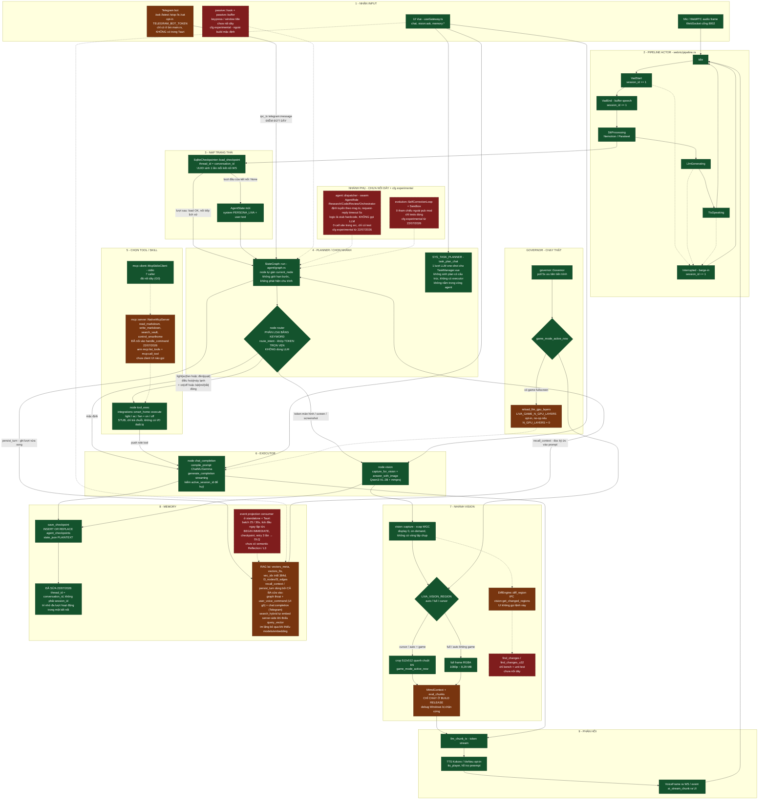
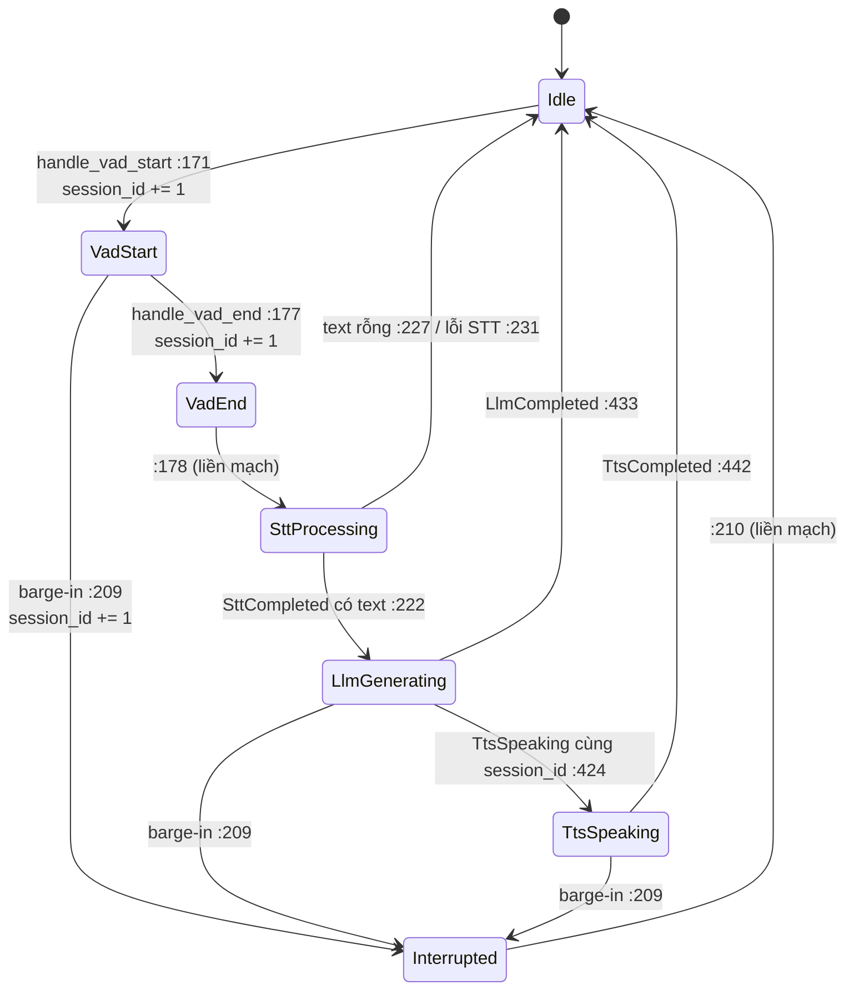
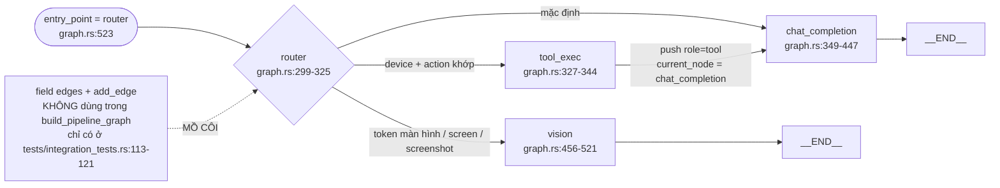
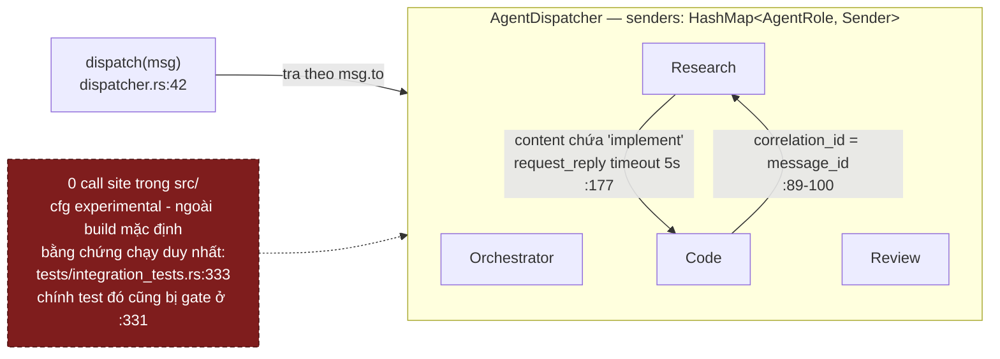
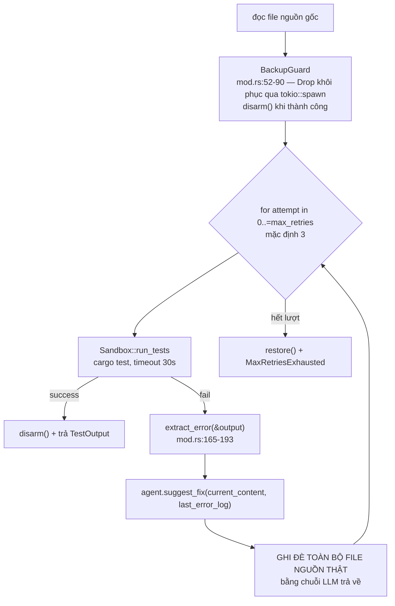

# Hệ agent, bộ nhớ và tiến hoá

> **FROZEN — snapshot khảo sát trước khi tách subsystem.** Nguồn chuẩn hiện hành cho agent và
> tool runtime là [Agent và tool runtime](../03-he-thong-con/agent-tools.md); memory là
> [Memory runtime](../03-he-thong-con/memory.md); ranh giới an toàn là
> [Action policy](../05-chat-luong/action-policy.md). Phần evolution dưới đây chỉ giữ làm bằng
> chứng lịch sử/experimental.

[⬆ Mục lục](../README.md) · [◀ Hệ LLM và prompt](04-he-llm-va-prompt.md) · [Thị giác, passive và governor ▶](06-thi-giac-passive-va-governor.md)

---

Tài liệu này mô tả **tầng agent** của LIVA: hai tầng máy trạng thái, `StateGraph` + `build_pipeline_graph`, router phân loại ý định, checkpoint bộ nhớ, swarm dispatcher và vòng tự sửa `evolution/`. Mọi khẳng định đều bám vào file/dòng code thật; nhánh nào **mồ côi** (có code nhưng 0 call site trong `src/`) được đánh dấu rõ ràng.

Quy ước nhãn dùng xuyên suốt:

- **[OK]** — đang chạy thật trong production.
- **[MỘT PHẦN]** — có code, đang chạy nhưng thiếu/hỏng một mảnh, hoặc chỉ bật khi opt-in.
- **[THIẾU]** — chưa có, là stub, hoặc **mồ côi** (không ai gọi).

> **Mốc 22/07/2026 — hai nhánh mồ côi của tầng agent đã bị đưa ra khỏi build mặc định.** Commit `4c08f18` đặt `src/agent/dispatcher.rs` (187 dòng, `src/agent/mod.rs:4-5`) và `src/evolution/` (428 dòng, `src/lib.rs:14-15`) — cùng với `src/passive/` (647 dòng, `src/lib.rs:12-13`) — sau `#[cfg(feature = "experimental")]`. Code **vẫn còn trong repo nhưng không được biên dịch** với `cargo build`/`cargo test` thường; muốn dịch phải thêm `--features experimental`. CI giữ chúng khỏi mục nát bằng bước `cargo check --all-targets --features experimental` (`.github/workflows/test.yml:86-88`). Vì vậy trong tài liệu này, "mồ côi" giờ có **hai lớp**: không ai gọi (như trước) **và** không nằm trong binary mặc định (mới).

---

## 1. Bảng tổng kết trạng thái nối dây

| Thành phần | File | Trạng thái |
|---|---|---|
| `agent::state::AgentState` | `src/agent/state.rs` | **[OK]** — dùng trong pipeline giọng nói |
| `agent::graph::StateGraph` + `build_pipeline_graph` | `src/agent/graph.rs` | **[OK]** — chỉ trên đường **voice/WebRTC**, không phải đường `chat:completion` |
| `agent::memory::SqliteCheckpointer` | `src/agent/memory.rs` | **[OK]** — chạy thật; lỗi ngữ nghĩa cũ (~~thread_id đổi mỗi lượt~~) **đã sửa 22/07/2026**: khoá nay là `conversation_id` ổn định suốt kết nối (mục 5.3) |
| `agent::dispatcher` (swarm) | `src/agent/dispatcher.rs` | **[THIẾU] — MỒ CÔI + NGOÀI BUILD MẶC ĐỊNH**: 0 tham chiếu trong `src/`; từ 22/07/2026 nằm sau `#[cfg(feature = "experimental")]` (`src/agent/mod.rs:4-5`). Bằng chứng chạy duy nhất là `test_case_6_swarm_duplex_collaboration_no_deadlock` (`tests/integration_tests.rs:333`, `use …dispatcher` ở `:336`) — chính test này cũng bị gate ở `:331` nên **không chạy ở `cargo test` mặc định** |
| `evolution::{SelfCorrectionLoop, Sandbox}` | `src/evolution/*` | **[THIẾU] — MỒ CÔI + NGOÀI BUILD MẶC ĐỊNH**: 0 tham chiếu trong `src/` ngoài `pub mod evolution;` (`src/lib.rs:15`), và dòng ngay trên nó là `#[cfg(feature = "experimental")]` (`src/lib.rs:14`); chỉ tests dùng, mà hai file test cũng bị gate cả file |
| `mcp::server::NativeMcpServer` | `src/mcp/server.rs` | **[MỘT PHẦN]** — khởi tạo và nhét vào `AppState` (`src/main.rs:171,267`); từ 22/07/2026 `handle_command` đã có arm `"mcp:list_tools"` (`liva-native-core/src/lib.rs#handle_command`) và `"mcp:call_tool"` (`liva-native-core/src/lib.rs#handle_command`). ~~không có arm nào gọi `state.mcp_server`~~ không còn đúng. Vẫn đúng: **chưa client UI nào gọi hai lệnh này** |
| `mcp::client::{McpStdioClient, McpClientRegistry}` | `src/mcp/client.rs` | **[OK]** (26/07/2026, rung G0) — 7 call site; `llm/tool_calling.rs` dùng nó cho vòng tool-calling G1 |
| `integrations::smart_home` | `src/integrations/smart_home.rs` | **[MỘT PHẦN]** — 3 điểm gọi thật (node `tool_exec`, `integration:smart_home_control`, `integrations:list`/`get_skills_list`) nhưng thân hàm là **stub chỉ log** |
| `passive::{hook,buffer}` | `src/passive/*` | **[THIẾU] — MỒ CÔI + NGOÀI BUILD MẶC ĐỊNH**: grep `passive` trong `main.rs`/`lib.rs`/`webrtc/*` chỉ ra đúng 1 dòng `pub mod passive;` (`src/lib.rs:13`), và dòng ngay trên là `#[cfg(feature = "experimental")]` (`src/lib.rs:12`) từ 22/07/2026 |
| ~~`data/skill_whitelist.json`~~ | ~~`data/`~~ | **ĐÃ XOÁ 22/07/2026** (commit `92e79a3`, "dọn .env.example và xoá 2 file config chết"). Trước đó là ~~**[THIẾU] — CHẾT HOÀN TOÀN**~~: không file `.rs`/`.ts`/`.vue`/`.py` nào đọc nó. Nay grep toàn repo cho 0 kết quả và file không còn trên đĩa |

Bảng trên chỉ soi **phạm vi tầng agent**. Bảng nối dây/mồ côi cho toàn bộ crate (mọi module, mọi bảng SQL, mọi TODO) nằm ở tài liệu nợ kỹ thuật.

> 📌 Nguồn đầy đủ: [Đánh giá 02 — Nợ kỹ thuật và rủi ro](../03-danh-gia/02-no-ky-thuat-va-rui-ro.md)

---

## 2. Sơ đồ tổng thể — máy trạng thái, agent graph và các nhánh mồ côi

Sơ đồ dưới đây là bản gốc từ báo cáo khảo sát, **giữ nguyên không lược bỏ**. Màu xanh = chạy thật, màu nâu = opt-in / điều kiện, màu đỏ nét đứt = mồ côi / hỏng.

Đây là sơ đồ **luồng agent** (nhìn từ một lượt nói tới lúc trả lời), không phải sơ đồ triển khai. Các khối phụ trong sơ đồ chỉ vẽ ở mức đủ hiểu mạch — chi tiết thuộc về tài liệu sở hữu tương ứng:

> 📌 Sơ đồ kiến trúc tổng thể (client / shell / gateway / core): [Bản vẽ 01 — Kiến trúc tổng thể](01-kien-truc-tong-the.md)
> 📌 Khối S2/S9 (VAD, STT, TTS, ngưỡng thoại): [Bản vẽ 03 — Đường ống thoại](03-duong-ong-thoai.md)
> 📌 Khối S7 + governor (vùng chụp, passive, ngưỡng GPU): [Bản vẽ 06 — Thị giác, passive và governor](06-thi-giac-passive-va-governor.md)
> 📌 Khối S8 (bảng SQL, ERD, mã hoá): [Bản vẽ 07 — Tầng dữ liệu và bảo mật](07-tang-du-lieu-va-bao-mat.md)



---

## 3. Hai tầng máy trạng thái — KHÔNG có Planner/Executor cổ điển

LIVA **không** có kiến trúc Planner → Executor kiểu ReAct/LangGraph đầy đủ. Thay vào đó có **hai tầng máy trạng thái tách biệt**, tầng ngoài điều phối vòng đời thoại, tầng trong định tuyến nội dung một lượt.

### 3.1 Tầng ngoài — actor pipeline thoại [OK]

`src/webrtc/pipeline.rs:8-39`:

```rust
pub enum PipelineState { Idle, VadStart, VadEnd, SttProcessing, LlmGenerating, TtsSpeaking, Interrupted }

pub enum PipelineEvent {
    VadStart,
    VadEnd(Vec<f32>),
    Interrupted,
    SttCompleted { session_id: u64, result: Result<Option<String>, String> },
    TtsSpeaking { session_id: u64 },
    LlmCompleted { session_id: u64, result: Result<(), String> },
    TtsCompleted { session_id: u64, result: Result<(), String> },
}
```

Actor: `pub struct WebRTCActor` (`pipeline.rs:72-94`) với

```rust
pub fn new(
    state_shared: Arc<AppState>,
    outgoing_tx: mpsc::Sender<VoiceFrame>,
    conversation_id: String,                 // thêm 22/07/2026 — khoá checkpoint
) -> (WebRTCPipelineHandle, Self)            // pipeline.rs:100
pub async fn run(mut self)                   // pipeline.rs:131
```

Từ 22/07/2026 actor giữ **hai** định danh tách bạch (`pipeline.rs:74-81`): `session_id: u64` là token huỷ tác vụ (tăng mỗi lượt VAD), còn `conversation_id: String` là khoá bộ nhớ hội thoại, **ổn định suốt vòng đời một kết nối**.

Vòng lặp `while let Some(event) = self.event_rx.recv().await` dispatch sang các `handle_*`. Chuyển trạng thái qua `fn transition_to(&mut self, new_state: PipelineState)` (`pipeline.rs:161`) — log `🔄 [State Transition]` rồi phát qua `watch::Sender<PipelineState>`.

**Chuyển trạng thái thật, trích từ code** (số dòng là vị trí lời gọi `transition_to`):

| Handler | Dòng | Chuyển sang |
|---|---|---|
| `handle_vad_start` | `:171` | `VadStart` |
| `handle_vad_end` | `:177`, `:178` | `VadEnd` rồi **ngay lập tức** `SttProcessing` |
| `handle_interrupted` | `:209`, `:210` | `Interrupted` rồi **ngay lập tức** `Idle` |
| `handle_stt_completed` | `:222` / `:227` / `:231` | `LlmGenerating` nếu có text; `Idle` nếu rỗng hoặc lỗi |
| `handle_tts_speaking` | `:424` | `TtsSpeaking` (chỉ khi `session_id` còn khớp) |
| `handle_llm_completed` | `:433` | `Idle` |
| `handle_tts_completed` | `:442` | `Idle` |

Máy trạng thái này dựng lại thành sơ đồ trạng thái:



Nối dây thật: `main.rs:477-506` accept WS + kiểm path `/ws` (`main.rs:491`) và kiểm `Origin` theo allow-list (`main.rs:497`) → `handle_ws_connection` (`main.rs:527`) → sinh `conversation_id = uuid::Uuid::new_v4()` (`main.rs:543`) → `WebRTCActor::new` (`main.rs:545`) + `tokio::spawn(actor.run())` (`main.rs:550`). VAD gọi `pipeline_handle.on_vad_start()` (`main.rs:711`), `on_vad_end(speech_audio)` (`main.rs:747`, `main.rs:770`), `on_interrupted()` (`websocket.rs#handle_ws_connection`).

> Ghi chú 22/07/2026: ~~`WebRTCPipelineHandle::feed_rtp_pcm` có thân hàm là `Ok(())` với 3 dòng `// TODO` — **[THIẾU]**~~ — hàm này **đã bị xoá hẳn** khỏi mã nguồn. `impl WebRTCPipelineHandle` (`pipeline.rs:47-70`) nay chỉ còn `state()`, `on_vad_start()`, `on_vad_end()`, `on_interrupted()`; grep `feed_rtp_pcm` trong `src/` cho 0 kết quả.

### 3.2 Không có Planner riêng [THIẾU]

Cái gần "planner" nhất là prompt `llm::persona::SYS_TASK_PLANNER` dùng bởi lệnh `task_plan_chat` (`src/lib.rs:792-892`): **một lượt LLM one-shot** đọc `title`/`description` của task từ bảng `tasks`.

- **Không** sinh plan có cấu trúc (không JSON step list).
- **Không** có executor tiêu thụ output.
- **Không** nằm trong vòng agent — nó là một lệnh gateway độc lập.

UI gọi nó ở `liva-ui/src/components/dashboard/TaskManager.vue:99,163`.

---

## 4. `StateGraph` — DAG có tên nhưng thực chất là chuỗi động

### 4.1 Hạ tầng đồ thị [OK]

```rust
pub type NodeFuture = Pin<Box<dyn Future<Output = Result<AgentState, String>> + Send>>;   // graph.rs:10
pub type NodeFn     = Box<dyn Fn(AgentState) -> NodeFuture + Send + Sync>;                // graph.rs:11

pub struct StateGraph {                        // graph.rs:13-17
    nodes: HashMap<String, NodeFn>,
    edges: HashMap<String, String>,            // 1 cạnh ra / node → KHÔNG phải DAG tổng quát
    entry_point: String,
}
```

API:

- `pub fn add_node<F, Fut>(&mut self, name: &str, node: F)` — `graph.rs:28`
- `pub fn add_edge(&mut self, from: &str, to: &str)` — `graph.rs:40`
- `pub fn set_entry_point(&mut self, node: &str)` — `graph.rs:44`
- `pub async fn run(&self, initial_state: AgentState) -> Result<AgentState, String>` — `graph.rs:48`

**Ngữ nghĩa thực thi** (`graph.rs:54-68`): lặp `while state.current_node != "__END__"`; gọi node hiện tại với `state.clone()`; **nếu node KHÔNG tự đổi `current_node`** thì mới đi theo `edges`, không có cạnh thì `__END__`. Tức là **định tuyến động do node tự quyết định** (conditional edge kiểu LangGraph), còn `edges` chỉ là fallback tuyến tính.

Ba nhận xét đọc thẳng từ code, không suy đoán:

1. Trong `build_pipeline_graph` **không có một lời gọi `add_edge` nào** — toàn bộ luồng đi bằng cách node tự gán `state.current_node`. Field `edges` chỉ được dùng ở test (`tests/integration_tests.rs:113-121`) ⇒ `add_edge` + `edges` là **API sống nhưng production không dùng — [THIẾU] (mồ côi một phần)**.
2. `run()` **không có giới hạn số bước / không phát hiện chu trình**. Một node gán `current_node` trỏ về chính nó sẽ lặp vô hạn.
3. `state.clone()` **mỗi vòng lặp** — copy toàn bộ lịch sử hội thoại mỗi bước.

### 4.2 Đồ thị production: `build_pipeline_graph` [OK]

```rust
pub fn build_pipeline_graph(
    state_shared: Arc<AppState>,
    llm_chunk_tx: mpsc::Sender<String>,
    session_id: u64,
    active_session_id: Arc<std::sync::atomic::AtomicU64>,
) -> StateGraph                                   // graph.rs:288-293
```

**4 node, entry point = `"router"`** (`graph.rs:523`):

| Node | File:dòng | Hành vi |
|---|---|---|
| `router` | `graph.rs:299-325` | `match route_intent(text)` (`graph.rs:309`) — phân loại **bằng token trọn vẹn, không dùng LLM** |
| `tool_exec` | `graph.rs:327-344` | Gọi `crate::integrations::smart_home::execute(payload)`, push message `{"role":"tool"}` → `chat_completion` |
| `chat_completion` | `graph.rs:349-447` | `trim_history()` → fallback persona → `recall_context` (RAG) → `compile_prompt` → `llm.generate_completion(...)` streaming token qua `llm_chunk_tx` → `persist_turn` → `__END__` |
| `vision` | `graph.rs:456-521` | `vision::capture::capture_for_vision()` → `llm.answer_with_image(..., VisionImage::Rgb{..})` streaming → `__END__` |

Sơ đồ 4 node và cách chúng tự định tuyến:



### 4.3 Luật router — phân loại ý định bằng `route_intent`, khớp token trọn vẹn [MỘT PHẦN]

> **Viết lại 22/07/2026.** Bản trước dùng `String::contains` trên chuỗi thường; `graph.rs` tăng từ 289 lên 693 dòng và toàn bộ router được thay bằng `enum Intent` + `route_intent()`. Grep `text_lower` trong `graph.rs` nay cho **0 kết quả**.

Bộ khung mới, trích nguyên văn (`graph.rs:77-84` và `graph.rs:90-111`):

```rust
pub enum Intent {                                            // graph.rs:77-84
    Vision,
    SmartHome { device: &'static str, action: &'static str },
    Chat,
}

fn tokenize(text: &str) -> Vec<String> {                     // graph.rs:90
    text.to_lowercase()
        .split(|c: char| !c.is_alphanumeric())               // giữ chữ có dấu
        .filter(|s| !s.is_empty())
        .map(|s| s.to_string())
        .collect()
}

fn has_phrase(tokens: &[String], phrase: &[&str]) -> bool { … }   // graph.rs:99
fn has_word(tokens: &[String], word: &str) -> bool {              // graph.rs:109
    tokens.iter().any(|t| t == word)                              // graph.rs:110 — so BẰNG, không phải chuỗi con
}
```

`route_intent` (`graph.rs:128-175`) chạy đúng ba bậc ưu tiên, node `router` chỉ `match route_intent(text)` (`graph.rs:309-321`):

1. **Vision** — `has_phrase(["màn","hình"])`, `has_word("screen")`, `has_word("screenshot")` hoặc `has_phrase(["trên","màn"])` (`graph.rs:132-138`). Ưu tiên cao nhất: hỏi về màn hình thì không thể là lệnh thiết bị.
2. **SmartHome** — cần **cả** `device` lẫn `action` (`graph.rs:171-174`):
   - `device`: `light`/`lamp`/`đèn` → `"light"` (`graph.rs:140-144`); `ac`/`điều hoà`/`điều hòa`/`máy lạnh` → `"ac"` (`graph.rs:145-150`); `fan`/`quạt` → `"fan"` (`graph.rs:151`).
   - `action`: `on`/`bật`/`mở` → `"on"` (`graph.rs:157-161`); `off`/`tắt`/`đóng` → `"off"` (`graph.rs:162-166`).
   - Node `router` set `context["device"]`, `context["action"]` rồi sang `"tool_exec"` (`graph.rs:313-317`).
3. **Chat** — còn lại → `"chat_completion"` (`graph.rs:318-320`).

> **RỦI RO CAO — false positive: ĐÃ SỬA 22/07/2026.** ~~Các so khớp là `contains` trần trên chuỗi thường, không tách từ: `"ac"` là chuỗi con của `back`, `track`, `place`…; `"on"` là chuỗi con của `money`, `phone`…; câu "we're back on track" thoả cả `device = ac` lẫn `action = on` ⇒ chạy `smart_home::execute` ngoài ý muốn.~~ `has_word` so token bằng `t == word` (`graph.rs:110`) nên các chuỗi con đó không còn khớp. Có test hồi quy `khong_con_duong_tinh_gia` (`graph.rs:536-548`) khẳng định `route_intent("let's get back on track") == Intent::Chat`, cùng các ca `coffee`, `money`, `office`, `place`.

> **RỦI RO — không có từ khoá tiếng Việt: ĐÃ SỬA 22/07/2026.** ~~Chỉ nhánh vision mới có `"màn hình"`; câu "bật đèn giúp mình" rơi thẳng vào `chat_completion` ⇒ nhánh tool không dùng được với người dùng Việt.~~ Nay có đủ `đèn`/`quạt`/`điều hoà`/`điều hòa`/`máy lạnh` và `bật`/`mở`/`tắt`/`đóng`. Test `hieu_duoc_tieng_viet` (`graph.rs:551-558`) khẳng định `route_intent("bật đèn giúp mình") == SmartHome { light, on }`.

> **RỦI RO CÒN NGUYÊN — chụp màn hình không xác nhận.** Nhánh Vision (`graph.rs:132-138`) kích hoạt `capture_for_vision()` **không có bước xin phép nào**. Cơ chế nhận diện đã đổi từ `contains` sang token, nhưng khoảng trống về đồng thuận thì chưa được vá.

> **RỦI RO CÒN NGUYÊN — vẫn là định tuyến theo từ khoá.** Đây chưa phải tool-calling có schema do LLM sinh; chính doc-comment trong mã nguồn ghi rõ điều đó (`graph.rs:125-127`).

### 4.4 Cơ chế huỷ (barge-in) trong node [OK]

Cả `chat_completion` lẫn `vision` kiểm huỷ **hai lần** — trước và sau khi lấy `blocking_lock` của LLM — bằng cách so `active_session_id` với `session_id` đã bind lúc dựng graph (`graph.rs:404-410`, `graph.rs:472-479`):

```rust
if as_val.load(Ordering::SeqCst) != session_id {
    return Err("LLM cancelled before lock".to_string());
}
let mut llm = ss.llm.blocking_lock();
if as_val.load(Ordering::SeqCst) != session_id {
    return Err("LLM cancelled post-lock".to_string());
}
```

Ngoài ra callback token trả `false` để dừng sinh khi phiên bị thay (`graph.rs:418-424`).

`chat_completion` có **fallback persona**: nếu chuỗi message không có role `system` thì chèn `crate::llm::persona::PERSONA_LIVA` ở vị trí 0 (`graph.rs:369-374`) — dành cho checkpoint cũ tạo trước khi có persona.

`vision` khi lỗi: log `tracing::warn!("[vision] {}")` rồi đẩy chuỗi xin lỗi cứng `"Xin lỗi, hiện mình chưa xem được màn hình."` vào TTS (`graph.rs:509-514`).

### 4.5 `state.rs` — trạng thái phiên + cắt cửa sổ lịch sử (156 dòng) [OK]

> ~~"toàn bộ 10 dòng"~~ — con số cũ chỉ đúng khi file mới có mỗi `struct AgentState`. File nay dài **156 dòng**: 66 dòng mã + 90 dòng unit test (`mod tests` bắt đầu ở `state.rs:67`).

```rust
#[derive(Debug, Serialize, Deserialize, Clone, Default)]
pub struct AgentState {                 // state.rs:20-25
    pub messages: Vec<Value>,          // chat messages hoặc tool calls
    pub current_node: String,
    pub context: HashMap<String, Value>,
}
```

- `messages` là `Vec<serde_json::Value>` **không định kiểu** — role/content là chuỗi tự do, đọc bằng `.get("content").and_then(|c| c.as_str())`.
- `context` hiện chỉ mang 2 khoá `"device"` và `"action"` do node `router` đặt.
- `current_node` vừa là con trỏ thực thi vừa là tín hiệu định tuyến; giá trị đặc biệt: `"START"`, `"__END__"`.

**Cơ chế cắt cửa sổ lịch sử** (thêm cùng đợt viết lại 22/07/2026):

| Hàm | Dòng | Việc |
|---|---|---|
| `max_history_messages()` | `state.rs:12-18` | Đọc `LIVA_MAX_HISTORY_MESSAGES`, **mặc định 20** tin (≈10 lượt hỏi–đáp), không kể tin `system` |
| `AgentState::trim_history()` | `state.rs:38-40` | Gọi `trim_messages` trên chính `self.messages` |
| `trim_messages(&mut Vec<Value>)` | `state.rs:44-65` | Giữ tin `system` đầu tiên + `cap` tin gần nhất; bản dùng được trên `Vec<Value>` trần |

Vì sao cần: `compile_prompt` nhét **toàn bộ** `messages` vào prompt, còn `prune_kv_cache` chỉ chạy lúc sinh token chứ không chạy lúc prefill — không cắt thì prompt vượt `n_ctx` (mặc định 4096) sau vài chục lượt và `decode()` hỏng. Đây là chốt chặn theo **số tin nhắn**, không phải theo token.

Ba điểm gọi thật: `chat_completion` cắt trước khi dựng prompt (`graph.rs:358`) và cắt lại sau khi thêm câu trả lời để `agent_checkpoints` không phình vô hạn (`graph.rs:442`); nhánh load checkpoint thành công cắt ngay sau khi push câu hỏi mới (`pipeline.rs:262`).

---

## 5. `memory.rs` — thực chất chỉ là checkpointer [OK sau bản sửa 22/07/2026]

### 5.1 Toàn bộ nội dung file (56 dòng)

```rust
pub struct SqliteCheckpointer { db: Arc<DatabasePool> }                                          // memory.rs:5
pub fn new(db: Arc<DatabasePool>) -> Self                                                        // memory.rs:10
pub async fn save_checkpoint(&self, thread_id: &str, state: &AgentState) -> Result<(), String>   // memory.rs:14
pub async fn load_checkpoint(&self, thread_id: &str) -> Result<Option<AgentState>, String>       // memory.rs:34
```

SQL ghi (`memory.rs:24`):

```sql
INSERT OR REPLACE INTO agent_checkpoints (thread_id, state_json) VALUES (?1, ?2)
```

serialize **toàn bộ `AgentState` thành JSON**. Bảng (`src/db.rs:216-219`):

```sql
CREATE TABLE IF NOT EXISTS agent_checkpoints (
    thread_id TEXT PRIMARY KEY,
    state_json TEXT NOT NULL
);
```

Ghi qua `pool.writer`, đọc qua `pool.readers`, cả hai đều bọc `tokio::task::spawn_blocking`.

### 5.2 Những thứ **KHÔNG** có trong `memory.rs` [THIẾU]

- ~~**Không** phân tầng ngắn hạn / dài hạn.~~ **Lỗi thời từ 22/07/2026.** Đúng là bản thân `memory.rs` không phân tầng, nhưng hai tầng nay nằm ở nơi khác: ngắn hạn do `AgentState::trim_history()` (`state.rs:38`) giới hạn 20 tin, dài hạn do RAG trong `agent/graph.rs` giữ (mục 5.4).
- ~~**Không** truy hồi bằng embedding. Không có lời gọi `search_hybrid_vectors` / `llm:embed` nào từ `agent/`.~~ **Sai từ 22/07/2026.** `agent/graph.rs:221` gọi thẳng `crate::db::search_hybrid_vectors(&conn, &query, &vector, top_k, &filter, 1.0, 1.0)`, với vector do `EmbeddingEngine::embed_query` sinh (`graph.rs:204`) qua `state.embedder` (`graph.rs:202`). Embedding **tách hẳn khỏi model chat**: field `AppState.embedder` (`lib.rs:51`) trỏ tới một engine ONNX riêng 384 chiều ở `src/llm/embedder.rs` (353 dòng, `EMBEDDING_DIM` ở `embedder.rs:43`) — nên khẳng định cũ kiểu "chat và embedding dùng chung một `LlamaContext`" cũng không còn đúng.
- **Projection consumer đã có; semantic consolidator chưa có.** `persist_conversation_event_vector()` ghi event pending cùng vector/FTS trong một transaction. `memory_consolidation.rs` chạy ở cả standalone và Tauri, dùng `BEGIN IMMEDIATE`, batch 25 mỗi 30 giây, xác minh `eventId == vec_id`, type, domain/category và `source_event_ids=[eventId]`; hợp lệ thì đánh dấu `consolidated`, lỗi thì retry tối đa 3 lần rồi ghi `dlq_consolidation`. Checkpoint và chuyển trạng thái event nằm cùng transaction. Worker này **không gọi LLM, không tạo fact/relationship và không ghi L3**.
- **Không** mã hoá. Trái ngược với `facts` (dùng `db::set_fact(&conn, &state.crypto, &fact)` — `liva-native-core/src/commands/memory.rs#handle`), `state_json` được lưu **plaintext** dù chứa nguyên văn hội thoại.

### 5.3 KHOÁ CHECKPOINT — lỗi `session_id` làm `thread_id` ĐÃ SỬA 22/07/2026

> **Đây từng là lỗi nghiêm trọng nhất của tầng agent.** Bản cũ dùng `let session_id_str = session_id.to_string();` làm khoá, mà `session_id` tăng ở **mọi** sự kiện VAD ⇒ `load_checkpoint` không bao giờ đọc lại được gì. Toàn bộ mô tả dưới đây là **trạng thái sau khi sửa**; phần bị gạch ngang giữ lại để đối chiếu với các tài liệu cũ còn trích lỗi này.

Nối dây tại `src/webrtc/pipeline.rs:252-303`:

```rust
let checkpointer = crate::agent::memory::SqliteCheckpointer::new(Arc::new(state_llm.db.clone()));
// Khoá là conversation_id, KHÔNG phải session_id: session_id tăng ở
// mỗi sự kiện VAD nên dùng nó thì không bao giờ đọc lại được gì.
let thread_id = conversation_id;                       // pipeline.rs:255

// Load existing checkpoint
let loaded = checkpointer.load_checkpoint(&thread_id).await;   // pipeline.rs:258
let state = match loaded {
    Ok(Some(mut st)) => {                              // pipeline.rs:260-265 — CHẠM TỚI ĐƯỢC từ lượt thứ hai
        st.messages.push(serde_json::json!({"role": "user", "content": text}));
        crate::agent::state::trim_messages(&mut st.messages);   // pipeline.rs:262
        st.current_node = "router".to_string();
        st
    }
    _ => {                                             // pipeline.rs:266-275 — lượt đầu của kết nối
        crate::agent::state::AgentState {
            messages: vec![
                serde_json::json!({"role": "system", "content": crate::llm::persona::PERSONA_LIVA}),
                serde_json::json!({"role": "user", "content": text}),
            ],
            current_node: "router".to_string(),
            context: std::collections::HashMap::new(),
        }
    }
};
```

`conversation_id` là field riêng của actor (`pipeline.rs:81`), nhận vào từ `WebRTCActor::new(..., conversation_id: String)` (`pipeline.rs:100-104`) và được `main.rs:543` sinh **một lần cho mỗi kết nối WS** bằng `uuid::Uuid::new_v4()`.

Trong khi đó `session_id` vẫn **tăng ở MỌI sự kiện VAD** — nhưng nay nó chỉ làm đúng việc của mình là token huỷ tác vụ:

```rust
async fn cancel_active_operations(&mut self) {        // pipeline.rs:445-447
    self.session_id += 1;
    self.active_session_id.store(self.session_id, Ordering::SeqCst);
```

và `cancel_active_operations()` được gọi trong `handle_vad_start` (`:170`), `handle_vad_end` (`:176`) và `handle_interrupted` (`:208`).

**Hệ quả cũ và trạng thái hiện tại:**

| # | Hệ quả (bản cũ) | Trạng thái sau 22/07/2026 |
|---|---|---|
| 1 | ~~**Hội thoại không có trí nhớ đa lượt** — mỗi lượt nói sinh `thread_id` mới ⇒ `load_checkpoint` luôn trả `None`~~ | **ĐÃ SỬA.** `thread_id = conversation_id` (`pipeline.rs:255`) ổn định suốt kết nối ⇒ từ lượt thứ hai trở đi lịch sử được nạp lại |
| 2 | ~~**Rò rỉ dung lượng** — bảng phình 1 hàng mỗi lượt nói~~ | **ĐÃ SỬA.** Một kết nối = một hàng; `INSERT OR REPLACE` ghi đè đúng hàng đó, và `trim_messages` giữ `state_json` không phình |
| 3 | ~~**Ghi đè xuyên phiên** — `session_id: 0` reset mỗi lần reconnect~~ | **ĐÃ SỬA.** `session_id: 0` vẫn còn (`pipeline.rs:115`) nhưng **không còn là khoá bộ nhớ** |
| 4 | ~~**Đụng khoá giữa các kết nối** — hai kết nối đều sinh `"1"`, `"2"`, …~~ | **ĐÃ SỬA.** Khoá là UUID v4 nên hai kết nối không thể trùng |
| 5 | ~~**Code chết** — nhánh "load thành công" không thể chạm tới~~ | **ĐÃ SỬA.** Nhánh `Ok(Some(mut st))` (`pipeline.rs:260-265`) nay chạy thật |

**Bản chất của lỗi (giữ lại để hiểu vì sao sửa như vậy):** `thread_id` phải là **định danh hội thoại bền vững**, còn `session_id` trong LIVA là **bộ đếm huỷ tác vụ** (cancellation token) — hai khái niệm ngược nhau về vòng đời. Bản sửa tách hẳn hai field thay vì cố dùng chung một biến; chính doc-comment trong mã nguồn ghi lại lập luận đó (`pipeline.rs:74-81`).

**Giới hạn còn lại:** `conversation_id` sinh mới ở **mỗi kết nối WS**, nên checkpoint đa lượt chỉ bền trong **một phiên kết nối**; đóng/mở lại ứng dụng là mất. Muốn nối lại đúng checkpoint phải truyền lại cùng một `conversation_id` — chữ ký `WebRTCActor::new` đã sẵn sàng cho việc đó, chỉ thiếu chỗ lưu định danh phía client.

**Cô lập RAG từ 23/07/2026:** bộ nhớ dài hạn không còn truy vấn global. `ConversationMemoryScope` ghi `type=conversation_turn`, dùng `domain=memory_owner:<owner_id>` làm ranh giới bắt buộc và `category=conversation:<conversation_id>` làm lineage. Voice/UI và Telegram DM vẫn nhớ xuyên nhiều conversation của cùng owner. Telegram group là audience nhiều người nên recall thêm điều kiện `category` đúng `chat_id`; ký ức DM hoặc group khác của cùng sender không thể xuất hiện trong câu trả lời gửi ra group. Group vẫn **per-sender** theo quyết định sản phẩm beta: hai người trong cùng phòng dùng chung audience category nhưng có owner domain khác nhau, nên A không recall lượt của B. Shared group memory chỉ được cân nhắc lại dưới cơ chế opt-in theo `chat_id`, kèm policy cho thành viên mới/rời nhóm. Hai test `telegram_group_khong_recall_ky_uc_dm_cua_cung_owner` và `memory_scope_telegram_phan_biet_dm_va_group_audience` khóa ranh giới dữ liệu, wiring Telegram và semantics per-sender.

Schema migration v2 cách ly riêng các vector legacy có `type=conversation_turn AND domain=General` vào `domain=memory_owner:legacy_unowned`; dữ liệu vẫn còn nhưng không khớp bất kỳ owner scope hợp lệ nào nên RAG bỏ qua. Vector type khác và các owner đã được scope không bị đổi. DB đã từng chạy bản v2 cũ và gộp dữ liệu vào `memory_owner:local` không thể được tự động phân loại lại an toàn, vì không còn dấu hiệu phân biệt lượt local thật với lượt legacy. Bộ lọc recall mặc định cố ý giữ `type=conversation_turn`: đây là bộ nhớ hội thoại, không tự động trộn các vector `fact`/`semantic`/kết quả consolidation vào prompt. Khi cần recall các loại đó phải có policy và đường truy vấn riêng thay vì nới bộ lọc hội thoại.

### 5.4 Bộ nhớ dài hạn — RAG đã nối vào đường chat 22/07/2026 [MỘT PHẦN — thiếu model]

`src/db.rs:310-361` định nghĩa sẵn một hạ tầng RAG lai đầy đủ: `vectors_meta` (`db.rs:310`) + `vectors_fts` (FTS5 giữ dấu tiếng Việt, `db.rs:328`) + knowledge graph `l3_nodes`/`l3_edges` (`db.rs:333`, `db.rs:339`) + `vec_idx` (sqlite-vec, int8 384 chiều, tạo có điều kiện ở `db.rs:358`), phục vụ ba hàm tìm kiếm `search_similar_vectors` (KNN), `search_fts_vectors` (BM25) và `search_hybrid_vectors` (RRF).

Truy cập qua gateway bằng `memory:set_fact`, `memory:get_fact`, `memory:search_hybrid`, `memory:upsert_vector`, `llm:embed`.

> 📌 Nguồn đầy đủ (schema từng bảng, công thức chấm điểm dense/RRF, ai ghi ai đọc): [Bản vẽ 07 — Tầng dữ liệu và bảo mật](07-tang-du-lieu-va-bao-mat.md)

> ~~**Nhưng `build_pipeline_graph` không hề chạm vào `state_shared.db`.**~~ **Sai từ 22/07/2026** — chính `agent/graph.rs` nay đọc và ghi RAG.

Hai hàm mới trong `agent/graph.rs` nối RAG thẳng vào node `chat_completion`:

| Hàm | Dòng | Việc |
|---|---|---|
| `rag_top_k()` | `graph.rs:182-188` | Đọc `LIVA_RAG_TOP_K`, **mặc định 3**, chặn ngoài khoảng 1–20 |
| `recall_context()` | `graph.rs:193-242` | `state.embedder` → `embed_query` (`:204`) → `state.db.readers` (`:213`) → `crate::db::search_hybrid_vectors(...)` (`:221`) → nối các ký ức thành một khối text |
| `persist_turn()` | `graph.rs:249-286` | `embed_passage` (`:259`) → `state.db.writer` (`:268`) → `crate::db::upsert_vector(...)` (`:270`), loại `"conversation_turn"` |

Node `chat_completion` gọi `recall_context` và chèn ký ức làm message `system` ở **vị trí 1**, ngay sau persona (`graph.rs:384-396`); sau khi sinh xong câu trả lời thì gọi `persist_turn` **trước** khi cắt lịch sử, để nội dung rơi khỏi cửa sổ ngữ cảnh không mất hẳn (`graph.rs:434`).

**Hai giới hạn còn nguyên, phải nói rõ:**

1. **Chưa có model embedding trên máy.** Thư mục `models/embedding/` không tồn tại trong repo (weights fetch out-of-band). `EmbeddingEngine::load` không chạy ⇒ `state.embedder` là `None` ⇒ `recall_context` trả `None` và `persist_turn` return sớm, kèm cảnh báo log. Hệ thống **hành xử đúng như trước khi có RAG**, không lỗi — có test khoá hợp đồng này: `khong_co_model_thi_rag_im_lang_tat` (`graph.rs:648-660`).
2. **UI vẫn không gọi API RAG.** Grep `memory:search_hybrid` / `memory:upsert_vector` trong `liva-ui/src` vẫn cho **0 kết quả**. Nên kết luận cũ ~~"RAG tồn tại như một API mà client phải tự lái"~~ nay chỉ còn đúng cho **đường JSON/UI**; đường thoại thì lõi Rust tự lái.

---

## 6. Swarm dispatcher — CÓ CODE, ĐANG TẮT [THIẾU — MỒ CÔI + NGOÀI BUILD MẶC ĐỊNH]

### 6.1 Kiểu dữ liệu

```rust
pub enum AgentRole { Research, Code, Review, Orchestrator }   // dispatcher.rs:8-13

pub struct AgentMessage {                                      // dispatcher.rs:16-23
    pub message_id: String, pub trace_id: String,
    pub from: AgentRole, pub to: AgentRole,
    pub content: String, pub correlation_id: Option<String>,
}

pub struct AgentDispatcher { senders: Arc<RwLock<HashMap<AgentRole, mpsc::Sender<AgentMessage>>>> }
pub struct SwarmAgent { role, dispatcher, receiver, pending_replies: Arc<Mutex<HashMap<String, oneshot::Sender<AgentMessage>>>> }
```

API: `AgentDispatcher::register_agent(&self, role, sender)`, `AgentDispatcher::dispatch(&self, msg) -> Result<(), String>`, `SwarmAgent::new(role, dispatcher, receiver)`, `SwarmAgent::start(self) -> JoinHandle<()>`.

### 6.2 Cách phân việc

- **Không** có scheduler, **không** có hàng đợi công việc. Định tuyến **thuần theo `msg.to`** — tra `HashMap<AgentRole, Sender>`, một role ↔ một mailbox.
- "Song song" đến từ chỗ mỗi message nhận được lại được `tokio::spawn` riêng (`dispatcher.rs:88`), nên một agent xử lý nhiều message đồng thời và không tự deadlock khi request-reply lồng nhau.
- **Request/reply:** `request_reply_internal` (`dispatcher.rs:150-185`) tạo `oneshot::channel`, ghi vào `pending_replies` theo `message_id`, gửi đi rồi chờ **timeout 5 giây** (`dispatcher.rs:177`). Reply được nhận diện bởi `correlation_id == Some(request message_id)` (`dispatcher.rs:89-100`).



### 6.3 Logic agent là stub hardcode, KHÔNG gọi LLM

`dispatcher.rs:116-136`:

- `Research`: nếu `msg.content.contains("implement")` → uỷ quyền sang `Code`, ghép chuỗi `"Research results: Code completed: {}"`; ngược lại trả `"Research findings on: {}"`.
- `Code`: trả literal `"// Auto-generated Rust Code\nfn main() { println!(\"Done: {}\"); }"`.
- `Review`, `Orchestrator`: rơi vào `_ => format!("Role {:?} stub response", role)`.

### 6.4 Trạng thái: TẮT — vừa vì MỒ CÔI, vừa vì CỜ

Trước 22/07/2026 nhánh này tắt **thuần vì mồ côi**: không có feature-flag, không có env var, đơn giản là không ai gọi. Từ commit `4c08f18` (22/07/2026) nó tắt bằng **cả hai lớp**:

1. **Vẫn mồ côi** — 0 call site trong `src/`. Grep `dispatcher::` trong `src/` không ra hit nào ngoài chính file định nghĩa.
2. **Và bị gate biên dịch** — `src/agent/mod.rs:4-5`:

```rust
#[cfg(feature = "experimental")]
pub mod dispatcher;
```

`experimental` là feature rỗng, **không** nằm trong `default` (`liva-native-core/Cargo.toml:64-78`, `default = []` ở `:65`, `experimental = []` ở `:75`). Nghĩa là với `cargo build` / `cargo test` thường, 187 dòng của `dispatcher.rs` **không được đưa vào cây biên dịch chút nào**.

Bằng chứng chạy được duy nhất vẫn là test `test_case_6_swarm_duplex_collaboration_no_deadlock` (`tests/integration_tests.rs:333`, `use …::dispatcher::{…}` ở `:336`) — test tự tay `register_agent` cho `Orchestrator`/`Research`/`Code` rồi `dispatch` một message. Nhưng chính test đó cũng mang `#[cfg(feature = "experimental")]` ở `tests/integration_tests.rs:331`, và cả file `tests/swarm_stress_tests.rs` (161 dòng) bị gate ở dòng 5 bằng `#![cfg(feature = "experimental")]` ⇒ **`cargo test` mặc định không chạy dòng swarm nào**. Muốn chạy: `cargo test --features experimental`. CI chỉ compile-check chúng (`.github/workflows/test.yml:86-88`), không chạy.

⇒ Muốn bật swarm nay cần **ba** việc, không phải hai: (0) **đưa module trở lại build** — bỏ `#[cfg(feature = "experimental")]` hoặc bật `--features experimental`; (a) tạo call site (ví dụ arm `swarm:*` trong `handle_command` hoặc một node trong `build_pipeline_graph`); và (b) **thay stub bằng lời gọi LLM thật** — hiện logic role không hề chạm `AppState.llm`.

---

## 7. `evolution/` — vòng tự sửa code [THIẾU — MỒ CÔI + NGOÀI BUILD MẶC ĐỊNH]

> **Từ 22/07/2026 (commit `4c08f18`) cả thư mục này nằm sau `#[cfg(feature = "experimental")]`** (`src/lib.rs:14-15`). 428 dòng của `evolution/` không được biên dịch với `cargo build`/`cargo test` mặc định; mọi mô tả dưới đây chỉ áp dụng khi bật `--features experimental`. Code không bị xoá, và CI vẫn compile-check nó (`.github/workflows/test.yml:86-88`).

### 7.1 Sandbox (`src/evolution/sandbox.rs`, 133 dòng)

```rust
pub enum SandboxError { Io(std::io::Error), Timeout, SpawnFailed(String) }           // :8-12
pub struct TestOutput { pub success: bool, pub stdout: String, pub stderr: String }  // :32-37
pub struct Sandbox;
impl Sandbox {
    pub async fn run_tests(project_path: &Path) -> Result<TestOutput, SandboxError>  // :42
}
```

**Cơ chế cách ly thực tế — rất mỏng:**

- Chạy `cargo test` với `current_dir(project_path)` và `CARGO_TARGET_DIR = project_path/target_sandbox` (`sandbox.rs:43-50`). Đây là **cách ly thư mục build**, **KHÔNG phải cách ly bảo mật**.
- **Không** container, **không** chroot/jail, **không** giới hạn RAM/CPU, **không** giới hạn mạng, **không** hạ quyền, **không** lọc env. Code test được biên dịch và **chạy với đầy đủ quyền của process LIVA**.
- Giới hạn duy nhất: **timeout 30 giây** (`Duration::from_secs(30)`, `sandbox.rs:105`). Khi timeout, trên Windows gọi `taskkill /F /T /PID <pid>` để diệt cả cây tiến trình con, rồi `child.kill()` (`sandbox.rs:119-129`).
- Fallback Windows: nếu `Command::new("cargo")` spawn lỗi thì thử `cmd /C cargo test` (`sandbox.rs:57-73`).
- stdout/stderr piped, đọc song song bằng `tokio::join!(wait_child, read_stdout, read_stderr)` để tránh deadlock đầy buffer pipe (`sandbox.rs:97-103`).

### 7.2 Vòng tự sửa (`src/evolution/mod.rs`, 295 dòng — trong đó ~100 dòng là `#[cfg(test)]`)

```rust
pub trait CodeAgent: Send + Sync {
    fn suggest_fix(&self, source_content: &str, error_log: &str)
        -> impl Future<Output = Result<String, String>> + Send;      // :6-12
}

pub struct SelfCorrectionLoop<A: CodeAgent> { agent: A, max_retries: usize }               // :14
pub enum SelfCorrectionError { Io, Sandbox, Agent(String), MaxRetriesExhausted(String) }   // :20-25

pub fn new(agent: A) -> Self                                    // max_retries = 3  (:96)
pub fn with_max_retries(agent: A, max_retries: usize) -> Self
pub async fn run(&self, project_path: &Path, source_file_path: &Path)
    -> Result<TestOutput, SelfCorrectionError>                  // :104
```

**Thuật toán** (`mod.rs:104-163`):



`extract_error` (`mod.rs:165-193`) lọc các dòng chứa `error[E`, `error:`, `--> `, `panicked at`, `failed`, và khối `failures:`.

### 7.3 Có thật sự chạy được không?

**Cơ chế thì chạy được, nhưng hệ thống thì chưa bao giờ chạy.** Cụ thể:

- **Không có implementor `CodeAgent` nào trong `src/`.** Toàn bộ implementor là mock trong test: `MockCodeAgent` (`mod.rs:201-220`, `impl CodeAgent` tại `mod.rs:206`), `IterativeMockAgent` (`tests/self_correction_stress.rs:52+`, `impl CodeAgent` tại `:57`), và `MultiAttemptAgent` (`tests/sandbox_stress.rs:168`, `impl CodeAgent` tại `:172`). Nghĩa là **không có cầu nối tới LLM** — LIVA **chưa hề "tự viết bản vá"**.
- Grep `evolution` trong `src/`: chỉ ra đúng hai dòng liền nhau `src/lib.rs:14  #[cfg(feature = "experimental")]` và `src/lib.rs:15  pub mod evolution;`. Không có lệnh gateway nào (`handle_command` không có arm `evolution:*`), không có background task nào trong `main.rs`.
- Test tự chứng minh cơ chế hoạt động: `mod.rs:248-294` (`test_self_correction_loop_syntax_error`) dựng một crate tạm trong `std::env::temp_dir()`, ghi `src/lib.rs` lỗi cú pháp, mock trả về code đúng → assert `output.success`. Cùng với `tests/sandbox_stress.rs` (228 dòng) và `tests/self_correction_stress.rs` (269 dòng) — hai file này spawn `cargo test` lồng nhau nên rất chậm, đúng như `CLAUDE.md` ghi.
- **Nhưng từ 22/07/2026 không test nào trong số đó chạy ở `cargo test` mặc định.** Cả hai file stress bị gate nguyên file bằng `#![cfg(feature = "experimental")]` ở dòng 5, còn các unit test nội tuyến trong `mod.rs` biến mất cùng module. Muốn chạy lại: `cargo test --features experimental`.

> **RỦI RO nếu định bật:** `run()` **ghi đè trực tiếp file nguồn thật** rồi mới rollback khi thất bại, và sandbox **không chặn được** code do LLM sinh ra khi nó được biên dịch và chạy (không giới hạn quyền, mạng, tài nguyên). Bật nhánh này mà không bổ sung cách ly thật là mở một đường thực thi mã tuỳ ý.

---

## 8. Tool / skill calling

### 8.1 LIVA hiện gọi công cụ thế nào [MỘT PHẦN]

**Không** có tool-calling theo kiểu function-calling của LLM (không parse JSON tool call từ model). Chỉ có **1 đường duy nhất, bằng keyword**: node `router` → node `tool_exec` → `integrations::smart_home::execute()`.

`src/integrations/mod.rs` chỉ có `pub mod smart_home;` ⇒ **toàn hệ thống có đúng 1 skill**, và `smart_home::execute` (`smart_home.rs:51-67`) **chỉ log rồi trả chuỗi** — không có giao thức, không điều khiển thiết bị thật.

Điều đáng nói ở tầng agent: `get_metadata()` đã sẵn schema chuẩn function-calling nhưng **không được nhét vào prompt ở đâu cả** — `compile_prompt` chỉ nhận `Vec<ChatMessage>`. Nghĩa là ngay cả khi có thêm skill, model cũng không "nhìn thấy" chúng; định tuyến vẫn phải đi qua keyword ở node `router`.

> 📌 Nguồn đầy đủ (kiểu dữ liệu, thân hàm stub, vì sao chưa có giao thức): [Bản vẽ 09 — Tích hợp ngoài](09-tich-hop-ngoai.md)

### 8.2 Danh sách skill lộ ra UI [OK]

`get_skills_list` (`lib.rs:612-616`) và `integrations:list` (`liva-native-core/src/commands/integrations.rs#handle`) đều trả `[ smart_home::get_metadata() ]` — mảng **1 phần tử**. UI tiêu thụ ở `liva-ui/src/components/dashboard/SkillsView.vue:107,141` và `liva-ui/src/composables/useGateway.ts:162,283,318`.

### 8.3 `data/skill_whitelist.json` — đã bị xoá 22/07/2026 [KHÔNG CÒN]

~~File này bật/tắt 4 skill (`privacy_dashboard`, `system_audit`, `send_zalo_rpa`, `read_emails`) nhưng grep `skill_whitelist` toàn repo cho **0 kết quả** ngoài chính nó — đây là di sản của engine TypeScript/Python đã bị xoá.~~

Chính file cũng đã bị gỡ khỏi repo (commit `92e79a3`, "dọn .env.example và xoá 2 file config chết"). `data/` nay chỉ còn `agents/`, `credentials.json`, `global/`, `liva-config.json`, `liva_vault.json`, `research/`, `token.json`, `user_profile.json`; grep `skill_whitelist` trong mọi file `.rs`/`.ts`/`.vue`/`.py` cho đúng **0 kết quả**.

Hệ quả cho tầng agent **không đổi**: **không có cơ chế whitelist skill nào đang được thực thi**. Node `tool_exec` gọi thẳng `smart_home::execute` mà không tra cứu quyền ở đâu cả; nếu sau này nối swarm/MCP vào graph thì phải tự dựng lại lớp kiểm soát này — nay là dựng mới hoàn toàn, không còn file cũ để dựa vào.

> 📌 Nguồn đầy đủ (nội dung file, các di sản `data/agents/*` cùng loại): [Bản vẽ 07 — Tầng dữ liệu và bảo mật](07-tang-du-lieu-va-bao-mat.md)

### 8.4 MCP — tool server đã cắm vào dispatcher lệnh, chưa cắm vào agent graph [MỘT PHẦN]

`src/mcp/server.rs` khai báo `NativeMcpServer` với **6 tool**: bốn tool vault/thiết bị (`read_markdown`, `write_markdown`, `search_vault`, `control_smarthome`) — đọc/ghi trong Obsidian vault, có `resolve_path` chống path-traversal — cộng `control_volume` / `control_media` thêm ở U19 (`6b5b87b`). `src/mcp/client.rs` là **MCP client stdio thật** (`McpStdioClient` + `McpClientRegistry`, viết lại ở rung G0 ngày 25–26/07/2026): handshake `initialize`, tương quan id, `tools/list` + `tools/call`, drain stderr, đọc `mcp_config.json`.

> 📌 Nguồn đầy đủ (bảng tool + args, `protocol.rs` lệch spec, bảo mật MCP): [Bản vẽ 09 — Tích hợp ngoài](09-tich-hop-ngoai.md)

Phần liên quan tầng agent là **ranh giới nối dây**: `main.rs:171` `NativeMcpServer::new(&vault_path)` → `main.rs:267` nhét vào `AppState` (field `pub mcp_server: Arc<mcp::server::NativeMcpServer>` — `lib.rs:44`).

> ~~**Nhưng grep `mcp_server` trong `src/` chỉ ra 6 hit và không hit nào là điểm sử dụng**~~ và ~~`handle_command` **không có arm `mcp:*`**~~ — **cả hai đều sai từ 22/07/2026.** Grep lại cho **9 hit**, trong đó **2 hit là điểm sử dụng thật**.

Hai arm mới trong `handle_command`:

| Lệnh | Dòng | Việc |
|---|---|---|
| `"mcp:list_tools"` | `liva-native-core/src/lib.rs#handle_command` | Trả `state.mcp_server.list_tools()` đã serialize |
| `"mcp:call_tool"` | `liva-native-core/src/lib.rs#handle_command` | Đọc `name` + `arguments` (thiếu `arguments` coi như `{}`) rồi gọi `state.mcp_server.call_tool(CallToolRequest{..})` (`liva-native-core/src/lib.rs#handle_command`) |

Bảy hit còn lại là khai báo field (`lib.rs:44`), khởi tạo + nhét vào `AppState` ở `main.rs` (`:171`, `:267`), và 4 chỗ dựng `AppState` giả cho test/bin (`main.rs#test_state`, `agent/graph.rs:631`, `src/bin/verify_duplex.rs:99`, `src/bin/verify_integrations.rs:41`).

⇒ Trạng thái đúng hiện nay: MCP server **đã có consumer ở lớp lệnh**, nhưng (a) **chưa client UI nào gọi** `mcp:list_tools`/`mcp:call_tool`, và (b) **agent graph vẫn không đi qua MCP** — node `tool_exec` gọi thẳng `smart_home::execute`. ~~`mcp::client::ProcessWrapper` … thì **vẫn hoàn toàn mồ côi**~~ — **không còn đúng từ 26/07/2026** (rung G0): `src/mcp/client.rs` nay là `McpStdioClient` + `McpClientRegistry`, 1 143 dòng, với 7 call site thật ngoài chính file — ba lệnh `mcp_client:*` trong `handle_command` và hai chỗ trong `llm/tool_calling.rs`. Điểm (b) ở trên vẫn đúng theo cách khác: node `tool_exec` vẫn gọi thẳng `smart_home::execute`, nhưng graph nay **có** một nhánh đi qua MCP — node `mcp_tool_exec`, chỉ chạy khi bật `LIVA_TOOL_CALLING=1`.

---

## 9. Ranh giới nối dây — chi tiết

### 9.1 Đã nối dây thật vào gateway (WS `ws://127.0.0.1:8002/ws`)

**Đường nhị phân (giọng nói) → agent graph:**

`main.rs:477-506` accept + kiểm path `/ws` (`:491`) + kiểm `Origin` theo allow-list (`:497`) → `handle_ws_connection` (`main.rs:527`) → `conversation_id = uuid::Uuid::new_v4()` (`main.rs:543`) → `WebRTCActor::new` (`main.rs:545`) + `tokio::spawn(actor.run())` (`main.rs:550`) → frame `OP_MIC_IN` → VAD → `on_vad_start`/`on_vad_end` → `PipelineState::SttProcessing` → `handle_stt_completed` → `spawn_llm_and_tts(text)` → **`SqliteCheckpointer::load_checkpoint` (khoá = `conversation_id`) → `build_pipeline_graph(...).run(state)` → `save_checkpoint`** (`pipeline.rs:252-303`) → token stream `llm_chunk_tx` → TTS chunker (`pipeline.rs:309+`) → `VoiceFrame` ra client.

> Đây là **con đường duy nhất** module `agent/` được thực thi trong production.

**Đường JSON (text) — KHÔNG đi qua agent graph:**

- `chat:completion` (`liva-native-core/src/commands/llm.rs#handle`) gọi thẳng `llm_manager.generate_completion` sau `compile_prompt`, có chèn persona server-side.
- `vision:ask` (`liva-native-core/src/commands/vision.rs#ask`) gọi thẳng `answer_with_image`.
- `task_plan_chat` gọi thẳng LLM với `SYS_TASK_PLANNER`.

Không router, không `tool_exec`, không checkpoint.

Nền tảng background đã bật trong `main.rs`: autoload router model qua `load_configured_router_model` (`:275-277`), governor game-aware GPU downshift poll 5s + `LIVA_GAME_N_GPU_LAYERS` (`:279-311`, đọc env ở `:288`, gọi `reload_llm_gpu_layers` ở `:303`), WS server (`:314-318`), TTS idle-unload 60s (`:322-328`), Telegram bot nếu có `TELEGRAM_BOT_TOKEN` (`:337-349`).

### 9.2 Còn mồ côi trong phạm vi tầng agent (có code, 0 call site trong `src/`)

Bốn nhánh dưới đây là **thứ chặn tầng agent tiến hoá**, nên liệt kê tại chỗ:

1. `src/agent/dispatcher.rs` (187 dòng) — toàn bộ swarm (`AgentDispatcher`/`SwarmAgent`/`AgentRole`/`AgentMessage`). **Ngoài build mặc định từ 22/07/2026** (`src/agent/mod.rs:4-5`).
2. `src/evolution/` (428 dòng) — `SelfCorrectionLoop`, `Sandbox`, trait `CodeAgent` (**thiếu implementor thật**). **Ngoài build mặc định từ 22/07/2026** (`src/lib.rs:14-15`).
3. `StateGraph::add_edge` + field `edges` — API sống nhưng production không dùng (mục 4.2). Cái này **vẫn nằm trong build mặc định**, chỉ là không ai gọi.
4. ~~`src/mcp/client.rs` (49 dòng) — `ProcessWrapper` hoàn toàn không ai gọi~~ **đã rời danh sách 26/07/2026** (rung G0): 1 143 dòng, 7 call site, xem mục 8.4. ~~`src/mcp/server.rs` — server có instance sống trong `AppState` nhưng không có consumer~~ **không còn đúng** từ 22/07/2026: `handle_command` có `mcp:list_tools`/`mcp:call_tool`.

Ngoài ra còn `src/passive/*` (647 dòng, cũng bị gate `experimental` ở `src/lib.rs:12-13`) và 9 bảng SQL không có writer — chúng nằm ngoài tầng agent nên chỉ nhắc tên. Hai mục từng nằm trong danh sách này thì nay **không còn tồn tại**: ~~`feed_rtp_pcm`~~ đã bị xoá khỏi `pipeline.rs`, ~~`data/skill_whitelist.json`~~ đã bị xoá khỏi repo (mục 8.3).

> **Phân biệt quan trọng khi đọc mục này:** "mồ côi" (0 call site) và "ngoài build mặc định" (`#[cfg(feature = "experimental")]`) là hai chuyện khác nhau. Tổng cộng **1 262 dòng** — `passive/` 647 + `evolution/` 428 + `agent/dispatcher.rs` 187 — thoả **cả hai**; phần mồ côi còn lại (`add_edge`, `mcp/client.rs`, …) chỉ thoả điều kiện thứ nhất và vẫn được trình biên dịch xử lý bình thường.

> 📌 Nguồn đầy đủ (bảng mồ côi toàn crate, số dòng chết, nguyên nhân gốc là `#[allow(dead_code)]` cấp crate): [Đánh giá 02 — Nợ kỹ thuật và rủi ro](../03-danh-gia/02-no-ky-thuat-va-rui-ro.md)

---

## 10. Tóm tắt rủi ro tầng agent

Trong ba rủi ro nặng nhất từng do tầng agent sinh ra, **hai đã được vá ở mã nguồn ngày 22/07/2026**:

1. ~~Checkpoint dùng `session_id` làm `thread_id` ⇒ **không có trí nhớ đa lượt**~~ — **ĐÃ SỬA**: khoá nay là `conversation_id` (`pipeline.rs:255`), `session_id` quay về đúng vai trò token huỷ (`pipeline.rs:445-447`), mục 5.3. Còn lại: trí nhớ chỉ bền trong **một kết nối WS**.
2. ~~Router phân loại bằng `String::contains` ⇒ false-positive `"ac"`/`"on"` và **mù tiếng Việt**~~ — **ĐÃ SỬA**: `route_intent` khớp token trọn vẹn và có từ khoá tiếng Việt (`graph.rs:128-175`), kèm test hồi quy (`graph.rs:536-558`), mục 4.3.
3. `evolution::Sandbox` không phải cách ly bảo mật và `run()` ghi đè file nguồn thật trước khi rollback (`sandbox.rs:43-50`, `mod.rs:104-163`, mục 7) — **CÒN NGUYÊN**, chỉ **hạ tạm thời từ 22/07/2026** vì `evolution/` không còn nằm trong build mặc định; nó quay lại nguyên vẹn ngay khi ai đó bật `--features experimental`.

Mức nhẹ hơn — những thứ vẫn còn: `state_json` lưu plaintext trong khi `facts` được mã hoá; `StateGraph::run` không giới hạn bước và `clone()` state mỗi vòng; nhánh Vision **tự chụp màn hình không xin phép** (cơ chế nhận diện đã đổi từ `contains` sang token, nhưng bước đồng thuận thì chưa có — `graph.rs:132-138`); RAG đã nối dây nhưng **im lặng tắt** vì `models/embedding/` chưa có trên máy; MCP server có consumer ở lớp lệnh nhưng **chưa client nào gọi** và agent graph vẫn không đi qua nó.

> 📌 Nguồn đầy đủ (bảng rủi ro xếp hạng CRITICAL/HIGH/MEDIUM/LOW toàn hệ thống, mã định danh C*/H*/F*): [Đánh giá 02 — Nợ kỹ thuật và rủi ro](../03-danh-gia/02-no-ky-thuat-va-rui-ro.md) · hướng dẫn sửa: [Đánh giá 03 — Lộ trình sửa lỗi và nâng cấp](../03-danh-gia/03-lo-trinh-sua-loi-va-nang-cap.md)

---

## Liên quan

**Đọc tiếp theo mạch:** [⬆ Mục lục](../README.md) · [◀ Hệ LLM và prompt](04-he-llm-va-prompt.md) · [Thị giác, passive và governor ▶](06-thi-giac-passive-va-governor.md)

**Tài liệu này dựa vào (nguồn sự thật ở nơi khác):**

- [Bản vẽ 03 — Đường ống thoại](03-duong-ong-thoai.md) — chuỗi VAD → STT → LLM → TTS mà actor pipeline điều phối, ngưỡng VAD/AEC, bảng engine STT và backend TTS.
- [Bản vẽ 04 — Hệ LLM và prompt](04-he-llm-va-prompt.md) — `compile_prompt`, `PERSONA_LIVA`, `SYS_TASK_PLANNER` và cấu hình model mà node `chat_completion`/`vision` gọi tới.
- [Bản vẽ 06 — Thị giác, passive và governor](06-thi-giac-passive-va-governor.md) — `capture_for_vision`, `LIVA_VISION_REGION`, `passive/*` và ngưỡng governor xuất hiện trong sơ đồ mục 2.
- [Bản vẽ 07 — Tầng dữ liệu và bảo mật](07-tang-du-lieu-va-bao-mat.md) — ERD, schema `agent_checkpoints`, hạ tầng RAG lai và phạm vi mã hoá (mục 5).
- [Bản vẽ 09 — Tích hợp ngoài](09-tich-hop-ngoai.md) — chi tiết MCP server/client và skill `smart_home` mà node `tool_exec` gọi (mục 8).
- [Bản vẽ 02 — Giao thức IPC và WebSocket](02-giao-thuc-ipc-va-websocket.md) — tập lệnh `handle_command` và khung nhị phân, nơi agent graph được kích hoạt.
- [Đánh giá 02 — Nợ kỹ thuật và rủi ro](../03-danh-gia/02-no-ky-thuat-va-rui-ro.md) — bảng rủi ro xếp hạng và bảng code mồ côi toàn crate (mục 9.2, mục 10).
- [Đánh giá 03 — Lộ trình sửa lỗi và nâng cấp](../03-danh-gia/03-lo-trinh-sua-loi-va-nang-cap.md) — hướng dẫn sửa cụ thể cho lỗi `thread_id` và router keyword.
- [Vận hành 04 — Kiểm thử và CI](../02-van-hanh/04-kiem-thu-va-ci.md) — vị trí và cách chạy `tests/integration_tests.rs`, `sandbox_stress.rs`, `self_correction_stress.rs`.

**Tài liệu khác dựa vào tài liệu này:**

- [Bản vẽ 03 — Đường ống thoại](03-duong-ong-thoai.md) — lấy máy trạng thái `PipelineState` và điểm bàn giao sang agent graph.
- [Bản vẽ 06 — Thị giác, passive và governor](06-thi-giac-passive-va-governor.md) — lấy node `vision` trong `build_pipeline_graph` làm điểm vào của nhánh chụp màn hình.
- [Đánh giá 01 — Đối chiếu tuyên bố vs thực tế](../03-danh-gia/01-doi-chieu-tuyen-bo-vs-thuc-te.md) — lấy kết luận "không có trí nhớ đa lượt", "swarm/evolution mồ côi" để đối chiếu tuyên bố.
- [Đánh giá 02 — Nợ kỹ thuật và rủi ro](../03-danh-gia/02-no-ky-thuat-va-rui-ro.md) — lấy phân tích H4 (router `contains`), H7 (bộ nhớ dài hạn chưa nối) và H1 (sandbox `evolution`).

**Khi sửa code sau đây thì phải cập nhật tài liệu này:**

- `liva-native-core/src/agent/graph.rs` — mục 4 (StateGraph, sơ đồ 4 node, luật router, cơ chế barge-in).
- `liva-native-core/src/agent/memory.rs` — mục 5 (checkpointer, lỗi khoá `thread_id`).
- `liva-native-core/src/agent/state.rs` — mục 4.5 (`AgentState`).
- `liva-native-core/src/agent/dispatcher.rs` — mục 6 (swarm, request-reply, trạng thái mồ côi).
- `liva-native-core/src/webrtc/pipeline.rs` — mục 3.1 và 9.1 (máy trạng thái ngoài, nối dây checkpoint → graph).
- `liva-native-core/src/evolution/mod.rs` + `sandbox.rs` — mục 7 (vòng tự sửa, giới hạn cách ly).
- `liva-native-core/src/mcp/server.rs` + `client.rs` — mục 8.4 (ranh giới nối dây MCP).
- `liva-native-core/src/integrations/smart_home.rs` — mục 8.1 (đường tool duy nhất, `get_metadata` chưa vào prompt).
