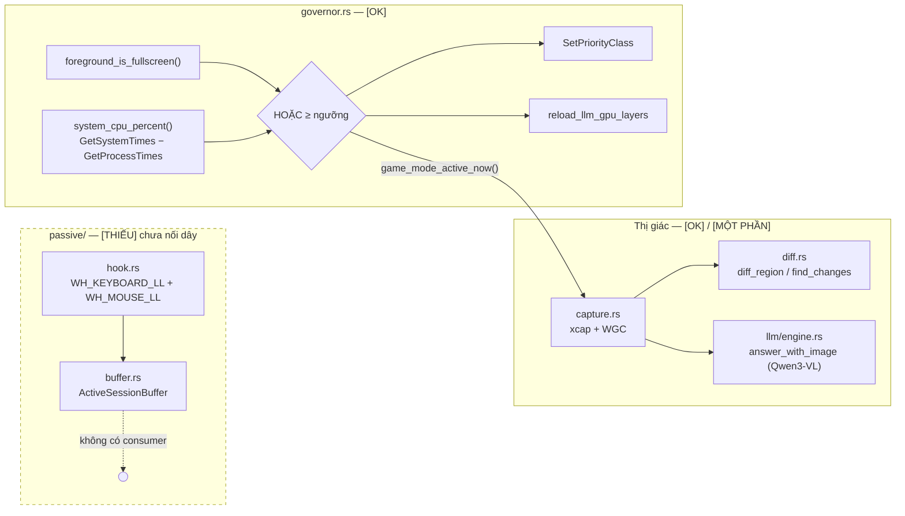
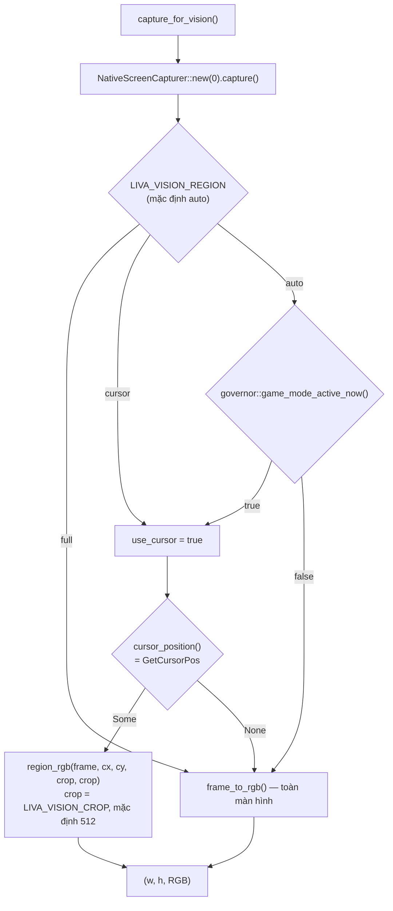
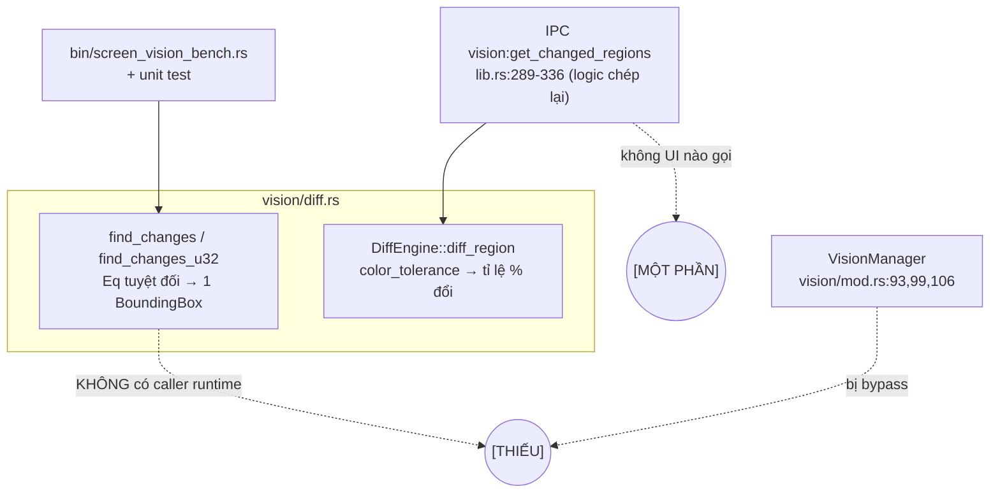
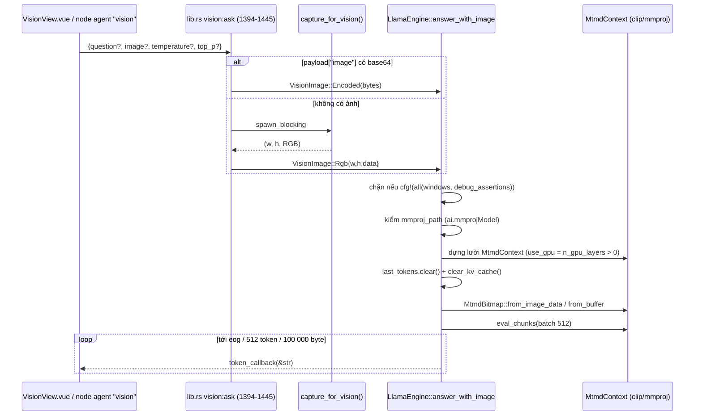
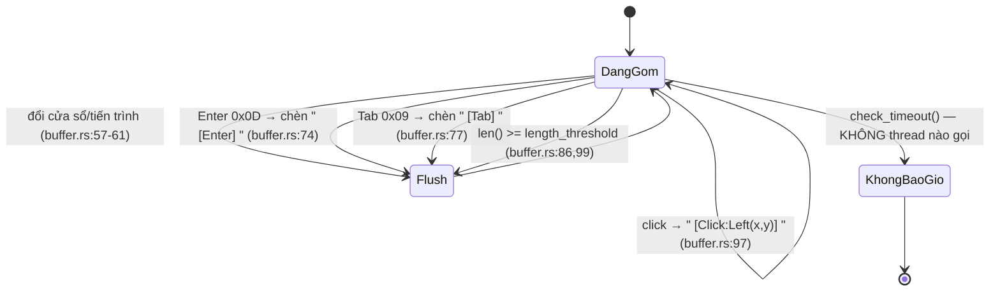
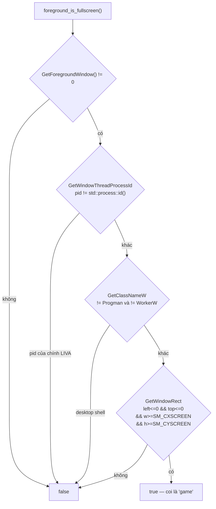
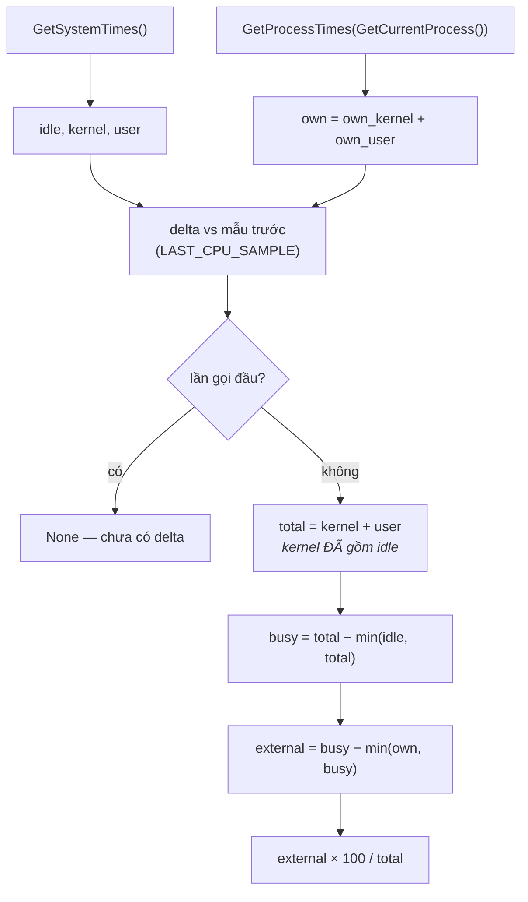

# Thị giác màn hình, quan sát thụ động và governor

[⬆ Mục lục](../README.md) · [◀ Agent và tool runtime](../03-he-thong-con/agent-tools.md) · [Persistence ▶](../03-he-thong-con/persistence.md)

---

Tài liệu này mô tả ba khối liên quan chặt với nhau trong `liva-native-core`:

1. **Thị giác** — chụp màn hình (`vision/capture.rs`), so sánh khung hình (`vision/diff.rs`), và đường nối sang mô hình đa phương thức Qwen3-VL (`llm/engine.rs`).
2. **Quan sát thụ động** — module `passive/` (hook bàn phím/chuột toàn hệ thống + bộ đệm phiên).
3. **Governor** — `governor.rs`, cơ chế nhường tài nguyên khi phát hiện ứng dụng toàn màn hình **hoặc tải CPU cao**.

Ba khối này là hiện thân kỹ thuật của ba trụ định hướng "LIVA thấy màn hình / LIVA chủ động / LIVA sống chung với workload nặng". Tài liệu nêu **đúng trạng thái nối dây thật**, không nêu ý định.

---

## 0. Bảng trạng thái tổng quan

| Thành phần | File | Trạng thái |
|---|---|---|
| `vision::capture` (WGC qua `xcap`) | `liva-native-core/src/vision/capture.rs` | **[OK]** — dùng bởi IPC `vision:capture`, `vision:ask`, node agent `vision`. Từ 22/07/2026 `vision:capture` trả **PNG** (đo thật 1920×1080: payload 10,55 MB → 1,01 MB) |
| `capture_for_vision()` (crop theo chuột) | `capture.rs:118-146` | **[OK]** — hành vi đổi theo env `LIVA_VISION_REGION` |
| `DiffEngine::diff_region` | `vision/diff.rs:256` | **[OK]** từ 22/07/2026 — UI "Canh chừng màn hình" (`VisionView.vue` + `useGateway.ts`) poll `vision:get_changed_regions` mỗi 3 s; kiểm chứng sống trong trình duyệt thật |
| `find_changes` / `find_changes_u32` | `vision/diff.rs:112,216` | **[THIẾU]** trong runtime — chỉ `src/bin/screen_vision_bench.rs` và unit test gọi |
| `VisionManager::detect_changes` / `detect_changes_against_frame` / `capture_screen` | `vision/mod.rs:93,99,106` | **[THIẾU]** — `lib.rs` viết lại logic inline (`lib.rs:289-336`), không gọi các hàm này |
| `passive::hook` + `passive::buffer` | `src/passive/*.rs` | **[THIẾU]** + **ngoài build mặc định** từ 22/07/2026 (`#[cfg(feature = "experimental")]`, `lib.rs:12-13`); không caller nào ngoài `#[cfg(test)]` |
| `governor::Governor` (ưu tiên tiến trình) | `src/governor.rs` | **[OK]** — thread poll 5 s ở `main.rs:143-149` và `liva-desktop/src-tauri/src/lib.rs:452-457` |
| `governor::external_cpu_percent` (tải CPU thật) | `governor.rs:97` | **[OK]** — nhánh phát hiện thứ hai, song song với fullscreen (mục 5.2b) |
| Game-aware GPU downshift | `lib.rs:208` + `main.rs:268-293` | **[MỘT PHẦN]** — early-return nếu `LIVA_LLM_N_GPU_LAYERS == 0` hoặc `== LIVA_GAME_N_GPU_LAYERS` |
| `vision:ask` (Qwen3-VL) | `liva-native-core/src/commands/vision.rs#ask` | **[MỘT PHẦN]** — chạy thật nhưng **chặn cứng ở debug build** (`llm/engine.rs:371-377`) và cần `ai.mmprojModel` trong config |

Bảng trên chỉ xét ba khối thuộc phạm vi tài liệu này; danh sách code mồ côi toàn dự án (có xếp hạng) nằm ở tài liệu nợ kỹ thuật.

> 📌 Nguồn đầy đủ: [Nợ kỹ thuật và rủi ro](../03-danh-gia/02-no-ky-thuat-va-rui-ro.md)



---

## 1. Chụp màn hình — `vision/capture.rs` **[OK]**

### 1.1 API hệ điều hành

LIVA **không** gọi Win32 GDI/DXGI trực tiếp. Toàn bộ việc chụp đi qua crate `xcap`:

```toml
xcap = { version = "0.9.6", default-features = false, features = ["wgc"] }   # Cargo.toml:60
```

⇒ backend là **Windows Graphics Capture (WGC)**, không phải `BitBlt` hay Desktop Duplication API.

```rust
pub struct NativeScreenCapturer { pub display_id: u32 }          // capture.rs:161
impl ScreenCapturer for NativeScreenCapturer {
    fn capture(&self) -> Result<Frame, CaptureError>              // capture.rs:197
    fn dimensions(&self) -> Result<(u32, u32), CaptureError>      // capture.rs:222
}
pub trait ScreenCapturer: Send + Sync { ... }                     // capture.rs:148
```

- Monitor được cache **thread_local**: `CACHED_MONITOR: RefCell<HashMap<u32, xcap::Monitor>>` (`capture.rs:156-158`). Khi `capture_image()` lỗi thì `invalidate_cache()` rồi thử lại **đúng 1 lần** (`capture.rs:208-218`) — đây là cơ chế xử lý đổi độ phân giải / rút cáp màn hình giữa chừng.
- `Frame` luôn trả **`PixelFormat::Rgba`** (`capture.rs:205`), `data = image.into_raw()`.
- Khởi tạo runtime: `NativeScreenCapturer::new(0)` — **hard-code display 0** (`main.rs:170`); nếu không khớp `m.id()` thì fallback `monitors.get(display_id as usize)` (`capture.rs:181-182`).
- `MockScreenCapturer` (`capture.rs:245`) chỉ dùng trong test và trong `bin/verify_duplex.rs:79`, `bin/verify_integrations.rs:22`.

### 1.2 Tần suất chụp

**Không có vòng lặp chụp định kỳ nào trong toàn repo.** Chụp chỉ xảy ra **on-demand** tại 3 điểm:

| # | Điểm gọi | Nguồn |
|---|---|---|
| 1 | IPC `vision:capture` | `lib.rs:249` |
| 2 | IPC `vision:get_changed_regions` | `lib.rs:289` |
| 3 | `capture_for_vision()` — từ `vision:ask` (`liva-native-core/src/commands/vision.rs#ask`), node agent `vision` (`agent/graph.rs:240`), và `bin/qwen3vl_probe.rs:91` | — |

Cả ba đều bọc trong `tokio::task::spawn_blocking`.

Hệ quả kiến trúc: thị giác của LIVA là **pull-based hoàn toàn**. Không có "LIVA đang nhìn màn hình liên tục" — chỉ có "LIVA nhìn khi được hỏi".

### 1.3 Độ phân giải và chi phí bộ nhớ

- Full-screen: đúng độ phân giải vật lý của monitor, RGBA 4 byte/px. 1920×1080 ⇒ **8,29 MB/frame**.
- `frame_to_rgb()` (`capture.rs:72-80`) copy sang RGB packed ⇒ thêm **6,22 MB** (1080p). Với `Rgba` nó chạy `chunks_exact(4).flat_map(...)` — một lượt cấp phát + copy toàn frame.
- `vision:capture` còn base64 **toàn bộ** `frame.data` (`lib.rs:266`) ⇒ ~**11 MB chuỗi** cho 1080p đẩy qua WebSocket, **không nén, không hạ độ phân giải**. Đây là điểm đắt nhất của đường IPC này.
- Crop theo chuột: 512×512×3 = **786 KB** ⇒ ít hơn **7,9×** số pixel so với full 1080p (262 144 px so với 2 073 600 px).

### 1.4 `capture_for_vision()` — chính sách chọn vùng (`capture.rs:118-146`)

```rust
pub fn capture_for_vision() -> Result<(u32, u32, Vec<u8>), String>
```



- Env `LIVA_VISION_REGION` (mặc định `auto`): `full` → toàn màn hình; `cursor` → crop quanh chuột; `auto` → gọi `crate::governor::game_mode_active_now()` (`capture.rs:132`), có game fullscreen thì crop.
- Kích thước crop: `LIVA_VISION_CROP`, mặc định **512** (`capture.rs:135-139`); giá trị phải `> 0` (`.filter(|&c| c > 0)`).
- Vị trí chuột: `cursor_position()` → `GetCursorPos` (`capture.rs:56-64`). Trả `None` ⇒ rơi về full frame.
- `region_rgb(frame, cx, cy, w, h)` (`capture.rs:85`): crop **căn giữa con trỏ**, clamp gốc về `(0, fw-w)` / `(0, fh-h)`, tự hoán kênh BGR→RGB, pixel ngoài biên đệm `[0,0,0]`. **Không resample, không scale** — chỉ cắt.
- `.env.example:120,122` khai báo `LIVA_VISION_REGION=auto`, `LIVA_VISION_CROP=512`.

> **Lưu ý:** đây là chỗ duy nhất governor tác động lên thị giác — nó giảm **kích thước ảnh**, không giảm **tần suất** (vì không có vòng lặp nào để giãn).

---

## 2. Hai thuật toán diff độc lập — `vision/diff.rs`

`diff.rs` chứa **hai** hệ thống so sánh khung hình hoàn toàn tách biệt, khác nhau cả về ngữ nghĩa lẫn về việc có được dùng hay không.

### 2.1 `find_changes` — bounding box **[THIẾU]** (không nằm trên đường chạy thật)

```rust
pub fn find_changes<T: Eq + Copy>(
    frame_a: &[T], frame_b: &[T], width: usize, height: usize, stride: usize,
) -> Result<Option<BoundingBox>, DiffError>                       // diff.rs:112
pub fn find_changes_u32(
    frame_a: &[u8], frame_b: &[u8], width: usize, height: usize, stride_bytes: usize,
) -> Result<Option<BoundingBox>, DiffError>                       // diff.rs:216
```

Thuật toán 4 pha (`diff.rs:122-213`):

1. **Validate** — `width/height != 0`, `stride >= width`, tính `required_len = (height-1)*stride + width` bằng `checked_mul`/`checked_add`, so với `len()` của cả hai buffer (`DiffError::BufferTooSmallFrameA/B`).
2. **Fast-path đồng nhất** — nếu `stride == width` thì so sánh 1 lần cả slice; ngược lại so từng hàng. Bằng nhau ⇒ `Ok(None)`.
3. **Quét dọc** — tìm `y_min` từ trên xuống, `y_max` từ dưới lên (so sánh nguyên hàng bằng `!=` trên slice ⇒ memcmp vector hoá).
4. **Thu hẹp ngang** — với mỗi hàng trong `[y_min, y_max]`, `search_left` (`diff.rs:77`) chỉ soi phần `[0, x_min_global)` và `search_right` (`diff.rs:95`) chỉ soi `(x_max_global, width)`. Cả hai **early-return** khi biên đã chạm mép ⇒ **càng nhiều thay đổi càng nhanh**.

Đặc điểm quan trọng: so sánh bằng **`Eq` tuyệt đối, không có color tolerance**; trả về **một** bounding box hợp nhất mọi thay đổi. Test `test_find_changes_multi_region_overlap` (`diff.rs:580`) xác nhận hai vùng rời rạc bị gộp thành một hộp 9×9.

`find_changes_u32` yêu cầu `stride_bytes % 4 == 0` (`diff.rs:223`) và cast `bytemuck::try_cast_slice::<u8,u32>`; lỗi căn chỉnh trả `DiffError::AlignmentError` (`diff.rs:229-232`).

#### Số đo thật

Chạy `target/release/screen_vision_bench.exe` (1000 vòng + 100 warmup, `WIDTH=1920, HEIGHT=1080`, `bin/screen_vision_bench.rs:5-8`) — cách build và chạy các binary verify/bench xem [Kiểm thử và CI](../02-van-hanh/04-kiem-thu-va-ci.md):

| Kịch bản | Min | Median | Mean | Max |
|---|---|---|---|---|
| `find_changes` 0% đổi | 283,8 µs | **458,6 µs** | 554,3 µs | 4,96 ms |
| `find_changes` đổi 10×10 px | 468,1 µs | **859,2 µs** | 1,001 ms | 6,16 ms |
| `find_changes` 100% đổi | 800 ns | **900 ns** | 872 ns | 13,9 µs |
| `find_changes_u32` 0% đổi | 274,9 µs | **491,5 µs** | 559,0 µs | 2,95 ms |
| `find_changes_u32` đổi 10×10 | 509,6 µs | **1,035 ms** | 1,127 ms | 4,07 ms |
| `find_changes_u32` 100% đổi | 800 ns | **800 ns** | 853 ns | 4,9 µs |

Nhận xét rút từ số đo:

- **Nghịch lý chi phí:** frame *giống hệt* là trường hợp **xấu nhất** (~0,46 ms, phải quét đủ 2,07 M pixel), còn frame *đổi toàn bộ* nhanh gấp ~**500×** (~0,9 µs) — vì biên trái/phải chạm mép ngay hàng đầu rồi mọi hàng sau early-return.
- Ở mức 0,46–1,0 ms/frame, thuật toán về lý thuyết đủ cho polling ~60 fps. Nhưng chi phí **thực tế** bị chi phối bởi `capture()` + copy 8 MB — thứ bench này **không** đo (bench chỉ so hai buffer tổng hợp trong RAM).
- `find_changes_u32` **không** nhanh hơn `find_changes` dù cast u8→u32 (cùng số phần tử so sánh); overhead cast gần như không đáng kể.

Ghi chú lịch sử: `.agents/auditor_screen_vision/analysis.md:64-73` từng ghi bench này không build được (typo `run_find_changes_u32`); hiện `bin/screen_vision_bench.rs:102` đã sửa thành `find_changes_u32`, binary build và chạy được ở cả debug lẫn release.

**Trạng thái: [THIẾU]** — `find_changes` chỉ được `bin/screen_vision_bench.rs` và unit test gọi; đây là thuật toán được test kỹ nhất trong module nhưng **không nằm trên bất kỳ đường chạy sản phẩm nào**.

### 2.2 `DiffEngine::diff_region` — tỉ lệ pixel đổi **[MỘT PHẦN]** (có đường IPC, không có consumer)

```rust
pub fn diff_region(prev: &Frame, curr: &Frame, region: &ScreenRegion, color_tolerance: u8)
    -> Result<RegionDiffResult, String>                            // diff.rs:258
struct ScreenRegion { id, name, x, y, width, height, threshold: f32 }        // diff.rs:51
struct RegionDiffResult { region_id, name, difference: f32, is_changed: bool } // diff.rs:62
```

- Kiểm biên `x+width`, `y+height` bằng `checked_add` với **cả `prev` lẫn `curr`**, kiểm khớp `PixelFormat`, kiểm `data.len()` đủ `w*h*bpp`.
- Fast-path theo hàng: nếu segment hàng giống hệt (`diff.rs:348`) thì bỏ qua vòng pixel.
- `has_pixel_changed` (`diff.rs:240`): `|prev[c] - curr[c]| > color_tolerance` trên **từng kênh, kể cả kênh alpha** (bpp = 4 với RGBA) — đổi alpha cũng tính là thay đổi.
- `difference = changed_pixels / total_pixels`; `is_changed = difference >= region.threshold` (`diff.rs:365-366`).

#### Ngưỡng cấu hình

```rust
pub struct VisionConfig { pub color_tolerance: u8, pub max_regions: usize }  // vision/mod.rs:10
impl Default: color_tolerance = 5, max_regions = 64                          // vision/mod.rs:18-19
```

Validate khi `add_region` (`vision/mod.rs:45-60`): chặn `width/height == 0`, `threshold` NaN hoặc ngoài `[0.0, 1.0]`, trùng `id`, vượt `max_regions`.

#### Vì sao gọi là "[MỘT PHẦN]"

Hệ region-watching **đã nối dây từ UI ngày 22/07/2026**: mục "Canh chừng màn hình" trong `VisionView.vue` (qua `startScreenWatch`/`stopScreenWatch` của `useGateway.ts`) chạy trình tự bắt buộc `vision:capture` (lấy kích thước khung VẬT LÝ — `diff_region` từ chối vùng vượt biên chứ không kẹp, mà CSS px của UI lệch DPI — đồng thời mồi baseline) → `vision:add_region` toàn màn hình (threshold 2 %) → poll `vision:get_changed_regions` mỗi 3 s → hiển thị sự kiện thay đổi. Không gọi model — chỉ so điểm ảnh, nên nhẹ. Chuỗi backend kiểm bằng `scripts/e2e-vision-watch.mjs` (7/7 qua WebSocket thật, gồm cả ca vùng vượt biên bị từ chối); UI kiểm sống trong trình duyệt (sự kiện đúng nhịp 3 s, dừng sạch).

#### Trùng lặp đáng chú ý

`lib.rs:289-336` **chép lại** logic của `VisionManager::detect_changes_against_frame` để tránh giữ `Mutex` qua `spawn_blocking`. Hệ quả: ba method của `VisionManager` (`detect_changes`, `detect_changes_against_frame`, `capture_screen` — `vision/mod.rs:93,99,106`) trở thành code chết, và hai bản logic dễ phân kỳ hành vi theo thời gian.



---

## 3. Nối với Qwen3-VL — ảnh → tiền xử lý → encoder → prompt **[MỘT PHẦN]**

### 3.1 Chuỗi thật (`liva-native-core/src/commands/vision.rs#ask` → `llm/engine.rs:353-489`)

```rust
pub enum VisionImage<'a> {
    Rgb { width: u32, height: u32, data: &'a [u8] },
    Encoded(&'a [u8]),
}                                                                  // llm/engine.rs:15

pub fn answer_with_image<F>(&mut self, question: &str, image: VisionImage,
    temperature: f32, top_p: f32, mut token_callback: F) -> Result<CompletionOutput, String>
    where F: FnMut(&str) -> bool                                    // llm/engine.rs:353
```



**Từng bước:**

1. **Nguồn ảnh** — `payload["image"]` base64 (png/jpg) → `VisionImage::Encoded`; nếu vắng → `capture_for_vision()` → `VisionImage::Rgb` (`liva-native-core/src/commands/vision.rs#ask`).
2. **Chặn debug build** — `if cfg!(all(windows, debug_assertions))` trả lỗi ngay (`llm/engine.rs:371-377`). Nguyên nhân: loader clip/mmproj của llama.cpp link debug CRT, Rust link release CRT ⇒ assert fd-table và abort tiến trình. **Vision chỉ hoạt động với `cargo build --release`.**
3. **mmproj** — lấy từ config `ai.mmprojModel` + `ai.localModelsDir` (`lib.rs:143-163`), gán qua `set_mmproj_path()` khi nạp router model (`lib.rs:184`). Thiếu ⇒ lỗi `"No mmproj (vision projector) configured"` (`llm/engine.rs:382`).
4. **Dựng `MtmdContext` lười** (`llm/engine.rs:389-409`):
   ```rust
   MtmdContextParams {
       use_gpu: n_gpu_layers > 0,
       print_timings: false,
       n_threads: LIVA_LLM_THREADS,        // mặc định 4
       media_marker: mtmd_default_marker(),
       image_min_tokens: -1,
       image_max_tokens: -1,
   }
   ```
   `image_min/max_tokens = -1` ⇒ **không giới hạn số token ảnh**. Với ảnh full 1080p, số vision token do clip quyết định và có thể rất lớn — code **không cap**.
5. **Tiền xử lý pixel** — `MtmdBitmap::from_image_data(width, height, data)` cho RGB thô, hoặc `MtmdBitmap::from_buffer(mtmd, bytes, false)` cho ảnh đã mã hoá (`llm/engine.rs:420-429`). **Phía Rust không resize, không normalize, không letterbox** — mọi việc đó nằm trong clip/mtmd của llama.cpp.
6. **Reset ngữ cảnh** — `self.last_tokens.clear()` (bỏ KV-prefix reuse) + `engine.context.clear_kv_cache()` (`llm/engine.rs:385,410`). Mỗi lượt vision là một sequence mới, **không nối lịch sử chat**.
7. **Prompt ChatML** (`llm/engine.rs:433-438`):
   ```
   <|im_start|>system\n{PERSONA_LIVA}<|im_end|>\n<|im_start|>user\n{marker} {question}<|im_end|>\n<|im_start|>assistant\n
   ```
   Dùng **marker trần** `mtmd_default_marker()`; comment trong code nêu rõ **không được** tự viết `<|vision_start|>…<|vision_end|>` vì mtmd tự bọc. `PERSONA_LIVA` dùng ở đây là **cùng một persona** với đường text thường (không có bản riêng cho vision).
   > 📌 Nguồn đầy đủ (nội dung persona, cấu hình LLM, chống prompt-injection): [Hệ LLM và prompt](04-he-llm-va-prompt.md)
8. **Eval + sinh** — `chunks.eval_chunks(mtmd, ctx, 0, 0, 512, true)` (batch 512), rồi vòng sample thủ công với `create_sampler(temperature, top_p)`, dừng khi `is_eog_token`, **cap cứng 512 completion token hoặc 100 000 byte text** (`llm/engine.rs:479`).

### 3.2 Hai lối vào `vision:ask`

| Lối vào | Đường dẫn | Ghi chú |
|---|---|---|
| **UI dashboard** | `liva-ui/src/components/dashboard/VisionView.vue` (nút "Nhìn màn hình") → `useGateway.askVision()` (`useGateway.ts:513-521`) | Timeout client **120 s**; xử lý cả `vision:ask` (Tauri) lẫn `vision:ask_response` (WebSocket) — `useGateway.ts:204,432` |
| **Giọng nói** | node `"vision"` trong agent graph (`agent/graph.rs:220-284`) | Stream token thẳng sang TTS qua `llm_chunk_tx`; kiểm `active_session_id` **3 lần** để huỷ khi barge-in; fallback nói `"Xin lỗi, hiện mình chưa xem được màn hình."` |

Khuôn payload/response của `vision:ask`, `vision:capture`, `vision:get_changed_regions` (và 39 lệnh còn lại) được đặc tả ở tài liệu giao thức; ở đây chỉ nói **ai gọi** và **gọi để làm gì**.

> 📌 Nguồn đầy đủ: [Giao thức IPC và WebSocket](02-giao-thuc-ipc-va-websocket.md)

Định tuyến vào node vision chỉ bằng **keyword thô**: `text_lower.contains("màn hình") || text_lower.contains("screen")` (`agent/graph.rs:114-116`) — **không** dùng LLM để phân loại ý định. Graph này chạy thật: `build_pipeline_graph` được gọi ở `webrtc/pipeline.rs:271`, `WebRTCActor::new` ở `liva-native-core/src/websocket.rs:1113-1124`.

Giá trị mặc định:

- Câu hỏi khi payload rỗng: `"Trên màn hình đang hiển thị gì? Mô tả ngắn gọn bằng tiếng Việt."` (`liva-native-core/src/commands/vision.rs#ask`).
- `temperature = 0.7`, `top_p = 0.8` (`liva-native-core/src/commands/vision.rs#ask`); nhánh giọng nói dùng `persona::TEMP_DEFAULT` / `TOP_P_DEFAULT` (`agent/graph.rs:255-256`).

### 3.3 Công cụ kiểm chứng: `bin/qwen3vl_probe.rs`

Chạy **đúng đường production** (`swap_model` + `compile_prompt` + `answer_with_image`), in tok/s cho cả text lẫn vision. Đây là cách rẻ nhất để xác nhận cặp LM + mmproj nạp được mà không phải bật cả gateway.

Probe nhận cấu hình qua nhóm env `LIVA_QWENVL_*` (thư mục model, tên file LM/mmproj, `NGL`, `NCTX`, cờ bỏ qua vision) khai báo tại `qwen3vl_probe.rs:26-37` — mặc định trỏ vào `E:\AI_Models\Qwen3-VL-2B-Instruct-GGUF` và chạy CPU (`NGL=0`).

> 📌 Nguồn đầy đủ (bảng biến môi trường): [Cấu hình và biến môi trường](../02-van-hanh/01-cau-hinh-va-bien-moi-truong.md)
> 📌 Nguồn đầy đủ (danh sách binary verify/bench và cách chạy): [Kiểm thử và CI](../02-van-hanh/04-kiem-thu-va-ci.md)

---

## 4. `passive/` — quan sát thụ động **[THIẾU]**, ngoài build mặc định

> ## ⚠️ CẢNH BÁO AN TOÀN & QUYỀN RIÊNG TƯ
>
> **`liva-native-core/src/passive/hook.rs` là một keylogger đầy đủ chức năng.** Nó cài hook bàn phím và chuột **cấp toàn hệ thống** (`WH_KEYBOARD_LL`, `WH_MOUSE_LL`), ghi lại **mọi phím bấm ở mọi ứng dụng**, kèm **tiêu đề cửa sổ** và **đường dẫn tiến trình** đang foreground tại thời điểm gõ. Nó không phân biệt ứng dụng: ô mật khẩu, trình quản lý mật khẩu, ngân hàng, chat riêng tư — tất cả đều bị bắt như nhau.
>
> **Trạng thái nối dây: CHƯA NỐI.** Grep toàn repo cho `start_os_hook|ActiveSessionBuffer|passive::` chỉ ra:
> - `lib.rs:13` — `pub mod passive;` (khai báo module), ngay dưới `lib.rs:12` — `#[cfg(feature = "experimental")]`
> - `passive/mod.rs:4-5` — re-export
> - các `#[cfg(test)]` trong chính hai file đó
>
> Không có lệnh IPC, không có nút UI, không có thread khởi động nào gọi `start_os_hook()`.
>
> **✅ Từ 22/07/2026 module này KHÔNG CÒN NẰM TRONG BINARY MẶC ĐỊNH.** Trước đó nó vẫn được biên dịch vào binary giao cho người dùng (dù không bao giờ được kích hoạt) — một keylogger nằm sẵn trong file thực thi là rủi ro không cần thiết khi chưa có cổng đồng ý. Nay nó nằm sau `#[cfg(feature = "experimental")]`, chỉ vào build khi ai đó chủ động `cargo build --features experimental`. CI vẫn compile-check nó để code không mục nát.
>
> Điều này **không** làm các yêu cầu dưới đây mất hiệu lực — chúng vẫn là điều kiện bắt buộc trước khi nối dây.
>
> **Yêu cầu bắt buộc trước khi nối dây (chưa thứ nào tồn tại trong code):**
> 1. **Đồng ý tường minh của người dùng** (opt-in, mặc định TẮT) — không được bật theo mặc định, không được bật ngầm qua env.
> 2. **Chỉ báo trạng thái luôn hiển thị** trong UI khi hook đang chạy, kèm nút tắt tức thời.
> 3. **Danh sách loại trừ** theo tiến trình/tiêu đề cửa sổ (tối thiểu: trình quản lý mật khẩu, trình duyệt ở trang đăng nhập, ứng dụng ngân hàng) và **chặn ô nhập mật khẩu**.
> 4. **Mã hoá tại chỗ** mọi `FlushedPayload` trước khi chạm đĩa (dùng vault hiện có, xem tài liệu tầng dữ liệu & bảo mật).
> 5. **Chính sách lưu giữ & xoá** rõ ràng, người dùng xem/xoá được lịch sử.
> 6. Cờ `system.proactiveEnabled` hiện **không được đọc bởi bất kỳ dòng Rust nào** — không được coi nó là "công tắc đồng ý" đã có.
>
> Cho tới khi các yêu cầu trên được hiện thực, **không nối dây module này**.

### 4.1 `hook.rs`

```rust
pub enum RawEvent {
    KeyPress   { key: String, vk_code: u32, window_title: String, process_name: String },
    MouseClick { button: String, x: i32, y: i32, window_title: String, process_name: String },
}                                                                  // passive/hook.rs:5
pub fn start_os_hook(tx: Sender<RawEvent>) -> Result<(), String>   // passive/hook.rs:216
pub fn stop_os_hook() -> Result<(), String>                        // passive/hook.rs:265
```

Trạng thái toàn cục (`hook.rs:22-29`): `EVENT_SENDER: OnceLock<Sender<RawEvent>>`, `KEYBOARD_HOOK: AtomicIsize`, `MOUSE_HOOK: AtomicIsize`, `HOOK_THREAD_ID: AtomicU32`.

- Hook **toàn hệ thống**: `SetWindowsHookExW(WH_KEYBOARD_LL, ...)` + `SetWindowsHookExW(WH_MOUSE_LL, ...)` trên một `std::thread` riêng có message loop `GetMessageW` / `TranslateMessage` / `DispatchMessageW` (`hook.rs:227-259`). Gỡ hook bằng `PostThreadMessageW(WM_QUIT)` + `UnhookWindowsHookEx` (`hook.rs:265-290`).
- Chỉ bắt `WM_KEYDOWN` / `WM_SYSKEYDOWN` và `WM_LBUTTONDOWN` / `WM_RBUTTONDOWN` / `WM_MBUTTONDOWN`.
- Ngữ cảnh cửa sổ lấy **mỗi sự kiện**: `get_active_window_info()` → `GetForegroundWindow` + `GetWindowTextW` (512 wchar) + `OpenProcess(PROCESS_QUERY_LIMITED_INFORMATION = 0x1000)` + `QueryFullProcessImageNameW` (`hook.rs:83-130`). Tức là **một `OpenProcess`/`CloseHandle` cho mỗi phím bấm** — khá đắt nếu bật thật (nhận định từ đọc code; **không có số đo**).
- `vk_to_char` (`hook.rs:32-80`): `MapVirtualKeyW(vk, 2)` + `GetKeyState(VK_SHIFT/VK_CAPITAL)`, bảng shift ASCII hard-code. **Không xử lý IME/tiếng Việt** ⇒ gõ Telex/VNI sẽ ghi ra ký tự thô, không phải chữ đã bỏ dấu.
- Bản `#[cfg(not(windows))]` của `start_os_hook`/`stop_os_hook` (`hook.rs:293,298`) là stub.

### 4.2 `buffer.rs` — **KHÔNG phải ring buffer**

```rust
pub struct FlushedPayload { window_title, process_name, text, timestamp: u64 }       // buffer.rs:5
pub struct ActiveSessionBuffer {
    accumulated_text: String, current_window_title: String,
    current_process_name: String, last_activity: Instant, length_threshold: usize,
}                                                                                    // buffer.rs:12
pub fn add_event(&mut self, event: RawEvent) -> Option<FlushedPayload>               // buffer.rs:49
pub fn check_timeout(&mut self, timeout: Duration) -> Option<FlushedPayload>         // buffer.rs:110
```

Bản chất là **một `String` tích luỹ tuyến tính** — không vòng, không giới hạn cứng ngoài `length_threshold`.



Điều kiện flush:

- **Đổi cửa sổ / tiến trình** (`buffer.rs:57-61`) — flush trước, rồi gán ngữ cảnh mới.
- **Enter `0x0D`** → chèn `" [Enter] "` rồi flush; **Tab `0x09`** → `" [Tab] "` rồi flush (`buffer.rs:74-79`).
- **Backspace `0x08`** → `pop()` (`buffer.rs:80`).
- **`accumulated_text.len() >= length_threshold`** (`buffer.rs:86,99`) — đơn vị **byte**, không phải ký tự.
- **`check_timeout(timeout)`** (`buffer.rs:110`) — nhưng **không thread nào gọi hàm này**.
- Click chuột được serialize thành `" [Click:Left(x,y)] "` (`buffer.rs:97`).

**Bug tiềm ẩn:** `pop()` xoá một `char` (có thể 1–4 byte UTF-8) trong khi ngưỡng so `len()` theo **byte** ⇒ với tiếng Việt/Unicode, hành vi flush lệch so với trực giác "số ký tự".

### 4.3 LIVA có chủ động nói không?

**KHÔNG.** Không tồn tại đường dây nào từ `FlushedPayload` → DB → LLM → TTS.

Config có cờ `system.proactiveEnabled: true` (`lib.rs:391`) nhưng **không dòng Rust nào đọc cờ này** — grep `proactive` chỉ ra đúng một hit là chuỗi JSON mặc định.

⇒ **Trụ "LIVA chủ động" hiện là code chết.** Đây là khoảng cách lớn nhất giữa định hướng dự án và code thật ở khu vực này.

---

## 5. Governor — `governor.rs` **[OK]**

Governor có **ba nhánh phát hiện độc lập** (nhánh GPU thêm 22/07/2026), kết quả là phép HOẶC:

| Nhánh | Bắt được | Bỏ sót |
|---|---|---|
| Cửa sổ fullscreen (5.2) | Game, ứng dụng nặng GPU (CPU có thể thấp) | Render/biên dịch ở cửa sổ thường |
| Tải CPU ≥ ngưỡng (5.2b) | Blender, ffmpeg, `cargo build`, bất kể cửa sổ | Tải thuần GPU mà không fullscreen |
| Tải GPU ≥ ngưỡng (5.1, NVML) | Blender GPU, NVENC, training — ở cửa sổ thường | Máy không NVIDIA (nhánh tự tắt); WDDM + LIVA đang dùng GPU (bỏ tín hiệu, xem 5.1) |

Ba nhánh bù trừ cho nhau — đây là điều kiện để LIVA "sống chung với **mọi** workload nặng" chứ không riêng game.

### 5.1 Cách đọc tải

Không có NVML, không WMI, không PDH, không `sysinfo`. **Tải CPU** đọc qua `GetSystemTimes` + `GetProcessTimes` — cả hai đều thuộc `Win32_System_Threading` đã bật sẵn, nên **không thêm dependency nào**.

Dependency Windows duy nhất vẫn là `windows-sys 0.52` với các feature `Win32_Foundation`, `Win32_UI_WindowsAndMessaging`, `Win32_System_Threading`, `Win32_System_LibraryLoader`, `Win32_UI_Input_KeyboardAndMouse`, `Win32_System_ProcessStatus` (`Cargo.toml:28`).

⇒ **Ngưỡng CPU có** (`LIVA_BUSY_CPU_PERCENT`, mặc định 80). **Ngưỡng GPU cũng có từ 22/07/2026** (`LIVA_BUSY_GPU_PERCENT`, mặc định 80) — đọc qua `nvml-wrapper` (nạp `nvml.dll` động, build không cần CUDA; máy không NVIDIA thì `Nvml::init()` fail một lần và nhánh tự tắt). Cái bẫy tự-đếm-mình của CPU lặp lại ở đây với biến thể WDDM: Windows thường không cho NVML đọc tải GPU theo tiến trình, nên khi không tách được phần của LIVA mà `LIVA_LLM_N_GPU_LAYERS > 0` thì `external_gpu_percent` **bỏ tín hiệu** (trả `None`) thay vì đoán — ba nhánh quyết định đều có test thuần, cộng smoke test NVML trên phần cứng thật. Ngưỡng VRAM riêng thì vẫn chưa có.

### 5.2 Nhận biết "đang chơi game" (`governor.rs:124-172`)

```rust
#[cfg(windows)] fn foreground_is_fullscreen() -> bool
```



Bốn điều kiện AND:

1. `GetForegroundWindow() != 0`;
2. `GetWindowThreadProcessId` → pid **khác pid của chính LIVA** (không tự throttle vì cửa sổ của mình, `governor.rs:139-143`);
3. `GetClassNameW` (buffer 64 wchar) **không phải `"Progman"` hoặc `"WorkerW"`** (loại desktop shell, `governor.rs:146-153`);
4. `GetWindowRect`: `rect.left <= 0 && rect.top <= 0 && (right-left) >= SM_CXSCREEN && (bottom-top) >= SM_CYSCREEN` (`governor.rs:167-171`).

**Hệ quả thực tế** (quan sát từ code, không phải đo): bất kỳ cửa sổ **borderless-fullscreen** nào cũng bị tính là "game" — video YouTube bấm F11, PowerPoint trình chiếu, IDE full màn hình trên monitor chính. Chỉ đo theo **màn hình chính** (`SM_CXSCREEN`/`SM_CYSCREEN`), nên setup nhiều monitor có thể sai. **Không kiểm tên tiến trình, không danh sách trắng/đen.** Dương tính giả ở đây tương đối vô hại (LIVA chỉ hạ priority của chính mình), nhưng nó là lý do nhánh CPU tồn tại: fullscreen một mình vừa dương tính giả vừa âm tính giả.

### 5.2b Nhận biết "máy đang bận" — tải CPU (`governor.rs:84-173`)

```rust
pub fn external_cpu_percent(idle_delta, kernel_delta, user_delta, own_delta) -> Option<u8>
#[cfg(windows)] pub fn system_cpu_percent() -> Option<u8>   // None ở lần gọi đầu
```

Mỗi `CHECK_INTERVAL` (2 s) lấy một mẫu, so với mẫu trước để ra delta:



Hai chi tiết dễ sai, **cả hai đã có unit test khoá lại** (`governor::governor_cpu_tests`):

1. **`kernel` trên Windows ĐÃ BAO GỒM `idle`.** Mẫu số là `kernel + user`, không phải `idle + kernel + user`. Test `cong_thuc_dung_kernel_da_gom_idle` giữ luôn cả con số sai để đối chiếu (75 % đúng vs 60 % nếu cộng cả ba).
2. **Phải trừ phần CPU của chính LIVA.** Không trừ thì mỗi lần LLM sinh câu trả lời, CPU vọt lên do chính nó → governor kết luận "máy bận" → hạ priority của chính mình → **làm chậm đúng việc người dùng đang chờ**. Governor tồn tại để nhường *workload khác*, nên con số nó cần là tải NGOÀI LIVA. Test `tru_phan_cpu_cua_chinh_liva` khoá ca này.

Đo trên phần cứng thật (`do_duoc_tai_that_tren_may`, `#[ignore]` vì tốn ~2 s CPU — chạy bằng `cargo test --lib governor -- --ignored --nocapture`): nạp tải 100 % mọi lõi **bằng chính tiến trình test** ⇒ CPU "ngoài" đo được **1 %**. Phép trừ hoạt động đúng trên máy thật, không chỉ trong số học.

### 5.3 API và hằng số

```rust
pub enum GovernorMode { Auto, ForcedOn, Off }                      // governor.rs:21
pub struct Governor { mode, manage_priority: bool, active: AtomicBool,
                      priority_lowered: AtomicBool, last_check: Mutex<Option<Instant>> } // governor.rs:44
const CHECK_INTERVAL: Duration = Duration::from_secs(2);           // governor.rs:70
const DEFAULT_BUSY_CPU_PERCENT: u8 = 80;                           // governor.rs:74
pub fn busy_cpu_threshold() -> u8                                  // governor.rs:76
pub fn external_cpu_percent(idle, kernel, user, own) -> Option<u8> // governor.rs:97  (thuần, test mọi nền tảng)
pub fn system_cpu_percent() -> Option<u8>                          // governor.rs:122 (Win32; None lần đầu)
pub fn from_env() -> Self                                          // governor.rs:55
pub fn game_mode_active(&self) -> bool                             // governor.rs:73  (cache 2 s)
pub fn game_mode_active_now() -> bool                              // governor.rs:116 (KHÔNG cache)
fn set_process_below_normal(lower: bool)                           // governor.rs:180
```

| Hằng số / env | Giá trị | Nguồn |
|---|---|---|
| `CHECK_INTERVAL` (cache kết quả detect) | **2 s** | `governor.rs:52` |
| Chu kỳ poll priority thread | **5 s** | `main.rs:146`, `liva-desktop/src-tauri/src/lib.rs:456` |
| Chu kỳ poll GPU-downshift | **5 s** | `main.rs:290`, `liva-desktop/src-tauri/src/lib.rs:437` |
| `LIVA_GAME_MODE` | `auto` (mặc định) / `on\|force\|forced` / `off\|disable\|disabled` | `governor.rs:32-40`, `.env.example:109` |
| `LIVA_GAME_PRIORITY` | mặc định **on**; chỉ `"off"` mới tắt | `governor.rs:58-60`, `.env.example:112` |
| `LIVA_BUSY_CPU_PERCENT` | mặc định **80**; `0` tắt hẳn nhánh CPU; >100 hoặc rác → 80 | `governor.rs:74-82`, `.env.example` |
| `LIVA_GAME_N_GPU_LAYERS` | mặc định **0** (chạy hẳn CPU khi game) | `main.rs:271-274`, `.env.example:44` |
| `LIVA_LLM_N_GPU_LAYERS` | mặc định **0** trong code; `.env.example:37` đặt **99** | `main.rs:131-134`, `.env.example:37` |
| Ưu tiên tiến trình | `BELOW_NORMAL_PRIORITY_CLASS` ↔ `NORMAL_PRIORITY_CLASS` | `governor.rs:180-192` |

*(Bảng trên là **nguồn duy nhất** cho ngưỡng/chu kỳ governor. Riêng chỗ lệch giữa `.env.example` và mặc định trong code — ví dụ `LIVA_LLM_N_GPU_LAYERS` 99 so với 0 — được liệt kê đầy đủ ở tài liệu cấu hình.)*

> 📌 Nguồn đầy đủ (danh mục lệch `.env.example` vs code): [Cấu hình và biến môi trường](../02-van-hanh/01-cau-hinh-va-bien-moi-truong.md)

### 5.4 Hành vi khi phát hiện

```rust
let detected = fullscreen || cpu_busy;   // governor.rs:218
```

Mỗi lần chuyển trạng thái (cả BẬT lẫn TẮT) ghi một dòng `tracing::info!` kèm **cả ba số**: `fullscreen`, `cpu_ngoai`, `nguong` — đủ để chẩn đoán "vì sao LIVA vào chế độ tiết kiệm" mà không cần gắn debugger. `system_cpu_percent()` được gọi **kể cả khi ngưỡng = 0**, để mẫu đo giữ đều nhịp 2 s và con số vẫn xuất hiện trong log.

Chỉ **hai** hành động, cả hai đều **latch theo chuyển trạng thái** (không lặp lại mỗi lần poll):

1. **`apply_priority()`** (`governor.rs:94-109`) — so `game_active == priority_lowered`; khác mới gọi `SetPriorityClass(GetCurrentProcess(), ...)` và log `tracing::info!("Game mode ON/OFF — process priority below-normal/normal")`.
2. **`reload_llm_gpu_layers(state, n_gpu_layers)`** (`lib.rs:208-234`) — xem mục 6.

`ForcedOn` bỏ qua cache và gọi `apply_priority(true)` mỗi lần (`governor.rs:75-78`). `Off` return `false` ngay và **không khôi phục** priority nếu trước đó đã hạ — nhưng mode chỉ đọc một lần lúc `from_env`, nên tình huống này không xảy ra trong một phiên chạy.

**Lưu ý kiến trúc:** cả gateway (`main.rs`) và Tauri shell (`liva-desktop`) đều spawn **cùng bộ đôi watcher** (GPU + priority). Comment ở `liva-desktop/src-tauri/src/lib.rs:441-451` giải thích vì sao tách thread riêng: task GPU early-return với cấu hình CPU-only và sẽ bỏ luôn việc quản priority nếu gộp chung. Hai runtime chạy trong hai tiến trình khác nhau nên `SetPriorityClass` không đụng nhau.

---

## 6. Ảnh hưởng của governor lên LLM / TTS / vision

### 6.1 LLM — giảm `n_gpu_layers` bằng cách **reload cả model** **[MỘT PHẦN]**

```rust
pub async fn reload_llm_gpu_layers(state: Arc<AppState>, n_gpu_layers: u32) -> bool  // lib.rs:208
```

- Trả `false` khi `llm.engine.is_none()` để caller **thử lại vòng sau** (`lib.rs:210-212`, `main.rs:286-288`) — tình huống game đã chạy sẵn lúc khởi động trong khi model còn đang autoload.
- Trả `true` ngay nếu `llm.n_gpu_layers == n_gpu_layers` (đã ở đích) hoặc path rỗng.
- Ngược lại gọi `llm.swap_model(&path, Some(n_ctx), Some(n_gpu_layers), Some(vocab_only))` — **reload thật, ~vài giây, xoá sạch KV cache** (doc comment `lib.rs:195-207` nêu rõ).
- Vòng lặp so `last_active: Option<bool>` ⇒ chỉ reload đúng lúc vào/ra game.

> **Điều kiện kích hoạt (cả hai runtime):**
> ```rust
> if normal_layers == 0 || game_layers == normal_layers { return; }   // main.rs:276, liva-desktop/src-tauri/src/lib.rs:423
> ```
> ⇒ **Với mặc định của code (`LIVA_LLM_N_GPU_LAYERS` = 0), tính năng GPU downshift TẮT HOÀN TOÀN.** Nó chỉ sống dậy nếu người dùng thực sự đặt `LIVA_LLM_N_GPU_LAYERS > 0` — đúng như `.env.example:37` gợi ý (`=99`) — và giá trị đó khác `LIVA_GAME_N_GPU_LAYERS`.

### 6.2 TTS / STT — **không có** đường dẫn nào chịu ảnh hưởng **[THIẾU]**

Grep `game_mode_active|LIVA_GAME` **không cho hit nào** trong `src/tts/`, `src/stt/`, `src/webrtc/`.

Doc comment `governor.rs:5-8` viết "STT/VAD/TTS vốn đã nhẹ (2 intra-op thread mỗi cái)" — đó là **lý do biện minh cho việc không throttle**, không phải một cơ chế throttle. Tác động duy nhất lên TTS/STT là gián tiếp: cả tiến trình xuống `BELOW_NORMAL`.

Số luồng LLM (`LIVA_LLM_THREADS`) được nướng cứng lúc nạp model; comment `governor.rs:7-10` ghi nhận đây là hạn chế và là việc follow-up.

### 6.3 Vision — giảm **kích thước ảnh**, không giảm tần suất

- `capture_for_vision()` gọi `game_mode_active_now()` (**uncached**, mỗi request vision — `capture.rs:132`) ⇒ đang game thì crop 512×512 quanh chuột thay vì full-screen: **7,9× ít pixel** ở 1080p (~64× nếu màn 4K: 8,3 M → 262 k px), kéo theo giảm tương ứng số vision token đưa vào clip.
- **Không có cơ chế giãn tần suất** vì không tồn tại vòng lặp capture định kỳ nào để giãn. Vision hoàn toàn pull-based.
- `MtmdContextParams.use_gpu = n_gpu_layers > 0` (`llm/engine.rs:398`) được đọc **tại thời điểm dựng `MtmdContext` lần đầu**. Nếu governor đã hạ `n_gpu_layers` về 0 trước lượt vision đầu tiên, mtmd dựng ở chế độ CPU; và `MtmdContext` **không được rebuild** khi `n_gpu_layers` đổi lại sau đó (chỉ dựng khi `engine.mtmd.is_none()`, `llm/engine.rs:389`) — trừ khi `swap_model` tạo lại `LlamaEngine`. *(Chưa kiểm chứng đến tận `swap_model`; ghi nhận là điểm có thể lệch trạng thái giữa GPU-mode của LLM và của vision encoder.)*

---

## 7. Rủi ro và khoảng trống đã thấy trong code

Ba rủi ro nặng nhất của khu vực này: (1) `passive/` là **keylogger đầy đủ chức năng** không có cơ chế đồng ý/chỉ báo/loại trừ — **đã bớt gay gắt từ 22/07/2026** vì module rời khỏi build mặc định, nhưng code vẫn còn và mọi yêu cầu ở mục 4 vẫn phải thoả trước khi nối dây; (2) ~~governor không đọc tải thực~~ — **đã sửa trọn 22/07/2026**: nhánh CPU (trừ phần của chính LIVA, mục 5.2b) và nhánh GPU qua NVML (bỏ tín hiệu khi không tách được phần của LIVA trên WDDM, mục 5.1); (3) **GPU downshift tắt theo mặc định code** vì `LIVA_LLM_N_GPU_LAYERS = 0` (mục 6.1) — khác với nhánh *phát hiện* GPU, vốn chạy mặc định.

Nhóm trung bình/thấp đều đã được mô tả tại chỗ ở các mục trên: `vision:get_changed_regions` không có consumer (2.2), `VisionManager` bị bypass do logic chép lại inline (2.2), `find_changes` không nằm trên đường chạy thật (2.1), vision im lặng ở debug build (3.1), `vision:capture` base64 ~11 MB (1.3), backspace-vs-ngưỡng-byte và `check_timeout` không caller (4.2), hard-code display 0 (1.1), `image_min/max_tokens = -1` (3.1).

Bảng rủi ro **có xếp hạng mức độ** cho toàn dự án (và ID rủi ro dùng chung F1–F5) do tài liệu nợ kỹ thuật sở hữu — đừng chép lại thang điểm vào đây.

> 📌 Nguồn đầy đủ: [Nợ kỹ thuật và rủi ro](../03-danh-gia/02-no-ky-thuat-va-rui-ro.md) · [Lộ trình sửa lỗi và nâng cấp](../03-danh-gia/03-lo-trinh-sua-loi-va-nang-cap.md)

---

## 8. Tra cứu nhanh file

Khu vực này gồm 4 cụm mã: `vision/` (`capture.rs`, `diff.rs`, `mod.rs`), `passive/` (`hook.rs`, `buffer.rs`), `governor.rs`, và các điểm nối (`lib.rs` cho IPC `vision:*` + `reload_llm_gpu_layers`, `main.rs` + `liva-desktop/src-tauri/src/lib.rs` cho 2 watcher governor, `llm/engine.rs` cho `answer_with_image`, `agent/graph.rs` cho node `"vision"`).

Phía kiểm chứng: `bin/screen_vision_bench.rs` và `bin/qwen3vl_probe.rs`. Phía UI: `VisionView.vue` + `useGateway.askVision()`.

Bảng tra cứu file toàn dự án (kèm LOC và sơ đồ phụ thuộc module) nằm ở tài liệu riêng.

> 📌 Nguồn đầy đủ: [Phụ thuộc module và tra cứu](10-phu-thuoc-module-va-tra-cuu.md)

---

## Liên quan

**Đọc tiếp theo mạch:** [⬆ Mục lục](../README.md) · [◀ Agent và tool runtime](../03-he-thong-con/agent-tools.md) · [Persistence ▶](../03-he-thong-con/persistence.md)

**Tài liệu này dựa vào (nguồn sự thật ở nơi khác):**

- [Giao thức IPC và WebSocket](02-giao-thuc-ipc-va-websocket.md) — khuôn payload/response của `vision:capture`, `vision:ask`, `vision:get_changed_regions` trong bảng 42 lệnh.
- [Hệ LLM và prompt](04-he-llm-va-prompt.md) — nội dung `PERSONA_LIVA` dùng trong prompt ChatML của `answer_with_image`, cấu hình LLM và chống prompt-injection.
- [Agent và tool runtime](../03-he-thong-con/agent-tools.md) — StateGraph sáu node mà node `"vision"` gắn vào, và cách `active_session_id` huỷ lượt khi barge-in.
- [Threat model](../05-chat-luong/threat-model.md) — consent, vault và data-at-rest policy mà `FlushedPayload` bắt buộc phải dùng nếu sau này nối dây `passive/`.
- [Cấu hình và biến môi trường](../02-van-hanh/01-cau-hinh-va-bien-moi-truong.md) — bảng biến môi trường đầy đủ (`LIVA_VISION_*`, `LIVA_GAME_*`, `LIVA_QWENVL_*`) và danh mục lệch `.env.example` vs code.
- [Mô hình AI và tài nguyên](../02-van-hanh/02-mo-hinh-ai-va-tai-nguyen.md) — cặp Qwen3-VL LM + mmproj, RAM/VRAM, và yêu cầu build release cho vision.
- [Kiểm thử và CI](../02-van-hanh/04-kiem-thu-va-ci.md) — cách build/chạy `screen_vision_bench.exe` và `qwen3vl_probe.exe`.
- [Phụ thuộc module và tra cứu](10-phu-thuoc-module-va-tra-cuu.md) — bảng module + LOC và sơ đồ phụ thuộc toàn dự án.

**Tài liệu khác dựa vào tài liệu này:**

- [Nợ kỹ thuật và rủi ro](../03-danh-gia/02-no-ky-thuat-va-rui-ro.md) — lấy cảnh báo keylogger `passive/` và danh sách code mồ côi (`find_changes`, `VisionManager`, `check_timeout`) để xếp hạng.
- [Lộ trình sửa lỗi và nâng cấp](../03-danh-gia/03-lo-trinh-sua-loi-va-nang-cap.md) — lấy điều kiện tiên quyết opt-in/loại trừ/mã hoá trước khi nối dây passive, và hướng nâng governor từ nhị phân lên đo tải thật.
- [Đối chiếu tuyên bố vs thực tế](../03-danh-gia/01-doi-chieu-tuyen-bo-vs-thuc-te.md) — lấy kết luận "LIVA chưa chủ động" và "thị giác pull-based, không nhìn liên tục".
- [Sơ đồ kiến trúc tổng thể](01-kien-truc-tong-the.md) — trích trạng thái nối dây của ba khối vision/passive/governor.
- [Frontend và vỏ Tauri](08-frontend-va-vo-tauri.md) — lấy hành vi `VisionView.vue` / `askVision()` và bản sao 2 watcher governor trong tiến trình Tauri.

**Khi sửa code sau đây thì phải cập nhật tài liệu này:**

- `liva-native-core/src/vision/capture.rs` — mục 1 (WGC/`xcap`, cache monitor, `capture_for_vision`, `LIVA_VISION_REGION`/`CROP`).
- `liva-native-core/src/vision/diff.rs` — mục 2 (hai thuật toán diff, ngưỡng `color_tolerance`, số đo bench).
- `liva-native-core/src/passive/*` — mục 4 và toàn bộ khối cảnh báo an toàn/quyền riêng tư.
- `liva-native-core/src/governor.rs` — mục 5 (bảng ngưỡng/chu kỳ governor — tài liệu này sở hữu, phải sửa tại đây).
- `liva-native-core/src/llm/engine.rs` — mục 3 (chặn debug build, `MtmdContext`, prompt ChatML, cap 512 token).
- `liva-native-core/src/lib.rs` và `src/main.rs` — mục 0, 3.1, 6 (IPC `vision:*`, `reload_llm_gpu_layers`, 2 watcher governor).
- `liva-desktop/src-tauri/src/lib.rs` — mục 5.4 và 6.1 (bản sao watcher trong tiến trình Tauri).
- `liva-native-core/src/agent/graph.rs` — mục 3.2 (node `"vision"` và định tuyến keyword `"màn hình"`/`"screen"`).
- `liva-ui/src/components/dashboard/VisionView.vue`, `liva-ui/src/composables/useGateway.ts` — mục 2.2 và 3.2 (consumer thật của `vision:ask`, timeout 120 s).
