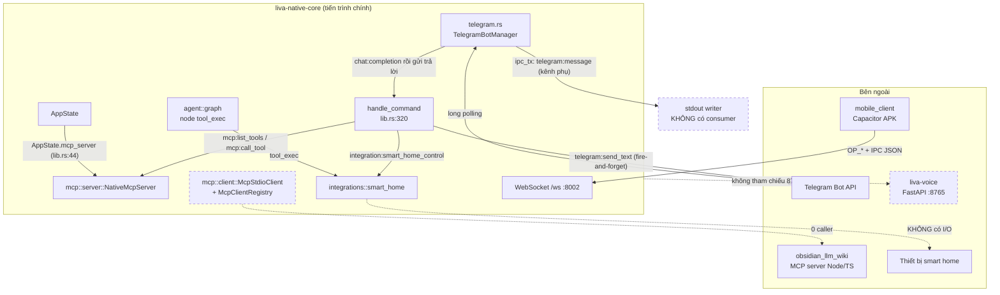
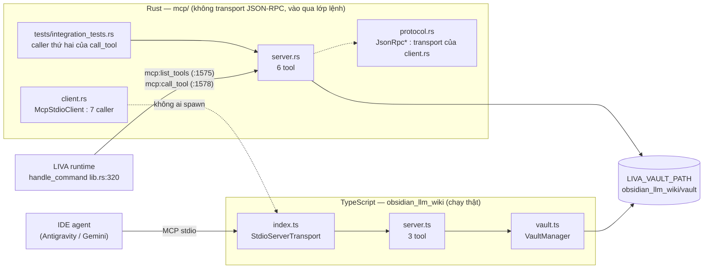
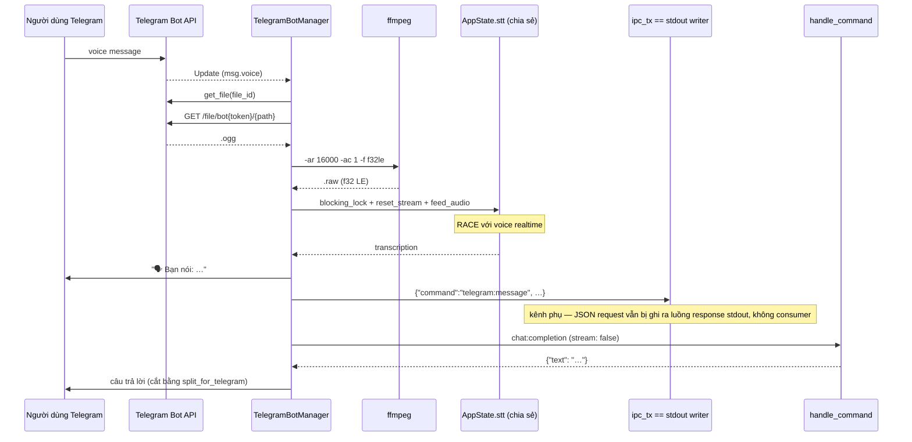
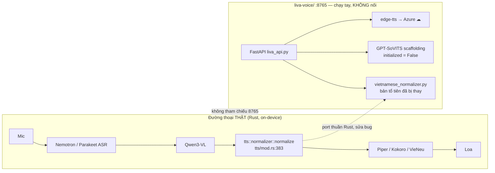

# 09 — Tích hợp ngoài

[⬆ Mục lục](../README.md) · [◀ Frontend và vỏ Tauri](08-frontend-va-vo-tauri.md) · [Phụ thuộc module và tra cứu ▶](10-phu-thuoc-module-va-tra-cuu.md)

---

Chương này mô tả mọi điểm LIVA chạm ra thế giới bên ngoài quá trình chính: giao thức MCP (client + server nội bộ), bot Telegram, kỹ năng smart home, dịch vụ Python `liva-voice` (port 8765), client di động Capacitor, và MCP server TypeScript `obsidian_llm_wiki`.

**Kết luận chủ đạo của chương (cập nhật 22/07/2026):** ~~ngoài `integrations::smart_home` (đã nối dây nhưng là stub) và lệnh Telegram `/stop`, **hầu như toàn bộ khu vực tích hợp ngoài của LIVA là code mồ côi**~~ — bản cũ đúng cho tới ngày 22/07/2026, khi hai điểm đứt dây lớn nhất được nối lại: MCP server nội bộ giờ có cổng vào thật (`mcp:list_tools` / `mcp:call_tool` trong `handle_command`, `liva-native-core/src/lib.rs#handle_command, 1578`), và vòng hội thoại Telegram đã khép kín (`route_input_to_agent` gọi thẳng `chat:completion` rồi gửi trả lời về, `telegram.rs:387-460`). ~~Phần vẫn còn mồ côi: `mcp/client.rs` (`ProcessWrapper` 0 caller), …~~ — **`mcp/client.rs` cũng đã rời danh sách** ở rung G0 (25–26/07/2026): viết lại thành MCP client stdio đầy đủ, 7 call site, đã chạy với server `npx` thật (§9.1.1). Phần **vẫn còn mồ côi**: `liva-voice/` không tiến trình nào khởi động, `mobile_client/` PoC đóng băng — có struct, có test xanh, nhưng không có cổng vào hoặc không có consumer ở đầu ra.

Nhãn trạng thái dùng xuyên suốt: **[OK]** đang chạy thật · **[MỘT PHẦN]** có code nhưng tắt/opt-in/chưa nối dây · **[THIẾU]** chưa có/stub.

---

## 9.0 Bản đồ tổng thể

| Thành phần | File / vị trí | Giao thức | Trạng thái |
|---|---|---|---|
| MCP **client** (spawn server ngoài qua stdio) | `liva-native-core/src/mcp/client.rs` (1 143 dòng) | stdio + JSON-RPC đầy đủ: handshake, tương quan id, `tools/list`+`tools/call`, drain stderr, timeout, đọc `mcp_config.json` | **[OK]** (26/07/2026, rung G0) — 7 call site; đã chạy với server `npx` thật |
| MCP **server** nội bộ `NativeMcpServer` | `liva-native-core/src/mcp/server.rs` (183 dòng) | không có transport JSON-RPC riêng; đi vào qua lớp lệnh IPC | **[MỘT PHẦN]** (22/07/2026) — `new()` lúc khởi động, giữ trong `AppState`, và **đã có cổng vào thật**: `handle_command` có `"mcp:list_tools"` (`liva-native-core/src/lib.rs#handle_command`) + `"mcp:call_tool"` (`liva-native-core/src/lib.rs#handle_command`). ~~chỉ được gọi trong `tests/integration_tests.rs`~~. Chưa client UI nào gọi |
| MCP **protocol** (JSON-RPC struct) | `liva-native-core/src/mcp/protocol.rs` (106 dòng) | JSON-RPC 2.0 (lệch spec) | **[THIẾU]** một nửa — `JsonRpc*` 0 caller |
| MCP server **thật chạy** | `teamwork_projects/obsidian_llm_wiki/src/{index,server,vault}.ts` | MCP stdio, `@modelcontextprotocol/sdk` | **[OK] nhưng NGOÀI LIVA** — Node/TS, phục vụ IDE agent, không phải LIVA gọi |
| Telegram bot | `liva-native-core/src/telegram.rs` | Bot API qua `teloxide` (long polling) | **[MỘT PHẦN]** — opt-in theo env, chỉ spawn trong binary stdio, **không spawn trong Tauri** |
| Smart home | `liva-native-core/src/integrations/smart_home.rs` | **không có giao thức nào** | **[THIẾU]** — đã nối vào agent graph + 3 lệnh IPC, nhưng là stub thuần |
| `liva-voice/` Python | `liva-voice/liva_api.py` | FastAPI HTTP + WebSocket, port 8765 | **[MỘT PHẦN]** — chạy tay, không được app khởi động, lõi Rust không gọi |
| `mobile_client/` | `mobile_client/` (Capacitor 8 + Vue 3) | WebSocket nhị phân + JSON tới `ws://…:8002/ws` | **[MỘT PHẦN]** — PoC đóng băng, protocol vẫn khớp core |



---

## 9.1 MCP — hai bản song song, bản Rust chỉ vào được từ trong nhà

Bốn hạng mục MCP (`client.rs`, `server.rs`, `protocol.rs`, và server TypeScript `obsidian_llm_wiki`) đã được liệt kê kèm trạng thái ở **§9.0 Bản đồ tổng thể** phía trên — không lặp lại bảng ở đây. Tóm tắt (cập nhật 22/07/2026): ~~**cả ba module Rust đều [THIẾU]** (không transport, không caller ngoài test)~~ — nay `server.rs` là **[MỘT PHẦN]** vì đã được `handle_command` gọi thật, ~~còn `client.rs` và nhóm `JsonRpc*` trong `protocol.rs` vẫn **[THIẾU]** (0 caller, không transport)~~ — **cả hai đã [OK] từ 26/07/2026**: `client.rs` là MCP client stdio thật (§9.1.1), và nó dùng chính `JsonRpcRequest/Response/Notification/Error` làm transport, nên nhóm `JsonRpc*` không còn là kiểu-không-ai-dùng; **bản TypeScript [OK] nhưng phục vụ IDE agent chứ không phải LIVA**. Các mục dưới đây đi vào chi tiết từng module.

### 9.1.1 MCP client — `mcp/client.rs` **[OK]** (viết lại ở rung G0, 25–26/07/2026)

Chỉ có **stdio**, không có HTTP/SSE — điểm này không đổi.

> **Bản trước của mục này (tới 25/07/2026) mô tả `ProcessWrapper` 49 dòng, 0 caller.**
> Nó đã bị thay hoàn toàn. Chi tiết đầy đủ về rung G0 nằm ở
> [Đề xuất tích hợp OpenSpace](../03-danh-gia/04-de-xuat-tich-hop-openspace.md) §3;
> mục này chỉ giữ phần thuộc chương "tích hợp ngoài".

```rust
pub struct McpStdioClient { /* child, stdin, pending, closed, handshake, 2 task */ }
impl McpStdioClient {
    pub async fn connect(name: &str, cfg: &McpServerConfig) -> Result<Self, String>
    pub async fn request(&self, method: &str, params: Option<Value>) -> Result<Value, String>
    pub async fn list_tools(&self) -> Result<ToolList, String>   // đi hết phân trang nextCursor
    pub async fn call_tool(&self, req: CallToolRequest) -> Result<CallToolResult, String>
}
pub struct McpClientRegistry { /* nối LƯỜI theo mcp_config.json, nối lại khi server chết */ }
pub fn global_registry() -> Arc<McpClientRegistry>
```

**Nay CÓ** đúng những thứ bản cũ thiếu: handshake `initialize` → `notifications/initialized`;
tương quan `id` ↔ response bằng `HashMap<String, oneshot::Sender>`; `tools/list` + `tools/call`
trả kiểu trong `protocol.rs` (nên `protocol.rs` không còn là kiểu-không-ai-dùng); drain `stderr`
trong task riêng; timeout mỗi request (`LIVA_MCP_TIMEOUT_MS`); kill tiến trình con khi drop; và
bộ đọc `mcp_config.json` (`LIVA_MCP_CONFIG` ghi đè).

**Hai bug của bản cũ, nay không còn:**

- `BufReader` mới mỗi lần đọc → mất message. Nay **một** task đọc duy nhất giữ một `BufReader`
  suốt vòng đời kết nối.
- Không đọc `stderr` → pipe đầy rồi treo. Hệ quả này bản cũ ghi là **suy đoán**; G0 đã **đo**:
  tạm bỏ task drain thì `tools/call` hết giờ đúng như dự đoán (`scripts/e2e-mcp-server.mjs` đổ
  ~400 KB stderr bằng `fs.writeSync`). Nay có drain, cộng vòng đệm 20 dòng stderr cuối được in
  lại ở `WARN` khi server chết.

**Đang bật?** Có. Ra ngoài qua `mcp_client:list_servers` / `mcp_client:list_tools` /
`mcp_client:call_tool` trong `handle_command`, và được `llm/tool_calling.rs` dùng cho vòng
tool-calling G1. 7 call site thật ngoài chính file.

**Đã chạy với server ngoài THẬT:** `@modelcontextprotocol/server-everything` (13 tool) và
`-filesystem` (14 tool), song song, qua `npx`. Chạy lại: `node scripts/verify-mcp-real.mjs`
(15/15). Chưa chạy với server cần credential (postgres/redis/github).

⇒ **LIVA hiện KHÔNG THỂ kết nối tới bất kỳ MCP server ngoài nào.**

### 9.1.2 MCP server nội bộ — `NativeMcpServer` **[MỘT PHẦN]**

```rust
pub struct NativeMcpServer { vault_path: PathBuf }
impl NativeMcpServer {
    pub fn new(vault_path: &str) -> Self                                       // server.rs:33
    pub fn list_tools(&self) -> ToolList                                       // server.rs:39
    fn resolve_path(&self, rel_path: &str) -> Result<PathBuf, String>          // server.rs:67
    pub async fn call_tool(&self, req: CallToolRequest)
        -> Result<CallToolResult, String>                                      // server.rs:79
}
```

**4 tool được expose** (`server.rs:41-63`):

| Tool | Args struct (JsonSchema) | Hành vi thật |
|---|---|---|
| `read_markdown` | `ReadMarkdownArgs { path: String }` (`server.rs:10-13`) | `tokio::fs::read_to_string` trong vault (`server.rs:85`) |
| `write_markdown` | `WriteMarkdownArgs { path, content }` (`server.rs:15-19`) | `create_dir_all(parent)` + `tokio::fs::write` (`server.rs:100-103`) |
| `search_vault` | `SearchVaultArgs { query: String }` (`server.rs:21-24`) | Walk đệ quy vault (fn nội bộ `walk_dir`, `server.rs:121`), lọc ext `md`/`txt`, `content.contains(&query)` — **substring thô, không index, không metadata**, và dùng **`std::fs` blocking bên trong `async fn`** (`server.rs:123, 146`) |
| `control_smarthome` | `ControlSmartHomeArgs { device, command }` (`server.rs:26-30`) | **STUB thuần**: chỉ trả `format!("Command '{}' sent to '{}'", …)` (`server.rs:176`). Lưu ý: **không** gọi `integrations::smart_home::execute` |

`input_schema: schemars::schema::RootSchema` sinh bằng `schema_for!(...)`, serde `rename_all = "camelCase"` → serialize thành `inputSchema` (đúng MCP spec).

**Chống path traversal** (`resolve_path`, `server.rs:67-77`): chặn `is_absolute()`, `has_root()`, mọi `Component::ParentDir`, rồi double-check `full.starts_with(vault_path)`. Áp dụng cho `read_markdown`/`write_markdown`; `search_vault` không cần vì chỉ walk từ root. **Không canonicalize ⇒ symlink có thể lách** (xem chương nợ kỹ thuật).

**Nối dây:**

- `AppState.mcp_server: Arc<mcp::server::NativeMcpServer>` — `liva-native-core/src/lib.rs#AppState`.
- Khởi tạo: `liva-native-core/src/main.rs#async_main` và `liva-desktop/src-tauri/src/lib.rs#migrate_legacy_vault`, cùng default `LIVA_VAULT_PATH = "<repo>/teamwork_projects/obsidian_llm_wiki/vault"` (**hardcode absolute path máy tác giả**).
- **Vẫn không có transport riêng:** không có JSON-RPC loop, không listener stdio/HTTP cho server này. Nhưng **từ 22/07/2026 nó đã được nối vào lớp lệnh**: nay `handle_command` (`liva-native-core/src/lib.rs#handle_command`) có hai nhánh `"mcp:list_tools"` (`liva-native-core/src/lib.rs#handle_command`) và `"mcp:call_tool"` (`liva-native-core/src/lib.rs#handle_command`), đặt ngay trước nhánh cuối `_ => Err(format!("Unknown command: {}", command))` (`liva-native-core/src/lib.rs#handle_command`). Grep `"mcp:` trên `src/`, `src-tauri/src/`, `liva-ui/src/` = **2 hit**, cả hai trong `lib.rs`. Khối comment ngay trên hai arm (`liva-native-core/src/lib.rs#handle_command`) ghi rõ ranh giới an toàn: mọi thao tác file vẫn đi qua `resolve_path`.
- Caller của `call_tool`: `liva-native-core/src/lib.rs#handle_command` (arm `mcp:call_tool`, dựng `mcp::protocol::CallToolRequest`) và `liva-native-core/tests/integration_tests.rs` (dòng 41, 62, 78, 88, 171, 181, 192, 203, cùng nhóm mới 579-625). `list_tools()` được gọi ở `liva-native-core/src/lib.rs#handle_command` và trong test `integration_tests.rs:559, 565`.

⇒ **LIVA đã expose 4 tool này ra lớp lệnh IPC/WebSocket**, kèm test `2.7 — mcp:list_tools / mcp:call_tool phải đi qua handle_command` (`integration_tests.rs:539`). Phần còn thiếu: **chưa client UI nào gọi hai lệnh đó**, và vẫn không có transport JSON-RPC để một MCP host bên ngoài nối vào.

### 9.1.3 `protocol.rs` — struct JSON-RPC, sai lệch spec

```rust
pub struct JsonRpcRequest  { jsonrpc: String, id: String, method: String, params: Option<Value> }      // :5
pub struct JsonRpcResponse { jsonrpc: String, id: String, result: Option<Value>,
                             error: Option<JsonRpcError> }                                            // :14
pub struct JsonRpcNotification { jsonrpc: String, method: String, params: Option<Value> }             // :24
pub struct JsonRpcError { code: i32, message: String, data: Option<Value> }                           // :32

impl JsonRpcRequest  { pub fn new(id: String, method: String, params: Option<Value>) -> Self }         // :40
impl JsonRpcResponse { pub fn success(id: String, result: Value) -> Self                               // :51
                       pub fn error(id: String, code: i32, message: String,
                                    data: Option<Value>) -> Self }                                     // :60

#[serde(rename_all="camelCase")] pub struct Tool { name, description,
                                                   input_schema: schemars::schema::RootSchema }        // :72
#[serde(rename_all="camelCase")] pub struct ToolList { tools: Vec<Tool> }                              // :80
#[serde(rename_all="camelCase")] pub struct CallToolRequest { name: String, arguments: Value }         // :86
#[serde(rename_all="camelCase")] pub struct CallToolResult { content: Vec<ToolContent>,
                                                             #[serde(default)] is_error: bool }        // :93
#[serde(tag="type")] pub enum ToolContent { Text{text}, Image{data, mime_type} }                       // :101
```

**Sai lệch spec (đọc trực tiếp):** `JsonRpcRequest { id: String }` (`protocol.rs:5`) ép `id` **bắt buộc và chỉ nhận string** — JSON-RPC 2.0/MCP cho phép `id` là **number** hoặc `null`. Client MCP thật gửi `"id": 1` sẽ **fail deserialize**. Đồng thời không có struct nào cho `initialize` / `ServerCapabilities` / `resources/*` / `prompts/*`.

Chỉ `Tool` / `ToolList` / `CallToolRequest` / `CallToolResult` / `ToolContent` được `server.rs` + `lib.rs` (arm `mcp:call_tool`, `liva-native-core/src/lib.rs#handle_command`) + test dùng; toàn bộ nhóm `JsonRpc*` là **0 caller**.

### 9.1.4 MCP server thật sự hoạt động — `teamwork_projects/obsidian_llm_wiki` **[OK] nhưng ngoài LIVA**

Đây mới là MCP server chạy được (`package.json`: `@modelcontextprotocol/sdk ^1.29.0`, `zod ^4.3.6`, `main: dist/src/index.js`), và là **npm workspace chính thức** của repo gốc (`package.json:12`).

- `src/index.ts:1, 39, 72`: `StdioServerTransport`, `mcpServer.connect(transport)`. Vault root = `process.argv[2] || process.env.OBSIDIAN_VAULT_PATH || ../vault` (`index.ts:26-30`). **Redirect `console.log/info/warn` → `stderr`** để không làm hỏng luồng JSON-RPC trên stdout (`index.ts:14-22`). Shutdown sạch trên SIGINT/SIGTERM/stdin close.
- `teamwork_projects/obsidian_llm_wiki/src/server.ts#createMcpServer` — `export function createMcpServer(vaultRoot: string): { mcpServer: McpServer; cleanup: () => void }`; tên server `liva-obsidian-mcp-server`; đăng ký **3 tool** qua `mcpServer.registerTool`: `read_markdown`, `write_markdown`, `search_vault` (hỗ trợ query kiểu `author:explorer tags:liva/rule`). Uỷ quyền cho `VaultManager` trong `src/vault.ts`.
- Scripts: `dev: tsx src/index.ts`, `validate: tsx scripts/validate-vault.ts`, `sync-architecture: tsx scripts/gitnexus-obsidian-sync.ts`; test bằng Jest. ESLint bỏ qua toàn bộ `teamwork_projects/**/*` (`eslint.config.js:31`).

**Quan hệ với Rust:** `NativeMcpServer` (Rust) là **bản sao chép lại 3 tool này + thêm `control_smarthome`**, trỏ cùng `LIVA_VAULT_PATH`. Hai bản song song, bản Rust không có transport, bản TS có transport nhưng phục vụ IDE agent (Antigravity/Gemini) chứ không phải LIVA.



### 9.1.5 File cấu hình MCP — không liên quan LIVA core

- `mcp_config.example.json` (45 dòng): mẫu `{"mcpServers": {...}}` cho **postgres, redis, github-mcp-server (docker), `_clerk_VERIFY_PACKAGE` (placeholder)**. **Không có code Rust/TS nào trong repo đọc file này** — grep `mcp_config` chỉ hit ở `verify-mcp-config.js:4` và `teamwork_projects/liva_upgrade_plan/upgrade_plan.md:138` (tức *kế hoạch* chưa làm: "Read configurations from `mcp_config.json`"). `mcp_config.example.json:31` để placeholder token GitHub ngay trong file commit.
- `verify-mcp-config.js` (53 dòng): script Node kiểm tra file **`C:\Users\Admin\.gemini\antigravity\mcp_config.json`** (hardcode path máy tác giả, `verify-mcp-config.js:4`), assert có server `obsidian` với `command === "node"` và đúng 2 args trỏ tới `dist/src/index.js` + `vault`.

Cả hai là **công cụ cấu hình IDE agent bên ngoài**, không phải LIVA.

### 9.1.6 Bảo mật MCP

| Điểm | Đánh giá |
|---|---|
| Path traversal (Rust) | Có chặn (`resolve_path`), nhưng **không canonicalize** ⇒ symlink trong vault có thể trỏ ra ngoài |
| Xác thực | MCP không tự xác thực, nhưng đường command bên ngoài nay đi qua `authorization::authorize_command`: Tauri lấy principal từ exact window label; WebSocket đặc quyền cần session ticket loopback dùng một lần. `guard_direct_call` và `resolve_path` vẫn là hai lớp policy/path riêng, không thay thế principal. |
| Ghi file | `write_markdown` tạo thư mục cha tuỳ ý **trong vault**; không giới hạn kích thước, không giới hạn extension |
| Blocking I/O trong async | `search_vault` dùng `std::fs` trong `async fn` ⇒ chặn worker Tokio nếu vault lớn |
| Deserialize | `id: String` bắt buộc ⇒ **không tương thích** client MCP thật |

---

## 9.2 Telegram — bot chạy được, vòng lặp đã khép kín từ 22/07/2026

### 9.2.1 Enum lệnh & manager

```rust
#[derive(BotCommands)] #[command(rename_rule="lowercase")]
pub enum TelegramCommand {
    Start, Help, Status, Panic,
    Ask(String), Latest, Stop,
    Ls(String), Cat(String),
}                                                        // telegram.rs:8-29
```

```rust
pub struct TelegramBotManager {
    bot: Bot,
    allowed_ids: HashSet<String>,
    state: Arc<AppState>,
    ipc_tx: Option<tokio::sync::mpsc::Sender<String>>,
}
impl TelegramBotManager {
    pub fn new(token: String, allowed_ids: HashSet<String>,
               state: Arc<AppState>, ipc_tx: Option<Sender<String>>) -> Self   // telegram.rs:39
    pub async fn start(self: Arc<Self>)                                        // telegram.rs:54
    fn is_authorized(&self, user_id: &str) -> bool                             // telegram.rs:73
}
```

Dispatcher teloxide (`telegram.rs:58-70`): `Update::filter_message()` → nhánh `filter_command::<TelegramCommand>() → handle_command` | nhánh `handle_message`.

`is_authorized` **fail-closed**: `allowed_ids.is_empty() → false` (`telegram.rs:74-76`) — thiếu `TELEGRAM_ALLOWED_IDS` thì bot từ chối **tất cả**. Đây là mặc định đúng.

### 9.2.2 Bảng 9 lệnh

| Lệnh | Hành vi | Trạng thái |
|---|---|---|
| `/start` | in Chat ID (MarkdownV2) | **[OK]** |
| `/help` | text cứng liệt kê 9 lệnh (`telegram.rs:101-111`) | **[OK]** |
| `/status` | **chuỗi cứng** `"🟢 Hệ thống LIVA Native Engine đang hoạt động bình thường."` (`telegram.rs:117`) — không kiểm tra gì | **[THIẾU]** |
| `/panic` | gửi `{"command":"panic"}` vào `ipc_tx` (`telegram.rs:121-128`) | **[THIẾU]** — không có consumer |
| `/ask <q>` | → `route_input_to_agent` → `chat:completion` → gửi trả lời về chat | **[OK]** (22/07/2026) — ~~**[THIẾU]** đứt dây~~ |
| `/latest` | `spawn_blocking` → `state.db.readers.get()` → SQL `SELECT aiReply FROM turn_layer_nodes ORDER BY temporal_anchor DESC LIMIT 1` (`telegram.rs:145`); có `.unwrap()` trên `conn.prepare` ⇒ panic nếu schema sai | **[MỘT PHẦN]** — bảng không có writer ⇒ luôn rỗng |
| `/stop` | `manager.state.tts_player.stop().await` (thật) + IPC `"voice:tts_stop"` (`telegram.rs:164-172`) | **[OK]** — gọi thẳng `tts_player`, không đi qua `ipc_tx` |
| `/ls <path>` | `tokio::fs::read_dir(target)`, mặc định `"."`; **KHÔNG sandbox** (`telegram.rs:175-217`) | **[MỘT PHẦN]** — rủi ro bảo mật |
| `/cat <file>` | `tokio::fs::read_to_string(file_path.trim())`, cắt 3500 ký tự; **KHÔNG sandbox, KHÔNG chặn traversal** (`telegram.rs:218-268`) | **[MỘT PHẦN]** — **rủi ro nghiêm trọng** |

Escape MarkdownV2 làm thủ công bằng chuỗi `.replace()` nối tiếp (`telegram.rs:189-207`, `233-254`) — ở `/cat`, thứ tự xử lý `\\` trước rồi backtick, header escape riêng.

### 9.2.3 Tin nhắn thường & tin nhắn thoại

`handle_message` (`telegram.rs:274-314`):

- Text không bắt đầu bằng `/` → `route_input_to_agent`.
- `msg.voice()` → `send_chat_action(RecordVoice)`, `tokio::spawn` → `process_voice_message`, trả về thì gửi `"🗣️ Bạn nói: {transcription}"` rồi `route_input_to_agent`.

`process_voice_message` — pipeline ffmpeg (`telegram.rs:317-373`):

```rust
async fn process_voice_message(bot: &Bot, file_id: &str, state: &Arc<AppState>)
    -> Result<String, Box<dyn std::error::Error + Send + Sync>>
```

1. `bot.get_file(file_id)` → `file.path`.
2. Đọc **`std::env::var("TELEGRAM_BOT_TOKEN")` trực tiếp** (`telegram.rs:323`) — **không dùng token đã lưu trong `Bot`**; nếu env bị xoá sau khi bot khởi động thì URL hỏng.
3. Tải `https://api.telegram.org/file/bot{token}/{path}` bằng `reqwest::get` (`telegram.rs:324-327`).
4. Ghi tạm `%TEMP%/tg_voice_{file_id}.ogg`.
5. **ffmpeg**: `ffmpeg -y -i <in.ogg> -ar 16000 -ac 1 -f f32le <out.raw>` (`telegram.rs:333-347`) — bắt buộc có `ffmpeg` trên PATH.
6. Đọc `.raw`, `chunks_exact(4)` → `f32::from_le_bytes` → `Vec<f32>` 16 kHz mono (`telegram.rs:353-357`).
7. Xoá 2 file tạm.
8. `spawn_blocking`: `state.stt.blocking_lock()` → `stt.reset_stream()` → `stt.feed_audio(&samples, true)` (`telegram.rs:362-370`).
9. `text.ok_or("ASR output was empty")`.

> **Race:** dùng chung `AppState.stt` với luồng voice realtime ⇒ tin nhắn thoại Telegram sẽ `reset_stream()` **giữa chừng** một phiên nói trực tiếp. (Việc share mutex là sự thật đọc được trong code; mức độ hệ quả là suy đoán.)

### 9.2.4 `route_input_to_agent` — điểm đứt dây cũ, đã nối lại 22/07/2026

```rust
async fn route_input_to_agent(
    manager: &TelegramBotManager,
    chat_id: ChatId,
    text: String,
)
```
(`telegram.rs:387-460`) làm hai việc.

**(1) Kênh IPC cũ — giữ nguyên hợp đồng sự kiện cho tooling bên ngoài** (`telegram.rs:394-405`), gửi vào `ipc_tx`:

```json
{"id":"tg_msg_{chat_id}","command":"telegram:message","payload":{"senderId":"…","text":"…"}}
```

Trong `liva-native-core/src/boot.rs:418-425`, `ipc_tx` chính là **`tx` của kênh ghi stdout** (`liva-native-core/src/main.rs:158-171` là stdout writer task). Nghĩa là một JSON dạng **request** bị bơm ra **luồng response** — trong khi `IpcResponse` có schema `id/status/data/error` (`lib.rs:54-62`), hoàn toàn **không khớp**.

Grep toàn repo (bỏ `node_modules`, `target`): **`"telegram:message"` vẫn chỉ xuất hiện đúng 1 lần, tại `telegram.rs:398` — nơi sinh ra nó. Không có consumer.** Tương tự, `"panic"` và `"voice:tts_stop"` gửi qua `ipc_tx` cũng chỉ đi ra stdout. Khác biệt so với bản trước: đây giờ chỉ là **kênh phụ**, không còn là đường sống duy nhất của câu trả lời.

**(2) Vòng hội thoại khép kín ngay tại chỗ** (`telegram.rs:407-459`): gửi `ChatAction::Typing`, dựng payload `{"messages":[{"role":"user","content":…}],"stream":false}`, gọi thẳng `crate::handle_command(state, "chat:completion", …)` (`telegram.rs:420-427`), lấy trường `text`, rồi gửi trả lời về Telegram qua `split_for_telegram()` (`telegram.rs:454-459`, hàm cắt ở `telegram.rs:466`). Lỗi `chat:completion` và trường hợp rỗng đều có tin nhắn báo riêng (`telegram.rs:435-451`). Doc-comment ngay trên hàm ghi lại lịch sử: *«Vẫn giữ phần phát ra `ipc_tx` … nhưng vòng lặp hội thoại giờ khép kín ngay tại đây.»*

⇒ ~~**`/ask`, tin nhắn text, và tin nhắn thoại Telegram KHÔNG bao giờ tới agent loop.** Người dùng thấy `"🗣️ Bạn nói: …"` rồi im lặng~~ — đúng cho tới 22/07/2026. Nay `/ask`, tin nhắn text và tin nhắn thoại **đều đi tới LLM và có trả lời**. Lưu ý sắc thái: đường này gọi `chat:completion` chứ **không** đi qua StateGraph của `agent::graph`, nên các nhánh `tool_exec` / `vision` ở §9.3 **không** áp dụng cho Telegram.



### 9.2.5 Khởi động bot & đường chạy chính

```rust
let telegram_token = std::env::var("TELEGRAM_BOT_TOKEN").ok();
if let Some(token) = telegram_token {
    let allowed_ids_raw = std::env::var("TELEGRAM_ALLOWED_IDS").unwrap_or_default();
    // split(',').trim().filter(non-empty) → HashSet
    tokio::spawn(async move {
        Arc::new(TelegramBotManager::new(token, allowed_ids, state_tg, Some(tx_tg))).start().await;
    });
}
```
(`liva-native-core/src/boot.rs:401-428`)

- `.ok()` **không lọc chuỗi rỗng** → `TELEGRAM_BOT_TOKEN=` (đúng như trong `.env.example:219`) vẫn spawn bot với token rỗng.
- **Quan trọng — không chạy dưới Tauri:** grep `telegram` trong `liva-desktop/src-tauri/src/` = **0 hit**. `src-tauri/src/lib.rs:370` dựng `AppState` riêng và không spawn `TelegramBotManager`. Đường chạy chính (`npm run dev` → `tauri dev`) **không có bot Telegram**.

### 9.2.6 Lệnh IPC liên quan Telegram

`"telegram:send_text"` (`liva-native-core/src/commands/integrations.rs:53-74`): đọc `payload["chatId"]` (parse `i64`), `payload["text"]`, `std::env::var("TELEGRAM_BOT_TOKEN")`, **tạo `Bot::new(token)` mới mỗi lần gọi**, `tokio::spawn` gửi, trả `{"success": true}` **ngay lập tức** — fire-and-forget, **không báo lỗi gửi**. Được test ở `src/bin/verify_integrations.rs:80-86`.

> 📌 Nguồn đầy đủ (bảng 44 lệnh `handle_command`): [02 — Giao thức IPC và WebSocket](02-giao-thuc-ipc-va-websocket.md)

### 9.2.7 Biến môi trường Telegram

Điểm cần nhớ riêng cho chương này: `TELEGRAM_BOT_TOKEN` được đọc ở **3 nơi độc lập** (`liva-native-core/src/boot.rs:486`, `telegram.rs:395`, `liva-native-core/src/system_status.rs#system_status`) thay vì một nguồn duy nhất; `TELEGRAM_ALLOWED_IDS` là CSV và **rỗng ⇒ chặn hết** (fail-closed). Nhóm `TELEGRAM_CHAT_ID` / `TELEGRAM_ADMIN_ID` / `REMOTE_CONTROL_ENABLED` / `ZALO_*` được khai báo nhưng **không có dòng Rust nào đọc** — chi tiết độ lệch `.env.example` ↔ code nằm ở tài liệu cấu hình.

> 📌 Nguồn đầy đủ (bảng biến môi trường, lệch `.env.example` vs code): [Cấu hình và biến môi trường](../02-van-hanh/01-cau-hinh-va-bien-moi-truong.md)

UI: `ApiManagementView.vue` ghi credential theo đường write-only/vault; `SystemView.vue` render trạng thái Remote Control từ `system_status.rs`. Trạng thái Telegram nay lấy từ `telegram::bot_running()`, trả `offline` khi bot chưa chạy và không còn hard-code xanh.

### 9.2.8 Bảo mật Telegram

| Vấn đề | Vị trí | Mức |
|---|---|---|
| `/cat` đọc file tuỳ ý trên máy — kể cả `.env` chứa `LIVA_ENCRYPTION_KEY`, vault, khoá | `telegram.rs:218-268` | **Nghiêm trọng** |
| `/ls` liệt kê thư mục tuỳ ý | `telegram.rs:175-217` | Cao |
| Token đọc lại từ env thay vì dùng token trong `Bot` | `telegram.rs:323` | Trung bình |
| `Bot::new()` mới mỗi lần `telegram:send_text` (không reuse connection pool) | `liva-native-core/src/commands/integrations.rs:65-72` | Thấp |
| Token rỗng vẫn spawn bot | `liva-native-core/src/boot.rs:407-425` | Thấp |
| ~~Health check giả báo `telegram: online`~~ | `system_status.rs#system_status` nay đo `telegram::bot_running()` | **Đã đóng** |

Điểm mâu thuẫn đáng chú ý: **MCP server cùng repo có `resolve_path` chống traversal, trong khi `/cat` của Telegram — cổng vào từ Internet — thì không có gì.**

---

## 9.3 Smart home — không có giao thức nào **[THIẾU]**

### 9.3.1 Tool thời tiết và định vị coarse — tích hợp mạng có chủ đích **[OK]**

`get_weather` là ngoại lệ Internet duy nhất trong catalog tool native. Nó dùng Open-Meteo không
cần API key, timeout cứng 6 giây và trả lỗi nói rõ “cần Internet” thay vì làm cả lượt chat treo.
Địa điểm được chọn theo thứ tự: tham số người dùng → `user_profile.json.location` → cache định vị
IP coarse 24 giờ. Nhánh IP chỉ chạy khi `system.geolocationEnabled` hoặc
`LIVA_GEOLOCATION_ENABLED` được bật; LIVA không lưu hay gửi địa chỉ IP vào LLM.

Tool này là read-only/retrieval, không biến smart-home placeholder thành thiết bị thật. Nguồn:
`integrations/weather.rs`, `integrations/geolocation.rs`, catalog trong `mcp/server.rs`.

Không Home Assistant, không MQTT, không Zigbee, không HTTP. `liva-native-core/Cargo.toml` không có `rumqttc`/`paho`/bất cứ dep MQTT nào (grep `mqtt` = **0 hit**).

```rust
#[serde(rename_all="lowercase")] pub enum SmartHomeDevice { Light, Ac, Fan }   // smart_home.rs:6
#[serde(rename_all="lowercase")] pub enum SmartHomeAction { On, Off }          // smart_home.rs:14
#[serde(deny_unknown_fields)] pub struct SmartHomeArgs {
    device: SmartHomeDevice, action: SmartHomeAction }                         // smart_home.rs:21
pub fn get_metadata() -> Value                                                 // smart_home.rs:26
pub fn execute(raw_args: Value) -> Result<String, String>                      // smart_home.rs:51
```

`execute` (`smart_home.rs:51-67`): deserialize (strict, `deny_unknown_fields`) → map enum sang chuỗi → `tracing::info!("[SmartHomeSkill] Executing: device='{}', action='{}'")` → `Ok(format!("Device '{}' successfully turned '{}'.", …))`. **Không có I/O ra thiết bị.**

Thiết bị hỗ trợ: **light / ac / fan**; hành động: **on / off**. Metadata JSON-Schema kiểu OpenAI function tại `smart_home.rs:26-49` (`name: "smart_home_control"`, `category: "core"`).

**Đã nối dây thật — 3 điểm:**

1. **Agent graph** — `liva-native-core/src/agent/graph.rs#barge_in_dung_llm_dang_cho_tts_backpressure`: node `"tool_exec"` gọi `crate::integrations::smart_home::execute(payload)`, push kết quả vào `state.messages` với `role: "tool"`, rồi chuyển sang `chat_completion`. **Viết lại 22/07/2026** (file nay 693 dòng): router node (`liva-native-core/src/agent/graph.rs#llm_chunk_queue_day_dung_sau_deadline`) không còn tự khớp chuỗi mà uỷ quyền cho `enum Intent` (`liva-native-core/src/agent/graph.rs#StateGraph::run`) + `pub fn route_intent(text: &str) -> Intent` (`liva-native-core/src/agent/graph.rs#state_khong_co_embedder`), gọi tại `liva-native-core/src/agent/graph.rs#heartbeat_reasoning_rong_kiem_epoch_nhung_khong_chiem_tts_queue`. `route_intent` cắt câu bằng `tokenize()` (`liva-native-core/src/agent/graph.rs#StateGraph::run_single_node`, tách theo `!c.is_alphanumeric()`) rồi so **token trọn vẹn** qua `has_word()` (`liva-native-core/src/agent/graph.rs#pipeline`) / `has_phrase()` (`liva-native-core/src/agent/graph.rs#pipeline`).
   - ~~`contains("ac")` khớp trong bất kỳ từ nào chứa "ac"; `contains("on")` khớp trong rất nhiều từ ⇒ **false positive dễ xảy ra**~~ — **đã sửa**. Doc-comment tại `liva-native-core/src/agent/graph.rs#state_khong_co_embedder` ghi lại chính lỗi này của bản cũ: `contains("ac")` khớp "b**ac**k"/"pl**ac**e", `contains("off")` khớp "c**off**ee"/"**off**ice", nên "back on track" từng bị hiểu thành lệnh bật điều hoà. `has_word` so `t == word` nên các từ trên không còn khớp.
   - ~~**Không nhận tiếng Việt** — "bật đèn" không khớp gì cả~~ — **đã sửa**. `route_intent` (`liva-native-core/src/agent/graph.rs#state_khong_co_embedder`) có từ khoá tiếng Việt cho cả thiết bị (`đèn` → `light`; `điều hoà`/`điều hòa`/`máy lạnh` → `ac`; `quạt` → `fan`) lẫn hành động (`bật`/`mở` → `on`; `tắt`/`đóng` → `off`), và một nhánh vision ưu tiên cao nhất (`màn hình`, `screen`, `screenshot`). "bật đèn" nay khớp `Intent::SmartHome { device: "light", action: "on" }`.
   - Vẫn là **định tuyến theo từ khoá**, chưa phải tool-calling có schema do LLM sinh — chính doc-comment trong mã ghi nhận điều đó.
   - Graph này chạy thật: `liva-native-core/src/webrtc/pipeline.rs#WebRTCActor::handle_vad_end` gọi `crate::agent::graph::build_pipeline_graph(...)` trong LLM task.
2. **IPC command** `"integration:smart_home_control"` — `liva-native-core/src/commands/integrations.rs:40-47`.
3. **IPC command** `"integrations:list"` (`liva-native-core/src/commands/integrations.rs:40-50`) — vẫn chỉ trả `[smart_home::get_metadata()]`. *(`"get_skills_list"` từng cùng cảnh ngộ; từ 07/08/2026 nó gọi `mcp_server.list_skills()` và trả đủ **7 tool** — xem [U23](../03-danh-gia/05-nang-cap-toan-dien.md#u23--màn-kỹ-năng-đang-báo-1-trong-khi-lõi-có-7). `integrations:list` là miền khác và vẫn còn nợ này.)*

> 📌 Nguồn đầy đủ về StateGraph sáu node và cách router chọn nhánh: [Agent và tool runtime](../03-he-thong-con/agent-tools.md) · về 3 lệnh IPC ở trên: [02 — Giao thức IPC và WebSocket](02-giao-thuc-ipc-va-websocket.md)

Test: `smart_home.rs:69-106` (4 unit test) + `src/bin/verify_integrations.rs:51-73`.

**Mâu thuẫn schema cần biết:** `NativeMcpServer::control_smarthome` dùng `{device, command}` (String tự do) và **không** gọi `integrations::smart_home::execute`, trong khi `integrations::smart_home` dùng `{device, action}` với enum nghiêm ngặt. **Hai stub riêng biệt, schema lệch nhau.**

**Bảo mật:** không có bề mặt tấn công thật (không I/O ra ngoài). Rủi ro duy nhất là **hiểu nhầm** — `execute` trả chuỗi `"successfully turned on"` khiến LLM tường thuật với người dùng rằng đèn đã bật, trong khi không có gì xảy ra.

---

## 9.4 `liva-voice/` — dịch vụ Python port 8765, sandbox thí nghiệm **[MỘT PHẦN]**

### 9.4.1 Kết luận nối dây

| Câu hỏi | Trả lời (đã kiểm chứng) |
|---|---|
| Service có được app khởi động không? | **KHÔNG.** `scripts/start_all.ps1:24` chỉ giải phóng port `@(8101, 8100, 8002, 8082, 5173, 8000)` — **không có 8765**; không bước nào chạy `liva_api.py`. |
| Rust core có gọi 8765 không? | **KHÔNG.** Grep `8765` toàn repo chỉ ra `CLAUDE.md:51`, `README.md:111`, `liva_api.py:381`, `liva_api.py:396`, cộng **một false-positive**: một số thực trong `tokenizer.json` của model Nemotron ASR — file đó nằm trong `models/nemotron-asr`, thứ git ghi là **gitlink (mode `160000`) mà repo lại KHÔNG có `.gitmodules`**, nên nó không tồn tại ở bất kỳ bản checkout sạch nào và **không trích toạ độ được**. **Không một file `.rs`/`.ts`/`.vue` nào chứa chuỗi này.** |
| Có phải đường thoại thật không? | **Không.** `README.md:111` tự khai báo đúng: dịch vụ tuỳ chọn dành cho thí nghiệm nhân bản giọng, *không* thuộc đường thoại realtime. |

Khởi chạy tay: `cd liva-voice; python liva_api.py` → uvicorn, `host="0.0.0.0"`, `port=8765` (`liva_api.py:381`, argparse default `liva_api.py:396-397`), `reload=False`. **Bind `0.0.0.0`, không auth, không CORS middleware, không rate-limit, `/docs` Swagger mở.**

State toàn cục: `tasks = {}` (dict in-memory, không giới hạn, không persist) và `pipeline = VoicePipeline()` khởi tạo **ngay lúc import module** (`liva_api.py:52-53`).

### 9.4.2 Bảng 10 endpoint

| # | Method | Path | Handler:dòng | Request | Trạng thái |
|---|---|---|---|---|---|
| 1 | GET | `/` | `root()` `:57` | — | **[MỘT PHẦN]** chạy được — `{"service":"LIVA 2.0 Voice Cloning","version":"2.0.0","status":"ready"}` |
| 2 | GET | `/health` | `health()` `:67` | — | **[THIẾU]** — **luôn lỗi 500** (bug `is_cuda_available`, §9.4.4) |
| 3 | POST | `/clone` | `clone_voice()` `:84` | body `CloneRequest` | **[THIẾU]** — chặn bởi 3 bug; `task_id = uuid4()[:8]` (`:114`), chạy nền qua `BackgroundTasks` → `run_clone_task()` (`:346`) |
| 4 | GET | `/status/{task_id}` | `get_status()` `:140` | path param | **[MỘT PHẦN]** — `TaskStatus`; 404 nếu không có task |
| 5 | GET | `/result/{task_id}` | `get_result()` `:155` | path param | **[MỘT PHẦN]** — `{"model_path","sample_path","stats"}`; 404/400 nếu chưa `completed` |
| 6 | GET | `/voices` | `list_voices()` `:178` | — | **[MỘT PHẦN]** — liệt kê thư mục con của `workspace/models` |
| 7 | DELETE | `/voices/{voice_name}` | `delete_voice()` `:185` | path param | **rủi ro** — `shutil.rmtree()` trên path ghép từ input (`:188, 194`), **path traversal** |
| 8 | POST | `/inference` | `run_inference()` `:199` | **query params** `voice_name`, `text`, `reference_audio?` (đều `str` trần ⇒ FastAPI coi là query, KHÔNG phải body) | **[THIẾU]** — luôn `RuntimeError("GPT-SoVITS not installed")` (`gpt_sovits_core.py:480`) |
| 9 | POST | `/tts` | `http_tts()` `:267` | body `TtsRequest{text}` | **[MỘT PHẦN]** — **Edge-TTS cloud (Microsoft Azure)**, trả `{"status":"ok","audio": <base64 MP3>}` |
| 10 | **WS** | `/ws` | `websocket_endpoint()` `:298` | JSON text frames | **[MỘT PHẦN]** — cùng Edge-TTS, **không streaming** |
| — | GET | `/docs`, `/redoc`, `/openapi.json` | FastAPI mặc định (không tắt) | — | Swagger/OpenAPI phơi ra `0.0.0.0` |

**Pydantic models:**

```python
class CloneRequest(BaseModel):          # liva_api.py:21-26
    audio_url: str                      # "Audio URL (YouTube, direct link)"
    voice_name: str
    reference_audio: Optional[str] = None
    do_speaker_verify: bool = True

class CloneResponse(BaseModel):         # liva_api.py:29-33
    status: str; message: str; task_id: Optional[str] = None

class TaskStatus(BaseModel):            # liva_api.py:36-41
    task_id: str; status: str           # "pending"|"running"|"completed"|"failed"
    result: Optional[dict] = None; error: Optional[str] = None

class TtsRequest(BaseModel):            # liva_api.py:263-264
    text: str
```

### 9.4.3 Giao thức WebSocket `/ws`

`liva_api.py:298-342`. `current_voice` mặc định `"vi-VN-HoaiMyNeural"` (`:301`), là **biến local per-connection** (không share giữa client).

- Client → server: `{"type":"set_voice","voice":"<edge-tts voice id>"}` — **không validate voice id** (`:308-311`).
- Client → server: `{"type":"tts","text":"…"}` → server gọi `edge_tts.Communicate(text, current_voice, rate="+10%")`, gom **toàn bộ** chunk `audio` rồi trả một lần.
- Server → client: `{"type":"audio","data":"<base64 MP3>"}` (`:330-333`).
- **Không streaming từng chunk** dù `communicate.stream()` là async generator ⇒ buffer hết mới gửi (đúng vấn đề TTFS mà `teamwork_projects/liva_upgrade_plan/upgrade_plan.md:43` mô tả là lý do bỏ đường Python).
- **Không có message lỗi trả về client**; lỗi chỉ `print()` ra stdout (`:335, 337`).

### 9.4.4 Vì sao phần lớn thư mục này là code chết — 3 bug chặn

1. **`VRAMManager.release()` luôn ném `AttributeError`.** `vram_manager.py:136` đọc `VRAMManager._debug`, nhưng `_debug` chỉ được gán làm **instance attribute** trong `__init__` (`:69` `self._debug = True`) — lớp không có thuộc tính đó. Mọi lời gọi static đều crash. Đường lan: `voice_pipeline.py:234` → nhảy vào `except` → `voice_pipeline.py:203` gọi `release()` lần nữa → crash trong except → thoát `async with` → `GPULockContext.__aexit__` (`vram_manager.py:286`) gọi `release()` lần thứ ba → crash. ⇒ **`POST /clone` không thể hoàn thành.**
2. **`is_cuda_available` là `@property` nhưng luôn được truy cập trên CLASS.** Định nghĩa `vram_manager.py:76-79`; truy cập tại `liva_api.py:74`, `liva_api.py:77`, `voice_pipeline.py:130`, `voice_pipeline.py:315`, `voice_pipeline.py:316`. Trên class, biểu thức trả về **object `property`** — luôn truthy và không serialize được. Hệ quả: `GET /health` **luôn 500**; `voice_pipeline.py:315` `device="cuda" if VRAMManager.is_cuda_available else "cpu"` ⇒ **luôn chọn `"cuda"`** kể cả máy không GPU ⇒ faster-whisper crash.
3. **`segment_info.no_speech_prob` không tồn tại.** `voice_pipeline.py:346, 354` đọc `no_speech_prob` từ `segment_info` — đối tượng thứ hai của `WhisperModel.transcribe()` là `TranscriptionInfo`; `no_speech_prob` là thuộc tính của **từng `Segment`**. ⇒ `AttributeError` cho **mọi** chunk, bị nuốt bởi `except Exception` (`:360-361`) ⇒ `dataset` rỗng ⇒ `raise ValueError("No valid transcriptions")` (`:166`). *(tên trường là suy đoán từ API faster-whisper; nhánh nuốt lỗi thì đọc trực tiếp được)*

### 9.4.5 GPT-SoVITS là scaffolding, không phải implementation

`gpt_sovits_core.py` **không nạp model nào**; nó **shell ra `python <script>.py`** trên một cây GPT-SoVITS bên ngoài mà repo **không chứa và không tải về**.

```python
@dataclass
class TrainingConfig:                          # gpt_sovits_core.py:28-50
    gpt_sovits_dir: Path; data_dir: Path; output_dir: Path
    bert_size: str = "chinese-roberta-wwm-ext-large"
    num_layers: int = 6; dialogue_layer: int = 6
    train_steps: int = 1000; save_steps: int = 100; batch_size: int = 4
    use_vietnamese_phoneme: bool = True; target_sr: int = 16000
    prompt_text: str = ""; prompt_audio: str = ""

class GPTSoVITSCore:                           # gpt_sovits_core.py:62
    STEPS = ["Semantic Token Extraction","Acoustic Feature Extraction",
             "SoVITS Training","GPT Training"]
```

- `_find_gpt_sovits()` (`:106-119`) dò 4 đường dẫn: `./GPT-SoVITS`, `./gpt_sovits`, `../GPT-SoVITS`, `~/GPT-SoVITS`. Không thấy → `self.initialized = False`, in link tải (`:104`).
- BERT mặc định là **`chinese-roberta-wwm-ext-large`** (`:37`) — model BERT **tiếng Trung** — mâu thuẫn với cờ `use_vietnamese_phoneme: True` (`:44`) vốn **không bao giờ được dùng** trong bất kỳ `cmd` nào.
- **Fail-soft tuyệt đối:** `train()` (`:390-449`) in `"⚠️ Step N failed, continuing..."` và vẫn `return config.output_dir` ⇒ pipeline **luôn báo "thành công" với thư mục rỗng**.
- Tên script (`extract_semantic.py`, `extract_feature.py`, `train_sovits.py`, `train_gpt.py`, `inference.py`) và các cờ (`--bert_size`, `--dialogue_layer`, `--train_steps`) **không khớp CLI GPT-SoVITS upstream** *(suy đoán — repo không chứa cây upstream để đối chiếu)*. Kết luận an toàn: **không có bằng chứng trong repo rằng 4 bước này từng chạy được.**

**DeepFilterNet được quảng cáo nhưng không tồn tại:** `README.md:19` ghi *"Audio Prep → DeepFilterNet3 + Silero VAD"*, `requirements.txt:27` có `deepfilternet>=0.3.0`, `vram_manager.py:52` có ngân sách `"deepfilternet": 100`. Grep toàn `liva-voice/`: **chỉ 3 dòng trên, không một dòng code nào import hay gọi.** Bước khử nhiễu không tồn tại.

### 9.4.6 Lỗ hổng thuật toán VRAM — mâu thuẫn trực diện với định hướng governor

`get_free_vram_mb()` (`vram_manager.py:96-102`) = `total_memory - torch.cuda.memory_allocated()`.

`memory_allocated()` **chỉ đếm allocator PyTorch của chính tiến trình này** — **không thấy** VRAM do game, trình duyệt, hay chính `llama.cpp`/CUDA của Rust core đang chiếm. Hệ quả: trên máy đang chạy game ngốn 90% VRAM, service này vẫn báo "free ≈ total" và sẽ cố nạp model lớn → OOM. API đúng phải là `torch.cuda.mem_get_info()`.

Ngoài ra `wait_for_vram()` (`:162-207`) dùng vòng lặp **blocking** `time.sleep(0.5)` (không phải `await asyncio.sleep`) — sẽ **đóng băng toàn bộ event loop uvicorn** nếu ai gọi; hiện **không ai gọi** (code chết).

> 📌 Nguồn đầy đủ về ngưỡng governor và cách LIVA đo tải GPU/CPU thật: [06 — Thị giác passive và governor](06-thi-giac-passive-va-governor.md)

### 9.4.7 Trùng lặp normalizer tiếng Việt

`liva-native-core/src/tts/normalizer.rs:6` ghi rõ: *"Native port of `liva-voice/src/vietnamese_normalizer.py` that deliberately fixes its known bugs"*.

| Bug bản Python | Vị trí Python | Bản Rust |
|---|---|---|
| `1.000` bị đọc như số thập phân vì regex `(\d+)\.(\d+)` | `vietnamese_normalizer.py:210-221` | `normalizer.rs:9-12` — `.` là phân cách nghìn, `,` là dấu thập phân |
| Không xử lý ngày / giờ / tiền tệ | thiếu hoàn toàn | `normalizer.rs:13-14` (`25/12/2026`, `10:30`, `5.000đ`, `$5`, `5000 VND`) |
| Viết tắt phải có khoảng trắng **cả hai bên** → bỏ sót đầu/cuối câu | `:253` `rf'\s{abbr}\s'` | `normalizer.rs:15-17` — ranh giới từ Unicode |
| Phụ thuộc `num2words` + I/O | `:128-141` | `normalizer.rs:18-19` — `read_u64`/`read_group3` tự viết |
| `lower()` toàn bộ, mất thông tin | `:156` | `normalizer.rs:21-23` — giữ nguyên case |
| **Alternation sai thứ tự** `(k\|km\|kg\|m\|…)` ⇒ `"5km"` → `"năm nghìn mét"` | `:189-193` | test khẳng định `normalize_vi("5km") == "năm ki lô mét"` (`normalizer.rs:888`) |
| Số điện thoại là no-op (chỉ chuẩn hoá khoảng trắng) | `:196-197` | — |
| Thay từ ngoại lai không có ranh giới từ (`"ok"` khớp trong `"tokyo"`) | `:262-265` | `normalizer.rs:324` — `\b(...)\b`, alternation sắp theo độ dài giảm dần |

Bản Python (310 dòng) vẫn sống và được `liva_api.py:217` + `voice_pipeline.py:21` dùng ⇒ **logic chuẩn hoá tiếng Việt tồn tại ở hai nơi sẽ trôi lệch**. Đường TTS thật của LIVA gọi `crate::tts::normalizer::normalize()` tại `liva-native-core/src/tts/mod.rs:383` và `liva-native-core/src/webrtc/pipeline.rs:333`.

### 9.4.8 Bảo mật `liva-voice`

| Vị trí | Vấn đề |
|---|---|
| `liva_api.py:381`, `:397` | `host="0.0.0.0"` mặc định ⇒ **phơi ra LAN**. Không CORS, không API key, `/docs` mở. |
| `liva_api.py:188, 194` | `DELETE /voices/{voice_name}` → `pipeline.workspace / "models" / voice_name` rồi `shutil.rmtree()`. `voice_name` là input thô, không sanitize ⇒ **path traversal → xoá thư mục tuỳ ý**. |
| `liva_api.py:203, 248` | `POST /inference` nhận `reference_audio` là **đường dẫn tuyệt đối tuỳ ý** từ client, truyền vào subprocess ⇒ đọc file tuỳ ý / đối số injection gián tiếp. |
| `liva_api.py:230-231` | `tempfile.NamedTemporaryFile(suffix=".wav", delete=False)` ⇒ file tạm **không bao giờ được xoá** (rò rỉ đĩa mỗi request). |
| `liva_api.py:52, 117` | `tasks` dict toàn cục không giới hạn, không TTL ⇒ rò rỉ bộ nhớ; mất sạch khi restart. |
| `audio_processor.py:161-168` | `audio_url` đi thẳng vào `yt-dlp` ⇒ **SSRF** / tải nội dung tuỳ ý về máy người dùng. |
| `vietnamese_normalizer.py:134-139` | `subprocess.run(["pip","install","num2words"])` **lúc runtime**, kích hoạt gián tiếp chỉ bằng `import liva_api` (vì `liva_api.py:53` khởi tạo `VoicePipeline()` khi import). |

### 9.4.9 edge-tts và tuyên bố "100% offline"

**edge-tts KHÔNG phải fallback — nó là con đường TTS duy nhất thực sự hoạt động trong `liva-voice/`.** Nhánh GPT-SoVITS (offline thật) là scaffolding không chạy được. Nghĩa là: nếu ai đó bật service này lên và gọi `/tts` hay `/ws`, **mọi câu chữ được gửi thẳng tới endpoint Microsoft Azure Speech**.

Nơi dùng edge-tts (4 chỗ, tất cả trong `liva-voice/`): `liva_api.py:272-291` (`POST /tts`), `liva_api.py:318-333` (`WS /ws`), `test_voices.py:35-52` (sinh 7 file mẫu), `requirements.txt:9-10`.

**Nhưng điều đó KHÔNG phá vỡ tuyên bố offline của LIVA**, vì đã kiểm chứng:

- `start_all.ps1` không khởi động service này;
- không một dòng Rust/TS/Vue nào tham chiếu `8765`;
- đường TTS thật là Rust: Piper (`liva-native-core/src/tts/piper.rs`), Kokoro, VieNeu opt-in (`tts/mod.rs:114-118, 151-185`) — hoàn toàn on-device;
- `liva-native-core/src/websocket.rs:286-405` (`start_websocket_server`) là WebSocket thuần trên `LIVA_SERVER_PORT` (mặc định 8002), chỉ nhận path `/ws`, **không có route HTTP `/tts`**.

> 📌 Nguồn đầy đủ về bảng backend TTS (Piper/Kokoro/VieNeu) và bảng engine STT: [03 — Đường ống thoại](03-duong-ong-thoai.md)

> Cách phát biểu chính xác, dùng được cho hồ sơ dự thi: *"Đường thoại thời gian thực chạy 100% on-device (Rust: Nemotron/Parakeet ASR + Piper/Kokoro/VieNeu TTS). Thư mục `liva-voice/` là sandbox thí nghiệm nhân bản giọng, không được khởi động cùng ứng dụng, không được lõi gọi tới; nó có dùng edge-tts (dịch vụ đám mây) và yt-dlp (tải audio) cho mục đích thu thập/so sánh dữ liệu."*

**Ba mảnh vụn dễ gây hiểu nhầm ngược lại — cần dọn:**

- ~~`data/models.config.json:9-12` ghi `"tts": {"provider": "edge-tts", "voice": "default"}`~~ — **ĐÃ XOÁ 22/07/2026** (`92e79a3`, lộ trình mục 1.3–1.6). Đây là config chết không nguồn Rust/TS nào đọc, nhưng đọc lên rất giống bằng chứng "LIVA dùng cloud TTS" — nên nó được dọn thay vì để lại.
- `package-lock.json:641` có `edge-tts-universal@^1.4.0` — thuộc entry `"liva-gateway"` được đánh dấu `"extraneous": true` (`package-lock.json:624-626`), tàn dư Node gateway đã bị xoá.
- ~~`docs/archive/STARTUP_GUIDE.md` và `docs/architecture/01_System_Overview.md` mô tả "Voice Engine | 8002 | TTS via Edge-TTS"~~ — **đã dọn**: cả hai đường dẫn không còn; bản cũ được đưa vào kho lưu trữ tại [`docs/99-luu-tru/kien-truc-nodejs-v29/`](../99-luu-tru/kien-truc-nodejs-v29/STARTUP_GUIDE.md), nơi nó được đánh dấu rõ là kiến trúc Node.js v29 đã ngưng.

### 9.4.10 Test chết

`liva-voice/test_integration.py` gọi `http://127.0.0.1:8002/tts` (`:27`) và `ws://127.0.0.1:8002/ws` (`:50, :65`) — tức port **8002 chứ không phải 8765**, nhắm vào `voice_engine.py` legacy (docstring `:6`) mà repo **đã xoá**. Chạy hôm nay sẽ đập vào Rust core: `/tts` không tồn tại (không có HTTP router), `/ws` nói giao thức khác. `.pytest_cache/v/cache/lastfailed` xác nhận **4/4 hàm test fail** lần chạy gần nhất. `requirements.txt` cũng **thiếu** `httpx`, `websockets`, `pytest` mà file test này cần.



---

## 9.5 `mobile_client/` — Capacitor 8 + Vue 3 **[MỘT PHẦN]**

### 9.5.1 Danh tính & build chain

- `mobile_client/package.json:1-24` — tên `liva-mobile-client` v1.0.0, ESM, `private: true`. Deps chỉ có **`@capacitor/core ^8.0.0`** + **`vue ^3.5.32`**. Dev: `@capacitor/android ^8.4.1`, `@capacitor/cli`, `vite ^8.0.4`, `vue-tsc`, `typescript ~6.0.2`. Script: `dev: vite`, `build: vue-tsc --noEmit && vite build`.
- `mobile_client/capacitor.config.json:1-8` — `appId: com.liva.app`, `appName: "LIVA Mobile Client"`, `webDir: dist`, `server.androidScheme: "https"`.
- `mobile_client/vite.config.ts:1-16` — alias `@` → `./src`, dev server `host: true`, `port: 5173`, `strictPort: true`.
- `android/app/src/main/java/com/liva/app/MainActivity.java` — 3 dòng, `class MainActivity extends BridgeActivity {}` (Capacitor mặc định, không custom).
- `android/app/src/main/assets/capacitor.plugins.json` — **`[]`** (không có plugin native nào).
- `android/app/src/main/AndroidManifest.xml:1-45` — quyền duy nhất là **`android.permission.INTERNET`**. **Không có `RECORD_AUDIO`**, không `usesCleartextTraffic`, không `network_security_config.xml`.
- `android/app/build.gradle:1-25` — `versionCode 1`, `versionName "1.0"`, `minifyEnabled false`.

**Nó là gì:** một client Android dạng WebView (Capacitor bọc bundle Vue 3 tĩnh), **KHÔNG** phải Tauri, **KHÔNG** dùng chung code với `liva-ui` (thư mục `src/` riêng, **1955 dòng** trên 8 file, tự viết lại).

### 9.5.2 Giao thức — WebSocket nhị phân + JSON trên cùng 1 socket

`mobile_client/src/services/WebSocketClient.ts` (256 dòng) là toàn bộ lớp mạng:

```ts
export enum OpCode { /* OP_AUTH_HANDSHAKE … OP_ACK_PLAYING — xem bảng opcode ở tài liệu 02 */ }
export interface VoiceFrame { opcode: OpCode; seqId: number; payloadSize: number; payload: Uint8Array }
export interface IpcRequest  { id: string; command: string; payload: unknown }
export interface IpcResponse { id: string; status: 'ok'|'error'; data?: unknown; error?: string }
export class WebSocketClient {
  constructor(url: string)
  connect(): Promise<void>                                                  // :57
  sendJsonCommand(command: string, payload?: unknown): Promise<unknown>     // :158
  sendVoiceFrame(opcode: OpCode, seqId: number, payload: Uint8Array): void  // :176
  sendAuthHandshake(seqId: number, token?: string): Promise<VoiceFrame>     // :185
  private serializeVoiceFrame(...)   // :226 — header 9 byte: u8 opcode, u32le seqId, u32le size
  private deserializeVoiceFrame(...) // :240
}
```

**Khớp 1:1 với core (đã đối chiếu thật):**

- Cả 5 opcode và khung nhị phân 9 byte của mobile client **trùng khít định nghĩa lõi** trong `liva-native-core/src/webrtc/frame.rs:3-6` và `:10` (`OP_ACK_PLAYING` bị một khối comment tách xuống dòng 10; `encode()/decode()`, giới hạn payload 1 MB tại `frame.rs:21, :40`) — không lệch một byte nào.
  > 📌 Nguồn đầy đủ (khung nhị phân 9 byte + bảng opcode): [02 — Giao thức IPC và WebSocket](02-giao-thuc-ipc-va-websocket.md)
- `liva-native-core/src/websocket.rs:433` `async fn handle_ws_connection(...)`; nhánh
  `OP_AUTH_HANDSHAKE` echo frame để tương thích với `sendAuthHandshake()`. Identity đã
  được chốt trước đó ở HTTP handshake/session principal.
- `liva-native-core/src/websocket.rs:286-405` `start_websocket_server`, `:469-474` bind `LIVA_SERVER_HOST` (mặc định **127.0.0.1**) : `LIVA_SERVER_PORT` (8002); `:491` chỉ nhận path `/ws`.
- Các lệnh JSON mà mobile gửi **đều tồn tại thật** trong `handle_command` (`lib.rs:320`): `ping` (`:330`), `add_task` (`:674`), `task_plan_chat` (`:792`), `memory:set_fact` (`:1064`), `memory:search_hybrid` (`:1108`), `voice:stt_stop` (`:1289`).

URL mặc định: `ws://127.0.0.1:8002/ws` (`src/App.vue:70`). Vì core bind loopback, điện thoại thật phải đi qua `mobile_client/network_setup.ps1:1-22` → `adb reverse tcp:5173/3001/8002`. (Port 3001 là "Gateway API" của stack Node đã bị xoá — tàn dư.)

### 9.5.3 Ba khiếm khuyết thực chất (đọc trực tiếp)

1. **Mic là sóng sin giả, không có `getUserMedia`.** `src/App.vue:189-208` — `handleMicStart()` tạo `Float32Array(640)` với `Math.sin(i*0.1)*0.1` rồi bắn `OP_MIC_IN` mỗi 40 ms. Không có chỗ nào trong `mobile_client/src` gọi `navigator.mediaDevices`. Phù hợp với việc Manifest thiếu `RECORD_AUDIO`.
2. **Không phát được audio TTS.** `src/App.vue:128-143` — nhận `OP_SPEAKER_OUT` chỉ set `isTalking=true` và `subtitle='AI Speaking (Audio streaming active)'`, tự tắt sau `setTimeout(2000)`. Không có `AudioContext`/`AudioWorklet`.
3. **Bug wiring: `MemoryTaskBoard` không bao giờ nhận được socket.** `src/App.vue:78` khai báo `let wsClient: WebSocketClient | null = null` (biến thường, **không phải `ref`**), gán lại trong `connect()` (`:94`), rồi trả nguyên trong object return của `setup()` (`:251`). Vue chụp giá trị `null` tại thời điểm return → template `:ws-client="wsClient || undefined"` (`:48`) **luôn là `undefined`** → mọi nhánh trong `MemoryTaskBoard.vue` rơi vào path mock: `sendPlannerChat` trả `"Mock Planner response for: …"` (`:289`), `searchMemory` trả 2 kết quả bịa (`:319`). Facts khởi tạo cứng `{hobbies:'Học AI', device:'Samsung S24+', framework:'Capacitor 8 / Vue 3'}` (`:210-214`), turnLayer cứng (`:216`).

### 9.5.4 Avatar: placeholder CSS, không phải 3D

`src/components/AvatarScreen.vue` (376 dòng) — comment ngay tại chỗ: `<!-- Interactive visual placeholder for 3D VRM / 2D Live2D -->`; chỉ có `div.avatar-glow` + 2 `span.eye` dịch theo `pointermove` + `div.avatar-mouth`. Nút toggle chỉ đổi nhãn `'3D VRM Model'`/`'2D Live2D Model'`. Visualizer ring cũng giả: `audioLevel.value = 0.5 + Math.random()*0.5` mỗi 100 ms. **Không có `three`, `@pixiv/three-vrm`, `pixi.js` trong package.json** — trái với `MOBILE_CLIENT_DESIGN.md` (8272 byte) vốn kê UnoCSS + Three.js + Live2D + Pinia + Vue Router + Clerk/Google Sign-In: **tài liệu thiết kế mô tả tham vọng, code chỉ hiện thực khung sườn**.

### 9.5.5 Còn sống hay bỏ hoang?

- `git log -1 --format=%ci -- mobile_client` → **2026-06-27 09:40:24**; **1 commit duy nhất** (`4d61d54`). Không đụng suốt 25 ngày qua (tính tới 22/07/2026), qua cả 2 đợt "đột phá" tháng 7.
- **Vẫn nằm trong dây chuyền tooling gốc:** `package.json:8-14` liệt kê `mobile_client` là npm **workspace**; `eslint.config.js:81` đưa `./mobile_client/tsconfig.json` vào `parserOptions.project` → pre-commit `eslint --max-warnings 0` + `tsc --noEmit` vẫn quét `mobile_client/src`. Chỉ `mobile_client/dist/**/*` bị ignore (`eslint.config.js:26`).
- `README.md:111` gọi đúng bản chất: `mobile_client` (**experimental companion client**).
- Artifact build còn nguyên và **cũ hơn source**: `dist/assets/index-CcKnaVz4.js` (82 689 B, 27/06) vs bản copy trong `android/app/src/main/assets/public/assets/index-CcKnaVz4.js` (82 689 B, **25/06**) — APK trong `release/` build từ bản 25/06.
- **Kết luận: bỏ hoang trên thực tế (frozen PoC), nhưng chưa "chết"** — protocol vẫn tương thích với core hiện tại, chỉ cần sửa 3 điểm §9.5.3 là chạy lại được.

### 9.5.6 Script kiểm chứng đi kèm (Python, không nối vào CI)

| File | Kích thước | Nội dung |
|---|---|---|
| `mobile_client/verify_apk.py` | 2036 B | Mở `release/liva-mobile.apk` bằng `zipfile`, đòi có `AndroidManifest.xml`/`classes.dex`/`resources.arsc` + file chữ ký `META-INF/*.RSA\|DSA\|EC\|SF`. Hardcode `r"<repo>/release/liva-mobile.apk"`. |
| `mobile_client/test_verify_apk.py` | 2707 B | 6 test pytest bọc script trên. |
| `mobile_client/verify_handshake.py` | 7177 B | Spawn `target/debug/liva-native-core.exe` với `LIVA_DB_IN_MEMORY=1`, STT/TTS trỏ path không tồn tại, `LIVA_TOKIO_WORKER_THREADS=2`, kiểm tra handshake + giới hạn RSS 50 MB. |
| `mobile_client/stress_test_handshake.py` | 6260 B | Như trên nhưng port **8003**, assert echo handshake khớp `op/seq/payload` và `ping` → `{"pong": true}`. |

Cả 4 file **không được tracked trong bất kỳ npm script hay `.github/workflows` nào** (grep `package.json`, `scripts/`, `.github/`: 0 kết quả).

### 9.5.7 Bảo mật mobile_client

| Điểm | Đánh giá |
|---|---|
| `sendAuthHandshake(seqId, token?)` | Core echo frame (`liva-native-core/src/websocket.rs:569-578`) để tương thích. Token trong payload opcode không phải credential; auth thật dùng HTTP bearer khi non-loopback hoặc session ticket Tauri trên loopback. |
| Vận chuyển | `ws://` thuần, **không TLS**; chỉ an toàn nhờ core bind `127.0.0.1` + `adb reverse` |
| Quyền Android | Chỉ `INTERNET` — bề mặt tối thiểu (do mic chưa hiện thực) |
| `minifyEnabled false` | Bundle JS đọc được nguyên vẹn trong APK |
| APK ký | `release/liva-mobile.apk.idsig` — APK Signature Scheme v4; `.agents/auditor_mobile_apk_round3/BRIEFING.md` ghi nhận đã đối chiếu CRC-32 mọi zip entry và verify bằng `apksigner`, kết luận CLEAN 6/6 |

---

## 9.6 Tổng hợp — khu vực tích hợp ngoài đóng góp gì vào danh sách mồ côi

Bản kiểm kê này đã được rút gọn sau đợt 22/07/2026. ~~Chương này phát hiện **12 hạng mục mồ côi/đứt dây**~~ — ba mục đã rời danh sách:

- `mcp/server.rs` + `mcp/protocol.rs` **không còn mồ côi**: `handle_command` gọi cả `list_tools()` (`liva-native-core/src/lib.rs#handle_command`) lẫn `call_tool()` (`liva-native-core/src/lib.rs#handle_command`, dùng `mcp::protocol::CallToolRequest`) — §9.1.2.
- `telegram:message` **vẫn không có consumer** (§9.2.4) nhưng **không còn là đứt dây nghiêm trọng nhất**: nó chỉ là kênh sự kiện phụ, còn vòng hội thoại đã khép kín qua `chat:completion`.
- ~~`data/models.config.json` là config chết (§9.4.9)~~ — file **đã bị xoá 22/07/2026** (`92e79a3`); thư mục `data/` không còn nó.

- `mcp/client.rs` + nhóm `JsonRpc*` **không còn mồ côi** (26/07/2026, rung G0): client là MCP
  stdio thật với 7 call site, và nó dùng chính `JsonRpc*` làm transport — §9.1.1.

Các hạng mục **còn nguyên giá trị**, đã mô tả chi tiết kèm `file:dòng` ở các mục trên: bot Telegram không spawn dưới Tauri (§9.2.5), hai stub smart home lệch schema (§9.3), `/ls` + `/cat` không sandbox (§9.2.8), `liva-voice` không ai start (§9.4.1), và `mobile_client` PoC đóng băng (§9.5.3).

Health check giả của snapshot cũ đã được thay bằng `system_status.rs`: CPU/RAM/uptime, trạng thái model/STT/TTS, WebSocket, Telegram và governor đều lấy số đo thật; không đo được thì trả `null`/`unknown`, lock bận thì trả `busy`.

Các hạng mục này được xếp hạng mức độ nghiêm trọng và gộp chung với phần còn lại của repo ở tài liệu nợ kỹ thuật; không lặp lại bảng ở đây.

> 📌 Nguồn đầy đủ (bảng rủi ro xếp hạng + bảng code mồ côi toàn repo): [Nợ kỹ thuật và rủi ro](../03-danh-gia/02-no-ky-thuat-va-rui-ro.md)

---

## Liên quan

**Đọc tiếp theo mạch:** [⬆ Mục lục](../README.md) · [◀ Frontend và vỏ Tauri](08-frontend-va-vo-tauri.md) · [Phụ thuộc module và tra cứu ▶](10-phu-thuoc-module-va-tra-cuu.md)

**Tài liệu này dựa vào (nguồn sự thật ở nơi khác):**

- [02 — Giao thức IPC và WebSocket](02-giao-thuc-ipc-va-websocket.md) — bảng 44 lệnh `handle_command` (`telegram:send_text`, `integration:smart_home_control`, `integrations:list`, `mcp:list_tools`, `mcp:call_tool`), khung nhị phân 9 byte và bảng opcode mà `mobile_client` nói theo.
- [03 — Đường ống thoại](03-duong-ong-thoai.md) — bảng backend TTS (Piper/Kokoro/VieNeu) và bảng engine STT, dùng để chứng minh `liva-voice`/edge-tts nằm ngoài đường thoại thật.
- [Agent và tool runtime](../03-he-thong-con/agent-tools.md) — StateGraph sáu node, nơi node `tool_exec` gọi `integrations::smart_home`.
- [06 — Thị giác passive và governor](06-thi-giac-passive-va-governor.md) — ngưỡng governor thật, đối chiếu với `VRAMManager` sai thuật toán của `liva-voice`.
- [Cấu hình và biến môi trường](../02-van-hanh/01-cau-hinh-va-bien-moi-truong.md) — bảng biến môi trường đầy đủ và độ lệch `.env.example` ↔ code (`TELEGRAM_*`, `ZALO_*`, `REMOTE_CONTROL_ENABLED`).
- [Nợ kỹ thuật và rủi ro](../03-danh-gia/02-no-ky-thuat-va-rui-ro.md) — bảng rủi ro xếp hạng và bảng code mồ côi toàn repo.

**Tài liệu khác dựa vào tài liệu này:**

- [01 — Kiến trúc tổng thể](01-kien-truc-tong-the.md) — lấy ranh giới "cái gì nằm trong tiến trình chính, cái gì là dịch vụ ngoài" từ bảng tích hợp §9.0.
- [Threat model](../05-chat-luong/threat-model.md) — bề mặt WebSocket, MCP path, Telegram, model/DLL và network trust hiện hành.
- [10 — Phụ thuộc module và tra cứu](10-phu-thuoc-module-va-tra-cuu.md) — lấy trạng thái sống/chết của các module `mcp/`, `telegram`, `integrations/` để đánh dấu trong bảng module.
- [Đối chiếu tuyên bố vs thực tế](../03-danh-gia/01-doi-chieu-tuyen-bo-vs-thuc-te.md) — lấy kết luận "edge-tts không phá vỡ tuyên bố 100% offline" (§9.4.9) và trạng thái remote control.
- [Nợ kỹ thuật và rủi ro](../03-danh-gia/02-no-ky-thuat-va-rui-ro.md) — lấy danh sách hạng mục mồ côi ở §9.6 (đã rút gọn 22/07/2026) làm đầu vào cho bảng xếp hạng.

**Khi sửa code sau đây thì phải cập nhật tài liệu này:**

- `liva-native-core/src/mcp/*` — §9.1 toàn bộ (client/server/protocol, 4 tool, `resolve_path`).
- `liva-native-core/src/telegram.rs` — §9.2 (bảng 9 lệnh, pipeline ffmpeg, vòng hội thoại khép kín trong `route_input_to_agent`).
- `liva-native-core/src/main.rs` — §9.2.5 (điều kiện spawn bot, `ipc_tx` == stdout writer) và §9.5.2 (bind WebSocket).
- `liva-native-core/src/integrations/smart_home.rs` — §9.3 (enum thiết bị/hành động, tính chất stub).
- `liva-native-core/src/agent/graph.rs` — §9.3 (node `tool_exec`, `enum Intent` + `route_intent` khớp token trọn vẹn, có từ khoá tiếng Việt).
- `liva-desktop/src-tauri/src/lib.rs` — §9.2.5 (kết luận "không có Telegram dưới Tauri" phụ thuộc file này).
- `liva-voice/*` và `liva-voice/src/*` — §9.4 toàn bộ (10 endpoint, 3 bug chặn, edge-tts, trùng lặp normalizer).
- `liva-native-core/src/webrtc/frame.rs` — §9.5.2 (kết luận mobile client khớp 1:1 với lõi).
- `liva-ui/src/components/dashboard/ApiManagementView.vue`, `SystemView.vue` — §9.2.7 (credential write-only và health check Telegram đo thật).
- `scripts/start_all.ps1` — §9.4.1 (bằng chứng port 8765 không được khởi động).
