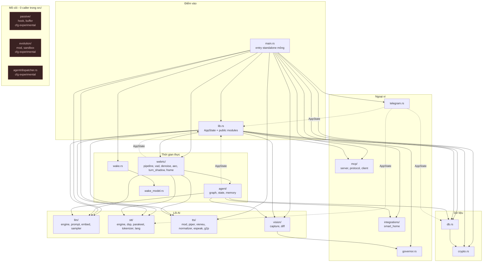

# Phụ thuộc module và bảng tra cứu nhanh

[⬆ Mục lục](../README.md) · [◀ Tích hợp ngoài](09-tich-hop-ngoai.md) · [Cấu hình và biến môi trường ▶](../02-van-hanh/01-cau-hinh-va-bien-moi-truong.md)

---

> **Mục đích của tài liệu này.** Đây là **bản đồ tìm đường** trong mã nguồn LIVA. Khi cần biết "sửa chỗ này thì đụng vào đâu", "file nào chịu trách nhiệm gì", "hàm X nằm ở dòng nào" — mở tài liệu này trước, rồi mới mở code. Toàn bộ số dòng (LOC) và toạ độ `file.rs:123` trong đây đã được đối chiếu với code thật.
>
> **Nhãn trạng thái:** **[OK]** đang chạy thật · **[MỘT PHẦN]** có code nhưng tắt/opt-in/chưa nối dây · **[THIẾU]** chưa có/stub.

---

## 1. Sơ đồ phụ thuộc module (Rust core)

Sơ đồ dưới đây là bản đồ gốc của crate `liva-native-core`. Mũi tên liền = phụ thuộc trực tiếp (`use crate::…` hoặc lời gọi hàm). Mũi tên đứt nét ghi `AppState` = phụ thuộc ngược lên `lib.rs` chỉ để lấy kiểu `Arc<AppState>` (không phải phụ thuộc logic). Khối màu tối gạch đứt = **thành phần mồ côi, 0 caller trong `src/`**; cả ba đều mang nhãn `cfg experimental` — từ 22/07/2026 (commit `4c08f18`) chúng **không được biên dịch vào build mặc định** nữa. `mcp/client.rs` từng nằm trong khối này và đã **rời** nó ở rung G0 (25–26/07/2026): nay có 7 call site thật, xem §4.

### 1.1 Đọc sơ đồ như thế nào

- **`AppState` vẫn là hub kiểu dữ liệu, nhưng `lib.rs` không còn là god-dispatcher.** `boot.rs` dựng state/dịch vụ dùng chung; `commands/*` sở hữu 11 miền lệnh; `paths.rs` resolve tài nguyên/model; `system_status.rs` đo health; `websocket.rs` vận chuyển. Sửa `AppState` vẫn có blast radius rộng, còn thêm một command phải sửa đúng miền + authorization thay vì nhét vào `lib.rs`.
- **`stt`, `llm`, `tts` là lá thuần** — không `use crate::` gì cả. Đây là ba module an toàn nhất để refactor nội bộ: blast radius chỉ nằm ở biên API công khai của chúng.
- **`db.rs → crypto.rs` là cạnh dữ liệu duy nhất.** Mã hoá chỉ áp cho `facts.value`.
- **`vision → governor`**: `vision/capture.rs` hỏi governor xem có đang ở game mode không trước khi chụp màn hình.
- **Không có chu trình import.** `gitnexus check --cycles` → *"No circular imports found."*
- **Ba thành phần mồ côi còn lại tổng 1 338 dòng ≈ 4,4% crate**, và **cả ba đều đã ra khỏi build mặc định** từ 22/07/2026 — xem §4. `mcp/client.rs` rời danh sách này 25–26/07/2026 (rung G0).

### 1.2 Vì sao code chết từng compile sạch — và điều gì đã đổi

Bối cảnh cũ: `liva-native-core/src/lib.rs:1` từng có `#![allow(dead_code, unused_imports, unused_variables)]` ở cấp crate, nên trình biên dịch không hề cảnh báo về hơn 1.400 dòng không ai gọi — đó là lý do kỹ thuật khiến khối mồ côi tồn tại lâu mà không lộ ra.

Trạng thái hiện tại, đo trực tiếp trên cây mã:

1. **`#![allow(...)]` cấp crate ở `lib.rs` đã bị gỡ.** Dòng đầu `src/lib.rs` nay là `pub mod crypto;`. Thư viện không còn tấm khiên toàn cục nào.
2. **Còn 8 file khai báo `#![allow(...)]` cấp file**: `main.rs:1` (`dead_code, unused_imports, unused_variables` — đây là crate root của binary, không phải của lib) và 7 file `#![allow(dead_code)]` ở `stt/mod.rs`, `stt/tokenizer.rs`, `stt/dsp.rs`, `stt/parakeet.rs`, `tts/engine.rs`, `tts/tokenizer.rs`, `tts/audio.rs`. Thêm 3 chỗ `#[allow(dead_code)]` cấp item (`stt/tokenizer.rs:86`, `tts/audio.rs:88`, `llm/sampler.rs:18`).
3. **1 338 dòng không còn được biên dịch chút nào** (22/07/2026, commit `4c08f18`; số dòng đo lại 26/07/2026): `passive/` 688 + `evolution/` 453 + `agent/dispatcher.rs` 197 nằm sau `#[cfg(feature = "experimental")]` (`src/lib.rs:5,13`, `src/agent/mod.rs:1`). Với chúng, câu hỏi "vì sao compile sạch" không còn nghĩa — **chúng không vào cây biên dịch mặc định**. Bù lại, CI chạy `cargo check --all-targets --features experimental` (`.github/workflows/test.yml:78-80`) để code khỏi mục nát.

⇒ Kết luận thực dụng cho người sửa code: `cargo build` sạch **vẫn** chưa chứng minh code đang được dùng (7 file `stt`/`tts` vẫn che), nhưng lý do "cả crate bị `allow` che" đã hết hiệu lực.

> 📌 Nguồn đầy đủ (bảng nối dây từng module, 33 hàm `pub` 0 caller): [Nợ kỹ thuật và rủi ro](../03-danh-gia/02-no-ky-thuat-va-rui-ro.md)

---

## 2. Bảng module — LOC, trách nhiệm, phụ thuộc, người gọi

Số dòng đếm trên toàn bộ `*.rs` của module (kể cả test nội tuyến), **không kể `src/bin/`** (17 binary phụ trợ, 2 551 dòng). Số đo lại ngày 26/07/2026 trên cây mã hiện tại; tổng cộng **30 530 dòng** `.rs` trong `src/` ngoài `src/bin/`. (Con số 18 687 trong các bản trước là của 22/07/2026 — crate đã lớn lên đáng kể, nên **mọi tỉ lệ phần trăm tính theo mẫu số cũ đều sai**; các dòng LOC từng module dưới đây chưa được đo lại đồng loạt, chỉ những dòng có ghi ngày mới là đã kiểm.)

| Module | Số dòng | Trách nhiệm | Phụ thuộc vào | Được gọi bởi | Trạng thái |
|---|---:|---|---|---|---|
| `main.rs` | — | Điểm vào standalone mỏng: xử lý `--preflight`/`--setup-models`, rồi gọi composition root | `boot`, `preflight`, `setup_cli` | — | [OK] |
| `lib.rs` | — | `AppState`, public module surface và re-export contract | `boot`, `commands`, `paths`, `system_status` cùng subsystem | `main.rs`, Tauri, pipeline/agent/Telegram | [OK] |
| `commands/` | — | Dispatcher 77 lệnh/11 miền; mỗi miền có `owns` + `handle` | `authorization`, các subsystem | WebSocket và Tauri native IPC | [OK] |
| `boot.rs` | — | Composition root dùng chung, autoload model, dịch vụ nền và GPU auto-select | `paths`, DB, model, governor | standalone + Tauri | [OK] |
| `paths.rs` / `system_status.rs` / `preflight.rs` | — | Resolve path, health đo thật, báo cáo tài nguyên dùng chung CLI/UI | config/model/governor | commands + UI | [OK] |
| `tts/` | 3 861 | Định tuyến VieNeu → Piper → Kokoro, chuẩn hoá tiếng Việt, G2P, phát audio | `tts::espeak` | `lib.rs`, `main.rs`, `webrtc/pipeline` | [OK] |
| `llm/` | 1 623 | Nạp/hoán GGUF, sinh token, prefix-cache KV, sliding window, vision, prompt, persona | — | `lib.rs`, `main.rs`, `agent/graph`, `webrtc/pipeline` | [OK] |
| `webrtc/` | 1 548 | VAD, GTCRN, AEC3, Smart Turn, actor STT→LLM→TTS, codec khung | `lib` (AppState), `agent`, `llm`, `tts`, `stt` | `main.rs`, `lib.rs` | [MỘT PHẦN] |
| `vision/` | 1 542 | Chụp WGC qua `xcap`, crop theo con trỏ, so khung hình | `governor` | `lib.rs`, `main.rs`, `agent/graph` | [OK] |
| `stt/` | 1 346 | Nemotron RNN-T streaming + Parakeet CTC vi, mel-spectrogram, BPE | — | `lib.rs`, `main.rs`, `webrtc/*`, `telegram` | [OK] |
| `db.rs` | 1 276 | Pool SQLite writer/reader, WAL, schema, tìm kiếm lai | `crypto` | `lib.rs`, `main.rs`, `agent/memory`, `telegram` | [OK] |
| `agent/` | 1 097 | `AgentState`, `StateGraph`, checkpointer, swarm dispatcher | `lib`, `llm`, `vision`, `integrations`, `db` | `webrtc/pipeline` (chỉ `graph`/`state`/`memory`) | [MỘT PHẦN] — `dispatcher.rs` (187) **ngoài build mặc định** |
| `passive/` | 647 | Hook bàn phím/cửa sổ + buffer sự kiện | — | **Không ai** | **[THIẾU]** — **ngoài build mặc định** (`cfg experimental`) |
| `governor.rs` | 541 | Phát hiện game fullscreen, đọc tải CPU thật, hạ ưu tiên tiến trình | — | `main.rs`, `vision/capture`, Tauri | [OK] |
| `telegram.rs` | 531 | Bot teloxide 9 lệnh, voice → ffmpeg → STT | `lib` (AppState) | `main.rs` | [MỘT PHẦN] |
| `evolution/` | 428 | Vòng tự sửa lỗi + sandbox `cargo test` | — | **Không ai** (chỉ tests) | **[THIẾU]** — **ngoài build mặc định** (`cfg experimental`) |
| `mcp/` | — | `NativeMcpServer` (7 tool nội bộ, gồm weather), struct JSON-RPC, MCP client stdio | `mcp::protocol`, `integrations::{smart_home, os_control, weather}` | `commands/*`, `llm/tool_calling.rs` | [OK] |
| `wake_model.rs` | 334 | Wake-word ONNX 3 tầng (melspec → embedding → classifier) | — | `wake.rs` | [MỘT PHẦN] |
| `wake.rs` | 331 | `WakeGate` 4 chế độ, cửa sổ tỉnh | `wake_model` | `main.rs` | [MỘT PHẦN] |
| `crypto.rs` | 133 | `EncryptionEngine` AES-256-GCM (chỉ `facts.value`) | — | `db.rs`, `lib.rs`, `main.rs` | [OK] |
| `integrations/` | — | Smart-home placeholder, OS control thật, weather + geolocation coarse opt-in | network/Windows API tuỳ tool | MCP/tool calling/commands | **[MỘT PHẦN]** |

> **`prng.rs` và `webrtc/signaling.rs` không còn trong bảng vì đã bị XOÁ khỏi repo** (mục 3.1 của đợt dọn dẹp tháng 7/2026): `prng.rs` 70 dòng và `webrtc/signaling.rs` 63 dòng, cả hai đều 0 caller. Đừng đi tìm chúng nữa.
>
> **Ba module mang nhãn "ngoài build mặc định"** (`passive/`, `evolution/`, `agent/dispatcher.rs` — 1 262 dòng) nằm sau `#[cfg(feature = "experimental")]` từ 22/07/2026 (commit `4c08f18`). Code vẫn ở trong repo, nhưng `cargo build`/`cargo test` thường **không dịch chúng**; dùng `cargo build --features experimental` để bật lại.

**Cấu trúc đồ thị:** snapshot `gitnexus check --cycles` trả *"No circular imports found."*. Sau hai lát tách `98efc55` và `2dc8e2e`, hub vận hành đã chia sang `boot`/`commands`/`paths`/`system_status`; `AppState` vẫn là điểm nối kiểu dữ liệu. Chi tiết code experimental xem §1.1–§1.2.

### 2.1 Hai điểm nghẽn kiến trúc cần nhớ trước khi sửa

Cả hai đều xuất phát từ `AppState` (`liva-native-core/src/lib.rs:33-46`):

1. **`state.llm` là một `Mutex` duy nhất** dùng chung cho chat + embed + vision + `swap_model`. Một lượt sinh token (blocking) khoá luôn mọi lệnh LLM khác. Bất kỳ tính năng nào cần LLM song song đều vướng chỗ này.
2. **Engine audio là toàn cục, không per-session.** `vad`/`denoiser`/`aec`/`turn_shadow` mang state hồi quy theo dòng chảy (LSTM của Silero, `conv/tra/inter_cache` của GTCRN, `render_queue` của AEC). Hai client WS đồng thời sẽ **trộn stream vào cùng state**; không có code phân vùng theo session. Ngoài ra `VadEngine::reset()` (`webrtc/vad.rs:123`) và `GtcrnDenoiser::reset()` (`webrtc/denoise.rs:101`) **không bao giờ được gọi ở đường chạy thật** (grep chỉ ra trong test).

Toàn bộ `AppState` dùng `tokio::sync::Mutex`, **không có `RwLock` nào**. `db` không bọc mutex vì `DatabasePool` tách sẵn `writer` (`max_size(1)`) và `readers` (`max_size(4)`, `SQLITE_OPEN_READ_ONLY`) — `db.rs:131-157`.

> 📌 Nguồn đầy đủ về hành vi và ngưỡng của `vad`/`denoise`/`aec`/`turn_shadow`: [Đường ống thoại (voice pipeline)](03-duong-ong-thoai.md) · Xếp hạng rủi ro của hai điểm nghẽn này: [Nợ kỹ thuật và rủi ro](../03-danh-gia/02-no-ky-thuat-va-rui-ro.md)

---

## 3. Bảng tra cứu nhanh file quan trọng

Quy ước rút gọn đường dẫn trong các bảng dưới:

| Ký hiệu | Đường dẫn đầy đủ |
|---|---|
| `…\src\` (§3.2 – §3.4) | `E:\Project\LIVA\liva-native-core\src\` |
| `…\liva-ui\` (§3.5) | `E:\Project\LIVA\liva-ui\` |
| `…\packages\` (§3.5) | `E:\Project\LIVA\packages\` |

### 3.1 Điểm vào và điều phối

| Đường dẫn tuyệt đối | Vai trò | Dòng chốt |
|---|---|---|
| `E:\Project\LIVA\liva-native-core\src\main.rs` | Entry standalone + cờ CLI sớm | `main`; phần runtime dùng chung ở `boot::build_app_state`/`spawn_background_services` |
| `E:\Project\LIVA\liva-native-core\src\lib.rs` | `AppState` + public surface | `AppState`; dispatcher ở `commands::handle`, path ở `paths`, health ở `system_status` |
| `E:\Project\LIVA\liva-desktop\src-tauri\src\lib.rs` | Vỏ Tauri (577 dòng) | `get_stronghold_credentials` :123 · `read_vault_key` :151 · `native_ipc_call` :228 · `run()` :261 · **`AppState` với `None`** :355-368 · `gateway-ready` :461 · hit-test :468 |
| `E:\Project\LIVA\scripts\start_all.ps1` | Khởi động dev (91 dòng) | kill port :24-35 · vite :56 · `tauri dev` :66 |

### 3.2 Lõi AI

| Đường dẫn | Vai trò | Dòng chốt |
|---|---|---|
| `…\src\llm\engine.rs` | LLM engine (573 dòng) | `get_backend` :27 · `LlamaEngine` :34 · `prune_kv_cache` :69 · `swap_model` :117 · auto-detect ChatML :149 · transmute :192 · prefix-cache :232 · **`answer_with_image`** :353 · **chặn debug** :371-377 |
| `…\src\llm\prompt\mod.rs` | Biên dịch prompt | `compile_prompt` :22 · `compile_gemma_prompt` :57 · `compile_chatml_prompt` :159 · test injection :328 |
| `…\src\llm\prompt\persona.rs` | Persona + sanitize | `TEMP_DEFAULT` :9 · `PERSONA_LIVA` :16 · `SYS_TASK_PLANNER` :35 · `FORBIDDEN_SEQUENCES` :46 · `sanitize_untrusted` :70 |
| `…\src\llm\sampler.rs` | Sampler chain (21 dòng) | `create_sampler` :1 · `create_greedy_sampler` (chết) :19 |
| `…\src\llm\embed.rs` | Embedding (49 dòng) | `get_embedding` :5 · `clear_kv_cache()` :10 |
| `…\src\stt\engine.rs` | Nemotron RNN-T (283 dòng) | `SttEngine` :4 · `new` :25 · `reset_states` :91 · `run_chunk` :137 · greedy decode :194 |
| `…\src\stt\mod.rs` | `SttManager` (283 dòng) | `should_use_parakeet` :98 · `ensure_parakeet_loaded` :108 · `set_language` :140 · `feed_audio` :174 · `transcribe_for_wake` :184 · `feed_audio_inner` :188 · sliding window :238 |
| `…\src\stt\dsp.rs` | Mel-spectrogram (202 dòng) | `compute_mel_filterbank` :32 · `SttDsp::new` :77 · `compute_log_mel_spectrogram` :108 |
| `…\src\stt\parakeet.rs` | Parakeet CTC (386 dòng) | hằng số :27 · `ParakeetDsp` :70 · `load` :159 · `transcribe` :209 · `ctc_decode` :245 |
| `…\src\stt\lang.rs` | Bảng lang_id (70 dòng) | `VERIFIED_LANG_IDS` :20 · `lang_id_for` :34 |
| `…\src\tts\mod.rs` | `TtsManager` (471 dòng) | `TtsChunker::push` :32 · `is_vietnamese_text` :101 · `load_vieneu` :156 · `load_piper_voices` :194 · `piper_for_chunk` :264 · `from_wav` (chết) :305 · **`process_chunk`** :354 |
| `…\src\tts\normalizer.rs` | Chuẩn hoá tiếng Việt (986 dòng) | doc bug Python :6-19 · `read_group3` :60 · `read_u64` :108 · `expand_dates` :389 · `expand_times` :435 · `normalize` :657 · `normalize_vi` :668 |
| `…\src\tts\piper.rs` | Piper VITS (185 dòng) | scales :59 · `phoneme_ids` :135 · strip lang-switch :150 |
| `…\src\tts\vieneu\mod.rs` | VieNeu (724 dòng) | doc :1-21 · `Cfg` :43 · `load` :112 · `synthesize` :255 · `embed_rows` :376 · `acoustic_frame` :407 · **ort 0-dim** :421-427 · `decode_codes` :501 · `sample` :582 |
| `…\src\tts\audio.rs` | Phát audio + fade (121 dòng) | `play` :24 · `play_with_rate` :30 · **`stop`** :41-82 |
| `…\src\tts\espeak.rs` | Shell espeak-ng (59 dòng) | `resolve_espeak` :11 · `espeak_ipa` :44 |
| `…\src\vision\capture.rs` | Chụp WGC (≈250 dòng) | `cursor_position` :56 · `region_rgb` :85 · **`capture_for_vision`** :118-146 · `ScreenCapturer` :148 · `NativeScreenCapturer` :161 · `capture` :197 |
| `…\src\vision\diff.rs` | So khung hình | `ScreenRegion` :51 · `find_changes` :112 · `find_changes_u32` :216 · `has_pixel_changed` :240 · `diff_region` :258 |

### 3.3 Thời gian thực và agent

| Đường dẫn | Vai trò | Dòng chốt |
|---|---|---|
| `…\src\webrtc\frame.rs` | Codec khung (54 dòng) | op codes :3-7 · `VoiceFrame` :10 · `encode` :17 · `decode` :29 |
| `…\src\webrtc\pipeline.rs` | Actor duplex (474 dòng) | `PipelineState` :8 · `PipelineEvent` :19 · **`feed_rtp_pcm` TODO** :72 · `new` :98 · `run` :127 · `transition_to` :157 · `handle_vad_start` :164 · `handle_vad_end` :170 · `spawn_llm_and_tts` :232 · checkpoint :246-295 · TTS chunk :301-405 · **`cancel_active_operations`** :437 |
| `…\src\webrtc\vad.rs` | Silero VAD (213 dòng) | `VadEvent` :5 · `VadConfig` :11 · `from_env` :35 · `resolve_model_path` :62 · `new` :98 · `process_audio` :133 · `update_state_machine` :185 |
| `…\src\webrtc\denoise.rs` | GTCRN (≈280 dòng) | hằng số :16-22 · `resolve_model_path` :26 · `new` :63 · `reset` (không gọi) :101 · `process_audio` :114 · `run_frame` :152 |
| `…\src\webrtc\aec.rs` | AEC3 sonora | `FRAME_SIZE` :18 · `new` :27 · `push_render` :49 · `process_capture` :72 |
| `…\src\webrtc\turn_shadow.rs` | Smart Turn shadow | doc vi 81% :4-7 · `N_SAMPLES` :34 · `new` :77 · `predict` :107 · `log_mel_features` :131 |
| `…\src\agent\graph.rs` | StateGraph (289 dòng) | `StateGraph` :13 · `add_edge` (không dùng) :40 · `run` :48 · `build_pipeline_graph` :74 · **router keyword** :95-123 · `tool_exec` :129 · `chat_completion` :151 · `vision` :220 |
| `…\src\agent\state.rs` | `AgentState` (10 dòng) | struct :6 |
| `…\src\agent\memory.rs` | Checkpointer (56 dòng) | `save_checkpoint` :14 · `load_checkpoint` :34 |
| `…\src\agent\dispatcher.rs` | **MỒ CÔI + NGOÀI BUILD MẶC ĐỊNH** (187 dòng, gate ở `agent\mod.rs:4-5`) | `AgentRole` :8 · stub logic :116-136 · timeout 5 s :177 |
| `…\src\wake.rs` | WakeGate (331 dòng) | `WakeMode` :34 · `from_env` :57 · `check_streaming` :134 · `is_awake` :162 · `try_wake` :185 · `normalize_for_match` :203 |
| `…\src\wake_model.rs` | 3 model ONNX (334 dòng) | doc cấm crate :1-35 · hằng số :40-49 · `resolve_bundled_model` :51 · `new` :157 · `push_and_check` :186 · `predict_raw` :220 |
| `…\src\governor.rs` | Game-aware (221 dòng) | `GovernorMode` :21 · `CHECK_INTERVAL` :52 · `from_env` :55 · `game_mode_active` :73 · `apply_priority` :94 · `game_mode_active_now` :116 · **`foreground_is_fullscreen`** :124 · `set_process_below_normal` :180 |
| `…\src\passive\hook.rs` | **MỒ CÔI + NGOÀI BUILD MẶC ĐỊNH** keylogger (328 dòng, gate ở `lib.rs:12-13`) | `RawEvent` :5 · `vk_to_char` :32 · `get_active_window_info` :83 · `start_os_hook` :216 · `stop_os_hook` :265 (bản `#[cfg(not(windows))]`: `:293`, `:298`) |

### 3.4 Dữ liệu, bảo mật, tích hợp

| Đường dẫn | Vai trò | Dòng chốt |
|---|---|---|
| `…\src\db.rs` | SQLite (1 185 dòng) | `CustomSqliteManager` :15 · PRAGMA :30-48 · **`load_sqlite_vec`** :63 · `DatabasePool` :131 · `new` :137 · `new_in_memory` :159 · **`init_schemas`** :188-354 · `MetadataFilter` :377 · `set_fact` :467 · `get_fact` :501 · `upsert_vector` :536 · `search_similar_vectors` :626 · `search_fts_vectors` :720 · **`search_hybrid_vectors`** :839 |
| `…\src\crypto.rs` | AES-256-GCM (133 dòng) | `Aes256Gcm16` :8 · **`new` không KDF** :15 · `encrypt` :23 · **`decrypt` fail-open** :50 |
| `…\src\telegram.rs` | Bot (392 dòng) | `TelegramCommand` :8 · `new` :39 · `start` :54 · `is_authorized` :73 · `handle_command` :82 · `/latest` :145 · `/ls` :175 · `/cat` :218 · `handle_message` :274 · `process_voice_message` :317 · **`route_input_to_agent` đứt dây** :376 |
| `…\src\mcp\server.rs` | MCP (183 dòng) | args struct :10-30 · `new` :33 · `list_tools` :39 (gọi từ `liva-native-core/src/lib.rs#handle_command`) · **`resolve_path`** :67 · `call_tool` :79 (gọi từ `liva-native-core/src/lib.rs#handle_command`) · `walk_dir` :121 · `control_smarthome` stub :176 |
| `…\src\mcp\client.rs` | MCP client stdio (1 143 dòng) | `McpStdioClient::connect` · `request` · `list_tools` · `call_tool` · `McpClientRegistry::get_or_connect` · `global_registry` · `load_config` |
| `…\src\mcp\protocol.rs` | JSON-RPC (106 dòng) | `JsonRpcRequest` (id: String) :5 · `Tool` :72 · `CallToolRequest` :86 |
| `…\src\integrations\smart_home.rs` | **STUB** (107 dòng) | enum :6,14 · `SmartHomeArgs` :21 · `get_metadata` :26 · `execute` :51 |
| `…\src\evolution\mod.rs` | **MỒ CÔI + NGOÀI BUILD MẶC ĐỊNH** (295 dòng, gate ở `lib.rs:14-15`) | `trait CodeAgent` :6 · `BackupGuard` :52 · `new` (retries=3) :93-96 · `run` :104 · `extract_error` :165 · `MockCodeAgent` :206 |
| `…\src\evolution\sandbox.rs` | **KHÔNG cô lập**, ngoài build mặc định (133 dòng) | `run_tests` :42 · fallback Windows :57 · timeout 30 s :105 · taskkill :119 |

### 3.5 Frontend

| Đường dẫn | Vai trò | Dòng chốt |
|---|---|---|
| `E:\Project\LIVA\liva-ui\vite.config.ts` | Build 2 entry | `base` :12 · `external` :17 · **`input`** :18-21 · `manualChunks` :23-39 |
| `…\liva-ui\src\composables\useGateway.ts` | Cầu IPC/WS (607 dòng) | state singleton :18-140 · `mapTauriResponse` :143 · **`isTauri`** :210 · `sendMsg` :213 · `connect` :274 · `onmessage` :334 · `vision:ask_response` :432 · `useGateway()` :472 · `askVision` :512 |
| `…\liva-ui\src\composables\useVoicePipeline.ts` | Mic + wake (≈580 dòng) | interface :5-26 · worker init :45 · Web Speech :136-227 · timeout :271 · `startPipeline` :281 · **`createScriptProcessor`** :322 · **khung mic sai** :345-350 · `monitorVolume` :406 · pre-warm :568 |
| `…\liva-ui\src\composables\useSpeakerPlayback.ts` | Phát PCM gapless | options :18-31 · overlap :63 · `useSpeakerPlayback` :65 · `queueEpoch` :77 · `scheduleBuffer` :111 · `enqueueSpeakerPayload` :133 · **`stop`** :180 · **`flush`** :207 · `setMasterVolume` :215 |
| `…\liva-ui\src\utils\speakerFrame.ts` | Parse khung | `VOICE_FRAME_HEADER_SIZE` :1 · `parseSpeakerPayload` :36 · validate :41-48 · alignment :52-63 |
| `…\liva-ui\src\workers\LivaWakeWorker.ts` | Wake MLP-RMS (333 dòng) | import weights :19 · `DEFAULT_CONFIG` :41 · `loadModel` (không ONNX) :64 · `extractFeatures` :92 · `runInference` :132 · sliding window :179 |
| `…\liva-ui\src\composables\use3DModel.ts` | Avatar 3D | interface :122-142 · `use3DModel` :178 · `debugProbe` :253 · throttle :494 · gate `vrm.value` :513 · idle sway :565 · blink :603 · procedural lipsync :677 · **`startAudioDrivenLipSync`** :760 · `updateAudioLipSync` :789 · `triggerMotion` :914 · lookAt :978 · Deep Dispose :1074 |
| `…\liva-ui\src\composables\useFaceTracking.ts` | MediaPipe | `estimateHeadPose` :87 · `extractExpressions` :130 · `useFaceTracking` :183 · init :204-213 · `captureFrame` :353 |
| `…\liva-ui\src\WidgetApp.vue` | Cửa sổ widget | `DEFAULT_WIDGET_MODEL` · `resolveEngineFromConfig` · `applyWidgetConfig` · wake worker · speaker · `updateInteractiveZones` · `openDashboard` · **`forced-3d-bootstrap`** · stream. ⚠️ **Số dòng đã gỡ và ba mục đã CHUYỂN FILE** (07/08/2026, mục A31-04): WebSocket thô, khung nhị phân và `OP_FLUSH` nay ở `composables/useWidgetTransport.ts`; điều khiển avatar ở `composables/useWidgetAvatarControl.ts`; hình dạng gói tin ở `types/gateway.ts`. Tìm theo tên symbol, đừng tìm theo số dòng |
| `…\liva-ui\src\utils\HardwareDetector.ts` | Chọn engine avatar | `isIntegratedGPU` :48 · `cleanGPUName` :66 · `profileHardware` :90 · `detectOptimalEngine` :137 |
| `…\packages\liva-common\src\types\websocket.ts` | Hợp đồng protocol | `WSClientEvent` :10-56 · `WSServerEvent` :59-101 · `WSMessage` :104 |

### 3.6 Cấu hình và tài liệu

| Đường dẫn | Vai trò |
|---|---|
| `E:\Project\LIVA\Cargo.toml` | Workspace, `[profile.dev.package.llama-cpp-2] opt-level = 3` |
| `E:\Project\LIVA\liva-native-core\Cargo.toml` | Deps + `[features]` :64-78 (`default = []` :65, **`experimental = []` :75**, `cuda` :76, `vulkan` :77, `openblas` :78) + 14 `[[bin]]` :80-148 |
| `E:\Project\LIVA\liva-desktop\src-tauri\Cargo.toml` | Tauri deps + forward features :20-26 |
| `E:\Project\LIVA\liva-desktop\src-tauri\tauri.conf.json` | 2 cửa sổ :14-42 · **CSP** :45 · bundle :48-58 |
| `E:\Project\LIVA\liva-desktop\src-tauri\capabilities\widget.json` | ACL cửa sổ widget |
| `E:\Project\LIVA\liva-desktop\src-tauri\capabilities\dashboard.json` | ACL cửa sổ dashboard |
| `E:\Project\LIVA\liva-desktop\src-tauri\capabilities\setup.json` | ACL cửa sổ setup |
| `E:\Project\LIVA\data\liva-config.json` | **SSOT runtime** — `ai.routerModel` :19, `ai.mmprojModel` :20 |
| `models/README.md` | **Nguồn tin cậy cao nhất** về model & env flags |
| `.env.example` | Tài liệu env (lệch code ở ≥6 chỗ) |
| `AGENTS.md` | Quy ước bắt buộc (git boundary, GitNexus, lint) |
| `.github/workflows/test.yml` | CI duy nhất (96 dòng, windows-latest). Chuỗi gate: `fetch-depth: 0` :22 → **docs-check** :33-34 → `npm ci` :37 → **cache Cargo** :42-51 → LLVM :53-54 → **tsc --noEmit** :59-61 → **ESLint --max-warnings 0** :63-65 → vitest :67-68 → `cargo test` :70-72 → **`cargo check --all-targets --features experimental`** :78-80 → clippy non-blocking :92-95 |
| `.husky/pre-commit`, `.lintstagedrc.json`, `scripts/ai-pre-commit.cjs` | Chuỗi pre-commit |
| [`docs/99-luu-tru/bao-cao-lich-su/LIVA_Acceptance_Report_2026.md`](../99-luu-tru/bao-cao-lich-su/LIVA_Acceptance_Report_2026.md) | **Nguồn KPI** — đã chuyển vào lưu trữ 21/07/2026 (`docs/reports/` không còn tồn tại). Đọc như tư liệu lịch sử |
| [`docs/99-luu-tru/bao-cao-lich-su/LIVA_OSS_Research_2026-07.md`](../99-luu-tru/bao-cao-lich-su/LIVA_OSS_Research_2026-07.md) | **Số liệu voice** (2026-07-04) — cũng đã vào lưu trữ, không còn là "mới nhất" |
| `.gitnexus/meta.json` | Chỉ mục: 6.582 node / 13.220 cạnh / 300 process |

> **Lưu ý đường dẫn:** hai báo cáo `docs\reports\…` ở bảng trên là vị trí tại thời điểm khảo sát. Sau đợt tái cấu trúc thư mục `docs/`, chúng nằm ở `docs\99-luu-tru\bao-cao-lich-su\LIVA_Acceptance_Report_2026.md` và `docs\99-luu-tru\bao-cao-lich-su\LIVA_OSS_Research_2026-07.md`.

---

## 4. Ba thành phần mồ côi còn lại — vị trí trên bản đồ module

Danh sách khảo sát ban đầu có **sáu** thành phần 0 call-site, tổng 1 415 dòng. Ba đợt thay đổi đã đổi bức tranh đó:

- **Xoá hẳn khỏi repo** (mục 3.1): `prng.rs` (70 dòng) và `webrtc/signaling.rs` (63 dòng) — tổng 133 dòng. Hai file này **không còn tồn tại**; mọi toạ độ cũ trỏ tới chúng đều vô nghĩa.
- **Giữ code nhưng loại khỏi build mặc định** (mục 3.2, commit `4c08f18`, 22/07/2026): `passive/`, `evolution/`, `agent/dispatcher.rs` — nay nằm sau `#[cfg(feature = "experimental")]` (`src/lib.rs:5,13`, `src/agent/mod.rs:1`).
- **`mcp/client.rs` RỜI danh sách mồ côi** (25–26/07/2026, rung G0 — xem [Đề xuất tích hợp OpenSpace](../03-danh-gia/04-de-xuat-tich-hop-openspace.md) §3): nó không còn là `ProcessWrapper` 49 dòng mà là `McpStdioClient` + `McpClientRegistry`, **1 143 dòng**, có **7 call site thật** ngoài chính nó — ba lệnh `mcp_client:*` trong lớp điều phối lệnh, và `llm/tool_calling.rs` (vòng tool-calling G1). *(Toạ độ dòng cũ đã gỡ: `lib.rs` co từ ~2 770 xuống ~1 920 dòng khi `handle_command` được tách sang `src/commands/`, nên mọi số dòng trỏ vào nó đều trôi.)*

Khối gạch đứt trong sơ đồ §1 vì vậy còn **ba** thành phần: `passive/` (688), `evolution/` (453), `agent/dispatcher.rs` (197) — tổng **1 338 dòng ≈ 4,4% crate** (mẫu số: 30 530 dòng `.rs` trong `src/`, không kể `src/bin/`; đo lại 26/07/2026). Cả ba đều thoả **hai** điều kiện: 0 call-site **và** ngoài build mặc định — nên không còn thành phần nào chỉ thoả điều kiện thứ nhất.

Tỉ lệ tụt từ 7,0% xuống 4,4% vì **hai** lý do độc lập, đừng đọc thành một: `client.rs` rời danh sách, **và** crate lớn lên từ 18 687 lên 30 530 dòng.

Ngoài ra còn code chết rải rác ở tầng khác (`mcp/protocol.rs` phần `JsonRpc*`, `tts/g2p.rs` + `tts/tokenizer.rs`, `liva-ui/src/workers/audio-worker.ts`). *(`liva-ui/src/composables/useVRM.ts` đã **rời danh sách bằng cách bị xoá** ngày 06/08/2026 — xem [U25](../03-danh-gia/05-nang-cap-toan-dien.md#u25--usevrmts-là-code-mồ-côi-và-nó-đã-làm-người-rà-kết-luận-sai). Năm hàm thuần của nó chuyển sang `liva-ui/src/utils/avatarMath.ts`, nơi `use3DModel.ts` nhập vào — trước đó hai file có bản sao giống nhau từng byte và bộ test kiểm nhầm bản mồ côi.)*

Với tài liệu này, ý nghĩa của danh sách trên là **hai tầng**:

1. **Gặp file mang nhãn MỒ CÔI ở §3 thì đừng suy ra rằng sửa nó sẽ thay đổi hành vi runtime** — không có đường gọi nào dẫn tới đó.
2. **Gặp thêm nhãn NGOÀI BUILD MẶC ĐỊNH thì sửa nó còn không được biên dịch** — `cargo build`/`cargo test` sẽ không báo lỗi cú pháp trong đó. Muốn thấy compiler nói gì: `cargo check --all-targets --features experimental` (đúng lệnh CI chạy ở `.github/workflows/test.yml:78-80`).

> 📌 Nguồn đầy đủ (bảng nối dây từng module, 33 hàm `pub` 0 caller, danh sách TODO/`unimplemented!`, quyết định xoá hay nối dây): [Nợ kỹ thuật và rủi ro](../03-danh-gia/02-no-ky-thuat-va-rui-ro.md)

---

## 5. Tra cứu theo tình huống — "tôi cần sửa X thì mở file nào?"

Bảng dẫn đường ngược, tổng hợp từ các bảng trên.

| Tôi muốn… | Mở trước | Rồi tới |
|---|---|---|
| Thêm một lệnh API mới | miền phù hợp trong `commands/*` (`OWNED` + `handle`) | `authorization.rs` + transport/client tương ứng; test giữ catalog không lệch |
| Sửa hành vi khởi động / thứ tự nạp model | `boot.rs#build_app_state` / `spawn_background_services` | standalone và Tauri cùng gọi composition root; khác biệt vỏ nằm ở adapter/capability |
| Đổi khung nhị phân voice (op code, header) | `webrtc\frame.rs:3-7`, `:17`, `:29` | `liva-ui\src\utils\speakerFrame.ts:36`, `liva-ui\src\composables\useVoicePipeline.ts:345-350` |
| Sửa độ trễ / ngắt lời / barge-in | `webrtc\pipeline.rs:164` (`handle_vad_start`), `:437` (`cancel_active_operations`) | `webrtc\vad.rs:133`, `liva-ui\src\composables\useSpeakerPlayback.ts:180` (`stop`), `:207` (`flush`) |
| Sửa chất lượng tiếng Việt của TTS | `tts\normalizer.rs:657` (`normalize`), `:668` (`normalize_vi`) | `tts\mod.rs:354` (`process_chunk`), `tts\vieneu\mod.rs:255` (`synthesize`) |
| Đổi model LLM hoặc số layer GPU | `data\liva-config.json` + `data\models-manifest.json` | `paths.rs` resolver · `boot.rs#gpu_layers_mac_dinh`/autoload · `reload_llm_gpu_layers` |
| Sửa prompt / persona | `llm\prompt\persona.rs:16` (`PERSONA_LIVA`), `:35` (`SYS_TASK_PLANNER`) | `llm\prompt\mod.rs:22` (`compile_prompt`), `:159` (ChatML) |
| Thêm trường vào bộ nhớ / schema DB | `db.rs:188-354` (`init_schemas`) | `db.rs:467` (`set_fact`), `:839` (`search_hybrid_vectors`), `crypto.rs:23` |
| Thêm skill / tool cho agent | `integrations\smart_home.rs:26` (`get_metadata`), `:51` (`execute` — stub) | `agent\graph.rs:129` (`tool_exec`), `mcp\server.rs:79` (`call_tool`) |
| Sửa hành vi khi đang chơi game / máy nặng tải | `governor.rs:55` (`from_env`), `:124` (`foreground_is_fullscreen`) | `main.rs:268-293` (vòng GPU downshift), `vision\capture.rs` |
| Sửa avatar 3D / lipsync | `liva-ui\src\composables\use3DModel.ts:760` (`startAudioDrivenLipSync`) | `liva-ui\src\WidgetApp.vue:625-630`, `liva-ui\src\utils\HardwareDetector.ts:137` |
| Sửa wake word | `wake.rs:57` (`from_env`), `:185` (`try_wake`) | `wake_model.rs:186` (`push_and_check`), `liva-ui\src\workers\LivaWakeWorker.ts:132` |
| Đóng gói / cửa sổ / CSP | `liva-desktop\src-tauri\tauri.conf.json` :14-42, :45 | `capabilities\widget.json`, `capabilities\dashboard.json`, `capabilities\setup.json`, `liva-ui\vite.config.ts:18-21` |

---

## 6. Nguyên tắc an toàn khi sửa

1. **Chạy `impact({target, direction:"upstream"})` trước khi sửa bất kỳ symbol nào** (bắt buộc theo `CLAUDE.md`). Các symbol có blast radius lớn nhất theo bảng §2: `AppState`, `handle_command`, `VoiceFrame::decode`, `DatabasePool`, `TtsManager::process_chunk`, `LlamaEngine::swap_model`.
2. **Sửa module lá (`stt`, `llm`, `tts`) rẻ hơn sửa composition/dispatch (`AppState`, `boot`, `commands`).** Giữ nguyên biên API công khai và chạy impact analysis trước khi chạm hub.
3. **Đừng tin `cargo build` sạch là code đang được dùng.** `#![allow(dead_code)]` cấp crate ở `lib.rs:1` đã được gỡ, nhưng 7 file trong `stt/`+`tts/` vẫn tự che (§1.2), và 1 262 dòng `cfg experimental` thì **không hề được biên dịch**. Kiểm bằng call-graph (GitNexus) chứ không bằng cảnh báo compiler.
4. **Vision cần build RELEASE.** Debug bung assert do CRT-mix (`llm\engine.rs:371-377` chặn sẵn).
5. **`models/nemotron-asr` là nested git repo có LFS**, luôn hiện "modified content" trong `git status` — đừng đụng vào.

---

## Liên quan

**Đọc tiếp theo mạch:** [⬆ Mục lục](../README.md) · [◀ Tích hợp ngoài](09-tich-hop-ngoai.md) · [Cấu hình và biến môi trường ▶](../02-van-hanh/01-cau-hinh-va-bien-moi-truong.md)

**Tài liệu này dựa vào (nguồn sự thật ở nơi khác):**

- [Nợ kỹ thuật và rủi ro](../03-danh-gia/02-no-ky-thuat-va-rui-ro.md) — bảng code mồ côi đầy đủ, hàm `pub` 0 caller, xếp hạng rủi ro của hai điểm nghẽn `AppState` (§2.1)
- [Sơ đồ kiến trúc tổng thể](01-kien-truc-tong-the.md) — hai profile chạy (standalone vs Tauri) giải thích vì sao `main.rs` và `src-tauri/src/lib.rs` khởi tạo `AppState` khác nhau
- [Giao thức IPC và WebSocket](02-giao-thuc-ipc-va-websocket.md) — bảng 42 lệnh `handle_command` và khung nhị phân 9 byte mà §3 chỉ trỏ toạ độ tới
- [Đường ống thoại (voice pipeline)](03-duong-ong-thoai.md) — ngưỡng VAD/AEC/denoise, bảng backend TTS và engine STT
- [Persistence runtime](../03-he-thong-con/persistence.md) và [Threat model](../05-chat-luong/threat-model.md) — schema v5 và mã hóa/keystore đứng sau các tọa độ `db.rs` / `crypto.rs`
- [Mô hình AI và tài nguyên](../02-van-hanh/02-mo-hinh-ai-va-tai-nguyen.md) — điều kiện tiên quyết build (CMake/LLVM, vì sao vision cần bản RELEASE)
- [Cấu hình và biến môi trường](../02-van-hanh/01-cau-hinh-va-bien-moi-truong.md) — bảng biến `LIVA_*` và các chỗ `.env.example` lệch code

**Tài liệu khác dựa vào tài liệu này:**

- [Đường ống thoại (voice pipeline)](03-duong-ong-thoai.md) — lấy LOC từng module thoại và sơ đồ phụ thuộc
- [Hệ LLM và prompt](04-he-llm-va-prompt.md) — lấy LOC và vị trí file của `llm/`
- [Tích hợp ngoài](09-tich-hop-ngoai.md) — lấy toạ độ file của `telegram.rs`, `mcp/`, `integrations/`
- [Lộ trình sửa lỗi và nâng cấp](../03-danh-gia/03-lo-trinh-sua-loi-va-nang-cap.md) — dùng bảng tra cứu §3/§5 để định vị chỗ sửa F1–F5

**Khi sửa code sau đây thì phải cập nhật tài liệu này:**

- `liva-native-core/src/lib.rs`, `main.rs` — LOC và toạ độ ở §2, §3.1; hub trung tâm trong sơ đồ §1
- `liva-native-core/src/tts/*` — LOC module lớn nhất (§2) và 6 dòng tra cứu ở §3.2
- `liva-native-core/src/webrtc/*` — §2, §3.3, và điểm nghẽn engine audio toàn cục ở §2.1
- `liva-native-core/src/vision/capture.rs` — cạnh `vision → governor` trong sơ đồ §1 và §3.2
- `liva-native-core/src/agent/dispatcher.rs`, `src/passive/hook.rs` — khối mồ côi trong sơ đồ §1 và danh sách §4
- `liva-native-core/src/mcp/client.rs` — **không còn** trong khối mồ côi từ rung G0; xem §4 và bảng §2
- `liva-native-core/src/mcp/protocol.rs` — §3.4 và phần code chết rải rác ở §4
- `liva-ui/src/workers/audio-worker.ts`, `liva-ui/src/App.vue`, `liva-ui/src/main.ts` — danh sách code mồ côi phía frontend ở §4
- `Cargo.toml` (root + `liva-native-core`) — §3.6 (profile, `[features]`, 14 `[[bin]]`)
