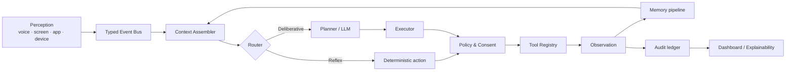

# Kiến trúc đích Cognitive Runtime

[⬆ Mục lục](../README.md) · [Tầm nhìn](../00-san-pham/tam-nhin-jarvis.md) · [Master roadmap](../06-ke-hoach/roadmap.md)

> Đây là **kiến trúc đích**, không phải mô tả rằng toàn bộ thành phần đã tồn tại.
> Trạng thái as-built nằm trong [ma trận năng lực](../_generated/ma-tran-nang-luc.md).

## 1. Vấn đề kiến trúc cần giải

LIVA đã có nhiều năng lực thật nhưng chúng đi qua các hợp đồng khác nhau:

- router từ khóa;
- LLM tool-calling;
- các nhánh `handle_command`;
- messaging confirmation;
- consent store;
- MCP server/client;
- voice `StateGraph`.

Nếu tiếp tục mở rộng từng đường riêng, cùng một hành động sẽ có nhiều cách cấp quyền,
retry và ghi nhớ khác nhau. Cognitive Runtime chuẩn hóa chúng thành một vòng:



## 2. Hợp đồng dữ liệu

### 2.1 `PerceptionEvent`

Event đầu vào có kiểu rõ ràng, thời gian, nguồn, owner scope và sensitivity:

- `VoiceUtterance`;
- `ScreenObservation`;
- `ForegroundAppChanged`;
- `TaskDue`;
- `DeviceStateChanged`;
- `UserAction`;
- `SystemPressureChanged`.

Raw payload nhạy cảm không được mặc định đi vào memory. Context assembler chỉ nhận
projection đã qua policy.

### 2.2 `ActionProposal`

Planner tạo đề xuất, không trực tiếp gọi tool. Trường tối thiểu:

- `action_id`;
- `intent`;
- `tool_id`;
- input đã validate;
- risk tier;
- lý do;
- nguồn dữ liệu;
- expected effect;
- undo hint;
- idempotency key.

### 2.3 `PolicyDecision`

Một trong bốn kết quả:

- `Allow`;
- `Confirm`;
- `Deny`;
- `Simulate`.

Decision phải mang policy rule, consent record và expiry. Không dùng câu chữ trong
prompt làm bằng chứng cấp quyền.

### 2.4 `ToolObservation`

Tool trả observation có cấu trúc:

- success/failure/unknown;
- output đã lọc;
- side effect thật;
- trạng thái đọc lại;
- retryability;
- audit metadata.

Không cho phép tool tự trả một câu “đã làm xong” mà không có bằng chứng ở adapter.

### 2.5 `MemoryCandidate`

Kết quả hội thoại hoặc observation chỉ trở thành memory candidate. Pipeline memory
quyết định:

- bỏ qua;
- lưu ngắn hạn;
- lưu semantic fact;
- đưa vào conflict queue;
- yêu cầu người dùng xác nhận.

## 3. Hai đường thực thi

### Reflex lane

Dành cho hành động cần độ trễ thấp và có luật rõ:

- wake gate;
- barge-in;
- dừng TTS;
- volume/media;
- cancel action;
- đóng confirmation.

Không gọi LLM và không nạp expert model.

### Deliberative lane

Dành cho:

- chọn tool khi nhiều công cụ gần nghĩa;
- lập kế hoạch nhiều bước;
- giải thích;
- tổng hợp memory;
- vision reasoning;
- xử lý xung đột.

Deliberative lane có budget thời gian, token, tool count và side-effect count.

## 4. Phân cấp rủi ro hành động

| Tier | Ví dụ | Chính sách mặc định |
|---|---|---|
| `ReadOnly` | đọc trạng thái, tìm memory, xem danh sách task | tự chạy nếu scope hợp lệ |
| `Reversible` | volume up/down, play/pause | tự chạy có audit và rate limit |
| `ExternalSideEffect` | gửi tin, tạo file, sửa task | xác nhận hoặc automation rule tường minh |
| `PhysicalOrIrreversible` | khóa cửa, mua hàng, xóa dữ liệu, chạy patch | xác nhận mạnh; một số loại luôn cấm tự động |

Tier được gán trong tool catalogue, không để LLM tự khai.

## 5. Ranh giới module đề xuất

```text
liva-native-core/src/cognitive/
├── events.rs
├── context.rs
├── router.rs
├── planner.rs
├── executor.rs
├── policy.rs
├── observations.rs
├── audit.rs
└── runtime.rs
```

Đây là hướng đích, không phải yêu cầu tạo toàn bộ module trong một lần. Thứ tự di trú:

1. định nghĩa kiểu dữ liệu;
2. bọc tool runtime hiện tại bằng adapter;
3. đưa messaging confirmation vào policy;
4. đưa OS/MCP tools vào cùng action contract;
5. chuyển voice graph sang phát/nhận typed events;
6. chỉ sau đó mới thêm planner nhiều bước.

## 6. Bất biến an toàn

- Không action nào vượt policy.
- Không side effect nào bị retry mù.
- Không một tool result nào tự động trở thành memory bền.
- Không sensor nào chạy trước consent.
- Không raw private reasoning đi vào UI, TTS, audit hoặc memory.
- Cancel phải lan đến planner, executor, tool và audio output.
- Hệ thống không biết trạng thái thật phải trả `unknown`.

## 7. Acceptance kiến trúc

Cognitive Runtime v1 chỉ được coi là hoàn thành khi:

1. cùng một action proposal chạy giống nhau từ voice, typed chat và remote client;
2. một external side effect luôn bị chặn nếu thiếu consent;
3. retry không tạo side effect thứ hai;
4. cancel giữa chừng dừng cả tool và output;
5. audit record đủ để tái dựng quyết định nhưng không chứa secret;
6. tool-calling tắt vẫn giữ nguyên các reflex command.
