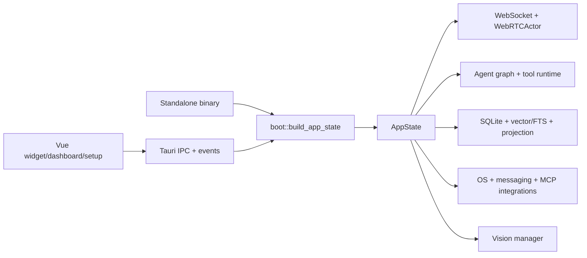

# Kiểm kê implementation LIVA theo capability

[⬆ Mục lục](../README.md) · [Ma trận năng lực](../_generated/ma-tran-nang-luc.md) · [Kiến trúc đích](cognitive-runtime.md)

## 1. Phạm vi và cách đọc

Tài liệu này trả lời câu hỏi **capability đang nằm ở module nào, đi qua entry point nào, được
kiểm chứng ở đâu và còn thiếu gì**. Trạng thái `working/partial/experimental/missing/blocked`
vẫn do `docs/_data/capabilities.json` sở hữu; tài liệu này không tạo thêm một nguồn trạng thái.

Mức bằng chứng:

| Mức | Ý nghĩa |
|---|---|
| A | Có kiểm thử đầu-cuối trên đường sản phẩm hoặc probe với runtime thật |
| B | Có unit/integration test tự động cho contract chính |
| C | Có code path nhưng chưa có acceptance test đủ mạnh |
| D | Chỉ có thiết kế/placeholder hoặc dependency còn thiếu |

## 2. Bản đồ composition root

GitNexus xác nhận `build_app_state` có hai caller trực tiếp:
`liva-native-core/src/main.rs::async_main` và `liva-desktop/src-tauri/src/lib.rs::run`.
Đây là bằng chứng cho composition root dùng chung, không phải hai backend độc lập.

## 3. Capability → module → bằng chứng

| Capability | Module/entry point chính | Đường thực thi hoặc ranh giới | Kiểm chứng hiện có | Mức | Khoảng trống quyết định trạng thái |
|---|---|---|---|:---:|---|
| `runtime.native-core` | `boot.rs::build_app_state`, `lib.rs::AppState`, Tauri `run` | Standalone/Tauri → `build_app_state` → cùng DB, model và dịch vụ nền | `integration_tests.rs`, `crypto_boot_e2e.rs` | B | Chưa có contract test chứng minh hai entry point bật đúng cùng tập dịch vụ trong mọi profile |
| `experience.voice-conversation` | `webrtc/pipeline.rs::WebRTCActor`, `websocket.rs`, `commands/voice.rs`, `useVoicePipeline.ts` | Mic → WebSocket voice frame → VAD/STT → agent/LLM → TTS → speaker epoch | `voice_runtime_components.rs`, `websocket_transport.rs`, `e2e-gateway-ci.mjs` | B | Chưa khóa SLO speech-end→first-audio và barge-in trên Tauri release |
| `experience.wake-word` | `wake.rs`, `wake_model.rs`, `WidgetApp.vue` | Audio local → detector → wake control frame/hotkey → voice session | `e2e-wake-probe.mjs`, unit test trong module wake | A | Model hiện tại không đạt độ tin cậy cho cụm “Hey Liva” đứng riêng |
| `perception.screen-vision` | `vision/capture.rs::capture_for_vision`, `VisionManager`, `commands/vision.rs` | IPC/agent intent → capture vùng → diff/preprocess → multimodal generation | `screen_vision_bench.rs`, `e2e-vision-watch.mjs`, IPC tests trong `main.rs` | A | CPU không đạt SLO; region selection và degraded-mode UX chưa hoàn chỉnh |
| `memory.cross-session-recall` | `agent/graph/{pipeline,memory_scope}.rs`, `db.rs`, `llm/embedder.rs` | Chat/voice/Telegram scope → persist event+vector → hybrid vector/FTS retrieval → prompt | `e2e-memory.mjs`, DB/graph unit tests | A | Cần benchmark theo owner/conversation và regression corpus dài hạn |
| `memory.semantic-consolidation` | `memory_consolidation.rs::process_pending_batch` | Pending event → validate lineage/scope → checkpoint hoặc retry/DLQ | unit tests rollback, retry, DLQ và async consumer trong cùng module | B | Chưa có semantic fact/relation extraction, conflict queue và L3 writer |
| `agent.tool-runtime` | `agent/graph/pipeline.rs::build_pipeline_graph`, `tool_calling.rs::execute_call`, `mcp/client.rs` | Intent/retrieval → resolve tool → policy cục bộ → native/MCP executor → observation | `tool_calling_probe.rs`, `mcp_client_e2e.rs`, `verify_commands.rs` | B | LLM path còn opt-in; thiếu corpus accuracy/latency và retrieval threshold trên chat thật |
| `agent.action-policy` | `consent.rs`, `tool_calling.rs::ExecPolicy`, `messaging/outbox.rs` | Tool/action riêng lẻ tự quyết định consent/confirmation | unit tests consent/tool/outbox | B | Chưa có `ActionProposal`, risk tier, idempotency và audit contract thống nhất |
| `action.os-control` | `integrations/os_control.rs`, native MCP server | Tool resolve → Windows volume/media API → kết quả trung thực | `os_control_probe.rs`, unit tests trong module | A | Chưa đi qua action audit chung; chưa có corpus ngôn ngữ tự nhiên |
| `action.weather` | `integrations/{weather,geolocation}.rs`, native MCP server | Địa điểm tường minh/profile/opt-in IP → Open-Meteo → câu trả lời tiếng Việt | unit tests + ignored live test trong `weather.rs` | A | Phụ thuộc Internet; định vị IP phải giữ opt-in và cache coarse |
| `action.messaging` | `commands/messaging.rs`, `messaging/*`, `integrations/messenger.rs`, `telegram.rs` | Resolve contact → SQLite encrypted outbox → confirm/consume-once → adapter send; Telegram đi vào scoped agent | outbox unit + restart persistence test, `e2e-gateway-ci.mjs` | B | Telegram chưa có E2E với token test thật; chưa vào action audit chung |
| `action.smart-home` | `integrations/smart_home.rs` | Command hiện trả capability unavailable, không thực hiện hardware I/O | placeholder/unit behavior | D | Thiếu device registry, adapter, identity, consent và read-after-write |
| `proactive.context-broker` | `passive/*` sau feature `experimental` | Raw hook/buffer chưa có call site sản phẩm | compile/unit evidence cục bộ | C | Phải thay bằng ContextBroker opt-in, presence indicator, retention và kill switch |
| `personalization.voice-clone` | `tts/vieneu/*`, `tts/style_vector.rs`, `liva-voice/src/voice_pipeline.py` | Preset voice chạy được; clone WAV cần encoder ngoài | `e2e-vieneu-voice.mjs`, Python pipeline tests/probes | C | Thiếu MOSS encoder và speaker encoder tương thích đã được kiểm bằng tai |
| `devices.cross-device` | `mobile_client`, `websocket.rs`, `packages/liva-common` | Mobile PoC dùng WebSocket contract chung | build/test của workspace mobile và transport test | C | Thiếu pairing, device identity, capability scope và encrypted sync |
| `api.openai-compatible` | `openai_api.rs`, `boot.rs` | opt-in `LIVA_OPENAI_PORT` → `/v1/models`, chat completions và audio speech | `examples/openai-api-check.mjs`, unit/integration tests | B | Không có auth nội tại; chỉ bind loopback hoặc đặt reverse proxy TLS+token |
| `evolution.self-correction` | `evolution/*` sau feature `experimental` | Mock CodeAgent → sandbox loop → test/rollback mô phỏng | `self_correction_stress.rs`, `sandbox_stress.rs` | B | Không có OS isolation và không nối LLM thật; không được bật mặc định |
| `distribution.windows-beta` | Tauri config, model manifest, installer/preflight core + System UI | Build UI → Tauri bundle → cùng báo cáo preflight CLI/UI → model validation | `check-installer-config.test.mjs`, Dashboard/preflight tests, release workflow | B | Thiếu signing và clean-machine matrix định kỳ |
| `security.desktop-boundaries` | `capabilities/{widget,dashboard,setup}.json`, `authorization.rs`, `tauri.conf.json`, `keystore.rs`, `crypto.rs` | exact window label → Tauri capability/principal → core command allow-list → secret/data boundary | capability policy + command authorization + crypto tests | A | Shared-secret WS non-loopback chưa phải device identity/mTLS; audit hành động chưa thống nhất |
| `governance.documentation` | `docs-check.mjs`, `docs-citations.mjs`, capability/document registries | Source metadata → generator/checker → CI gate | Node test suites và Vault validator | A | Cần tiếp tục di trú subsystem và giảm citation mơ hồ trong living docs |

## 4. Luồng chính đã được GitNexus xác nhận

### Tool execution

`build_pipeline_graph` gọi `execute_call`; `execute_call` áp `ExecPolicy::for_tool`, sau đó
định tuyến tới native MCP server hoặc MCP client registry. Policy hiện nằm trong executor này,
chưa phải một contract dùng chung cho mọi side effect.

### Memory projection

`async_main` khởi động consumer; `consume_pending_once` gọi `process_pending_batch`.
Batch kiểm tra projection/lineage, cập nhật checkpoint trong transaction, retry và chuyển DLQ
sau ba lần. Luồng này xác nhận projection hiện hữu, nhưng không chứng minh semantic
consolidation đã tồn tại.

### Telegram

`handle_command`/`handle_message` gọi `route_input_to_agent`; hàm này tạo
`telegram_memory_scope`, gọi `handle_chat_completion_scoped`, chia phản hồi và gửi lại bot.
Vì vậy Telegram dùng cùng đường agent/memory, nhưng adapter thật vẫn cần acceptance test với
credential test.

## 5. Ranh giới chưa được phép hiểu sai

- `liva-voice` chỉ là dịch vụ voice chuyên biệt; không phải backend nghiệp vụ thứ hai.
- `passive` và `evolution` có code không đồng nghĩa đã là hành vi sản phẩm.
- Placeholder smart-home không được tính là adapter.
- Projection `consolidated` hiện chỉ có nghĩa projection retrieval đã được xác nhận, không phải
  đã sinh fact/relationship semantic.
- Có Tauri capability file không đồng nghĩa đã least-privilege theo từng cửa sổ.

## 6. Cách cập nhật

1. Thay đổi trạng thái capability trong `docs/_data/capabilities.json`.
2. Khi module hoặc entry point đổi, cập nhật inventory này và chạy GitNexus context lại.
3. Capability chỉ được nâng lên `working` khi có đường sản phẩm và acceptance evidence.
4. Không dùng tài liệu target architecture làm bằng chứng as-built.

## 7. Metadata

- Ngày kiểm kê: 2026-07-30.
- Độ sâu dependency: composition root và luồng chính, tối đa ba lớp.
- GitNexus index: commit `3688b5f`, trạng thái up-to-date.
- Nguồn bổ sung: Vault `liva_architecture`, `memory_architecture`, `voice_pipeline`.

## 8. Next steps

- [ ] S0.1: tách Tauri capabilities theo widget/dashboard/setup.
- [ ] M0.1: persist messaging outbox.
- [ ] V0.1: đo voice SLO trên Tauri release.
- [ ] D0.5: giảm citation mơ hồ theo subsystem.
