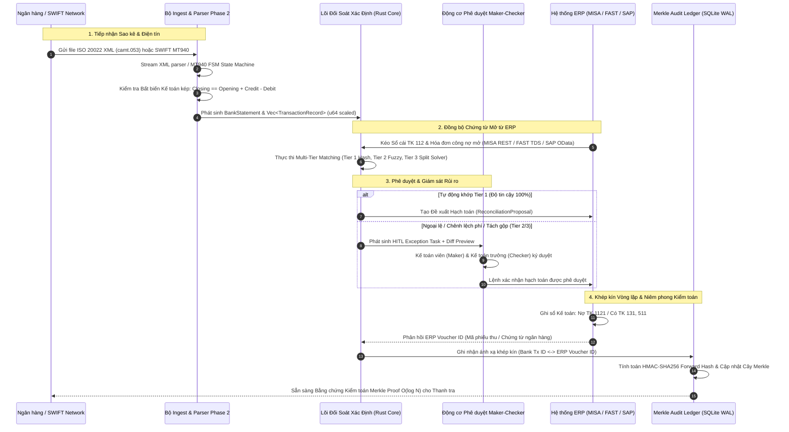

# Đặc tả Kiến trúc Kỹ thuật Kết nối Doanh nghiệp & Chuẩn hóa Điện toán — Phase 2
## LIVA Banking Harness — ISO 20022 XML, SWIFT MT940/MT942 & ERP Connectors (MISA, FAST, SAP B1)

[⬆ Mục lục](../README.md) · [Tuyên bố Tầm nhìn](../00-san-pham/tam-nhin-banking-harness.md) · [Bản vẽ Kiến trúc](system-architecture-blueprint.md) · [Lộ trình Master Remake](../06-ke-hoach/master-remake-roadmap.md) · [Vận hành ngrok](../02-van-hanh/ngrok-remote-access-deployment.md)

---

## 1. Tổng quan & Vị trí Kiến trúc Phase 2 trong LIVA Banking Harness

### 1.1 Mục tiêu Chiến lược của Phase 2
Sau khi hoàn thành **Giai đoạn 1 (Phase 1: Lõi Đối Soát Xác Định & Bộ Parser Đa Ngân Hàng)** với hiệu năng xử lý 50.000 dòng sao kê $< 19.2\text{ giây}$ và số học nguyên scaled `u64` loại bỏ $100\%$ sai số trôi nổi (Zero Floating-Point Drift), **Giai đoạn 2 (Phase 2: Chuẩn Hóa Điện Toán Quốc Tế & Kết Nối ERP)** giải quyết bài toán then chốt: **Khép kín vòng tròn luân chuyển dữ liệu tài chính (Closed-Loop Treasury Cycle)**.

Hệ thống Phase 2 chịu trách nhiệm:
1. **Tiếp nhận & Chuẩn hóa Điện tín Quốc tế**: Tự động bóc tách các định dạng tài chính chuẩn hóa toàn cầu theo chuẩn **ISO 20022 XML** (`camt.053`, `camt.052`, `pacs.008`) và điện phẳng **SWIFT MT940 / MT942** từ các ngân hàng ngoại và ngân hàng thương mại quốc tế (Citi, HSBC, Standard Chartered, Shinhan, Vietcombank Cash Management).
2. **Tích hợp Luồng Chứng từ Kế toán Doanh nghiệp (ERP Connectors)**: Kết nối hai chiều với 3 hệ sinh thái ERP thông dụng nhất tại Việt Nam và khu vực: **MISA AMIS / SME**, **FAST Business Online**, và **SAP Business One**.
3. **Giao thức Xác nhận Khép kín (Closed-Loop Reconciliation Confirmation Protocol)**: Đẩy chứng từ thu tiền gửi / báo có tự động vào ERP, thu hồi Mã chứng từ đối ứng (**ERP Voucher ID**), và niêm phong bằng chứng kiểm toán vào **Cây Merkle SHA-256** tuân thủ Thông tư 09/2020/TT-NHNN và Nghị định 13/2023/NĐ-CP.

### 1.2 Sơ đồ Luồng Dữ liệu Toàn diện Phase 2 (End-to-End Sequence Diagram)



---

## 2. Tiêu chuẩn Điện toán Ngân hàng Quốc tế ISO 20022 XML

### 2.1 Cấu trúc Tài liệu & Ý nghĩa Nghiệp vụ

#### A. `camt.053.001.08` — Bank-to-Customer Statement (Sao kê Tài khoản Cuối ngày)
Tài liệu `camt.053` là tiêu chuẩn vàng thay thế cho điện MT940 truyền thống trong khuôn khổ chuyển dịch ISO 20022 toàn cầu của SWIFT (CBPR+). Tài liệu chứa đựng đầy đủ số dư đầu kỳ, số dư cuối kỳ, các khoản biến động Nợ/Có trong ngày và dữ liệu định danh người gửi/người nhận phong phú.

Cấu trúc phân tầng XML chuẩn:
```xml
<Document xmlns="urn:iso:std:iso:20022:tech:xsd:camt.053.001.08">
  <BkToCstmrStmt>
    <GrpHdr>
      <MsgId>LIVA-STMT-20260914-001</MsgId>
      <CreDtTm>2026-09-14T01:00:00Z</CreDtTm>
    </GrpHdr>
    <Stmt>
      <Id>STMT-VCB-2026-09-14</Id>
      <ElctrncSeqNb>258</ElctrncSeqNb>
      <CreDtTm>2026-09-14T01:00:00Z</CreDtTm>
      <Acct>
        <Id><Othr><Id>0011000123456</Id></Othr></Id>
        <Ccy>VND</Ccy>
        <Nm>CONG TY CO PHAN CONG NGHE LIVA</Nm>
      </Acct>
      <!-- Số dư Đầu kỳ (Opening Balance) -->
      <Bal>
        <Tp><CdOrPrtry><Cd>OPBD</Cd></CdOrPrtry></Tp>
        <Amt Ccy="VND">15000000000</Amt>
        <CdtDbtInd>CRDT</CdtDbtInd>
        <Dt><Dt>2026-09-14</Dt></Dt>
      </Bal>
      <!-- Dòng Giao dịch Phát sinh -->
      <Ntry>
        <NtryRef>FT26258000192837</NtryRef>
        <Amt Ccy="VND">250000000</Amt>
        <CdtDbtInd>CRDT</CdtDbtInd>
        <Sts>BOOK</Sts>
        <BookgDt><Dt>2026-09-14</Dt></BookgDt>
        <ValDt><Dt>2026-09-14</Dt></ValDt>
        <BkTxCd>
          <Prtry><Cd>TRF</Cd></Prtry>
        </BkTxCd>
        <NtryDtls>
          <TxDtls>
            <Refs>
              <EndToEndId>INV-2026-09-0882</EndToEndId>
              <TxId>NPS262581290348</TxId>
            </Refs>
            <RltdPties>
              <Dbtr><Nm>CONG TY TNHH PHAN PHOI VINATECH</Nm></Dbtr>
              <DbtrAcct><Id><Othr><Id>19038291029011</Id></Othr></Id></DbtrAcct>
            </RltdPties>
            <RmtInf>
              <Ustrd>VINATECH THANH TOAN TIEN HANG HD 0882 NAPAS247</Ustrd>
            </RmtInf>
          </TxDtls>
        </NtryDtls>
      </Ntry>
      <!-- Số dư Cuối kỳ (Closing Balance) -->
      <Bal>
        <Tp><CdOrPrtry><Cd>CLBD</Cd></CdOrPrtry></Tp>
        <Amt Ccy="VND">15250000000</Amt>
        <CdtDbtInd>CRDT</CdtDbtInd>
        <Dt><Dt>2026-09-14</Dt></Dt>
      </Bal>
    </Stmt>
  </BkToCstmrStmt>
</Document>
```

#### B. `camt.052.001.08` — Bank-to-Customer Account Report (Báo cáo Biến động Trong ngày)
- Khác biệt với `camt.053` (chốt cuối ngày), `camt.052` được ngân hàng gửi định kỳ nhiều lần trong ngày (Intraday) hoặc phản hồi theo yêu cầu (On-Demand Inquiry).
- Trạng thái dòng tiền gồm cả giao dịch đã hạch toán (`Sts = BOOK`) và giao dịch đang treo xử lý (`Sts = PDNG` / `INFO`).
- Bộ parser trích xuất các dòng `BOOK` để đưa vào đối soát tức thời, đồng thời lưu trữ các dòng `PDNG` vào hàng đợi dự báo dòng tiền ngắn hạn (Rolling Cashflow Forecasting).

#### C. `pacs.008.001.08` — Financial Institutional Customer Credit Transfer
- Bức điện thanh toán liên ngân hàng khởi tạo từ hệ thống Core Banking / Napas.
- Chứa các thông tin định tuyến thanh toán quốc tế: Mã BIC ngân hàng phát lệnh (`DbtrAgt/FinInstnId/BICFI`), Mã BIC ngân hàng thụ hưởng (`CdtrAgt/FinInstnId/BICFI`), và Chuỗi định danh thanh toán xuyên suốt `EndToEndId`.
- Dữ liệu này được ánh xạ trực tiếp sang `TransactionRecord.ft_number` và `TransactionRecord.doc_ref`.

---

### 2.2 Ma trận Ánh xạ Dữ liệu ISO 20022 sang LIVA Domain Models

Toàn bộ dữ liệu bóc tách được chuyển đổi trực tiếp sang các cấu trúc dữ liệu nguyên bản Rust tại `liva-native-core/src/banking/models.rs`:

| Đường dẫn Phần tử ISO 20022 XML | Trường Mô hình Rust (`BankStatement` / `TransactionRecord`) | Kiểu Dữ liệu Rust | Quy tắc Chuyển đổi & Chuẩn hóa |
|---|---|---|---|
| `BkToCstmrStmt/Stmt/Acct/Id/...` | `BankStatement.account_number` | `Option<String>` | Loại bỏ khoảng trắng và dấu gạch nối |
| `BkToCstmrStmt/Stmt/Acct/Nm` | `BankStatement.account_name` | `Option<String>` | Chuẩn hóa Unicode NFC tiếng Việt |
| `Bal[OPBD]/Amt` | `BankStatement.opening_balance` | `Option<u64>` | Nhân hệ số tiền tệ (VND = $\times 1$, USD = $\times 100$) |
| `Bal[CLBD]/Amt` | `BankStatement.closing_balance` | `Option<u64>` | Cưỡng chế số nguyên $u64$, chặn số âm |
| `Bal[OPBD]/Dt/Dt` | `BankStatement.statement_from` | `Option<i64>` | Chuyển đổi `YYYY-MM-DD` sang Unix Epoch timestamp |
| `Bal[CLBD]/Dt/Dt` | `BankStatement.statement_to` | `Option<i64>` | Unix Epoch timestamp cuối ngày (23:59:59) |
| `Ntry/Amt` | `TransactionRecord.amount` | `u64` | Cưỡng chế $u64$ scaled integer (tuyệt đối không dùng `f64`) |
| `Ntry/CdtDbtInd` | `TransactionRecord.tx_type` | `TransactionType` | `'CRDT'` $\to$ `Credit`, `'DBIT'` $\to$ `Debit` |
| `Ntry/BookgDt/Dt` | `TransactionRecord.tx_date` | `i64` | Unix Epoch timestamp ngày ghi sổ |
| `Ntry/ValDt/Dt` | `TransactionRecord.value_date` | `i64` | Unix Epoch timestamp ngày giá trị thực tế |
| `Ntry/NtryDtls/TxDtls/Refs/EndToEndId` | `TransactionRecord.doc_ref` | `Option<String>` | Mã hóa đơn / Hợp đồng tham chiếu |
| `Ntry/NtryRef` | `TransactionRecord.ft_number` | `Option<String>` | Mã giao dịch ngân hàng (`FT...`) |
| `Ntry/NtryDtls/TxDtls/Refs/TxId` | `TransactionRecord.trace_id` | `Option<String>` | Mã giao dịch chuyển mạch (Napas Trace ID) |
| `Ntry/NtryDtls/TxDtls/RltdPties/Dbtr/Nm` | `TransactionRecord.counterparty_name` | `Option<String>` | Tên đối tác (ghi nhận bên chuyển nếu Credit) |
| `Ntry/NtryDtls/TxDtls/RltdPties/DbtrAcct` | `TransactionRecord.counterparty_account`| `Option<String>` | Số tài khoản ngân hàng đối tác |
| `Ntry/NtryDtls/TxDtls/RmtInf/Ustrd` | `TransactionRecord.narration` | `String` | Chuỗi nội dung chuyển khoản thô |

---

### 2.3 Kiến trúc Bộ Streaming XML Parser trong Rust (`camt053_xml.rs`)

Để xử lý các tệp sao kê ISO 20022 dung lượng lớn ($> 100\text{ MB}$, chứa hàng chục nghìn giao dịch của các tập đoàn đa quốc gia) mà **không gây tràn bộ nhớ RAM (RAM Guardrail $< 680\text{ MB}$)**, LIVA sử dụng kiến trúc **Streaming Event-Driven XML Parser** dựa trên crate `quick-xml`:
- Không nạp toàn bộ cây DOM vào RAM như `minidom` hay `serde-xml-rs`.
- Đọc từng token `Reader::read_event_into`: khi gặp thẻ `<Ntry>`, parser cấp phát một `TransactionRecord` trên stack, trích xuất dữ liệu, kiểm tra hợp lệ, sau đó đẩy ngay vào vector lưu trữ và giải phóng bộ đệm dòng.
- Bộ đệm tái sử dụng (`Vec<u8>` reuse buffer) loại bỏ hoàn toàn hiện tượng phân mảnh bộ nhớ (Memory Fragmentation).

---

## 3. Bộ Phân tích Điện phẳng SWIFT MT940 / MT942 (Finite State Machine)

### 3.1 Đặc tả Các Thẻ Điện Tín Chuẩn SWIFT MT940

Bức điện SWIFT MT940 là định dạng văn bản phẳng (Flat Text) gồm các khối (Blocks). Dữ liệu sao kê tài khoản nằm trọn vẹn trong Khối 4 (`{4:...-}`):

| Tag SWIFT | Tên Thẻ | Định dạng & Cú pháp | Ví dụ Thực tế | Vai trò Kỹ thuật |
|---|---|---|---|---|
| `:20:` | Transaction Reference Number | `16x` | `:20:VCB202609140001` | Khóa định danh phiên phát sinh điện |
| `:25:` | Account Identification | `35x` | `:25:0011000123456` | Số tài khoản ngân hàng trích sao kê |
| `:28C:`| Statement Number / Sequence | `5n[/5n]` | `:28C:00125/001` | Số thứ tự sổ phụ trong năm và số trang |
| `:60F:`| Opening Balance | `1!a6!n3!a15d` | `:60F:C260914VND15000000000,` | Số dư đầu kỳ (`C` Có / `D` Nợ, Ngày, Tiền tệ, Số tiền) |
| `:61:` | Statement Line | Cú pháp phụ phức tạp (xem mục 3.2) | `:61:2609140914CR250000000,NTRFNONREF//INV0882` | Dòng giao dịch biến động nguyên tử |
| `:86:` | Information to Account Owner | `6*65x` (Tối đa 6 dòng) | `:86:VINATECH THANH TOAN HD 0882` | Chuỗi diễn giải chi tiết giao dịch |
| `:62F:`| Closing Balance | `1!a6!n3!a15d` | `:62F:C260914VND15250000000,` | Số dư cuối kỳ chốt sổ phụ |

### 3.2 Cú pháp Chi tiết Thẻ `:61:` (Statement Line Sub-fields)
Thẻ `:61:` chứa toàn bộ thông tin tài chính cốt lõi trên một dòng đơn:
$$\mathbf{:61:\ [6!n][4!n][2a][1!a][15d][1!a][3c][16x][//16x][34x]}$$

Các trường con được tách bằng máy phân tích từ vựng (Lexer):
1. `6!n` (Value Date): Ngày giá trị định dạng `YYMMDD` (ví dụ `260914` $\to$ 14/09/2026).
2. `4!n` (Entry Date - Tùy chọn): Ngày hạch toán `MMDD` (`0914`).
3. `2a` (Debit/Credit Mark): `CR` (Credit), `DR` (Debit), `RC` (Reversal of Credit), `RD` (Reversal of Debit).
4. `1!a` (Funds Code - Tùy chọn): Ký tự phân loại quỹ tiền tệ.
5. `15d` (Amount): Số tiền giao dịch, dấu phẩy `,` làm dấu phân cách thập phân. Cần chuyển đổi về $u64$ nguyên.
6. `1!a3c` (Transaction Type): Loại giao dịch SWIFT (ví dụ `NTRF` = Non-transferable fund, `FMSC` = Miscellaneous fee).
7. `16x` (Reference for Account Owner): Mã tham chiếu giao dịch (định danh đối ứng).
8. `//16x` (Account Servicing Institution's Reference): Mã tham chiếu nội bộ ngân hàng.

---

### 3.3 Máy Trạng thái Hữu hạn (Finite State Machine - FSM) Phân tích MT940

Để phân tích chính xác điện MT940/MT942 ngay cả khi có các dòng diễn giải đa dòng (Tag `:86:` xuống dòng không báo trước), parser triển khai theo mô hình Máy trạng thái tất định (**Deterministic Finite State Machine**):

```mermaid
stateDiagram-v2
    [*] --> Init: Bắt đầu đọc luồng
    Init --> Block4_Start: Gặp ký tự '{4:'
    Block4_Start --> Tag20_Read: Bắt đầu Thẻ :20:
    Tag20_Read --> Tag25_Read: Bắt đầu Thẻ :25:
    Tag25_Read --> Tag28C_Read: Bắt đầu Thẻ :28C: (Tùy chọn)
    Tag25_Read --> Tag60_Read: Không có :28C:, gặp :60F: / :60M:
    Tag28C_Read --> Tag60_Read: Gặp :60F: / :60M:
    
    Tag60_Read --> Tag61_Read: Đọc Số dư Đầu kỳ, gặp Thẻ :61:
    Tag61_Read --> Tag86_Read: Đọc Thẻ :61: xong, gặp Thẻ :86:
    Tag61_Read --> Tag61_Read: Gặp tiếp Thẻ :61: (Giao dịch không có :86:)
    Tag86_Read --> Tag86_Read: Tiếp tục đọc dòng mở rộng của :86:
    Tag86_Read --> Tag61_Read: Gặp Thẻ :61: tiếp theo
    
    Tag61_Read --> Tag62_Read: Gặp Thẻ :62F: / :62M: (Số dư Cuối kỳ)
    Tag86_Read --> Tag62_Read: Gặp Thẻ :62F: / :62M: (Số dư Cuối kỳ)
    
    Tag62_Read --> Block4_End: Gặp dấu ngắt '-' hoặc '-}'
    Block4_End --> Verify_Invariant: Kiểm định Bất biến Toán học
    Verify_Invariant --> [*]: Hoàn tất Statement / Trả kết quả
```

---

### 3.4 Phương trình Xác thực Bất biến Kế toán kép (Double-Entry Invariant)

Mọi bức điện MT940 / MT942 bóc tách thành công bắt buộc phải thỏa mãn phương trình cân bằng kế toán tuyệt đối. Nếu xuất hiện bất kỳ sai lệch nào dù chỉ 1 đồng, tệp sao kê sẽ bị gắn cờ lỗi `ChecksumFailed` và cách ly tức thì:

#### 1. Định nghĩa Số học Dấu cho Số dư:
$$\text{SignedOpening} = \begin{cases} +(\text{OpeningBalance} \text{ as } i128) & \text{khi Tag :60F: có ký hiệu } 'C' \\ -(\text{OpeningBalance} \text{ as } i128) & \text{khi Tag :60F: có ký hiệu } 'D' \end{cases}$$

$$\text{SignedClosing} = \begin{cases} +(\text{ClosingBalance} \text{ as } i128) & \text{khi Tag :62F: có ký hiệu } 'C' \\ -(\text{ClosingBalance} \text{ as } i128) & \text{khi Tag :62F: có ký hiệu } 'D' \end{cases}$$

#### 2. Tính toán Tổng Biến động Phát sinh (Turnover Sum):
$$\Delta_{\text{turnover}} = \sum_{k=1}^{M_{\text{credit}}} (\text{Amount}_k \text{ as } i128) - \sum_{j=1}^{M_{\text{debit}}} (\text{Amount}_j \text{ as } i128)$$

#### 3. Bất biến Cân bằng Bắt buộc:
$$\mathbf{\text{SignedExpectedClosing}} \equiv \mathbf{\text{SignedOpening}} + \mathbf{\Delta_{\text{turnover}}}$$

$$\text{Discrepancy} = |\text{SignedExpectedClosing} - \text{SignedClosing}| \equiv 0\text{ VND}$$

---

## 4. Kiến trúc Bộ Kết nối Doanh nghiệp (ERP Connectors Architecture)

```
+=========================================================================================================+
|                                        LIVA BANKING HARNESS CORE                                        |
|                          [Deterministic Engine] <---> [ERP Connector Manager]                          |
+=========================================================================================================+
                 │                                   │                                    │
                 │ OAuth 2.0 REST                    │ Hybrid: TDS SQL / REST             │ OData v4 HTTPS (50000)
                 ▼                                   ▼                                    ▼
+-----------------------------------+ +-----------------------------------+ +-----------------------------+
|        MISA AMIS / SME            | |       FAST Business Online        | |      SAP Business One       |
|  • Sổ cái TK 112:                 | |  • Chế độ A: Cloud REST API       | |  • Quản lý B1SESSION        |
|    POST /api/v1/gl/get_bank_ledger| |  • Chế độ B: Direct TDS SQL       | |  • Staging bảng OBNK / BNK1 |
|  • Phiếu thu tiền gửi:            | |    Rust crate `tiberius` (TDS 7.4)| |  • Tra cứu Hóa đơn mở OINV  |
|    POST /api/v1/ca/save_deposit   | |    Query `cba1`, `cba2` (NOLOCK)  | |  • Ghi nhận thanh toán ORCT |
+-----------------------------------+ +-----------------------------------+ +-----------------------------+
```

---

### 4.1 MISA AMIS / SME Connector

#### A. Cơ chế Xác thực OAuth 2.0 Client Credentials
1. **Lấy Token truy cập**: LIVA gửi yêu cầu xác thực bảo mật tới máy chủ MISA Identity:
   - `POST https://id.misa.vn/oauth2/token`
   - Header: `Content-Type: application/x-www-form-urlencoded`
   - Body: `grant_type=client_credentials&client_id={MISA_CLIENT_ID}&client_secret={MISA_CLIENT_SECRET}&scope=act_open_api`
2. **Quản lý Token**:
   - Khóa bí mật `client_secret` được bảo vệ trong kho mã hóa phần cứng Stronghold Vault (sử dụng Argon2id + AES-256-GCM).
   - Token được lưu trong bộ đệm tiến trình (`Arc<RwLock<MisaTokenState>>`) và tự động làm mới trước khi hết hạn 5 phút.

#### B. Giao thức Kéo Sổ Cái Ngân hàng TK 112 (`GL Pull`)
- **Điểm cuối (Endpoint)**: `POST /api/v1/gl/get_bank_ledger`
- **Tần suất**: Định kỳ theo lịch tác vụ (Cron Job) hoặc kích hoạt sự kiện khi có sao kê ngân hàng mới.
- **Payload Yêu cầu (JSON)**:
  ```json
  {
    "company_code": "CONG_TY_LIVA",
    "account_code": "1121",
    "from_date": "2026-09-01",
    "to_date": "2026-09-14",
    "bank_account": "0011000123456",
    "page_index": 1,
    "page_size": 1000
  }
  ```
- **Dữ liệu Phản hồi & Ánh xạ**:
  * Mỗi bản ghi phản hồi được phân tích thành `InternalLedgerEntry`:
    - `ref_no` $\to$ `InternalLedgerEntry.voucher_id` (Mã chứng từ kế toán)
    - `posted_date` $\to$ `InternalLedgerEntry.entry_date`
    - `amount` $\to$ `InternalLedgerEntry.amount` (chuyển đổi sang scaled $u64$)
    - `debit_account` / `credit_account` $\to$ Kiểm tra đúng luồng phát sinh Nợ/Có TK 1121.

#### C. Giao thức Đẩy Phiếu Thu Tiền Gửi Ngân hàng (`Bank Deposit Push`)
Khi LIVA phát hiện giao dịch Báo Có ngân hàng đã đối soát khớp với hóa đơn công nợ của khách hàng, hệ thống đẩy chứng từ thu tiền gửi vào MISA:
- **Điểm cuối**: `POST /api/v1/ca/save_bank_deposit`
- **Payload Yêu cầu (JSON)**:
  ```json
  {
    "refdate": "2026-09-14",
    "posteddate": "2026-09-14",
    "refno": "PTNH-2026-09-00129",
    "reason": "VINATECH THANH TOAN HD 0882 - DOI SOAT TU DONG LIVA",
    "bank_account": "0011000123456",
    "customer_code": "KH_VINATECH",
    "total_amount": 250000000,
    "details": [
      {
        "debit_account": "1121",
        "credit_account": "131",
        "amount": 250000000,
        "invoice_no": "INV-2026-09-0882",
        "description": "Thanh toan tien mua thiet bi cntt"
      }
    ]
  }
  ```

---

### 4.2 FAST Business Online Connector

FAST Business Online là hệ thống ERP phổ biến cho doanh nghiệp sản xuất và thương mại tại Việt Nam, vận hành trên nền tảng Microsoft SQL Server. LIVA cung cấp kiến trúc **Kết nối Kép (Dual-Mode Connector)**:

#### A. Chế độ A: Cloud REST API Hybrid (Dành cho bản FAST Cloud SaaS)
- Giao tiếp qua cổng API HTTPS bảo mật của FAST.
- Sử dụng chữ ký số HMAC-SHA256 tính toán trên payload yêu cầu để chứng thực tính toàn vẹn.

#### B. Chế độ B: Direct TDS SQL Read-Replica (Dành cho On-Premise Hiệu năng Siêu cao)
Đối với doanh nghiệp triển khai On-Premise với hàng triệu dòng chứng từ mỗi năm, việc gọi REST API sẽ gặp nghẽn cổ chai độ trễ ($> 200\text{ ms} / \text{call}$). LIVA tích hợp bộ điều khiển **TDS SQL thuần Rust** thông qua crate `tiberius`:
- **Giao thức**: Tabular Data Stream (TDS) phiên bản 7.4, mã hóa đường truyền TLS.
- **Độ trễ truy vấn**: **$< 5\text{ ms}$** cho mỗi lô 1.000 chứng từ.
- **Bảo vệ CSDL Gốc — Ranh giới Đọc bản sao (Read-Replica Boundary)**:
  * Chỉ kết nối tới máy chủ Read-Replica hoặc Always On Availability Group Secondary.
  * Tài khoản CSDL chỉ được cấp quyền `db_datareader` (tuyệt đối không cấp quyền ghi/sửa).
  * **Cưỡng chế Bắt buộc `WITH (NOLOCK)`**: Mọi câu lệnh SQL truy vấn đều phải chứa gợi ý `WITH (NOLOCK)` nhằm ngăn chặn hoàn toàn việc giữ Shared Lock gây khóa chết (Deadlock) hoặc cản trở giao dịch ghi sổ kế toán đang diễn ra.

#### C. Đặc tả Câu lệnh Truy vấn SQL Bảng `cba1` và `cba2`

```sql
-- Truy vấn Chứng từ Thu tiền gửi ngân hàng (cba1: Header, cba2: Lines)
SELECT 
    h.stt_rec,              -- Khóa nhận diện chứng từ nội bộ FAST
    h.so_ct,                -- Số chứng từ hiển thị (Voucher ID)
    h.ngay_ct,              -- Ngày lập chứng từ
    h.ngay_lct,             -- Ngày hạch toán sổ cái
    h.ma_kh,                -- Mã khách hàng / nhà cung cấp
    h.ma_nt,                -- Mã loại tiền (VND / USD)
    h.ty_gia,               -- Tỷ giá hạch toán
    h.t_tien,               -- Tổng số tiền nguyên tệ
    h.dien_giai,            -- Diễn giải chung của chứng từ
    d.tk_no,                -- Tài khoản Nợ (ví dụ: '1121')
    d.tk_co,                -- Tài khoản Có (ví dụ: '131', '511')
    d.tien,                 -- Số tiền chi tiết theo dòng
    d.ma_hd                 -- Mã hợp đồng / Hóa đơn theo dõi công nợ
FROM dbo.cba1 AS h WITH (NOLOCK)
INNER JOIN dbo.cba2 AS d WITH (NOLOCK) ON h.stt_rec = d.stt_rec
WHERE h.ngay_ct BETWEEN @p_from_date AND @p_to_date
  AND (d.tk_no LIKE '112%' OR d.tk_co LIKE '112%')
ORDER BY h.ngay_ct ASC, h.stt_rec ASC;
```

---

### 4.3 SAP Business One Connector

#### A. Tích hợp Cổng SAP Service Layer OData v4
- SAP Business One cung cấp Service Layer hiện đại chạy trên cổng HTTPS mặc định **50000** (hỗ trợ cả SAP HANA và Microsoft SQL).
- Toàn bộ giao tiếp sử dụng chuẩn OData v4 JSON RESTful.

#### B. Quản lý Vòng đời Phiên & Cookie `B1SESSION`
Khác với OAuth Bearer token thông thường, SAP Service Layer quản lý phiên làm việc thông qua hai cookie bắt buộc: **`B1SESSION`** và **`ROUTEID`**.
1. **Đăng nhập (`Login`)**:
   - `POST https://{SAP_HOST}:50000/b1s/v2/Login`
   - Body:
     ```json
     {
       "CompanyDB": "SBODEMOVN",
       "UserName": "manager",
       "Password": "{STRONGHOLD_VAULT_PASSWORD}"
     }
     ```
   - Trích xuất header `Set-Cookie` nhận `B1SESSION={SessionId}` và `ROUTEID={RouteId}`.
2. **Cơ chế Duy trì Phiên (Keep-Alive Heartbeat)**:
   - Phiên SAP tự động hết hạn sau 30 phút không hoạt động (Session Timeout).
   - LIVA thiết lập luồng background định kỳ mỗi 20 phút gọi truy vấn nhẹ:
     `GET https://{SAP_HOST}:50000/b1s/v2/CompanyService_GetAdminInfo`
   - Nếu nhận mã HTTP `401 Unauthorized`, hệ thống tự động rơi về quy trình Re-Login với thuật toán Exponential Backoff.

#### C. Staging Sổ phụ Ngân hàng vào Bảng `OBNK` và `BNK1`
Để tận dụng tối đa quy trình nghiệp vụ gốc của SAP B1, LIVA đẩy dữ liệu sao kê đã chuẩn hóa vào phân hệ **Bank Statement Processing (BSP)** của SAP:
- Bảng Header: `OBNK` (Bank Statement Header).
- Bảng Chi tiết: `BNK1` (Bank Statement Row Details).
- Điểm cuối Service Layer: `POST https://{SAP_HOST}:50000/b1s/v2/BankStatements`
- Cấu trúc Payload:
  ```json
  {
    "BankAccountKey": 1,
    "StatementNumber": "STMT-2026-09-14",
    "StatementDate": "2026-09-14",
    "StartingBalance": 15000000000.0,
    "EndingBalance": 15250000000.0,
    "BankStatementRows": [
      {
        "LineNumber": 1,
        "DueDate": "2026-09-14",
        "DebitAmount": 0.0,
        "CreditAmount": 250000000.0,
        "Details": "VINATECH THANH TOAN HD 0882",
        "Reference": "INV-2026-09-0882",
        "ExternalCode": "FT26258000192837"
      }
    ]
  }
  ```

---

## 5. Giao thức Xác nhận Đối soát Khép kín (Closed-Loop Confirmation Protocol)

### 5.1 Vòng đời Xác nhận Hai Pha (Two-Phase Confirmation Lifecycle)

Nhằm đảm bảo tính toàn vẹn giao dịch tài chính (ACID) giữa hệ thống đối soát LIVA và cơ sở dữ liệu kế toán ERP, hệ thống áp dụng giao thức xác nhận hai pha:

```
[Phase 1: Propose] ────(Tự động khớp / Ký duyệt Maker-Checker)────> [Phase 2: Commit]
         │                                                                   │
         ▼                                                                   ▼
Tạo ReconciliationMatch                                             Đẩy chứng từ vào ERP
(PendingCommit State)                                              (MISA / FAST / SAP)
         │                                                                   │
         └─────────────< Nhận ERP Voucher ID & Ghi Sổ CSDL <─────────────────┘
                                         │
                                         ▼
                 Niêm phong vào Merkle Audit Ledger (H_k)
```

1. **Pha 1 — Khởi tạo & Đề xuất (Propose)**:
   - Động cơ đối soát tạo một bản ghi `ReconciliationMatch` với trạng thái `PENDING_COMMIT`.
   - Khóa logic: Giao dịch sao kê ngân hàng bị đánh dấu khóa tạm (`is_locked = 1`) để không bị khớp trùng lặp trong các luồng đối soát song song khác.
2. **Pha 2 — Hạch toán & Xác nhận Khép kín (Commit & Back-Propagation)**:
   - ERP Connector thực thi gửi lệnh tạo chứng từ sang ERP.
   - Khi ERP phản hồi thành công mã chứng từ ghi sổ (**ERP Voucher ID**, ví dụ `PT-2026-09-00129`), LIVA thực hiện:
     * Cập nhật `banking_reconciliation_matches.erp_voucher_id = 'PT-2026-09-00129'`.
     * Cập nhật `banking_reconciliation_matches.status = 'COMMITTED'`.
     * Mở khóa giao dịch sao kê, hoàn tất vòng đời đối soát.

---

### 5.2 Tích hợp Sổ cái Kiểm toán Cây Merkle SHA-256 (Merkle Audit Ledger)

Để đáp ứng các quy định thanh tra của Ngân hàng Nhà nước (Thông tư 09/2020/TT-NHNN) và kiểm toán độc lập của các đơn vị Big4, mọi sự kiện đối soát và chứng từ ERP đối ứng đều phải được niêm phong mật mã chống chối bỏ.

#### A. Sơ đồ Cấu trúc Cây Merkle Nhị phân (Binary Merkle Tree)

```
                       [Merkle Root Hash (H_ROOT)]
                                    │
                  ┌─────────────────┴─────────────────┐
               [H_01]                              [H_23]
                  │                                   │
            ┌─────┴─────┐                       ┌─────┴─────┐
          [H_0]       [H_1]                   [H_2]       [H_3]
            │           │                       │           │
        [Leaf 0]    [Leaf 1]                [Leaf 2]    [Leaf 3]
     Bank Tx #001  Bank Tx #002           Bank Tx #003  Bank Tx #004
     MISA Voucher  FAST Voucher           SAP Voucher   MISA Voucher
```

#### B. Cú pháp & Thuật toán Tính toán Chống Tấn công Tiền ảnh thứ hai (Second-Preimage Attack):
Theo chuẩn mật mã RFC 6962:
1. **Băm Bản ghi Lá (Leaf Node)**: Tiền tố byte `0x00`
   $$\text{LeafHash}_i = \text{SHA-256}(0x00 \parallel \text{AuditRecordPayload}_i)$$
2. **Băm Nút Nội bộ (Internal Node)**: Tiền tố byte `0x01`
   $$\text{ParentHash} = \text{SHA-256}(0x01 \parallel \text{LeftChildHash} \parallel \text{RightChildHash})$$

#### C. Chuỗi Băm Thuận Forward HMAC-SHA256 Chống Sửa Đổi CSDL:
Song song với Cây Merkle, bảng SQLite `banking_audit_chain` lưu giữ chuỗi xích forward hash liên tục:
$$H_k = \text{HMAC-SHA256}(K_{\text{audit}},\ H_{k-1} \parallel \text{timestamp} \parallel \text{actor} \parallel \text{event\_type} \parallel \text{payload\_digest})$$

- Nếu bất kỳ ai (kể cả Database Administrator) can thiệp sửa đổi số tiền hoặc mã chứng từ ERP trong cơ sở dữ liệu SQLite, hàm `AuditLedger::verify_chain` sẽ phát hiện sự đứt gãy xích băm ngay lập tức và xác định chính xác bản ghi bị làm giả (`tampered_seq_id`).

---

## 6. Kế hoạch Kiểm thử Tự động & Tiêu chí Nghiệm thu (Acceptance Criteria)

### 6.1 Bảng Tiêu chuẩn Nghiệm thu Kỹ thuật Định lượng
| Tiêu chí Kiểm định | Mục tiêu Định mức | Phương pháp Đo lường & Công cụ |
|---|---|---|
| **Độ chính xác Parser ISO 20022** | $100\%$ đúng trường trên 50 bộ dữ liệu mẫu | Test harness so sánh từng trường dữ liệu với JSON ground-truth |
| **Độ chính xác Parser SWIFT MT940** | $100\%$ đúng thẻ và cân bằng số học | FSM test suite kiểm tra cả file chuẩn và file có lỗi định dạng |
| **Kiểm định Bất biến Cân bằng Kế toán** | $0.0\%$ sai lệch số học lọt lưới | Cưỡng chế phương trình bất biến kế toán kép trên số nguyên $u64$ |
| **Độ trễ Đồng bộ Chứng từ FAST TDS** | $< 5\text{ ms} / 1.000\text{ dòng}$ | Đo kiểm bằng bộ bấm giờ microsecond của Rust (`Instant::now()`) |
| **Thời gian Sinh Merkle Proof** | $< 1.0\text{ ms} / \text{giao dịch}$ | Đo kiểm thuật toán leo cây $O(\log N)$ trên tập 50.000 giao dịch |
| **Mức tiêu thụ Bộ nhớ RAM** | Peak $\le 680\text{ MB}$ | Giám sát qua `scripts/ram-guard.ps1` và Windows Process Memory |

### 6.2 Lệnh Kiểm thử Tự động Chuẩn Hóa
```powershell
# 1. Kiểm tra RAM khả dụng trước khi chạy test
powershell -ExecutionPolicy Bypass -File scripts/ram-guard.ps1

# 2. Chạy bộ kiểm thử tự động cho module Banking
cargo test -p liva-native-core --lib banking::tests -j 2 -- --test-threads 2

# 3. Kiểm tra kiểm định Benchmark hiệu năng 50.000 dòng
cargo test -p liva-native-core --test banking_50k_benchmark -j 2 -- --test-threads 2 --nocapture

# 4. Kiểm tra biên dịch tĩnh toàn bộ các target và binary
cargo check -p liva-native-core --tests --bins -j 2
```

---

## 7. Kết luận

Tài liệu Đặc tả Kiến trúc Kỹ thuật Kết nối Doanh nghiệp Phase 2 thiết lập nền tảng kỹ thuật vững chắc để **LIVA Banking Harness** tiến từ khả năng đọc hiểu sao kê nội địa sang kết nối toàn diện với các định chế tài chính quốc tế (**ISO 20022, SWIFT MT940**) và hệ sinh thái quản trị doanh nghiệp (**MISA, FAST, SAP B1**).

Mô hình đảm bảo trọn vẹn 3 trụ cột: **Tốc độ xử lý đỉnh cao** (Rust Native, TDS SQL trực tiếp), **Độ chính xác tuyệt đối** (Số học nguyên $u64$, Bất biến kép), và **An toàn tuân thủ pháp lý** (Zero-Egress, Token HITL hai pha, Cây Merkle SHA-256).
