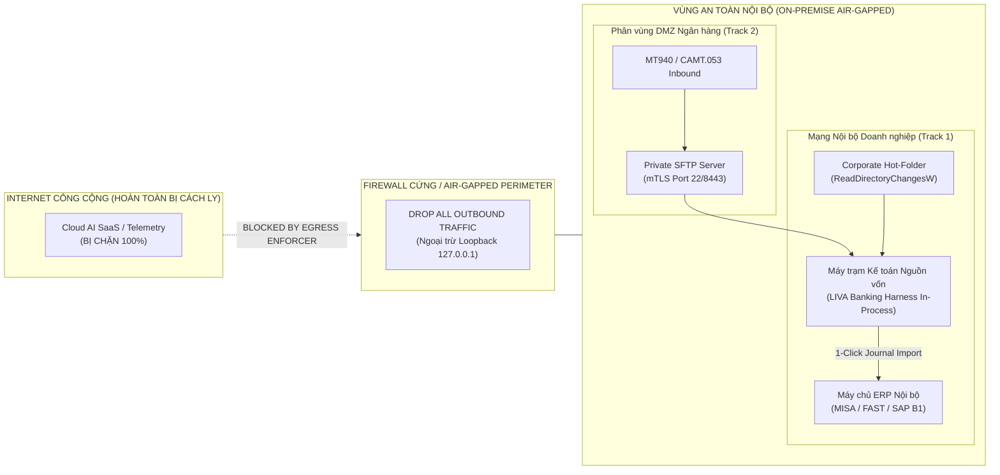
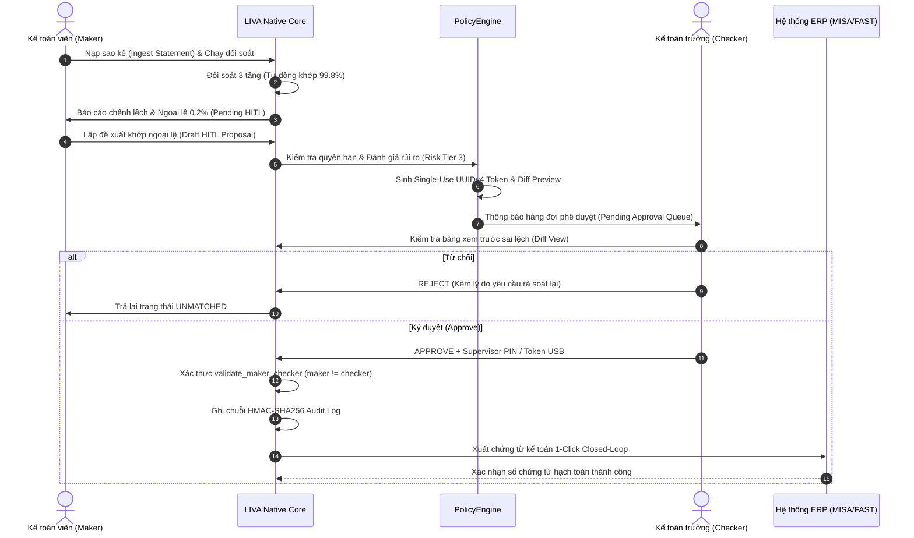

# Bản vẽ Thiết kế Kiến trúc Kỹ thuật Hệ thống — LIVA Banking Harness
## Agentic Harness for Banking & Corporate Treasury Automation — Technical Blueprint

[⬆ Mục lục](../README.md) · [Tuyên bố Tầm nhìn](../00-san-pham/tam-nhin-banking-harness.md) · [Ma trận Năng lực](../_data/capabilities.json) · [Báo cáo Gap Analysis](gap-analysis-harness.md) · [Lộ trình Master Remake](../06-ke-hoach/master-remake-roadmap.md)

---

## 1. Tổng quan Kiến trúc Toàn diện (System Architecture Overview)

**LIVA Banking Harness** được thiết kế theo mô hình **Đai bảo vệ & Điều phối cục bộ (Local Agentic Harness)** vận hành 100% bằng mã máy Rust biên dịch tĩnh (`liva-native-core`), ôm quanh hạ tầng kế toán và ngân hàng hiện hữu mà không can thiệp vào mã nguồn Core Banking hay ERP lõi.

Hệ thống bao gồm 6 phân tầng chức năng khép kín từ tiếp nhận chứng từ đến bàn làm việc người dùng:

```mermaid
flowchart TB
    subgraph INGEST["1. TẦNG TIẾP NHẬN ĐA NGUỒN CHỨNG TỪ (INGESTION LAYER)"]
        direction LR
        SRC1["Sao kê Ngân hàng Nội địa<br/>• VCB (Excel ô gộp)<br/>• TCB (CSV UTF-8 BOM)<br/>• BIDV (PDF bảng biểu)<br/>• 32+ Ngân hàng TMCP"]
        SRC2["Điện Chuẩn Quốc tế<br/>• SWIFT MT940 / MT950<br/>• ISO 20022 CAMT.053<br/>• ISO 20022 PACS.008"]
        SRC3["Sổ Cái & Hóa Đơn ERP<br/>• MISA AMIS / SME<br/>• FAST Business Online<br/>• SAP BAPI / S/4HANA<br/>• Open Invoices JSON/Excel"]
    end

    subgraph SECURITY_IN["2. HÀNG RÀO AN NINH CỤC BỘ & KHỬ ĐỊNH DANH (ZERO-EGRESS BOUNDARY)"]
        direction TB
        SEC1["SecretScrubber: Zeroize Passwords, Tokens, API Keys"]
        SEC2["Compliance Sanitizer: Redact CCCD 12 số, Mask Số Tài khoản (Bảo toàn số tiền)"]
        SEC3["Zero-Egress Sentinel: Giám sát Socket, Cấm IP ngoài Loopback 127.0.0.1"]
    end

    subgraph CORE_ENGINE["3. LÕI NATIVE RUST: PHÂN TÁCH TRÁCH NHIỆM (DUAL-ENGINE DISENTANGLEMENT)"]
        direction LR
        subgraph SEMANTIC["Động cơ Ngữ nghĩa (Local SLM)"]
            SLM["Local SLM (3B-8B Q4 GGUF)<br/>• Bóc tách thực thể tiếng Việt<br/>• Cú pháp Napas 247, VietQR<br/>• Xuất InvoiceSplitProposal<br/>• 0% làm toán số học"]
        end
        subgraph MATH["Động cơ Đối soát Xác định (Rust Math)"]
            RUST_MATH["Deterministic 3-Tier Matcher<br/>• Tier 1: O(1) Exact Hash Match<br/>• Tier 2: Fuzzy Heuristic (Lệch phí 11k)<br/>• Tier 3: Composite Split Solver<br/>• Bất biến: Tổng Nợ == Tổng Có"]
        end
    end

    subgraph GOVERNANCE["4. TẦNG KIỂM SOÁT QUYỀN HẠN & XÁC NHẬN HAI PHA (POLICY & HITL)"]
        direction TB
        POL["PolicyEngine (4-Tier Risk Hierarchy)<br/>• Tier 1 (ReadOnly): Tự động khớp<br/>• Tier 2 (Reversible): Hạch toán sai lệch vi mô<br/>• Tier 3 (External): Xuất chứng từ ERP -> CẦN DUYỆT<br/>• Tier 4 (Irreversible): Chốt sổ / Điều chuyển -> CẦN DUYỆT"]
        HITL["Giao thức Xác nhận Hai pha (Two-Phase Confirmation)<br/>• Phase 1: Sinh Diff Preview + UUIDv4 Single-Use Token<br/>• Phase 2: Kế toán trưởng kiểm tra & Ký duyệt (0.2% Ngoại lệ)"]
    end

    subgraph STORAGE["5. TẦNG LƯU TRỮ NIÊM PHONG PHẦN CỨNG (HARDWARE-SEALED STORAGE)"]
        direction LR
        DB["SQLite WAL Mode Engine<br/>• 32KB Page, 256MB MMAP<br/>• Mã hóa trường AES-256-GCM<br/>• Khóa chủ niêm phong Windows DPAPI / TPM 2.0"]
        AUDIT["Immutable Audit Ledger<br/>• Chuỗi khối HMAC-SHA256<br/>• Cây Merkle Inclusion Proof O(log N)<br/>• Tuân thủ Thông tư 09/2020/TT-NHNN Cấp 3-5"]
    end

    subgraph WORKBENCH["6. GIAO DIỆN BÀN LÀM VIỆC KẾ TOÁN NGUỒN VỐN (UI WORKBENCH)"]
        UI_VIEW["LIVA Banking Workbench (liva-ui)<br/>• Bảng kiểm soát đối soát tự động 99.8%<br/>• Hộp thoại phê duyệt ngoại lệ Two-Phase (HitlResolutionModal)<br/>• Tháp canh cảnh báo thâm hụt thanh khoản trước 24-48 giờ<br/>• Xuất file nhật ký chứng từ ERP 1-Click"]
    end

    INGEST --> SECURITY_IN
    SECURITY_IN --> CORE_ENGINE
    SEMANTIC --> RUST_MATH
    CORE_ENGINE --> GOVERNANCE
    POL --> HITL
    GOVERNANCE --> STORAGE
    GOVERNANCE --> WORKBENCH
    STORAGE <--> WORKBENCH
```



---

## 2. Cơ chế Phân tách Trách nhiệm (Architectural Disentanglement)

Để đạt mục tiêu **0% ảo giác số học (Zero Hallucination)** trong môi trường tài chính, LIVA phân tách triệt để nhiệm vụ giữa AI và thuật toán số học xác định:

```
+---------------------------------------------------------------------------------------------------------+
|                                    ARCHITECTURAL DISENTANGLEMENT MATRIX                                 |
+----------------------------------------------------+----------------------------------------------------+
|  TẦNG NGỮ NGHĨA: LOCAL SLM (3B-8B Q4 GGUF)         |  TẦNG TÍNH TOÁN: RUST DETERMINISTIC ENGINE         |
+----------------------------------------------------+----------------------------------------------------+
| • Nhận dạng nội dung thanh toán tiếng Việt tự do.  | • Tuyệt đối không giao tính toán số học cho LLM!   |
| • Phân tích cú pháp chuyển khoản Napas 247/VietQR. | • So khớp O(1) trên bảng băm in-memory AHash.      |
| • Bóc tách mã hóa đơn, tên đối tác, số hợp đồng.   | • Tính khoảng cách Jaro-Winkler tên đối tác.       |
| • Xuất cấu trúc phân bổ `InvoiceSplitProposal`.    | • Giải thuật Subset Sum giải quyết thanh toán gom. |
| • Ràng buộc: Output thuần túy là dữ liệu gợi ý.    | • Ràng buộc bất biến: Sum(Allocated) == TxAmount.  |
|                                                    | • Sử dụng kiểu số nguyên scaled integer `u64`.     |
+----------------------------------------------------+----------------------------------------------------+
```

### Triển khai Số học Chuẩn mực trong Rust
Trong toàn bộ codebase `src/banking/`, mọi giá trị tiền tệ được lưu trữ dưới dạng số nguyên không âm `u64` (đơn vị: 1 VNĐ = 1 integer unit; với ngoại tệ: 1 USD = 100 cents), loại trừ hoàn toàn sai số làm tròn float:

```rust
// Trích dẫn: liva-native-core/src/banking/reconciliation/split_solver.rs
let verified_sum: u64 = selected_invoices.iter().map(|inv| inv.amount).sum();
assert_eq!(
    verified_sum, tx.amount,
    "Toán học kế toán bất biến bị vi phạm: Tổng phân bổ không khớp số tiền giao dịch!"
);
```

---

## 3. Hàng rào An ninh Cục bộ & Triển khai Air-Gapped (Zero-Egress Security)

### 3.1. Sơ đồ Cấu trúc Phân vùng Mạng Doanh nghiệp & Ngân hàng



### 3.2. Năm Tầng Bảo mật Chiều sâu (5-Tier Security Guardrails)

1. **Tầng 1: `SecretScrubber Engine`**: Tự động nhận diện và xóa bỏ an toàn trong bộ nhớ (`zeroize`) các mật khẩu, session token, API credentials ngay sau khi hoàn thành kết nối.
2. **Tầng 2: `Compliance Sanitizer & PII Masking`**:
   - Biểu thức quy chuẩn nhận dạng CCCD 12 chữ số (`\b0\d{11}\b`) và số tài khoản ngân hàng (8–16 số).
   - Tự động thay thế bằng `[REDACTED_CCCD]` và `[REDACTED_ACCOUNT]`.
   - **Bảo toàn số tiền nguyên vẹn**: Giải thuật regex phân tách ngữ cảnh đảm bảo không che mờ nhầm số tiền giao dịch tài chính (`file:///e:/Project/01_AI_Agents/LIVA_Banking/liva-native-core/src/banking/compliance/sanitizer.rs#L34-L61`).
3. **Tầng 3: `Cognitive PolicyEngine`**:
   - Phân tầng 4 cấp độ rủi ro (`ReadOnly`, `Reversible`, `ExternalSideEffect`, `PhysicalOrIrreversible`).
   - Mọi hành động ghi sổ cái hoặc xuất dữ liệu ERP bắt buộc phải sinh Diff Preview và cần Kế toán trưởng ký duyệt.
4. **Tầng 4: `Idempotency Engine`**:
   - Khóa băm SHA-256 duy nhất tính toán từ `(account_id, tx_date, amount, doc_ref)` đảm bảo không thể xảy ra hiện tượng đối soát trùng hoặc hạch toán lặp giao dịch.
5. **Tầng 5: `Hardware-Sealed SQLite Storage`**:
   - Mã hóa AES-256-GCM v2 (`v2:salt:iv:tag:ciphertext`) cho các trường nhạy cảm (`account_number_enc`, `narration_enc`, `counterparty_account_enc`).
   - Khóa giải mã chủ được niêm phong bằng Windows DPAPI (`CryptProtectData`) gắn với tài khoản Windows người dùng hoặc mô-đun phần cứng TPM 2.0.

---

## 4. Cơ chế Phê duyệt Hai pha & Giám sát 4 Mắt (Two-Phase Confirmation & Maker-Checker)

Nhằm đáp ứng đầy đủ yêu cầu tại **Điều 18 và Điều 20 Thông tư 09/2020/TT-NHNN**, LIVA Banking Harness triển khai giao thức phân quyền tách biệt trách nhiệm (Separation of Duties - SoD):



### Hợp đồng Kiểm soát Maker-Checker trong Mã Nguồn:
```rust
pub fn validate_maker_checker(req: &HitlApprovalRequest) -> Result<(), &'static str> {
    // Bất biến 1: Người lập (Maker) và Người duyệt (Checker) bắt buộc phải là 2 định danh khác nhau
    if req.maker_principal.trim().eq_ignore_ascii_case(req.checker_principal.trim()) {
        return Err("Vi phạm Nguyên tắc 4 Mắt: Kế toán viên không thể tự phê duyệt đề xuất của chính mình!");
    }

    // Bất biến 2: Token xác thực phải là UUIDv4 hợp lệ và chưa từng bị sử dụng (Single-use)
    if uuid::Uuid::parse_str(&req.hitl_token).is_err() {
        return Err("Mã token phê duyệt hai pha không hợp lệ hoặc đã hết hạn!");
    }

    Ok(())
}
```

---

## 5. Sổ cái Kiểm toán Mật mã Bất biến (Cryptographic Audit Ledger & Merkle Trees)

Hệ thống cung cấp hai cơ chế kiểm toán mật mã song hành:

### 5.1. Chuỗi băm HMAC-SHA256 Chuyển tiếp (Forward-Chaining Audit Log)
Đã triển khai hoàn chỉnh trong `file:///e:/Project/01_AI_Agents/LIVA_Banking/liva-native-core/src/banking/compliance/audit_ledger.rs`:
$$H_k = \text{HMAC-SHA256}(K_{\text{audit}}, H_{k-1} \parallel \text{timestamp} \parallel \text{actor} \parallel \text{event\_type} \parallel \text{payload\_digest})$$
Bất kỳ sự thay đổi trực tiếp nào vào cơ sở dữ liệu SQLite cục bộ đều làm gãy chuỗi băm tại khối bị can thiệp và kích hoạt cờ báo động toàn hệ thống.

### 5.2. Cây Merkle Nhị phân (Binary Merkle Tree Inclusion Proofs)
Phục vụ công tác thanh tra độc lập của Ngân hàng Nhà nước hoặc kiểm toán viên Big4:

```
                                [ MERKLE ROOT R_k ]
                               /                   \
                     [ NODE H_01 ]               [ NODE H_23 ]
                    /             \             /             \
             [ LEAF L_0 ]     [ LEAF L_1 ] [ LEAF L_2 ]     [ LEAF L_3 ]
                  |                |            |                |
             [ Block 0 ]      [ Block 1 ]  [ Block 2 ]      [ Block 3 ]
```

- **Chống tấn công Second-Preimage**: Nút lá được tiền tố byte `0x00`, nút trung gian được tiền tố byte `0x01`.
- **Độ phức tạp kiểm toán**: Sinh bằng chứng tồn tại giao dịch (Inclusion Proof) với kích thước đường dẫn $O(\log N)$, cho phép kiểm toán viên chứng minh tính toàn vẹn của một giao dịch cụ thể mà không làm lộ thông tin của các giao dịch khác trong sổ phụ.

---

## 6. Khung Pháp lý & Hồ sơ Tuân thủ (Regulatory Compliance Framework)

| Văn Bản Pháp Quy | Điều Khoản Trọng Yếu | Yêu Cầu Tuân Thủ Ngân Hàng | Cơ Chế Kiểm Soát Kỹ Thuật Của LIVA |
|---|---|---|---|
| **Nghị định 13/2023/NĐ-CP** (PDPD) | Điều 2 & Điều 25 | Dữ liệu sao kê tài khoản ngân hàng là Dữ liệu cá nhân nhạy cảm; cấm chuyển dữ liệu ra nước ngoài khi chưa lập hồ sơ đánh giá tác động. | • 100% Zero Cloud Leakage On-Premise.<br/>• Bộ lọc PII Sanitizer khử định danh CCCD và STK.<br/>• Hồ sơ DPIA chuẩn Cục A05 (Bộ Công an). |
| **Thông tư 09/2020/TT-NHNN** | Điều 18 (Quyền truy cập), Điều 20 (Nhật ký hệ thống) | Hệ thống Thông tin Cấp độ 3-5: Mã hóa tại chỗ AES-256; tách biệt trách nhiệm Maker-Checker; lưu vết nhật ký chống giả mạo. | • SQLite WAL mã hóa AES-256-GCM.<br/>• Maker-Checker 4 mắt có Token Two-Phase.<br/>• Sổ cái HMAC-SHA256 & Merkle Tree. |
| **Luật Các TCTD 2024** | Điều 10 & Điều 11 | Bảo mật tuyệt đối thông tin tài khoản và bí mật giao dịch khách hàng; ngăn chặn tiết lộ cho bên thứ ba. | • Khóa chủ do tổ chức tín dụng kiểm soát (HYOK).<br/>• Niêm phong khóa qua Windows DPAPI / TPM 2.0. |
| **Quyết định 810/QĐ-NHNN** | Kế hoạch Chuyển đổi số Ngành Ngân hàng | Ứng dụng AI/Big Data có kiểm soát rủi ro trong quản trị nguồn vốn và vận hành. | • Kiến trúc Non-Invasive tích hợp thử nghiệm Sandbox an toàn. |

---

## 7. Mô hình Tích hợp Ngoại vi Không Xâm lấn (Non-Invasive Dual-Track Integration)

LIVA Banking Harness giải quyết bài toán tích hợp thông qua hai đường dẫn (Dual-Track) hoàn toàn không xâm lấn:

### Track 1: Corporate Treasury Hot-Folder & Closed-Loop ERP Import
- **Cơ chế**: Kế toán tải sao kê từ Internet Banking về thư mục được chỉ định trên máy trạm (`C:\LIVA\Statements\HotFolder`).
- Module `ReadDirectoryChangesW` của Windows Win32 API phát hiện file mới trong micro-giây, kích hoạt parser và đối soát tức thì.
- Sau khi Kế toán trưởng ký duyệt ngoại lệ qua hộp thoại `HitlResolutionModal`, LIVA tự động sinh file chứng từ hạch toán kế toán (XML/Excel) tương thích 1-click import hoặc gọi REST API cục bộ vào MISA AMIS / FAST / SAP.

### Track 2: Bank Ops DMZ Private SFTP & Air-Gapped Financial Messaging
- **Cơ chế**: Trung tâm Vận hành Ngân hàng (Nostro/Vostro Operations) tiếp nhận trực tiếp file điện SWIFT MT940/950 và ISO 20022 CAMT.053 qua cổng Private SFTP phân vùng DMZ được bảo vệ bằng mTLS.
- Toàn bộ quá trình bóc tách và đối soát sổ sách liên ngân hàng được thực hiện trong môi trường Air-gapped hoàn toàn, đáp ứng quy chuẩn khắt khe nhất của Ngân hàng Nhà nước Việt Nam.
