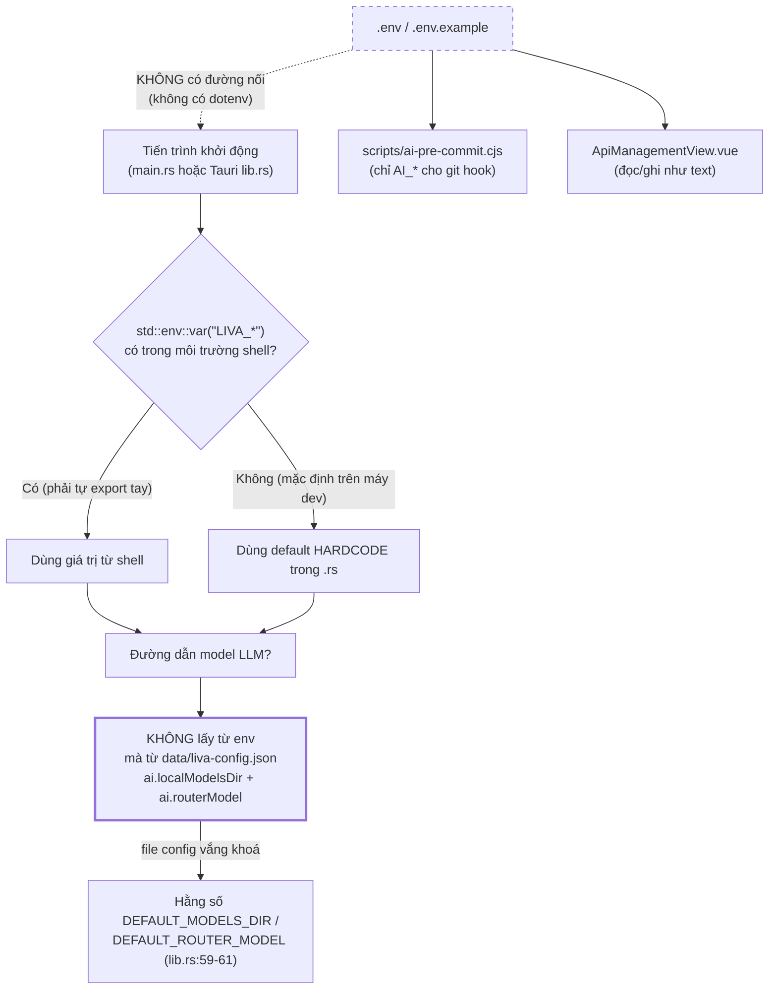
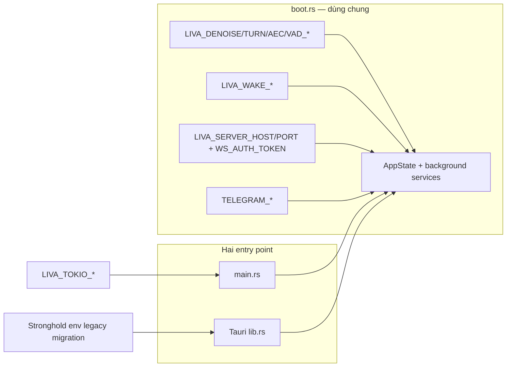
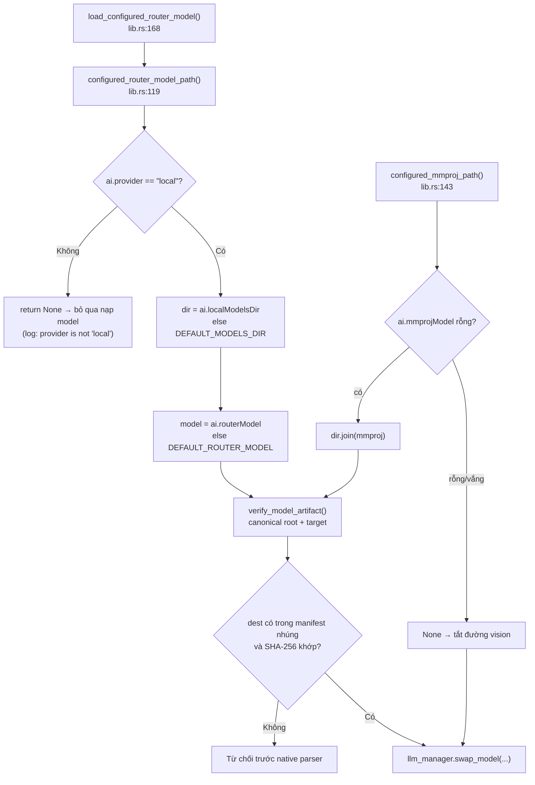

# Cấu hình và biến môi trường LIVA

[⬆ Mục lục](../README.md) · [◀ Phụ thuộc module và tra cứu](../01-ban-ve/10-phu-thuoc-module-va-tra-cuu.md) · [Mô hình AI và tài nguyên ▶](02-mo-hinh-ai-va-tai-nguyen.md)

---

Tài liệu này là **bảng tra cứu đầy đủ** mọi biến môi trường mà mã Rust thật sự đọc, kèm giá trị mặc định, vị trí `file:dòng`, và tác dụng. Nó cũng liệt kê chính xác những chỗ **lệch giữa `.env.example` và code**, cùng các khoá trong `data/liva-config.json` **không có reader**.

---

## 1. Phát hiện gốc: KHÔNG có cơ chế nào nạp `.env` vào tiến trình Rust

Đây là điều quan trọng nhất phải hiểu trước khi đọc bất kỳ bảng nào bên dưới.

| Kiểm chứng | Kết quả |
|---|---|
| Crate `dotenv`/`dotenvy` trong `liva-native-core/Cargo.toml` | **không có** |
| grep `dotenv` trong `Cargo.lock` | **0 kết quả** |
| `scripts/start_all.ps1` (91 dòng) có đọc `.env`? | **không** — chỉ kill port `@(8101,8100,8002,8082,5173,8000)` rồi `npm run dev` (liva-ui) + `npx tauri dev --no-dev-server` |
| Nơi duy nhất parse file `.env` | `scripts/ai-pre-commit.cjs:30-41` (hook AI pre-commit, đọc `AI_BASE_URL`/`AI_API_KEY`/`AI_MODEL`) |
| Nơi thứ hai chạm `.env` | `liva-ui/src/components/dashboard/ApiManagementView.vue` — đọc/ghi nội dung `.env` như **văn bản** qua vault/IPC, **không inject** vào process |
| `.env` | **không tồn tại** |
| `.cargo/config.toml` | **không có** |

⇒ **Thực tế đang chạy:** mọi `std::env::var("LIVA_*")` đều fail → toàn bộ hệ thống chạy bằng **default hardcode trong code** + `data/liva-config.json`.

> **`.env.example` là tài liệu mô tả, KHÔNG phải cấu hình có hiệu lực.** Muốn một biến có tác dụng, phải tự `$env:LIVA_... = "..."` trong PowerShell **trước khi** khởi chạy tiến trình.

### 1.1 Thứ tự ưu tiên cấu hình thực tế



### 1.2 Hai điểm vào đọc env khác nhau — cảnh báo lớn

LIVA có **hai profile chạy**: vỏ Tauri (`liva-desktop/src-tauri/src/lib.rs`, đường chạy chính thức của `npm run dev`) và gateway lõi standalone (`liva-native-core/src/main.rs`, phải gọi thủ công). Mục này chỉ nói **profile nào đọc biến nào**; định nghĩa và ranh giới của hai profile nằm ở tài liệu kiến trúc.

> 📌 Nguồn đầy đủ: [Kiến trúc tổng thể](../01-ban-ve/01-kien-truc-tong-the.md)

Hai entry point hiện cùng dùng `boot::build_app_state()` và `boot::spawn_background_services()`.
Vì vậy WebSocket, Telegram, governor, model autoload và các dịch vụ nền không còn là hai bản dựng
trôi lệch. `LIVA_SERVER_HOST`, `LIVA_SERVER_PORT` và `LIVA_WS_AUTH_TOKEN` áp dụng cho cả standalone
lẫn Tauri. `LIVA_TOKIO_*` vẫn chỉ cấu hình runtime do standalone tự tạo.



---

## 2. Bảng đầy đủ biến môi trường

Cột **Bắt buộc?** phản ánh **hành vi code thật**, không phản ánh lời khẳng định trong `.env.example`.

### 2.1 Nhóm A — đọc bởi CẢ hai điểm vào (gateway + desktop shell)

| Biến | Mặc định trong code | Bắt buộc? | Đọc tại | Tác dụng |
|---|---|---|---|---|
| `LIVA_DB_PATH` | `data_dir()/agents/liva_core/structured_memory.sqlite` | Không | `boot.rs#build_app_state` | Đường dẫn SQLite neo vào data root, không phụ thuộc cwd; parent dir được tạo trước khi mở |
| `LIVA_ENCRYPTION_KEY` | khóa thiết bị DPAPI tự sinh trên Windows | Không | `lib.rs#resolve_and_rekey`, `boot.rs#build_app_state` | Nếu đặt thì dùng khóa explicit; nếu bỏ trống, sinh khóa thiết bị và hiển thị escrow một lần. Khóa 32 số `0` chỉ là legacy/test và không được chọn làm khóa live |
| `LIVA_DB_IN_MEMORY` | `false` = dùng file trên đĩa | Không | `boot.rs#build_app_state`, qua `env_flag` | Bật khi `1/true/yes/on`; tắt khi `0/false/no/off`; không set hoặc giá trị lạ → **false** (an toàn) |
| `LIVA_STT_MODEL_DIR` | `models/nemotron-asr` | Không | `liva-native-core/src/boot.rs:263` | Thư mục Nemotron ASR; đi qua `resolve_resource_path` |
| `LIVA_TTS_MODEL_PATH` | `models/kokoro-v1.0.onnx` | Không | `liva-native-core/src/boot.rs:264` | Model Kokoro; nạp **lazy** (`tts/engine.rs:24-32`) — thiếu file **không** làm hỏng `TtsManager` |
| `LIVA_TTS_VOICE_PATH` | `node_modules/kokoro-js/voices/af_heart.bin` | Không | `boot.rs#build_app_state`, `tts/mod.rs#TtsManager::from_bin` | Voice fallback Kokoro; thiếu file chỉ ghi cảnh báo và dùng vector rỗng, không làm mất Piper/VieNeu |
| `LIVA_MEMORY_RETENTION_DAYS` | `0` = tắt | Không | `memory_retention.rs#RetentionPolicy::from_env` | Số ngày không hoạt động trước khi hội thoại local đủ điều kiện xóa; 1–36.500 bật worker, 0/vắng là không tự xóa |
| `LIVA_MEMORY_RETENTION_INTERVAL_SECS` | `3600` | Không | `memory_retention.rs#RetentionPolicy::from_env` | Nhịp sweeper; tối thiểu 60 giây; chỉ được đọc khi retention đã bật |
| `LIVA_MEMORY_RETENTION_BATCH_SIZE` | `10` | Không | `memory_retention.rs#RetentionPolicy::from_env` | Số hội thoại tối đa mỗi batch, bị chặn trong 1–25 |
| `LIVA_LLM_N_CTX` | `4096` | Không | `main.rs:127`, `lib.rs:334` | context llama.cpp; parse fail → 4096 |
| `LIVA_LLM_N_GPU_LAYERS` | vắng = tự chọn **99 hoặc 0** theo VRAM trống, kích thước model+projector và 2 GiB dự phòng | Không | `boot.rs#gpu_layers_mac_dinh` | `u32`; có giá trị hợp lệ thì override phép tự chọn. **KHÔNG dùng `-1`** |
| `LIVA_GAME_N_GPU_LAYERS` | `0` | Không | `main.rs:271`, `lib.rs:419` | Layer GPU khi phát hiện game; task tự `return` nếu `normal==0 \|\| game==normal` |
| `LIVA_VAULT_PATH` | `<repo>/teamwork_projects/obsidian_llm_wiki/vault` (**hardcode tuyệt đối**) | Không | `main.rs:166`, `lib.rs:345` | Vault Obsidian cho `NativeMcpServer` |

### 2.2 Nhóm B — dịch vụ nền dùng chung; `LIVA_TOKIO_*` chỉ standalone

| Biến | Mặc định trong code | Bắt buộc? | Đọc tại | Tác dụng |
|---|---|---|---|---|
| `LIVA_EMBEDDING_MODEL_DIR` | `models/embedding` (fallback `../`, `../../`) | Không | `llm/embedder.rs` (`resolve_model_dir`) | Thư mục chứa `model.onnx` + `tokenizer.json` của model embedding **chuyên dụng 384 chiều**. Tách khỏi model chat có chủ đích — xem mục 2.3. Thiếu model ⇒ bộ nhớ dài hạn không ghi/tìm được, phần còn lại vẫn chạy |
| `LIVA_EMBEDDING_THREADS` | `1` | Không | `llm/embedder.rs` (`load`) | Số luồng intra-op cho ONNX session của embedder |
| `LIVA_MAX_HISTORY_MESSAGES` | `20` | Không | `agent/state.rs:12` (`max_history_messages`), dùng ở `agent/graph.rs` (2 chỗ) và `webrtc/pipeline.rs:270` | Số tin nhắn giữ lại trong lịch sử hội thoại, **không kể** tin `system`. Chốt chặn theo SỐ TIN NHẮN để prompt không phình vượt `LIVA_LLM_N_CTX` (F1+F2). `0` hoặc parse fail → 20. Thuộc nhóm B vì `build_pipeline_graph`/`WebRTCActor` **không được dựng** trong vỏ Tauri. Guard cứng theo TOKEN thì áp dụng cho mọi đường — xem `check_prompt_fits` (`llm/engine.rs:82`), không cấu hình qua env |
| `LIVA_WS_ALLOWED_ORIGINS` | rỗng (chỉ dùng allow-list mặc định) | Không | `liva-native-core/src/websocket.rs:300-465` qua `origin_allowed` (`lib.rs`) | Origin được phép nối WebSocket, ngăn cách bằng dấu phẩy. Mặc định đã cho: `http://localhost:5173`, `http://127.0.0.1:5173`, `tauri://localhost`, `https://tauri.localhost`. Handshake sai origin bị trả **403** ngay ở tầng HTTP. Không có header `Origin` (client native) thì cho qua — đánh đổi có chủ ý, xem F4 |
| `LIVA_TOKIO_WORKER_THREADS` | `available_parallelism()`, else `4` | Không | `main.rs:31` | Số worker thread Tokio |
| `LIVA_TOKIO_MAX_BLOCKING_THREADS` | `512` | Không | `main.rs:36` | Kích thước blocking pool |
| `LIVA_DENOISE_ENABLED` | **BẬT**; chỉ tắt khi `0` / `false` / `off` | Không | `main.rs:182` | GTCRN denoise chạy trước VAD/STT |
| `LIVA_DENOISE_MODEL_PATH` | `models/gtcrn_simple.onnx` (+ `../`, `../../`) | Không | `webrtc/denoise.rs:28-43` | Thiếu file ⇒ chạy không khử ồn, **không lỗi** |
| `LIVA_TURN_SHADOW_ENABLED` | tắt; **chỉ `"1"`** mới bật | Không | `main.rs:214` | Smart Turn v3.2 shadow mode (chỉ log, không đổi quyết định VAD) |
| `LIVA_TURN_MODEL_PATH` | `models/smart_turn_v3.2_cpu.onnx` (+ `../`, `../../`) | Không | `webrtc/turn_shadow.rs:44-59` | Đường dẫn model shadow |
| `LIVA_AEC_ENABLED` | tắt; **chỉ `"1"`** | Không | `main.rs:234` | Sonora AEC3 khử tiếng TTS của chính LIVA vọng lại mic |
| `LIVA_SERVER_PORT` | `8002` | Không | `websocket.rs#bind_from_env` | Cổng WebSocket `/ws` |
| `LIVA_SERVER_HOST` | `127.0.0.1` | Không | `websocket.rs#bind_from_env` | Địa chỉ bind; loopback không yêu cầu token |
| `LIVA_WS_AUTH_TOKEN` | không set | **Bắt buộc khi host non-loopback** | `websocket.rs#bind` | Bearer token 32–4096 visible ASCII byte; thiếu/yếu làm bind fail |
| `LIVA_OPENAI_PORT` | không set = **không mở socket nào** | Không | `openai_api.rs` (`configured_addr`), `boot.rs` mục 5b | Bề mặt HTTP tương thích OpenAI (`/v1/models`, `/v1/chat/completions`, `/v1/audio/speech`). Bind theo `LIVA_SERVER_HOST`. **Không có xác thực** — xem cảnh báo dưới bảng |
| `TELEGRAM_BOT_TOKEN` | không set = **tắt bot** | Không | `liva-native-core/src/boot.rs:407-425`, `liva-native-core/src/system_status.rs#system_status`, `telegram.rs:323` | Bật `TelegramBotManager` |
| `TELEGRAM_ALLOWED_IDS` | `""` (fail-closed) | Không | `liva-native-core/src/boot.rs:411-425` | CSV whitelist ID người dùng |

> ⚠️ **Bẫy CSP:** `tauri.conf.json` chỉ cho `connect-src` tới `localhost:5173`, `ws://localhost:5173`, `ws://localhost:8002`, `ws://127.0.0.1:8002` — **port 8002 hardcode trong CSP**, nên đổi `LIVA_SERVER_PORT` sẽ vỡ kết nối WS từ UI (dù ở chế độ Tauri core chạy in-process, không mở WS).

> ⚠️ **`LIVA_OPENAI_PORT` mở một bề mặt mạng KHÔNG xác thực.** Cùng mức bảo vệ với cổng 8002 — nghĩa là gần như không có — nhưng thiếu cả hàng rào `Origin`, vì client HTTP không gửi header đó. Nó tắt mặc định chính vì thế: bật là một hành động có chủ ý, không phải trạng thái người dùng vô tình rơi vào. Giữ ở `127.0.0.1`; muốn máy khác trong nhà gọi được thì đặt reverse proxy có TLS + token ở trước, đừng đổi `LIVA_SERVER_HOST` thành `0.0.0.0`.

### 2.3 Nhóm C — đọc trong module (áp dụng cho cả 2 entry point, **nếu module đó được khởi tạo**)

Bảng dưới liệt kê **biến và giá trị mặc định**. Ý nghĩa vật lý của các ngưỡng thoại (VAD/AEC/denoise/wake/turn) — vì sao chọn con số đó, chúng tác động thế nào tới độ trễ và barge-in — được giải thích ở tài liệu đường ống thoại.

> 📌 Nguồn đầy đủ: [Voice SLO](../05-chat-luong/voice-slo.md)

| Biến | Mặc định trong code | Bắt buộc? | Đọc tại | Tác dụng |
|---|---|---|---|---|
| `LIVA_GAME_MODE` | `Auto` (mọi giá trị lạ → Auto) | Không | `governor.rs:32-40` | `on\|force\|forced`→ForcedOn; `off\|disable\|disabled`→Off |
| `LIVA_GAME_PRIORITY` | `true` (**chỉ `"off"`** mới tắt) | Không | `governor.rs:58` | Hạ priority tiến trình xuống BELOW_NORMAL khi vào game |
| `LIVA_BUSY_CPU_PERCENT` | `80` (`0` = tắt nhánh CPU; >100 hoặc rác → 80) | Không | `governor.rs:94-100` | Ngưỡng tải CPU **của tiến trình khác** để bật chế độ tiết kiệm, song song với dò fullscreen |
| `LIVA_BUSY_GPU_PERCENT` | `80` (`0` = tắt nhánh GPU; >100 hoặc rác → 80) | Không | `governor.rs:197-203` | Ngưỡng tải GPU **của tiến trình khác** (NVML, chỉ NVIDIA — máy khác nhánh tự tắt). Không tách được phần của LIVA mà `LIVA_LLM_N_GPU_LAYERS > 0` thì bỏ tín hiệu, tránh vòng phản hồi ngược |
| `LIVA_LLM_THREADS` | `4` | Không | `llm/engine.rs:172`, `llm/engine.rs:393` | `n_threads` llama.cpp |
| `LIVA_ESPEAK_PATH` | tự dò PATH → `C:\Program Files\eSpeak NG\espeak-ng.exe` → `(x86)` | Không | `tts/espeak.rs:12-35` | Nhị phân G2P; cache bằng `OnceLock` |
| `LIVA_TTS_PIPER_DIR` | `models/piper` | Không | `tts/mod.rs:133` | Quét `vi*.onnx` / `en*.onnx` |
| `LIVA_TTS_LANGUAGE` | `vi` | Không | `tts/mod.rs:136` | Ngôn ngữ TTS mặc định |
| `LIVA_TTS_VIENEU` | **tắt**; bật với `1\|true\|yes\|on` | Không | `tts/mod.rs:157` | ✅ đã bổ sung vào `.env.example` (21/07/2026) |
| `LIVA_VIENEU_MODEL_DIR` | `models/vieneu` | Không | `tts/mod.rs:163` | ✅ đã bổ sung vào  (21/07/2026)`.env.example` |
| `LIVA_VIENEU_VOICE` | `default_voice` trong `voices_v3_turbo.json` | Không | `tts/mod.rs:178` | ✅ đã bổ sung vào  (21/07/2026)`.env.example` |
| `LIVA_VIENEU_THREADS` | `4` | Không | `tts/vieneu/mod.rs:126` | ✅ đã bổ sung vào  (21/07/2026)`.env.example` |
| `LIVA_VIENEU_SEED` | `StdRng::from_entropy()` | Không | `tts/vieneu/mod.rs:211` | Seed sampling (tái lập kết quả) — ✅ đã bổ sung vào  (21/07/2026)`.env.example` |
| `LIVA_STT_VI_ENGINE` | `parakeet`; đặt `nemotron` để opt-out | Không | `stt/mod.rs:13`, `stt/mod.rs:75` | Parakeet xử lý whole-utterance tiếng Việt sau VAD-end và được profile `full` tải về; thiếu/hỏng model thì tự lùi về Nemotron. Nemotron vẫn luôn dùng cho wake-word và streaming |
| `LIVA_STT_LANGUAGE` | `"vi"` (`stt/lang.rs:26`) | Không | `stt/mod.rs:58` | Ngôn ngữ nhận dạng mặc định |
| `LIVA_PARAKEET_MODEL_PATH` | `models/parakeet_vi.onnx` | Không | `stt/mod.rs:115` | ⚠️ dùng `PathBuf::from` trực tiếp, **KHÔNG** qua `resolve_resource_path` ⇒ phụ thuộc cwd |
| `LIVA_PARAKEET_VOCAB_PATH` | `<model>.with_file_name("parakeet_vi_vocab.json")` | Không | `stt/mod.rs:118` | Vocab BPE 1024 token |
| `LIVA_PARAKEET_THREADS` | `4` (lọc `>=1`) | Không | `stt/parakeet.rs:186` | intra-op thread ORT |
| `LIVA_VAD_THRESHOLD` | `0.5` | Không | `webrtc/vad.rs:44` | Ngưỡng Silero VAD |
| `LIVA_VAD_START_FRAMES` | `3` | Không | `webrtc/vad.rs:48` | Số frame để tính bắt đầu nói |
| `LIVA_VAD_END_FRAMES` | **`22`** (≈0,7 s; giá trị `Default` của struct là 45 ≈ 1,44 s) | Không | `webrtc/vad.rs:49` | Số frame im lặng để chốt kết thúc lượt |
| `LIVA_VAD_MODEL_PATH` | `models/silero_vad_v6.onnx` (+ `../`, `../../`) → fallback `<stt_dir>/silero_vad.onnx` | Không | `webrtc/vad.rs:64-79` | Model VAD |
| `LIVA_WAKE_MODE` | **`Off`** | Không | `wake.rs:58-67` | `asr_prefix\|asr\|on`; `trained_model\|trained\|model`; `hybrid\|both`; còn lại → Off |
| `LIVA_WAKE_PHRASES` | `hey liva` | Không | `wake.rs:72` | Câu gọi duy nhất được phát hành; CSV chỉ dùng để ghi đè thử nghiệm có chủ đích |
| `LIVA_WAKE_WINDOW_SECS` | `45` | Không | `wake.rs:80` | Thời gian mở gate sau khi bắt được wake word |
| `LIVA_WAKE_MODEL_PATHS` | rỗng | Không | `wake.rs:86` | CSV đường dẫn classifier `.onnx`; rỗng ⇒ STT-only |
| `LIVA_WAKE_THRESHOLD` | **`0.68`** — `.env.example:97` và `models/README.md:18` ghi `0.77` | Không | `wake.rs:92-95` | Ngưỡng classifier wake |
| `LIVA_WAKE_MELSPEC_PATH` | `models/wakeword_melspec.onnx` (+ `../`, `../../`) | Không | `wake_model.rs:77` qua `resolve_bundled_model` (`wake_model.rs:51`) | Mel-spectrogram dùng chung |
| `LIVA_WAKE_EMBEDDING_PATH` | `models/wakeword_embedding.onnx` | Không | `wake_model.rs:114` | Embedding wake |
| `LIVA_VISION_REGION` | `auto` | Không | `vision/capture.rs:128` | `full` \| `cursor` \| `auto` |
| `LIVA_VISION_CROP` | `512` (lọc `>0`) | Không | `vision/capture.rs:135` | Kích thước ô crop quanh chuột (px) |

### 2.4 Nhóm D — chỉ desktop shell (Tauri)

| Biến | Mặc định trong code | Bắt buộc? | Đọc tại | Tác dụng |
|---|---|---|---|---|
| `LIVA_STRONGHOLD_PASSWORD` | không set | Không; **chỉ migration legacy** | `liva-desktop/src-tauri/src/lib.rs#legacy_vault_key` | Thử mở snapshot Stronghold đời cũ để re-encrypt bằng key DPAPI mới |
| `LIVA_STRONGHOLD_SALT` | salt legacy cố định | Không; **chỉ migration legacy** | `lib.rs#legacy_vault_key` | Không tham gia write path Stronghold hiện hành |

### 2.5 Nhóm E — chỉ trong bin probe / test (**code chết ở đường chạy thật**)

| Biến | Đọc tại | Ghi chú |
|---|---|---|
| `LIVA_LLM_MODEL_DIR` | `src/bin/router_stress.rs:68`, `tests/integration_tests.rs:213` | **KHÔNG hề được đọc ở `main.rs` / `lib.rs` / desktop** |
| `LIVA_QWENVL_DIR` | `src/bin/qwen3vl_probe.rs:26-37` | probe thủ công |
| `LIVA_QWENVL_LM` | `src/bin/qwen3vl_probe.rs:26-37` | probe thủ công |
| `LIVA_QWENVL_MMPROJ` | `src/bin/qwen3vl_probe.rs:26-37` | probe thủ công |
| `LIVA_QWENVL_NGL` | `src/bin/qwen3vl_probe.rs:26-37` | probe thủ công |
| `LIVA_QWENVL_NCTX` | `src/bin/qwen3vl_probe.rs:26-37` | probe thủ công |
| `LIVA_QWENVL_SKIP_VISION` | `src/bin/qwen3vl_probe.rs:26-37` | probe thủ công |

### 2.6 Nhóm F — biến không thuộc `LIVA_*` mà công cụ dev đọc

| Biến | Đọc tại | Tác dụng |
|---|---|---|
| `AI_BASE_URL` | `scripts/ai-pre-commit.cjs:30-41` | Endpoint LLM cho hook AI pre-commit; fallback `http://127.0.0.1:8000/v1` |
| `AI_API_KEY` | `scripts/ai-pre-commit.cjs:30-41` | fallback `local-ghost-router` |
| `AI_MODEL` | `scripts/ai-pre-commit.cjs:30-41` | fallback `gemma-4-E4B-it-Q6_K.gguf` — model này **KHÔNG có** trên `E:\AI_Models` |
| `SKIP_AI_HOOK` | `scripts/ai-pre-commit.cjs:8` | `=1` để bỏ qua hook AI khi commit |
| `LIBCLANG_PATH` | `.github/workflows/test.yml` | bindgen cho `llama-cpp-sys-2`; CI đặt `C:\Program Files\LLVM\bin` |
| `CUDAARCHS` | comment `liva-desktop/src-tauri/Cargo.toml:22-24` | RTX 5060 Ti / Blackwell cần `120a-real` + CUDA 12.8+ |

---

## 3. Lệch giữa `.env.example` và code thật

### 3.1 Bảng tổng hợp lệch

| # | Hạng mục | `.env.example` nói | Code thật | Hậu quả |
|---|---|---|---|---|
| 1 | `LIVA_LLM_MODEL_DIR` | `E:\AI_Models` (`.env.example:28`) | **không có reader nào ở runtime** (chỉ `router_stress.rs:68`, `integration_tests.rs:213`) | Sửa biến này **không đổi gì**; đường dẫn model thật lấy từ `data/liva-config.json` |
| 2 | `LIVA_WAKE_THRESHOLD` | `0.77` | default code là `0.68` | Vì không có dotenv, không export thì dùng 0,68; dòng example chỉ có tác dụng khi người vận hành export thật |
| 3 | `LIVA_LLM_N_GPU_LAYERS` | `99` | vắng = `gpu_layers_mac_dinh()` tự chọn 99/0 | `.env.example` là ví dụ override; runtime không nạp file `.env`, nhưng thiếu biến không còn đồng nghĩa CPU-only |

Các lệch cũ về `LIVA_DB_IN_MEMORY`, khóa mặc định công khai, VieNeu vắng trong example và
`LIVA_TTS_VOICE_PATH` làm mất toàn bộ TTS đã được sửa trong code/example; không còn là rủi ro hiện hành.

### 3.2 Biến CHẾT trong `.env.example` — không một dòng Rust nào đọc

grep trên `liva-native-core/src` + `liva-desktop/src-tauri/src` → **0 kết quả** cho toàn bộ danh sách sau.

| Biến chết | Vị trí trong `.env.example` | Ai thật sự chạm tới |
|---|---|---|
| `REMOTE_CONTROL_ENABLED` | `:154` | chỉ `ApiManagementView.vue` (đọc/ghi text) |
| `TELEGRAM_CHAT_ID` | `:157` | ↑ |
| `TELEGRAM_ADMIN_ID` | `:158` | ↑ |
| `ZALO_APP_ID` | `:160` | ↑ — Zalo hiện chỉ là trạng thái giả trong JSON status (`lib.rs:512`: `"zalo": { "status": "offline" }`) |
| `ZALO_APP_SECRET` | `:161` | ↑ |
| `ZALO_OA_ACCESS_TOKEN` | `:162` | ↑ |
| `ZALO_USER_ID` | `:163` | ↑ |
| `EMAIL_HOST` | `:166` | ↑ |
| `EMAIL_PORT` | `:167` | ↑ |
| `EMAIL_USER` | `:168` | ↑ |
| `EMAIL_PASS` | `:169` | ↑ |
| `AI_PROVIDER` | `:147` | Rust **không** đọc (đúng như comment `.env.example:146`); nguồn thật là `liva-config.json` → `ai.provider` |
| `AI_BASE_URL` | `:148` | chỉ hook pre-commit + UI |
| `AI_API_KEY` | `:149` | ↑ |
| `AI_MODEL` | `:150` | ↑ |
| `LIVA_LLM_MODEL_DIR` | `:28` | chỉ `router_stress.rs` / `integration_tests.rs` |

**Trạng thái nhóm này: [THIẾU]** — biến có trong template nhưng không có consumer trong core.

### 3.3 Biến CÓ trong code mà `.env.example` THIẾU tài liệu

| Biến | Đọc tại | Vì sao quan trọng |
|---|---|---|
| `LIVA_TTS_VIENEU` | `tts/mod.rs:157` | Công tắc duy nhất bật giọng VieNeu-TTS thuần Rust — **[MỘT PHẦN]** (opt-in, mặc định tắt) |
| `LIVA_VIENEU_MODEL_DIR` | `tts/mod.rs:163` | Trỏ thư mục `models/vieneu` (≈ 570 MB weights) |
| `LIVA_VIENEU_VOICE` | `tts/mod.rs:178` | Chọn preset giọng trong `voices_v3_turbo.json` |
| `LIVA_VIENEU_THREADS` | `tts/vieneu/mod.rs:126` | Điều tiết CPU khi chạy chung tải nặng |
| `LIVA_VIENEU_SEED` | `tts/vieneu/mod.rs:211` | Tái lập kết quả sampling (debug chất lượng giọng) |

`models/README.md:13` có nhắc nhóm VieNeu, nhưng `.env.example` thì không.

### 3.4 Giá trị ngưỡng lệch — bảng đối chiếu nhanh

| Tham số | Default trong code | Giá trị tài liệu ghi | Nguồn tài liệu |
|---|---|---|---|
| `LIVA_WAKE_THRESHOLD` | `0.68` (`wake.rs:92-95`) | `0.77` | `.env.example:97`, `models/README.md:18`, README |
| `LIVA_LLM_N_GPU_LAYERS` | tự chọn 99/0 (`boot.rs#gpu_layers_mac_dinh`) | `99` | `.env.example` |
| `LIVA_VAD_END_FRAMES` | `22` (`webrtc/vad.rs:49`) | `22` trong `.env.example:79`, nhưng `Default` của struct là `45` | `webrtc/vad.rs` |
| `parakeet_vi.onnx` (kích thước) | thực tế **41,9 MB** trên đĩa | "1.1MB graph" | `models/README.md:11` — **sai số liệu** |

---

## 4. Cấu hình `data/liva-config.json`

Đây là **nguồn cấu hình có hiệu lực thật sự** cho phần LLM, khác hẳn `.env.example`.

### 4.1 Cơ chế đọc/ghi

| Thành phần | Vị trí | Ghi chú |
|---|---|---|
| Hằng đường dẫn | `liva-native-core/src/paths.rs#CONFIG_REL_PATH` = `"data/liva-config.json"` | |
| Dò đường dẫn | `liva-native-core/src/paths.rs#config_file_path` | Thử tiền tố `""`, `".."`, `"../.."` vì cwd khác nhau theo điểm vào (repo root / liva-native-core / liva-desktop/src-tauri) |
| Đọc | `liva-native-core/src/paths.rs#read_config_file` | Lỗi đọc hoặc JSON hỏng ⇒ **im lặng trả `{}`** (không cảnh báo) |
| Ghi (merge sâu) | lệnh `liva-native-core/src/commands/config.rs#update_config` + `liva-native-core/src/paths.rs#merge_json` | UI gửi patch từng phần (ví dụ chỉ `ai`); object lồng nhau merge theo khoá, còn lại ghi đè |
| Đọc phần `ai` cho UI | `liva-native-core/src/commands/config.rs#get_ai_config` | Trả `ai` nguyên khối; file vắng ⇒ trả default cứng |
| Đọc toàn bộ cho UI | `liva-native-core/src/commands/config.rs#get_config` | File vắng ⇒ trả default cứng |

Hằng số fallback (`lib.rs:59-61`):

```rust
pub const DEFAULT_MODELS_DIR: &str = "E:\\AI_Models";
pub const DEFAULT_ROUTER_MODEL: &str = "gemma-4-E4B-it-qat-GGUF/gemma-4-E4B-it-qat-UD-Q4_K_XL.gguf";
pub const DEFAULT_EXPERT_MODEL: &str = "gemma-4-12B-it-qat-UD-Q4_K_XL.gguf";
```

### 4.2 Đường đi từ config tới model LLM đang chạy



### 4.3 Bảng khoá `liva-config.json` — có reader hay không

Giá trị cột "Giá trị hiện tại" lấy từ file thật `E:\Project\LIVA\data\liva-config.json`.

#### Khối `ai` — **[OK]** (khối duy nhất có reader thật trong Rust)

| Khoá | Giá trị hiện tại | Reader Rust | Trạng thái |
|---|---|---|---|
| `ai.provider` | `"local"` | `lib.rs:124`, `lib.rs:146` | **[OK]** — `!= "local"` ⇒ bỏ hẳn nạp model local |
| `ai.localModelsDir` | `E:\AI_Models` | `configured_models_dir`, `artifact_trust::verify_model_artifact` | **[OK]** — root được canonicalize; config vẫn có thể đổi nên đây chưa phải operator-owned root bất biến |
| `ai.routerModel` | `gemma-4-E4B-it-qat-GGUF/gemma-4-E4B-it-qat-UD-Q4_K_XL.gguf` | `configured_router_model_path`, `load_configured_router_model` | **[OK]** — chỉ nạp nếu dest + SHA-256 khớp manifest nhúng |
| `ai.mmprojModel` | `gemma-4-E4B-it-qat-GGUF/mmproj-F16.gguf` | `configured_mmproj_path`, `load_configured_router_model` | **[OK]** — projector phải cùng repo QAT và qua canonical/hash gate |
| `ai.expertModel` | `gemma-4-12B-it-qat-UD-Q4_K_XL.gguf` | chỉ xuất hiện ở default `lib.rs:379`, `:444` | **[MỘT PHẦN]** — **chưa có code swap expert tự động** |
| `ai.cloudBaseUrl` | `""` | không có reader (`lib.rs:374`, `:439` chỉ là default echo) | **[THIẾU]** |
| `ai.cloudApiKey` | **không còn hợp lệ** | `update_config` từ chối; `get_config` redact legacy | **[ĐÃ XÓA]** — secret ở Stronghold `ai/cloud_api_key` |
| `ai.cloudModel` | `""` | ↑ | **[THIẾU]** |
| `ai.temperature` | `0.3` | **không** — sinh văn bản lấy `payload["temperature"]` từ request (`lib.rs:764`, `:1339`, `:1402`) | **[THIẾU]** reader từ config |
| `ai.maxTokens` | `2048` | không có reader | **[THIẾU]** |
| `ai.topP` | `0.9` | không có reader từ config (top_p cũng từ payload) | **[THIẾU]** |

#### Khối `avatar` — **[THIẾU]** reader Rust (UI-only)

| Khoá | Giá trị hiện tại | Trạng thái |
|---|---|---|
| `avatar.engineMode` | `"auto"` | **[THIẾU]** reader Rust — chỉ echo default `lib.rs:362` |
| `avatar.live2dModel` | `models/live2d/pio/index.json` | **[THIẾU]** — ⚠️ thư mục `models/live2d` **không tồn tại ở root**; asset thật ở `liva-ui/public/models/live2d` |
| `avatar.vrmModel` | `models/vrm/little+Chinese+girl/tripo_convert_bcaf2e66-…fbx` | **[THIẾU]** — ⚠️ tương tự, asset thật ở `liva-ui/public/models/vrm` |
| `avatar.autoBlinkEnabled` | `true` | **[THIẾU]** reader Rust (UI dùng) |
| `avatar.lookAtMouseEnabled` | `true` | **[THIẾU]** reader Rust (UI dùng) |
| `avatar.lipSyncEnabled` | `true` | **[THIẾU]** reader Rust (UI dùng) |
| `avatar.activeModel` | `little+Chinese+girl/tripo_convert_…fbx` | **[THIẾU]** reader Rust; UI khớp qua `liva-ui/src/utils/avatarSync.ts:50` |
| `avatar.activeType` | `"3d"` | ↑ |
| `avatar.activeFormat` | `"fbx"` | ↑ |

#### Khối `ui` — **[THIẾU]** reader Rust (UI-only)

| Khoá | Giá trị hiện tại | Trạng thái |
|---|---|---|
| `ui.widgetPosition` | `"bottom-right"` | **[THIẾU]** reader Rust (`lib.rs:385` chỉ là default) |
| `ui.dashboardTheme` | `"dark"` | **[THIẾU]** reader Rust |
| `ui.avatarMode` | `"auto"` | **[THIẾU]** reader Rust |
| `ui.activeModel.{filename,type,format}` | trỏ `models/vrm/…fbx`, `3d`, `fbx` | **[THIẾU]** reader Rust; **trùng lặp** với `avatar.activeModel*` — hai nguồn sự thật song song |

#### Khối `system` — **[THIẾU]** hoàn toàn reader Rust (chỉ UI ghi/đọc)

grep `proactive|geolocation|digest` trên `liva-native-core/src` → **chỉ 2 hit**, đều là default echo tại `lib.rs:390-391`. Không có scheduler nào trong core đọc giờ/phút hay cờ giao hàng.

| Khoá | Giá trị hiện tại | Reader | Trạng thái |
|---|---|---|---|
| `system.geolocationEnabled` | `true` | `lib.rs:390` (default echo) | **[THIẾU]** |
| `system.proactiveEnabled` | `true` | `lib.rs:391` (default echo) | **[THIẾU]** |
| `system.proactiveHour` | `7` | không | **[THIẾU]** |
| `system.proactiveMinute` | `0` | không | **[THIẾU]** |
| `system.proactiveDeliverUI` | `false` | không | **[THIẾU]** |
| `system.proactiveDeliverTelegram` | `true` | không | **[THIẾU]** |
| `system.proactiveDeliverZalo` | `true` | không | **[THIẾU]** — Zalo còn chưa có kênh gửi thật |
| `system.proactiveDeliverEmail` | `false` | không | **[THIẾU]** |
| `system.proactiveFocus` | `""` | không | **[THIẾU]** |
| `system.digestInterestsEnabled` | `true` | `SettingsView.vue:40`, `:105` (UI) | **[THIẾU]** reader Rust |
| `system.digestInterestsHour` | `7` | không | **[THIẾU]** |
| `system.digestInterestsMinute` | `0` | không | **[THIẾU]** |
| `system.digestInterestsDeliverUI` | `true` | không | **[THIẾU]** |
| `system.digestInterestsDeliverTelegram` | `true` | không | **[THIẾU]** |
| `system.digestInterestsDeliverZalo` | `false` | không | **[THIẾU]** |
| `system.digestInterestsDeliverEmail` | `false` | không | **[THIẾU]** |
| `system.digestFocusEnabled` | `true` | `SettingsView.vue:48`, `:113` (UI) | **[THIẾU]** reader Rust |
| `system.digestFocusHour` | `8` | không | **[THIẾU]** |
| `system.digestFocusMinute` | `0` | không | **[THIẾU]** |
| `system.digestFocusDeliverUI` | `true` | không | **[THIẾU]** |
| `system.digestFocusDeliverTelegram` | `true` | không | **[THIẾU]** |
| `system.digestFocusDeliverZalo` | `false` | không | **[THIẾU]** |
| `system.digestFocusDeliverEmail` | `false` | không | **[THIẾU]** |
| `system.digestFocusTopics` | `""` | không | **[THIẾU]** |

> ⇒ Toàn bộ màn hình cài đặt "chủ động / digest" trong `SettingsView.vue` **ghi được, lưu được, nhưng core không hành động theo**. Đây là bề mặt UI đi trước backend.

#### Khối `voice` — **[THIẾU]** reader Rust

| Khoá | Giá trị hiện tại | Trạng thái |
|---|---|---|
| `voice.enabled` | `true` | **[THIẾU]** reader Rust (`lib.rs:394` default echo) |
| `voice.provider` | `"hybrid"` | **[THIẾU]** — engine TTS thật chọn qua `LIVA_TTS_*`, không qua khoá này |
| `voice.activeProfile` | `"vi-VN-HoaiMyNeural"` | **[THIẾU]** — tên giọng Edge-TTS, thuộc dịch vụ `liva-voice` Python, không phải core |
| `voice.language` | `"vi-VN"` | **[THIẾU]** — core dùng `LIVA_TTS_LANGUAGE` / `LIVA_STT_LANGUAGE` |
| `voice.sampleRate` | `16000` | **[THIẾU]** |
| `voice.trainingEnabled` | `false` | **[THIẾU]** |

### 4.4 File cấu hình chết khác

| File | Nội dung | Vấn đề |
|---|---|---|
| `data/models.config.json` | `{"llm":{"model":"gemma-4-26B-A4B-it-UD-Q6_K.gguf"},"tts":{"provider":"edge-tts"}}` | **Không một dòng Rust nào đọc file này**, và model nó trỏ tới **không tồn tại** trên đĩa (`E:\AI_Models` chỉ có bản `-UD-Q4_K_M`) ⇒ **[THIẾU]** |

---

## 5. Model, feature flag, điều kiện tiên quyết — tóm tắt cho người chỉnh cấu hình

Ba chủ đề dưới đây liên quan trực tiếp tới việc "đặt biến xong rồi có chạy được không", nhưng bảng đầy đủ thuộc về tài liệu khác. Chỉ giữ lại phần **ảnh hưởng tới cấu hình**:

- **Model:** Kokoro và voice fallback có thể thiếu mà không làm mất Piper/VieNeu; từng backend tự degrade theo model của nó. Router LLM thật lấy từ `data/liva-config.json`, không từ `LIVA_LLM_MODEL_DIR`.
- **Feature flag:** `cuda` / `vulkan` là pass-through tới `llama-cpp-2`; `openblas = []` là **flag rỗng**. Không có `#[cfg(feature=…)]` nào trong source. Chỉ khi build `--features cuda` thì `LIVA_LLM_N_GPU_LAYERS` / `LIVA_GAME_N_GPU_LAYERS` mới có tác dụng thật; ORT (STT/VAD/TTS ONNX) cố ý chạy CPU-only.
- **Điều kiện tiên quyết:** Rust ≥ 1.85, CMake + MSVC, LLVM + `LIBCLANG_PATH`, **mạng ở lần build đầu** (crate `ort` tải ONNX Runtime), `espeak-ng` và `ffmpeg` trên PATH. Vision **chỉ chạy ở build `--release`** — đây là ràng buộc runtime, không phải feature flag.

> 📌 Nguồn đầy đủ: [Mô hình AI và tài nguyên](02-mo-hinh-ai-va-tai-nguyen.md)

Hai chủ đề vận hành liền kề cũng có nguồn riêng:

- Cách chạy đúng (`npm run dev` → `scripts/start_all.ps1` → `tauri dev`), danh sách port bị kill, bảng tiến trình đang sống.
  > 📌 Nguồn đầy đủ: [Triển khai và runtime](03-trien-khai-va-runtime.md)
- Pre-commit hook (`.lintstagedrc.json` chỉ lint `*.ts`, `ai-pre-commit.cjs` cần `.env`, bypass `SKIP_AI_HOOK=1`) và CI gate.
  > 📌 Nguồn đầy đủ: [Kiểm thử và CI](04-kiem-thu-va-ci.md)

---

## 6. Bảo mật cấu hình — `.gitignore` / `.aiexclude`

### 6.1 `.gitignore` (153 dòng, 10 nhóm có đánh số)

| Nhóm | Nội dung đáng chú ý |
|---|---|
| Weights | `*.safetensors`, `*.pth`, `*.bin`, `*.exe`, `*.gguf`, `*.onnx`, `*.onnx.data` (`:31-37`); `*.wav` + `models/wake_fixtures/` (`:143-144`); riêng VieNeu thêm `models/vieneu/*.data`, `models/vieneu/*.npz` (`:149-150`) vì `.data`/`.npz` không khớp pattern trên |
| JSON nhỏ | config/tokenizer/voices, `piper/*.onnx.json` **cố ý giữ tracked** để thư mục model tự tài liệu hoá (`:147-148`) |
| Secrets | `**/.env` + `**/.env.*` với ngoại lệ `!**/.env.example` (`:16-18`); `data/liva_vault.json`, `data/user_profile.json`, `credentials.json`, `token.json`, `*.pem`, `*.key`; `*.keystore`, `*.jks` (`:135-137`) |
| Build | `**/target/` (`:11`) + `liva-native-core/target_challenger_4_2/` (`:121`) |
| Legacy | Nhóm 6 vẫn giữ path đã xoá: `liva-gateway/data/`, `openclaw-gateway/`, `liva-ui-old/`, `airi/`, `mempalace/` |

⚠️ **Rủi ro cần biết:** `.gitignore:25-26` ignore `data/liva_vault.json` và `data/user_profile.json`, **nhưng `data/credentials.json` và `data/token.json` khớp pattern `credentials.json`/`token.json` (không neo thư mục) nên cũng bị ignore** — cả 4 file này **đang tồn tại thật trên đĩa** (`data/credentials.json` 451 B, `data/token.json` 613 B).

⚠️ `**/.gitnexus/` bị ignore (`:10`) dù `CLAUDE.md` hướng dẫn chạy `.gitnexus/run.cjs`.

### 6.2 `.aiexclude` — **[THIẾU]** đồng bộ

File loại trừ cho Gemini Code Assist (70 dòng) là **bản sao lỗi thời của `.gitignore` cũ**: vẫn dùng tên `openclaw-gateway/`, `liva-dataset/outputs/`, `liva-dataset/lora_model_*/`; **không** có bất kỳ mục nào của đợt overhaul 2026-07 (không ignore `*.gguf`, `*.onnx`, `models/vieneu/*`, `*.keystore`, `data/*.json`).

---

## 7. Danh sách kiểm tra vận hành

Trước khi báo cáo "cấu hình X đã bật", hãy xác nhận theo thứ tự:

1. **Có `.env` không?** Nếu có, nó **vẫn không được nạp** — phải export biến vào shell.
2. **Điểm vào nào đang chạy?** `tauri dev` hay gateway standalone? Cả hai dùng chung `boot.rs`; chỉ các biến dựng Tokio runtime (`LIVA_TOKIO_*`) là standalone-only.
3. **Đường dẫn model LLM** đọc từ `data/liva-config.json` → `ai.localModelsDir` + `ai.routerModel`, **không** từ `LIVA_LLM_MODEL_DIR`.
4. **GPU:** không có biến env ⇒ runtime tự chọn 99/0 theo VRAM trống và artifact; không có NVML/driver, không đủ dự phòng hoặc build không có backend CUDA thì về CPU.
5. **Vision:** cần build `--release` **và** `ai.mmprojModel` không rỗng.
6. **TTS:** thiếu voice Kokoro chỉ làm fallback đó suy giảm; kiểm riêng model của backend muốn dùng.
7. **Retention:** mặc định tắt. Chỉ export `LIVA_MEMORY_RETENTION_DAYS` số dương sau khi đã dry-run bằng `memory:sweep_retention`.

---

## Liên quan

**Đọc tiếp theo mạch:** [⬆ Mục lục](../README.md) · [◀ Phụ thuộc module và tra cứu](../01-ban-ve/10-phu-thuoc-module-va-tra-cuu.md) · [Mô hình AI và tài nguyên ▶](02-mo-hinh-ai-va-tai-nguyen.md)

**Tài liệu này dựa vào (nguồn sự thật ở nơi khác):**
- [Kiến trúc tổng thể](../01-ban-ve/01-kien-truc-tong-the.md) — định nghĩa hai profile chạy (vỏ Tauri vs gateway lõi), cơ sở cho mục 1.2 "biến nào có tác dụng ở điểm vào nào".
- [Voice SLO](../05-chat-luong/voice-slo.md) — ý nghĩa vật lý của các ngưỡng VAD/AEC/denoise/wake/turn mà nhóm C chỉ liệt kê giá trị mặc định.
- [Mô hình AI và tài nguyên](02-mo-hinh-ai-va-tai-nguyen.md) — bảng model đầy đủ, RAM/VRAM, điều kiện tiên quyết build, phân tích ba feature flag.
- [Triển khai và runtime](03-trien-khai-va-runtime.md) — bảng tiến trình và cách chạy đúng để biết profile nào đang sống.
- [Kiểm thử và CI](04-kiem-thu-va-ci.md) — pre-commit hook và CI pipeline đọc `AI_*` / `SKIP_AI_HOOK`.
- [Hệ LLM và prompt](../01-ban-ve/04-he-llm-va-prompt.md) — cấu hình LLM (router/expert, n_ctx, sampling) mà khối `ai` trong `liva-config.json` cấp dữ liệu.

**Tài liệu khác dựa vào tài liệu này:**
- [Mô hình AI và tài nguyên](02-mo-hinh-ai-va-tai-nguyen.md) — lấy đường dẫn model từ `LIVA_STT/TTS/LLM_*` và khối `ai` của `liva-config.json`.
- [Triển khai và runtime](03-trien-khai-va-runtime.md) — lấy sự thật "không có dotenv" để giải thích vì sao chạy `npm run dev` là chạy bằng default hardcode.
- [Thị giác passive và governor](../01-ban-ve/06-thi-giac-passive-va-governor.md) — lấy `LIVA_GAME_MODE`, `LIVA_GAME_PRIORITY`, `LIVA_GAME_N_GPU_LAYERS`, `LIVA_VISION_REGION/CROP`.
- [Persistence runtime](../03-he-thong-con/persistence.md) và [Threat model](../05-chat-luong/threat-model.md) — data root, DB overrides, encryption key và Stronghold boundary hiện hành.
- [Đối chiếu tuyên bố vs thực tế](../03-danh-gia/01-doi-chieu-tuyen-bo-vs-thuc-te.md) — dùng bảng lệch `.env.example` vs code làm bằng chứng.
- [Nợ kỹ thuật và rủi ro](../03-danh-gia/02-no-ky-thuat-va-rui-ro.md) — xếp hạng rủi ro từ các biến chết, khoá `liva-config.json` không reader, `.aiexclude` lỗi thời.
- [Lộ trình sửa lỗi và nâng cấp](../03-danh-gia/03-lo-trinh-sua-loi-va-nang-cap.md) — các mục sửa `.env.example`, bật dotenv, đồng bộ ngưỡng wake.

**Khi sửa code sau đây thì phải cập nhật tài liệu này:**
- `liva-native-core/src/main.rs` — nguồn của nhóm A + nhóm B; thêm/bớt `std::env::var` là phải sửa mục 2.1–2.2.
- `liva-desktop/src-tauri/src/lib.rs` — nhóm A + nhóm D, hằng `DEFAULT_*`, `config_file_path()` / `merge_json()` / `get_config`; chi phối mục 1.2 và toàn bộ mục 4.
- `liva-native-core/src/tts/*` (gồm `tts/vieneu/mod.rs`) — `LIVA_TTS_*` và 5 biến VieNeu ở nhóm C, mục 3.3.
- `liva-native-core/src/stt/*` — `LIVA_STT_*`, `LIVA_PARAKEET_*` ở nhóm C.
- `liva-native-core/src/webrtc/*` — `LIVA_VAD_*`, `LIVA_DENOISE_*`, `LIVA_TURN_*`, `LIVA_AEC_*`.
- `liva-native-core/src/vision/capture.rs` — `LIVA_VISION_REGION` / `LIVA_VISION_CROP`.
- `scripts/ai-pre-commit.cjs` và `scripts/start_all.ps1` — nhóm F và luận điểm "không nơi nào nạp `.env`" ở mục 1.
- `liva-ui/src/components/dashboard/{ApiManagementView,SettingsView}.vue` + `liva-ui/src/utils/avatarSync.ts` — quyết định khoá nào của `liva-config.json` là UI-only, chi phối mục 4.3.
