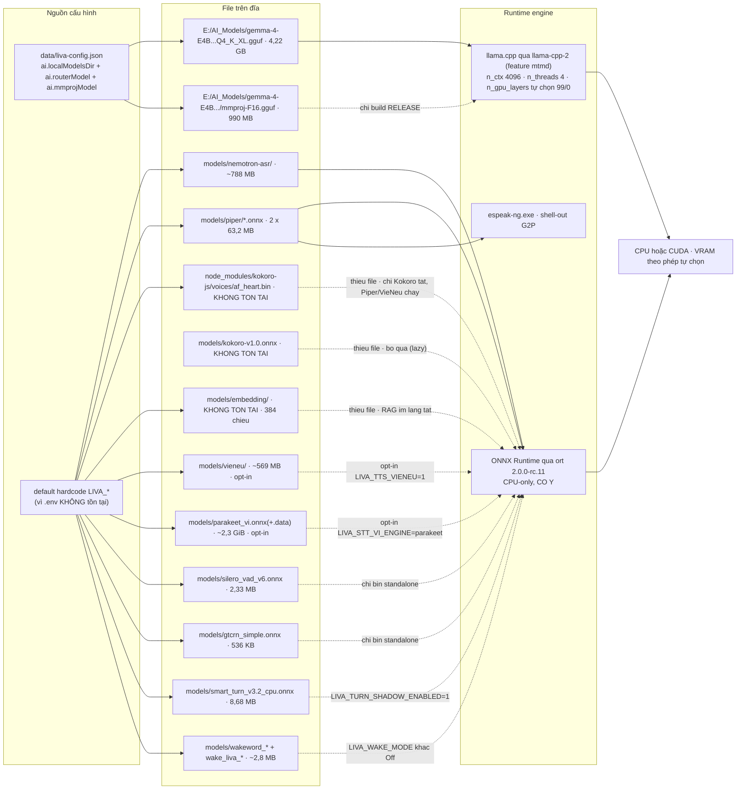

# Mô hình AI và tài nguyên

[⬆ Mục lục](../README.md) · [◀ Cấu hình và biến môi trường](01-cau-hinh-va-bien-moi-truong.md) · [Triển khai và runtime ▶](03-trien-khai-va-runtime.md)

---

Tài liệu này trả lời bốn câu hỏi vận hành:

1. LIVA cần những **file model** nào, file nào **thật sự có trên đĩa**, file nào thiếu?
2. Chạy LIVA thì tốn bao nhiêu **RAM/VRAM** (ước tính), và model nào chạy trên **CPU** hay **GPU**?
3. Muốn **build** được thì máy phải có sẵn gì?
4. Bốn **feature flag** `experimental` / `cuda` / `vulkan` / `openblas` thật sự làm gì?

> Nhắc lại quy ước nhãn: **[OK]** đang chạy thật · **[MỘT PHẦN]** có code nhưng tắt/opt-in/chưa nối dây · **[THIẾU]** chưa có/stub.

---

## 1. Nguồn sự thật của đường dẫn model

`data/models-manifest.json` là nguồn sự thật duy nhất về **danh mục tải**:
profile, group năng lực, kích thước, URL, SHA-256, vị trí LLM/resource và hướng
dẫn tải tay. Cả `scripts/models.mjs` (máy dev) lẫn `liva-native-core/src/setup`
(bản cài không có Node) đọc cùng manifest.

Snapshot được tính trực tiếp từ manifest ngày 31/07/2026:

| Profile | Số file | Tổng byte tham chiếu | Tự tải được | Ý nghĩa |
|---|---:|---:|---:|---|
| `minimal` | 13 | 2.451.859.081 B ≈ 2,28 GiB | 13 | đủ các group `required` |
| `full` | 29 | 6.392.994.515 B ≈ 5,95 GiB | 26 | toàn bộ catalog; 3 entry cần làm tay |

Mọi entry có `url` bắt buộc có SHA-256 và URL ghim revision; loader tải vào file
`.part`, hỗ trợ resume, kiểm hash trước khi rename. CI kiểm invariant này bằng
`npm run test:installer`.

Có **hai** cơ chế xác định model, và chúng không phải một:

| Loại model | Nguồn đường dẫn thật | Ghi chú |
|---|---|---|
| **LLM GGUF** (router + mmproj + expert) | `data/liva-config.json` → `ai.localModelsDir` + `ai.routerModel` / `ai.mmprojModel` / `ai.expertModel`; bản cài chuẩn hoá đường dẫn dev tuyệt đối sang thư mục dữ liệu của người dùng | Fallback hiện hành: `DEFAULT_MODELS_DIR = "E:\\AI_Models"`, router `gemma-4-E4B-it-qat-GGUF/...Q4_K_XL.gguf`, expert `gemma-4-12B-it-qat-UD-Q4_K_XL.gguf` |
| **ONNX / Piper / VieNeu / VAD / wake** | biến `LIVA_*` → nếu không có thì default hardcode trong code, phần lớn đi qua `resolve_resource_path` | Tên biến và giá trị mặc định: xem tài liệu cấu hình |

> 📌 Nguồn đầy đủ (bảng ~60 biến `LIVA_*`, giá trị mặc định, các chỗ lệch `.env.example` vs code): [Cấu hình và biến môi trường](01-cau-hinh-va-bien-moi-truong.md)

**Cảnh báo quan trọng:** biến `LIVA_LLM_MODEL_DIR` mà `.env.example` quảng cáo **không hề được đọc** ở đường chạy thật — nó chỉ xuất hiện trong `src/bin/router_stress.rs:65` và `tests/integration_tests.rs:213`. Muốn đổi model LLM thì phải sửa `data/liva-config.json`, không phải `.env`.

Và vì **không có crate `dotenv`/`dotenvy` nào trong `Cargo.lock`** (grep → 0 kết quả) còn `.env` **không tồn tại**, mọi `std::env::var("LIVA_*")` đều fail ⇒ **toàn bộ đường dẫn ONNX đang chạy bằng default hardcode**.

---

## 2. Bảng model trong repo — `models/`

Tất cả weights (`*.onnx`, `*.onnx.data`, `*.gguf`, `*.bin`, `*.wav`) đều bị gitignore (`.gitignore:31-37`, `:142-150`), phải fetch out-of-band. Các JSON nhỏ (config/tokenizer/voices, `piper/*.onnx.json`) **cố ý giữ tracked** để thư mục model tự tài liệu hoá (`.gitignore:147-148`).

| File | Có? | Kích thước | Dùng cho gì | Nguồn tải |
|---|---|---|---|---|
| `nemotron-asr/encoder.onnx` + `.data` | ✅ | 2,68 MB + **690 MB** | STT chính — RNN-T encoder **[OK]** | nested git repo LFS (`models/README.md:10`) |
| `nemotron-asr/decoder.onnx` + `.data` | ✅ | 4,7 KB + 59,8 MB | STT decoder **[OK]** | ↑ |
| `nemotron-asr/joint.onnx` + `.data` | ✅ | 2,1 KB + 37,8 MB | STT joint **[OK]** | ↑ |
| `nemotron-asr/tokenizer.json`, `vocab.txt` | ✅ | 695 KB / 77 KB | BPE cho STT **[OK]** | ↑ |
| `nemotron-asr/silero_vad.onnx` | ✅ | 2,24 MB | VAD fallback (v5) **[MỘT PHẦN]** | ↑ |
| `parakeet_vi.onnx` | ✅ | **41,9 MB** (`models/README.md:11` ghi "1.1MB graph" — **sai số liệu**) | STT tiếng Việt chất lượng cao, FastConformer-CTC 0.6B **[MỘT PHẦN]** (opt-in `LIVA_STT_VI_ENGINE=parakeet`) | export NeMo từ `nvidia/parakeet-ctc-0.6b-Vietnamese` |
| `parakeet_vi.onnx.data` | ✅ | **2.435.002.372 B ≈ 2,27 GiB** | weights external của Parakeet | ↑ |
| `parakeet_vi_vocab.json` | ✅ | 10 KB | 1024 BPE token | ↑ |
| `silero_vad_v6.onnx` | ✅ | 2,33 MB | VAD chính (được ưu tiên) **[OK]** — cả Tauri và standalone dựng qua `VoiceRuntimeComponents::from_env` | snakers4/silero-vad |
| `gtcrn_simple.onnx` | ✅ | 536 KB | Khử ồn trước VAD/STT (MIT) **[MỘT PHẦN]** | sherpa-onnx release |
| `smart_turn_v3.2_cpu.onnx` | ✅ | 8,68 MB | End-of-turn shadow (BSD-2) **[MỘT PHẦN]** — cần `LIVA_TURN_SHADOW_ENABLED=1` | pipecat-ai/smart-turn-v3 |
| `wakeword_melspec.onnx` | ✅ | 1,09 MB | mel-spectrogram cho pipeline wake **[MỘT PHẦN]** | livekit/rust-sdks (Apache-2.0) |
| `wakeword_embedding.onnx` | ✅ | 1,33 MB | embedding wake **[MỘT PHẦN]** | ↑ |
| `wake_liva_en.onnx` | ✅ | 184 KB | classifier wake EN — recall 98,8% / FPPH 1,74 @0.5 **[MỘT PHẦN]** | tự train 2026-07-04 |
| `wake_liva_vi.onnx` | ✅ | 185 KB | classifier wake VI — **chất lượng kém** (FPPH 19,4 @0.5) **[MỘT PHẦN]** | tự train 2026-07-05 (VoxCPM) |
| `wake_fixtures/hey_livekit.onnx`, `positive.wav`, `negative.wav` | ✅ | 952 KB / 64 KB / 64 KB | fixture test `wake_model.rs` | livekit fixtures |
| `piper/vi_VN-vais1000-medium.onnx` (+ `.onnx.json`) | ✅ | 63.201.294 B (md5 `5e42428c…`) | TTS tiếng Việt local-first **[OK]** | rhasspy/piper-voices |
| `piper/en_US-lessac-medium.onnx` (+ `.onnx.json`) | ✅ | 63.201.294 B (md5 `2fc642b5…` — **khác file**, trùng size vì cùng kiến trúc *medium*) | TTS tiếng Anh **[OK]** | ↑ |
| **`kokoro-v1.0.onnx`** | ❌ **KHÔNG có** | — | TTS EN premium — đây là **default của `LIVA_TTS_MODEL_PATH`** **[THIẾU]** | phải tự tải |
| `node_modules/kokoro-js/voices/af_heart.bin` | ❌ **KHÔNG có** | — (bản 522.240 B duy nhất trên máy nằm ở `teamwork_projects/omnivoice_poc/voices/af_heart.bin`, không phải đường dẫn code đọc) | voice embedding Kokoro — default của `LIVA_TTS_VOICE_PATH` (`liva-native-core/src/main.rs:111`). ~~đọc **EAGER** lúc init (`tts/mod.rs:290`)~~ — **sửa 22/07/2026**: `TtsManager::from_bin` (`liva-native-core/src/tts/mod.rs:284-319`) nay đọc-được-thì-dùng, đọc-không-được thì `tracing::warn!` + `Vec::new()` (`liva-native-core/src/tts/mod.rs:295-306`); Kokoro chỉ lỗi khi thật sự bị gọi **[THIẾU]** | npm `kokoro-js` — **gói không được cài**: `package.json` không khai, `node_modules/` (645 mục) không có thư mục `kokoro-js` |
| `vieneu/vieneu_prefill.onnx` | ✅ | 324 KB | VieNeu-TTS prefill **[MỘT PHẦN]** (opt-in `LIVA_TTS_VIENEU=1`) | HF `pnnbao-ump/VieNeu-TTS-v3-Turbo` |
| `vieneu/vieneu_decode_step.onnx` | ✅ | 306 KB | decode autoregressive | ↑ |
| `vieneu/vieneu_acoustic_cached.onnx` | ✅ | 7,21 MB | acoustic model | ↑ |
| `vieneu/vieneu_backbone_shared.data` | ✅ | **415 MB** | weights backbone Qwen3 | ↑ |
| `vieneu/vieneu_v3_heads.npz` | ✅ | 52,2 MB | tied embedding/head (đọc bằng `ndarray-npy`, `tts/vieneu/mod.rs:132`) | ↑ |
| `vieneu/moss_audio_tokenizer_decode_full.onnx` + `_shared.data` | ✅ | 682 KB + 44,2 MB | codec MOSS 48 kHz | OpenMOSS `MOSS-Audio-Tokenizer-Nano-ONNX` |
| `vieneu/sea_g2p.bin` | ✅ | 50,1 MB | phonemizer tiếng Việt | pnnbao97/sea-g2p |
| `vieneu/tokenizer.json`, `config.json`, `voices_v3_turbo.json`, `codec_browser_onnx_meta.json` | ✅ | 22 KB / 2,1 KB / 117 KB / 17 KB | tokenizer + preset giọng | ↑ |
| **`embedding/model.onnx` + `embedding/tokenizer.json`** | ✅ **đã tải & kiểm chứng 22/07/2026** (448 MB + 16 MB, gitignored) | 448 MB + 16 MB | Embedding **384 chiều** cho bộ nhớ dài hạn/RAG, **tách khỏi model chat** (`EMBEDDING_DIM` `liva-native-core/src/llm/embedder.rs:43`, `resolve_model_dir()` `:52-68` — mặc định `models/embedding`, override `LIVA_EMBEDDING_MODEL_DIR`; `EmbeddingEngine::load` `:85-129`). Thiếu file thì RAG **im lặng tắt** kèm `tracing::warn!("Bo nho dai han TAT: …")`, không lỗi chí mạng. **[OK]** — test `embed_that_khi_co_model` (`embedder.rs:352-373`) nạp model thật, kiểm 384 chiều + chuẩn hoá L2 + semantic (câu gần nghĩa điểm cao hơn câu lạc đề). **Cạm bẫy đã sửa cùng ngày:** bản export ONNX này ĐÒI input `token_type_ids` (dù luôn = 0); embedder ban đầu không cấp nên `session.run` báo "Missing Input" và RAG hỏng dù đã có model — nay đọc input model khai báo (`embedder.rs:117-121`) rồi cấp `token_type_ids`=0 khi cần (`embedder.rs:180-184`) | HF `intfloat/multilingual-e5-small` (export ONNX fp32) — `models/README.md:14`. **Script tải:** `node scripts/fetch-embedding-model.mjs` (thêm `--dir <đường dẫn>` nếu để chỗ khác) |
| `ggml-vocab-llama-bpe.gguf` / `-spm.gguf` | ✅ | 7,82 MB / 724 KB | fixture test vocab-only — bản `-spm` dùng ở `liva-native-core/src/llm/engine.rs:534`, còn `-bpe` **không được `engine.rs` đụng tới**, nó chỉ xuất hiện ở `liva-native-core/src/bin/router_stress.rs:76` | llama.cpp |
| `asr_example.wav`, `gtcrn_test_noisy.wav` | ✅ | 64 KB / 77 KB | fixture test | — |

### 2.1 Hai cái bẫy file — một cái đã được gỡ

1. **`kokoro-v1.0.onnx` thiếu nhưng KHÔNG gây chết** — Kokoro nạp **lazy** (`tts/engine.rs:24-32`), thiếu file thì bỏ qua, TTS vẫn chạy bằng Piper.
2. ~~**`node_modules/kokoro-js/voices/af_heart.bin` thiếu thì CHẾT CẢ TTS** — file này đọc **EAGER** ngay lúc khởi tạo (`tts/mod.rs:290`); thiếu ⇒ `TtsManager = None` ⇒ mất luôn **cả Piper lẫn VieNeu**, dù hai engine đó không liên quan gì tới Kokoro. Đây là phụ thuộc ngược đời nhất trong chuỗi model.~~ — **ĐÃ SỬA 22/07/2026.** `TtsManager::from_bin` không còn trả `Err` khi thiếu voice embedding: nó `tracing::warn!` rồi dùng `Vec::new()` (`liva-native-core/src/tts/mod.rs:295-306`), nên `TtsManager` vẫn được tạo và **Piper/VieNeu chạy bình thường**; chỉ riêng Kokoro là không dùng được. Có test hồi quy chốt đúng điều ngược lại với câu gạch ngang ở trên: `thieu_voice_kokoro_van_dung_duoc_tts` khẳng định `res.is_ok()` (`liva-native-core/src/tts/mod.rs:500-512`). Giữ nguyên văn cũ vì nó từng là phụ thuộc ngược đời nhất trong chuỗi model — bối cảnh đáng nhớ, nhưng nay không còn đúng.

---

## 3. LLM GGUF — `E:\AI_Models\` (ngoài repo)

Khớp `data/liva-config.json` → `ai.localModelsDir = "E:\\AI_Models"`.

| File | Có? | Kích thước | Vai trò | Trạng thái |
|---|---|---|---|---|
| `gemma-4-E4B-it-qat-GGUF/gemma-4-E4B-it-qat-UD-Q4_K_XL.gguf` | ✅ | 4,22 GB | **Router LLM đang chạy thật** (`liva-config.json` → `ai.routerModel`) | **[OK]** |
| `gemma-4-E4B-it-qat-GGUF/mmproj-F16.gguf` | ✅ | 990 MB | Vision projector hiện hành; phải cùng repo QAT và đúng hash | **[MỘT PHẦN]** — đường vision Windows cần build RELEASE |
| `Qwen3-VL-2B-Instruct-GGUF/Qwen3-VL-2B-Instruct-Q4_K_M.gguf` + `mmproj-F16.gguf` | ✅ | 1,11 GB + 819 MB | Router/vision thay thế có ghim manifest | **[THIẾU]** — config hiện hành không trỏ tới |
| `Qwen3-VL-2B-Instruct-GGUF/mmproj-Qwen3VL-2B-Instruct-Q8_0.gguf` | ✅ | 445 MB | mmproj thay thế, nhẹ hơn | **[THIẾU]** — không config nào trỏ tới |
| `gemma-4-12B-it-qat-UD-Q4_K_XL.gguf` | ✅ | 6,72 GB | `ai.expertModel`, đồng thời là hằng số `DEFAULT_EXPERT_MODEL` (`liva-native-core/src/lib.rs:67`) | **[THIẾU]** — **chưa có code swap expert tự động** |
| Còn lại: `DeepSeek-R1-Distill-Qwen-14B/32B`, `Gemma-2-9B`, `Llama-3-8B`, `Qwen2.5-*`, `Qwythos-9B`, `gemma-4-26B-A4B*`, `gemma-4-E2B/E4B` | ✅ | 3 – 19,8 GB mỗi file | kho model rời | **[THIẾU]** — không config nào trỏ tới |

### 3.1 Cấu hình chết / trỏ sai (đã kiểm chứng)

| Chỗ | Vấn đề |
|---|---|
| ~~`data/models.config.json`~~ — **đã xoá 22/07/2026** | ~~Nội dung `{"llm":{"provider":"gemma","model":"gemma-4-26B-A4B-it-UD-Q6_K.gguf"},"stt":{...},"tts":{"provider":"edge-tts"}}` — file GGUF này **không tồn tại** trên đĩa (`E:\AI_Models` chỉ có bản `-UD-Q4_K_M`), và **không có dòng Rust nào đọc file này** ⇒ cấu hình chết hoàn toàn~~ — file đã bị **xoá hẳn** trong đợt dọn mã chết 22/07/2026 (cùng đợt gỡ crate `webrtc`, `prng.rs`, `webrtc/signaling.rs`). `data/` nay không còn `models.config.json`; giữ dòng gạch ngang này để người đọc tài liệu cũ biết nó đã đi đâu, chứ đây **không còn** là một cấu hình chết đang tồn tại. |
| `liva-config.json` → `avatar.live2dModel` = `models/live2d/pio/index.json`, `avatar.vrmModel` = `models/vrm/…` | Thư mục `models/live2d` và `models/vrm` **không tồn tại** ở root; asset thật nằm ở `liva-ui/public/models/{live2d,vrm}` |
| `.env.example` `LIVA_LLM_MODEL_DIR=E:\AI_Models` | Không được đọc ở runtime (xem mục 1). `models/README.md:22` vẫn ghi "LLM GGUF đặt theo `LIVA_LLM_MODEL_DIR` (xem `.env.example`)" — **mô tả sai chỗ này**. Còn ~~`README.md:155`~~ vốn bị dẫn nhầm (dòng đó là cảnh báo về bộ tài liệu Node.js gateway đã xoá): chỗ nói về model LLM là `README.md:173`, và nay nó ghi **ĐÚNG** — có hẳn câu "There is no `LIVA_LLM_MODEL_DIR` environment variable at runtime — that name only appears in a stress-test binary" |

> 📌 Nguồn đầy đủ của danh sách chỗ lệch giữa `.env.example` và code (dòng số, biến, hướng lệch): [Cấu hình và biến môi trường](01-cau-hinh-va-bien-moi-truong.md)

---

## 4. Ánh xạ model → module → thiết bị



---

## 5. Bảng tài nguyên RAM/VRAM

> ⚠️ **ĐÂY LÀ ƯỚC TÍNH.** Các con số RAM dưới đây được suy ra từ **kích thước file thật trên đĩa** cộng overhead runtime thông thường, **chưa đo bằng profiler**. Chỉ dùng để lên kế hoạch dung lượng máy, **không dùng làm số liệu công bố**.
>
> Cột "File thật trên đĩa" thì **chính xác** (đo bằng `ls`/`Get-Item`).

| Model | File thật trên đĩa | RAM ước tính | VRAM | Thiết bị |
|---|---|---|---|---|
| Nemotron ASR (3 ONNX + tokenizer) | ≈ **788 MB** | ~0,9–1,1 GB | 0 | **CPU** (ORT) |
| Router LLM GGUF | Gemma-4 E4B QAT Q4_K_XL **4,22 GB** | ~5–8 GB + KV-cache `n_ctx=4096` | **0 hoặc offload 99 layer** theo VRAM trống/override | CPU hoặc CUDA (llama.cpp, 4 threads) |
| VieNeu-TTS v3 Turbo (opt-in) | ≈ **569 MB** | ~0,7 GB | 0 | **CPU** |
| Parakeet-vi CTC 0.6B (opt-in) | 41,9 MB + **2,27 GiB** | ~2,4–2,8 GB | 0 | **CPU** |
| Piper TTS vi + en | 2 × 63,2 MB | ~0,08–0,15 GB | 0 | **CPU** |
| Kokoro TTS EN | **KHÔNG tồn tại** | 0 | 0 | — |
| Embedding 384 chiều (RAG, `models/embedding/`) | **KHÔNG tồn tại** | 0 (chưa nạp được) | 0 | CPU (ORT) — thiếu file ⇒ bộ nhớ dài hạn tắt |
| Silero VAD v6 | 2,33 MB | ~10 MB | 0 | CPU — **không nạp trong Tauri** |
| GTCRN denoise | 536 KB | ~5 MB | 0 | CPU — chỉ bin standalone |
| Smart Turn v3.2 | 8,68 MB | ~20 MB | 0 | CPU — opt-in |
| Wake-word (3 model) | ≈ **2,8 MB** | ~10 MB | 0 | CPU — mặc định `Off` |
| **Tổng đường mặc định** (Tauri + Nemotron + router + Piper) | — | **≈ 6–10 GB RAM** nếu CPU | **0 hoặc khoảng trọng số router+projector**, còn chừa 2 GiB | CPU khi không đủ điều kiện; CUDA khi build hỗ trợ và phép tự chọn trả 99 |

### 5.1 Vì sao VRAM không còn là hằng số 0

Runtime hiện quyết định theo ba điều kiện, không còn mặc định cứng CPU:

1. **Biến `LIVA_LLM_N_GPU_LAYERS` có mặt** thì giá trị hợp lệ override mọi phép tự chọn; file `.env` vẫn không được runtime tự nạp.
2. **Biến vắng** thì `boot::gpu_layers_mac_dinh` đọc VRAM trống và kích thước router+projector: đủ thêm 2 GiB dự phòng → 99, còn lại → 0. Không đọc được NVML/driver hoặc kích thước file cũng fail-safe về 0.
3. **Binary phải có backend CUDA.** Nếu build CPU-only, số layer không tạo ra GPU backend.
ORT vẫn cố ý **không** bật CUDA: STT, TTS, VAD, wake, denoise, turn và embedding ONNX chạy CPU-only. Phép tự chọn chỉ áp dụng cho router/mmproj llama.cpp.

Hệ quả: watcher downshift chỉ có tác dụng khi số layer bình thường khác `LIVA_GAME_N_GPU_LAYERS`; trên máy được tự chọn 99, fullscreen có thể hạ về 0 rồi nạp lại model. Reload xóa KV cache nên đây vẫn là cơ chế **[MỘT PHẦN]**, cần tránh dao động.

> 📌 Nguồn đầy đủ về ngưỡng governor và logic phát hiện tải nặng: [Thị giác passive và governor](../01-ban-ve/06-thi-giac-passive-va-governor.md)

Muốn thật sự dùng GPU cho LLM:

```powershell
# 1) build release có cuda
cargo build --release --features cuda
# 2) đặt biến TRƯỚC khi chạy (không có .env loader!)
$env:LIVA_LLM_N_GPU_LAYERS = "99"
$env:LIVA_GAME_N_GPU_LAYERS = "20"   # số layer khi phát hiện game
```

---

## 6. Điều kiện tiên quyết build

### 6.1 Rust / native

| Yêu cầu | Chi tiết | Vì sao |
|---|---|---|
| **Rust ≥ 1.85** | `liva-native-core` dùng `edition = "2024"`; `liva-desktop/src-tauri` dùng `edition = "2021"` | edition 2024 cần toolchain 1.85+ |
| **CMake + trình biên dịch C++** | MSVC Build Tools trên Windows | `llama-cpp-sys-2` build **llama.cpp từ mã nguồn C++** |
| **LLVM + biến `LIBCLANG_PATH`** | CI đặt tường minh: `.github/workflows/test.yml` → `env: LIBCLANG_PATH: 'C:\Program Files\LLVM\bin'` + bước `run: choco install llvm -y` | `bindgen` cần libclang |
| **Mạng ở lần build đầu** | `ort = "2.0.0-rc.9"` (`liva-native-core/Cargo.toml:29`, resolve thật là **rc.11**) **không** đặt `default-features = false` ⇒ bật `download-binaries` ⇒ tải ONNX Runtime từ `https://cdn.pyke.io/0/pyke:ort-rs/ms@1.23.2/x86_64-pc-windows-msvc.tar.lzma2` (`ort-sys/build/download/dist.txt:6`), verify SHA256, cache trong `~/.cargo` | **Điểm phụ thuộc mạng cứng nhất của toàn dự án** — mọi thứ STT/TTS/VAD/wakeword đều đứng trên `ort` |
| **CUDA toolkit** | chỉ khi build `--features cuda`. RTX 5060 Ti / Blackwell cần **CUDA 12.8+** và `CUDAARCHS=120a-real` (comment `liva-desktop/src-tauri/Cargo.toml:22-24`) | backend GPU của llama.cpp |
| **WebView2 Runtime** | Windows 11 có sẵn | vỏ Tauri v2 render UI |

**Build đầu rất lâu** — root `Cargo.toml:8-12` ép `opt-level = 3` cho `llama-cpp-2` và `llama-cpp-sys-2` **ngay cả ở profile dev**:

```toml
[profile.dev.package.llama-cpp-2]
opt-level = 3

[profile.dev.package.llama-cpp-sys-2]
opt-level = 3
```

**Output tập trung ở `E:\Project\LIVA\target\`** (workspace root). Thư mục `liva-native-core\target\` là **tàn dư tiền-workspace**, đừng tìm binary ở đó.

### 6.2 Nhị phân ngoài phải có trên PATH

| Binary | Bắt buộc? | Resolver | Hậu quả nếu thiếu |
|---|---|---|---|
| **`espeak-ng`** | Có, nếu dùng Piper/Kokoro | `LIVA_ESPEAK_PATH` → PATH → `C:\Program Files\eSpeak NG\espeak-ng.exe` → `C:\Program Files (x86)\...` (`tts/espeak.rs:11-36`), cache `OnceLock` | Nếu tất cả fail thì spawn tên trần và lỗi lúc gọi — G2P chết ⇒ TTS không phát âm |
| **`ffmpeg`** | Chỉ cho voice Telegram | `tokio::process::Command::new("ffmpeg")` (`telegram.rs:333`) — **không có fallback dò đường dẫn** | `"ffmpeg decoding failed"` (`telegram.rs:350`). Temp file `%TEMP%/tg_voice_{id}.ogg\|.raw` (`telegram.rs:329-330`) |

### 6.3 Node / JS

- **Node ≥ 20** (`package.json:5-7`); CI dùng **Node 22** + `npm ci`.
- Pre-commit (`.husky/pre-commit`): `npx lint-staged` rồi `node scripts/ai-pre-commit.cjs`.
  - `.lintstagedrc.json` **chỉ có** `"*.ts": ["eslint --max-warnings 0 --no-warn-ignored"]` — **KHÔNG có `tsc`**, và **`*.vue` không được xử lý**, trái với mô tả trong `CLAUDE.md`.
  - `ai-pre-commit.cjs` **cần file `.env`** với `AI_BASE_URL` / `AI_API_KEY` / `AI_MODEL` (fallback `http://127.0.0.1:8000/v1`, `local-ghost-router`, `gemma-4-E4B-it-Q6_K.gguf` — **model này KHÔNG có** trên `E:\AI_Models`, ở đó chỉ có `-Q4_K_M` và `gemma-4-E4B_q4_0-it.gguf`). Bypass: `SKIP_AI_HOOK=1` (`ai-pre-commit.cjs:8`).
- CI (`.github/workflows/test.yml`, windows-latest) chạy vitest cho `liva-ui` + `cargo test` cho core; clippy có chạy nhưng không chặn, không có gate `fmt`. Điều đáng nhớ ở đây là **CI cài `choco install llvm` và đặt `LIBCLANG_PATH`** — tức máy local cũng phải có đủ hai thứ đó thì mới build được.

  > 📌 Nguồn đầy đủ (bảng test, bảng binary verify, từng bước CI pipeline): [Kiểm thử và CI](04-kiem-thu-va-ci.md)

---

## 7. Feature flags `experimental` / `cuda` / `vulkan` / `openblas`

Khai báo thật, `liva-native-core/Cargo.toml:64-80` (khối chú thích 66-76 giải thích ba module bị loại khỏi build mặc định):

```toml
[features]
default = []
# Ba module chưa nối dây vào bất kỳ đường chạy nào: evolution/ (self-correction
# sandbox), passive/ (hook bàn phím/chuột), agent/dispatcher.rs (swarm).
# Bật để phát triển tiếp: cargo test --features experimental
experimental = []
cuda = ["llama-cpp-2/cuda"]
vulkan = ["llama-cpp-2/vulkan"]
openblas = []
```

Forward ở vỏ Tauri, `liva-desktop/src-tauri/Cargo.toml:20-26`:

```toml
[features]
cuda = ["liva-native-core/cuda"]
vulkan = ["liva-native-core/vulkan"]
```

| Flag | Thực tế làm gì | Trạng thái |
|---|---|---|
| `experimental` | **Thêm 22/07/2026.** Đây là flag DUY NHẤT thật sự rẽ nhánh mã nguồn: gate `passive/`, `evolution/`, `agent/dispatcher.rs` (`liva-native-core/src/lib.rs:12`, `:14`, `liva-native-core/src/agent/mod.rs:4`) và bốn file test (`liva-native-core/tests/sandbox_stress.rs:5`, `liva-native-core/tests/self_correction_stress.rs:5`, `liva-native-core/tests/swarm_stress_tests.rs:5` gate cả file; `liva-native-core/tests/integration_tests.rs:331` gate một test). **Không** forward ở vỏ Tauri | **[MỘT PHẦN]** — code còn đó nhưng **ngoài build mặc định**; bật bằng `cargo test --features experimental` |
| `cuda` | Pass-through tới `llama-cpp-2/cuda`. **Chỉ** khi build với nó thì `LIVA_LLM_N_GPU_LAYERS` / `LIVA_GAME_N_GPU_LAYERS` mới có tác dụng thật | **[MỘT PHẦN]** — hoạt động nhưng cần thêm biến env mới thấy hiệu quả |
| `vulkan` | Pass-through tới `llama-cpp-2/vulkan`, được forward ở Tauri | **[MỘT PHẦN]** — chưa có bằng chứng đã kiểm chứng chạy |
| `openblas` | **Feature RỖNG hoàn toàn** — `openblas = []`, không map sang `llama-cpp-2/openblas`, không có `#[cfg]` nào. Bật hay không **không đổi gì** | **[THIẾU]** — dead flag |

### 7.1 Ba sự thật hay bị hiểu nhầm

1. **Không có một `#[cfg(feature = "cuda" | "vulkan" | "openblas")]` nào trong toàn bộ source** (grep → 0 kết quả): ba flag GPU/BLAS chỉ là đường ống tới `llama-cpp-2`. ~~LIVA **không rẽ nhánh code** theo feature flag~~ — kết luận tổng quát này **hết đúng từ 22/07/2026**: toàn repo có 7 chỗ `#[cfg(feature = …)]` và **tất cả** đều là `experimental` (`liva-native-core/src/lib.rs:12`, `:14`, `liva-native-core/src/agent/mod.rs:4`, `liva-native-core/tests/integration_tests.rs:331`, `liva-native-core/tests/sandbox_stress.rs:5`, `liva-native-core/tests/self_correction_stress.rs:5`, `liva-native-core/tests/swarm_stress_tests.rs:5`).
2. **`openblas` là dead flag.** `CLAUDE.md` liệt kê `--features openblas` như một lựa chọn build hợp lệ — điều này **sai**. Vỏ Tauri thậm chí **không forward** nó.
3. **Vision chỉ chạy ở build RELEASE — đây là ràng buộc RUNTIME, không phải feature flag.** Guard nằm ở `liva-native-core/src/llm/engine.rs:401-411`:

```rust
// Vision needs a RELEASE build on Windows: the debug CRT asserts in the
// clip/mmproj file loader (llama.cpp links the debug CRT, Rust the release
// one → fd-table mismatch) and aborts the process. Return a clean error
// instead of crashing (callers surface it as a spoken/UI apology).
if cfg!(all(windows, debug_assertions)) {
    return Err(
        "Vision requires a release build (debug CRT assertion in the mmproj loader) — \
         run the core with `cargo build --release`."
            .to_string(),
    );
}
```

Nghĩa là: `cargo build` (debug) → gọi `vision:ask` sẽ trả lỗi sạch chứ không crash; muốn dùng vision **bắt buộc** `--release`.

### 7.2 Lệnh build tham chiếu

```powershell
# CPU thuần, mặc định — build được nhưng KHÔNG dùng vision
cd liva-native-core
cargo build

# Release + CUDA — cấu hình duy nhất chạy được vision + GPU offload
cargo build --release --features cuda

# Bản desktop
npx tauri build -- --features cuda

# Blackwell (RTX 5060 Ti): cần CUDA 12.8+
$env:CUDAARCHS = "120a-real"
```

---

## 8. Checklist trước khi chạy trên máy mới

Với bản cài, không kiểm tay từng file: cửa sổ Setup tự mở khi thiếu group bắt
buộc; `setup:status` giải thích năng lực bị mất, `setup:fetch` tải/verify và
`setup:paths` chỉ đúng vị trí trên máy. Bảng dưới đây dành cho người build từ
mã nguồn hoặc chẩn đoán sâu.

| # | Kiểm tra | Cách xác minh | Hậu quả nếu thiếu |
|---|---|---|---|
| 1 | `models/nemotron-asr/` đầy đủ (~788 MB) | `ls models/nemotron-asr` | STT chết — `SttManager` fail |
| 2 | `node_modules/kokoro-js/voices/af_heart.bin` tồn tại — **chỉ cần nếu muốn dùng Kokoro** | `ls node_modules/kokoro-js/voices/` (trên cây hiện tại **luôn thất bại**: gói `kokoro-js` không được cài) | ~~**Mất toàn bộ TTS** (kể cả Piper/VieNeu) — đọc EAGER~~ → từ 22/07/2026 chỉ là **Kokoro không dùng được**; Piper/VieNeu vẫn chạy, kèm `tracing::warn!` (`liva-native-core/src/tts/mod.rs:295-306`) |
| 3 | `models/piper/*.onnx` + `.onnx.json` | `ls models/piper` | Mất giọng vi/en local-first |
| 4 | `E:\AI_Models\Qwen3-VL-2B-Instruct-GGUF/…Q4_K_M.gguf` | đối chiếu `data/liva-config.json` | ~~**Panic khi khởi động** — `LlamaRouterManager::new` lỗi~~ → **KHÔNG panic**: `LlamaRouterManager::new` (`liva-native-core/src/llm/engine.rs:117-128`) chỉ gọi `get_backend()` rồi trả `engine: None`, nó không mở file GGUF. Thiếu file thì `load_configured_router_model` ghi `tracing::error!("Router model not found at …")` rồi `return` (`liva-native-core/src/lib.rs:257-264`); tiến trình chạy tiếp, **chỉ là không có LLM** |
| 5 | `models/embedding/model.onnx` + `tokenizer.json` (384 chiều) | `ls models/embedding` | Bộ nhớ dài hạn/RAG **im lặng tắt** kèm `tracing::warn!("Bo nho dai han TAT: …")` — phần còn lại chạy bình thường |
| 6 | `espeak-ng` trên PATH | `espeak-ng --version` | TTS không phát âm |
| 7 | `LIBCLANG_PATH` trỏ tới LLVM | `$env:LIBCLANG_PATH` | Build fail ở bindgen |
| 8 | CMake + MSVC Build Tools | `cmake --version` | Build fail ở `llama-cpp-sys-2` |
| 9 | Mạng ở lần build đầu | — | `ort` không tải được ONNX Runtime ⇒ fail |
| 10 | `ffmpeg` trên PATH | `ffmpeg -version` | Chỉ mất voice Telegram (không bắt buộc) |
| 11 | RAM trống ≥ ~9 GB | — | Swap nặng khi nạp router LLM (ước tính, xem mục 5) |

---

## Liên quan

**Đọc tiếp theo mạch:** [◀ Cấu hình và biến môi trường](01-cau-hinh-va-bien-moi-truong.md) · [Triển khai và runtime ▶](03-trien-khai-va-runtime.md)

**Tài liệu này dựa vào (nguồn sự thật ở nơi khác):**

- [Cấu hình và biến môi trường](01-cau-hinh-va-bien-moi-truong.md) — bảng đầy đủ biến `LIVA_*` (đường dẫn model, `LIVA_LLM_N_GPU_LAYERS`, các cờ opt-in) và danh sách chỗ lệch `.env.example` vs code
- [Kiểm thử và CI](04-kiem-thu-va-ci.md) — bảng test, binary verify và các bước CI; ở đây chỉ trích phần CI cài LLVM/`LIBCLANG_PATH`
- [Thị giác passive và governor](../01-ban-ve/06-thi-giac-passive-va-governor.md) — ngưỡng governor và logic game-aware mà mục "VRAM = 0" tham chiếu
- [Đường ống thoại](../01-ban-ve/03-duong-ong-thoai.md) — chuỗi xử lý thoại, bảng backend TTS và engine STT tiêu thụ các model liệt kê ở đây
- [Hệ LLM và prompt](../01-ban-ve/04-he-llm-va-prompt.md) — cấu hình LLM, persona, cách router dùng file GGUF
- [Báo cáo khảo sát gốc 2026-07](../03-danh-gia/00-bao-cao-khao-sat-goc-2026-07.md) — nguồn dữ liệu đo đạc gốc

**Tài liệu khác dựa vào tài liệu này:**

- [Triển khai và runtime](03-trien-khai-va-runtime.md) — lấy điều kiện tiên quyết build và checklist model trước khi chạy
- [Đường ống thoại](../01-ban-ve/03-duong-ong-thoai.md) — lấy kích thước/tình trạng file model STT-TTS thật trên đĩa
- [Hệ LLM và prompt](../01-ban-ve/04-he-llm-va-prompt.md) — lấy bảng GGUF ở `E:\AI_Models` và trạng thái router/expert/mmproj
- [Đối chiếu tuyên bố vs thực tế](../03-danh-gia/01-doi-chieu-tuyen-bo-vs-thuc-te.md) — bằng chứng theo từng mốc; các kết luận CPU/VRAM cũ phải đọc kèm commit đo
- [Nợ kỹ thuật và rủi ro](../03-danh-gia/02-no-ky-thuat-va-rui-ro.md) — lấy các cấu hình chết (`models.config.json`, `openblas`) và phụ thuộc EAGER `af_heart.bin`

**Khi sửa code sau đây thì phải cập nhật tài liệu này:**

- `data/liva-config.json` — nguồn thật của đường dẫn LLM GGUF (mục 1, mục 3)
- `liva-native-core/src/paths.rs` — hằng số và resolver đường dẫn model; `boot.rs` — autoload và `gpu_layers_mac_dinh` (mục 1, 3, 5)
- `liva-native-core/src/boot.rs` — task GPU downshift dùng chung cho standalone và Tauri (mục 5.1)
- `liva-native-core/src/llm/embedder.rs` — model embedding 384 chiều tách riêng (mục 2, 4, 5, 8)
- `liva-native-core/Cargo.toml` + `liva-desktop/src-tauri/Cargo.toml` — khai báo và forward feature `cuda`/`vulkan`/`openblas`, phiên bản `ort` (mục 6.1, mục 7)
- `Cargo.toml` (root) — override `opt-level = 3` cho `llama-cpp-*` ở profile dev (mục 6.1)
- `liva-native-core/src/llm/engine.rs` — guard "vision cần build RELEASE" (mục 7.1)
- `liva-native-core/src/tts/*` (đặc biệt `tts/mod.rs`, `tts/engine.rs`, `tts/vieneu/mod.rs`) — Kokoro lazy vs `af_heart.bin` EAGER, danh sách file VieNeu (mục 2, 2.1, 5)
- `liva-native-core/src/stt/parakeet.rs` — model Parakeet-vi, lý do ORT CPU-only (mục 2, 5.1)
- `liva-native-core/src/telegram.rs` — phụ thuộc `ffmpeg` (mục 6.2)
- `scripts/ai-pre-commit.cjs` + `.github/workflows/test.yml` — yêu cầu Node/`.env` và điều kiện build phía CI (mục 6.3)
