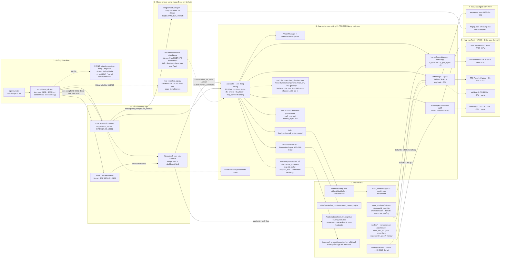

# Triển khai & Runtime

> **Runtime delta 31/07/2026:** `npm run dev` khởi động Tauri với core Rust nhúng và
> WebSocket gateway thật trên `127.0.0.1:8002`; gateway và IPC dùng chung `AppState`.
> Launcher chỉ kiểm tra 5173/8002, chỉ dọn tiến trình thuộc checkout LIVA, và có
> `-CheckOnly` để preflight không thay đổi tiến trình. Bản cài tự mở cửa sổ Setup khi
> thiếu model bắt buộc; lỗi boot DB/khoá hiện ra MessageBox có hướng khắc phục thay vì
> chỉ biến mất. Các kết luận lịch sử “script kill mọi port / desktop không bind
> gateway / voice fields là None” không còn đúng với runtime hiện tại.

[⬆ Mục lục](../README.md) · [◀ Mô hình AI và tài nguyên](02-mo-hinh-ai-va-tai-nguyen.md) · [Kiểm thử và CI ▶](04-kiem-thu-va-ci.md)

---

Tài liệu này mô tả **những tiến trình thực sự chạy** khi khởi động LIVA, cổng mạng chúng mở, model nạp vào RAM/VRAM, và **cách chạy đúng**.

Điểm cốt lõi phải nắm trước khi đọc tiếp:

> **Cập nhật 26/07/2026 — đảo ngược kết luận cũ.** `npm run dev` là đủ. Vỏ Tauri **nhúng lõi
> in-process và tự bind `127.0.0.1:8002`**, nên toàn bộ đường thoại full-duplex (VAD · denoise ·
> AEC · WakeGate) **có** chạy ở luồng mặc định. `scripts/start_all.ps1` kill 5173/8002 trước khi
> bật là **điều kiện cần** để vỏ Tauri bind được, không phải một lỗ hổng.
>
> Từ 26/07/2026 hai vỏ dùng chung `liva-native-core/src/boot.rs#build_app_state` +
> `#spawn_background_services`, nên danh sách dịch vụ nền **giống hệt nhau** — kể cả bot Telegram
> và tác vụ giải phóng TTS lúc rảnh, hai thứ trước đó chỉ gateway mới có.
>
> Chạy `liva-native-core.exe` tay giờ chỉ cần khi bạn muốn **đường IPC qua stdin/stdout** (ví dụ
> `scripts/e2e-gateway-ci.mjs`), không phải để "có đủ tính năng".
>
> ⚠ Phần khảo sát lịch sử bên dưới còn nhiều chỗ viết theo kết luận cũ; những chỗ đã đối chiếu lại
> đều có nhãn ghi rõ.

---

## 1. Sơ đồ triển khai tổng thể

Sơ đồ dưới đây là góc nhìn **triển khai** (tiến trình · cổng · file trên đĩa · bộ nhớ), không phải sơ đồ kiến trúc phần mềm. Nếu bạn cần bản đồ tầng/module và quan hệ giữa chúng, xem tài liệu kiến trúc.

> 📌 Nguồn đầy đủ (sơ đồ kiến trúc tổng thể): [Kiến trúc tổng thể](../01-ban-ve/01-kien-truc-tong-the.md)



### 1.1 Đọc sơ đồ theo từng vùng

| Vùng | Ý nghĩa | Trạng thái |
|---|---|---|
| **1 · Khởi động** | `npm run dev` → `scripts/start_all.ps1`. Script dọn **2 cổng** (5173, 8002 — chỉ tiến trình thuộc checkout này) rồi bật 2 dịch vụ. Dọn 8002 là **điều kiện cần** để vỏ Tauri bind được. | **[OK]** |
| **2 · Tiến trình chạy thật** | Vite dev (`:5173`) + `LIVA.exe` (vỏ Tauri) + WebView2 con. | **[OK]** |
| **3 · Core in-process** | `liva-native-core` được **nhúng như thư viện** vào `LIVA.exe`, chia sẻ một `AppState` (Arc + tokio Mutex cho 9/13 field; `db`, `crypto`, `tts_player`, `mcp_server` tự lo đồng bộ nên không bọc Mutex — `liva-native-core/src/lib.rs:33-52`). Không có tiến trình lõi riêng, không có socket giữa UI và core. | **[OK]** — trừ `OFFV`, `T2` |
| **4 · File trên đĩa** | Config, SQLite, Stronghold vault, thư mục `models/`, GGUF ngoài repo. | **[OK]** — trừ `KOK` |
| **5 · RAM/VRAM** | Mọi model chạy **CPU thuần**; VRAM ≈ 0 vì `n_gpu_layers = 0`. | **[OK]** |
| **6 · Có code nhưng không chạy** | Chỉ còn service Python `liva-voice` (chạy tay, không client nào gọi). ~~Binary gateway standalone · Telegram bot · event `gateway-ready` giả~~ — **cả ba hết đúng 26/07/2026**: vỏ Tauri bind 8002 và chạy Telegram qua `boot::spawn_background_services`; `gateway-ready` phát sau khi bind thật. | **[MỘT PHẦN]** |
| **7 · Nhị phân ngoài** | `espeak-ng.exe`, `ffmpeg.exe` — phải có trên PATH. | **[OK]** nếu đã cài |

---

## 2. Bảng tiến trình, cổng, phụ thuộc

| Tiến trình | Lệnh khởi động | Cổng | Phụ thuộc | Bắt buộc? |
|---|---|---|---|---|
| `node` / Vite dev server (liva-ui) | `npm run dev -w liva-ui`, do `scripts/start_all.ps1:56` gọi | TCP `127.0.0.1:5173` (HTTP + WS HMR) | Node/npm, deps của `liva-ui` | **Có** ở chế độ dev; bản build dùng `frontendDist: ../liva-ui/dist` nên không cần |
| **`LIVA.exe`** — vỏ Tauri v2 + core nhúng in-process | `npx tauri dev --no-dev-server` (`start_all.ps1:66`) | **Bind `ws://127.0.0.1:8002/ws`** qua `boot::spawn_background_services`; UI↔core đi qua Tauri `invoke`, client ngoài đi qua WS | Rust ≥1.85 (edition 2024), CMake, LLVM/`LIBCLANG_PATH`, WebView2 Runtime, `data/liva-config.json`, `models/`, `E:\AI_Models` | **Có** — đây là tiến trình chính, panic nếu mở DB thất bại (`liva-desktop/src-tauri/src/lib.rs:281`, `:283`) hoặc dẫn xuất khoá Stronghold lỗi (`:408`). ~~"hoặc `LlamaRouterManager::new` lỗi"~~ — vẫn còn `.expect` ở `:345` nhưng không kích hoạt được: `LlamaRouterManager::new` luôn trả `Ok` (`liva-native-core/src/llm/engine.rs:117-128`) |
| `msedgewebview2.exe` (WebView2) | tự sinh bởi `LIVA.exe`, 2 cửa sổ `widget` + `dashboard` | — | WebView2 Runtime | Có (tự động) |
| `espeak-ng.exe` | shell-out từ `tts/espeak.rs` khi cần G2P | — | phải nằm trên PATH hoặc `LIVA_ESPEAK_PATH` | Có nếu dùng TTS Piper/Kokoro |
| `ffmpeg.exe` | shell-out khi xử lý voice message Telegram | — | PATH | Không — chỉ cần cho voice Telegram, nhưng bot chạy ở **cả hai vỏ** |
| `liva-native-core.exe` (gateway standalone) | chạy tay: `cargo run -p liva-native-core` hoặc `target\debug\liva-native-core.exe` | **WS `ws://127.0.0.1:8002/ws`** (`LIVA_SERVER_HOST`/`LIVA_SERVER_PORT`) + IPC qua stdin/stdout | như trên + `models/silero_vad_v6.onnx`, `gtcrn_simple.onnx`, `smart_turn_v3.2_cpu.onnx` | **KHÔNG — và không cần.** Từ 26/07/2026 vỏ Tauri có đủ VAD/denoise/AEC/WakeGate/Telegram qua builder chung `boot.rs`. Chạy tay binary này chỉ cần khi muốn đường IPC **stdin/stdout** (vd `scripts/e2e-gateway-ci.mjs`). ⚠ Đừng chạy đồng thời hai vỏ — chúng tranh cùng cổng 8002 |
| `TelegramBotManager` (trong tiến trình trên) | tự bật khi có `TELEGRAM_BOT_TOKEN` | ra ngoài HTTPS `api.telegram.org` | token + `TELEGRAM_ALLOWED_IDS` | Không |
| `liva-voice` — `python liva_api.py` | `cd liva-voice; python liva_api.py` (thủ công) | **`0.0.0.0:8765`** HTTP + WS `/ws` + `/docs`, **không auth/CORS/rate-limit** | Python, fastapi/uvicorn, torch, edge-tts (cần Internet), yt-dlp, HF hub | **KHÔNG** — không file `.rs`/`.ts`/`.vue` nào gọi `8765`; `start_all.ps1` không nhắc tới cổng này |

### 2.1 Bảng cổng mạng

| Cổng | Ai mở | Giao thức | Bị `start_all.ps1` kill? | Ghi chú |
|---|---|---|---|---|
| `5173` | Vite dev server | HTTP + WS (HMR) | Có | Chỉ tồn tại ở dev; `devUrl: http://localhost:5173` trong `tauri.conf.json` |
| `8002` | **Vỏ nào đang chạy** — Tauri hoặc `liva-native-core.exe` | WebSocket `/ws` | **Có — và vỏ Tauri bind lại ngay sau đó** | `WebSocketServer::bind_from_env()` gọi từ `boot::spawn_background_services`, mặc định `127.0.0.1:8002` (`LIVA_SERVER_HOST`/`LIVA_SERVER_PORT`). Handshake qua **hai** hàng rào: sai path trả `404 NOT_FOUND` (chỉ chấp nhận `/ws`), rồi `Origin` phải nằm trong allow-list `origin_allowed()` (mở rộng bằng `LIVA_WS_ALLOWED_ORIGINS`) nếu không trả `403 FORBIDDEN`. ⚠️ **Đừng chạy đồng thời hai vỏ** — chúng tranh cùng cổng này |
| `8765` | `liva-voice/liva_api.py` | HTTP + WS + `/docs` | **Không** (script không biết cổng này) | Bind `0.0.0.0` → lộ ra LAN; không auth |
| `8000`, `8082`, `8100`, `8101` | *không tiến trình nào trong repo hiện tại* | — | Có | Di sản của kiến trúc Python đã xoá. **Đã gỡ khỏi danh sách kill** — `start_all.ps1` nay chỉ dọn 5173 và 8002 |

### 2.2 Ghi chú "gateway-ready" — ✅ **cạm bẫy đã gỡ 26/07/2026**

Sự kiện `gateway-ready` nay phát từ callback `on_gateway_ready` mà vỏ Tauri truyền vào
`boot::spawn_background_services`, và callback đó chỉ chạy **sau khi** `WebSocketServer::bind_from_env()`
trả `Ok` — mang cổng thật lấy từ `server.local_addr()`. Phía UI, `liva-ui/src/platform/TauriAdapter.ts:61`
vẫn lắng nghe event này; nó giờ là tín hiệu **đáng tin**.

<details><summary>Bản trước (hồ sơ) — vì sao nó từng là cạm bẫy</summary>

> Vỏ Tauri emit `gateway-ready` với payload **cứng** `{"port": 8002, "token": null}`, kèm comment
> trong code nói gateway "đã chạy sẵn do `start_all.ps1` khởi động" — sai với thực tế script.
> Hệ quả: log/UI báo "gateway sẵn sàng port 8002" trong khi có thể **không ai lắng nghe**.

Hai vế đều đã hết đúng: payload nay là cổng thật sau khi bind, và chính vỏ Tauri là bên bind.
Comment sai sự thật cũng không còn trong mã.

</details>

### 2.3 Ghi chú `.env` và biến môi trường

Điều duy nhất ảnh hưởng tới **cách chạy**: repo không có crate `dotenv`/`dotenvy`, nên `LIVA_*` chỉ có tác dụng khi được set **trong session shell trước khi chạy** (`$env:LIVA_... = "..."`); ghi vào `.env` là vô nghĩa. Danh sách biến, giá trị mặc định và độ lệch `.env.example` vs code nằm ở tài liệu cấu hình.

> 📌 Nguồn đầy đủ: [Cấu hình và biến môi trường](01-cau-hinh-va-bien-moi-truong.md)

---

## 3. Ngân sách bộ nhớ khi chạy (tóm tắt)

Con số cần nhớ để lên kế hoạch chạy: đường chạy mặc định (vỏ Tauri + Nemotron ASR + router LLM GGUF + Piper) chiếm **≈ 4–9 GB RAM** tuỳ file GGUF và **≈ 0 VRAM**, chạy **CPU thuần** kể cả khi build có feature `cuda`. Các thành phần opt-in cộng thêm: Parakeet-vi ≈ 2,4–2,8 GB, VieNeu-TTS ≈ 0,7 GB. `models/kokoro-v1.0.onnx` không tồn tại trong repo nên Kokoro không nạp được.

> 📌 Nguồn đầy đủ (bảng model, kích thước file, RAM/VRAM từng model): [Mô hình AI và tài nguyên](02-mo-hinh-ai-va-tai-nguyen.md)

### 3.1 Vì sao VRAM ≈ 0 dù build có `cuda`

Feature `cuda` (`liva-native-core/Cargo.toml`, `cuda = ["llama-cpp-2/cuda"]`) chỉ **biên dịch** backend CUDA vào llama.cpp. Số lớp thực sự đẩy lên GPU do `LIVA_LLM_N_GPU_LAYERS` quyết định, mặc định **0**. Kéo theo:

- Task 5 giây "GPU downshift game-aware" trong vỏ Tauri **early-return** vì `normal_layers = 0` → cơ chế nhường GPU cho game **[MỘT PHẦN]**: có code, không có tác dụng ở cấu hình mặc định. Ngưỡng và logic governor xem [Thị giác, quan sát thụ động và governor](../01-ban-ve/06-thi-giac-passive-va-governor.md).
- Muốn dùng GPU: build `cargo build --release --features cuda` **và** set `LIVA_LLM_N_GPU_LAYERS` > 0 trước khi chạy.

---

## 4. Cách chạy đúng

**Cập nhật 26/07/2026 — đảo ngược kết luận cũ.** Có hai **vỏ**, không phải hai "profile không tương
đương": **A · vỏ Tauri** (`LIVA.exe`, core nhúng in-process) và **B · gateway standalone**
(`liva-native-core.exe`). Từ `boot.rs`, cả hai dựng cùng một `AppState` và bật cùng một danh sách
dịch vụ nền — kể cả VAD·denoise·AEC·WakeGate·Telegram·WS `:8002`. Khác biệt còn lại chỉ là **đường
IPC**: vỏ A dùng Tauri `invoke`, vỏ B đọc stdin/stdout.

⇒ `npm run dev` cho bạn **đủ tính năng**. Chạy tay `liva-native-core.exe` chỉ cần khi muốn đường
stdin/stdout (vd bộ kiểm `scripts/e2e-gateway-ci.mjs`).

**Đừng chạy đồng thời hai vỏ.** Trước đây lời khuyên là "chạy cả hai để có đủ tính năng"; nay điều
đó vừa thừa vừa hỏng: cả hai đều bind `:8002`, nên vỏ khởi động sau sẽ **bind lỗi** (log
`WebSocket server bind lỗi`) — và hai tiến trình vẫn nạp model riêng, cộng đôi RAM.

<details><summary>Kết luận cũ (hồ sơ)</summary>

> Có **hai profile runtime tách biệt**: A · vỏ Tauri (…có UI/STT/TTS/LLM/vision/DB nhưng **không**
> VAD·denoise·AEC·WakeGate·Telegram·WS `:8002`) và B · gateway lõi standalone (…có đủ đường thoại
> full-duplex nhưng không có UI). `npm run dev` chỉ cho bạn profile A. Hai profile **không tự nối
> với nhau**…

Vế "vỏ Tauri không có VAD/WS" đã sai **từ trước** bản gộp; vế "không có Telegram" đúng cho tới
26/07/2026. Vế "không tự nối với nhau" vẫn đúng và nay còn quan trọng hơn — xem cảnh báo tranh cổng
ở trên.

</details>

> 📌 Nguồn đầy đủ (định nghĩa và ranh giới hai profile): [Kiến trúc tổng thể](../01-ban-ve/01-kien-truc-tong-the.md)

Phần dưới đây là **cách chạy đúng** từng profile — đây mới là nội dung riêng của tài liệu này.

### 4.1 Chuẩn bị trước khi chạy (một lần)

Cài dependency Node theo lockfile trước — gói `sqlite-vec` nằm trong đây, và
**thiếu nó là không mở nổi DB**, tức không phải suy giảm mà là chặn khởi động:

```powershell
cd E:\Project\LIVA
npm ci
```

Rồi kiểm bằng **một** lệnh thay cho danh sách `Get-Command` thủ công:

```powershell
powershell -File .\scripts\start_all.ps1 -CheckOnly
```

Nó không thay đổi tiến trình nào, và chạy hai bộ kiểm **bổ sung cho nhau** — cố ý là hai bộ, vì mỗi bộ mù đúng cái bộ kia thấy:

| Bộ kiểm | Trả lời | Thoát |
|---|---|---|
| `liva-native-core.exe --preflight` | **môi trường chạy**: profile build; bốn điều kiện vision; `espeak-ng`; `ffmpeg`; `vec0`; khoá mã hoá dữ liệu cá nhân (facts/transcript/checkpoint/outbox); allow-list Telegram; vị trí config | **luôn 0** — báo cáo, không phải cổng kiểm |
| `npm run doctor` | **file model trên đĩa** theo `data/models-manifest.json`: 12 group năng lực, hệ quả khi thiếu, biến override và lệnh tải | **1** khi thiếu group bắt buộc |

Chạy riêng từng cái cũng được:

```powershell
.\target\release\liva-native-core.exe --preflight
```

```bash
npm run doctor
```

Ba điểm dễ vướng:

- **`--preflight` chạy trước mọi khởi tạo** — không runtime Tokio, không mở DB, không nạp model. Đó là cả điểm của nó: phải trả lời được trên đúng cái máy chưa boot nổi.
- **Đọc bản `release` nếu có.** `-CheckOnly` ưu tiên `target\release\` rồi mới tới `target\debug\`, vì hàng "vision" phụ thuộc profile — báo theo bản debug sẽ nói vision không dùng được trong khi bản ship thì dùng được. Khi chỉ có bản debug, nó nói rõ điều đó.
- **Chạy từ thư mục gốc repo.** `data/liva-config.json` được dò từ cwd rồi hai
  cấp trên; hụt thì rơi về default Qwen3-VL Q4_K_M hiện hành. Hàng "Cấu hình"
  trong bảng đứng trước hai hàng model chính để phát hiện việc đang đọc fallback.

Còn UTF-8 cho tiếng Việt trên console thì `start_all.ps1` tự đặt; chạy tay thì:

```powershell
chcp 65001
```

### 4.2 Profile A — chạy vỏ Tauri (đường mặc định)

```powershell
cd E:\Project\LIVA
npm run dev
```

Tương đương thủ công, nếu muốn kiểm soát từng bước:

```powershell
# Terminal 1 — UI dev server
cd E:\Project\LIVA\liva-ui
npm run dev            # http://127.0.0.1:5173

# Terminal 2 — vỏ Tauri + core nhúng in-process
cd E:\Project\LIVA\liva-desktop
npx tauri dev --no-dev-server
```

Ghi chú:

- `--no-dev-server` là **cố ý**: Tauri không tự spawn Vite, nó chỉ trỏ tới `devUrl: http://localhost:5173` đã có sẵn. Nếu Vite chưa lên, cửa sổ sẽ trắng.
- Khi `LIVA.exe` thoát, khối `finally` của `start_all.ps1:67-91` kill tiến trình Vite và mọi `llama-server` còn sót (giải phóng VRAM).
- Nếu mở DB hoặc dẫn xuất khoá Stronghold thất bại, Tauri hiện MessageBox lỗi
  boot kèm hướng khắc phục rồi dừng có chủ đích. Thiếu GGUF không chặn app:
  việc nạp nằm ở task nền, chỉ chat không có model.

### 4.3 Profile B — chạy gateway lõi standalone (KHÔNG tự động)

`npm run dev` **không** khởi động binary này — nhưng từ 26/07/2026 điều đó **không còn nghĩa là bạn thiếu tính năng**: vỏ Tauri dựng cùng `AppState` và bật cùng danh sách dịch vụ nền (VAD · denoise · AEC · WakeGate · Telegram · WS 8002) qua `boot::spawn_background_services`. Chạy tay binary chỉ cần khi bạn muốn **đường IPC stdin/stdout**, hoặc muốn một tiến trình headless.

⚠️ **Đừng chạy đồng thời hai vỏ** — cả hai bind `:8002`.

```powershell
# Build trước. RELEASE là bắt buộc nếu cần vision — xem ghi chú dưới.
cd E:\Project\LIVA\liva-native-core
cargo build --release

# Chạy gateway — mở ws://127.0.0.1:8002/ws
cd E:\Project\LIVA
.\target\release\liva-native-core.exe
```

#### `vision:ask` — hai giới hạn, đều ĐÃ ĐO (26/07/2026)

**1. Bắt buộc build RELEASE trên Windows.** Ở debug, `answer_with_image` trả `Err` ngay chứ không chạy: CMake biên dịch llama.cpp với CRT **debug** (`/MDd`) ở profile Debug, còn Rust trên MSVC **luôn** link CRT release — hai bảng file-descriptor, và bộ nạp clip/mmproj assert rồi abort. Guard biến cú abort đó thành lỗi sạch, nên build debug **báo cho bạn** thay vì sập. Lưu ý `[profile.dev.package.llama-cpp-sys-2] opt-level = 3` **không** giúp gì ở đây: đó là tuỳ chọn Rust, không đụng CMake.

**2. Nó cần GPU — và có GPU thì nhanh.** Cùng ảnh, cùng 2 040 token (nx=60 × ny=34 cho màn hình 1920×1080), cùng model; chỉ đổi thiết bị:

| | CPU (`--release`) | GPU (`--release --features cuda`) |
|---|---|---|
| Mã hoá ảnh | 47,8 s | **0,56 s** |
| Giải mã token ảnh (4 batch) | 28,0 s | **0,29 s** |
| Trọn một lượt `vision:ask` | **~80 s** (80,2 / 81,3 / 79,0) | **1,2 s** (2,1 / 1,2 / 1,2) |

⇒ Vision **không chậm** — trên CPU nó chỉ đang chạy sai thiết bị. Ở 1,2 s nó nằm trong ngưỡng hội thoại; VRAM đỉnh 4,5 / 16 GB.

**Bật GPU:**

```powershell
cd liva-native-core
cargo build --release --features cuda --bin liva-native-core
cd ..
$env:LIVA_LLM_N_GPU_LAYERS = "99"    # 28 lớp LLM + 24 lớp tháp thị giác
.\target\release\liva-native-core.exe
```

⚠️ **Xác minh GPU thật sự vào cuộc trước khi tin số đo.** Log phải có `ggml_cuda_init: found 1 CUDA devices` và `layer N assigned to device CUDA0`. Không thấy hai dòng đó nghĩa là bạn đang đo lại CPU. `LIVA_LLM_N_GPU_LAYERS` cũng là công tắc của `MtmdContextParams.use_gpu`, nên để 0 là bộ mã hoá ảnh rơi về CPU dù binary có CUDA.

**Ghim kiến trúc GPU — luôn làm, không có lý do gì không.** `llama-cpp-sys-2` không ghim `CMAKE_CUDA_ARCHITECTURES` nên llama.cpp biên dịch **chín** thế hệ GPU. Ghim đúng máy bạn:

```powershell
$env:CUDAARCHS = "120a-real"   # sm_120 = Blackwell (RTX 50xx). Xem CMAKE_CUDA_ARCHITECTURES_NATIVE trong log cmake để biết của máy mình
cargo build --release --features cuda --bin liva-native-core
```

| | 9 kiến trúc | Ghim `120a-real` |
|---|---|---|
| Thời gian build | 19m57 | **6m17** |
| Binary | 202,5 MB | **74,5 MB** |
| `vision:ask` | 1,2 s | **1,4 s** (cùng dải) |

⚠️ **Đổi `CUDAARCHS` một mình KHÔNG kích hoạt build lại.** Nó không nằm trong `rerun-if-env-changed` của `build.rs`, và `cargo clean -p llama-cpp-sys-2` **không xoá** `target/release/build/llama-cpp-sys-2-*/out/` nên `CMakeCache.txt` cũ sống sót. Phải **xoá tay** thư mục đó. Dấu hiệu bạn đã làm sai: build "xong" trong vài chục giây và kích thước không đổi.

**Phát hành: cần kèm 752 MB DLL của NVIDIA.** Exe link lúc nạp cả `cudart` và `cublas`; driver chỉ cung cấp `nvcuda.dll` + `nvml.dll`, nên phải phát hành lại `cudart64_12.dll` (0,5 MB) + `cublas64_12.dll` (108 MB) + `cublasLt64_12.dll` (**643 MB**).

- **Thiếu chúng:** tiến trình **không khởi động**, exit **127**, không một thông báo nào — chết ở tầng nạp DLL trước khi mã LIVA chạy.
- **Có chúng:** chạy ở mọi máy. Không có GPU dùng được thì log `no CUDA-capable device is detected` rồi **rơi về CPU**, không sập.

⇒ Một bản CUDA duy nhất phục vụ được mọi máy, giá ~**830 MB** trước model. Quyết định phát hành còn mở — xem U1b/U1c.

> 📌 Nguồn đầy đủ (số liệu, log llama.cpp, giả thuyết cho debug build): [U1 trong backlog nâng cấp](../03-danh-gia/05-nang-cap-toan-dien.md)

Hoặc chạy trực tiếp bằng cargo (chạy từ **thư mục gốc repo** để đường dẫn `models/` và `data/` tương đối giải đúng):

```powershell
cd E:\Project\LIVA
cargo run --release -p liva-native-core
```

Đổi host/cổng khi cần (mặc định `127.0.0.1:8002`, `liva-native-core/src/websocket.rs:286-405`):

```powershell
$env:LIVA_SERVER_HOST = "127.0.0.1"
$env:LIVA_SERVER_PORT = "8002"
```

Kiểm chứng gateway đã thật sự lắng nghe — và **chỉ có một** tiến trình giữ cổng (hai vỏ đều bind 8002 nên chạy đồng thời là tranh cổng):

```powershell
Get-NetTCPConnection -LocalPort 8002 -State Listen |
  Select-Object LocalAddress, LocalPort, OwningProcess
```

### 4.4 Chạy đủ CẢ HAI profile

Vì `start_all.ps1` **kill** cổng 8002 ngay khi khởi động, thứ tự bắt buộc là: **chạy `npm run dev` trước, gateway sau**. Làm ngược lại thì gateway vừa bật đã bị script giết.

```powershell
# --- Bước 1: profile A (giữ cửa sổ này chạy) ---
cd E:\Project\LIVA
npm run dev

# --- Bước 2: mở PowerShell THỨ HAI, sau khi cửa sổ LIVA đã hiện ---
cd E:\Project\LIVA
$env:LIVA_SERVER_PORT = "8002"
# (tuỳ chọn) bật các thành phần opt-in:
# $env:LIVA_STT_VI_ENGINE = "parakeet"
# $env:LIVA_TTS_VIENEU    = "1"
# $env:TELEGRAM_BOT_TOKEN = "<token>"
.\target\release\liva-native-core.exe
```

Cảnh báo tài nguyên: hai tiến trình **nạp model độc lập**. Chạy song song ≈ gấp đôi phần ASR + LLM trong bảng mục 3 → dễ vượt 10–16 GB RAM. Trên máy ít RAM, hãy chọn một profile.

### 4.5 Profile C (tuỳ chọn) — service Python `liva-voice`

Hoàn toàn tách rời, **không** tiến trình Rust/TS nào gọi tới nó:

```powershell
cd E:\Project\LIVA\liva-voice
python liva_api.py     # FastAPI 0.0.0.0:8765, có /docs
```

Cảnh báo an ninh: bind `0.0.0.0` (lộ ra toàn LAN), **không auth, không CORS whitelist, không rate-limit**, và `edge-tts` gọi ra Internet — phá vỡ giả định offline. Chỉ bật khi thực sự cần voice-cloning, và cân nhắc đổi bind về `127.0.0.1`.

### 4.6 Chạy lệnh nào thì được gì

Bảng năng lực theo profile chỉ được duy trì tại
[Kiến trúc tổng thể §0.1](../01-ban-ve/01-kien-truc-tong-the.md#01-bảng-năng-lực-theo-profile--nguồn-sự-thật-duy-nhất).
Tóm tắt vận hành: `npm run dev` đã có UI, core nhúng, WS `:8002`, đường thoại và Telegram (khi cấu
hình); chạy standalone chỉ thêm stdin/stdout và bỏ UI. Không chạy hai vỏ cùng lúc vì chúng tranh
`:8002`. `python liva_api.py` là dịch vụ voice-cloning riêng ở `:8765`, không được hai vỏ tự bật.

---

## 5. Sự cố thường gặp khi khởi động

> **Đọc bảng này sau khi đã chạy `-CheckOnly` (mục 4.1).** Bốn dòng đầu tiên dưới đây — thiếu GGUF, thiếu `espeak-ng`, `LIVA_LLM_N_GPU_LAYERS` bằng 0, khoá mã hoá mặc định — giờ đều **phát hiện được trước khi chạy** thay vì phải suy ra từ triệu chứng. Bảng này giữ lại cho những gì chỉ lộ ra lúc chạy thật.

| Triệu chứng | Nguyên nhân theo code | Xử lý |
|---|---|---|
| Cửa sổ LIVA trắng trơn | Vite chưa lên nhưng `tauri dev --no-dev-server` đã chạy | Đợi `:5173` sẵn sàng rồi mới bật Tauri (mục 4.2) |
| MessageBox “LIVA không thể khởi động” | Mở DB lỗi, hoặc dẫn xuất khoá Stronghold lỗi | Làm theo hint trong hộp thoại; không xoá DB/vault để “thử lại” |
| Hint `database disk image is malformed` | SQLite hỏng | Không xoá file gốc; sao lưu toàn bộ thư mục dữ liệu rồi phục hồi theo runbook backup/restore |
| Hint `readonly` / `permission denied` | Thư mục dữ liệu không ghi được hoặc `LIVA_HOME` sai | Cấp quyền ghi cho `%LOCALAPPDATA%\com.liva.cognitive-os`, hoặc sửa `LIVA_HOME`; không chạy app từ thư mục chỉ đọc |
| Hint `database or disk is full` | Ổ chứa data/WAL hết chỗ | Giải phóng dung lượng; không xoá `-wal`/`-shm` khi LIVA còn chạy |
| Chat không trả lời dù app lên bình thường | Thiếu GGUF / sai `ai.routerModel`: task nền bỏ qua và chỉ ghi log `Router model not found at ...` | Kiểm tra `data/liva-config.json` và `E:\AI_Models\*.gguf`, rồi `llm:swap_model` hoặc khởi động lại |
| TTS im lặng hoàn toàn | `models/kokoro-v1.0.onnx` **không tồn tại** nên Kokoro không nạp được. ~~"hoặc thiếu `node_modules/kokoro-js/voices/af_heart.bin` (đọc **eager**, thiếu là hỏng cả `TtsManager`)"~~ — đó là hành vi cũ, đã sửa 22/07/2026: `from_bin` nay chỉ `tracing::warn!` rồi dùng vector rỗng (`tts/mod.rs:295-306`), Piper/VieNeu vẫn dựng được (test chống hồi quy `thieu_voice_kokoro_van_dung_duoc_tts`, `tts/mod.rs:500-512`) | Dùng Piper/VieNeu thay Kokoro. Chỉ khi thực sự muốn Kokoro mới cần đủ cả `.onnx` lẫn `af_heart.bin` |
| TTS phát ra sai ngữ điệu / lỗi G2P | Không có `espeak-ng` trên PATH | Cài espeak-ng hoặc set `LIVA_ESPEAK_PATH` |
| UI báo "gateway sẵn sàng" nhưng thoại full-duplex không hoạt động | ~~Event `gateway-ready` là hardcode, gateway thật chưa chạy~~ — **hết đúng 26/07/2026**: event nay phát sau khi bind thật. Nguyên nhân còn lại thường là **hai vỏ tranh cổng 8002** (đã chạy tay `liva-native-core.exe` rồi lại `npm run dev`), hoặc `Origin` bị allow-list từ chối (`403`) | `Get-NetTCPConnection -LocalPort 8002` xem **một** tiến trình đang giữ; tắt vỏ thừa. Nếu `403`, thêm origin vào `LIVA_WS_ALLOWED_ORIGINS` |
| Đặt `LIVA_*` trong `.env` nhưng không có tác dụng | Repo **không có `.env`** và **không có `dotenv`/`dotenvy`** trong `Cargo.lock` | Set biến trong shell: `$env:LIVA_... = "..."` trước khi chạy |
| GPU nhàn rỗi dù build `--features cuda` | `LIVA_LLM_N_GPU_LAYERS` mặc định `0` | Set `$env:LIVA_LLM_N_GPU_LAYERS = "<số lớp>"` |
| Cổng 8002 vừa bật đã chết | ~~"`start_all.ps1:24-35` kill 8101/8100/8002/8082/5173/8000 mỗi lần khởi động"~~ — hết đúng: launcher nay chỉ chạm **5173 và 8002** (`scripts/start_all.ps1:147`), và chỉ dừng tiến trình thuộc checkout LIVA (`Test-LivaOwnedProcess`); cổng bị tiến trình lạ giữ thì nó **báo lỗi chứ không kill**. Nguyên nhân còn lại: bật gateway lõi rồi lại `npm run dev` ⇒ vỏ Tauri thấy 8002 là LIVA-owned và dừng nó | Bật gateway **sau** `npm run dev`, hoặc chỉ chạy một vỏ (mục 4.4) |
| `models/nemotron-asr` luôn "modified" trong `git status` | Là **nested git repo có LFS**, không phải submodule đăng ký | Bỏ qua, đừng commit |

---

## 6. Đóng gói bản build (không dev)

```powershell
cd E:\Project\LIVA
npm run installer:windows   # kiểm cấu hình → build UI → xuất bộ cài NSIS
```

Một lệnh, ba bước, và bước đầu là **rẻ nhất bỏ đi nhiều nhất**: `check:installer`
bắt cấu hình đóng gói sai (thiếu resource, `licenseFile` trỏ hụt, WebView2 quay
về bản cần mạng, MSI lọt lại vào `targets`) trong vài giây, thay vì để lộ ra sau
20 phút biên dịch — hoặc tệ hơn, trên máy người dùng.

Ở bản build, `tauri.conf.json` dùng `frontendDist: ../../liva-ui/dist` (**hai**
cấp, vì giải từ `src-tauri/`) → **không cần Vite `:5173`**. `productName` là
`LIVA` nên binary/cửa sổ mang tên `LIVA.exe`.

Quyết định đóng gói đang có hiệu lực (28/07/2026):

| Điểm | Giá trị | Vì sao |
|---|---|---|
| Mục tiêu | **chỉ `nsis`** | MSI/WiX cài per-machine vào `Program Files` (chỉ đọc) trong khi NSIS cài per-user — hai bộ cài, hai ngữ nghĩa, không ai chọn |
| Thư mục **cài** | `%LOCALAPPDATA%\LIVA` | NSIS: `StrCpy $INSTDIR "$LOCALAPPDATA\${PRODUCTNAME}"` — không cần quyền admin |
| Thư mục **dữ liệu** | `%LOCALAPPDATA%\com.liva.cognitive-os` | **Phải khác thư mục cài**, nếu không trình gỡ xoá luôn ký ức và model |
| WebView2 | `offlineInstaller` | mặc định của Tauri cần Internet lúc cài, mâu thuẫn với định vị offline |
| Model | **không** đóng gói | 2,28 GB (bộ tối thiểu); tải ở lần chạy đầu qua cửa sổ thiết lập (`setup:fetch`), có cổng SHA-256 |
| CUDA | không | xem mục 4.3 — bản CUDA kéo theo ~752 MB DLL của NVIDIA |
| Ký số | chưa | chưa có chứng chỉ ⇒ SmartScreen cảnh báo mỗi lần cài |

Dữ liệu người dùng (`data/`, `models/`, config) nằm **ngoài** thư mục cài, dưới
`%LOCALAPPDATA%\com.liva.cognitive-os` (hoặc `LIVA_HOME`), nên nâng cấp và gỡ
cài đặt không làm mất. Máy đã có dữ liệu ở neo cũ (`%LOCALAPPDATA%\LIVA`, tức
trong thư mục cài) thì `user_home_dir()` **tiếp tục dùng chỗ cũ** — nhận diện
qua `liva-config.json`, database, hoặc thư mục `models` không rỗng, và **không**
qua sự tồn tại của `data/` (bộ cài tự đặt `data\models-manifest.json` ở đó).

Đừng đóng gói `data/liva-config.json` cạnh exe: `data_dir()` neo vào thư mục
chứa file đó, nên làm vậy là đưa database ký ức vào thư mục cài — và gỡ cài đặt
sẽ xoá nó. `scripts/check-installer-config.mjs` có một mục kiểm riêng cho đúng
cái bẫy này.

**Cổng chuỗi cung ứng.** Mọi entry có `url` trong `data/models-manifest.json`
bắt buộc có `sha256` 64 hex, và URL phải ghim revision bất biến. Cả hai bên tải
(`liva-native-core/src/setup`, `scripts/models.mjs`) băm theo dòng rồi mới
`rename` vào đường dẫn thật; lệch hash thì xoá file tạm và báo lỗi, kể cả khi
kích thước khớp. Thiếu hash ⇒ **fail closed**, không tải.

> 📌 Nguồn đầy đủ (cài, dùng, gỡ, khắc phục sự cố — cho người không biết code):
> [Cài đặt và sử dụng LIVA](05-cai-dat-cho-nguoi-dung.md)

Gateway standalone **vẫn không** được đóng gói vào luồng khởi động — nhưng từ
26/07/2026 điều đó không còn nghĩa là thiếu tính năng: vỏ Tauri bind `:8002` và
chạy đủ danh sách dịch vụ nền qua `boot::spawn_background_services` (mục 4.3).

### 6.1 Bản CUDA — bộ cài đã dựng và đo, 05/08/2026

Quyết định ở [U1b](../03-danh-gia/05-nang-cap-toan-dien.md#u1b--ghim-cudaarchs-và-quyết-định-cách-phát-hành) — **một** bản CUDA phục vụ mọi máy — nay đã được thi hành. Lệnh:

```powershell
npm run installer:windows:cuda
```

Nó thêm một bước trước luồng cũ: `scripts/stage-cuda-redist.mjs` chép ba DLL runtime của NVIDIA từ CUDA Toolkit vào `liva-desktop/src-tauri/cuda-redist/`, thư mục mà `tauri.conf.json` khai trong `bundle.resources` là `"cuda-redist": "./"`.

| Đo được | |
|---|---|
| `LIVA_1.0.0_x64-setup.exe` | **805,4 MB** (844 543 259 byte) |
| SHA-256 | `98F4A72CB1E060124D2170EA7566E2C4412488AA669A9DF05C13FCA826E0FBAB` |
| `liva-desktop.exe` sau khi cài | 229 MB |
| Ba DLL kèm theo | `cublasLt64_12.dll` 643,4 MB · `cublas64_12.dll` 108,4 MB · `cudart64_12.dll` 0,5 MB |
| Thời gian cài (im lặng) | **54 giây** |
| `vision:ask` sau khi cài | p50 **937 ms** · min 844 · max 2031 (mẫu 3 lượt, RTX 5060 Ti) |

**⚠️ KHÔNG ghim `CUDAARCHS` khi dựng bản phát hành.** Bản mặc định của `llama-cpp-sys-2` là `50-virtual;61-virtual;70-virtual;75-virtual;80-virtual;86-real;89-real;90-virtual;120a-real` — **phần lớn là `-virtual`, tức PTX do driver JIT lúc nạp**, và chính PTX đó khiến một binary chạy được trên card nó chưa từng được biên dịch cho. Ghim `120a-real` cắt binary 202 MB → 74,5 MB và build 20 phút → 6 phút **mà không mất tốc độ trên máy dev**, nên con số rất dễ bị đọc thành một quyết định phát hành. Nó không phải: máy RTX 30xx (sm_86) hay 40xx (sm_89) sẽ **không nạp nổi kernel CUDA**. Cảnh báo đã ghim tại chỗ trong `liva-desktop/src-tauri/Cargo.toml`.

Giá của 9 kiến trúc đã đo và **bằng không về hiệu năng**: 937 ms so với 877 ms của bản ghim, cả hai đều mẫu 3 lượt ⇒ chênh lệch nằm trong nhiễu.

**Bản CPU không đổi.** `npm run installer:windows` vẫn chạy được như cũ và không cần CUDA Toolkit: `build.rs` tạo sẵn `cuda-redist/` rỗng, và bundler của Tauri **bỏ qua thư mục rỗng**. Đây là lý do phải dùng *thư mục* chứ không phải mẫu glob — `tauri-utils` biến một glob không khớp gì thành `GlobPathNotFound`, lỗi cứng, đủ để làm đỏ cả `release.yml`.

### 6.2 Checklist "máy sạch" — do chạy thật sinh ra

Đo 05/08/2026 bằng cách cài bộ cài trên vào một thư mục trắng, rồi chạy `--preflight` với `PATH` rút còn `C:\Windows\System32` và mọi biến `LIVA_*` bị xoá.

| Hạng mục | Trên máy mới cài | Hậu quả nếu để nguyên |
|---|---|---|
| Profile build | ✓ release | — |
| GPU (NVML) | ✓ nếu có NVIDIA | không có thì vision rơi về CPU, ~80 s/lượt |
| **Model chat (router GGUF)** | ✗ **không có** | **không có não** — `chat:completion` và vision đều lỗi |
| Bộ chiếu thị giác (mmproj) | ✗ chưa cấu hình | không có vision |
| `liva-config.json` | ✗ không thấy | hai dòng model nói về **mặc định trong code**, không phải thứ app nạp |
| `espeak-ng` | ✗ không thấy | TTS sai ngữ điệu hoặc lỗi hẳn |
| `ffmpeg` | ✗ không thấy | chỉ mất voice Telegram; chat chữ vẫn chạy |
| `sqlite-vec (vec0)` | ✓ — nhưng xem cảnh báo dưới | thiếu là **chặn boot** |
| Khoá mã hoá | ? không đặt qua env | rơi về khoá thiết bị DPAPI |

`--preflight` **luôn `exit 0`** — nó báo cáo, không phải cổng kiểm. Kết luận: một máy mới cài **chạy được nhưng cụt gần hết**, và thứ chặn nhiều nhất là **model chưa tải**. Lệnh tải: `npm run doctor` liệt kê 11 năng lực kèm lệnh.

**⚠️ Hai giới hạn của phép đo này, nói rõ thay vì để người đọc tưởng là đủ.**

1. **`✓ sqlite-vec` ở trên xanh vì lý do SAI, và chỉ trên máy dev.** `vec0_candidate_paths` (`db.rs`) xếp **đầu** danh sách một đường dẫn `node_modules/…/vec0.dll` dựng từ `env!("CARGO_MANIFEST_DIR")` — **hằng số biên dịch cứng vào binary**, trỏ về cây mã nguồn. Máy dev có thư mục đó nên ứng viên 1 khớp và bản `vec0.dll` **đã cài cạnh .exe** (ứng viên 3) không bao giờ được thử tới. Sản phẩm vẫn đúng trên máy sạch thật — ở đó ứng viên 1 không tồn tại nên nó rơi xuống ứng viên 3 — nhưng **dòng ✓ này trên máy dev không chứng minh được bản đóng gói dùng được**.
2. **Bản thân phép chạy `--preflight` không nói gì về phụ thuộc cấp hệ điều hành** — nó kiểm model, PATH, GPU, config, chứ không kiểm thứ mà **DLL loader** cần *trước khi* một dòng mã LIVA nào chạy. Phần đó phải đọc bảng import của PE; xem §6.3.

### 6.3 Phụ thuộc cấp hệ điều hành — đọc từ bảng import, 05/08/2026

`dumpbin /dependents` trên `liva-desktop.exe` (bản CUDA phát hành) cho **43 DLL**. Phân loại chúng trả lời được câu hỏi mà `--preflight` không với tới: *một máy Windows sạch còn thiếu gì để LIVA khởi động nổi?*

| Nhóm | Ví dụ | Có sẵn trên Windows 11 gốc? |
|---|---|---|
| Win32 lõi | `kernel32` · `user32` · `advapi32` · `ole32` · `combase` · `shell32` | ✅ |
| Universal CRT (API set) | `api-ms-win-crt-*` (10 file) | ✅ — tên API-set, loader phân giải về `ucrtbase.dll` |
| Đồ hoạ | `d3d11` · `d3d12` · `dxgi` · `dwmapi` · `directml` | ✅ — `DirectML.dll` có từ Win10 1903 |
| NVIDIA driver | `nvcuda.dll` | ✅ nếu có driver NVIDIA; không có thì rơi về CPU |
| **CUDA Toolkit** | `cudart64_12` · `cublas64_12` (+ `cublasLt64_12` nạp động) | ✅ **đã kèm trong bộ cài** — xem §6.1 |
| **🔴 VC++ Redistributable** | **`MSVCP140.dll`** · **`MSVCP140_1.dll`** · `VCRUNTIME140.dll` | ❌ **KHÔNG** — và **KHÔNG kèm trong bộ cài** |

**🔴 Đây là lỗ hổng phát hành, và chế độ hỏng của nó y hệt thiếu cuBLAS: tiến trình chết trong DLL loader, exit 127, không một dòng thông báo.** Người dùng bấm icon và không có gì xảy ra.

Ba file `MSVCP140*` là **thư viện chuẩn C++ của MSVC**, đến từ *Microsoft Visual C++ 2015–2022 Redistributable (x64)*. LIVA cần chúng vì llama.cpp là C++ biên dịch bằng MSVC và link động vào CRT (`/MD`) — cùng cơ chế đã được truy ở [U1](../03-danh-gia/05-nang-cap-toan-dien.md#u1--build-release-và-kiểm-visionask-thật).

⚠️ **Đừng đọc "System32 có sẵn ba file đó" thành "máy nào cũng có".** Trên máy đo chúng NẰM trong `C:\Windows\System32` — nhưng đó là vì máy này đã cài `Microsoft Visual C++ v14 Redistributable (x64) 14.50.35719`. Chính bộ cài redist đặt chúng vào đó. Windows gốc không có. Đây đúng loại "xanh vì lý do sai" như dòng `vec0` ở §6.2: **kiểm sự tồn tại của file trên máy dev không chứng minh được gì về máy người dùng** — phải hỏi *file này đến từ đâu*.

**✅ WebView2 thì ngược lại — đã kèm, kiểm được.** `webviewInstallMode: offlineInstaller` khiến Tauri tải `MicrosoftEdgeWebView2RuntimeInstallerX64.exe` (**199,9 MB**, nằm trong cache `%LOCALAPPDATA%\tauri\x64\`) và nhúng vào NSIS. Phép cộng kích thước khớp: 229 MB exe + 752,3 MB DLL CUDA + 199,9 MB WebView2 + 0,3 MB `vec0` ≈ **1 182 MB thô → 805,4 MB** sau LZMA (68 %). Máy chưa có WebView2 sẽ được cài im lặng.

**Việc phải làm trước khi giao cho beta** — chọn một:

| Đường | Giá |
|---|---|
| Nhúng VC++ redist vào NSIS (hook `installer.nsi`) | +~25 MB, người dùng không phải làm gì |
| Ghi thành điều kiện tiên quyết trong [hướng dẫn cài](05-cai-dat-cho-nguoi-dung.md) | miễn phí, nhưng ai bỏ qua sẽ gặp exit 127 câm |
| Thêm phép kiểm vào `--preflight` | không cứu được, vì lỗi xảy ra **trước** khi `main()` chạy |

Đường thứ ba **không dùng được** và lý do đáng nhớ: một phép kiểm nằm *bên trong* chương trình không bao giờ chẩn đoán được thứ ngăn chương trình khởi động.

**Vẫn cần máy/VM thật:** xác nhận rằng một Windows chưa từng cài gì thực sự khởi động được sau khi có redist. Bảng trên thu hẹp câu hỏi từ *"không biết thiếu gì"* xuống *"thiếu đúng một thứ, đã biết tên"* — nhưng nó vẫn là suy luận từ bảng import, không phải một lần chạy thật.

**Một lỗi đã tìm ra và vá ngay trong lượt đo này.** `--preflight` báo `✗ … ~80 s mỗi lượt` trên đúng cái máy đang chạy vision **937 ms** — sai 85 lần, theo hướng doạ người dùng về một lỗi không tồn tại. Nguyên nhân: nó **chép lại** quyết định `n_gpu_layers` của `boot.rs` thay vì **gọi** quyết định đó, và `533f3c6` đã thêm nhánh tự chọn theo VRAM ở dưới. Nay `boot::gpu_layers_mac_dinh()` là `pub` và preflight gọi thẳng. Cùng lượt đó lộ thêm một tầng nữa: `gpu_layers_theo_vram` trả 0 **ngay khi không đo được kích thước model**, nên trên máy mới cài lý do thật là *"chưa có model"* chứ không phải VRAM — thông điệp đã tách ba ca để không đẩy beta tester đi săn một vấn đề GPU họ không có.

---

## Liên quan

**Đọc tiếp theo mạch:** [⬆ Mục lục](../README.md) · [◀ Mô hình AI và tài nguyên](02-mo-hinh-ai-va-tai-nguyen.md) · [Kiểm thử và CI ▶](04-kiem-thu-va-ci.md)

**Tài liệu này dựa vào (nguồn sự thật ở nơi khác):**
- [Kiến trúc tổng thể](../01-ban-ve/01-kien-truc-tong-the.md) — định nghĩa hai profile runtime A/B và sơ đồ kiến trúc tổng thể (mục 1, mục 4)
- [Mô hình AI và tài nguyên](02-mo-hinh-ai-va-tai-nguyen.md) — bảng model, kích thước file, RAM/VRAM từng thành phần (mục 3)
- [Cấu hình và biến môi trường](01-cau-hinh-va-bien-moi-truong.md) — danh sách `LIVA_*`, giá trị mặc định, lệch `.env.example` vs code (mục 2.3, 4.4)
- [Giao thức IPC và WebSocket](../01-ban-ve/02-giao-thuc-ipc-va-websocket.md) — bảng lệnh `handle_command` và khung nhị phân đi qua WS `:8002`
- [Đường ống thoại](../01-ban-ve/03-duong-ong-thoai.md) — chi tiết VAD/AEC/denoise/WakeGate, thứ chỉ tồn tại ở profile B
- [Thị giác, quan sát thụ động và governor](../01-ban-ve/06-thi-giac-passive-va-governor.md) — ngưỡng governor đứng sau task GPU downshift (mục 3.1)
- [Desktop Tauri](../03-he-thong-con/desktop-tauri.md) — cấu hình cửa sổ và bảng lệnh Tauri của `LIVA.exe`

**Tài liệu khác dựa vào tài liệu này:**
- [Kiểm thử và CI](04-kiem-thu-va-ci.md) — lấy cách khởi động tiến trình để chạy các binary verify
- [Đối chiếu tuyên bố vs thực tế](../03-danh-gia/01-doi-chieu-tuyen-bo-vs-thuc-te.md) — §0 đã viết lại 26/07/2026: `npm run dev` **có** bật gateway `:8002`
- [Nợ kỹ thuật và rủi ro](../03-danh-gia/02-no-ky-thuat-va-rui-ro.md) — lấy các mục `:8765` không auth và M4 (hai entry point lệch, đã khép 26/07/2026)
- [Lộ trình sửa lỗi và nâng cấp](../03-danh-gia/03-lo-trinh-sua-loi-va-nang-cap.md) — lấy khoảng trống "gateway không được đóng gói" làm đầu vào lộ trình

**Khi sửa code sau đây thì phải cập nhật tài liệu này:**
- `scripts/start_all.ps1` — bảng tiến trình (mục 2), danh sách cổng bị kill (2.1), thứ tự chạy hai profile (4.4)
- `liva-desktop/src-tauri/src/lib.rs` — event `gateway-ready` (2.2), task GPU downshift (3.1)
- `liva-native-core/src/boot.rs` — **đường khởi động dùng chung của cả hai vỏ**: đổi `build_app_state` hay `spawn_background_services` là đổi bảng tiến trình (mục 2), sơ đồ triển khai (mục 1) và mục "hai vỏ khác nhau ở đâu"
- `liva-desktop/src-tauri/tauri.conf.json` — `devUrl :5173`, `frontendDist`, `productName` (mục 2.1, 4.2, 6)
- `liva-native-core/src/main.rs` — bind host/cổng `:8002`, path `/ws`, mặc định biến môi trường (2.1, 4.3)
- `liva-native-core/Cargo.toml` — feature `cuda`/`vulkan` và lý do VRAM ≈ 0 (3.1)
- `data/liva-config.json` — `ai.localModelsDir` + `ai.routerModel`, nguồn GGUF nạp lúc khởi động (mục 1, 4.1, 5)
- `liva-ui/src/platform/TauriAdapter.ts` — phía UI lắng nghe `gateway-ready` (2.2)
- `liva-voice/liva_api.py` — profile C, cổng `:8765` và cảnh báo an ninh (2.1, 4.5)
