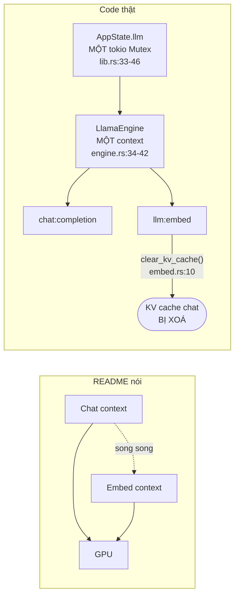
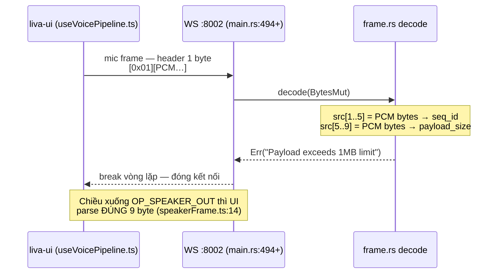

# Đối chiếu: LIVA tuyên bố gì — code làm gì

[⬆ Mục lục](../README.md) · [◀ Kiểm thử và CI](../02-van-hanh/04-kiem-thu-va-ci.md) · [Nợ kỹ thuật và rủi ro ▶](02-no-ky-thuat-va-rui-ro.md)

---

Tài liệu này đặt từng tuyên bố trong `README.md` (và trong `data/liva-config.json`, `.env.example`) cạnh bằng chứng đọc được từ mã nguồn. Mục đích **không** phải hạ thấp dự án, mà để mọi phát biểu ra bên ngoài (hồ sơ dự thi, README, demo cho beta tester) đều có chỗ dựa kiểm chứng được, và để đội phát triển biết chính xác chỗ nào cần nối dây tiếp.

> **🔴 NỢ ĐÃ BIẾT, ghi ra thay vì để người đọc tự vấp — toạ độ `lib.rs:<dòng>` và `agent/graph.rs:<dòng>` trong tài liệu này ĐÃ TRÔI tại `2dc8e2e` (05/08/2026).** Lát refactor đó đưa `lib.rs` **1 550 → 740** dòng và `agent/graph.rs` **1 947 → 806**, nên phần lớn số dòng dưới đây trỏ ra ngoài độ dài mới của file. Mã bị chuyển chứ không bị xoá — đích đến là `paths.rs`, `system_status.rs`, `graph/intent.rs`, `graph/memory_scope.rs`, `graph/pipeline.rs` và `commands/*`.
>
> **Vì sao `docs-citations` KHÔNG bắt được, và đây mới là phần đáng nhớ:** tên `lib.rs` tồn tại ở **4 file khác nhau** trong repo, nên bộ kiểm xếp cả 95 trích dẫn `lib.rs` vào rổ "không kiểm được" (207 trích dẫn, chốt 508) và cổng vẫn **exit 0**. Tức một cổng xanh ở đây có nghĩa là *"không có neo hỏng trong số neo kiểm được"*, **không** có nghĩa là "mọi toạ độ đều đúng". Cách sửa dứt điểm là chuyển sang **neo ký hiệu** (`lib.rs#handle_command`) — `node scripts/docs-citations.mjs --suggest` liệt kê 564 chỗ chuyển được. Chưa làm trong lát này vì nó là một đợt sửa cơ học riêng, không phải một phần của việc tách commit.

> **⚠️ Đợt đính chính 26/07/2026 — bốn phán quyết bị đảo, tất cả theo hướng tài liệu ĐANG NÓI XẤU sản phẩm.** Một bản đối chiếu lỗi thời nguy hiểm theo cả hai chiều: thổi phồng thì thành quảng cáo sai, mà hạ thấp thì thành thiệt hại tự gây — đặc biệt khi người đọc là giám khảo. Bốn mục đã sửa, mỗi mục ghi rõ "Đính chính" tại chỗ:
>
> | Mục | Bản trước nói | Thực tế tại `45e2e58` |
> |---|---|---|
> | Smart Home | "trả chuỗi thành công **vô điều kiện** — nguy hiểm hơn cả việc thiếu" | Báo trung thực là chưa có tích hợp; **có test ép** không được báo thành công giả (sửa 23/07/2026) |
> | MCP server Rust | "**MỒ CÔI** — `handle_command` không có nhánh nào gọi" | Đã nối qua `mcp:list_tools`/`mcp:call_tool`; **e2e sống xác nhận 4 tool** |
> | Bộ nhớ dài hạn | "`chat:completion` **chưa** tự động lưu ký ức" | Ghi và nhớ đúng trên **cả ba** cửa vào; **e2e 6/6 với model thật** |
> | Router ý định | "phân loại bằng `contains()` trên chuỗi thường" | Khớp **token trọn vẹn** + từ khoá tiếng Việt, có test hồi quy cho đúng các câu bản cũ hiểu sai |
>
> Bài học vận hành, không phải lời tự trách: `docs-check.mjs` **có** phát hiện cả bốn — nhưng chỉ ở mức *cảnh báo*, nên chúng tồn tại nhiều ngày. Xem [U5 trong backlog nâng cấp](05-nang-cap-toan-dien.md) về việc biến drift thành gate thật.

Quy ước nhãn dùng xuyên suốt:

| Nhãn | Nghĩa |
|---|---|
| **[OK]** | Đang chạy thật trên đường chạy chính, nối dây đầy đủ |
| **[MỘT PHẦN]** | Có code thật nhưng bị tắt mặc định / opt-in / chỉ sống ở một entry point / chưa nối dây tới UI |
| **[THIẾU]** | Chưa có, là stub, hoặc tuyên bố sai sự thật |

---

## 0. Điều kiện tiên quyết: MỘT lõi, HAI vỏ — và từ 26/07/2026 chúng dựng giống nhau

> **Viết lại 26/07/2026.** Mục này trước đây là tiền đề của cả tài liệu: *"LIVA có hai profile chạy
> không tương đương… Tauri shell **không** có WS server, hard-code bốn module thoại thành `None`,
> không wake gate, không Telegram."* Đối chiếu lại với mã nguồn hiện tại thì **phần lớn câu đó đã
> sai từ trước khi có bản gộp**, và nay thì sai hẳn. Giữ nguyên câu cũ ở đây sẽ làm lệch mọi phán
> quyết bên dưới, vì chúng đều đọc theo tiền đề này.

Cùng một `AppState`, cùng một `handle_command`, dựng ở **hai** điểm vào: gateway
`liva-native-core.exe` và vỏ desktop `liva-desktop` (cái mà `npm run dev` chạy). Từ 26/07/2026 cả
hai đi qua **cùng một** hàm — `boot::build_app_state()` dựng trạng thái, `boot::spawn_background_services()`
bật dịch vụ nền — nên danh sách "LIVA chạy những gì" chỉ còn **một chỗ** để đọc và một chỗ để sửa.

Hai vỏ chạy y hệt nhau: WebSocket server 8002, tự nạp model router, phóng chiếu bộ nhớ, hạ lớp GPU
khi có game, giải phóng TTS lúc rảnh, bot Telegram (khi có `TELEGRAM_BOT_TOKEN`), governor ưu tiên
CPU, và cụm thoại VAD/denoise/turn-shadow/AEC theo `VoiceRuntimeComponents::from_env`.

Khác biệt còn lại — và **chỉ** còn ngần này, đóng khung trong `boot::ServiceOptions`:

| | gateway | vỏ desktop |
|---|---|---|
| Vòng đọc lệnh từ **stdin** | có | không (dùng Tauri IPC `invoke`) |
| `ipc_tx` cho bot Telegram ghi ra stdout | có | `None` (bot vẫn chạy đủ) |
| Báo `gateway-ready` cho cửa sổ | không cần | có |
| Hiện lỗi boot / escrow khoá | stderr + `exit 1` | hộp thoại |

**Ba khẳng định cũ nay không còn đúng, ghi lại để ai đọc bản trước không bị lệch:**

1. *"Tauri không có WS server"* — sai **từ trước** bản gộp: vỏ Tauri vẫn spawn
   `WebSocketServer::bind_from_env()` trong `setup()`. Hệ quả kéo theo cũng sai: full-duplex,
   barge-in, `OP_SPEAKER_OUT`, wake word, VAD **có** sống trong luồng dev chuẩn.
2. *"hard-code bốn module thoại thành `None`"* — sai **từ trước** bản gộp: vỏ Tauri đã gọi
   `VoiceRuntimeComponents::from_env(&stt_model_dir)` như gateway.
3. *"không Telegram"* — **đúng cho tới 26/07/2026**, nay đã hết: bot chạy ở bất kỳ vỏ nào khi có
   token. Cùng đợt đó vá luôn một lệch thật khác chưa từng được ghi: vỏ desktop **không** có tác vụ
   giải phóng session TTS sau 5 phút rảnh, nên nó giữ session ONNX suốt đời tiến trình.

`scripts/start_all.ps1` vẫn kill tiến trình giữ port 8002 (`:105`) rồi chạy `liva-ui` +
`npx.cmd tauri dev --no-dev-server` (`:160`), **không** khởi động `liva-native-core`. Trước đây đó
là bằng chứng của một lỗ hổng; nay nó **đúng**, vì chính vỏ Tauri bind 8002. Comment "Gateway is
already running on port 8002" từng bị chỉ ra là sai sự thật cũng đã không còn trong mã.

> 📌 Nguồn đầy đủ (sơ đồ kiến trúc tổng thể): [Kiến trúc tổng thể](../01-ban-ve/01-kien-truc-tong-the.md)
> · [Triển khai và runtime](../02-van-hanh/03-trien-khai-va-runtime.md)
> — **hai tài liệu đó vẫn còn bảng "so sánh hai profile" theo trạng thái cũ, cần rà lại.**

---

## 1. Bảng đối chiếu đầy đủ

| Tính năng | Nguồn tuyên bố | Trạng thái | Bằng chứng (file:dòng) | Ghi chú |
|---|---|---|---|---|
| **Rust binary đơn + Tokio, không GC** | README:23 | **[OK]** | `main.rs:30-49` (`Builder::new_multi_thread`), `Cargo.toml` workspace | Đúng như mô tả. Đây là claim "hạ tầng" chắc nhất của README |
| **TTFT < 100 ms** | README:23 | **[THIẾU] — không có bằng chứng** | grep `TTFT\|Time-To-First\|100ms` trong `liva-native-core/src` → **0 hit** (chỉ `aec.rs:125` là comment về 100 ms audio) | Không có benchmark, assert, hay log nào đo TTFT. `verify_duplex.rs:66,140` chỉ assert VAD <15 ms và preemption <10 ms — **không phải** TTFT. Con số 100 ms là mục tiêu (*targeting*), không phải kết quả đo |
| **"Text generation và memory embedding chạy trên llama.cpp contexts TÁCH RỜI (decoupled), lưu ký ức và stream token ĐỒNG THỜI"** | README:23, :27 | **[THIẾU] — SAI SỰ THẬT** | `engine.rs:54-64` `LlamaRouterManager { engine: Option<LlamaEngine> }` — **một** engine; `LlamaEngine { context, mtmd, model }` (`engine.rs:34-42`) — **một** context. `liva-native-core/src/commands/llm.rs#embed` `llm:embed` mượn **chính** `engine.context`. `llm/embed.rs:10` `context.clear_kv_cache()` — **xoá sạch KV cache của chat**. `AppState.llm` là **một** `tokio::sync::Mutex` (`lib.rs:33-46`) khoá chung chat/embed/vision/swap | Không những không "decoupled", việc embed còn **phá** KV cache chat và block toàn bộ LLM. Xem phân tích sâu ở §2.1 |
| **In-Process Embeddings — "memory engine decoupled khỏi chat stream, tránh VRAM thrashing, giữ memory write khỏi hot path"** | README:27 | **[MỘT PHẦN]** — nửa đầu đúng, nửa sau sai | Embedding tính in-process qua `llama.cpp` thật (`llm/embed.rs`, `liva-native-core/src/commands/llm.rs#embed`) — **không** có embedding service ngoài, đúng | Nhưng "decoupled khỏi chat stream" và "off the hot path" là sai: cùng context, cùng Mutex, cộng thêm `clear_kv_cache()` |
| **Sequential Hot-Swap 4B Router ↔ 26B Expert, dùng `mmap`** | README:24 | **[MỘT PHẦN]** | Cơ chế swap có thật: `engine.rs:117-207`, `with_use_mmap(true)` (`engine.rs:140`), giải phóng engine + `sleep(500ms)` cho driver (`engine.rs:125-131`); lệnh `llm:swap_model` (`liva-native-core/src/commands/llm.rs#swap_model`) | **Không có code tự động swap Router→Expert.** `DEFAULT_EXPERT_MODEL` (`lib.rs:61`) và `ai.expertModel` (`data/liva-config.json:21`) chỉ được **ghi ra** trong config mặc định (`lib.rs:379,444`); grep toàn repo: **không file `.rs` nào đọc `ai.expertModel`**. Chỉ có `configured_router_model_path()` (`lib.rs:119-138`). Ngoài ra "26B" ≠ thực tế: config là `gemma-4-12B-it-qat-UD-Q4_K_XL.gguf` |
| **Router model** | README §Technical Highlights | **[OK] từ 05/08/2026** — hàng này đã ĐẢO hai lần, giữ nguyên vệt thay vì viết lại | `data/liva-config.json` `ai.routerModel` = `gemma-4-E4B-it-qat-GGUF/gemma-4-E4B-it-qat-UD-Q4_K_XL.gguf`, và `paths.rs#DEFAULT_ROUTER_MODEL` khớp đúng chuỗi đó | **Lịch sử của chính hàng này là bài học.** Bản 22/07 ghi "README nói Gemma 4B, thực tế Qwen3-VL-2B ⇒ README lỗi thời". Rồi `6723114` (02/08) đổi router sang **gemma-4-E4B**, khiến README *tình cờ* gần đúng trở lại trong khi hàng này thì sai — nó vẫn khẳng định router là Qwen. Vá ở `2dc8e2e`: README nay nói gemma-4-E4B ở cả 5 chỗ, các số đo trên Qwen được **giữ nguyên và dán nhãn có ngày** thay vì viết lại. ⇒ Một hàng "đã đối chiếu" **không tự đúng mãi**; nó đúng tại một sha và phải đo lại ở sha sau |
| **LLM GGUF lấy từ `LIVA_LLM_MODEL_DIR` (mặc định `E:\AI_Models`)** | README:155 | **[THIẾU]** | grep `LIVA_LLM_MODEL_DIR` trong code chạy → chỉ `src/bin/router_stress.rs:68` (bin test). Runtime đọc `data/liva-config.json` → `ai.localModelsDir` + `ai.routerModel` (`lib.rs:129-137`) | Env này **không tồn tại** ở runtime chính; `.env.example:28` cũng sai theo |
| **Nemotron ASR (ONNX) đa ngôn ngữ** | README:25 | **[OK]** | `stt/engine.rs:5-7,25-60` — 3 session ONNX encoder/decoder/joint (RNN-T thật, `decoder_hidden_state: vec![0.0; 2*1*640]`); model có trên đĩa (`models/nemotron-asr/encoder.onnx.data` 690 MB) | Claim đúng, giữ nguyên |
| **`voice:set_language` chuyển vi/en runtime** | README:25, :116 | **[MỘT PHẦN]** | `liva-native-core/src/commands/voice.rs#set_language` → `stt/mod.rs:140-149` `set_language(&mut self, code: &str)`; `stt/lang.rs:20-23` `VERIFIED_LANG_IDS: [("vi-VN",33),("en-US",0)]` | Bảng lang_id được xác định **bằng thực nghiệm** (comment `stt/lang.rs:1-17`), chỉ **2/39** id được verify, và **không caller nào phía UI**. "Multilingual" trên thực tế = **song ngữ cố định** |
| **Piper VITS (`vi_VN-vais1000` + `en_US-lessac`)** | README:25 | **[OK]** | `tts/mod.rs:194-254` `load_piper_voices` (quét `vi*.onnx`/`en*.onnx`), `tts/mod.rs:264-275` `piper_for_chunk`, `tts/mod.rs:388-402` ưu tiên Piper; file có thật: `models/piper/vi_VN-vais1000-medium.onnx` + `en_US-lessac-medium.onnx` (63 MB mỗi cái) | Auto-detect tiếng Việt theo dấu (`tts/mod.rs:101-105`). Claim đúng |
| **Kokoro = "optional premium English fallback"** | README:25 | **[THIẾU] — đảo ngược thực tế** | `models/kokoro-v1.0.onnx` **KHÔNG tồn tại** trên đĩa; `tts/engine.rs:27-31` báo lỗi khi thiếu — nhưng session là **lazy** (`ensure_session`), nên `TtsManager::from_bin` vẫn OK vì chỉ cần `node_modules/kokoro-js/voices/af_heart.bin` (**có** trên đĩa, 522 KB) | Kokoro thực chất là **nhánh chết**: nó là fallback cuối (`tts/mod.rs:404-418`), chỉ chạy khi không có Piper voice nào — mà Piper thì đã có sẵn. Đồng thời `af_heart.bin` lại là **điều kiện tiên quyết** để khởi tạo cả `TtsManager` |
| **espeak-ng G2P** | README:25 | **[MỘT PHẦN]** | `tts/espeak.rs:12` `LIVA_ESPEAK_PATH`; gọi ở `tts/mod.rs:404` và `webrtc/pipeline.rs:345` — **chỉ trong nhánh fallback Kokoro** | Piper tự phonemize. espeak-ng **không nằm trên đường chạy chính**, dù CLAUDE.md/README liệt kê nó như prerequisite |
| **Silero VAD ~0.7 s end-of-turn** | README:25 | **[MỘT PHẦN]** — con số **chính xác** | `webrtc/vad.rs:33-51` `VadConfig::from_env()` → `speech_end_threshold` mặc định `get_usize("LIVA_VAD_END_FRAMES", 22)`, 32 ms/frame ⇒ **0,704 s**; `Default` là 45 (1,44 s). Model `models/silero_vad_v6.onnx` có thật | Đây là một trong ít con số trong README khớp code từng chữ số. **Nhưng** chỉ được dựng trong binary standalone (`main.rs:152-164`); Tauri = `None` |
| **Full-duplex streaming + barge-in preemption qua `ws://localhost:8002`** | README:25, :85 | **[MỘT PHẦN] — upstream mic HỎNG PROTOCOL** | Server: `main.rs:446-492`, `handle_ws_connection` `websocket.rs#WebSocketServer::run`; pipeline actor `webrtc/pipeline.rs:8-17,80-127`; `OP_SPEAKER_OUT` có thật (`webrtc/pipeline.rs:376-388`). **Nhưng** frame chuẩn là **header 9 byte** (`webrtc/frame.rs:29-35`: `op u8` + `seq u32LE` + `size u32LE`), còn UI gửi mic bằng **header 1 byte**: `useVoicePipeline.ts:344-350` `msg[0] = 0x01; msg.set(PCM, 1)` | Rust đọc 4 byte PCM đầu làm `seq_id`, 4 byte kế làm `payload_size` → gần như luôn `>1MB` → `Err("Payload exceeds 1MB limit")` (`frame.rs:36-38`) → `break` vòng lặp (`main.rs:568-577`). Chiều **xuống** (server→client) thì UI parse **đúng** 9 byte (`WidgetApp.vue:677-688`, `utils/speakerFrame.ts:14`). Grep toàn `liva-ui/src`: **không có hàm encode VoiceFrame nào**. Xem §2.3 |
| **UI kết nối được gateway 8002** | README:185 | **[MỘT PHẦN]** | `useGateway.ts:274-289` — khi `isTauri` thì `connect()` **return sớm**, không tạo WebSocket; mọi lệnh JSON đi qua `invoke("native_ipc_call")` (`useGateway.ts:252-261`). Nhưng `WidgetApp.vue:650-664` lại mở WS thô `ws://127.0.0.1:8002/ws` **bất kể** Tauri | Hai đường truyền song song cùng tồn tại; đường WS chỉ sống nếu binary standalone chạy riêng |
| **Wake word "LIVA" (`LIVA_WAKE_MODE=asr_prefix`)** | README:26, :196 | **[MỘT PHẦN]** | `wake.rs:68-120` `WakeGate::from_env()`, 4 mode `Off/AsrPrefix/TrainedModel/Hybrid`; mặc định **Off**; gate được dựng trong `websocket.rs:602` và chạy ở `handle_ws_connection`. Model đã train có thật: `models/wake_liva_vi.onnx`, `models/wake_liva_en.onnx`; đường model mặc định nay đi qua `resolve_resource_path` nên không phụ thuộc cwd của Tauri | Có mặt trong **cả hai vỏ** vì cả hai cùng gọi `boot::spawn_background_services` để bật WebSocket. Nhưng `"Hey Liva"` trần chưa dùng được với model hiện tại: 8 mẫu giọng thật chỉ đạt **0,004–0,025** so với ngưỡng 0,68; cụm dài hơn chạy được. Ca từ chối nay log transcript + điểm classifier + RMS/đỉnh để phân biệt lỗi audio, STT và model. Xem [tài liệu wake word](07-wake-word-viec-con-lai.md) |
| **Game-mode governor (`LIVA_GAME_MODE=auto`) hạ process priority** | README:26 | **[OK]** | `governor.rs:200-237` `game_mode_active()`, `governor.rs:269-317` `foreground_is_fullscreen()` (Win32 `GetForegroundWindow` + `GetWindowRect`, loại trừ Progman/WorkerW và chính mình), `governor.rs:324-338` `set_process_below_normal` → `SetPriorityClass(BELOW_NORMAL)` (`:335`). Nối dây ở **cả hai** entry: `main.rs:141-151`, `liva-desktop/src-tauri/src/lib.rs:468-473` | Claim của README đúng nguyên văn. Bonus **không** có trong README: hạ `n_gpu_layers` khi game (`lib.rs:292-317` `reload_llm_gpu_layers` + `main.rs:279-310`), nhưng early-return nếu `LIVA_LLM_N_GPU_LAYERS=0` (mặc định) ⇒ mặc định không kích hoạt. Xem thêm dòng dưới về nhánh tải CPU (22/07/2026) |
| **"Sống chung được với mọi workload nặng" — LIVA nhường tài nguyên thay vì độc chiếm** | Trụ cột dự án (không phải README) | **[MỘT PHẦN]** — đã kiểm chứng ở phần CPU, **chưa** ở phần GPU | Từ `733ea1b` (22/07/2026) governor đọc **tải CPU thật**: `system_cpu_percent()` (`governor.rs:127-173`) lấy `GetSystemTimes` + `GetProcessTimes`, `external_cpu_percent()` (`governor.rs:103-121`) trừ phần CPU của chính LIVA rồi quy ra %. Chế độ tiết kiệm bật khi **fullscreen HOẶC CPU ngoài ≥ ngưỡng** (`governor.rs:213-222`). Ngưỡng `LIVA_BUSY_CPU_PERCENT` mặc định **80** (`governor.rs:79,82-88`), đặt `0` để tắt hẳn nhánh CPU. **7 unit test** khoá phép tính trong `mod tests` ở `governor.rs:368-541` (đáng chú ý `tru_phan_cpu_cua_chinh_liva` `:411`, `kep_lai_khi_so_lieu_lech` `:402`, `nguong_doc_tu_env_va_kep_gia_tri` `:441`) + **1 smoke test nạp tải thật trên phần cứng** (`do_duoc_tai_that_tren_may`, `governor.rs:475-477`) nhưng test này gắn `#[ignore]` nên **không chạy trong `cargo test` mặc định lẫn trên CI** — phải chạy tay `cargo test --lib governor -- --ignored` | **Đã kiểm chứng:** governor phản ứng với tải CPU của tiến trình khác, và **không** tự sập priority khi chính LIVA chạy LLM (đây là vòng phản hồi ngược mà việc trừ `GetProcessTimes` sinh ra để chặn). **Chưa kiểm chứng / chưa có:** không đọc tải GPU hay VRAM (không NVML, không counter GPU) — tải GPU chỉ được suy ra gián tiếp qua dấu hiệu fullscreen. Ngoài ra nhánh CPU **chỉ chi phối process priority**: `game_mode_active_now()` (`governor.rs:261-267`) — hàm mà đường hạ `n_gpu_layers` (`main.rs:298`, Tauri `lib.rs:444`) và đường vision (`vision/capture.rs:132`) dùng — vẫn **chỉ hỏi fullscreen**. ⇒ "sống chung với render/build nặng" mới đúng ở mức hạ priority |
| **Deep Verification Suite (`verify_round2`, `router_stress`, `voice_stress`, `verify_duplex`)** | README:28 | **[OK]** | 4 file tồn tại trong `liva-native-core/src/bin/` (**20 bin** tính tới `42f778e` — 17 lúc đo 22/07, cộng `ttft_bench` ([U9](05-nang-cap-toan-dien.md#u9--một-con-số-ttft-đo-được)) và hai probe khác). `verify_duplex.rs:66` assert VAD <15 ms, `verify_duplex.rs:140` preemption <10 ms | Test suite thật nhưng nhỏ, và **con số chỉ đọc đúng khi kèm điều kiện feature** (đo 22/07/2026 bằng `cargo test -- --list`): ở **build mặc định**, `tests/` chỉ sinh **9 hàm** (`integration_tests` 7, `verify_commands` 1, `panic_cleanup` 1) — ba file `sandbox_stress` / `self_correction_stress` / `swarm_stress_tests` sinh **0 test** vì cả file nằm sau `#![cfg(feature = "experimental")]` (`:5` mỗi file). Với `--features experimental` thì thành **19 hàm** (thêm `sandbox_stress` 3, `self_correction_stress` 4, `swarm_stress_tests` 2, và `integration_tests` lên 8 do `tests/integration_tests.rs:331`). Tổng toàn bộ `cargo test`: **206 pass + 1 ignored** mặc định, **226 pass + 1 ignored** với `experimental`. **Số này đo 22/07/2026 và đã lạc hậu — đo lại 29/07/2026 tại `42f778e`: 564 pass · 0 fail · 2 ignored, trên 20 binary test; và lại đo 04/08/2026 tại `596e8b6`: 635 pass · 0 fail · 3 ignored, trên 31 binary test, 0 warning biên dịch; và đo lại 16/08/2026 tại `68fd514` — **lưu ý đây là nhánh `test/perf-threshold-baseline`, trước `main` (`f35961c`) 4 commit và chưa merge** — `cargo test --no-fail-fast` từ gốc workspace: **744 pass · 0 fail · 5 ignored**, 31 binary test, exit 0. Mức +87 so với 05/08 đến từ 50 test tích hợp adversarial thêm trong chính 4 commit đó (`anti_hallucination` 21, `vad` 8, `duplex_bargein` 7, `normalizer` 7, `stt` 6, `stt_latency_bench` 1).** Nhận xét "test suite thật nhưng nhỏ" không còn đúng theo số lượng; điều kiện feature ở trên thì vẫn đúng nguyên. Một cảnh báo kèm theo, tìm ra cùng ngày: một trong số đó (`speaker_queue_day_fail_fast…`) **nhấp nháy đỏ 1/5 lần** cho tới `42f778e` — đếm test xanh không thay được việc kiểm chúng có **tất định** hay không |
| **CSP nghiêm ngặt** | README:29 | **[MỘT PHẦN]** | `liva-desktop/src-tauri/tauri.conf.json` `app.security.csp`: `default-src 'self'; connect-src 'self' ipc: http://localhost:5173 ws://localhost:5173 ws://localhost:8002 ws://127.0.0.1:8002; …` | CSP có thật và **cưỡng chế** được offline (xem §3.3), nhưng có `'unsafe-inline'` cho `script-src`/`style-src` — không phải "nghiêm ngặt" tuyệt đối |
| **Argon2id cho Stronghold vault** | README:29, :90 | **[MỘT PHẦN]** | `liva-desktop/src-tauri/src/lib.rs:139-148` `argon2::Variant::Argon2id`, `hash_length = 32`; `read_vault_key`/`write_vault_key` (`lib.rs:151-226`); dep `rust-argon2 = "2.1.0"` | `get_stronghold_credentials()` (`lib.rs:123-129`) fallback password = `"LIVA_DEFAULT_SECURE_PASSWORD"` và salt là chuỗi cố định khi không set env ⇒ két sắt **mặc định vô nghĩa về bảo mật**. KDF đúng nhưng bí mật đầu vào công khai trong source |
| **AES-256-GCM cho stored memories** | README:29 | **[MỘT PHẦN]** | `crypto.rs` `EncryptionEngine`; dùng ở `db::set_fact`/`get_fact` (`lib.rs:991,1013`) và giải mã trong `get_memory_data` (`lib.rs:876`) | **Chỉ bảng `facts`** được mã hoá. `agent_checkpoints.state_json` (chứa **nguyên văn hội thoại**) lưu plaintext (`agent/memory.rs:24`); `vectors_meta.content` cũng plaintext (`db.rs:566`). Key mặc định là `"0" × 32` (`main.rs:63`, `liva-desktop/src-tauri/src/lib.rs:270-271`) — không panic, chạy tiếp |
| **SQLite WAL sống sót SIGKILL, zero corruption** | README:30 | **[MỘT PHẦN]** | `db.rs:44` `PRAGMA journal_mode = WAL`, `wal_autocheckpoint=500`, `busy_timeout=5000`; test `db.rs:912-916` assert `journal_mode == WAL` | WAL là thật và đúng. Nhưng **không tìm thấy test SIGKILL nào** trong `tests/` — "survives SIGKILL with zero data corruption" là suy luận từ tính chất WAL, không phải kết quả kiểm chứng |
| **Hybrid search `sqlite-vec` + FTS5** | README:30, :112 | **[OK] với model embedding** | `search_hybrid_vectors` hợp nhất vec0 384 chiều + FTS5; `recall_context` gọi trực tiếp trên cả ba cửa vào. Query IPC có thể tự embed server-side | Weights embedding được phân phối ngoài Git; thiếu model thì recall/persist suy giảm thành no-op có cảnh báo |
| **Bộ nhớ 5 tầng L0→L3, Reflection Daemon chưng cất L1→L2, Nightly Cron dựng Knowledge Graph L3** | README:55-75 | **[MỘT PHẦN]** | Mỗi lượt được embed ghi atomic event + vector/FTS; projection consumer bounded/idempotent chạy ở cả standalone và Tauri, có checkpoint + 3-strike DLQ | Producer/recall/projection finalization đã chạy; chưa có semantic Reflection/Nightly Cron, writer `turn_layer_nodes` hoặc L3 |
| **Memory Dashboard 2D realtime qua WebSocket, xem L0/L1/L2** | README:34, :197 | **[MỘT PHẦN]** | `get_memory_data` query thật `turn_layer_nodes`, `facts`, `events`, `vectors_meta`; events/vectors nay có dữ liệu từ đường hội thoại | `l0_5` và L3 chưa được populate; trong Tauri nó đi qua `invoke`, không phải WebSocket |
| **Native Screen Vision (`vision:capture`, `vision:get_changed_regions`)** | README:31, :117 | **[OK]** | `lib.rs:249-273` capture (base64), `lib.rs:274-288` add/remove_region, `lib.rs:289-336` get_changed_regions (lần đầu trả baseline `difference = 1.0`), `lib.rs:337-343` set_config; capturer thật `vision/capture.rs:160-244` dùng crate `xcap` + cache monitor | "Pure-Rust" đúng (xcap là Rust). Có thêm `vision:ask` (`liva-native-core/src/commands/vision.rs#ask`) đa phương thức Qwen3-VL — **README không nhắc** |
| **Self-Correction Loop: sandbox chạy test → đọc log → "hỏi local LLM" xin patch → retry đến khi xanh** | README:32, :108 | **[THIẾU] — không có agent LLM nào** | Loop có thật và đầy đủ: `evolution/mod.rs:92-163` `SelfCorrectionLoop::run(project_path, source_file_path)`, `max_retries = 3` (`mod.rs:96`), `BackupGuard` khôi phục file (`mod.rs:52-90`), `extract_error` (`mod.rs:165-193`); `Sandbox::run_tests` spawn `cargo test` | **`trait CodeAgent` (`mod.rs:6-12`) chỉ có 3 impl, TẤT CẢ là Mock trong test**: `evolution/mod.rs:206` `MockCodeAgent`, `tests/sandbox_stress.rs:172`, `tests/self_correction_stress.rs:57` (hai toạ độ test trôi +6 dòng sau khi thêm `#![cfg(feature = "experimental")]`). Grep `SelfCorrectionLoop` trong `src/` (kiểm lại 22/07/2026) → chỉ 3 hit, tất cả trong chính `evolution/mod.rs` (`:14` định nghĩa, `:92` impl, `:284` test). **0 call site sản phẩm.** Không có adapter nối `LlamaRouterManager` vào `CodeAgent` ⇒ "hỏi local LLM" **chưa tồn tại**. Từ `4c08f18` (22/07/2026) cả `src/evolution/` (428 dòng) **không còn được biên dịch** vào build mặc định — nằm sau `#[cfg(feature = "experimental")]` (`lib.rs:14`) |
| **Ghost Mode UI: Tauri v2 overlay trong suốt, click-through** | README:33, :198 | **[OK]** | `tauri.conf.json` window `widget`: `transparent:true, decorations:false, alwaysOnTop:true, skipTaskbar:true, shadow:false`; `liva-desktop/src-tauri/src/lib.rs:76-78` `toggle_ghost_mode` → `window.set_ignore_cursor_events(enabled)`; poll con trỏ tự động bật/tắt (`lib.rs:534,547`); UI: `platform/TauriAdapter.ts:11-17`, `App.vue:16,20` | Nối dây end-to-end đầy đủ. Một trong những tính năng "demo được ngay" đáng tin nhất |
| **Planner/Executor Loop + persistent task graph** | README:107 | **[MỘT PHẦN] / gần như [THIẾU]** | Có `agent/graph.rs` `StateGraph` + `build_pipeline_graph` (4 node: router / tool_exec / chat_completion / vision) — nhưng **chỉ chạy trên đường voice/WebRTC** (`webrtc/pipeline.rs:246+`), không dùng cho `chat:completion`. `task_plan_chat` (`lib.rs:708-808`) là **một lượt LLM one-shot**, không sinh plan có cấu trúc, không có executor tiêu thụ | **Đính chính 26/07/2026:** router **không còn** dùng `contains()`. `route_intent` (`agent/graph.rs`) khớp theo **token trọn vẹn** và có từ khoá tiếng Việt (`đèn`/`quạt`/`điều hoà`/`bật`/`tắt`), kèm khối test hồi quy liệt kê đúng những câu bản cũ hiểu sai ("c**off**ee", "**off**ice", "back **on** tr**ac**k"). Vẫn **không dùng LLM** ở đường nhanh này — nhưng từ `45e2e58` (26/07/2026) đã có thêm `llm/tool_calling.rs`: LLM chọn tool từ schema thật, **mặc định TẮT** (`LIVA_TOOL_CALLING=1`), cổng 13/13 trên model thật. `agent/dispatcher.rs` (swarm, 187 dòng) **vẫn không có call site nào trong `src/`**; logic agent là stub hard-code (`dispatcher.rs:116-136`), nằm sau `#[cfg(feature = "experimental")]` (`agent/mod.rs:4`) ⇒ **không trong build mặc định** |
| **"Persistent agent memory" / checkpoint hội thoại** | README:107 | **[OK]** | `save_checkpoint`/`load_checkpoint` dùng `conversation_id` ổn định suốt kết nối; `session_id` chỉ còn làm token huỷ lượt VAD | Có test hồi quy tách hai định danh; bộ nhớ dài hạn bổ sung recall/persist scoped độc lập với checkpoint |
| **GitNexus Automation + AI pre-commit hook audit diff bằng local LLM** | README:109 | **[MỘT PHẦN]** | Hook thật: `.husky/pre-commit` chạy `lint-staged` rồi `node scripts/ai-pre-commit.cjs` và chặn commit nếu fail | README ghi **sai tên file** (`.js` vs thực tế `.cjs`). Script gọi `AI_BASE_URL` mặc định `http://127.0.0.1:8000/v1` (`ai-pre-commit.cjs:47`) — tức **một llama-server ngoài trên port 8000**, không phải `liva-native-core`. Model mặc định `gemma-4-E4B-it-Q6_K.gguf` (`ai-pre-commit.cjs:49`) — lệch config thật |
| **Obsidian Knowledge Vault qua MCP (`read_markdown`, `search_vault`, `write_markdown`)** | README:113 | **[OK]** — đã nối vào bộ điều phối lệnh | `NativeMcpServer::list_tools()` khai báo **6 tool** (3 vault + `control_smarthome` + `control_volume`/`control_media` thêm ở U19); được dựng và nhét vào `AppState` qua `boot::build_app_state` | **Đính chính 26/07/2026 — bản trước ghi "MỒ CÔI", nay sai.** `handle_command` có `mcp:list_tools` và `mcp:call_tool` gọi `state.mcp_server` (`lib.rs`, cộng một chỗ đếm tool cho `get_system_status`). **Kiểm chứng sống qua WebSocket thật** ngày 26/07/2026: `scripts/e2e-gateway.mjs` báo `MCP server đã nối vào lớp lệnh — 6 tool`. Ngoài ra `mcp/client.rs` nay là **MCP client stdio thật** (G0, `4f5e326`) với ba lệnh `mcp_client:*`, không còn 49 dòng mồ côi. Bản TypeScript trong `teamwork_projects/obsidian_llm_wiki/` vẫn tồn tại song song và trưởng thành hơn |
| **Telegram Remote-Control Hub + ID allow-list** | README:136 | **[MỘT PHẦN]** — cần token, không phải cần profile | `TelegramBotManager` (`telegram.rs`) với `allowed_ids: HashSet<String>` + `is_authorized()`; HTTP thật `reqwest` + `api.telegram.org`; lệnh `telegram:send_text`; khởi động trong `boot::spawn_background_services` mục 6 từ `TELEGRAM_BOT_TOKEN` + `TELEGRAM_ALLOWED_IDS` | **Hai đính chính 26/07/2026, cả hai theo hướng tài liệu nói xấu sản phẩm.** (1) *"Không khởi động trong Tauri"* — **hết đúng**: bot chạy ở **cả hai vỏ**, và `telegram::bot_running()` tách "đã cấu hình" khỏi "đang chạy" nên đúng kiểu im lặng cũ không tái diễn mà không ai biết. (2) *"`/cat` không sandbox path"* — **hết đúng từ 22/07/2026**: `/ls` và `/cat` đều đi qua `mcp_server.resolve_path`, ghim dưới vault, chặn tuyệt đối/`..`/drive-relative; `/ls` chỉ in đường dẫn tương đối. Vẫn đúng: allow-list rỗng là **fail-closed** |
| **OS control — âm lượng & phát nhạc** | README:139 | **[OK] trên Windows** — nói là chạy, không cần bật cờ nào | `integrations/os_control.rs` (U19, `6b5b87b`): `control_volume` (up/down/mute, 1–10 nấc) + `control_media` (play-pause/next/previous) qua `SendInput` với phím đa phương tiện Windows. **Không thêm dependency** — `windows-sys` đã bật sẵn `Win32_UI_Input_KeyboardAndMouse`. Ra ngoài qua tool MCP, và nằm trong `NATIVE_AUTOEXEC` (được tự chạy vì **đảo ngược được**) | **Đây là tích hợp ĐẦU TIÊN thật sự chạm được vào máy** — trước đó danh mục tool chỉ có hai thao tác vault và một smart-home không có phần cứng. Ba giới hạn cần biết: (a) **không** ra `handle_command` — `integrations:list` vẫn chỉ liệt kê `smart_home`; (b) ngoài Windows trả **lỗi thẳng**, không im lặng no-op; (c) nghiệm thu **toàn tuyến 14/14** (riêng 10 câu OS: **10/10**) trên Qwen3-VL-2B, hồi quy cổng G1 smart-home 13/13. **Không cần `LIVA_TOOL_CALLING`:** từ `87bf2da`, `route_intent` nhận từ vựng âm lượng/nhạc và chạy **luôn-bật** trên đường thoại (`build_pipeline_graph` → `webrtc/pipeline.rs`), đi **trước** vòng G1 — xem bảng ba đường ở §5. Độ sáng màn hình **cố tình chưa làm**: DDC/CI trượt trên phần lớn màn laptop, một tool trượt im lặng còn tệ hơn không có.<br>⚠️ **Đọc con số cho đúng:** vòng đo đầu chỉ dùng đường LLM và được **9/10** — hai ca hỏng là câu đa nghĩa thật (*"bật nhạc lên"* = mở nhạc hay vặn to?), tức **trần của model 2B**. Cách đạt 10/10 là dạy `route_intent` từ vựng âm lượng/nhạc để câu đa nghĩa **không còn tới tay model**, chứ không phải model khá lên; probe vẫn in con số 9/10 mỗi lần chạy. Lợi ích kèm theo: 9/14 câu nay tốn **0 token** |
| **Smart Home Control (`integration:smart_home_control`)** | README:121 | **[THIẾU] năng lực — nhưng đã HẾT "thành công giả"** | `execute()` trong `integrations/smart_home.rs` validate enum, `tracing::info!`, rồi trả **thông báo trung thực**: `"Chưa điều khiển được thiết bị thật: LIVA đã hiểu lệnh … nhưng hiện CHƯA kết nối tích hợp nhà thông minh nào"`. Có test ép điều đó: `test_execute_bao_trung_thuc_khong_thanh_cong_gia`. Tool MCP `control_smarthome` (`mcp/server.rs`) nay gọi **thẳng** `smart_home::execute` thay vì tự dựng câu riêng | **Vẫn không có protocol, không có thiết bị, không có I/O** — năng lực đúng là chưa có. Nhưng **chế độ hỏng đã an toàn**: không còn báo thành công vô điều kiện, nên LLM không thể nói với người dùng là đã bật đèn. **Đính chính 26/07/2026:** bản trước của dòng này mô tả `Ok(format!("Device '{}' successfully turned '{}'."))` — đúng tại thời điểm khảo sát, đã được sửa ngày 23/07/2026 (`fix(smart_home): báo trung thực thay vì "thành công giả"`) |
| **Email (IMAP) & Zalo OA "configured via environment variables"** | README:122 | **[THIẾU]** | grep `imap\|IMAP\|zalo\|Zalo` trong `liva-native-core/src`: chỉ `lib.rs:512` (chuỗi status giả `"zalo": {"status":"offline"}`) và `tts/normalizer.rs:602` (`"zalo" => "za lô"`, luật đọc TTS) | Không có client, không có env được đọc, không có lệnh |
| **"Proactive / digest"** — trụ cột **"chủ động"** (LIVA tự quan sát, tự mở lời) | `data/liva-config.json:38-60`, trụ cột dự án | **[THIẾU]** — và từ 22/07/2026 còn **xa hơn trước** | grep `proactive\|digest` trong Rust → chỉ `lib.rs:475` (`"proactiveEnabled": true` trong config mặc định). Hạ tầng quan sát thụ động nằm ở `src/passive/` (647 dòng: `hook.rs` 328 + `buffer.rs` 314 + `mod.rs` 5) — tham chiếu duy nhất trong toàn repo là `lib.rs:13 pub mod passive;`, mà dòng đó nay đã bị `#[cfg(feature = "experimental")]` (`lib.rs:12`) chặn | 20+ khoá config **không có code đọc**. Người dùng bật/tắt trong `SettingsView.vue` chỉ ghi vào JSON, không có consumer. Sau `4c08f18`, `passive/` **không còn được biên dịch vào build mặc định** ⇒ khoảng cách giữa tuyên bố "chủ động" và code đang chạy còn rộng hơn trước. **Nhưng đây là quyết định đúng về an toàn:** `passive/hook.rs:216-231` cài `SetWindowsHookExW(WH_KEYBOARD_LL, …)` + `WH_MOUSE_LL` — tức một **keylogger toàn hệ thống đầy đủ chức năng**, chưa có cổng xin đồng ý người dùng, chưa có UI bật/tắt, chưa có chỉ báo đang ghi. Không nên nằm trong binary giao cho beta tester trước khi có cổng đó |
| **100% offline, no CDN** | README:29 | **[MỘT PHẦN]** — đúng về asset, sai về tuyệt đối hoá | grep `cdn\|unpkg\|jsdelivr\|googleapis` trong `liva-ui/src` → chỉ 1 hit là **placeholder text** trong ô input (`ApiManagementView.vue:240`). MediaPipe wasm + model **đã vendor local** | Runtime của đường chạy chính thực sự im lặng về mạng, nhưng có 4 ngoại lệ phải nói rõ. Xem §3 |
| **VieNeu-TTS, GTCRN denoise, Smart Turn, AEC, Parakeet-vi, Qwen3-VL** | *(README **KHÔNG** nhắc)* | Có code, đa số opt-in | `tts/mod.rs:156-189` (`LIVA_TTS_VIENEU=1`); `main.rs:181-209` GTCRN **bật mặc định**; `main.rs:214-230` turn-shadow (`=1`, log-only); `main.rs:234-238` AEC (`=1`); `stt/mod.rs:49-51,108-136` Parakeet lazy-load 2,4 GB (`LIVA_STT_VI_ENGINE=parakeet`); `liva-native-core/src/commands/vision.rs#ask` `vision:ask` | README **thiếu toàn bộ nhóm này** — tài liệu lạc hậu theo hướng **dưới-báo cáo**, ngược chiều với các mục ở trên. Đây là phần LIVA đang mạnh mà không ai biết |

| **Nhắn tin ra ngoài: danh bạ → nháp → xác nhận → gửi** | *(README **KHÔNG** nhắc — năng lực mới 26–27/07/2026)* | **[MỘT PHẦN]** — có thật, nhưng cần người dùng tự dựng phiên Chrome | `messaging/mod.rs` (`send` chỉ nhận `Draft`), `messaging/contacts.rs`, `messaging/outbox.rs` (hộp chờ xác nhận, TTL 300 s, trần 32), `commands/messaging.rs`, `integrations/messenger.rs` (CDP), `scripts/messenger-chrome.ps1` | Bất biến "không gửi nếu chưa xác nhận" do **kiểu dữ liệu** giữ. Đường Messenger nay fail-closed: đưa đúng cửa sổ Chrome ra foreground, tự kiểm phím tới trang **trước khi gõ**, xoá chữ sót, có đường bấm nút dự phòng và chỉ báo thành công khi ô soạn đã rỗng. Đổi lại, thao tác gửi sẽ cướp foreground trong chốc lát. Facebook không có API cho tin nhắn cá nhân; Meta **cấm tự động hoá**, rủi ro khoá tài khoản là thật. LIVA không chạm mật khẩu — người dùng tự đăng nhập một profile Chrome riêng. Xem [tài liệu nhắn tin](06-nhan-tin-ra-ngoai.md) |
| **Cổng đồng ý quan sát thụ động** | *(README **KHÔNG** nhắc — mới 27/07/2026)* | **[OK]** phần cổng · **[THIẾU]** phần thu thập | `consent.rs` (fail-closed: thiếu file / JSON hỏng / sai kiểu → CHƯA đồng ý), `commands/consent.rs` (`consent:get` · `grant` · `revoke`), `ObservationConsentPanel.vue` | Cố ý làm cổng **trước** collector, theo đúng ràng buộc thứ tự của U20. `is_capture_active()` LUÔN trả `false` vì chưa có một dòng thu thập nào — hợp đồng IPC tách bạch "đã cho phép" với "đang ghi". **Không** đụng `passive/hook.rs` (keylogger, vẫn nằm sau `--features experimental`) |
| **Cờ `--preflight` báo trạng thái tài nguyên** | *(README **KHÔNG** nhắc — mới 26/07/2026)* | **[OK]** — CLI 26/07, **màn hình UI xong 07/08/2026** | `preflight.rs`, `main.rs`, `scripts/start_all.ps1 -CheckOnly`, `liva-ui/src/components/dashboard/SystemView.vue`, `liva-ui/src/composables/useGateway.ts` | Biến thứ vốn chỉ là một dòng WARN lẫn giữa hàng trăm dòng log ONNX thành một bảng đọc được — nay đọc được **cả trong UI**, không chỉ trên dòng lệnh. Mục U3 ở [05-nang-cap-toan-dien.md](05-nang-cap-toan-dien.md) đã đóng |

Bảng trên là **phán quyết**, không phải đặc tả. Chi tiết kỹ thuật đầy đủ của từng hạng mục nằm ở tài liệu sở hữu tương ứng:

> 📌 Ngưỡng VAD/AEC/denoise, backend TTS, engine STT: [Đường ống thoại](../01-ban-ve/03-duong-ong-thoai.md)
> 📌 Cấu hình LLM, persona, chống injection: [Hệ LLM và prompt](../01-ban-ve/04-he-llm-va-prompt.md)
> 📌 Máy trạng thái agent, StateGraph 4 node: [Agent, bộ nhớ và tiến hoá](../01-ban-ve/05-agent-bo-nho-va-tien-hoa.md)
> 📌 Schema SQLite hiện hành: [Persistence runtime](../03-he-thong-con/persistence.md) · mã hóa và ranh giới tin cậy: [Threat model](../05-chat-luong/threat-model.md)
> 📌 Bảng tích hợp ngoài (Telegram, MCP, smart home): [Tích hợp ngoài](../01-ban-ve/09-tich-hop-ngoai.md)
> 📌 Bảng biến môi trường và lệch `.env.example` vs code: [Cấu hình và biến môi trường](../02-van-hanh/01-cau-hinh-va-bien-moi-truong.md)

---

## 2. Ba claim sai nghiêm trọng nhất

Xếp theo mức lệch giữa lời nói và code, không theo mức nghiêm trọng kỹ thuật.

### 2.1 "Decoupled `llama.cpp` contexts — lưu ký ức và stream token đồng thời"

**Nguồn:** README:23 và README:27 (mục *In-Process Embeddings* lặp lại ý này: *"The memory engine is decoupled from the chat stream, preventing VRAM thrashing and keeping memory writes off the hot path."*).

**Vì sao đây là claim sai nghiêm trọng nhất:** nó không phải "chưa làm" mà là **ngược lại điều được quảng cáo**. Ba tầng bằng chứng chồng lên nhau:

1. **Một engine, một context.** `engine.rs:54-64` định nghĩa `LlamaRouterManager { engine: Option<LlamaEngine> }` — trường số ít, `Option`, không phải collection. `LlamaEngine { context, mtmd, model }` (`engine.rs:34-42`) cũng chỉ giữ **một** `LlamaContext`.
2. **Embed mượn chính context của chat.** `liva-native-core/src/commands/llm.rs#embed` (arm `llm:embed`) lấy `engine.context` ra dùng trực tiếp — không tạo context thứ hai, không clone model handle sang context mới.
3. **Embed phá KV cache của chat.** Dòng đầu tiên của `get_embedding` là:

   ```rust
   // liva-native-core/src/llm/embed.rs:10
   context.clear_kv_cache();
   ```

   Nghĩa là mỗi lần tính embedding, toàn bộ prefix cache của cuộc hội thoại đang chạy bị xoá. Lượt chat kế tiếp phải prefill lại từ đầu.
4. **Một Mutex khoá tất cả.** `AppState.llm` là **một** `tokio::sync::Mutex` (`lib.rs:33-46`), dùng chung cho chat, embed, vision và swap model. Hai thao tác không thể chạy đồng thời về mặt vật lý.

**Hệ quả thực tế:** nếu ai đó nối dây memory pipeline (§2.2) đúng như README mô tả — ghi ký ức trong lúc stream token — thì mỗi lần ghi sẽ **vừa block stream vừa xoá cache**, làm TTFT của lượt sau tệ đi đáng kể. Claim này không chỉ sai, nó còn che mất một hạn chế kiến trúc cần được giải quyết trước khi bật memory.

**Cần gì để claim thành đúng:** một `LlamaContext` thứ hai (hoặc một `LlamaModel` nạp riêng ở chế độ embedding, `n_ctx` nhỏ), tách `AppState.llm` thành `llm_chat` và `llm_embed` với hai Mutex độc lập, và bỏ `clear_kv_cache()` khỏi đường chat.



### 2.2 Bộ nhớ 5 tầng L0→L3 (Reflection Daemon, Nightly Cron, Knowledge Graph)

**Nguồn:** README:55-75 — một mục dài mô tả kiến trúc bộ nhớ phân tầng với daemon chưng cất và cron đêm.

**Thực tế:** schema đầy đủ và được thiết kế nghiêm túc trong `db.rs` — `turn_layer_nodes` (`db.rs:243`), `events` + `consolidation_status` (`db.rs:221-232`), `consolidation_checkpoints` (`db.rs:272`), `dlq_consolidation` (`db.rs:280`), `l3_nodes`/`l3_edges`. Có cả dead-letter queue cho consolidation, tức là người thiết kế đã nghĩ tới lỗi vận hành.

**Cập nhật 23/07/2026:** `events` không còn là schema rỗng. `persist_conversation_event_vector()` ghi event pending và vector/FTS trong cùng transaction, giữ invariant lineage và owner/audience scope. `turn_layer_nodes`, L3, Reflection/Nightly Cron và worker consolidation vẫn chưa có.

Bổ sung ba chi tiết làm rõ mức độ:

- `chat:completion` cùng đường voice và typed chat đều recall trước khi sinh rồi persist sau khi sinh nếu embedder sẵn sàng.
- Trường `l0_5` trong `get_memory_data` là **literal chuỗi rỗng** (`lib.rs:969`) — dashboard được thiết kế để hiển thị một tầng mà backend còn chưa định nghĩa dữ liệu.
- Checkpoint dùng `conversation_id` ổn định; event/vector dùng UUID riêng cho từng lượt và được nối bằng `eventId == vec_id`.

**Hệ quả thực tế:** Memory Dashboard (README:34) chạy đúng về mặt kỹ thuật nhưng **hiển thị rỗng**, vì nó query những bảng không bao giờ có dữ liệu. Với beta tester, đây là thứ dễ bị phát hiện nhất trong 5 phút đầu.

### 2.3 "Full-duplex + barge-in runs over `ws://localhost:8002`" — ✅ **CẢ BA TẦNG ĐÃ ĐÓNG**

**Nguồn:** README:25, README:85.

> **Đối chiếu lại 26/07/2026.** Mục này từng là một trong "ba claim sai nghiêm trọng nhất" và kết
> luận claim đứt ở ba tầng độc lập. Kiểm lại từng tầng trên mã hiện tại: **cả ba đều đã đóng**, hai
> trong số đó đã đóng từ trước khi mục này được viết. Đây là loại sai đắt nhất khi người đọc là
> giám khảo — tài liệu nói xấu sản phẩm hơn sự thật. Giữ nguyên phân tích gốc bên dưới làm hồ sơ,
> nhưng phán quyết là **[OK]**:
>
> | Tầng | Kết luận cũ | Thực tế |
> |---|---|---|
> | 1 — script không chạy WS server | "không dòng nào chạy `liva-native-core`" | **Đúng nhưng không phải lỗi**: chính vỏ Tauri bind 8002 (`WebSocketServer::bind_from_env` trong `setup()`). Comment bị chỉ ra là sai sự thật cũng đã không còn trong mã |
> | 2 — Tauri hard-code `vad/denoiser/turn_shadow/aec = None` | "không VAD ⇒ không barge-in" | **Đã sai từ trước bản gộp**: vỏ Tauri gọi `VoiceRuntimeComponents::from_env(&stt_model_dir)`. Từ 26/07/2026 cả hai vỏ dùng chung `boot::build_app_state()` nên không còn chỗ để lệch |
> | 3 — UI gửi header 1 byte, core đọc 9 byte | "đứt ngay khung mic đầu tiên" | **Đã vá 21/07/2026 (F3)**: `liva-ui/src/utils/voiceFrame.ts#serializeVoiceFrame` mã hoá đúng 9 byte, `useVoicePipeline.ts` import và dùng nó với `OP_MIC_IN`; có bộ test đối chiếu chéo với `frame.rs` |
>
> **Vẫn chưa kiểm chứng:** chưa có bản ghi một phiên barge-in đầu-cuối trên vỏ Tauri thật. Ba tầng
> đóng nghĩa là **không còn rào chặn đã biết**, không có nghĩa là đã đo được độ trễ cắt lời.

**Phân tích gốc (giữ làm hồ sơ):** claim này đứt ở **ba tầng độc lập** — sửa một tầng vẫn không chạy được:

**Tầng 1 — script không khởi động server đó.** `scripts/start_all.ps1:24` kill mọi tiến trình giữ port 8002, rồi chạy `liva-ui` (dòng 52) và `npx.cmd tauri dev --no-dev-server` (dòng 66). Không dòng nào chạy `liva-native-core`. Comment `liva-desktop/src-tauri/src/lib.rs:460` khẳng định ngược lại và **sai**.

**Tầng 2 — Tauri không có VAD.** Ngay cả khi WS server chạy, bản desktop dựng `AppState` với:

```rust
// liva-desktop/src-tauri/src/lib.rs:362-365
vad: tokio::sync::Mutex::new(None),
denoiser: tokio::sync::Mutex::new(None),
turn_shadow: tokio::sync::Mutex::new(None),
aec: tokio::sync::Mutex::new(None),
```

Không VAD ⇒ không có sự kiện `vad_start`/`vad_end` ⇒ không có preemption ⇒ không có barge-in, bất kể protocol đúng hay sai.

**Tầng 3 — hợp đồng khung mic sai.** Đây là lỗi cụ thể nhất và dễ sửa nhất. Core decode header **9 byte**:

```rust
// liva-native-core/src/webrtc/frame.rs:29-38
if src.len() < 9 { return Ok(None); }
let op_code = src[0];
let seq_id = u32::from_le_bytes([src[1], src[2], src[3], src[4]]);
let payload_size = u32::from_le_bytes([src[5], src[6], src[7], src[8]]) as usize;
if payload_size > 1024 * 1024 { return Err("Payload exceeds 1MB limit".to_string()); }
```

> 📌 Đặc tả khung nhị phân 9 byte và bảng opcode đầy đủ: [Giao thức IPC và WebSocket](../01-ban-ve/02-giao-thuc-ipc-va-websocket.md)

UI gửi header **1 byte**:

```ts
// liva-ui/src/composables/useVoicePipeline.ts:344-350
const msg = new Uint8Array(1 + pcmBuffer.byteLength);
msg[0] = 0x01; // Audio header
msg.set(new Uint8Array(pcmBuffer), 1);
wsRef.send(msg);
```

Rust sẽ đọc 4 byte PCM đầu tiên làm `seq_id` và 4 byte kế làm `payload_size`. Với PCM float32, giá trị này gần như luôn `> 1MB` ⇒ `Err` ⇒ `break` vòng lặp (`main.rs:568-577`) ⇒ **kết nối đứt ngay khung mic đầu tiên**.

Điều đáng chú ý: **chiều xuống thì đúng.** UI parse `OP_SPEAKER_OUT` bằng đúng 9 byte (`WidgetApp.vue:677-688`, `liva-ui/src/utils/speakerFrame.ts:14`). Tức là ai đó đã viết decoder chuẩn cho một chiều mà quên encoder cho chiều kia. Grep toàn `liva-ui/src`: **không có hàm encode `VoiceFrame` nào tồn tại**.



---

## 3. Kiểm chứng tuyên bố "100% offline"

### 3.1 Kết luận ngắn trước

**Đường chạy chính của LIVA (Tauri shell + `liva-ui` + `liva-native-core`) không có một lời gọi mạng ra Internet nào.** Grep `https?://` trên toàn bộ `liva-native-core/src/` trả về **đúng 1 hit**: `telegram.rs:324`. `reqwest::get` duy nhất ở `telegram.rs:326`. Không có client OpenAI/Gemini/Anthropic trong Rust (grep `openai|anthropic|googleapis|api_key|base_url` trên `src/` → chỉ 2 hit, đều là **comment** ở `llm/prompt/mod.rs:45,149`).

Nhưng tuyên bố "100% offline" vẫn có **4 vết nứt** phải nói rõ: Telegram (opt-in), `liva-voice/` (Python, ngoài đường chạy), build-time CDN, và model weights out-of-band.

### 3.2 Bảng đầy đủ mọi điểm ra mạng

Ký hiệu: **(a)** bắt buộc cho tính năng lõi · **(b)** tuỳ chọn / người dùng bật · **(c)** chỉ test/dev/dead-code.

#### 3.2.1 Rust core (`liva-native-core`)

| Nơi gọi (file:dòng) | Đích | Loại | Ảnh hưởng offline |
|---|---|---|---|
| `telegram.rs:324` — `format!("https://api.telegram.org/file/bot{}/{}", token, file.path)` | `api.telegram.org` (Telegram CDN) | **(b)** | Chỉ chạy khi user gửi voice message qua bot; bot chỉ spawn khi có `TELEGRAM_BOT_TOKEN` |
| `telegram.rs:326` — `reqwest::get(&file_url).await?` | như trên | **(b)** | Tải file `.ogg` từ server Telegram |
| `telegram.rs:54` `TelegramBotManager::start()` → `teloxide` `Dispatcher` (long-polling) | `api.telegram.org/bot<token>/getUpdates` liên tục | **(b)** | **Đây mới là kết nối THƯỜNG TRỰC ra Internet**, không phải chỉ 1 request. Gate: `main.rs:320-341` `if let Some(token) = std::env::var("TELEGRAM_BOT_TOKEN").ok()` |
| `liva-native-core/src/commands/integrations.rs#send_text` — arm IPC `"telegram:send_text"` → `Bot::new(token).send_message(...)` | `api.telegram.org` | **(b)** → thực tế **(c)** | Arm này nằm trong `handle_command`, tức **dùng chung với Tauri shell** → ngay cả bản desktop (vốn không spawn bot) vẫn gửi được tin ra Internet nếu env có token. Hiện **không UI nào gọi** (grep `telegram:send_text` trong `liva-ui/src` = 0 hit) |
| `liva-native-core/Cargo.toml:24-25` — `teloxide 0.13` + `reqwest 0.11` là dependency **vô điều kiện** | — | — | Binary **luôn** chứa HTTP/TLS client. Không có `#[cfg(feature)]` nào bọc `mod telegram` |
| ~~`webrtc/signaling.rs:24` — `TcpListener::bind("0.0.0.0:{port}")`~~ | — | — | **ĐÃ XOÁ 22/07/2026** (`510c9e2`). File `webrtc/signaling.rs` (63 dòng) không còn tồn tại; `webrtc/mod.rs` chỉ còn khai báo `frame/vad/denoise/turn_shadow/aec/pipeline`. Điểm bind `0.0.0.0` duy nhất trong lõi đã biến mất |
| `main.rs:452-454` — WS server bind `LIVA_SERVER_HOST` mặc định `127.0.0.1:8002` | loopback | (a) | **Không ra Internet.** Mặc định an toàn; nhưng có thể đổi thành `0.0.0.0` qua env |
| `integrations/messenger.rs` — nối CDP tới `127.0.0.1:<LIVA_MESSENGER_CDP_PORT>` (mặc định **9222**) | loopback | **(b)** | **Bản thân LIVA chỉ nói chuyện loopback** — nó không mở kết nối nào tới Facebook. Nhưng **tính năng** thì có ra Internet: nó lái một Chrome mà **người dùng tự khởi động và tự đăng nhập** (`scripts/messenger-chrome.ps1`), và chính Chrome đó nói chuyện với `messenger.com`. Phân biệt này quan trọng khi phát biểu về offline: grep `https://` trong `liva-native-core/src` vẫn không tăng thêm điểm nào vì lưu lượng nằm ở tiến trình khác. Từ Chrome 136, `--remote-debugging-port` bị từ chối trên profile mặc định nên bắt buộc `--user-data-dir` riêng — đó cũng là lý do phiên đăng nhập không đụng tới profile Chrome hằng ngày của người dùng |
| ~~`liva-native-core/Cargo.toml:26` — crate `webrtc = "0.12.0"`~~ | — | — | **ĐÃ GỠ 22/07/2026** (`510c9e2`): crate không còn trong `Cargo.toml`, kéo theo 45 crate khỏi cây phụ thuộc (`stun`, `turn`, `srtp`, `rtp`, `rtcp`, `webrtc-*`…). Mọi `webrtc::` trong mã đều là module **nội bộ** `crate::webrtc`. Kết luận cũ vẫn đúng và nay còn chắc hơn: **không có PeerConnection, không có STUN/TURN** trong lõi |
| `liva-native-core/static/app.js:30` — `iceServers: [{ urls: 'stun:stun.l.google.com:19302' }]` | **Google STUN** | **(c)** | File tĩnh trong `static/` — grep `static`/`ServeDir`/`include_str` trong `src/` = **0 hit**, không server nào phục vụ nó. **Dead demo page.** Đây là chỗ **duy nhất** trong repo có STUN Google |

#### 3.2.2 Frontend (`liva-ui`) + Tauri shell

| Nơi gọi (file:dòng) | Đích | Loại | Ảnh hưởng offline |
|---|---|---|---|
| `liva-ui/src/composables/useGateway.ts:296-297` — `ws://${wsHost}:8002/ws` | loopback (hoặc `window.location.hostname` nếu phục vụ qua LAN, `:294`) | (a) | Nội bộ |
| `liva-ui/src/App.vue:124`, `WidgetApp.vue:652` — `ws://127.0.0.1:${port}/ws` | loopback | (a) | Nội bộ |
| `liva-ui/src/App.vue:96` và `WidgetApp.vue:539` — `safeFetch("http://127.0.0.1:3000/api/sensory-capture", {method:"POST"})` | **localhost:3000** | **(c)** | **Không có server nào ở port 3000 trong repo** (grep `sensory-capture` = chỉ 2 hit này + coverage report). Tàn dư stack Node đã xoá. Ngoài ra **CSP chặn**: `tauri.conf.json:45` `connect-src` **không có** `http://127.0.0.1:3000` → trong bản Tauri, call này bị CSP chặn cứng |
| `liva-ui/src/composables/useFaceTracking.ts:200-206` — `FilesetResolver.forVisionTasks("/assets/wasm")`, `modelAssetPath: "/assets/models/face_landmarker.task"` | **local** | (a) | MediaPipe **không** tải wasm từ CDN — đã vendor: `liva-ui/public/assets/wasm/{vision_wasm_internal.js,.wasm}` và `public/assets/models/face_landmarker.task` tồn tại thật. **Điểm cộng lớn cho offline** |
| `liva-ui/index.html:20`, `widget.html:13` — `<script src="/assets/live2d.min.js">` | local | (a) | Bundle local. Chuỗi `https://get.webgl.org` bên trong chỉ là **text trong `console.error`**, không phải fetch |
| `liva-ui/src/components/dashboard/AvatarGallery.vue:176,181` — `window.open('https://hub.vroid.com/')`, `window.open('https://www.mixamo.com/')` | VRoid Hub, Mixamo | **(b)** | Người dùng bấm nút "tải model" → mở trình duyệt ngoài. Không phải LIVA tự gọi |
| `liva-ui/src/components/dashboard/{ApiManagementView,AISettings}.vue:240,269,184` — `placeholder="https://generativelanguage.googleapis.com/…"`, `https://api.groq.com/…`, `https://api.openai.com/v1` | — | **(c)** | **Chỉ là `placeholder` HTML**, không phải endpoint được gọi. Xem §3.5 |
| `liva-desktop/src-tauri/Cargo.toml` | — | — | **Không có `tauri-plugin-http`, không có `tauri-plugin-updater`.** Plugin: `opener`, `dialog`, `stronghold`, `process`. `capabilities/default.json` cũng không cấp quyền HTTP → **không có auto-update phone-home** |
| `liva-desktop/src-tauri/src/lib.rs` | — | — | grep `telegram\|reqwest\|http` = **0 hit** → **bản desktop KHÔNG spawn Telegram bot.** Đường chạy chính hoàn toàn im lặng về mạng |

#### 3.2.3 `liva-voice/` (Python, port 8765 — KHÔNG được app khởi động)

| Nơi gọi (file:dòng) | Đích | Loại | Ảnh hưởng offline |
|---|---|---|---|
| `liva-voice/liva_api.py:272,278` (`POST /tts`) và `:318,322` (WS `/ws`) — `edge_tts.Communicate(text, voice_id, rate="+10%")` | **Microsoft Azure Edge TTS** (`speech.platform.bing.com`) | **(a)** với chính endpoint đó | **Gửi NGUYÊN VĂN text của người dùng lên Microsoft.** Đây là vi phạm offline rõ ràng nhất về mặt riêng tư — nếu ai đó chạy service này |
| `liva-voice/src/audio_processor.py:162-191` — subprocess `yt-dlp` | YouTube / URL bất kỳ | **(a)** cho tính năng clone | `CloneRequest.audio_url` (`liva_api.py:21-26`) mô tả "Audio URL (YouTube, direct link)" |
| `liva-voice/src/speaker_verifier.py:80-82,104-106` — `SpeakerEncoder.from_hparams(source="speechbrain/spkrec-ecapa-voxceleb", …)` | **HuggingFace Hub** | **(a)** lần đầu | Tải weights ECAPA-TDNN. Có cache local sau lần đầu |
| `liva-voice/src/voice_pipeline.py:306-317` — `WhisperModel("large-v3-turbo" \| "small", …)` | **HuggingFace Hub** (`Systran/faster-whisper-*`) | **(a)** lần đầu | ctranslate2 tự tải model |
| `liva-voice/requirements.txt:10,17,20` — `edge-tts`, `yt-dlp`, `faster-whisper` | — | — | Khai báo dependency mạng ngay trong requirements |
| `liva-voice/test_integration.py:27` — `http://127.0.0.1:8002/tts` | loopback | **(c)** | Test; endpoint `/tts` không tồn tại trên WS gateway 8002 |
| `liva-voice/src/gpt_sovits_core.py:104,587` — `print("Download from: https://github.com/Soulghost/GPT-SoVITS")` | — | (c) | Chỉ là chuỗi in ra |

**Mức độ nguy hiểm thực tế = thấp**, vì `scripts/start_all.ps1:24` chỉ giải phóng port `8101, 8100, 8002, 8082, 5173, 8000` — **không có 8765** — và không dòng nào chạy `liva_api.py`. Grep `8765` toàn repo: chỉ `CLAUDE.md:50`, `README.md:99`, `liva_api.py:381,396`. Không file `.rs`/`.ts`/`.vue` nào chạm tới. Đây là **code opt-in chạy tay, không nối dây**.

#### 3.2.4 Build-time / dev-time (không phải runtime)

| Nơi | Đích | Loại | Ảnh hưởng |
|---|---|---|---|
| `liva-native-core/Cargo.toml:30` — `ort = { version = "2.0.0-rc.9", features = ["ndarray"] }` (**không** `default-features = false`) → `ort-2.0.0-rc.11/Cargo.toml:79-86` `default = ["std","ndarray","tracing","download-binaries","tls-native","copy-dylibs"]` | `https://cdn.pyke.io/0/pyke:ort-rs/ms@1.23.2/x86_64-pc-windows-msvc.tar.lzma2` (`ort-sys-2.0.0-rc.11/build/download/dist.txt:6`) | **(a)** build-time | **Lần build đầu BẮT BUỘC có mạng.** ONNX Runtime DLL được tải từ CDN của pyke, verify SHA256, cache trong `~/.cargo`. Đây là điểm phụ thuộc mạng **cứng nhất** của toàn dự án — mọi thứ STT/TTS/VAD/wakeword đều đứng trên `ort` |
| `Cargo.lock` / toàn bộ crates | `crates.io` | (a) build-time | Bình thường |
| `scripts/ai-pre-commit.cjs:47-48,55,63,169,189` — `AI_BASE_URL` mặc định `http://127.0.0.1:8000/v1`, `Authorization: Bearer ${apiKey}` | mặc định **localhost:8000**, nhưng user **có thể trỏ ra cloud** qua `.env` | **(b)** dev-time | Hook pre-commit gửi diff code lên endpoint LLM. Mặc định local; `.env.example:161-164` **gợi ý** `AI_BASE_URL=https://generativelanguage.googleapis.com/v1beta/openai`. Bypass: `SKIP_AI_HOOK=1`. **Chỉ chạy lúc commit, không nằm trong sản phẩm** |
| Model weights `*.gguf`, `*.onnx`, `models/nemotron-asr` (nested git repo + LFS) | HuggingFace + nguồn ghi trong `data/models-manifest.json` | (a) setup | **Đính chính 29/07/2026 — dòng này trước đây viết "không có script auto-download trong repo"; sai kể từ `241e8f9`.** Nay có **hai** đường tải, cùng đọc một manifest: `npm run setup:models` (`scripts/models.mjs fetch`, máy dev cần Node) và `liva-native-core/src/setup/` (trình tải trong ứng dụng, dùng `reqwest`, **không** cần Node — đường mà bản cài đi). Nguồn sự thật chung là `data/models-manifest.json`, và nó có **cổng sha256 bắt buộc với mọi entry có `url`** từ 28/07/2026 — thêm vì kích thước file từng là thứ duy nhất được kiểm, và bốn file trên máy dev đúng số byte nhưng khác nội dung nguồn. Vẫn đúng phần cốt lõi: weights **không** nằm trong repo và bước setup này **cần mạng** |

> 📌 Danh sách model, dung lượng RAM/VRAM và điều kiện tiên quyết build đầy đủ: [Mô hình AI và tài nguyên](../02-van-hanh/02-mo-hinh-ai-va-tai-nguyen.md)

#### 3.2.5 Ngoài phạm vi sản phẩm

| Nơi | Ghi chú |
|---|---|
| `teamwork_projects/obsidian_llm_wiki/src/` | grep `http://\|https://\|fetch(\|axios` = **0 hit**. MCP server local stdio, không mạng |
| `mobile_client/` (Capacitor Android) | `src/App.vue:70` `wsUrl = ref('ws://127.0.0.1:8002/ws')`, người dùng tự nhập IP LAN. `WebSocketClient.ts:60` `new WebSocket(this.url)`. **LAN, không Internet** |
| `liva-computer-use/` | **Thư mục rỗng** |

### 3.3 Hàng rào kỹ thuật thực sự có (điểm cộng, kiểm chứng được)

1. **CSP của Tauri** — `liva-desktop/src-tauri/tauri.conf.json:45`:
   ```
   default-src 'self'; connect-src 'self' ipc: http://localhost:5173 ws://localhost:5173 ws://localhost:8002 ws://127.0.0.1:8002;
   script-src 'self' 'unsafe-inline'; style-src 'self' 'unsafe-inline'; img-src 'self' asset: data:; font-src 'self';
   ```
   → **Trong bản đóng gói, WebView không thể fetch/WS ra bất kỳ host ngoài nào.** `font-src 'self'` chặn cả Google Fonts. Đây là ràng buộc **cưỡng chế**, không phải quy ước.
2. **Không có plugin HTTP/updater** cho Tauri (`Cargo.toml` + `capabilities/default.json`) → không có kênh phone-home.
3. **MediaPipe wasm + model đã vendor local** (`public/assets/wasm/`, `public/assets/models/face_landmarker.task`) — mặc định thư viện này tải wasm từ jsDelivr; ở đây đã tránh.
4. **WS server bind `127.0.0.1` mặc định** (`main.rs:453`).
5. **ESLint cấm `fetch` trần**, buộc qua `safeFetch` (`liva-ui/src/utils/fetch.ts:16`) — dễ audit, chỉ 3 call site.
6. **Telegram allow-list fail-closed** — `telegram.rs:73-78`: `if self.allowed_ids.is_empty() { return false; }`. Không set `TELEGRAM_ALLOWED_IDS` thì bot từ chối **tất cả**, kể cả chính chủ.

### 3.4 Hàng rào KHÔNG có (rủi ro còn lại)

- **Không có kill-switch mạng ở tầng Rust.** `teloxide`/`reqwest` được compile vào **mọi** build. Chỉ cần biến môi trường `TELEGRAM_BOT_TOKEN` là một kết nối long-polling thường trực ra `api.telegram.org` được mở (`main.rs:320-341`) — **không có UI nào cảnh báo**, không có feature flag lúc build.
- ~~**Telegram `/cat` không sandbox path.**~~ — **đã đóng từ 22/07/2026, và dòng này còn sót lại tới 29/07 là một lỗi của chính tài liệu:** mục "Telegram Remote-Control Hub" ở §1 đã ghi đúng rằng `/ls` và `/cat` đi qua `mcp_server.resolve_path` từ 22/07, trong khi mục này vẫn liệt kê nó như rủi ro còn mở. **Một tài liệu tự mâu thuẫn thì cả hai vế đều mất giá trị làm bằng chứng** — đây đúng là lớp lỗi mà [U5](05-nang-cap-toan-dien.md#u5--biến-drift-tài-liệu-thành-gate-thật) biến thành gate. Trạng thái đúng: chặn tuyệt đối/`..`/drive-relative (`C:foo`), và **từ `241e8f9` (28/07/2026) có thêm lớp thứ ba hỏi filesystem** — canonicalize tổ tiên tồn tại gần nhất, nên junction/symlink nằm *trong* vault mà trỏ ra ngoài cũng bị chặn. Lớp ba đáng kể trên Windows vì `mklink /J` **không cần quyền admin**. Test hồi quy: `liva-native-core/tests/mcp_vault_sandbox_escape.rs`.
- ~~**`webrtc/signaling.rs:24` bind `0.0.0.0`**~~ — **đã hết rủi ro này**: file bị xoá ở `510c9e2` (22/07/2026) cùng crate `webrtc = "0.12.0"` chưa dùng.
- **Build phụ thuộc CDN bên thứ ba** (`cdn.pyke.io`) **không được ghi** trong `CLAUDE.md`/`README.md` như một prerequisite.
- **Vendor lock ngầm ở `liva-voice`**: nếu ai đó chạy `python liva_api.py` (như README/CLAUDE.md hướng dẫn), WS `/ws` mặc định `current_voice = "vi-VN-HoaiMyNeural"` (`liva_api.py:301`) → **mọi câu TTS đi qua Microsoft**. Service bind `0.0.0.0:8765` (`liva_api.py:381`), **không auth, không CORS, không rate-limit**, `/docs` Swagger phơi ra.

> 📌 Các rủi ro trên đã được xếp hạng mức độ (kèm rủi ro ngoài phạm vi offline) ở: [Nợ kỹ thuật và rủi ro](02-no-ky-thuat-va-rui-ro.md)

### 3.5 Điểm phản biện quan trọng: "chế độ cloud" trong UI là ẢO

`.env.example:159-164` và `AISettings.vue` / `ApiManagementView.vue` cho phép chọn `provider: "cloud"`, nhập `AI_BASE_URL`, `AI_API_KEY`, `AI_MODEL`. Nhưng:

- **Rust core không đọc `AI_PROVIDER`/`AI_BASE_URL`/`AI_API_KEY`** — grep trên `liva-native-core/src/` = 0 hit.
- Không có HTTP client cho LLM ở đâu cả (chỉ `reqwest::get` duy nhất trong `telegram.rs`).
- Hệ quả cụ thể, `lib.rs:119-128`:

  ```rust
  pub fn configured_router_model_path() -> Option<std::path::PathBuf> {
      let provider = ai.get("provider").and_then(|v| v.as_str()).unwrap_or("local");
      if provider != "local" { return None; }   // ← lib.rs:126-128
      ...
  }
  ```

  → Chuyển sang `"cloud"` **không** khiến LIVA gọi cloud; nó khiến **LLM không nạp model nào cả** (engine = `None`), tức chatbot **chết câm**.
- `ApiManagementView.vue` ghi/đọc `.env` qua op `get_env_config`/`save_env_config` — **cả hai không tồn tại trong `handle_command`** (`liva-native-core/src/lib.rs#handle_command`) → form còn không lưu được.
- Tương tự, `REMOTE_CONTROL_ENABLED`, `ZALO_*`, `EMAIL_HOST/PORT/USER/PASS` trong `.env.example:166-186`: grep trên `liva-native-core/src` + `liva-desktop/src-tauri/src` = **0 hit**. Toàn bộ là **khai báo chết**, di sản của stack Node đã xoá.
- `geolocationEnabled: true` trong `data/liva-config.json:37`: grep `geolocation` trong Rust → **chỉ 1 hit ở `lib.rs:390`** (literal trong JSON fallback của `get_config`). **Không có code IP-lookup nào.**

### 3.6 Rút mạng thì sao? — trả lời thẳng

*Giả định: đã build xong, đã có model trên đĩa, không đặt `TELEGRAM_BOT_TOKEN`, không chạy `liva-voice`.*

**VẪN CHẠY 100% (kiểm chứng bằng code)**

| Chức năng | Vì sao offline |
|---|---|
| LLM chat + vision | `llama-cpp-2` với GGUF local từ `ai.localModelsDir` (`data/liva-config.json:15-21`, `E:\AI_Models\Qwen3-VL-2B-Instruct-GGUF\…`). llama.cpp compile từ source vendored |
| STT (Nemotron / Parakeet), VAD Silero, wakeword, GTCRN denoise | `ort` + file `.onnx` local trong `models/` |
| TTS (Piper / Kokoro / VieNeu) | `.onnx` local + `espeak-ng` binary trên PATH |
| Vision `vision:ask` | `xcap` chụp màn hình + mmproj GGUF local (`liva-native-core/src/commands/vision.rs#ask`) |
| DB / memory / crypto | `rusqlite` bundled, AES-GCM local |
| Agent graph, smart_home (chưa có phần cứng), tasks, MCP server nội bộ | Toàn bộ in-process |
| Avatar 3D/2D, face tracking | three.js/pixi bundle + wasm + model local |
| Dashboard, Widget, WS gateway | loopback |

**HỎNG / KHÔNG HOẠT ĐỘNG**

| Thứ | Mức độ | Ghi chú |
|---|---|---|
| Telegram bot (nếu đã bật) | Hỏng hoàn toàn | `teloxide` polling fail liên tục; `/ask`, `/cat`, voice message đều chết |
| `telegram:send_text` IPC | Trả lỗi | Hiện không ai gọi |
| Nút "Tải model VRoid/Mixamo" (`AvatarGallery.vue:176,181`) | Mở trình duyệt lỗi | Cosmetic |
| Toàn bộ `liva-voice/` (nếu chạy tay) | `/tts`, `/ws`, `/clone` chết | edge-tts + yt-dlp + HF |
| `safeFetch` → `127.0.0.1:3000` | Vốn đã hỏng sẵn | Không phải do mất mạng |
| **Build lại từ đầu** | **KHÔNG BUILD ĐƯỢC** | `ort-sys` cần `cdn.pyke.io`; crates.io |

**KHÔNG HỎNG NHƯNG CŨNG KHÔNG BAO GIỜ HOẠT ĐỘNG (dù có mạng)**

`ApiManagementView` (`get_env_config`/`save_env_config` không có handler), chế độ `provider: "cloud"` (chỉ làm LLM tắt), `geolocationEnabled`, `ZALO_*`, `EMAIL_*`, `REMOTE_CONTROL_ENABLED`, digest delivery Telegram/Zalo/Email trong `SettingsView.vue` (chỉ ghi vào JSON config, không có consumer Rust).

### 3.7 Kết luận thẳng thắn: LIVA offline tới mức nào?

**LIVA offline ở mức rất cao trên đường chạy sản phẩm — nhưng đó là offline "de facto", không phải offline "by design".**

Cụ thể:

- **Về runtime của bản desktop: gần như tuyệt đối.** Không HTTP client nào được gọi, CSP cưỡng chế WebView chỉ nói chuyện loopback, không updater, không telemetry, MediaPipe đã vendor. Đây là điều **kiểm chứng được bằng grep**, không phải lời hứa.
- **Về chủ đích thiết kế: yếu, nhưng đã có tiền lệ kỹ thuật.** LIVA vẫn không có kill-switch mạng, vẫn **không** feature-gate `teloxide`/`reqwest`, và không có kiểm tra runtime nào chặn kết nối ra ngoài. Nó offline **vì đường cloud chưa bao giờ được viết**, chứ không phải vì có ai chặn nó. Một PR duy nhất nối `AI_BASE_URL` vào LLM là tuyên bố đổ. Điểm mới ngày 22/07/2026: `4c08f18` đã dựng sẵn cơ chế `[features]` + `#[cfg(feature = …)]` cho 3 module `experimental` (`Cargo.toml:64-78`), tức **kỹ thuật để feature-gate `mod telegram` nay đã có mẫu trong chính repo** — việc còn lại là quyết định làm hay không.
- **Về setup: không offline.** Build đầu tiên bắt buộc có mạng (`cdn.pyke.io` cho ONNX Runtime, crates.io cho crates), và toàn bộ model weights phải tải out-of-band. "100% offline" đúng với **người dùng cuối đã cài xong**, sai với **người build từ source**.
- **Từ 27/07/2026 có một vết mới, và nó KHÔNG hiện ra khi grep lõi.** Tính năng nhắn tin Messenger lái một Chrome do người dùng tự đăng nhập; lưu lượng tới `messenger.com` chạy ở **tiến trình khác**, nên `grep https:// liva-native-core/src` vẫn sạch trong khi máy thật sự có nói chuyện với Facebook. Đây là lần đầu tuyên bố offline bị thủng theo kiểu **uỷ nhiệm cho tiến trình ngoài** thay vì tự gọi mạng — cách kiểm cũ (grep lõi) không bắt được, nên phải nói ra bằng lời. Vẫn là **(b)**: tắt mặc định, chỉ chạy khi người dùng tự dựng phiên Chrome.
- **Về các module phụ: có vi phạm rõ.** `liva-voice/` gửi nguyên văn text người dùng lên Microsoft Edge TTS. Module này không được app khởi động và không nằm trên đường thoại realtime — nhưng nó **có trong repo** và **được README/CLAUDE.md hướng dẫn chạy**, nên không thể lờ đi khi phát biểu công khai.

Ba việc biến tuyên bố thành sự thật **cưỡng chế**:

1. Đưa `mod telegram` + `teloxide`/`reqwest` vào `#[cfg(feature = "remote")]`, mặc định tắt → binary offline **không chứa** HTTP client nào. *(Mẫu làm sẵn: `experimental = []` ở `Cargo.toml:75` gate 3 module qua `#[cfg]`, làm từ 22/07/2026.)*
2. `ort` đặt `default-features = false` + link ONNX Runtime đã vendor, để build offline được — hoặc ít nhất ghi rõ prerequisite mạng trong `CLAUDE.md`/`README.md`.
3. Xoá `liva-native-core/static/` (chứa STUN Google), ~~`webrtc/signaling.rs`~~, 2 call `safeFetch("http://127.0.0.1:3000/api/sensory-capture")`, và các key cloud chết trong `.env.example`. **Đã xong một phần ngày 22/07/2026:** `webrtc/signaling.rs` và crate `webrtc` đã bị gỡ (`510c9e2`); `static/` **vẫn còn** (`static/app.js:30` vẫn giữ `stun:stun.l.google.com:19302`).

Bổ sung về bảo mật: sandbox `/cat` và `/ls` của Telegram bằng chính `resolve_path` của `mcp/server.rs:67-77`.

> 📌 Ba việc trên đã được xếp vào lộ trình 5 giai đoạn kèm hướng dẫn sửa F1–F5: [Lộ trình sửa lỗi và nâng cấp](03-lo-trinh-sua-loi-va-nang-cap.md)

---

## 4. Claim đúng và nên giữ nguyên

Danh sách này quan trọng ngang danh sách sai — đây là những gì LIVA có thể tự tin nói mà không sợ bị bắt bẻ:

- Piper song ngữ tự chọn giọng theo dấu tiếng Việt (`tts/mod.rs:101-105,194-254`)
- Nemotron RNN-T ONNX thật, 3 session encoder/decoder/joint (`stt/engine.rs:5-7,25-60`)
- Silero VAD 22 frame ≈ 0,704 s — **con số trong README khớp code từng chữ số** (`webrtc/vad.rs:33-51`)
- Governor game-mode Win32 thật, nối dây **cả hai** entry (`governor.rs:200-237,269-338`; `main.rs:141-151`, Tauri `lib.rs:468-473`). Từ 22/07/2026 có thêm nhánh đọc tải CPU thật có trừ phần của chính LIVA (`governor.rs:103-121,127-173`) — **nhưng chưa đọc tải GPU**, nên đừng phát biểu là "tự nhường GPU theo tải"
- Ghost Mode click-through end-to-end (`tauri.conf.json`, `lib.rs:76-78,534,547`, `TauriAdapter.ts:11-17`)
- CSP cưỡng chế + Argon2id KDF + SQLite WAL
- Screen vision + region diff pure-Rust (`lib.rs:249-343`, `vision/capture.rs:160-244`)
- 4 binary verify tồn tại thật trong `src/bin/`
- Rust binary đơn + Tokio, không GC (`main.rs:30-49`)
- Không CDN trong asset frontend; MediaPipe wasm đã vendor local

---

## 5. Việc README đang **dưới-báo cáo**

Một nghịch lý đáng chú ý: cùng lúc README nói quá về 5-6 tính năng, nó lại **hoàn toàn không nhắc** một nhóm tính năng đã có code thật:

| Tính năng có code nhưng README im lặng | Bằng chứng | Trạng thái |
|---|---|---|
| VieNeu-TTS (giọng Việt neural, port thuần Rust) | `tts/mod.rs:156-189` (`LIVA_TTS_VIENEU=1`) | **[MỘT PHẦN]** opt-in |
| GTCRN denoise | `main.rs:181-209` | **[OK]** — **bật mặc định** trong standalone |
| Smart Turn (turn-shadow) | `main.rs:214-230` (`=1`, log-only) | **[MỘT PHẦN]** opt-in, mới log |
| AEC (khử vọng) | `main.rs:234-238` (`=1`) | **[MỘT PHẦN]** opt-in |
| Parakeet-vi (STT tiếng Việt offline) | `stt/mod.rs:49-51,108-136`, lazy-load 2,4 GB (`LIVA_STT_VI_ENGINE=parakeet`) | **[MỘT PHẦN]** opt-in |
| Qwen3-VL `vision:ask` (hỏi đáp trên ảnh màn hình) | `liva-native-core/src/commands/vision.rs#ask` | **[OK]** |
| Governor nhận diện "máy đang bận" bằng **tải CPU thật**, có trừ CPU của chính LIVA | `governor.rs:103-121,127-173,213-222`; ngưỡng `LIVA_BUSY_CPU_PERCENT` mặc định 80 (`governor.rs:79`) | **[OK]** — bật mặc định ở cả hai entry (chỉ chi phối process priority; **không** đọc GPU) |
| Vòng tool-calling do LLM dẫn (G1) | `llm/tool_calling.rs#enabled` — `LIVA_TOOL_CALLING`, **mặc định TẮT** | **[MỘT PHẦN]** opt-in — xem ghi chú độ trễ bên dưới |

*(U19 — hai tool OS — **đã rời bảng này**: README:139-140 nay mô tả nó khá đầy đủ, nên nó không còn
thuộc nhóm "dưới-báo cáo". Phán quyết đầy đủ nằm ở §1; phần dưới đây chỉ giữ thứ §1 không nói: tool
**tới được bằng những đường nào**.)*

### 5.1 U19 — ba đường tới cùng hai tool, và chúng KHÔNG cùng mức sẵn sàng

Đây là chỗ dễ đọc nhầm nhất của U19, và đã có một dòng trong §1 nói sai vì nó (*"chỉ tới được bằng
lời khi bật tool-calling"* — đã sửa 26/07/2026).

| Đường | Điều kiện | Trạng thái |
|---|---|---|
| `route_intent` → `Intent::OsControl` → node `mcp_tool_exec` | **không cần gì** — `route_intent` không có cờ env nào, chạy trên `build_pipeline_graph` (đường thoại thật, `webrtc/pipeline.rs`) và đi **trước** G1 | **[OK]** — đây là đường người dùng thật đi khi nói |
| `mcp:call_tool` (IPC/WS/Tauri) | qua `guard_direct_call` → `ExecPolicy::for_tool`; hai tool OS **được phép vì nằm trong `NATIVE_AUTOEXEC`** (đảo ngược được), không phải vì cửa mở | **[OK]** — gọi được từ mọi client |
| LLM tự chọn rồi tự chạy (G1) | `LIVA_TOOL_CALLING=1` — **mặc định TẮT** | **[MỘT PHẦN]** — dự phòng cho câu `route_intent` không nhận ra |

**Con số nghiệm thu phải đọc kèm đường nào.** Vòng đo đầu (`6b5b87b`) chỉ dùng đường LLM: tool lọt
vào prompt 12/12 (luôn top-1), **chọn đúng tool 9/10** trên bar tự đặt là 10/10, đúng tham số 8/10.
Hai ca hỏng là câu đa nghĩa thật (*"bật nhạc lên"* = mở nhạc hay vặn to?) — **trần của model 2B**.

Vòng sau (`87bf2da`) đạt **14/14 toàn tuyến, riêng 10 câu OS là 10/10** — nhưng đạt bằng cách **dạy
`route_intent` từ vựng âm lượng/nhạc để câu đa nghĩa không còn tới tay model**, chứ không phải model
khá lên. Bằng chứng: `os_control_probe` **vẫn in 9/10** cho tầng LLM mỗi lần chạy. Lợi ích kèm theo
là 9/14 câu nay tốn **0 token**. Ghi rõ vì đây đúng loại số dễ bị trích lại thành "model 2B chọn
tool chính xác 100%" — nó không nói thế.

⚠ **Cái giá của G1 là lý do nó vẫn tắt:** +**2 700–3 000 ms mỗi lượt chat**, vì nó thêm một lượt LLM
nữa cho *mọi* câu — kể cả "hôm nay thế nào". Trên máy beta chạy model 2–4B, bật mặc định là đánh đổi
trợ lý thoại lấy một năng lực chưa ai gọi tới. Ghi ở đây để con số đó không biến mất khỏi tầng đánh
giá khi ai đó cân nhắc bật.

*(Độ sáng màn hình — cố ý chưa làm — đã ghi ở dòng U19 trong §1, không lặp lại ở đây.)*

Với hồ sơ dự thi, đây là phần **nên được kể**, vì nó là công sức thật và kiểm chứng được — trong khi các claim ở §2 thì không.

---

## 6. Câu chữ thay thế cho README

Các đoạn dưới đây đã được viết sẵn để **dán thẳng** vào `README.md`, thay cho các mục tương ứng. Mọi số liệu và tên file trong đó đều có nguồn trong tài liệu này.

### 6.1 Thay cho mục "Zero-Latency Native Engine" (README:23)

> **⚡ Lõi native Rust, không GC.** Toàn bộ backend là một binary Rust duy nhất (`liva-native-core`) chạy trên Tokio async runtime — không garbage collector, không interpreter, không event-loop stall. Suy luận LLM đi qua `llama.cpp` được nhúng in-process (`llama-cpp-2`), nạp model GGUF bằng `mmap`. Embedding ngữ nghĩa cũng được tính in-process qua chính engine đó, không cần embedding service ngoài hay worker runtime riêng.
>
> *Ghi chú kỹ thuật:* hiện chat và embedding **dùng chung một `LlamaContext`**, nên hai thao tác này tuần tự chứ chưa song song. Tách context là hạng mục đã lên kế hoạch.

*(Bỏ hẳn "TTFT < 100 ms" cho tới khi có benchmark. Nếu muốn giữ một con số, chỉ nên dùng số đã đo thật: `verify_duplex` assert phát hiện VAD < 15 ms và preemption < 10 ms.)*

### 6.2 Thay cho mục "Sequential Hot-Swap Model" (README:24)

> **🔄 Hot-Swap model tuần tự.** LIVA có thể tráo model GGUF ngay trong VRAM qua lệnh `llm:swap_model`: engine cũ được giải phóng, chờ driver thu hồi, rồi nạp model mới bằng `mmap` để rút ngắn thời gian load. Hiện việc chuyển giữa router model và expert model được kích hoạt **thủ công**; cơ chế tự động định tuyến theo độ khó câu hỏi đang trong lộ trình.
>
> Cấu hình model đọc từ `data/liva-config.json` (`ai.localModelsDir` + `ai.routerModel`). Router mặc định hiện tại là **Qwen3-VL-2B-Instruct (Q4_K_M)** — một model đa phương thức, đảm nhiệm cả text lẫn thị giác.

### 6.3 Thay cho mục "100% Local Voice Stack" (README:25)

> **🎙️ Ngăn xếp giọng nói chạy hoàn toàn cục bộ.** ASR **Nemotron** (ONNX, RNN-T) với khả năng đổi ngôn ngữ lúc chạy qua `voice:set_language` (hiện đã kiểm chứng cho `vi-VN` và `en-US`). TTS **Piper VITS** với giọng riêng theo ngôn ngữ (`vi_VN-vais1000` + `en_US-lessac`), tự chọn giọng theo dấu tiếng Việt. **Silero VAD** cấu hình 22 frame × 32 ms ≈ **0,7 s** end-of-turn cho cảm giác đối thoại nhanh. Bổ sung: khử nhiễu **GTCRN**, tuỳ chọn **AEC**, tuỳ chọn STT tiếng Việt offline **Parakeet**, và tuỳ chọn TTS neural tiếng Việt **VieNeu**.
>
> Streaming song công (full-duplex) với ngắt lời (barge-in) được cài đặt trong WebSocket server nhúng (`ws://localhost:8002`) của `liva-native-core`. **Lưu ý ở bản hiện tại:** server này chỉ hoạt động khi chạy binary `liva-native-core` độc lập; bản desktop Tauri đi qua IPC và chưa bật đường VAD/barge-in. Hợp đồng khung âm thanh giữa UI và core đang được đồng bộ lại.

### 6.4 Thay cho mục "Absolute Data Privacy & Security" (README:29)

> **🔒 Riêng tư theo mặc định.** Toàn bộ suy luận AI của LIVA — LLM, thị giác, nhận dạng giọng nói, tổng hợp giọng, VAD, wake word — chạy **hoàn toàn cục bộ** bằng `llama.cpp` + ONNX Runtime trên model lưu trên đĩa. Lõi Rust **không chứa client AI đám mây nào**. WebView bị Content Security Policy khoá, chỉ được kết nối loopback (`font-src 'self'` chặn cả Google Fonts). Không có plugin auto-update, không có telemetry. Thư viện nhận diện khuôn mặt MediaPipe đã được vendor sẵn wasm + model, không tải từ CDN. **Rút mạng, LIVA vẫn hoạt động đầy đủ.**
>
> Bảo mật dữ liệu: **Argon2id** cho két Stronghold trên desktop, **AES-256-GCM** cho bảng ghi nhớ `facts`, SQLite chạy chế độ **WAL**.
>
> **Ngoại lệ cần nói rõ:**
> 1. Tích hợp **Telegram** là tuỳ chọn và theo bản chất cần Internet — **mặc định TẮT**, chỉ bật khi người dùng tự đặt `TELEGRAM_BOT_TOKEN`, và **không được bật trong bản desktop**.
> 2. Thư mục `liva-voice/` là **sandbox thí nghiệm nhân bản giọng**, không thuộc đường thoại realtime, không được ứng dụng khởi động, và **có dùng dịch vụ đám mây** (Edge TTS / YouTube / HuggingFace). Chưa dùng cho sản phẩm.
> 3. **Lần build đầu tiên cần Internet** để tải thư viện ONNX Runtime (`cdn.pyke.io`) và trọng số model — sau đó chạy hẳn offline.

### 6.5 Thay cho mục "Atomic Memory & Hybrid Search" (README:30) và "Memory Dashboard" (README:34)

> **♻️ Nền tảng bộ nhớ.** SQLite chạy chế độ WAL (`journal_mode=WAL`, `wal_autocheckpoint=500`, `busy_timeout=5000`) để chịu được ngắt tiến trình đột ngột. Tầng truy hồi lai đã có: chỉ mục vector `sqlite-vec` (`vec_idx`, 384 chiều int8) đặt cạnh chỉ mục toàn văn FTS5, hợp nhất kết quả qua `memory:search_hybrid`.
>
> **Trạng thái 26/07/2026 — đã nối, đã kiểm chứng sống.** Đường ghi **đã thông trên cả ba cửa vào** (thoại, chat gõ tay, Telegram/API). Mỗi lượt được nhúng thành công sẽ ghi nguyên tử một hàng `events` chỉ-metadata cùng biểu diễn vector/FTS của nó; một consumer projection có giới hạn chạy mỗi 30 giây để validate lineage/scope, đánh dấu `consolidated`, ghi checkpoint và đẩy projection hỏng sang DLQ sau 3 lần thử.
>
> **Bằng chứng chạy thật** (`scripts/e2e-memory.mjs`, gateway + Qwen3-VL-2B thật, 26/07/2026 — **6/6 phép kiểm cứng đạt**): nói "tôi nuôi một con mèo tên là Bún" → hỏi lại ở lượt sau → LIVA trả lời đúng tên "Bún"; đường `chat:completion` ghi và nhớ đúng "ORION-7" một cách độc lập. DB được kiểm trực tiếp, không chỉ tin câu trả lời của model.
>
> **Đính chính:** bản trước của đoạn này ghi "*đường ghi dữ liệu chưa được nối — `chat:completion` hiện chưa tự động lưu ký ức*". Đúng tại thời điểm khảo sát, sai kể từ 23/07/2026. **Còn thiếu thật sự:** `turn_layer_nodes` / `l3_nodes` vẫn **không có writer nào**; Reflection Daemon và Nightly Cron **không tồn tại dưới dạng code**. Và toàn bộ tầng này cần model embedding ở `models/embedding/` — thiếu thì recall suy giảm thành no-op kèm cảnh báo, không phải lỗi.

*(Bỏ cụm "survives SIGKILL with zero data corruption" cho tới khi có test crash thật; bỏ "Reflection Daemon" và "Nightly Cron" khỏi phần mô tả tính năng, chuyển sang mục Lộ trình.)*

### 6.6 Thay cho mục "Self-Correction Loop" (README:32)

> **🤖 Sandbox tự sửa lỗi (khung sườn).** LIVA có sẵn một vòng lặp tự sửa: chạy `cargo test` trong sandbox, trích lỗi từ log, áp patch, khôi phục file gốc bằng `BackupGuard` nếu thất bại, retry tối đa 3 lần. Vòng lặp này đã hoàn chỉnh và có test.
>
> **Trạng thái:** phần sinh patch được trừu tượng hoá qua `trait CodeAgent`; adapter nối trait này vào LLM cục bộ **chưa được viết**, nên hiện chỉ có implementation giả dùng trong test. Đây là viên gạch đầu tiên, chưa phải tính năng dùng được.

### 6.7 Thay cho các mục tích hợp (README:113, :120, :121, :122)

> **🔌 Tích hợp.**
> - **Telegram Remote-Control** — có thật, chạy ở **cả hai vỏ** khi có `TELEGRAM_BOT_TOKEN` + `TELEGRAM_ALLOWED_IDS`. Allow-list **fail-closed**: không cấu hình ID thì bot từ chối mọi người. `/ls` và `/cat` ghim dưới vault bằng đúng `resolve_path` của MCP.
> - **Obsidian Knowledge Vault (MCP)** — MCP server nhúng trong lõi Rust **đã nối** vào bộ điều phối lệnh qua `mcp:list_tools` / `mcp:call_tool`; mọi thao tác file đều ghim dưới `LIVA_VAULT_PATH` và từ chối đường dẫn tuyệt đối lẫn `..`. Một bản **TypeScript** trưởng thành hơn sống song song ở `teamwork_projects/obsidian_llm_wiki/`. Từ 26/07/2026 còn có thêm **MCP client stdio thật** (`mcp_client:*`) nói chuyện được với server MCP bên ngoài.
> - **Điều khiển máy — âm lượng & phát nhạc** — có thật (`control_volume`, `control_media`), qua phím đa phương tiện Windows. Trần 10 nấc mỗi lệnh nên một câu nói không thể tắt tiếng hẳn; tự chạy được vì đảo ngược được. Ngoài Windows báo lỗi thẳng. Độ sáng **cố tình chưa làm** — DDC/CI trượt trên phần lớn màn laptop, tool trượt im lặng tệ hơn không có.
> - **Smart Home** — *chưa điều khiển được thiết bị nào*, nhưng **không báo thành công giả**: `integration:smart_home_control` nhận lệnh, hiểu lệnh, rồi nói thẳng là chưa có tích hợp phần cứng. Nối Home Assistant/MQTT vào đúng chỗ đó khi có.
> - **Email (IMAP) & Zalo OA** — *chưa cài đặt*. Các khoá `EMAIL_*`, `ZALO_*` trong `.env.example` là khai báo còn sót lại, không có code đọc.

*(Nguyên tắc chung cho README mới: mọi mục chưa nối dây phải nằm dưới tiêu đề **Lộ trình**, không nằm trong **Tính năng**. Đó là khác biệt giữa "tham vọng có tài liệu" và "quảng cáo sai".)*

---

## Liên quan

**Đọc tiếp theo mạch:** [⬆ Mục lục](../README.md) · [◀ Kiểm thử và CI](../02-van-hanh/04-kiem-thu-va-ci.md) · [Nợ kỹ thuật và rủi ro ▶](02-no-ky-thuat-va-rui-ro.md)

**Tài liệu này dựa vào (nguồn sự thật ở nơi khác):**

- [Kiến trúc tổng thể](../01-ban-ve/01-kien-truc-tong-the.md) — bảng so sánh hai profile chạy và sơ đồ kiến trúc, tiền đề của §0
- [Giao thức IPC và WebSocket](../01-ban-ve/02-giao-thuc-ipc-va-websocket.md) — đặc tả khung nhị phân 9 byte và bảng opcode, dùng để chứng minh lỗi hợp đồng khung mic ở §2.3
- [Đường ống thoại](../01-ban-ve/03-duong-ong-thoai.md) — ngưỡng VAD/AEC/denoise, backend TTS, engine STT đứng sau các dòng phán quyết thoại ở §1
- [Hệ LLM và prompt](../01-ban-ve/04-he-llm-va-prompt.md) — cấu hình LLM/router, làm nền cho §2.1
- [Agent, bộ nhớ và tiến hoá](../01-ban-ve/05-agent-bo-nho-va-tien-hoa.md) — máy trạng thái agent và StateGraph, nền cho §2.2
- [Persistence runtime](../03-he-thong-con/persistence.md) và [Threat model](../05-chat-luong/threat-model.md) — schema/WAL và AES/DPAPI/Stronghold hiện hành
- [Tích hợp ngoài](../01-ban-ve/09-tich-hop-ngoai.md) — bảng tích hợp Telegram/MCP/smart home
- [Cấu hình và biến môi trường](../02-van-hanh/01-cau-hinh-va-bien-moi-truong.md) — bảng biến `LIVA_*`/`AI_*` và lệch `.env.example` vs code
- [Mô hình AI và tài nguyên](../02-van-hanh/02-mo-hinh-ai-va-tai-nguyen.md) — bảng model và điều kiện tiên quyết build (`cdn.pyke.io`)
- [Triển khai và runtime](../02-van-hanh/03-trien-khai-va-runtime.md) — bảng tiến trình và cách chạy đúng từng profile
- [Kiểm thử và CI](../02-van-hanh/04-kiem-thu-va-ci.md) — bảng test và binary verify, nguồn cho dòng "Deep Verification Suite"
- [Báo cáo khảo sát gốc 2026-07](00-bao-cao-khao-sat-goc-2026-07.md) — dữ liệu khảo sát thô ban đầu (đã được đính chính ở tài liệu này)

**Tài liệu khác dựa vào tài liệu này:**

- [Nợ kỹ thuật và rủi ro](02-no-ky-thuat-va-rui-ro.md) — lấy danh sách claim **[THIẾU]**/**[MỘT PHẦN]** và các vết nứt offline làm đầu vào xếp hạng rủi ro
- [Lộ trình sửa lỗi và nâng cấp](03-lo-trinh-sua-loi-va-nang-cap.md) — lấy §2.1/§2.2/§2.3 làm gốc cho các hạng mục sửa F1–F5
- [Prompt sinh README](../04-quy-trinh/prompts/readme-generation-prompt.md) — dùng §6 làm câu chữ thay thế cho `README.md`
- [Knowledge Base](../04-quy-trinh/KNOWLEDGE_BASE.md) — trích nguyên tắc "tính năng chưa nối dây phải nằm dưới Lộ trình"

**Khi sửa code sau đây thì phải cập nhật tài liệu này:**

- `liva-native-core/src/main.rs` — §0 (profile standalone), các dòng VAD/wake/Telegram/governor trong §1
- `liva-native-core/src/governor.rs` — dòng governor và dòng "sống chung với workload nặng" trong §1, mục governor ở §4 và §5
- `liva-native-core/Cargo.toml` (mục `[features]`) — mọi phán quyết có kèm điều kiện `--features experimental`: số test ở dòng "Deep Verification Suite", `evolution/`, `agent/dispatcher.rs`, `passive/` trong §1
- `liva-desktop/src-tauri/src/lib.rs` — §0 (profile Tauri), §1 (handle_command, Argon2id, AES, vision, swap model), §3.5
- `liva-native-core/src/llm/embed.rs` + `src/llm/*` (engine, prompt) — §2.1 toàn bộ
- `liva-native-core/src/webrtc/frame.rs` + `src/webrtc/pipeline.rs` — §2.3 (hợp đồng khung 9 byte, preemption)
- `liva-ui/src/composables/useVoicePipeline.ts` + `useGateway.ts` — §2.3 (header 1 byte), §1 (đường truyền WS vs IPC)
- `liva-native-core/src/db.rs` + `src/agent/memory.rs` — §2.2 (schema L0→L3, checkpoint hỏng ngữ nghĩa)
- `liva-native-core/src/telegram.rs` + `src/integrations/smart_home.rs` + `src/mcp/*` — §1 và §3.2.1, §3.4 (điểm ra mạng, `/cat` không sandbox)
- `data/liva-config.json`, `.env.example`, `liva-desktop/src-tauri/tauri.conf.json` — §1 (router model, env chết), §3.3 (CSP), §3.5
- `scripts/start_all.ps1` — §0 (script không khởi động `liva-native-core`) và §2.3 tầng 1
- `liva-voice/liva_api.py` + `liva-voice/src/*` — §3.2.3 (Edge TTS / yt-dlp / HuggingFace)
