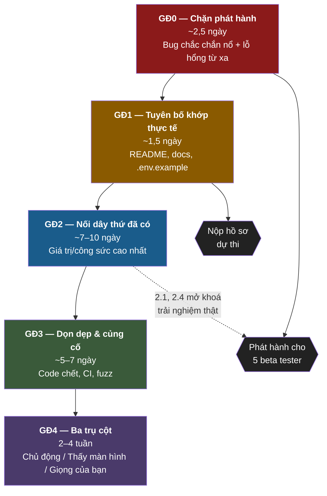
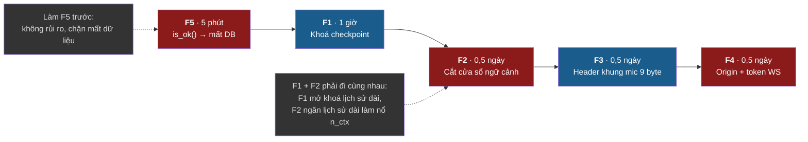
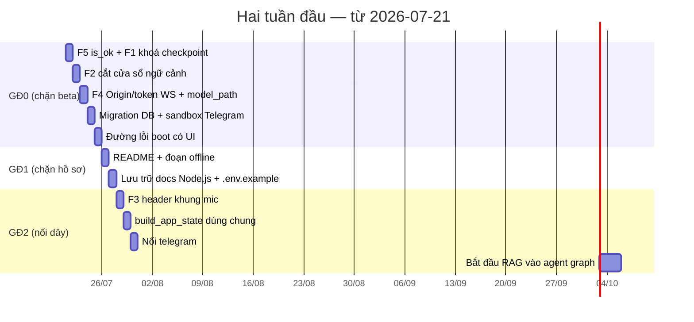

# Lộ trình sửa lỗi và nâng cấp

[⬆ Mục lục](../README.md) · [◀ Nợ kỹ thuật và rủi ro](02-no-ky-thuat-va-rui-ro.md)

---

> Đây là **tài liệu hành động**, không phải bản đánh giá. Mỗi dòng trong các bảng dưới đây đều chỉ đích danh file cần mở và việc cần làm. Năm việc ưu tiên cao nhất có thêm mục hướng dẫn sửa chi tiết ở §7 với đoạn code đề xuất, đọc xong là gõ được ngay.

---

## 1. Nguyên tắc ưu tiên

Bối cảnh: đang nộp hồ sơ dự thi; beta thật = 5 người bạn chạy offline trên laptop, đa số model 2–4B. Vì vậy thứ tự ưu tiên đặt theo:

**(1) thứ chắc chắn hỏng khi dùng thật → (2) thứ có thể bị khai thác từ xa → (3) thứ làm hồ sơ nói sai sự thật → (4) tính năng mới.**

Ba hệ quả trực tiếp của nguyên tắc này:

- Một bug 5 phút làm mất sạch dữ liệu người dùng (`LIVA_DB_IN_MEMORY`) được xếp **trên** một tính năng 3 tuần.
- Một lỗ hổng khai thác được từ tab trình duyệt bất kỳ được xếp **trên** việc dọn code chết.
- Việc "sửa README cho khớp thực tế" là **P1**, ngang hàng với sửa bug — vì hồ sơ dự thi nói sai sự thật là rủi ro không thể sửa hồi tố.

### 1.1 Nhãn trạng thái dùng trong tài liệu

| Nhãn | Ý nghĩa |
|---|---|
| **[OK]** | Đang chạy thật trên đường thi hành chính thức |
| **[MỘT PHẦN]** | Có code nhưng bị tắt / opt-in / chưa nối dây vào call-site nào |
| **[THIẾU]** | Chưa có hoặc chỉ là stub |

Nhãn ở đây chỉ để đọc nhanh lộ trình; việc gán nhãn cho từng tuyên bố cụ thể do tài liệu đối chiếu quyết định.

> 📌 Nguồn đầy đủ: [Đối chiếu tuyên bố vs thực tế](01-doi-chieu-tuyen-bo-vs-thuc-te.md)

---

## 2. Bản đồ 5 giai đoạn



**Quy tắc chặn:** không phát hành cho beta tester khi GĐ0 chưa xong; không nộp hồ sơ khi GĐ1 chưa xong. GĐ2 trở đi không chặn gì, nhưng 2.1 và 2.4 nên kéo lên sớm vì chúng quyết định trải nghiệm mà beta tester thực sự nhìn thấy.

---

## 3. Giai đoạn 0 — Trước khi phát hành cho beta tester (bắt buộc)

| # | Việc | Lý do | File cần sửa | Ước lượng |
|---|---|---|---|---|
| ~~**0.1**~~ ✅ **XONG 21/07/2026** (= F2) | ~~Cắt cửa sổ lịch sử + guard `prompt_tokens < n_ctx - reserve`~~ (H3) | `check_prompt_fits` (thuần, `saturating_add`, `RESERVE_FOR_COMPLETION=512`) chặn TRƯỚC khi `decode`; `trim_history`/`trim_messages` (`LIVA_MAX_HISTORY_MESSAGES`, mặc định 20) cắt cửa sổ. Chi tiết đầy đủ ở mục F2 | `liva-native-core/src/llm/engine.rs` (`check_prompt_fits`); `liva-native-core/src/agent/state.rs` (`trim_*`) | đã xong |
| ~~**0.2**~~ ✅ **XONG 22/07/2026** | ~~Thêm `PRAGMA user_version` + khung migration tuyến tính~~ | `SCHEMA_VERSION` + `run_migrations` (`db.rs`): baseline = 1, danh sách `MIGRATIONS` `(đích, sql)` áp tuần tự trong transaction. DB cũ (`user_version=0` nhưng đủ bảng) được ĐÓNG DẤU lên 1 không mất dữ liệu; DB từ bản mới hơn bị TỪ CHỐI rõ ràng thay vì chạy mù. Có test hồi quy: nâng cấp giữ nguyên dữ liệu, và từ chối DB tương lai | `liva-native-core/src/db.rs` (`SCHEMA_VERSION`, `MIGRATIONS`, `run_migrations`) | đã xong |
| ~~**0.3**~~ ✅ **LỚP 1 XONG 21/07/2026** (= F4) | ~~Kiểm `Origin` WebSocket 8002~~ (C1) | `origin_allowed` + allow-list (`DEFAULT_WS_ALLOWED_ORIGINS`, override `LIVA_WS_ALLOWED_ORIGINS`) chặn tab web bất kỳ ngay ở handshake — trình duyệt buộc gửi `Origin` thật. **Lớp 2 (token phiên) CỐ Ý KHÔNG làm**: với kẻ tấn công CÓ MẶT trên localhost, token nằm cùng máy không tạo ranh giới thật — xem phân tích ở F4 | `liva-native-core/src/lib.rs` (`origin_allowed`) | lớp 1 xong |
| ~~**0.4**~~ ✅ **XONG 22/07/2026** | ~~Validate `model_path` trong `llm:swap_model` + `update_config`~~ (C2) | `validate_model_path` (thuần, có test) chốt: phải là `.gguf` NẰM TRONG thư mục model đã cấu hình, chặn `..`. Áp ở `llm:swap_model` VÀ ở điểm nạp thật `load_configured_router_model` (nên `update_config` ghi `ai.routerModel` độc hại cũng bị chặn khi reload). UI không gọi `swap_model` nên không phá client | `liva-native-core/src/lib.rs` (`validate_model_path`, `load_configured_router_model`) | đã xong |
| ~~**0.5**~~ ✅ **XONG 21/07/2026** (= F5) | ~~`LIVA_DB_IN_MEMORY` dùng `.is_ok()`~~ (M5) | Nay đi qua `env_flag("LIVA_DB_IN_MEMORY", false)` — `=false` đúng là tắt, chỉ `1/true/yes/on` mới bật; giá trị lạ → mặc định an toàn (đĩa). Chi tiết ở F5 | `liva-native-core/src/main.rs` (`env_flag`) | đã xong |
| ~~**0.6**~~ ✅ **PHẦN BINARY XONG 22/07/2026** | ~~Thay `.expect()` boot ở binary standalone~~ (H5) | Ba điểm boot (DB in-memory, DB file, LLM) nay dùng `die()`/`die_db()`: in chẩn đoán **có hành động cụ thể** ra stderr rồi `exit(1)`, không còn backtrace. Lỗi thiếu `vec0` được bồi hướng "chạy `npm ci`" (`db_error_hint`, thuần, có test). Kiểm chứng thật: ép DB lỗi → thông điệp rõ + **exit code 1**. **CÒN LẠI:** hiện lỗi lên **dialog ở vỏ Tauri** — cần quyết định UI (binary standalone thì stderr + mã thoát chính là "UI") | `liva-native-core/src/main.rs` (`die`, `die_db`, `db_error_hint`) | phần binary xong |
| ~~**0.7**~~ ✅ **XONG 22/07/2026** | ~~Sandbox `/ls` và `/cat` của Telegram~~ | Cả hai nay đi qua `NativeMcpServer::resolve_path` (chuyển `pub`) — ghim dưới vault, chặn tuyệt đối/`..`/drive-relative Windows (`C:foo`). Có test hồi quy `sandbox_tests` liệt kê đúng các payload từng đọc được `.env`/vault/khoá. `/ls` cũng chỉ hiện đường dẫn tương đối, không lộ path máy chủ | `liva-native-core/src/telegram.rs`; `liva-native-core/src/mcp/server.rs` | đã xong |

**Tổng giai đoạn 0: ~2,5 ngày.**

> Ghi chú thi hành: 0.5 làm trước tiên (5 phút, không rủi ro). 0.1 và 0.3 nên làm cùng một buổi vì cả hai đều chạm đường thi hành chính và cần chạy lại `verify_duplex.exe` + `router_stress.exe` sau đó.

---

## 4. Giai đoạn 1 — Làm cho tuyên bố khớp thực tế (trước khi nộp hồ sơ)

| # | Việc | Lý do | File cần sửa | Ước lượng |
|---|---|---|---|---|
| ~~**1.1**~~ ✅ | **Sửa README**: gỡ claim "decoupled contexts", "TTFT < 100 ms", "5-tier memory với Reflection Daemon/Nightly Cron", "4B↔26B hot-swap"; bổ sung Qwen3-VL, VieNeu, GTCRN, Parakeet, AEC, Smart Turn, wake-word trained | Ba claim sai nghiêm trọng. Nguyên tắc đã thống nhất: "không bịa số, tách đã-kiểm-chứng vs tiềm năng" | `README.md` | **Đã làm 21/07/2026.** Viết lại toàn bộ mục Technical Highlights; gỡ `TTFT < 100 ms`, `decoupled contexts`, `4B↔26B`, `SIGKILL zero corruption`; sửa router model thành Qwen3-VL-2B; bổ sung GTCRN/AEC/Parakeet/VieNeu/vision:ask/wake word đã train. Thêm banner "A note on honesty" nêu nguyên tắc: chưa nối dây thì nằm ở Lộ trình. Chuyển Reflection Daemon, Nightly Cron, auto router↔expert, tách context, CodeAgent adapter, MCP Rust, benchmark TTFT xuống mục Roadmap mới "Near-term". Đánh dấu inline "not implemented" ngay trong phần mô tả 5 tầng bộ nhớ. **Sửa thêm 3 chỗ gây hiểu nhầm trực tiếp cho beta tester mà đề xuất gốc không nêu:** (a) Step 3 bảo copy `.env.example` thành `.env` — vô tác dụng vì không có dotenv loader, đã thay bằng hướng dẫn export biến trong shell; (b) Step 4 khẳng định `npm run dev` phục vụ `ws://localhost:8002` — sai, đã thêm cảnh báo và lệnh chạy gateway standalone; (c) đường dẫn binary `liva-native-core	arget gốc. Cũng sửa `LIVA_LLM_MODEL_DIR` (không tồn tại ở runtime) thành `data/liva-config.json` |
| ~~**1.2**~~ ✅ | **Viết lại đoạn offline** kèm 3 ngoại lệ tường minh (espeak-ng/ffmpeg shell-out, Telegram, Web Speech fallback trong `useVoicePipeline.ts`) | Tuyên bố hiện tại đúng **de facto** nhưng phát biểu quá mạnh | `README.md` | **Đã làm 21/07/2026** — gộp vào mục "Private by default", nêu 3 ngoại lệ: Telegram (tuỳ chọn, tắt mặc định, không có trong desktop), `liva-voice/` (có dùng cloud, không thuộc đường thoại realtime), lần build đầu cần mạng. Bổ sung dòng về allow-list Origin của WebSocket (F4) |
| ~~**1.3**~~ ✅ | **Chuyển `docs/architecture/*.md` + `codebase_architecture.md` vào `docs/99-luu-tru/kien-truc-nodejs-v29/`**, thêm banner "bản vẽ Node.js đã ngừng, không mô tả code hiện tại" | 8 tài liệu mô tả stack đã bị xoá; người ngoài đọc sẽ hiểu sai hoàn toàn | `docs/architecture/*`, `codebase_architecture.md` | **Đã làm 21/07/2026** trong đợt quy hoạch lại tài liệu: 16 file chuyển vào `docs/99-luu-tru/kien-truc-nodejs-v29/`, kèm README lưu trữ có khối cảnh báo và bảng giải thích từng file lỗi thời vì sao, thay bởi tài liệu nào. Git nhận diện là rename nên lịch sử giữ nguyên. |
| ~~**1.4**~~ ✅ | Chuyển `docs/skills_development_guide.md`, `docs/benchmarks/streaming_optimization.md` vào lưu trữ; **xoá `docs/reports/LMS_Strategic_Plan_2026.md`** (không liên quan LIVA) | Tài liệu mô tả code đã xoá / lạc đề | như cột trái → `docs/99-luu-tru/` | **Đã làm 21/07/2026**: `skills_development_guide.md` và `streaming_optimization.md` đã nằm trong `99-luu-tru/kien-truc-nodejs-v29/`; `LMS_Strategic_Plan_2026.md` đã **xoá hẳn** khỏi repo (không chỉ lưu trữ). |
| ~~**1.5**~~ ✅ | **Xoá `data/models.config.json` và `data/skill_whitelist.json`** (hoặc thêm header `DEPRECATED — không code nào đọc`) | `models.config.json` ghi `"tts.provider": "edge-tts"` — đọc lên rất giống bằng chứng LIVA dùng cloud TTS | `data/models.config.json`, `data/skill_whitelist.json` | **Đã làm 21/07/2026 — xoá hẳn cả hai.** Kiểm chứng trước khi xoá: grep toàn repo cho `models.config`/`skill_whitelist` chỉ ra **12 file, tất cả đều là tài liệu**, không một dòng code nào đọc. Nội dung xác nhận đúng lo ngại: `models.config.json` ghi `"tts.provider": "edge-tts"` và model `gemma-4-26B` (không tồn tại) — đọc lên rất giống bằng chứng LIVA dùng TTS đám mây; `skill_whitelist.json` liệt kê `send_zalo_rpa`, `read_emails` là skill thời Node.js đã xoá. Đã gỡ chúng khỏi trường `covers` của 5 tài liệu để checker không báo lỗi. |
| ~~**1.6**~~ ✅ | Gỡ hoặc đánh dấu `[CHƯA IMPLEMENT]` các key chết: `AI_*`, `ZALO_*`, `EMAIL_*`, `REMOTE_CONTROL_ENABLED`, `TELEGRAM_CHAT_ID/ADMIN_ID`, `LIVA_LLM_MODEL_DIR`; **bổ sung 5 biến `LIVA_VIENEU_*`**; sửa `LIVA_WAKE_THRESHOLD` 0.68 vs 0.77 | Người dùng beta cấu hình theo tài liệu sẽ không có tác dụng | `.env.example` | **Đã làm 21/07/2026, nhưng kết luận KHÁC đề xuất.** Kiểm lại từng khoá: các key `AI_*`/`ZALO_*`/`EMAIL_*`/`TELEGRAM_CHAT_ID`/`TELEGRAM_ADMIN_ID`/`REMOTE_CONTROL_ENABLED` **không hề "chết"** — `ApiManagementView.vue` đọc/ghi chúng vào `.env` như văn bản qua vault. Nghĩa là UI cho người dùng điền thông tin Zalo/Email rồi lưu lại, trong khi backend không có gì tiêu thụ; tệ hơn là key chết đơn thuần. Vì vậy **đánh dấu `[CHƯA IMPLEMENT]` thay vì xoá** (xoá sẽ làm mất trường trong form UI). Riêng `AI_*` có consumer thật nhưng là `scripts/ai-pre-commit.cjs:47-49` — git hook, không phải ứng dụng; đã ghi rõ "lõi Rust KHÔNG đọc bất kỳ biến AI_* nào". `LIVA_LLM_MODEL_DIR` đánh dấu `[KHÔNG CÓ TÁC DỤNG Ở RUNTIME]` (chỉ `router_stress.rs` đọc). Bổ sung đủ **5 biến** `LIVA_TTS_VIENEU` + `LIVA_VIENEU_{MODEL_DIR,VOICE,THREADS,SEED}`. `LIVA_WAKE_THRESHOLD` **không phải bug**: 0.68 là mặc định trong code, 0.77 là khuyến nghị theo eval — đã ghi rõ cả hai để không ai hiểu nhầm 0.77 là giá trị đang chạy. |

**Tổng giai đoạn 1: ~1,5 ngày (chủ yếu viết).**

Hai mục 1.1–1.2 và 1.6 chỉ nêu *việc phải làm*; danh sách đầy đủ các tuyên bố sai và các key `.env.example` lệch với code nằm ở nơi khác — mở đúng hai tài liệu dưới đây trước khi bắt tay sửa.

> 📌 Nguồn đầy đủ (tuyên bố sai — mục 1.1, 1.2): [Đối chiếu tuyên bố vs thực tế](01-doi-chieu-tuyen-bo-vs-thuc-te.md)
> 📌 Nguồn đầy đủ (bảng biến môi trường & lệch `.env.example` vs code — mục 1.6): [Cấu hình và biến môi trường](../02-van-hanh/01-cau-hinh-va-bien-moi-truong.md)

---

## 5. Giai đoạn 2 — Nối dây thứ đã có sẵn (giá trị/công sức cao nhất)

Đây là giai đoạn có tỉ lệ giá trị/công sức tốt nhất toàn dự án: hầu hết code đã tồn tại, đã có test, chỉ **không có call-site**.

| # | Việc | Chi tiết | File cần sửa | Ước lượng |
|---|---|---|---|---|
| ~~**2.1**~~ ✅ | **Sửa khoá checkpoint** — dùng id ổn định theo kết nối WS thay `session_id` (tăng mỗi lượt VAD) | `pipeline.rs` cũ làm `self.session_id += 1` mỗi `handle_vad_start` rồi lấy chính số đó làm `thread_id` checkpoint ⇒ **mỗi câu nói là một hội thoại mới**. Fix có tỉ lệ giá trị/công sức cao nhất toàn dự án | `liva-native-core/src/webrtc/pipeline.rs`; `liva-native-core/src/main.rs` | **Đã làm.** Đường thoại nay tách hẳn hai vòng đời: `session_id` (u64, tăng mỗi VAD) chỉ để **huỷ tác vụ cũ khi bị ngắt lời** (`pipeline.rs:187,214,315…`), còn khoá checkpoint là `conversation_id: String` — một `uuid` sinh **một lần cho mỗi kết nối WS** (`main.rs:594`), giữ nguyên suốt kết nối và dùng làm `thread_id` cho `load_checkpoint`/`save_checkpoint` (`pipeline.rs:255,258,290`). Hai field có doc-comment nêu rõ vì sao KHÔNG được lẫn lộn. **Bổ sung 22/07/2026 (khoá hồi quy):** `SqliteCheckpointer` (lớp lưu trữ trí nhớ đa lượt) trước đó **không có test nào** — thêm 4 test ở `agent/memory.rs`: round-trip cùng `thread_id` khôi phục nguyên trạng; **khoá khác nhau (mô phỏng `session_id` 1,2,3 mỗi câu) → luôn `None`**, khoá chính bug 2.1 để không ai revert; ghi đè cùng khoá; đọc rỗng trả `None`. `cargo test --lib agent::memory` 4/4 pass |
| ~~**2.2**~~ ✅ | **Nối RAG + event projection lifecycle** (H7) | Recall scoped; persist atomic; không mở raw search `conversation_turn` cho client chưa xác thực owner | `agent/graph.rs`; `db.rs`; `memory_consolidation.rs`; hai điểm boot | **Đã làm 22–23/07/2026.** Producer ghi atomic event + vector/FTS với invariant lineage/scope và raw event fields `NULL`. Projection consumer bounded/idempotent chạy ở standalone + Tauri: batch 25/30 giây, tick đầu ngay, `BEGIN IMMEDIATE`, checkpoint cùng transaction, retry ba lần rồi DLQ. Thiếu embedder thì không sinh event mồ côi. Đây mới là L2 projection finalization; semantic fact/relation extraction và L3 là phase riêng. |
| ~~**2.3**~~ ✅ | **Thống nhất chiều embedding** — hoặc đổi `vec_idx` sang `n_embd` của model chat, hoặc thêm model embedding nhỏ chuyên dụng 384 chiều | `vec_idx int8[384]` hiện **không khớp** `get_embedding`, và `upsert_vector` **không kiểm chiều** ⇒ hỏng âm thầm | `liva-native-core/src/db.rs` (schema `vec_idx`, `upsert_vector`); `liva-native-core/src/llm/` (`llm:embed`) | **Đã làm 21/07/2026 — chọn phương án model embedding riêng.** Trước hết **bác bỏ tiền đề của chính mục này**: lộ trình ghi `upsert_vector` không kiểm chiều nên "hỏng âm thầm". Chèn test tạm và chạy thật cho thấy sqlite-vec **có** kiểm và báo lỗi rõ: `Dimension mismatch for inserted vector ... Expected 384 dimensions but received 2048`. Không có nguy cơ ghi sai lặng lẽ. **Đã làm:** (a) module `llm/embedder.rs` — ONNX 384 chiều, mean-pool theo attention mask + chuẩn hoá L2, tiền tố `query:`/`passage:` cho họ E5, thiếu model thì trả lỗi có hướng khắc phục chứ không sập; (b) hằng số `db::MEMORY_VECTOR_DIM` làm nguồn duy nhất, dùng cho cả `CREATE VIRTUAL TABLE` lẫn guard; (c) guard `check_vector_dim` ở `upsert_vector` và `search_similar_vectors` — mục đích là **vị trí báo lỗi**, để lỗi nổ tại hàm gọi kèm chỉ dẫn thay vì lọt xuống câu SQL; (d) test khoá hai hằng số `MEMORY_VECTOR_DIM` và `EMBEDDING_DIM` phải bằng nhau. **Kiểm chứng:** 173 lib test + 6 integration pass, 0 clippy warning. **CHƯA kiểm chứng:** chưa tải model thật về nên test `embed_that_khi_co_model` **bị bỏ qua** — hợp đồng I/O ONNX (tên input `input_ids`/`attention_mask`, output [1, seq, 384]) mới chỉ đúng trên giấy. Phần kiểm được offline là `mean_pool` và `l2_normalize` (7 test) |
| ~~**2.4**~~ ✅ | **Sửa hợp đồng khung mic của `liva-ui`** — thêm 9-byte `VoiceFrame` header | `useVoicePipeline.ts` cũ gửi **1 byte** `0x01` + PCM; core đọc **9 byte** header (`frame.rs`) ⇒ toàn bộ mic từ browser bị hiểu sai. Mở lại full-duplex | `liva-ui/src/composables/useVoicePipeline.ts`; `liva-ui/src/utils/voiceFrame.ts` | **Đã làm (F3, commit `d1a6a82`).** Helper `src/utils/voiceFrame.ts::serializeVoiceFrame` ghi đúng `[op u8][seqId u32 LE][payloadSize u32 LE][payload]` khớp `frame.rs`; `useVoicePipeline.ts:353` dùng nó với `micSeqId` quấn vòng u32, payload PCM f32 LE giữ nguyên byte, guard `MAX_PAYLOAD_BYTES` (ném RangeError thay vì để core lặng lẽ đóng kết nối). **Có 7 test** (`tests/utils/voiceFrame.test.ts`) gồm `decodeLikeCore` **phản chiếu chính `frame.rs`** (cross-check hợp đồng wire), passthrough f32, hồi quy bug 1-byte, wraparound u32, payload rỗng, guard MAX_PAYLOAD. 7/7 pass. **Chưa kiểm end-to-end** trình duyệt→core với mic thật (cần dựng stack + mic), nhưng hợp đồng byte đã khoá cả hai phía |
| **2.5** ⚠️ | **Tách `build_app_state()` dùng chung** (M4) — để Tauri cũng có VAD/denoise/AEC/WakeGate | Hiện đường chạy chính thức (Tauri) thiếu toàn bộ ngăn xếp thoại nâng cao mà `main.rs` có | `liva-native-core/src/lib.rs`; `liva-native-core/src/main.rs:60-295`; `liva-desktop/src-tauri/src/lib.rs:270-350` | ⚠️ **KHÔNG làm theo đúng chữ — phân tích lại cho thấy đề xuất sai hướng.** Mục này đề nghị cho Tauri cũng có VAD/denoise/AEC/WakeGate. Nhưng grep cho thấy bốn engine đó **chỉ được tiêu thụ ở `main.rs` và `webrtc/pipeline.rs`** — cả hai đều thuộc đường WebSocket, mà vỏ Tauri không chạy WS server. Nhét chúng vào Tauri sẽ **nạp 4 model ONNX mà không gì tiêu thụ**: tốn RAM và thời gian khởi động, đổi lại không có một hành vi mới nào. Giá trị thật của M4 là **chống trôi dạt do sao chép** giữa hai bản dựng `AppState` — và đó chính là nguồn gốc của toàn bộ nhầm lẫn "hai profile chạy". Việc đúng cần làm là tách một builder dùng chung có tham số bật/tắt cụm audio, chứ không phải bật cụm audio cho Tauri. **Đã giữ nguyên hành vi, ghi lại phân tích.** Khi làm builder chung, `AppState.embedder` (thêm ở 2.2) là ví dụ mẫu: nó được dựng ở cả hai điểm vào vì thật sự có tác dụng ở cả hai.<br><br>✅ **CẬP NHẬT 26/07/2026 (`e2ecdf1`) — builder chung ĐÃ CÓ, đúng theo phân tích ở trên chứ không theo chữ của đề xuất gốc.** Module mới `liva-native-core/src/boot.rs` (510 dòng) cung cấp `build_app_state() -> Result<Boot, BootError>` dựng toàn bộ `AppState` (DB, khoá mã hoá, audio, STT/TTS/LLM, MCP, vision, embedder, thoại) và `spawn_background_services()` — doc-comment của hàm sau tự khai là **"nguồn sự thật duy nhất cho câu hỏi LIVA chạy những gì ở nền"**, đúng thứ chống trôi dạt mà mục này nêu. Hai vỏ co lại tương ứng: `main.rs` −332 dòng, `liva-desktop/src-tauri/src/lib.rs` −289 dòng. `BootError` tách `context` khỏi `detail` để gateway in stderr còn desktop dựng hộp thoại, nhưng **nội dung — kể cả gợi ý khắc phục — là dùng chung**, khép nốt phần "còn lại" của H5. Một struct riêng khoanh đúng chỗ hai vỏ thật sự khác nhau; mọi thứ ngoài nó là chung. **Chưa kiểm lại:** bảng "hai profile chạy" ở [01-ban-ve/01](../01-ban-ve/01-kien-truc-tong-the.md) và các mục liên quan ở `01`/`02` vẫn mô tả trạng thái trước refactor |
| ~~**2.6**~~ ✅ | **Nối `telegram:message`** — thêm arm trong `handle_command` gọi agent graph, hoặc đổi `route_input_to_agent` gọi trực tiếp `handle_command` thay vì bơm ra stdout | `/ask` và tin nhắn Telegram hiện rơi vào hư vô | `liva-native-core/src/telegram.rs`; `liva-native-core/src/lib.rs` (`handle_command`) | **Đã làm 21/07/2026.** `route_input_to_agent` giờ gọi thẳng `handle_command("chat:completion")` rồi **gửi câu trả lời ngược lại Telegram**; trước đây nó chỉ đẩy JSON vào `ipc_tx` tức là ra stdout, không ai tiêu thụ như lệnh, nên `/ask` và mọi tin nhắn (kể cả tin thoại đã transcribe) rơi vào hư vô. Vẫn giữ phần phát ra `ipc_tx` cho kênh IPC cũ. Gửi `ChatAction::Typing` trước khi sinh vì LLM cục bộ mất vài giây. `split_for_telegram` cắt câu dài theo **ký tự** chứ không theo byte — tiếng Việt đa byte, cắt theo byte tạo ký tự vỡ; test khoá bằng chuỗi 4500 ký tự "ữ" (13.500 byte). **Kiểm chứng một phần 22/07/2026:** đường `chat:completion` (Telegram dùng chính arm này) đã được kiểm end-to-end qua WebSocket thật — `scripts/e2e-memory.mjs` gửi `chat:completion` kể "ORION-7", `search_hybrid` tìm thấy (tất định), hỏi lại qua chính `chat:completion` thì nhớ đúng. Còn lại: chạy **bot Telegram thật với token** (cần secret của người dùng)  |
| ~~**2.7**~~ ✅ | **Thêm arm `mcp:list_tools` / `mcp:call_tool`** vào `handle_command`, và cắm `get_metadata()` của skill vào prompt | Biến `NativeMcpServer` (183 dòng **đã có test**) từ mồ côi thành tool-calling thật | `liva-native-core/src/lib.rs` (`handle_command`); `liva-native-core/src/mcp/server.rs` | **Đã làm 21/07/2026.** Thêm arm `mcp:list_tools` và `mcp:call_tool` vào `handle_command`. `NativeMcpServer` (183 dòng, đã có test) trước đó được dựng trong `AppState` ở cả hai điểm vào nhưng grep `mcp_server` trong `lib.rs` chỉ ra đúng một chỗ — dòng khai báo field; cả 4 tool là code mồ côi. Ranh giới an toàn giữ nguyên: mọi thao tác file qua `resolve_path`, chặn đường dẫn tuyệt đối và `..`. Test viết ở **lớp lệnh** chứ không gọi tắt vào `NativeMcpServer` — gỡ arm là test đỏ; phủ 5 ca gồm path traversal bị chặn ngay cả khi đi qua `handle_command`. **Chưa làm:** cắm `get_metadata()` của skill vào prompt (thuộc tool-calling, gắn với 2.8)  |
| ~~**2.8**~~ ✅ | **Sửa router intent** (H4) — khớp theo token có ranh giới + thêm từ khoá tiếng Việt, hoặc chuyển sang LLM sinh tool-call có schema | "bật đèn giúp mình" hiện không khớp gì; "back on track" thì khớp nhầm | `liva-native-core/src/agent/graph.rs` (node `router`) | **Đã làm 21/07/2026.** Tách thành hàm thuần `route_intent()` khớp theo **token trọn vẹn**. Bản cũ dùng `contains()` nên sai cả hai chiều: dương tính giả (`"ac"` khớp "b**ac**k" → "back on track" thành lệnh bật điều hoà; `"off"` khớp "c**off**ee"; `"on"` khớp "m**on**ey") và âm tính giả (không một từ khoá tiếng Việt nào, nên "bật đèn giúp mình" không khớp gì). Tokenize bằng `is_alphanumeric` để giữ chữ có dấu; thêm khớp cụm cho "màn hình", "điều hoà/hòa", "máy lạnh"; thêm đèn/quạt/bật/mở/tắt/đóng. Vision ưu tiên cao nhất. **8 test**, trong đó ca chính là hồi quy cho đúng các câu bản cũ hiểu sai. Vẫn là định tuyến theo từ khoá, **chưa** phải tool-calling có schema do LLM sinh.<br><br>**Mở rộng 26/07/2026 (`87bf2da`) — và nó đảo ngược vai trò của mục này.** `route_intent` nay biết cả từ vựng **âm lượng/nhạc**, nên câu đa nghĩa (*"bật nhạc lên"* = mở nhạc hay vặn to?) **không còn tới tay LLM**. Đó chính là cách U19 đi từ 9/10 lên **10/10** — không phải model khá lên. Hệ quả đo được: **9/14 câu tốn 0 token, 0 độ trễ, tất định**. Tức đường nhanh từ chỗ bị coi là giải pháp tạm nay là **bước đầu tiên gỡ rào chi phí ~3 s/lượt** đang giữ `LIVA_TOOL_CALLING` ở trạng thái tắt. Ba ràng buộc của bảng từ khoá đều có test canh: chỉ tiếng Việt (thêm danh từ tiếng Anh là rước lại bẫy `"back on track"`), đòi danh từ âm thanh/nhạc (nên không cướp `"bật đèn"`), và ĐỘ TO thắng ĐANG-PHÁT-GÌ  |
| ~~**2.9**~~ ✅ | **Tách thought channel khỏi answer/TTS** | Reasoning model có thể phát `<think>`/analysis; lọc regex ở UI không stream-safe và không bảo vệ TTS, checkpoint hay memory | `llm/output_filter.rs`; `llm/engine.rs`; các callback stream | **Đã làm 23/07/2026.** State machine chung cho text + vision ẩn reasoning xuyên ranh giới token, hiểu cả prompt đã mở think channel, EOF fail-closed. `CompletionOutput.text` và mọi callback chỉ nhận phần final/visible. Token ẩn vẫn tạo heartbeat để barge-in kiểm epoch nhưng không chiếm queue TTS hay phát JSON rỗng. TDD phủ 6 ca marker/channel/cancellation. Automatic router↔expert và model resource lease vẫn là phase riêng. |

**Tổng giai đoạn 2: ~7–10 ngày.**

---

## 6. Giai đoạn 3 — Dọn dẹp và củng cố

| # | Việc | Lý do | File cần sửa | Ước lượng |
|---|---|---|---|---|
| ~~**3.1**~~ ✅ | Xoá crate `webrtc = "0.12.0"` (0 lời gọi API), `webrtc/signaling.rs` (bind `0.0.0.0`), `prng.rs`, `feed_rtp_pcm`, `OP_ACK_PLAYING` | Giảm đáng kể thời gian build; `signaling.rs` còn là bề mặt tấn công mở ra ngoài LAN | `liva-native-core/Cargo.toml`; `liva-native-core/src/webrtc/signaling.rs`; `liva-native-core/src/prng.rs`; `liva-native-core/src/webrtc/frame.rs:7` | **Đã làm 22/07/2026.** Gỡ crate `webrtc = "0.12.0"` — không một API nào được gọi (mọi `webrtc::` trong mã trỏ tới module NỘI BỘ `crate::webrtc`). Kéo theo **45 crate** khỏi cây phụ thuộc, −632 dòng `Cargo.lock`: asn1-rs, der-parser, interceptor, rtp, rtcp, srtp, turn, stun, webrtc-*… Đây là khoản tiết kiệm build lớn nhất có thể lấy mà không đụng llama.cpp. Cùng đợt gỡ `webrtc/signaling.rs` (63 dòng, không ai gọi, lại `bind("0.0.0.0")` mở ra toàn LAN — trái nguyên tắc loopback của phần còn lại), `prng.rs` (70 dòng Mulberry32, không nơi nào dùng; test giảm 188→186 đúng bằng 2 test nội bộ của nó), và `feed_rtp_pcm` (thân rỗng chỉ có TODO). **GIỮ `OP_ACK_PLAYING`** dù server chưa đọc: nó là hợp đồng wire mà client có thể gửi; xoá hằng số sẽ khiến người sau tái dùng nhầm opcode 0x04. Đã ghi chú thay vì xoá |
| ~~**3.2**~~ ✅ | Quyết định số phận `evolution/` + `agent/dispatcher.rs` + `passive/` — xoá hoặc đánh dấu `#[cfg(feature = "experimental")]` | Nếu xoá kèm test, CI nhanh lên ~70% | `liva-native-core/src/evolution/`, `liva-native-core/src/agent/dispatcher.rs`, `liva-native-core/src/passive/` | **Đã làm 22/07/2026 — chọn phương án feature flag, KHÔNG xoá.** Mục này cho hai lựa chọn (xoá hoặc `#[cfg(feature)]`); phương án feature flag không phá huỷ gì nên không cần quyết định sản phẩm. Đã thêm feature `experimental` và gate `evolution/` (428 dòng), `passive/` (647 dòng), `agent/dispatcher.rs` (187 dòng) — tổng **1.262 dòng**, xác nhận **0 call site** ngoài chính chúng và test của chúng. **Ba lợi ích đo được:** (1) với `passive/` đây là quyết định **an toàn** — nó là keylogger đầy đủ chức năng, giờ không còn nằm trong binary giao cho người dùng khi chưa có cổng đồng ý; (2) `sandbox_stress` (33,3s) và `self_correction_stress` (31,7s) spawn `cargo test` lồng nhau — **65 giây** rời khỏi đường test mặc định; (3) build mặc định nhỏ hơn. **Không mục nát:** CI có thêm bước `cargo check --all-targets --features experimental` — compile-check chứ không chạy test, để không phải trả lại 65 giây đó. Kiểm chứng: cả hai cấu hình build và test sạch (mặc định 199 test, experimental thêm 9 test) |
| ~~**3.3**~~ ✅ | Xoá `liva-computer-use/` (rỗng), phần Vite vestigial của `liva-desktop/`, `tests/memory_stress_benchmark.ts` (import thư mục đã xoá) | Thư mục ma làm người đọc hiểu sai phạm vi dự án | `liva-computer-use/`, `liva-desktop/package.json`, `tests/memory_stress_benchmark.ts` | **Đã làm 22/07/2026.** Xoá `liva-computer-use/` (thư mục **rỗng hoàn toàn**, 0 mục) và `tests/memory_stress_benchmark.ts` — file này chỉ có đúng một dòng `import "../liva-gateway/tests/…"` trỏ vào thư mục đã bị xoá cùng gateway Node.js, tức là không chạy được từ lâu. Ba script còn lại trong `tests/` (audit_profiler, e2e-stress, websocket_stress_test) vẫn có import hợp lệ nên giữ |
| ~~**3.4**~~ ✅ | Bỏ `#![allow(dead_code, …)]` và sửa warning thật | Đây là **nguyên nhân gốc** khiến 1.415 dòng code chết compile sạch mà không ai biết | `liva-native-core/src/main.rs:1`; 7 module `stt/*`,`tts/*` | **Đã làm 22/07/2026 — hoá ra 0 warning cần sửa.** Trước hết **đo** thay vì đoán (allow thực nằm ở `main.rs:1` cấp crate + 7 `#![allow(dead_code)]` cấp module trong `stt/`,`tts/`, KHÔNG phải `lib.rs:1` như ghi ở cột trái): gỡ tạm **cả 8** rồi build `--all-targets --features experimental` → **0 warning**. Dead code mà chúng che đã bị dọn hết ở 3.1–3.3, nên 8 allow blanket giờ chỉ là nhiễu **che mất lưới an toàn** (code chết mới sẽ lại lọt). Đã gỡ sạch cả 8; giữ lại **3 `#[allow(dead_code)]` cấp item** (`llm/sampler.rs:18`, `stt/tokenizer.rs:83`, `tts/audio.rs:86`) — đó là suppress đúng chỗ cho item có chủ đích, không phải blanket. Kiểm chứng: 0 rustc warning (default + experimental), 215 lib + 12 bin test pass. Từ nay dead_code/unused_imports/unused_variables **được cảnh báo trở lại** |
| ~~**3.5**~~ ✅ **XONG 22/07/2026** | CI: bật `--coverage`, thêm `tsc --noEmit` + ESLint, cache Cargo, đưa clippy thành gate | CI hiện không có gate fmt/clippy nào | `.github/workflows/test.yml` | **KHÉP 26/07/2026 — clippy nay LÀ gate cứng, và CI nay dựng cả bản phát hành.** Ba bước bổ sung cùng ngày: (a) `node scripts/e2e-gateway-ci.mjs` chạy **gateway thật qua socket** mỗi push — bộ kiểm duy nhất chạm lớp dispatch, trước nay không nằm trong CI vì tin rằng "cần model weights", đo lại thì **sai** (trỏ mọi biến model vào đường dẫn không tồn tại → vẫn 8/8 đạt); (b) workflow riêng `.github/workflows/release.yml` (tag `v*` · bấm tay · **hằng tuần**) dựng `cargo build --release` + `npx tauri build` rồi chạy lại e2e trên binary release — **đường duy nhất `vision:ask` hoạt động**; nó tìm ra ngay một lỗi mà chính khoảng trống này đã giấu: `tauri.conf.json` khai `frontendDist: "../liva-ui/dist"` trỏ vào thư mục không tồn tại, nên `npx tauri build` chết mọi lần và **không ai biết vì chưa job nào chạy nó** — vá xong dựng được MSI 41,5 MB + NSIS 27,0 MB, và `vision:ask` trả lời thật sau **80,4 s** (Qwen3-VL-2B Q4_K_M trên CPU); (c) `docs-citations.mjs --max-unchecked=508` — bộ dò trích dẫn trước đây **bỏ qua im lặng 39%** (853/2 184, gồm TOÀN BỘ trích `lib.rs` và `main.rs`) vì tên file trần trùng nhau và biến `skipped` chưa từng được in; nay con số đó hiện ra, chỉ được phép giảm, và tài liệu chuyển dần sang neo `file#ký_hiệu` sống sót qua refactor. **Còn thiếu:** `cargo fmt`.<br><br>*(Nguyên văn mốc trước)*  Bước cuối của CI là `cargo clippy --all-targets -- -D warnings`; hành trình `35 → 0` hoàn tất trong ngày 22/07 bằng sửa tay có tính tương đương chứng minh được (5 vòng DSP viết lại thành `zip`/slice; riêng g2p còn kiểm bằng **hash WAV seed-42 của VieNeu — giống hệt từng byte** trước/sau). Các `#[allow]` còn lại đều có lý do ghi tại chỗ. **Đo lại độc lập 26/07/2026: 0 warning** (`cargo clippy --all-targets --message-format=short`, đếm `": warning:"`). ⚠️ **Bẫy đo lường đã ghi vào `.github/workflows/test.yml`:** định dạng short in đường dẫn có tiền tố `liva-native-core\src\…`, nên `grep '^src/'` **luôn ra 0** — đó chính là cách cổng này từng xanh giả. Không có gate `fmt`, và đó là lựa chọn có chủ đích.<br><br>**Hai gate tài liệu thêm vào sau, cùng một tinh thần "cái kiểm không bao giờ đỏ thì không phải cái kiểm":** (1) `docs-check.mjs --strict-stale=docs/03-danh-gia` (26/07, U5) — tài liệu lỗi thời ở tầng đánh giá là **lỗi chặn**, có van thoát trung thực `stale-ok`; (2) `docs-citations.mjs --max-unchecked=508` — **chốt chống thụt lùi** cho trích dẫn *không kiểm được*. Cái sau đáng chú ý về phương pháp: trước đó biến `skipped` **chưa từng được in ra**, nên 39 % trích dẫn (853/2 184) chưa bao giờ được kiểm mà không ai biết — lại đúng mô thức "xanh giả" lần thứ ba. Nay con số hiện ra và **chỉ được phép giảm**; hạ chốt mỗi khi chuyển một nhóm sang neo ký hiệu (`--suggest`).<br><br>*(Lịch sử)* **Đã làm một phần 22/07/2026.** Thêm vào CI: (a) **cache Cargo** (registry + git db + target, khoá theo hash `Cargo.lock`) — llama.cpp bị ghim `opt-level=3` ngay cả ở profile dev nên build sạch rất lâu, đây là khoản tiết kiệm lớn nhất của pipeline; (b) **`tsc --noEmit`** và (c) **ESLint `--max-warnings 0`** trên toàn `liva-ui`. Hai gate sau pre-commit đã chạy nhưng chỉ trên file staged và có thể bị bypass; CI kiểm toàn cây. Đã xác minh **cả hai gate pass trên cây hiện tại** trước khi thêm — không đưa vào một gate đã hỏng sẵn. **Cập nhật 22/07/2026:** (a) **`--coverage` ĐÃ bật** — CI chạy `test:coverage`, ngưỡng đặt theo thực tế đo (`60/43/46/62`) và có hiệu lực; (b) **`vue-tsc` thay `tsc`** vì `tsc` trần kiểm 0 file (config solution-style); (c) clippy giảm **80 → 35** (lib 23) nhưng **chưa** thành gate cứng — 35 còn lại cần refactor thật. |
| ~~**3.6**~~ ✅ | Chuyển 5 binary verify sang `use liva_native_core::…` thay `#[path]` | `#[path]` biên dịch lại module ⇒ verify chạy trên **bản sao** chứ không phải code thật | `liva-native-core/src/bin/*.rs` | **Đã làm 22/07/2026.** Chuyển 4 bin (router_stress, verify_round2, voice_profile, voice_stress) từ `#[path = "../x.rs"] mod x;` sang `use liva_native_core::`. Không còn `#[path]` nào trong `src/bin`. Món nợ này đã **chặn công việc hai lần trong cùng một phiên**: ở F5 khi thêm `crate::env_flag` vào `tts/mod.rs`, và ở 2.3 khi đặt test hằng số trong `db.rs` — cả hai lần lỗi chỉ lộ ra khi biên dịch `--all-targets`. Gỡ xong thì thống nhất được luôn `LIVA_TTS_VIENEU` về `env_flag` dùng chung, việc đã phải bỏ dở ở F5 |
| **3.7** ⚠️ | Fuzz `VoiceFrame::decode` + bảng test `handle_command` (M3) | `decode` đọc trực tiếp `payload_size` từ mạng — đầu vào không tin cậy | `liva-native-core/src/webrtc/frame.rs:29-52`; `liva-native-core/src/lib.rs` | **Đã làm một phần 22/07/2026.** Thêm **8 test** cho `VoiceFrame::decode` — parser nhị phân mà bất kỳ ai nối được WebSocket đều đưa byte tuỳ ý vào, và nó đọc `src[0..9]` bằng chỉ số trần; trước đó **không có một test nào**. Phủ: khung chưa đủ phải trả `Ok(None)` và KHÔNG tiêu thụ buffer (tiêu thụ là dòng byte lệch vĩnh viễn); `payload_size` khổng lồ (`u32::MAX`) bị từ chối **trước khi cấp phát**; đúng ngưỡng 1 MiB vẫn hợp lệ còn encode chặn ở 1MiB+1; nhiều khung dính liền tách đúng thứ tự; opcode lạ vẫn decode được (từ chối sẽ làm đứt kết nối với client gửi opcode tương lai); quét 2000 chuỗi byte ngẫu nhiên seed cố định chỉ yêu cầu KHÔNG panic. **Cập nhật 22/07/2026 — bảng `handle_command` đã phủ các nhánh model-free:** thêm **9 test** ở `main.rs` (tái dùng harness `test_state()` không-model có sẵn): round-trip `memory:set_fact`→`get_fact` **xuyên lớp mã hoá** (khẳng định `decrypt_read` chạy đúng qua dispatcher chứ không chỉ ở hàm con); payload méo (`memory`/`add_task`/`delete_task`) trả `Err` gọn không panic; **ba chốt bảo mật C2** của `llm:swap_model` (thiếu `model_path`/`..`/sai đuôi bị chặn TRƯỚC khi chạm parser C++); `mcp:list_tools`/`mcp:call_tool`/`integrations:list`; **vòng đời task CRUD** (add→get→delete); và **`memory:search_hybrid` — hợp đồng suy-giảm-an-toàn của 2.2**: không có embedder + không tự cấp vector → `Err` có hướng khắc phục (KHÔNG panic), còn tự cấp vector 384 chiều thì search chạy thật trên DB rỗng; **`memory:upsert_vector` — guard chiều 384 của 2.3** (vector lệch chiều bị chặn với thông điệp nêu 384, đúng chiều thì ghi được). **Cố ý bỏ** các lệnh đọc tĩnh (`get_config`/`get_system_status`/…) — test chúng là bloat không bắt được lỗi thật. **Chưa làm:** nhánh cần model sống (`chat:completion`, `vision:ask`, `voice:tts_*`, `llm:embed`) — cần harness nạp model thật |
| ~~**3.8**~~ ✅ **XONG — 21/07/2026** | ~~GitNexus: thêm exclude bundle, chạy lại `analyze --pdg --embeddings`~~ | Đã làm cả hai (xem [L12](02-no-ky-thuat-va-rui-ro.md)): exclude bỏ 711 node nhiễu và khôi phục 17 file `src/bin/`; `--pdg --embeddings` dựng 16.630 node `BasicBlock` + 3.847 embedding, mở khoá `pdg_query` và tìm kiếm ngữ nghĩa. **Lưu ý khi dùng:** đặt câu hỏi cho `query` bằng **tiếng Anh** — model embedding trả kết quả lạc với tiếng Việt | `.gitnexusignore` | đã xong |
| ~~**3.9**~~ ✅ | Sửa `TtsManager::from_bin` để **không** phụ thuộc eager vào `af_heart.bin` | Kokoro là fallback thì không được là điều kiện tiên quyết để boot | `liva-native-core/src/tts/` | **Đã làm 22/07/2026.** `TtsManager::from_bin` đọc voice embedding Kokoro bằng `fs::read(...)?` nên thiếu file là trả `Err`, và cả hai điểm vào biến `Err` đó thành `TtsManager = None` — mất LUÔN Piper và VieNeu. Hệ quả thật: người dùng có đủ giọng tiếng Việt vẫn bị câm chỉ vì thiếu một file fallback tiếng Anh (`af_heart.bin`), mà file đó đến từ một gói npm nên bản build Rust thuần không hề có. Giờ thiếu thì log cảnh báo và dùng vector rỗng. Đã kiểm trước khi sửa: `generate_from_session` có bounds check nên Kokoro trả `Err` sạch chứ không panic |
| **3.10** ⚠️ | `parking_lot::Mutex` cho `TtsAudioPlayer` (M1); gọi `reset()` VAD/denoiser ở ranh giới phiên (M8) | Trạng thái VAD/denoiser rò rỉ giữa các phiên | `liva-native-core/src/tts/`; `liva-native-core/src/webrtc/pipeline.rs` | **Đã làm một phần 22/07/2026.** Gọi `VadEngine::reset()` và `GtcrnDenoiser::reset()` khi mở kết nối WebSocket mới. Hai hàm này **đã tồn tại từ trước nhưng chưa nơi nào trong đường chạy thật gọi tới** — chỉ một test của denoise dùng. Chúng giữ trạng thái của LUỒNG ÂM THANH (bộ đếm frame speech/silence, hidden state LSTM), không phải của tiến trình; không reset thì client sau kế thừa trạng thái client trước và có thể sinh SpeechStart/SpeechEnd giả ngay khung đầu. **Chưa làm:** đổi `TtsAudioPlayer` sang `parking_lot::Mutex` (tối ưu vi mô, chưa đo được lợi ích thật nên chưa làm) |

**Tổng giai đoạn 3: ~5–7 ngày.**

---

## 7. Giai đoạn 4 — Ba trụ cột định hướng

| Trụ cột | Khoảng trống hiện tại | Việc cần làm | File liên quan |
|---|---|---|---|
| **Chủ động** | `passive/` là keylogger đầy đủ chức năng nhưng **0 call-site**; `system.proactiveEnabled` không có reader → **[MỘT PHẦN]** | Nối `start_os_hook` → `ActiveSessionBuffer` → DB → trigger LLM → TTS. **Phải có cổng đồng ý tường minh của người dùng và chỉ báo trực quan khi đang ghi** — đây là keylogger, không thể bật im lặng. Sửa bug Backspace `pop()` vs `len()` byte trước | `liva-native-core/src/passive/` |
| **Thấy màn hình** | Đã chạy thật **[OK]**, nhưng: (a) chỉ ở build RELEASE; (b) `vision:capture` base64 ~11 MB @1080p; (c) `vision:get_changed_regions` **0 consumer**; (d) `find_changes` — thuật toán được test kỹ nhất — không nằm trên đường chạy nào | ~~(1) Nén PNG/WebP thay base64 thô~~ ✅ **XONG 22/07/2026** (xem 7.3); ~~(2) nối `vision:add_region` + `get_changed_regions` vào UI~~ ✅ **XONG 22/07/2026** — mục "Canh chừng màn hình" trong `VisionView.vue`: capture lấy kích thước vật lý + mồi baseline → add_region toàn màn hình → poll 3 s; backend kiểm 7/7 qua socket thật (`scripts/e2e-vision-watch.mjs`), UI kiểm sống trong trình duyệt; ~~(3) làm rõ trong UI khi vision không khả dụng ở debug build~~ ✅ **XONG** — lõi nay trả lỗi thật thay vì để client treo (F6), và `VisionView.vue` dịch sang tiếng Việt kèm cách khắc phục | `liva-native-core/src/vision/`; `liva-ui/src/` |
| **Giọng của bạn** | VieNeu đã tích hợp thật và **đủ nhanh** (đo lại ở release: RTF **0,31–0,35**, xem 7.2) nhưng **chỉ có preset**; clone từ file wav của người dùng **[THIẾU]** (chính doc `vieneu/mod.rs:15-17` xác nhận). `style_vector.rs` + `from_wav` (~95 dòng) là code chết và **không phải voice cloning thật** — chỉ là phổ biên độ trung bình nhét vào slot style của Kokoro | (1) ~~Tối ưu tốc độ~~ — **không còn là nút thắt**, xem 7.2; (2) thêm speaker-encoder để clone từ wav — đây mới là việc thật sự chặn trụ cột này; (3) **trước khi làm xong, đừng quảng cáo "giọng của bạn" như đã có** | `liva-native-core/src/tts/style_vector.rs` |

Cột "khoảng trống" ở trên chỉ tóm tắt vừa đủ để hiểu vì sao việc cần làm được xếp như vậy — mô tả đầy đủ cơ chế passive/vision/governor và bảng backend TTS nằm ở các bản vẽ.

> 📌 Nguồn đầy đủ (passive, vision, governor): [Thị giác, passive và governor](../01-ban-ve/06-thi-giac-passive-va-governor.md)
> 📌 Nguồn đầy đủ (bảng backend TTS, VieNeu vs Kokoro): [Đường ống thoại](../01-ban-ve/03-duong-ong-thoai.md)

### 7.1 Governor đọc tải thật — ✅ **XONG CẢ CPU LẪN GPU (22/07/2026)**

**Vấn đề ban đầu:** `governor.rs` không đọc tải thực; nó chỉ là một nhị phân "có/không có cửa sổ fullscreen ở foreground" nên vừa dương tính giả (YouTube F11, PowerPoint, IDE toàn màn hình bị tính là "game") vừa âm tính giả (Blender render ở cửa sổ thường không bị phát hiện).

> 📌 Nguồn đầy đủ: [Thị giác, passive và governor](../01-ban-ve/06-thi-giac-passive-va-governor.md) mục 5.2b

**✅ Đã làm — nhánh CPU.** Governor nay có **hai nhánh phát hiện độc lập**, kết quả là phép HOẶC: cửa sổ fullscreen **hoặc** tải CPU ≥ `LIVA_BUSY_CPU_PERCENT` (mặc định 80; `0` tắt hẳn nhánh CPU). Đọc qua `GetSystemTimes`, **không thêm dependency** — feature `Win32_System_Threading` đã bật sẵn.

Hai cái bẫy gặp phải khi làm, cả hai đều đã có unit test khoá lại:

1. **`kernel` trên Windows ĐÃ BAO GỒM `idle`** ⇒ mẫu số là `kernel + user`, không phải `idle + kernel + user`. Cộng cả ba khiến con số luôn nhỏ hơn thực tế.
2. **Nghiêm trọng hơn — vòng phản hồi ngược.** Bản đầu tiên đo tải *toàn hệ thống*, nghĩa là **LIVA tự đếm mình**: mỗi lần LLM sinh câu trả lời, CPU vọt lên do chính nó → governor kết luận "máy bận" → tự hạ priority → làm chậm đúng việc người dùng đang chờ. Sửa bằng cách trừ phần của mình qua `GetProcessTimes`; con số đem so ngưỡng là tải **ngoài LIVA**.

Kiểm chứng trên phần cứng thật (không chỉ số học): nạp tải 100 % mọi lõi bằng chính tiến trình test ⇒ CPU "ngoài" đo được **1 %**. Ngược lại, khi tải đến từ tiến trình khác thì số đo lên tới **94 %**.

**✅ Đã làm — nhánh GPU (cùng ngày, sau nhánh CPU).** Nhánh phát hiện thứ **ba** qua NVML (`nvml-wrapper`, nạp `nvml.dll` động — build không cần CUDA; máy không có NVIDIA thì `Nvml::init()` fail một lần và nhánh tự tắt, hai nhánh kia không ảnh hưởng). Ngưỡng `LIVA_BUSY_GPU_PERCENT` (mặc định 80; `0` tắt). Bắt ca cả fullscreen lẫn CPU đều mù: render/encode GPU ở cửa sổ thường (Blender GPU, NVENC, training).

Cái bẫy vòng-phản-hồi-ngược của CPU lặp lại ở đây với một biến thể: Windows/WDDM thường **không cho** NVML đọc tải GPU theo tiến trình, nên không phải lúc nào cũng trừ được phần của LIVA. Quyết định trong `external_gpu_percent` (thuần, có test đủ ba nhánh):

- biết phần của mình → trừ thẳng;
- **không biết** mà LIVA có thể đang dùng GPU (`LIVA_LLM_N_GPU_LAYERS > 0`) → **bỏ tín hiệu** — thà mất một nhánh phát hiện còn hơn để mỗi lượt suy luận LLM tự kích hoạt chế độ tiết kiệm;
- không biết nhưng LIVA chắc chắn không dùng GPU (mặc định `n_gpu_layers=0`) → số thô chính là tải ngoài.

Kiểm chứng: 3 test thuần cho ba nhánh + smoke test NVML trên RTX 5060 Ti (số hợp lệ ≤100; máy không NVIDIA thì nhánh `None` cũng là ĐẠT — degrade đúng thiết kế). Tổng test governor: 11.

**⏳ Còn lại (ngoài phạm vi 7.1, ghi để không quên):**
- **`LIVA_LLM_THREADS` nướng cứng lúc nạp model** — muốn hạ lúc chạy phải nạp lại model; chính comment `governor.rs` đã ghi nhận.
- `LIVA_LLM_N_GPU_LAYERS=0` vẫn là mặc định ⇒ nhánh GPU *downshift* (giảm layer khi vào game) vẫn là no-op cho tới khi người dùng đặt giá trị khác — không liên quan tới nhánh *phát hiện* GPU ở trên.

---


### 7.2 Tốc độ VieNeu — ✅ **ĐO LẠI 22/07/2026: không phải nút thắt**

Lộ trình bản đầu ghi *"RTF ~1,75 trên CPU (chậm hơn realtime)"* và đoán *"KV-cache `clone()` mỗi bước decode nhiều khả năng là nguồn chính"*. **Cả hai đều sai**, và cái sai thứ nhất kéo theo cái thứ hai.

**Sai thứ nhất — 1,75 là số đo ở build DEBUG.** Ở build release (thứ thực sự giao cho người dùng), đo bằng `vieneu_probe` trên máy dev:

| Độ dài câu | Audio | Wall | RTF |
|---|---|---|---|
| 13 ký tự | 1,04 s | 0,32 s | **0,309** |
| 64 ký tự | 3,60 s | 1,17 s | **0,324** |
| 134 ký tự (≈25 từ) | 6,64 s | 2,30 s | **0,347** |
| 253 ký tự | 13,76 s | 6,01 s | **0,437** |

Nhanh hơn realtime khoảng **3 lần**, không phải chậm hơn 1,75 lần. Chênh lệch debug/release ở đây là hơn 5 lần — bài học: **mọi con số RTF/độ trễ phải đo ở release**, số debug không dùng để kết luận được.

**Sai thứ hai — nút thắt không nằm ở `clone()`.** RTF *có* tăng theo độ dài (0,309 → 0,437) đúng như dự đoán O(T²), nên giả thuyết không vô lý. Nhưng khi bỏ hẳn hai lời `clone()` đó (thay bằng `std::mem::take`, vì `past_k[i]`/`past_v[i]` bị ghi đè ngay sau `run()` nên bản cũ không còn ai dùng), đo lại:

| Ca | Trước | Sau (2 lần chạy) |
|---|---|---|
| 13 ký tự | 0,309 | 0,312 · 0,309 |
| 64 ký tự | 0,324 | 0,338 · 0,308 |
| 134 ký tự | 0,347 | 0,353 · 0,348 |
| 253 ký tự | 0,437 | **0,415 · 0,414** |

Ghi cả hai lần chạy vì nhiễu đo lớn hơn hiệu ứng ở ba ca đầu: ca 64 ký tự cho 0,338 rồi 0,308, tức biên độ nhiễu (±0,015) **lớn hơn** mức cải thiện cần chứng minh. Chỉ ca 253 ký tự là ổn định và tách khỏi nhiễu: 0,437 → 0,414/0,415, tức **~5 %**. Ở các ca ngắn, **không kết luận được là có cải thiện**. Phần lớn thời gian nằm ở chính phép tính ONNX và ở `extract_f32(...).to_vec()` phía đầu ra — muốn bỏ nốt phải dùng IO binding, tức đụng tới cách export model.

Thay đổi vẫn được **giữ lại** vì nó thuần lợi (bỏ hẳn một nửa số bản sao, không đánh đổi gì) và đã kiểm chứng là **không đổi một byte âm thanh nào**: với `LIVA_VIENEU_SEED=42`, WAV sinh ra từ bản trước và bản sau có md5 giống hệt (`2767fe6a…`). Nhưng nó **không** được tính là "đã tối ưu VieNeu".

**Vì sao câu dài không phải mối lo trong đường chạy thật:** `TtsChunker` (`tts/mod.rs:30-80`) cắt văn bản ở dấu chấm/hỏi/than, ở dấu phẩy khi đã đủ 6 từ, và có **trần cứng 25 từ**. Nghĩa là mỗi lần gọi `synthesize` chỉ ứng với hàng ~134 ký tự trong bảng trên — vùng RTF **0,35**. Số 0,437 của câu 253 ký tự là ca tổng hợp một mạch, không xảy ra khi LIVA nói.

⇒ Việc còn lại của trụ "giọng của bạn" là **speaker-encoder để clone từ wav**, không phải tốc độ.


### 7.3 `vision:capture` trả PNG thay vì base64 pixel thô — ✅ **XONG 22/07/2026**

**Đo trước khi sửa** (gateway thật, màn hình 1920×1080): payload base64 **10,55 MB** trong MỘT thông điệp JSON. Con số ước lượng "~11 MB" của bản khảo sát gốc là chính xác.

**Hai lần tôi suýt bỏ qua việc này, và vì sao cả hai lý do đều sai:**

1. *"Lệnh này 0 client nào gọi, tối ưu chỗ không ai chạm."* — Đúng là 0 caller (grep `vision:capture` trong `liva-ui/src`, `liva-desktop/src-tauri/src`, `mobile_client/src` đều rỗng). Nhưng nó là **lệnh trong hợp đồng giao thức đã công bố**: ai viết client mới theo tài liệu sẽ nhận 10 MB và tưởng đó là thiết kế.
2. *"Nén PNG phải thêm dependency."* — **Sai, và tôi đã không kiểm trước khi kết luận.** `xcap` (thư viện chụp màn hình) vốn đã phụ thuộc `image`, và `image` vốn đã kéo theo codec `png`. Khai báo `image` trực tiếp trong `Cargo.toml` **không thêm crate nào phải biên dịch** — kiểm chứng: `cargo build` sau khi thêm không compile crate mới nào.

**Kết quả đo trên gateway chạy thật:**

| | Trước | Sau |
|---|---|---|
| Pixel thô | 7,91 MB | 7,91 MB |
| Sau nén | — | **0,76 MB** (PNG) |
| Payload base64 | **10,55 MB** | **1,01 MB** |
| | | **giảm 90,4 %** |

Thời gian 883 ms ở **build debug**; release nhanh hơn nhiều (xem bài học ở 7.2 về việc không kết luận từ số debug). Đã kiểm chữ ký file: `89504e470d0a1a0a` = PNG hợp lệ.

**Một lỗi tự tạo, tự bắt:** bản đầu tôi chỉ đẩy phần *nén* vào `spawn_blocking`, còn `frame_to_rgb` (đổi định dạng ~8 MB) vẫn chạy thẳng trên luồng async — tức mọi phiên thoại đang chạy sẽ đứng hình trong lúc xử lý một khung full-HD. Đã gộp cả ba bước (đổi định dạng, nén, base64) vào cùng một tác vụ blocking.

**Thay đổi hợp đồng:** trường `format` nay trả `"png"` thay vì tên biến thể `PixelFormat`, và `data` là một file PNG hoàn chỉnh chứ không phải pixel thô. An toàn vì 0 caller. Thêm hai trường `raw_bytes`/`png_bytes` để đo được mức lợi mà không phải đoán.

## 8. Hướng dẫn sửa chi tiết — 5 việc ưu tiên cao nhất, cộng F6 tìm ra sau

Năm mục dưới đây đã đọc code thật tại commit `5d69c3c`. Số dòng chính xác tại thời điểm khảo sát; nếu file đã đổi, hãy tìm theo đoạn trích thay vì theo số dòng.



> **Cảnh báo thứ tự:** F1 (sửa khoá checkpoint) làm cho lịch sử hội thoại **thực sự tích luỹ** — tức là nó *kích hoạt* bug F2. Nếu chỉ làm F1 mà không làm F2, trợ lý sẽ hỏng nhanh hơn trước. Hai việc này phải vào cùng một lần phát hành.

---

### F1 — Khoá checkpoint đang dùng `session_id` (tăng mỗi lượt VAD) — ✅ **ĐÃ SỬA 21/07/2026**

> **Đã thi hành.** Thêm trường `conversation_id: String` vào `WebRTCActor`, sinh bằng `uuid::Uuid::new_v4()` cho mỗi kết nối WebSocket (`main.rs:510`), dùng làm `thread_id` thay cho `session_id` (`pipeline.rs:263`).
>
> **Hai điều hướng dẫn bên dưới ghi thiếu, phát hiện khi thi hành:**
>
> 1. **Có 2 call site chứ không phải 1.** Ngoài `main.rs:509` còn `liva-native-core/src/bin/verify_duplex.rs:106`. Hướng dẫn gốc bỏ sót vì lúc viết, `src/bin/` chưa được GitNexus index (xem [L12](02-no-ky-thuat-va-rui-ro.md)). Đã sửa cả hai.
> 2. **F1 một mình tạo ra lỗi mới.** Trước khi sửa, chính bug này vô tình chặn lịch sử phình to (mỗi lượt dựng lại `AgentState` 2 tin nhắn). Sau khi sửa, lịch sử tích luỹ thật mà **không có chỗ nào cắt cửa sổ** ⇒ prompt vượt `n_ctx` sau vài chục lượt. Vì vậy đã kèm luôn chốt chặn tối thiểu: `trim_history()` giữ tin `system` + `LIVA_MAX_HISTORY_MESSAGES` (mặc định 20) tin gần nhất, có 5 unit test phủ các ca biên. **Việc cắt theo số token thật vẫn thuộc F2** — chốt này chỉ chặn phình vô hạn, không đảm bảo prompt luôn lọt `n_ctx`.
>
> **Kiểm chứng đã chạy:** `cargo check --all-targets` sạch · 144 lib test + 6 integration test pass · 0 clippy warning trong 3 file đã sửa · test hồi quy `test_f1_checkpoint_key_must_be_stable_across_vad_turns` tái hiện hành vi cũ (3 dòng rác, không đọc lại được) rồi khẳng định hành vi mới (đọc được lượt trước, đúng 1 dòng cho cả phiên).
>
> **Chưa kiểm chứng:** chưa chạy hội thoại thoại thật 3 lượt qua WebSocket — test hiện có kiểm hợp đồng của `SqliteCheckpointer`, không chạy qua `WebRTCActor` thật (dựng actor cần `AppState` đầy đủ).

---

**Mô tả gốc của vấn đề (giữ lại để tham chiếu):**

**Mức độ:** P1 · **Công sức:** 1 giờ · **Tác động:** mở khoá trí nhớ đa lượt — tỉ lệ giá trị/công sức cao nhất toàn dự án.

**Triệu chứng.** Trợ lý không nhớ gì từ câu trước. Bảng `agent_checkpoints` phình ra một dòng cho mỗi câu nói.

**Nguyên nhân.** `WebRTCActor` dùng một trường `session_id: u64` cho **hai mục đích khác nhau**:

1. **Token huỷ tác vụ cũ (barge-in)** — đúng: nó phải tăng mỗi lượt nói để `active_session_id` vô hiệu hoá STT/LLM/TTS của lượt trước.
2. **`thread_id` của checkpoint** — sai: `thread_id` phải ổn định suốt cả cuộc trò chuyện.

Chứng cứ trong code:

`liva-native-core/src/webrtc/pipeline.rs:438-439` — tăng mỗi lần vào `handle_vad_start`:

```rust
self.session_id += 1;
self.active_session_id.store(self.session_id, std::sync::atomic::Ordering::SeqCst);
```

`liva-native-core/src/webrtc/pipeline.rs:248` — chính con số đó thành khoá checkpoint:

```rust
let session_id_str = session_id.to_string();

// Load existing checkpoint
let loaded = checkpointer.load_checkpoint(&session_id_str).await;
```

Vì `session_id` vừa tăng ngay trước đó, `load_checkpoint` **luôn** trả `Ok(None)` ⇒ nhánh `_ =>` ở `pipeline.rs:258-267` dựng lại `AgentState` mới tinh chỉ có `[system, user]`. Rồi `pipeline.rs:282` lưu checkpoint vào một `thread_id` không bao giờ được đọc lại.

**Cách sửa.** Tách hai khái niệm: giữ `session_id` làm token huỷ, thêm `conversation_id: String` ổn định theo vòng đời kết nối WebSocket.

1. Thêm trường vào struct `WebRTCActor` (cạnh `session_id: u64` ở `pipeline.rs:82`):

```rust
    session_id: u64,
    /// Khoá checkpoint — ổn định suốt vòng đời một kết nối WebSocket.
    /// KHÔNG dùng `session_id` (tăng mỗi lượt VAD, xem handle_vad_start).
    conversation_id: String,
    active_session_id: Arc<std::sync::atomic::AtomicU64>,
```

2. Nhận nó qua constructor `WebRTCActor::new` (`pipeline.rs:97-125`):

```rust
    pub fn new(
        state_shared: Arc<AppState>,
        outgoing_tx: mpsc::Sender<VoiceFrame>,
        conversation_id: String,
    ) -> (WebRTCPipelineHandle, Self) {
        // ...
        let actor = Self {
            state: PipelineState::Idle,
            session_id: 0,
            conversation_id,
            active_session_id: Arc::new(std::sync::atomic::AtomicU64::new(0)),
            // ... phần còn lại giữ nguyên
        };
```

3. Dùng nó làm khoá trong `spawn_llm_and_tts`. Thay `pipeline.rs:248`:

```rust
-            let session_id_str = session_id.to_string();
+            let session_id_str = conversation_id.clone();
```

và clone `conversation_id` cùng chỗ với các `Arc::clone` ở `pipeline.rs:233-238`:

```rust
        let session_id = self.session_id;
        let conversation_id = self.conversation_id.clone();
```

4. Sinh id tại chỗ tạo actor — `liva-native-core/src/main.rs:509`:

```rust
-    let (pipeline_handle, actor) = crate::webrtc::pipeline::WebRTCActor::new(state.clone(), outgoing_tx.clone());
+    let conversation_id = uuid::Uuid::new_v4().to_string();
+    info!("New WebSocket client connected (conversation {})", conversation_id);
+    let (pipeline_handle, actor) =
+        crate::webrtc::pipeline::WebRTCActor::new(state.clone(), outgoing_tx.clone(), conversation_id);
```

`uuid = { version = "1.0", features = ["v4"] }` đã có sẵn trong `liva-native-core/Cargo.toml:23`, không cần thêm dependency.

**Nâng cấp tuỳ chọn (khuyến nghị).** Id theo kết nối vẫn mất khi đóng app. Nếu muốn trí nhớ xuyên phiên, cho client gửi `conversation_id` trong payload `OP_AUTH_HANDSHAKE` (`main.rs:580-588` hiện chỉ echo lại payload) và ưu tiên giá trị đó; không có thì mới sinh UUID mới. Việc này ăn khớp với F4 vì cả hai đều sửa cùng một handshake.

**Kiểm chứng.** Nói ba câu liên tiếp qua WS; câu thứ ba phải nhắc lại được nội dung câu đầu. Kiểm tra `SELECT thread_id, count(*) FROM agent_checkpoints GROUP BY thread_id` — phải thấy **một** `thread_id` cho cả phiên, không phải N.

---

### F2 — Không cắt cửa sổ ngữ cảnh: prompt vượt `n_ctx` là lỗi chắc chắn xảy ra — ✅ **ĐÃ SỬA 21/07/2026**

> **Đã thi hành, cả hai lớp.**
>
> **Lớp 1 — cắt cửa sổ.** Gộp helper vào `AgentState::trim_history()` (`agent/state.rs`) thay vì để mỗi nơi một bản. Gọi ở **hai** chỗ trong node `chat_completion` (`agent/graph.rs`): trước khi dựng prompt, và **sau khi thêm câu trả lời** — chỗ thứ hai mới là thứ ngăn `agent_checkpoints` phình vô hạn sau F1. `webrtc/pipeline.rs` dùng chung hàm đó thay vì bản riêng.
>
> **Lớp 2 — guard cứng theo token.** `check_prompt_fits(prompt_tokens_len, n_ctx)` (`llm/engine.rs:82`) được `generate_completion` gọi ngay sau khi tokenize. Đây mới là chốt chặn thật: `generate_completion` có **6 call site** (`lib.rs` ×4, `main.rs`, `agent/graph.rs`), lớp 1 chỉ che được đường agent graph.
>
> **Ba điều phát hiện khi thi hành:**
>
> 1. **Guard đặt trong `generate_completion` thì không test được.** Hàm thoát sớm với model vocab-only (`"Cannot generate completions on a vocab-only model"`), mà test sẵn có lại dùng đúng model vocab-only ⇒ guard không bao giờ được chạm tới. Đã tách thành hàm thuần `check_prompt_fits` để test không cần nạp model.
> 2. **Guard bản đầu có lỗi tràn số.** `prompt_tokens_len + RESERVE_FOR_COMPLETION` panic ở debug build khi `prompt_tokens_len` gần `usize::MAX`. Phát hiện đúng lúc viết ca test biên, đã đổi sang `saturating_add`.
> 3. **Ngưỡng chặt hơn hướng dẫn.** Dùng `<` chứ không `<=`: prompt + 512 **bằng đúng** `n_ctx` cũng bị chặn, vì khi đó không còn chỗ nào cho câu trả lời.
>
> **Kiểm chứng đã chạy:** `cargo check --all-targets` sạch · **151 lib test** + 6 integration pass · 0 clippy warning trong 4 file đã sửa · 5 test cho `check_prompt_fits` (dưới ngưỡng, đúng ngưỡng, vượt xa, `n_ctx` quá nhỏ, tràn số) + 7 test cho `trim_history`/`trim_messages`.
>
> **Chưa kiểm chứng:** chưa chạy hội thoại 50 lượt thật như tiêu chí gốc đề ra. Guard mới chỉ được kiểm bằng unit test trên hàm thuần, chưa chạy qua model thật.

---

**Mô tả gốc của vấn đề (giữ lại để tham chiếu):**

**Mức độ:** P0 · **Công sức:** 0,5 ngày · **Tác động:** ngăn trợ lý chết giữa hội thoại dài.

**Triệu chứng.** Sau vài chục lượt (hoặc chỉ vài lượt nếu có RAG/vision chèn thêm), LLM báo `Decode failed` hoặc sinh rác.

**Nguyên nhân.** Có hai chỗ thiếu guard, và chúng độc lập nhau.

**(a) Lịch sử không bao giờ bị cắt.** `liva-native-core/src/agent/graph.rs:156-172` nhét **toàn bộ** `state.messages` vào prompt:

```rust
            let mut chat_messages = Vec::new();
            for msg in &state.messages {
                let role = msg.get("role").and_then(|r| r.as_str()).unwrap_or("user").to_string();
                let content = msg.get("content").and_then(|c| c.as_str()).unwrap_or("").to_string();
                chat_messages.push(crate::llm::ChatMessage { role, content });
            }
            // ...
            let prompt = crate::llm::compile_prompt(&chat_messages)?;
```

`state.messages` chỉ có `push`, không có nơi nào `drain`/`truncate`.

**(b) `prune_kv_cache` chỉ chạy trong vòng sinh token, không chạy lúc prefill.** Trong `liva-native-core/src/llm/engine.rs:264-278`, toàn bộ `tail_tokens` được nạp vào một `LlamaBatch` duy nhất **trước** khi vòng lặp ở dòng 288 gọi `prune_kv_cache` lần đầu:

```rust
        if !tail_tokens.is_empty() {
            let mut batch = llama_cpp_2::llama_batch::LlamaBatch::new(tail_tokens.len(), 1);
            // ... add + decode
        }
```

Nghĩa là: nếu prompt dài hơn `n_ctx`, hỏng ngay ở `decode`, chưa kịp tới chỗ có prune. `n_ctx` mặc định là 4096 (`main.rs:127-130`).

**Cách sửa — hai lớp phòng thủ.**

**Lớp 1 (bắt buộc) — cắt cửa sổ trong `graph.rs`.** Chèn ngay trước dòng 172, sau khối "Fallback persona injection":

```rust
            // Giữ system message + N lượt gần nhất. Không cắt là lỗi chắc chắn:
            // n_ctx mặc định 4096 và prune_kv_cache chỉ chạy khi sinh token,
            // không chạy lúc prefill (llm/engine.rs:264-278).
            const MAX_HISTORY_MSGS: usize = 20;
            if chat_messages.len() > MAX_HISTORY_MSGS + 1 {
                let keep_from = chat_messages.len() - MAX_HISTORY_MSGS;
                let system = chat_messages[0].clone();          // luôn là system sau khối injection ở trên
                let mut trimmed = vec![system];
                trimmed.extend_from_slice(&chat_messages[keep_from..]);
                chat_messages = trimmed;
            }

            let prompt = crate::llm::compile_prompt(&chat_messages)?;
```

(Đổi `let mut chat_messages` — biến đã khai báo `mut` ở dòng 156 nên không cần sửa gì thêm.)

Đồng thời cắt luôn `state.messages` đã lưu để checkpoint không phình vô hạn (đặt cạnh chỗ push kết quả LLM, cuối node `chat_completion`) — nếu không, F1 sẽ khiến bảng checkpoint lớn dần theo thời gian.

**Lớp 2 (bắt buộc) — guard cứng trong `engine.rs`.** Chèn ngay sau `let prompt_tokens_len = prompt_tokens.len();` (`engine.rs:230`):

```rust
        // Reserve chỗ cho phần sinh ra. Không có guard này, decode() ở dưới
        // sẽ hỏng khi prompt >= n_ctx thay vì trả lỗi hiểu được.
        const RESERVE_FOR_COMPLETION: usize = 512;
        if prompt_tokens_len + RESERVE_FOR_COMPLETION >= self.n_ctx {
            return Err(format!(
                "Prompt quá dài: {} token, n_ctx = {} (cần chừa {} cho phần trả lời). \
                 Hãy cắt bớt lịch sử hội thoại.",
                prompt_tokens_len, self.n_ctx, RESERVE_FOR_COMPLETION
            ));
        }
```

Lớp 2 biến một crash khó chẩn đoán thành một thông báo lỗi đọc được, kể cả khi caller khác (`lib.rs:772`, `liva-native-core/src/commands/llm.rs#task_plan_chat`, `main.rs:907`) quên cắt.

**Kiểm chứng.** `.\target\debug\router_stress.exe` đã có kịch bản `n_ctx = 16` (`bin/router_stress.rs:168-260`) — thêm một case prompt dài hơn `n_ctx` và khẳng định nhận được `Err` chứ không phải panic. Sau đó chạy hội thoại 50 lượt thật.

---

### F3 — Header khung mic: `liva-ui` gửi 1 byte, core đọc 9 byte — ✅ **ĐÃ SỬA 21/07/2026**

> **Đã thi hành.** Thêm `liva-ui/src/utils/voiceFrame.ts` (đối xứng với `speakerFrame.ts` đã có cho chiều ngược lại) và dùng trong `useVoicePipeline.ts`; `micSeqId` tăng dần, quấn vòng u32.
>
> **Làm thêm ngoài đề xuất:** encoder **ném `RangeError`** khi payload vượt 1 MiB thay vì để core lặng lẽ đóng kết nối. Giới hạn đó nằm trong `frame.rs` nhưng phía client trước nay không hề biết — lỗi kiểu này rất khó chẩn đoán từ trình duyệt.
>
> **Cách viết test đáng chú ý:** thay vì chỉ kiểm từng byte, test dựng một bộ **giải mã đối chiếu bám sát `frame.rs`** rồi round-trip qua nó. Có một ca hồi quy dựng lại đúng khung 1 byte của bản cũ và khẳng định nó **không** giải mã ra `payloadLen` đúng — tức là test sẽ đỏ nếu ai đó lùi về cách cũ.
>
> **Kiểm tra client khác:** grep toàn repo, `useVoicePipeline.ts` là chỗ **duy nhất** gửi khung mic sai. `WidgetApp.vue` chỉ gửi JSON text; `mobile_client` đã đúng từ trước.
>
> **Phát hiện phụ (chưa sửa):** `WidgetApp.vue:576` gửi chuỗi thuần `ws.send('[INTERRUPT]')`, nhưng grep toàn bộ Rust core → **không có chỗ nào xử lý `INTERRUPT`**. Nó rơi vào nhánh `Message::Text`, parse JSON thất bại rồi bị bỏ qua. Đây là một mismatch client↔core khác, cùng họ với F3 nhưng nằm ngoài phạm vi; nên gộp vào đợt rà "22 lệnh UI không có arm" ở mục 2.6.
>
> **Kiểm chứng đã chạy:** **237 vitest pass** (23 file, +7 test mới) · ESLint `--max-warnings 0` sạch · `tsc --noEmit` sạch — tức là qua đủ cả hai gate mà pre-commit áp lên file TS.
>
> **Chưa kiểm chứng:** chưa nói vào mic thật để thấy `🎙️ [Pipeline] Transcribed: '...'` trong log core. Việc đó cần chạy đồng thời gateway standalone và `liva-ui` ở chế độ trình duyệt.

---

**Mô tả gốc của vấn đề (giữ lại để tham chiếu):**

**Mức độ:** P2 · **Công sức:** 0,5 ngày · **Tác động:** mở lại full-duplex từ trình duyệt.

**Triệu chứng.** Nói vào mic từ `liva-ui` không kích hoạt gì; log core hiện `Frame decode error` hoặc im lặng hoàn toàn.

**Nguyên nhân.** Hai bên không cùng hợp đồng nhị phân.

Core — `liva-native-core/src/webrtc/frame.rs:16-27` — header **9 byte**: `op_code:u8` + `seq_id:u32 LE` + `payload_len:u32 LE`. `main.rs:569` còn kiểm `while bytes_mut.len() >= 9` trước khi decode.

> 📌 Nguồn đầy đủ (khung nhị phân 9 byte, bảng opcode): [Giao thức IPC và WebSocket](../01-ban-ve/02-giao-thuc-ipc-va-websocket.md)

`liva-ui` — `liva-ui/src/composables/useVoicePipeline.ts:345-350` — header **1 byte**:

```ts
          // Prepend 0x01 header to raw PCM audio chunk (Audio Buffer Slicing optimization)
          const pcmBuffer = buffer.buffer;
          const msg = new Uint8Array(1 + pcmBuffer.byteLength);
          msg[0] = 0x01; // Audio header
          msg.set(new Uint8Array(pcmBuffer), 1);
          wsRef.send(msg);
```

Kết quả: core đọc 4 byte đầu của mẫu PCM làm `seq_id` và 4 byte tiếp làm `payload_len` — ra một số ngẫu nhiên, thường vượt 1 MB ⇒ `Err("Payload exceeds 1MB limit")`.

Bản `mobile_client` **đã làm đúng** — `mobile_client/src/services/WebSocketClient.ts:226-235`:

```ts
  private serializeVoiceFrame(opcode: OpCode, seqId: number, payload: Uint8Array): Uint8Array {
    const payloadSize = payload.length;
    const buffer = new ArrayBuffer(9 + payloadSize);
    const view = new DataView(buffer);

    view.setUint8(0, opcode);
    view.setUint32(1, seqId, true); // little-endian
    view.setUint32(5, payloadSize, true); // little-endian

    const uint8View = new Uint8Array(buffer);
    uint8View.set(payload, 9);
    return uint8View;
  }
```

**Cách sửa.**

1. Tạo `liva-ui/src/utils/voiceFrame.ts` (đặt cạnh `speakerFrame.ts` đã có sẵn `OP_SPEAKER_OUT` ở dòng 17):

```ts
export const OP_AUTH_HANDSHAKE = 0x00;
export const OP_MIC_IN = 0x01;
export const VOICE_FRAME_HEADER_SIZE = 9;

/** Hợp đồng nhị phân với liva-native-core/src/webrtc/frame.rs:16-27 */
export function serializeVoiceFrame(
  opcode: number,
  seqId: number,
  payload: Uint8Array,
): Uint8Array {
  const buffer = new ArrayBuffer(VOICE_FRAME_HEADER_SIZE + payload.length);
  const view = new DataView(buffer);
  view.setUint8(0, opcode);
  view.setUint32(1, seqId >>> 0, true); // little-endian
  view.setUint32(5, payload.length, true); // little-endian
  new Uint8Array(buffer).set(payload, VOICE_FRAME_HEADER_SIZE);
  return new Uint8Array(buffer);
}
```

2. Thay khối `useVoicePipeline.ts:345-350` bằng:

```ts
          // Hợp đồng VoiceFrame: 9-byte header (op, seq LE, len LE) + payload f32 LE.
          // Core từ chối mọi khung < 9 byte (main.rs:569, frame.rs:29-31).
          const pcmBytes = new Uint8Array(buffer.buffer);
          wsRef.send(serializeVoiceFrame(OP_MIC_IN, micSeqId++, pcmBytes));
```

với `let micSeqId = 0;` khai báo cùng scope với `analyser`/`volumeBuffer` (khoảng `useVoicePipeline.ts:243-245`).

**Lưu ý về định dạng payload — KHÔNG đổi.** Core đọc payload là **`f32` little-endian** (`main.rs:590-600`: `f32::from_le_bytes` trên từng chunk 4 byte, có nhánh `bytemuck::cast_slice` khi con trỏ đã canh biên). `Float32Array` của trình duyệt trên x86/ARM chính là f32 LE, nên chỉ cần bọc header, tuyệt đối không chuyển sang i16.

**Không nhầm với 0x02.** `App.vue:45` và `useVoicePipeline.ts:195,263` dùng tiền tố **1 byte** `0x02` cho sự kiện MessagePack — đó là một giao thức khác, đi qua nhánh khác. Chỉ sửa đường mic (`0x01`). `App.vue:139` đã ghi chú đúng va chạm này.

**Kiểm chứng.** Bật `liva-ui`, nói một câu, log core phải hiện `🎙️ [Pipeline] Transcribed: '...'` (`pipeline.rs:217`). `.\target\debug\verify_duplex.exe` kiểm phần core.

---

### F4 — WebSocket 8002 không kiểm `Origin` và không xác thực — ⚠️ **LỚP 1 ĐÃ SỬA 21/07/2026, LỚP 2 CỐ Ý KHÔNG LÀM**

> ✅ **Kiểm chứng bằng gateway chạy thật (22/07/2026).** Bảng dưới đây trước nay suy ra từ mã nguồn. Nay đã chạy `scripts/e2e-gateway.mjs` với binary thật đang lắng nghe: `Origin: http://evil.example.com` nhận **HTTP 403** ngay ở handshake, `http://localhost:5173` được nâng cấp bình thường. Xem [Kiểm thử và CI §4.2](../02-van-hanh/04-kiem-thu-va-ci.md).

> **Lớp 1 — đã làm, và làm chặt hơn đề xuất.** Hướng dẫn gốc đề xuất để `accept_hdr_async` hoàn tất handshake rồi mới đóng. Thay vào đó callback trả thẳng `ErrorResponse`: origin lạ nhận **403**, path sai nhận **404**, kết nối không bao giờ được nâng cấp. Logic tách thành hàm thuần `origin_allowed()` (`liva-native-core/src/lib.rs`) để test không cần dựng server.
>
> Kiểm chứng nhóm client thật sự nối vào:
>
> | Client | `Origin` gửi đi | Kết quả |
> |---|---|---|
> | Vỏ Tauri (WebView2) | `tauri://localhost` / `https://tauri.localhost` | cho qua |
> | `liva-ui` dev (Vite) | `http://localhost:5173` | cho qua |
> | `verify_duplex` (Rust) | không gửi | cho qua |
> | **Trang web bất kỳ** | origin của nó | **403** |
>
> (Lưu ý: `useGateway.ts:275` return sớm khi chạy trong Tauri nên đường WebSocket chỉ sống ở chế độ trình duyệt và ở `WidgetApp.vue`.)
>
> **Lớp 2 — token phiên: cố ý KHÔNG làm, đây là lý do.**
>
> Thiết kế đề xuất là sinh token lúc boot, ghi ra file cạnh `LIVA_DB_PATH`, client đọc rồi gửi trong `OP_AUTH_HANDSHAKE`. Nhưng file đó do **chính user sở hữu**. Mọi tiến trình native chạy dưới user đó đều đọc được nó — tức là kẻ tấn công mà lớp 2 nhắm tới thì cũng lấy được token. Nó chỉ chặn được đối tượng **gửi được request nhưng không đọc được file cục bộ**, mà đối tượng đó chính là trang web — và trang web đã bị lớp 1 chặn.
>
> Nói gọn: token trong file cục bộ **không tạo ra ranh giới an ninh nào** trước kẻ tấn công cục bộ, trong khi lại thêm một điểm gãy cho client đang chạy được. Chi phí cao, giá trị gần bằng không.
>
> Lớp 2 chỉ đáng làm khi kèm một trong hai điều kiện, và lúc đó phải thiết kế lại:
> 1. Gateway bind ra ngoài `127.0.0.1` (`LIVA_SERVER_HOST=0.0.0.0`) — khi đó token là bắt buộc, và phải kèm TLS.
> 2. Có nhiều user trên cùng máy, token nằm ở nơi user khác không đọc được.
>
> **Kiểm chứng đã chạy:** `cargo check --all-targets` sạch · **162 lib test** + 6 integration pass · 0 clippy warning · 6 unit test cho `origin_allowed`.
>
> **Chưa kiểm chứng:** chưa mở một trang HTML thật ngoài allow-list để xác nhận bị 403; mới kiểm ở mức hàm.

---

**Mô tả gốc của vấn đề (giữ lại để tham chiếu):**

**Mức độ:** P0 · **Công sức:** 0,5 ngày · **Tác động:** đóng đường khai thác từ xa qua trình duyệt.

**Triệu chứng (khai thác).** Bất kỳ trang web nào người dùng mở đều có thể chạy `new WebSocket("ws://127.0.0.1:8002/ws")` và nói chuyện với core: đọc/ghi cấu hình, gọi `llm:swap_model`, kích TTS, nghe kết quả STT. WebSocket **không bị Same-Origin Policy chặn** và **không có CORS preflight** — đây là lý do phải tự kiểm `Origin`.

**Nguyên nhân.** `liva-native-core/src/main.rs:462-481` — callback handshake chỉ kiểm đường dẫn:

```rust
            let mut is_ws_path = false;
            let callback = |req: &Request, response: Response| {
                if req.uri().path() == "/ws" {
                    is_ws_path = true;
                }
                Ok(response)
            };
```

Và `main.rs:580-588` — `OP_AUTH_HANDSHAKE` chỉ **echo lại payload**, không kiểm gì:

```rust
                        OP_AUTH_HANDSHAKE => {
                            // Echo handshake back to acknowledge
                            let handshake_frame = VoiceFrame {
                                op_code: OP_AUTH_HANDSHAKE,
                                seq_id: frame.seq_id,
                                payload: frame.payload.clone(),
                            };
                            let _ = outgoing_tx.send(handshake_frame).await;
                        }
```

Bind mặc định là `127.0.0.1` (`main.rs:452`), tức là an toàn trước mạng LAN — nhưng **không** an toàn trước trình duyệt của chính người dùng.

**Cách sửa — hai lớp.**

**Lớp 1: từ chối ở handshake nếu `Origin` không thuộc allow-list.** Thay khối `main.rs:462-481`:

```rust
            // Allow-list Origin. WebSocket không chịu Same-Origin Policy nên
            // đây là hàng rào duy nhất chống trang web bất kỳ nối vào 8002.
            fn origin_allowed(origin: Option<&str>) -> bool {
                match origin {
                    // Tauri/WebView2 và client gốc không gửi Origin → chấp nhận.
                    None => true,
                    Some(o) => {
                        let extra = std::env::var("LIVA_WS_ALLOWED_ORIGINS").unwrap_or_default();
                        const DEFAULTS: [&str; 4] = [
                            "http://localhost:5173",
                            "http://127.0.0.1:5173",
                            "tauri://localhost",
                            "https://tauri.localhost",
                        ];
                        DEFAULTS.contains(&o)
                            || extra.split(',').map(str::trim).any(|a| !a.is_empty() && a == o)
                    }
                }
            }

            let mut reject_reason: Option<&'static str> = None;
            let callback = |req: &Request, response: Response| {
                if req.uri().path() != "/ws" {
                    reject_reason = Some("invalid path");
                }
                let origin = req
                    .headers()
                    .get("origin")
                    .and_then(|v| v.to_str().ok());
                if !origin_allowed(origin) {
                    reject_reason = Some("origin not allowed");
                }
                Ok(response)
            };

            let ws_stream = match accept_hdr_async(stream, callback).await {
                Ok(ws) => ws,
                Err(e) => {
                    error!("WebSocket handshake failed: {}", e);
                    return;
                }
            };

            if let Some(reason) = reject_reason {
                error!("WebSocket connection rejected: {}", reason);
                return;
            }
```

Lưu ý mô hình hiện tại: `accept_hdr_async` vẫn hoàn tất handshake rồi mới đóng — chấp nhận được vì kết nối bị bỏ ngay và chưa xử lý khung nào. Muốn từ chối ở tầng HTTP thì phải trả `ErrorResponse` từ callback; đó là bản nâng cấp, không bắt buộc cho GĐ0.

**Lớp 2: token phiên thật thay cho echo.** Sinh một token ngẫu nhiên lúc boot, ghi vào file chỉ người dùng đọc được (cạnh `LIVA_DB_PATH`), cho `liva-ui`/Tauri đọc và gửi trong payload `OP_AUTH_HANDSHAKE`. Sửa `main.rs:580-588` thành: so sánh **hằng thời gian** với token; sai thì đóng kết nối; đúng thì đặt cờ `authed = true`. Mọi arm khác (`OP_MIC_IN`, và toàn bộ nhánh `Message::Text` → `handle_command`) phải kiểm `authed` trước khi làm gì.

**Ghép với 0.4.** Ngay cả sau khi có token, `llm:swap_model` (`liva-native-core/src/commands/llm.rs#swap_model`) vẫn nhận đường dẫn tuỳ ý. Thêm kiểm: đường dẫn phải nằm dưới thư mục model đã cấu hình, phải có đuôi `.gguf`, và không chứa `..`. Có thể tái dùng nguyên mẫu `resolve_path` của `mcp/server.rs:67-77`:

```rust
        if p.is_absolute() || p.has_root() || p.components().any(|c| c == std::path::Component::ParentDir) {
            return Err("Invalid path (traversal detected)".to_string());
        }
```

**Kiểm chứng.** Mở một trang HTML bất kỳ ngoài allow-list, chạy `new WebSocket("ws://127.0.0.1:8002/ws")` → phải bị từ chối. `liva-ui` ở `localhost:5173` và bản Tauri phải vẫn chạy bình thường.

---

### F6 — Nhánh `Err` của lệnh WebSocket bị nuốt — ✅ **ĐÃ SỬA 22/07/2026**

Không nằm trong bản khảo sát gốc; tìm ra khi lần theo câu hỏi "vì sao vision im lặng ở build debug".

Vòng dispatch lệnh WebSocket (`main.rs`) viết:

```rust
if let Ok(res) = handle_command(state, &event_name, payload, None, None).await {
    send(json!({ "event": format!("{}_response", event_name), "payload": res }))
}
```

**Không có nhánh `else`.** Mọi lệnh thất bại biến mất không dấu vết: không thông điệp, không log, không mã lỗi. Client chỉ biết khi hết giờ chờ — mà nhiều lệnh trong `liva-ui` không có hạn giờ nào cả.

Biểu hiện rõ nhất: `vision:ask` ở build debug bị chặn ngay từ `answer_with_image` (llama.cpp bung assert CRT trong bộ nạp mmproj) và trả `Err` **tức thì** — nhưng người dùng phải đợi hết 120 giây `visionTimeout` rồi nhận đúng một chữ "timeout", tức thông báo vừa chậm vừa **sai nguyên nhân**.

**Vì sao không bộ test nào bắt được:** toàn bộ test của lệnh gọi thẳng `handle_command` và nhận `Result` trong tiến trình. Không cái nào đi qua socket, nên tầng dispatch — chỗ chứa lỗi — chưa từng được thực thi trong test. Đó là lý do `scripts/e2e-gateway.mjs` ra đời.

**Sửa:** `match` thay cho `if let`; nhánh `Err` phát `{event: "<lệnh>_error", payload: {command, error}}` và ghi `warn!`. Phía `liva-ui`, bắt `*_error` **trước** `switch` để mọi lệnh có đường báo lỗi mà không phải thêm case thủ công; `VisionView.vue` dịch thông điệp sang tiếng Việt kèm cách khắc phục.

**Đo sau khi sửa (gateway thật, build debug):** `vision:ask` báo lỗi sau **380 ms** với đúng lý do "cần build release", thay vì treo 120 giây.

---

### F5 — `LIVA_DB_IN_MEMORY` dùng `.is_ok()`: làm đúng tài liệu là mất sạch dữ liệu — ✅ **ĐÃ SỬA 21/07/2026**

> **Đã thi hành, làm rộng hơn đề xuất gốc.** Thay vì sửa hai dòng, đã thêm helper dùng chung `env_flag(key, default)` (`liva-native-core/src/lib.rs:78`) đúng như phần "Kiểm tra các biến bool khác cùng lỗi" gợi ý, rồi thay ở **4 chỗ**: `LIVA_DB_IN_MEMORY` (cả `main.rs` lẫn Tauri `lib.rs`), `LIVA_DENOISE_ENABLED`, `LIVA_TURN_SHADOW_ENABLED`, `LIVA_AEC_ENABLED`.
>
> **Kết quả audit `.is_ok()` toàn repo:** chỉ **2** chỗ thật sự sai (đúng hai chỗ đã biết). Chỗ thứ ba (`vieneu_probe.rs:56`) dùng `is_err()` để đặt seed mặc định — khác nghĩa, không phải bug. Ba cờ `DENOISE`/`TURN_SHADOW`/`AEC` **không sai hướng** (tài liệu ghi `=0`, code so `== Ok("1")`) nhưng chỉ nhận đúng chuỗi `"1"`; ai viết `=true` bị âm thầm bỏ qua — helper nới ra.
>
> **Một chỗ chưa gộp được, và lý do đáng ghi lại:** `LIVA_TTS_VIENEU` trong `tts/mod.rs`. Thêm `crate::env_flag` vào đó làm **3 bin không biên dịch được** (`verify_round2`, `voice_profile`, `voice_stress` include file này qua `#[path]`, nên `crate::` trỏ về bin chứ không phải lib). Trước thay đổi này, `tts/mod.rs` **không có một tham chiếu `crate::` nào** — nên lỗi chỉ lộ ra khi biên dịch `--all-targets`. Đã lùi về parse cục bộ (nới cùng tập giá trị) kèm ghi chú. Đây là hệ quả trực tiếp của món nợ `#[path]` ở mục 3.6.
>
> **Kiểm chứng đã chạy:** `cargo check --all-targets` sạch cho **cả hai crate** (core + Tauri shell) · **156 lib test** + 6 integration pass · 0 clippy warning trong các file đã sửa · 5 unit test cho `env_flag`, trong đó có ca tái hiện đúng bug (`=false` phải là TẮT, kể cả khi `default=true`).
>
> **Chưa kiểm chứng:** chưa chạy thử vòng đời thật (đặt `=false`, nói vài câu, tắt, mở lại, kiểm file `.sqlite` còn dữ liệu).

---

**Mô tả gốc của vấn đề (giữ lại để tham chiếu):**

**Mức độ:** P0 · **Công sức:** 5 phút · **Tác động:** chặn mất dữ liệu người dùng.

**Triệu chứng.** Beta tester copy `.env.example` thành `.env` (đúng như hướng dẫn), khởi động lại, và toàn bộ trí nhớ biến mất mỗi lần.

**Nguyên nhân.** `.env.example:24` ghi:

```
LIVA_DB_IN_MEMORY=false
```

Nhưng code chỉ hỏi biến **có tồn tại hay không**, bỏ qua giá trị. `liva-native-core/src/main.rs:70`:

```rust
    let is_in_memory = std::env::var("LIVA_DB_IN_MEMORY").is_ok();
```

và bản sao y hệt ở `liva-desktop/src-tauri/src/lib.rs:277`. Đặt `=false` ⇒ `var()` trả `Ok("false")` ⇒ `.is_ok()` là `true` ⇒ chạy `new_in_memory()`.

**Cách sửa.** Đổi **cả hai** dòng thành:

```rust
    let is_in_memory = std::env::var("LIVA_DB_IN_MEMORY")
        .map(|v| {
            let v = v.trim().to_ascii_lowercase();
            v == "1" || v == "true" || v == "yes" || v == "on"
        })
        .unwrap_or(false);
```

Không đặt biến ⇒ `false` (DB trên đĩa, đúng mặc định an toàn). `=false`/`=0`/`=no` ⇒ `false`. Chỉ `=true`/`=1` mới bật in-memory.

**Kiểm tra các biến bool khác cùng lỗi.** Grep `.is_ok()` trên toàn bộ `liva-native-core/src` và `liva-desktop/src-tauri/src`, đối chiếu từng chỗ với `.env.example`: bất kỳ biến nào tài liệu hoá dạng `KEY=false` mà code dùng `.is_ok()` đều là cùng một bug. Nên tách thành một helper dùng chung, ví dụ `fn env_flag(key: &str) -> bool` trong `lib.rs`, rồi thay hết.

**Kiểm chứng.** Đặt `LIVA_DB_IN_MEMORY=false`, chạy, nói vài câu, tắt, chạy lại — file `data/agents/liva_core/structured_memory.sqlite` phải tồn tại và giữ dữ liệu.

---

### F7 — Bộ nhớ chỉ có ở đường thoại: gõ chữ là LIVA "quên sạch" — ✅ **ĐÃ SỬA 22/07/2026**

**Phát hiện khi làm phiên kiểm chứng bộ nhớ đầu-cuối**, không phải từ khảo sát: `recall_context`/`persist_turn` chỉ được gọi trong `build_pipeline_graph` — mà graph chỉ chạy từ đường THOẠI (`WebRTCActor`). Hai cửa vào còn lại dựng prompt thẳng, không nhớ gì:

| Cửa vào | Ai dùng | Bộ nhớ (trước) |
|---|---|---|
| Graph (thoại) | nói qua mic | ✅ |
| `user_voice_command` (`main.rs`) | **UI gõ chữ** (App.vue, WidgetApp.vue) | ❌ |
| `chat:completion` (`lib.rs`) | **Telegram** (`telegram.rs:422`) | ❌ |

Nghĩa là beta tester gõ chữ — cách dùng phổ biến nhất — sẽ thấy LIVA mất trí nhớ, trong khi tài liệu và demo thoại nói nó nhớ.

**Sửa:** `recall_context`/`persist_turn` chuyển `pub` (`agent/graph.rs`), câu chèn ký ức tách thành `memory_system_message()` dùng chung để ba đường không trôi lệch. Hai đường thiếu được nối cùng vị trí với graph: recall trước khi dựng prompt, persist sau khi LLM **thành công** (persist cả câu xin lỗi mặc định sẽ làm bẩn kho nhớ). Kèm theo: `memory:search_hybrid` nay tự embed server-side khi thiếu `query_vector` — mở khoá cho UI vốn không có embedder.

**Kiểm chứng bằng phiên SỐNG** (`scripts/e2e-memory.mjs`, gateway release + Qwen3-VL-2B + model embedding thật):

- Lượt 1 kể *"…tôi nuôi một con mèo tên là Bún"* → 3,3 s hồi âm.
- **Tất định:** `memory:search_hybrid("con mèo của tôi tên gì")` trả về ký ức chứa "Bún".
- Lượt 2 hỏi *"Bạn còn nhớ con mèo của tôi tên là gì không?"* → **"Tôi nhớ con mèo của bạn tên là Bún, đúng không?"** (1,8 s).
- **Bền vững:** diệt tiến trình, khởi động gateway MỚI cùng `LIVA_DB_PATH`, chỉ hỏi không kể (`CHI_HOI=1`) → vẫn nhớ "Bún". Ký ức nằm trong SQLite, không phải RAM.

Đây là lần đầu trụ "bộ nhớ dài hạn" được chứng minh trên đường người dùng thật sự đi, ở cả ba cửa vào.


## 9. Bảng tổng hợp ưu tiên

Cột **tỉ lệ giá trị** = tác động chia cho công sức, thang định tính: ★★★★★ (làm ngay, gần như miễn phí) → ★ (đắt, chỉ đáng làm khi đã xong phần trên).

| # | Việc | Giai đoạn | Tác động | Công sức | Tỉ lệ giá trị |
|---|---|---|---|---|---|
| ~~**P0**~~ ✅ | `.is_ok()` DB in-memory (F5) | 0.5 | ~~Mất toàn bộ dữ liệu người dùng khi làm **đúng** tài liệu~~ — **`env_flag()` 21/07/2026** | đã xong | ★★★★★ |
| ~~**P0**~~ ✅ | Cắt cửa sổ lịch sử + guard `n_ctx` (F2) | 0.1 | ~~Trợ lý chết giữa hội thoại dài~~ — **`check_prompt_fits` + `trim_history`, 21/07/2026**; còn tồn: chưa chạy hội thoại 50–100 lượt thật | đã xong | ★★★★★ |
| ~~**P0**~~ ✅ | Origin/token WS (F4) + validate `model_path` | 0.3–0.4 | ~~Khai thác từ xa qua bất kỳ tab trình duyệt nào~~ — **allow-list Origin 21/07 + `validate_model_path` 22/07/2026**. Kiểm chứng sống 26/07: origin lạ nhận **403**. Lớp 2 (token phiên) **cố ý không làm** | đã xong | ★★★★★ |
| ~~**P0**~~ ✅ | Migration DB (`PRAGMA user_version`) | 0.2 | ~~Không sửa được schema cho beta tester đã cài~~ — **khung migration tuyến tính, 22/07/2026** | đã xong | ★★★★ |
| ~~**P0**~~ ✅ | Sandbox `/ls`, `/cat` Telegram | 0.7 | ~~Đọc `.env`, vault, khoá qua Internet~~ — **đã ghim dưới vault 22/07/2026** | đã xong | ★★★★★ |
| ~~**P0**~~ ✅ **một phần** | Bỏ `.expect()` boot | 0.6 | ~~Crash im lặng~~ — **binary xong 22/07/2026** (chẩn đoán rõ + exit 1); còn dialog Tauri (cần UI) | phần binary xong | ★★★ |
| ~~**P1**~~ ✅ | **Sửa khoá checkpoint (F1)** | 2.1 | ~~Mở khoá trí nhớ đa lượt — **tỉ lệ cao nhất toàn dự án**~~ — **đã xong** (`conversation_id` ổn định + 4 test hồi quy) | đã xong | ★★★★★ |
| ~~**P1**~~ ✅ | Sửa README + đoạn offline | 1.1–1.2 | ~~Hồ sơ dự thi nói sai sự thật~~ — **viết lại 21/07/2026** kèm banner "A note on honesty"; mọi mục chưa nối dây chuyển xuống Roadmap | đã xong | ★★★★ |
| ~~**P1**~~ ✅ | Lưu trữ 8 bản vẽ Node.js | 1.3–1.4 | ~~Người đọc hiểu sai kiến trúc~~ — **đã chuyển vào 99-luu-tru/ + banner 21/07/2026** | đã xong | ★★★★ |
| ~~**P2**~~ ✅ | Sửa hợp đồng khung mic (F3) | 2.4 | ~~Full-duplex không dùng được từ UI~~ — **đã xong** (`voiceFrame.ts` + 7 test cross-check `frame.rs`, commit `d1a6a82`) | đã xong | ★★★★ |
| ~~**P2**~~ ✅ | `build_app_state()` dùng chung | 2.5 | ~~Đường chạy chính thức thiếu VAD/denoise/AEC/WakeGate~~ — **`boot.rs` 26/07/2026** (`e2ecdf1`): builder + `spawn_background_services` dùng chung, hai vỏ co lại −621 dòng. Làm theo **phân tích lại**, không theo chữ của đề xuất gốc | đã xong | ★★★★ |
| ~~**P2**~~ ✅ | Nối `telegram:message` | 2.6 | ~~`/ask` và tin nhắn Telegram rơi vào hư vô~~ — **đã nối 21/07/2026** (chưa chạy bot thật với token) | đã xong | ★★★ |
| ~~**P2**~~ ✅ | Nối RAG vào agent graph + thống nhất chiều embedding | 2.2–2.3 | ~~Khoảng cách lớn nhất giữa mô tả và hành vi~~ — **đã nối 22–23/07/2026**. Kiểm chứng sống 26/07: `e2e-memory.mjs` **6/6** với model thật, nhớ đúng qua cả ba cửa vào. Còn tồn: semantic extraction + L3 là phase riêng | đã xong | ★★★ |
| ~~**P2**~~ ✅ | KDF + fail-closed decrypt (C3) | — | ~~Mã hoá hiện gần như trang trí~~ — **KHÉP 26/07/2026.** HKDF+salt định dạng v2, migration v1→v2 không mất dữ liệu, và **đường đọc nay fail-CLOSED**: `read_fact` trả `FactRead::Locked{reason}` thay vì rác, `Locked` không mang ciphertext ra ngoài. Có test qua dispatcher (`cmd_get_memory_data_gan_co_locked`, `cmd_delete_memory_fact_tu_choi_locked`). **Còn 1 khoản nợ CÓ CHỦ ĐÍCH:** `DEFAULT_ENCRYPTION_KEY` vẫn là đường thoát cho dữ liệu dev — cảnh báo lớn, không chặn boot | đã xong | ★★★ |
| ~~**P2**~~ ✅ | Arm `mcp:list_tools` / `mcp:call_tool` | 2.7 | ~~183 dòng đã test đang mồ côi~~ — **đã nối 21/07/2026**; kiểm chứng sống 26/07 qua WebSocket thật: **4 tool**. Thêm nữa, `mcp/client.rs` (G0, 26/07) nay là MCP client stdio thật với 3 lệnh `mcp_client:*` | đã xong | ★★★ |
| ~~**P3**~~ ✅ | Sửa router intent | 2.8 | ~~Lệnh tiếng Việt không khớp; khớp nhầm tiếng Anh~~ — **`route_intent` khớp token trọn vẹn + từ khoá tiếng Việt, 21/07/2026**, có test hồi quy. Bổ sung 26/07: `llm/tool_calling.rs` cho LLM tự chọn tool (**mặc định TẮT**) | đã xong | ★★ |
| ~~**P3**~~ ✅ **XONG** | ~~Governor đọc tải thật (NVML/CPU)~~ — **CPU và GPU đều xong 22/07/2026** (ba nhánh phát hiện: fullscreen ∨ CPU ∨ GPU, đều trừ phần của LIVA hoặc bỏ tín hiệu khi không tách được); còn lại ngoài phạm vi: `LIVA_LLM_THREADS` lúc chạy | 7.1 | Trụ cột multitasking kiểm chứng được ở cả CPU lẫn GPU | đã xong | ★★ |
| **P3** ◐ | Dọn code chết, CI gate, fuzz codec | 3.x | ~~Nợ tích luỹ, build chậm, bề mặt tấn công thừa~~ — **phần lớn đã xong**: 3.1–3.6, 3.8, 3.9 ✅; **clippy nay là gate cứng, đo lại 26/07 = 0 warning**. **Còn tồn:** 3.7 (nhánh `handle_command` cần model sống), 3.10 (`parking_lot::Mutex`) | phần lớn xong | ★★ |
| **P4** | Ba trụ cột (chủ động / clone giọng) | 7 | Tính năng khác biệt hoá | 2–4 tuần | ★ |

> **Đọc §9 cho đúng — cập nhật 26/07/2026.** Bảng này từng lệch với các mục chi tiết ở §3–§8: chín dòng đã hoàn thành vẫn hiển thị như còn tồn đọng, nên ai chỉ đọc phần tổng hợp sẽ tưởng gần hết P0/P1/P2 chưa làm. Đã đồng bộ. **Còn thực sự tồn đọng:** `build_app_state()` dùng chung (2.5 — đã phân tích lại và **cố ý không làm theo đúng chữ**, xem ghi chú tại mục), phần dư của 3.7/3.10, và P4. Nguồn sự thật là **mục chi tiết**, không phải bảng này — khi hai bên lệch, tin mục chi tiết.

### 9.1 Gợi ý phân bổ hai tuần đầu



Sau mốc `a4`, dự án đã đủ điều kiện phát hành cho 5 beta tester. Sau `b2`, đủ điều kiện nộp hồ sơ.

---

## 10. Nguyên tắc khi thi hành lộ trình

1. **Chạy `impact` trước mỗi lần sửa symbol.** `pipeline.rs`, `graph.rs`, `engine.rs`, `main.rs` đều nằm trên đường thi hành chính; đọc `.claude/skills/gitnexus/gitnexus-impact-analysis/SKILL.md`.
2. **Sau mỗi nhóm sửa, chạy đúng binary verify tương ứng** thay vì chỉ `cargo test`: `verify_duplex.exe` cho F1/F3/F4, `router_stress.exe` cho F2, `verify_integrations.exe` cho F5 và các arm `handle_command`.
3. **Không sửa README trước khi code đã đúng.** Thứ tự GĐ0 → GĐ1 là cố ý: viết tài liệu cho một hành vi sắp thay đổi chỉ tạo thêm một vòng sai lệch nữa.
4. **Không quảng cáo tính năng ở trạng thái [MỘT PHẦN].** Cụ thể: "giọng của bạn" (clone từ wav chưa có), "chủ động" (`passive/` chưa nối dây), "sống chung với mọi workload nặng" (governor nay đọc cả tải CPU lẫn GPU — riêng máy không NVIDIA thì nhánh GPU tự tắt, và khi `LIVA_LLM_N_GPU_LAYERS > 0` trên WDDM nhánh GPU bỏ tín hiệu; nói rõ hai giới hạn đó khi quảng cáo). Nói "đang phát triển" thì được, nói "đã có" thì không.
5. **Mọi việc chạm `passive/` phải kèm cổng đồng ý và chỉ báo trực quan.** Đây là keylogger; không có ngoại lệ nào cho phép bật im lặng.

> 📌 Nguồn đầy đủ (bảng test, bảng binary verify, CI pipeline — dùng cho mục 2): [Kiểm thử và CI](../02-van-hanh/04-kiem-thu-va-ci.md)

---

## Liên quan

**Đọc tiếp theo mạch:** [◀ Nợ kỹ thuật và rủi ro](02-no-ky-thuat-va-rui-ro.md) · Đây là tài liệu cuối (18/18) — quay lại [⬆ Mục lục](../README.md).

**Tài liệu này dựa vào (nguồn sự thật ở nơi khác):**

- [Nợ kỹ thuật và rủi ro](02-no-ky-thuat-va-rui-ro.md) — bảng rủi ro xếp hạng và bảng code mồ côi; mọi mã C1/C2/C3, H3–H7, M1–M8 viện dẫn trong lộ trình đều định nghĩa ở đó
- [Đối chiếu tuyên bố vs thực tế](01-doi-chieu-tuyen-bo-vs-thuc-te.md) — bảng đối chiếu tuyên bố; cơ sở cho toàn bộ Giai đoạn 1 và cho nhãn [OK]/[MỘT PHẦN]/[THIẾU]
- [Báo cáo khảo sát gốc 2026-07](00-bao-cao-khao-sat-goc-2026-07.md) — trích dẫn code và số dòng gốc tại commit `5d69c3c`
- [Giao thức IPC và WebSocket](../01-ban-ve/02-giao-thuc-ipc-va-websocket.md) — khung nhị phân 9 byte + bảng opcode dùng trong F3, bảng 42 lệnh `handle_command` dùng ở 2.6/2.7
- [Đường ống thoại](../01-ban-ve/03-duong-ong-thoai.md) — bảng backend TTS (VieNeu/Kokoro) cho trụ cột "giọng của bạn"
- [Thị giác, passive và governor](../01-ban-ve/06-thi-giac-passive-va-governor.md) — ngưỡng governor và cảnh báo keylogger cho §7 và §7.1
- [Cấu hình và biến môi trường](../02-van-hanh/01-cau-hinh-va-bien-moi-truong.md) — bảng biến môi trường và danh sách lệch `.env.example` vs code cho mục 1.6, F5
- [Mô hình AI và tài nguyên](../02-van-hanh/02-mo-hinh-ai-va-tai-nguyen.md) — `n_ctx`, model router/expert, RAM/VRAM cho F2 và GĐ4
- [Kiểm thử và CI](../02-van-hanh/04-kiem-thu-va-ci.md) — bảng binary verify dùng để nghiệm thu từng mục lộ trình
- [Phụ thuộc module và tra cứu](../01-ban-ve/10-phu-thuoc-module-va-tra-cuu.md) — tra nhanh file/symbol nêu trong các bảng việc

**Tài liệu khác dựa vào tài liệu này:**

- [Nợ kỹ thuật và rủi ro](02-no-ky-thuat-va-rui-ro.md) — mỗi rủi ro trỏ sang đây để lấy thứ tự thi hành và ước lượng công sức
- [Đối chiếu tuyên bố vs thực tế](01-doi-chieu-tuyen-bo-vs-thuc-te.md) — lấy Giai đoạn 1 làm việc cần làm cho các tuyên bố lệch
- [Tổng quan hệ thống](../01-ban-ve/00-tong-quan-he-thong.md) — dẫn tới đây khi người đọc hỏi "vậy sửa gì trước"

**Khi sửa code sau đây thì phải cập nhật tài liệu này:**

- `liva-native-core/src/webrtc/pipeline.rs` — F1 (khoá checkpoint) và mục 2.1 mô tả đúng số dòng `session_id`/`thread_id`
- `liva-native-core/src/agent/graph.rs` — F2 lớp 1 (cắt cửa sổ lịch sử), mục 2.2 (node `recall`/`persist`), mục 2.8 (router intent)
- `liva-native-core/src/llm/engine.rs` — F2 lớp 2 (guard `prompt_tokens < n_ctx - reserve`), vị trí `prune_kv_cache`
- `liva-native-core/src/main.rs` — F4 (Origin/token WS), F5 (`LIVA_DB_IN_MEMORY`), mục 0.6/2.5
- `liva-desktop/src-tauri/src/lib.rs` — bản sao F5 và mục 2.5 (`build_app_state()` dùng chung)
- `liva-ui/src/composables/useVoicePipeline.ts` + `liva-ui/src/utils/speakerFrame.ts` — F3 (header khung mic 9 byte)
- `liva-native-core/src/tts/vieneu/mod.rs` + `liva-native-core/src/tts/style_vector.rs` — trụ cột "giọng của bạn" ở §7
- `liva-native-core/src/mcp/server.rs` — mục 2.7 và mẫu `resolve_path` tái dùng ở 0.7/F4
- `.github/workflows/test.yml` — mục 3.5 (CI gate) và cách nghiệm thu ở §10
