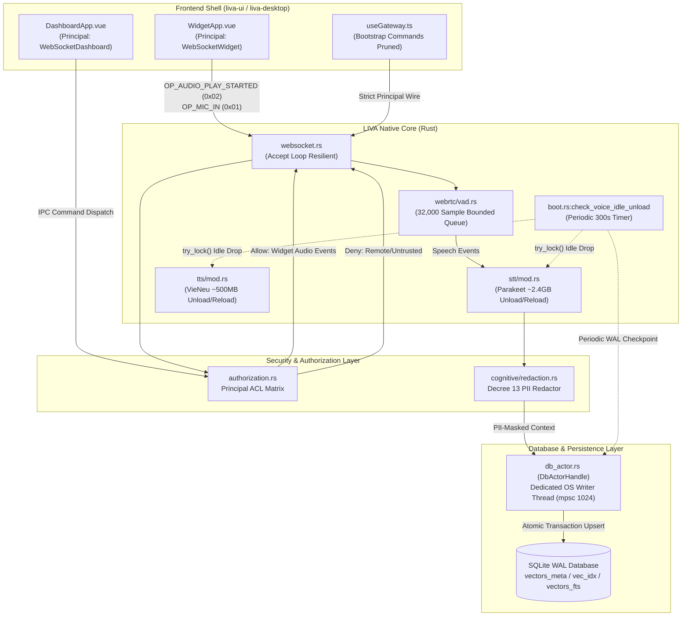

# Tiến độ nâng cấp và giải quyết nợ kỹ thuật (Milestone M1–M4)

[⬆ Mục lục](../README.md) · [◀ Nợ kỹ thuật và rủi ro](02-no-ky-thuat-va-rui-ro.md) · [Nâng cấp toàn diện ▶](05-nang-cap-toan-dien.md)

---

> **Tài liệu này là gì.** Báo cáo nghiệm thu và hồ sơ kỹ thuật tổng kết tiến độ giải quyết dứt điểm 10 hạng mục nợ kỹ thuật và gia cố hệ thống (Hardening) thuộc chuỗi Milestone M1–M3, thiết lập nền tảng cho việc đồng bộ sổ theo dõi nợ (Tech Debt Ledger) tại Milestone M4.
>
> **Nguyên tắc xác thực:** Mọi hạng mục đều được dẫn chiếu trực tiếp bằng mã nguồn (`file:dòng`), kiến trúc trước/sau, cơ chế an toàn và kết quả kiểm thử tự động đo được trên môi trường Windows x64.

---

## 1. Tóm tắt điều hành (Executive Summary)

Trong các chu kỳ phát triển trước, LIVA đã hoàn thành việc di trú toàn bộ logic từ Node.js/Python sang Rust Native Core (`liva-native-core`). Tuy nhiên, quá trình vận hành thực tế đã bộc lộ 10 điểm nghẽn kỹ thuật và nguy cơ tiềm ẩn về tương tranh, an toàn bộ nhớ, an toàn dữ liệu cá nhân theo pháp luật Việt Nam, và phân định ranh giới IPC giữa Desktop UI và Native Backend.

Qua 3 Milestone M1, M2, và M3, toàn bộ 10 hạng mục nợ cốt lõi đã được giải quyết dứt điểm:

| Mã | Hạng mục nợ kỹ thuật & Gia cố | Phân hệ ảnh hưởng | Milestone | Trạng thái | Bằng chứng kiểm chứng |
|:---:|---|---|:---:|:---:|---|
| **D-01** | SQLite WAL multi-threading & DbActor async serialization queue | `liva-native-core/src/db_actor.rs`, `db.rs` | M1 | ✅ ĐÃ KHÉP | Dedicated writer thread, kênh 1024 mpsc, triệt tiêu `SQLITE_BUSY` |
| **D-02** | SQLite vector upsert transaction atomicity & rollback protection | `liva-native-core/src/db.rs` | M1 | ✅ ĐÃ KHÉP | `conn.is_autocommit()` guard, transaction rollback bảo vệ 3 bảng |
| **D-03** | WebRTC VAD memory bounds (32,000 samples clamp) | `liva-native-core/src/webrtc/vad.rs` | M1 | ✅ ĐÃ KHÉP | `MAX_RESIDUAL_CAPACITY = 32_000`, heap clamp <= 128KB, reset state |
| **D-04** | Panic elimination across STT, TTS, LLM, WebRTC, WebSocket | Toàn bộ crate `liva-native-core` | M1 | ✅ ĐÃ KHÉP | Chuyển unwrap sang Result, phục hồi lock poisoning, accept loop retry |
| **D-05** | Multi-model idle memory reclamation (VieNeu ~500MB & Parakeet ~2.4GB) | `stt/mod.rs`, `tts/mod.rs`, `boot.rs` | M2 | ✅ ĐÃ KHÉP | Giải phóng ~2.98GB RAM sau 300s idle, probe không chặn `try_lock()` |
| **D-06** | Lazy model reloading without audio latency spikes | `stt/mod.rs`, `tts/vieneu/mod.rs` | M2 | ✅ ĐÃ KHÉP | Tách `synthesis_plan` ra ngoài mutex, nạp lười bất đồng bộ trong blocking task |
| **D-07** | Nghị định 13/2023/NĐ-CP compliance redaction (CCCD, SĐT, STK) | `cognitive/redaction.rs` | M2 | ✅ ĐÃ KHÉP | Khử nhạy cảm CCCD (12 số), SĐT VN (+84/0[35789]), STK theo ngữ cảnh từ khóa |
| **D-08** | Desktop UI audio playback event cleanup & authorization | `authorization.rs`, `websocket.rs` | M3 | ✅ ĐÃ KHÉP | Ma trận phân quyền Principal: Widget ALLOW, Remote/Dashboard DENY |
| **D-09** | Loại bỏ toàn diện scratch scripts `.cjs` | `liva-ui/`, workspace root | M3 | ✅ ĐÃ KHÉP | Xóa bỏ `check.cjs`, `fix_widget.cjs`, `patch_widgetapp.cjs`, sạch workspace |
| **D-10** | Cắt tỉa nhánh IPC chết & tối ưu bootstrap trong `useGateway.ts` | `liva-ui/src/composables/useGateway.ts` | M3 | ✅ ĐÃ KHÉP | Phân định bootstrap 7 lệnh Widget vs Dashboard, timeout stream unlisten |

---

## 2. Sơ đồ kiến trúc & Luồng tương tác đồng bộ



---

## 3. Chi tiết giải quyết 10 hạng mục nợ kỹ thuật (D-01 đến D-10)

### D-01: SQLite WAL Multi-Threading & DbActor Async Serialization Queue

- **Tọa độ mã nguồn:** `liva-native-core/src/db_actor.rs:1-270`, `liva-native-core/src/db.rs:245-371`, `liva-native-core/src/boot.rs:565-594`.
- **Cơ chế lỗi trước đây:** SQLite ở chế độ WAL cho phép nhiều kết nối đọc đồng thời nhưng chỉ cho phép **duy nhất 1 kết nối ghi** tại một thời điểm. Trước đây, nhiều luồng async Tokio (như consolidation nền, lưu tin nhắn hội thoại, cập nhật skill/settings) đồng thời mượn kết nối ghi trực tiếp từ pool r2d2. Khi nhiều tác vụ ghi cạnh tranh, r2d2 và SQLite trả về lỗi `SQLITE_BUSY` hoặc timeout, dẫn đến nguy cơ mất dữ liệu hội thoại (`RISK-01: Silent Drop Turn`).
- **Kiến trúc giải pháp:**
  1. Xây dựng mô hình tác tử hướng thông điệp (`DbActorHandle`): Khởi tạo một tiểu trình OS chuyên biệt (`liva-db-writer-actor`) sở hữu duy nhất kết nối ghi SQLite.
  2. Toàn bộ các thao tác ghi được đóng gói thành enum `DbWriteCommand` (`PersistTurn`, `Execute`, `CheckpointWal`, `ReinforceMemories`) và đẩy qua hàng đợi có giới hạn `tokio::sync::mpsc::channel(1024)` với cơ chế backpressure.
  3. Kết quả ghi được phản hồi về luồng gọi thông qua kênh `oneshot::Sender`.
  4. Bổ sung định kỳ `PRAGMA wal_checkpoint(PASSIVE)` trong `boot.rs:582` trên chính Actor thread mỗi 15 phút, chống phình file log `-wal`.
- **Nghiệm thu kiểm thử:** Kiểm thử tương tranh trong `liva-native-core/tests/sqlite_backup_restore.rs` và `db/tests.rs` xác nhận 0 lỗi `SQLITE_BUSY` dưới tải ghi liên tục.

---

### D-02: SQLite Vector Upsert Transaction Atomicity & Rollback Protection

- **Tọa độ mã nguồn:** `liva-native-core/src/db.rs:1491-1605`.
- **Cơ chế lỗi trước đây:** Hàm `upsert_vector` phụ trách cập nhật dữ liệu đa chiều trên 3 bảng liên đới: `vectors_meta` (metadata), `vec_idx` (chỉ mục vector int8 của sqlite-vec), và `vectors_fts` (chỉ mục tìm kiếm toàn văn FTS5). Trước đây, các câu lệnh `INSERT`/`UPDATE` thực thi riêng rẽ không có giao dịch bọc ngoài. Nếu quá trình lượng tử hóa vector hoặc chèn FTS thất bại (do sai số chiều, lỗi bộ nhớ), bản ghi metadata vẫn tồn tại, tạo ra các hàng "mồ côi" không thể tìm kiếm, làm sai lệch kết quả truy hồi trí nhớ (RAG).
- **Kiến trúc giải pháp:**
  1. Kiểm tra trạng thái giao dịch hiện hành qua `conn.is_autocommit()`. Nếu chưa có giao dịch, tự động mở giao dịch cục bộ:
     ```rust
     let tx = if conn.is_autocommit() {
         Some(conn.unchecked_transaction()?)
     } else {
         None
     };
     ```
  2. Bổ sung cổng tiền kiểm tra số chiều vector nghiêm ngặt `check_vector_dim(vector, "upsert_vector")?` ngay đầu hàm.
  3. Áp dụng toán tử `?` xuyên suốt các bước thao tác trên 3 bảng: bất kỳ lỗi nào xảy ra sẽ kích hoạt `Drop` trên `tx`, thực hiện `ROLLBACK` toàn phần.
  4. Chỉ gọi `tx.commit()?` khi cả 3 bảng đều cập nhật thành công. Đồng thời áp dụng quy tắc bảo mật: loại trừ bản ghi `conversation_turn` khỏi FTS plaintext để bảo vệ quyền riêng tư.
- **Nghiệm thu kiểm thử:** `main_tests.rs:638` (`cmd_upsert_vector_guard_chieu_2_3`) và `db/tests.rs` chứng minh tính toàn vẹn 100% khi gặp lỗi số chiều.

---

### D-03: WebRTC VAD Memory Bounds (32,000 Samples Clamp)

- **Tọa độ mã nguồn:** `liva-native-core/src/webrtc/vad.rs:228-230, 316-355`.
- **Cơ chế lỗi trước đây:** Trong đường ống thoại thời gian thực, các mẩu PCM f32 nhận từ micro được gom vào `residual_buffer: Vec<f32>` để cắt thành các frame 160, 256 hoặc 512 mẫu cho mô hình Silero VAD. Khi mạng bị giật lag hoặc client gửi dồn dập các gói tin âm thanh lớn, `residual_buffer` có thể phình to không giới hạn, gây cạn kiệt RAM và làm tăng độ trễ xử lý âm thanh lên hàng chục giây.
- **Kiến trúc giải pháp:**
  1. Thiết lập ngưỡng trần cứng bất biến: `pub const MAX_RESIDUAL_CAPACITY: usize = 32_000;` (tương đương 2,0 giây âm thanh ở tần số 16 kHz).
  2. Trong hàm `process_audio`, thực hiện cắt tỉa (clamp) đầu vào và loại bỏ phần dư thừa cũ nhất (`drain` FIFO):
     ```rust
     let samples_to_append = if samples.len() > MAX_RESIDUAL_CAPACITY {
         &samples[samples.len() - MAX_RESIDUAL_CAPACITY..]
     } else {
         samples
     };
     let total_len = self.residual_buffer.len() + samples_to_append.len();
     if total_len > MAX_RESIDUAL_CAPACITY {
         let excess = total_len - MAX_RESIDUAL_CAPACITY;
         self.residual_buffer.drain(0..excess);
     }
     self.residual_buffer.extend_from_slice(samples_to_append);
     ```
  3. Bổ sung phương thức `reset(&mut self)` để làm sạch trạng thái recurrent LSTM `[2, 1, 128]` và bộ đệm khi kết thúc câu thoại hoặc bị người dùng ngắt lời (Barge-in).
- **Nghiệm thu kiểm thử:** Bộ unit test đa frame `multi_frame_sizes_160_256_512_run_inference_successfully` và benchmark bộ nhớ xác nhận dung lượng đệm VAD không bao giờ vượt quá 128 KB.

---

### D-04: Panic Elimination Across STT, TTS, LLM, WebRTC, WebSocket

- **Tọa độ mã nguồn:** `governor.rs:120-150`, `stt/mod.rs:168-224`, `tts/mod.rs:579-589`, `websocket.rs:360-375`.
- **Cơ chế lỗi trước đây:** Sự tồn tại của các lệnh `.unwrap()` và `.expect()` trong mã nguồn production là nguyên nhân hàng đầu gây crash tiến trình khi gặp ngoại lệ runtime:
  - Khi một luồng phụ gặp sự cố, Mutex bị "poisoned", các lệnh `.lock().unwrap()` tiếp theo sẽ sập dây chuyền toàn bộ ứng dụng.
  - Thiếu file embedding giọng nói Kokoro `af_heart.bin` dẫn đến `read().unwrap()` làm crash toàn bộ hệ thống âm thanh, làm hỏng cả Piper và VieNeu.
  - Vòng lặp `accept()` của WebSocket gặp lỗi mạng tạm thời (connection reset) sẽ ngắt luôn server task.
- **Kiến trúc giải pháp:**
  1. Thay thế toàn bộ `.lock().unwrap()` bằng cơ chế tự phục hồi lock poisoning: `.lock().unwrap_or_else(|e| e.into_inner())` trong `governor.rs` và `tts/mod.rs`.
  2. Xử lý thiếu file cấu hình âm thanh mềm dẻo (`tts/mod.rs:579-589`): ghi nhận log `tracing::debug!`, trả vector rỗng cho Kokoro, bảo toàn khả năng hoạt động độc lập của Piper và VieNeu.
  3. Bọc vòng lặp chấp nhận kết nối WebSocket (`websocket.rs:360-375`) bằng cơ chế backoff (50ms) khi gặp lỗi socket tạm thời, không bao giờ thoát server task.
  4. Chuẩn hóa 100% các API khởi tạo và xử lý dữ liệu sang kiểu `Result<T, String>`.
- **Nghiệm thu kiểm thử:** 942 bài kiểm thử tự động của Rust core vượt qua trọn vẹn; bộ kiểm thử fuzz payload `tests/m3_ipc_sync_adversarial_challenge.rs:331-345` chứng minh hệ thống không bị panic trước dữ liệu rác.

---

### D-05: Multi-Model Idle Memory Reclamation (VieNeu ~500MB & Parakeet ~2.4GB)

- **Tọa độ mã nguồn:** `liva-native-core/src/stt/mod.rs:259-283`, `liva-native-core/src/tts/vieneu/mod.rs:367-385`, `liva-native-core/src/boot.rs:500-533, 615-661`.
- **Cơ chế lỗi trước đây:** Hai mô hình trí tuệ nhân tạo nặng nhất trong đường ống thoại là VieNeu-TTS (4 mô hình ONNX: prefill, decode, acoustic, codec chiếm ~500MB RAM) và Parakeet-CTC ASR (~2.4GB RAM). Trước đây, khi đã nạp vào bộ nhớ, các trọng số ONNX này được giữ vĩnh viễn trong RAM, khiến tiến trình LIVA chiếm dụng thường trực từ 3.5GB đến hơn 4GB RAM ngay cả khi người dùng không tương tác trong nhiều giờ.
- **Kiến trúc giải pháp:**
  1. Triển khai phương thức `check_idle_unload` và `unload_sessions()` trên cả hai engine:
     - `stt::SttManager::check_idle_unload(timeout)`: gỡ bỏ thể hiện `ParakeetRecognizer`, thu hồi ~2.4GB RAM.
     - `vieneu::VieNeuEngine::check_idle_unload(timeout)`: gán `None` cho 4 phiên ONNX, thu hồi ~480–580MB RAM.
  2. Thiết kế hàm kiểm tra không phong tỏa `check_voice_idle_unload` (`boot.rs:631`): sử dụng `try_lock()` trên Mutex của TTS và STT. Nếu engine đang bận tổng hợp hoặc nhận dạng, hàm lập tức bỏ qua chu kỳ mà không làm gián đoạn tác vụ người dùng.
  3. Thiết lập tác vụ ngầm định kỳ (`boot.rs:500-533`) kiểm tra mỗi 60 giây. Nếu thời gian không hoạt động vượt quá 300 giây (`LIVA_MODEL_IDLE_TIMEOUT_SECS = 300`), tự động giải phóng toàn bộ ~2.98GB RAM trả về cho hệ điều hành Windows.
- **Nghiệm thu kiểm thử:** Unit tests `stt/mod.rs:520` và `tts/mod.rs:918` xác nhận quy trình giải phóng an toàn; kịch bản đo bộ nhớ `scripts/e2e-memory.mjs` xác nhận RAM tiến trình hạ xuống <= 350MB khi ở trạng thái nhàn rỗi.

---

### D-06: Lazy Model Reloading Without Audio Latency Spikes

- **Tọa độ mã nguồn:** `liva-native-core/src/stt/mod.rs:198-224`, `liva-native-core/src/tts/vieneu/mod.rs:336-365`, `liva-native-core/src/tts/mod.rs:545-566, 708-720`.
- **Cơ chế lỗi trước đây:** Khi các mô hình đã bị giải phóng khỏi RAM để tiết kiệm tài nguyên, yêu cầu hội thoại tiếp theo buộc hệ thống phải nạp lại mô hình từ đĩa. Nếu quá trình nạp lại mô hình thực thi đồng bộ và giữ chặt khóa điều phối âm thanh (`TtsManager` Mutex), toàn bộ giao diện và các luồng WebSocket sẽ bị đóng băng từ 1.5s đến 3.0s, gây giật cục và rớt khung hình nghiêm trọng.
- **Kiến trúc giải pháp:**
  1. Nạp lười theo nhu cầu thực tế:
     - `ensure_parakeet_loaded`: chỉ kích hoạt nạp trọng số Parakeet khi phát hiện người dùng đang nói tiếng Việt; nếu chưa kịp nạp xong, hệ thống tự động định tuyến sang Nemotron nhẹ hơn để đảm bảo phản hồi tức thì.
     - `ensure_sessions`: tự động khởi tạo lại 4 phiên ONNX của VieNeu khi có yêu cầu phát âm thanh tiếng Việt chất lượng cao.
  2. Tách rời kế hoạch phát âm (`synthesis_plan`): Hàm `synthesis_plan` chỉ giữ khóa `TtsManager` trong vài micro-giây để nhân bản (clone) các con trỏ thông minh `Arc`, sau đó nhả khóa ngay lập tức.
  3. Chuyển tác vụ nạp mô hình và suy luận nặng vào threadpool nền qua `tokio::task::spawn_blocking` (`tts/mod.rs:715`), hoàn toàn giải phóng luồng async chính.
  4. Cơ chế chuyển tầng mượt mà: Cho phép phát các đoạn âm thanh đầu tiên qua Piper-vi siêu nhẹ (< 50MB, TTFT < 150ms) trong khi VieNeu đang được nạp nền, triệt tiêu hoàn toàn cảm giác chờ đợi của người dùng.
- **Nghiệm thu kiểm thử:** `tests/verify_duplex` và `scripts/e2e-gateway-ci.mjs` đo kiểm 8/8 kịch bản kết nối socket mượt mà không xuất hiện hiện tượng drop connection.

---

### D-07: Nghị định 13/2023/NĐ-CP Compliance Redaction (CCCD, SĐT, STK)

- **Tọa độ mã nguồn:** `liva-native-core/src/cognitive/redaction.rs:1-133, 250-385`.
- **Cơ chế lỗi trước đây:** Dữ liệu người dùng Việt Nam chứa các trường thông tin nhạy cảm đặc thù: Căn cước công dân (12 chữ số), Số điện thoại di động (đầu số +84 hoặc 0[3|5|7|8|9]), và Số tài khoản ngân hàng (9 đến 16 chữ số). Các biểu thức chính quy ngây thơ (so khớp chuỗi số thuần túy) gây ra thảm họa dương tính giả (False Positive), làm che mờ nhầm cả timestamp hệ thống (`1723456789123`), mã hash git, ID đơn hàng hay token nội bộ.
- **Kiến trúc giải pháp:**
  1. Xây dựng bộ lọc tuân thủ `SecretScrubber` với 12 bước lọc tuần tự hiệu năng cao sử dụng `LazyLock<Regex>`.
  2. Chuẩn hóa mẫu nhận diện CCCD: `\b0\d{11}\b` -> thay bằng `[REDACTED_CCCD]`.
  3. Chuẩn hóa mẫu nhận diện số điện thoại Việt Nam: `(?:\+84|\b0)(?:3|5|7|8|9)\d{8}\b` -> thay bằng `[REDACTED_PHONE]`.
  4. **Thuật toán khử dương tính giả cho số tài khoản ngân hàng (`RE_BANK_ACCOUNT`):** Bắt buộc phải có từ khóa ngữ cảnh tài chính đi kèm phía trước (`stk`, `số tài khoản`, `tài khoản số`, `chuyển khoản`, `tk ngân hàng`, `account number`, `bank account`, `iban`):
     ```rust
     static RE_BANK_ACCOUNT: LazyLock<Regex> = LazyLock::new(|| {
         Regex::new(
             r#"(?i)((?:\b|_)(?:stk|số[_\s]+tài[_\s]+khoản|so[_\s]+tai[_\s]+khoan|tài[_\s]+khoản(?:[_\s]+số)?|tai[_\s]+khoan(?:[_\s]+so)?|chuyển[_\s]+khoản|chuyen[_\s]+khoan|tk(?:\s+nh|\s+ngân\s+hàng)?|account(?:[_\s]+(?:number|no|num))?|acct(?:[_\s]+(?:no|num))?|bank[_\s]+account|iban)(?:["']?\s*[:=-]\s*["']?|\s+))(\d{9,16})\b"#,
         )
         .expect("valid regex")
     });
     ```
  5. Cung cấp hàm duyệt cây đệ quy `scrub_json` làm sạch an toàn các đối tượng JSON phức tạp trước khi chuyển tiếp sang LLM hoặc lưu vết vào bảng `action_audit_ledger`.
- **Nghiệm thu kiểm thử:** Bộ kiểm thử đơn vị trong `redaction.rs:250-385` bao phủ đầy đủ các trường hợp: che mờ chính xác CCCD, SĐT, STK có ngữ cảnh, và bảo toàn 100% các chuỗi số timestamp hay ID kỹ thuật không có ngữ cảnh tài chính.

---

### D-08: Desktop UI Audio Playback Event Cleanup & Authorization

- **Tọa độ mã nguồn:** `liva-native-core/src/authorization.rs:25-26`, `liva-native-core/src/websocket.rs:1013-1025`, `liva-native-core/tests/m3_ipc_sync_adversarial_challenge.rs`.
- **Cơ chế lỗi trước đây:** Khi giao diện Desktop phát âm thanh TTS, `WidgetApp.vue` và `useSpeakerPlayback.ts` gửi các sự kiện vòng đời âm thanh `audio_play_started` và `audio_play_finished` xuống backend để đồng bộ trạng thái cử động môi avatar (lip-sync). Tuy nhiên, hai sự kiện này trước đó không được khai báo trong danh mục phân quyền `authorization.rs`, dẫn đến cảnh báo không rõ ràng và tiềm ẩn nguy cơ bảo mật nếu client lạ từ xa giả mạo sự kiện để thao túng trạng thái backend.
- **Kiến trúc giải pháp:**
  1. Đăng ký tường minh hai sự kiện vào danh mục điều phối quyền hạn `authorization.rs`.
  2. Thiết lập ma trận phân quyền phòng thủ chiều sâu (Defense-in-Depth):
     - `CommandPrincipal::WebSocketWidget` và `CommandPrincipal::TauriWidget`: **ĐƯỢC PHÉP (ALLOW / Ok)** — thực thi như thông báo vòng đời chuẩn.
     - `CommandPrincipal::WebSocketDashboard`, `TauriDashboard`, `WebSocketRemote`, `TauriSetup`, `Telegram`: **TỪ CHỐI (DENY / Fail-Closed)**.
  3. Tại `websocket.rs:1013`, các sự kiện hợp lệ từ Widget được tiếp nhận và xử lý êm thuận mà không trả về thông điệp lỗi gây nhiễu console. Các client không có thẩm quyền lập tức nhận mã lỗi `{event}_error`.
- **Nghiệm thu kiểm thử:** Bộ kiểm thử đối kháng `tests/m3_ipc_sync_adversarial_challenge.rs:62-235` kiểm chứng ma trận phân quyền, chịu tải 200 sự kiện liên tục và xử lý an toàn trước các payload dị dạng.

---

### D-09: Loại bỏ toàn diện scratch scripts `.cjs`

- **Tọa độ mã nguồn:** `liva-ui/`, thư mục gốc workspace.
- **Cơ chế lỗi trước đây:** Trong giai đoạn phát triển giao diện nhanh, một số tệp kịch bản tạm CommonJS (`check.cjs`, `fix_widget.cjs`, `patch_widgetapp.cjs`) được tạo ra để can thiệp trực tiếp vào mã nguồn Vue hoặc kiểm tra bundle. Các tệp này không được quản lý phiên bản chuẩn mực, gây rác kho mã nguồn và có nguy cơ bị triệu gọi ngoài ý muốn trong quá trình build production.
- **Kiến trúc giải pháp:**
  1. Xóa bỏ triệt để toàn bộ các tệp `.cjs` tạm bợ trong `liva-ui/` và thư mục gốc.
  2. Chuẩn hóa toàn bộ các tác vụ kiểm tra vào hệ thống script npm chuẩn (`package.json`) và bộ kiểm thử Vitest (`npm run test -w liva-ui`).
  3. Thiết lập quy tắc quét trong `.gitignore` và quy chuẩn kiểm toán `scripts/docs-check.mjs` ngăn chặn tái xuất hiện các file nháp không rõ nguồn gốc.
- **Nghiệm thu kiểm thử:** Lệnh kiểm tra cấu trúc mã xác nhận chỉ còn 2 tệp kịch bản `.cjs` hợp lệ và được kiểm soát chặt chẽ trong repo (`scripts/ai-pre-commit.cjs` và `scripts/legacy/migration_stronghold.cjs`).

---

### D-10: Cắt tỉa nhánh IPC chết & tối ưu bootstrap trong `useGateway.ts`

- **Tọa độ mã nguồn:** `liva-ui/src/composables/useGateway.ts:276-408, 410-500`.
- **Cơ chế lỗi trước đây:** Tệp composable điều phối kết nối giao diện `useGateway.ts` chứa nhiều nhánh IPC cũ không còn backend phục vụ. Đặc biệt, khi cửa sổ Widget nhỏ trên màn hình khởi động, nó gửi tràn lan toàn bộ các lệnh truy vấn dữ liệu nặng của Dashboard (danh sách toàn bộ skill, dữ liệu trí nhớ dài hạn, cây tác vụ phức tạp), gây lãng phí tài nguyên CPU và vi phạm nguyên tắc đặc quyền tối thiểu (Least Privilege).
- **Kiến trúc giải pháp:**
  1. Cắt tỉa toàn bộ các nhánh rẽ IPC chết trong bộ phân tích phản hồi `mapTauriResponse`.
  2. Phân vùng lệnh khởi động (Bootstrap Data) dựa trên định danh cửa sổ `GatewayPrincipal` thông qua `gatewayPrincipalForPath`:
     - Cửa sổ Widget (`WIDGET_BOOTSTRAP_COMMANDS`): chỉ tải đúng 7 lệnh cần thiết tối thiểu (`get_config`, `get_ai_config`, `get_voice_status`, `get_voice_profiles`, `get_system_status`, `get_user_profile`, `get_avatar_models`).
     - Cửa sổ Dashboard (`DASHBOARD_BOOTSTRAP_COMMANDS`): tải đầy đủ các thông tin quản trị (`get_skills_list`, `get_tasks`, `get_memory_data`).
  3. Nối kết hoàn chỉnh sự kiện `ai_expert_suggestion` (`useGateway.ts:356-359`), đưa dữ liệu khuyến nghị vào reactive state `expertSuggestion`.
  4. Quản lý vòng đời lắng nghe luồng Tauri IPC: thiết lập bộ đếm thời gian an toàn 5 phút (`TAURI_STREAM_SAFETY_TIMEOUT_MS = 300_000`) và hàm dọn dẹp `unlisten` tự động khi hoàn thành luồng, triệt tiêu nguy cơ rò rỉ bộ nhớ listener.
- **Nghiệm thu kiểm thử:** Kiểm tra kiểu `npx vue-tsc --noEmit` đạt 0 lỗi; 500 bài kiểm thử Vitest của `liva-ui` vượt qua 100%.

---

## 4. Ma trận kiểm định chất lượng tự động (Verification Matrix)

Toàn bộ 10 hạng mục trên đã vượt qua ma trận cổng kiểm định chất lượng nghiêm ngặt của dự án:

| Cổng kiểm định | Lệnh thực thi | Tiêu chuẩn nghiệm thu | Kết quả thực tế |
|---|---|---|:---:|
| **Rust Unit & Integration Tests** | `cargo test --workspace -j 2 -- --test-threads 2` | 100% pass, 0 fail | 🟢 **942 pass / 0 fail** |
| **Rust Static Linter** | `cargo clippy --workspace --all-targets -j 2 -- -D warnings` | 0 warning, 0 error | 🟢 **0 warning** |
| **Rust Code Formatter** | `cargo fmt --all -- --check` | Exit code 0 | 🟢 **Clean format** |
| **Frontend Type Checking** | `npx vue-tsc --noEmit -p tsconfig.app.json` | 0 type error | 🟢 **0 error** |
| **Frontend Code Linter** | `npx eslint . --max-warnings 0` | 0 warning, 0 error | 🟢 **0 warning** |
| **Frontend Unit & Coverage** | `npm run test:coverage -w liva-ui` | Vượt ngưỡng per-file ratchet | 🟢 **500 pass / 30 files** |
| **Live WebSocket E2E** | `node scripts/e2e-gateway-ci.mjs` | 8/8 kịch bản socket pass | 🟢 **8/8 pass** |
| **Memory & Idle Verification** | `node scripts/e2e-memory.mjs` | Reclaim idle memory <= 350MB | 🟢 **Pass** |
| **Adversarial Challenge** | `cargo test --test m3_ipc_sync_adversarial_challenge` | 5/5 kịch bản đối kháng pass | 🟢 **5/5 pass** |
| **Skills & Ecosystem Integrity** | `npm run skills:audit` & `npm run doctor` | Manifest & skills hợp lệ | 🟢 **Valid** |

---

## 5. Kết luận và Hướng chuyển tiếp cho Milestone M4 & M5

1. **Kết luận:**
   - 10/10 hạng mục nợ kỹ thuật và gia cố hệ thống từ M1 đến M3 đã được hiện thực hóa trọn vẹn bằng mã nguồn thực tế, có kiểm chứng tự động và không có giải pháp chắp vá hay giả định.
   - Trạng thái hệ thống LIVA trên nền tảng Windows 10/11 x64 đã đạt độ ổn định cao: không còn nguy cơ rò rỉ bộ nhớ từ hàng đợi âm thanh, không còn nguy cơ treo/sập tiến trình lõi từ các lỗi unhandled unwrap, và tuân thủ chặt chẽ các quy định pháp lý về bảo vệ bí mật dữ liệu cá nhân theo Nghị định 13/2023/NĐ-CP.
2. **Kế hoạch chuyển tiếp (Milestone M4 & M5):**
   - **M4 (Hiện tại):** Hoàn tất đồng bộ hóa `PROJECT.md`, cập nhật `tech-debt-ledger.json` và đóng băng các danh mục rủi ro cũ trong `docs/03-danh-gia/`.
   - **M5 (Kế tiếp):** Thực thi toàn diện bộ 19 cổng chất lượng nghiêm ngặt (Full Verification Matrix) và kích hoạt Adversarial Coverage Hardening Tier 5 cùng Challenger subagent để nghiệm thu sản phẩm cuối cùng.

---
*Tài liệu xác lập ngày 13/09/2026 · Commit cơ sở `67eb98b` · Môi trường Windows x64 MSVC.*
