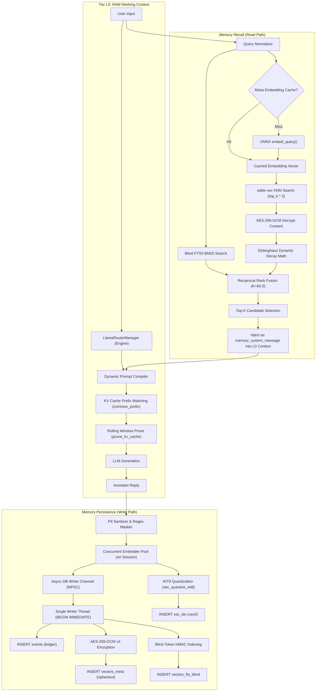
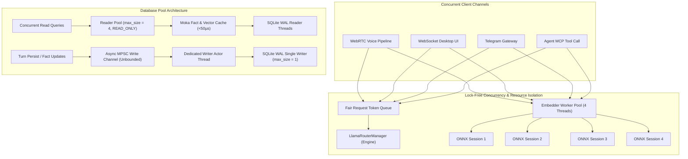
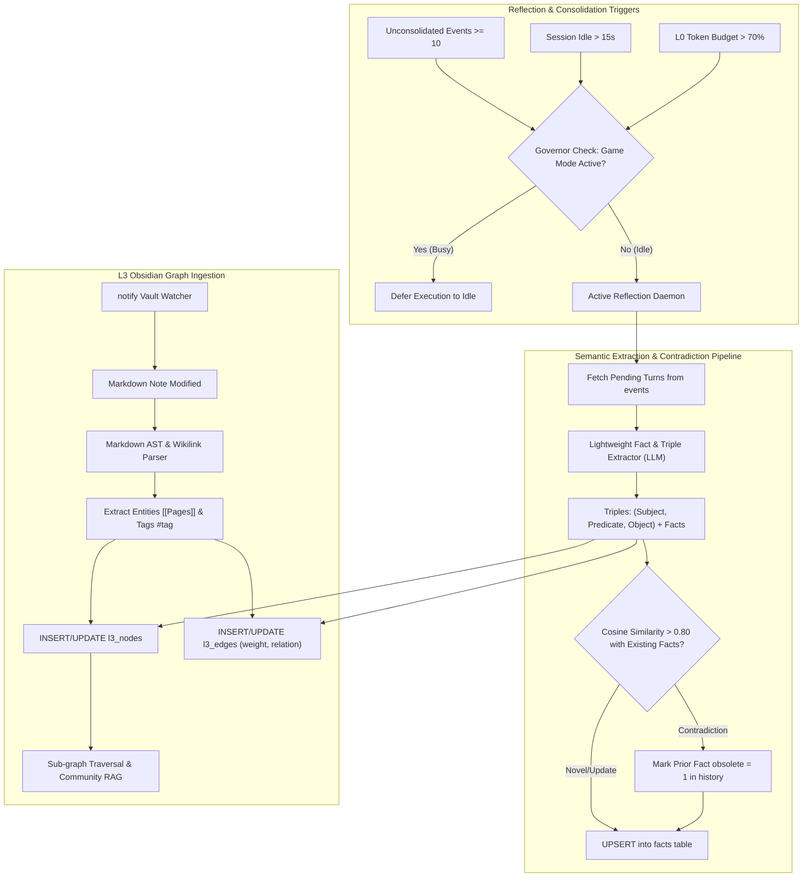
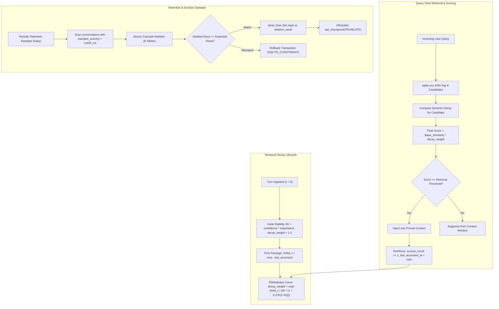

# Master Technical Architecture Audit & Modernization Blueprint
## LIVA Native 4-Tier Memory Hierarchy (L0, L1, L2, L3) & Background Daemons


- **Document Version**: 2.0.0-PROD
- **Author**: Senior Systems Architect & Security Auditor
- **Target Subsystem**: `liva-native-core` (Unified Native Rust Engine)
- **Status**: Authoritative Architectural Baseline & Execution Blueprint
- **Target File Path**: `docs/03-danh-gia/LIVA_4TIER_MEMORY_ARCHITECTURE_AUDIT_AND_BLUEPRINT.md`

---

# Table of Contents
1. [Executive Summary & Architecture Scorecard](#1-executive-summary--architecture-scorecard)
   - 1.1 Architectural Overview & Paradigm
   - 1.2 Ground-Truth Architecture Scorecard (Specification vs. As-Built Reality)
   - 1.3 Key Metrics & Runtime Characteristics
2. [Deep Code Audit of the 4-Tier Memory Stack](#2-deep-code-audit-of-the-4-tier-memory-stack)
   - 2.1 Tier L0: RAM Working Context & LLM In-Memory Engine
   - 2.2 Tier L1: Structured SQLite Memory & Transactional Ledger
   - 2.3 Tier L2: VectorMemory (sqlite-vec) & Dense-Sparse Hybrid Search
   - 2.4 Tier L3: Knowledge Graph & Obsidian Vault Long-Term Memory
   - 2.5 Background Daemons & Processing Pipelines
3. [Bottleneck, Concurrency & Risk Matrix](#3-bottleneck-concurrency--risk-matrix)
   - 3.1 Comprehensive Risk Matrix (Ranked by Severity)
   - 3.2 Lock Contention & Single-Writer WAL Serialization
   - 3.3 Global Mutex Head-of-Line Blocking
   - 3.4 Memory Drift, Decay Stagnation & Hallucination Amplification
   - 3.5 Data Privacy, Cryptographic Zeroization & Regulatory Compliance (GDPR / Decree 13)
4. [State-of-the-Art Alignment & Modernization Blueprint](#4-state-of-the-art-alignment--modernization-blueprint)
   - 4.1 Comparative Architectural Alignment (Mem0, MemGPT/Letta, GraphRAG)
   - 4.2 High-Performance Rust Concurrency & Zero-Copy Primitives
   - 4.3 Dynamic Ebbinghaus Temporal Decay & Reinforcement Engine
   - 4.4 Adaptive Reflection Daemon & Semantic Contradiction Engine
   - 4.5 Schema Evolution (v8/v9) & Searchable Symmetric Encryption (SSE)
5. [Visual Architecture & Lifecycle Diagrams](#5-visual-architecture--lifecycle-diagrams)
   - 5.1 Target 4-Tier Memory Lifecycle & Read/Write Pipeline
   - 5.2 Concurrency, Lock Isolation & Pool Architecture
   - 5.3 Semantic Reflection, Consolidation & GraphRAG Pipeline
   - 5.4 Dynamic Decay, Eviction & Reinforcement Engine
6. [Implementation Roadmap & Migration Plan](#6-implementation-roadmap--migration-plan)
   - 6.1 Phase 1: Concurrency Safety, Silent-Drop Hotfix & Privacy Zeroization
   - 6.2 Phase 2: Concurrent Embedder Pool, Moka Caching & Dynamic Decay
   - 6.3 Phase 3: Active Reflection Daemon, DLQ Re-drive & Contradiction Queue
   - 6.4 Phase 4: Obsidian Real-Time Sync, GraphRAG & Schema Evolution
   - 6.5 Backward Compatibility & IPC Stability Guarantee

---

# 1. Executive Summary & Architecture Scorecard

## 1.1 Architectural Overview & Paradigm
LIVA's native memory subsystem in `liva-native-core` is engineered to provide local-first, low-latency, privacy-hardened cognitive persistence for personal AI assistants across multi-modal interfaces (Desktop GUI, WebRTC Voice, Telegram Gateway, and Obsidian Vault). The architecture spans four distinct hierarchical tiers:
- **L0 (RAM Working Context)**: Ephemeral working memory, token budget management, sliding window message pruning, and KV-cache prefix optimization.
- **L1 (Structured SQLite Memory)**: Transactional storage for structured facts, encrypted conversation checkpoints, outbox staging, and immutable event ledgers.
- **L2 (VectorMemory sqlite-vec & H-MEM)**: Dense vector similarity search via `sqlite-vec` INT8 quantization combined with BM25 sparse lexical search via FTS5 in a Reciprocal Rank Fusion ($K=60.0$) pipeline.
- **L3 (Knowledge Graph & Long-Term Obsidian Storage)**: Entity-relationship knowledge graphs and bi-directional markdown knowledge vault synchronization.

```
+-----------------------------------------------------------------------------------------------+
|                                    LIVA 4-TIER MEMORY HIERARCHY                               |
+-----------------------------------------------------------------------------------------------+
|  L0: RAM Context        |  AgentState (Vec<Value>), LlamaRouterManager, KV Cache (Q8_0)       |
|  L1: Structured SQLite  |  DatabasePool (1W/4R WAL), facts (AES-256-GCM v2), events ledger    |
|  L2: Vector & H-MEM     |  vec_idx (vec0 INT8[384]), vectors_meta, FTS5 Hybrid RRF (K=60.0)  |
|  L3: Knowledge Graph    |  l3_nodes/l3_edges (Dormant), NativeMcpServer (Obsidian Vault Tools) |
+-----------------------------------------------------------------------------------------------+
|  Background Daemons     |  spawn_projection_consumer (30s Lineage Ticker), DLQ 3-Strikes      |
+-----------------------------------------------------------------------------------------------+
```

## 1.2 Ground-Truth Architecture Scorecard (Specification vs. As-Built Reality)

The comprehensive audit reveals a significant dichotomy between legacy design documents (`docs/99-luu-tru/kien-truc-nodejs-v29/02_Memory_Subsystem.md`, Obsidian LLM Wiki) and the compiled Rust binary in `liva-native-core`. While the data safety, cryptographic security, and vector retrieval layers are functional, background semantic processing and graph reasoning are currently dormant.

| Subsystem / Tier | Architectural Specification (Target) | As-Built Rust Implementation (`liva-native-core`) | Maturity Score | Production Status |
|---|---|---|---|---|
| **L0 RAM Context** | Token-budgeted sliding window, KV prefix reuse, delimiter-safe compilation, dynamic memory RAG injection. | Implemented in `state.rs`, `engine.rs`, `prompt/mod.rs`, `memory_scope.rs`. 20-message static trim, `common_prefix` KV cache reuse, `<tool_result>` sanitization. | **8.5 / 10** | **Production Operational** |
| **L1 Structured SQLite** | WAL mode connection pool, atomic event bricks ($\Phi/\Psi$), AES-256-GCM v2 encryption, cascade deletion audit trail. | Implemented in `db.rs`, `crypto.rs`, `deletion.rs`. Schema v7 (22 tables), 1 writer (`max_size(1)`) + 4 readers, HKDF-SHA256 encrypted facts, fail-closed `FactRead::Locked`. $\Phi/\Psi$ brick columns present but unpopulated (NULL). | **9.0 / 10** | **Production Operational** |
| **L2 Vector & H-MEM** | `sqlite-vec` INT8 quantization, multilingual-e5-small embeddings, FTS5 hybrid search (RRF $K=60.0$), transcript privacy. | Implemented in `liva-native-core/src/db.rs:1163-1633`, `embedder.rs`. INT8 unit quantization, AES-256-GCM encrypted transcript content, FTS exclusion for dialogue. Bottlenecked on global `Mutex<Embedder>`. | **8.0 / 10** | **Operational with Bottlenecks** |
| **L3 Knowledge Graph** | Entity-relation extraction, graph traversal, automated Obsidian vault sync, wikilink parsing. | `l3_nodes` and `l3_edges` tables exist in SQLite Schema v7 but have **zero runtime writers and readers**. Obsidian access is tool-based via `NativeMcpServer` ($O(N)$ unindexed disk walk). | **2.5 / 10** | **Dormant Schema & Tool-Only** |
| **Reflection Daemon** | Autonomous background LLM reflection, $\Phi/\Psi$ fact extraction, 12s debounce timer. | **Non-existent** in Rust runtime. No background LLM extraction thread exists. | **0.0 / 10** | **Missing (Architectural Void)** |
| **Consolidation Pipeline** | 30m idle cron, RAPTOR tree clustering, semantic contradiction resolution. | Implemented as `spawn_projection_consumer` (`memory_consolidation.rs`). Fixed 30s ticker verifying SQLite `vectors_meta` row lineage. Zero LLM calls, zero semantic clustering. | **4.0 / 10** | **Structural Validator Only** |
| **Temporal Decay** | Ebbinghaus forgetting curve ($S(t) = S_0 \cdot e^{-\lambda t}$), access count boosting. | Columns `decay_weight` and `memory_strength` exist in schema with default `1.0`. **No decay calculation exists**; decay factor is permanently static. | **1.0 / 10** | **Stagnant (Static 1.0)** |
| **Data Privacy & GDPR** | Hardware zeroization of cryptographic buffers, regex/NER PII masking, universal subject erasure. | Strict cascade deletion with row count assertions and SHA-256 audit logs in `deletion.rs`. Missing `zeroize` crate; raw text vectorized into INT8 index; `delete_subject` rejects non-local owners. | **7.0 / 10** | **Hardened Deletion / Soft RAM Exposure** |

## 1.3 Key Metrics & Runtime Characteristics

```
+-----------------------------------------------------------------------------------------------+
|                                    RUNTIME SYSTEM METRICS                                     |
+-----------------------------------------------------------------------------------------------+
|  Metric                                  | As-Built Value         | Target SOTA Value         |
+------------------------------------------+------------------------+---------------------------+
|  SQLite Schema Version                   | v7 (22 Tables/Indices) | v9 (with SSE & Graph Ind) |
|  Database Writer Connections             | 1 (max_size = 1)       | 1 (Dedicated Tx Channel)  |
|  Database Reader Connections             | 4 (max_size = 4)       | 8 (Async Moka Cached)     |
|  L0 Context History Window               | 20 Messages (Static)   | Dynamic Token Packing     |
|  Embedding Vector Dimension              | 384 (INT8 Quantized)   | 384 (INT8 Quantized)      |
|  Embedding Inference Concurrency         | Serialized (1 Thread)  | Parallel Pool (4 Workers) |
|  Hybrid Search RRF Smoothing Factor (K)  | 60.0                   | 60.0 (Adaptive Dynamic)   |
|  Memory Fact In-Memory Cache             | None (Direct Disk I/O) | Moka LRU (<50µs hit)      |
|  Projection Worker Tick Interval         | 30 seconds (Fixed)     | Adaptive Event/Idle-Gated |
|  DLQ Retry Threshold                     | 3 Strikes (No Re-drive)| 3 Strikes + Auto-Repair   |
|  Temporal Half-Life Decay                | Disabled (Weight=1.0)  | Ebbinghaus (tau=30 days)  |
+-----------------------------------------------------------------------------------------------+
```

---

# 2. Deep Code Audit of the 4-Tier Memory Stack

## 2.1 Tier L0: RAM Working Context & LLM In-Memory Engine

### 2.1.1 Structs, Working State & Thread Safety
- **`AgentState` Struct** (`liva-native-core/src/agent/state.rs:20-25`):
  ```rust
  #[derive(Debug, Serialize, Deserialize, Clone, Default)]
  pub struct AgentState {
      pub messages: Vec<Value>,
      pub current_node: String,
      pub context: HashMap<String, Value>,
  }
  ```
  - **Thread-Safety & Graph Ownership**: `AgentState` is passed by value (`clone()`) across asynchronous nodes in the state graph (`liva-native-core/src/agent/graph.rs:50-74`).
  - **State Checkpointing**: `SqliteCheckpointer` (`liva-native-core/src/agent/memory.rs:6-74`) serializes `AgentState` into JSON, encrypts the payload via `EncryptionEngine::encrypt` (AES-256-GCM v2), and persists it into `agent_checkpoints (thread_id, state_json)` upon turn completion (`liva-native-core/src/agent/graph/pipeline.rs:462`).

### 2.1.2 Working Context Window & Sliding Window Management
- **History Message Cap** (`liva-native-core/src/agent/state.rs:12-18`): Configured via `LIVA_MAX_HISTORY_MESSAGES` (defaults to 20 messages, approximately 10 dialog turns).
- **Trimming Implementation** (`liva-native-core/src/agent/state.rs:44-65`):
  ```rust
  pub fn trim_messages(messages: &mut Vec<Value>) {
      let cap = max_history_messages();
      let system_msg = messages
          .first()
          .filter(|m| m.get("role").and_then(|r| r.as_str()) == Some("system"))
          .cloned();
      let body_start = usize::from(system_msg.is_some());
      if messages.len() - body_start <= cap {
          return;
      }
      let keep_from = messages.len() - cap;
      let tail: Vec<Value> = messages[keep_from..].to_vec();
      messages.clear();
      if let Some(sys) = system_msg {
          messages.push(sys);
      }
      messages.extend(tail);
  }
  ```
  - **Execution Call Sites**:
    1. `liva-native-core/src/agent/graph/pipeline.rs:358`: Prior to prompt compilation in the `chat_completion` node (guarding against prefill overflow).
    2. `liva-native-core/src/agent/graph/pipeline.rs:462`: After appending assistant response before checkpoint serialization (preventing table bloat).

### 2.1.3 Token Budget Allocation & Hard Guards
- **Reserve Budget** (`liva-native-core/src/llm/engine.rs#RESERVE_FOR_COMPLETION`): `pub const RESERVE_FOR_COMPLETION: usize = 512;`
- **Pre-Execution Fit Check** (`liva-native-core/src/llm/engine.rs#check_prompt_fits`):
  ```rust
  pub fn check_prompt_fits(prompt_tokens_len: usize, n_ctx: usize) -> Result<(), String> {
      if prompt_tokens_len.saturating_add(RESERVE_FOR_COMPLETION) < n_ctx {
          return Ok(());
      }
      Err(format!(
          "Prompt qua dai: {} token, n_ctx = {} (can chua {} token cho phan tra loi)...",
          prompt_tokens_len, n_ctx, RESERVE_FOR_COMPLETION
      ))
  }
  ```
  Guarantees that llama.cpp does not crash or trigger decode panics during prompt prefill when remaining slots are insufficient for generation.

### 2.1.4 KV Cache Prefix Caching & Rolling Eviction
- **Common Prefix Caching** (`liva-native-core/src/llm/engine.rs#LlamaRouterManager::swap_model`):
  - Evaluates longest common token prefix between current `prompt_tokens` and cached `self.last_tokens`.
  - If `common_len > 0`, invokes `engine.context.clear_kv_cache_seq(Some(0), Some(common_len as u32), None)` and decodes only the tail `&prompt_tokens[common_len..]`, yielding near-zero latency prefill hits on static system prompts.
  - If `common_len == 0`, triggers a full `clear_kv_cache()`.
- **In-Loop Rolling Window KV Pruning** (`liva-native-core/src/llm/engine.rs#check_prompt_fits, 345-350`):
  ```rust
  pub fn prune_kv_cache(
      context: &mut LlamaContext,
      n_past: &mut i32,
      n_ctx: i32,
      last_tokens: &mut Vec<LlamaToken>,
  ) {
      let s = (n_ctx / 8).min(512); // Protect initial system tokens
      let k = (n_ctx / 8).min(512); // Discard chunk size
      if *n_past >= n_ctx {
          let _ = context.clear_kv_cache_seq(Some(0), Some(s as u32), Some((s + k) as u32));
          let _ = context.kv_cache_seq_add(0, Some((s + k) as u32), Some(*n_past as u32), -k);
          *n_past -= k;
          if last_tokens.len() >= (s + k) as usize {
              last_tokens.drain(s as usize..(s + k) as usize);
          }
      }
  }
  ```
- **KV Cache Quantization** (`liva-native-core/src/llm/engine.rs#LlamaRouterManager::swap_model`): Configured with `KvCacheType::Q8_0` for both K and V caches, reducing memory bandwidth pressure and halving VRAM requirements compared to FP16.

### 2.1.5 Dynamic Prompt Compilation & Delimiter Sanitization
- **Template Router** (`src/llm/prompt/mod.rs:22-28`): Inspects GGUF metadata `tokenizer.chat_template` at model load, dynamically switching between ChatML (`compile_chatml_prompt`, line 159) for Qwen3 models and Gemma format (`compile_gemma_prompt`, line 57) for Gemma/Gemma-4.
- **Leading System Hoisting** (`src/llm/prompt/mod.rs:64-72, 124-132`): For Gemma, leading system instructions are hoisted and prefixed into the first user turn.
- **Mid-Conversation Isolation & Sanitization** (`src/llm/prompt/mod.rs:100-117, 191-198`): Mid-conversation system notes or tool outputs are enclosed within `<tool_result>` tags and strictly filtered through `persona::sanitize_untrusted`, escaping prompt-injection delimiters (`&lt;/tool_result>`, `&lt;start_of_turn>`, `&lt;|im_end|>`).
- **L1/L2 RAG Context Injection** (`liva-native-core/src/agent/graph/memory_scope.rs:185-191, pipeline.rs:395-403`):
  ```rust
  pub fn memory_system_message(memories: &str) -> String {
      format!(
          "Ký ức liên quan từ các cuộc trò chuyện trước (dùng nếu hữu ích, \
           bỏ qua nếu không liên quan; đừng nhắc là bạn đang đọc ghi chú):\n{}",
          memories
      )
  }
  ```
  Injected at position 1 (immediately after the core system instruction) as non-intrusive advisory context.

---

## 2.2 Tier L1: Structured SQLite Memory & Transactional Ledger

### 2.2.1 Schema v7 & Migration Mechanics
- **Schema Version Baseline**: `pub const SCHEMA_VERSION: i64 = 7;` (`liva-native-core/src/db.rs:488`).
- **Deterministic Linear Migrations** (`liva-native-core/src/db.rs:642-675`):
  - Uses SQLite `PRAGMA user_version` inside isolated `unchecked_transaction()` blocks.
  - Forward-compatibility guard: Rejects databases created by newer schema versions (`version > SCHEMA_VERSION`).
  - Integrity check: Runs `PRAGMA foreign_key_check` (`liva-native-core/src/db.rs:464-483`) upon initialization.

#### Comprehensive Table Inventory (Schema v7 — 22 Tables & Virtual Tables)

| Table / Virtual Table | Primary Key | Key Indices | Security / Encryption | Role & Active Writer Status |
|---|---|---|---|---|
| `facts` | `key TEXT` | (PK) | AES-256-GCM v2 (`value`) | Long-term user facts & preferences (**Active**: `set_fact`) |
| `facts_locked_backup` | `id INTEGER AUTO` | (PK) | Raw Ciphertext | Fail-closed backup for un-decryptable facts (**Active**: `set_fact`) |
| `agent_checkpoints` | `thread_id TEXT` | (PK) | AES-256-GCM v2 (`state_json`) | Multi-turn conversational state checkpoints (**Active**: `save_checkpoint`) |
| `events` | `eventId TEXT` | `idx_events_pending_ts` | Plaintext metadata | Immutable conversation ledger (**Active**: `persist_conversation_event_vector`) |
| `vectors_meta` | `id INTEGER AUTO` | `idx_vectors_meta_type_domain_category`, `vec_id UNIQUE` | AES-256-GCM v2 (`content`) | Vector metadata & lineage mapping (**Active**: `upsert_vector`) |
| `vec_idx` | Virtual (`vec0`) | INT8 Quantized [384] | INT8 Vector embeddings | Dense vector KNN similarity index (**Active**: `upsert_vector`) |
| `vectors_fts` | Virtual (`fts5`) | unicode61 remove_diacritics 0 | Plaintext (Non-conversational) | BM25 sparse lexical search index (**Active**: Non-conv only) |
| `turn_layer_nodes` | `turnId TEXT` | `idx_turns_temporal` | Plaintext transcript | Raw turn transcript storage (**Dormant — Zero Writers**) |
| `consolidation_checkpoints` | `session_id TEXT`| (PK) | Plaintext JSON metrics | Background projection worker checkpoint counters (**Active**) |
| `dlq_consolidation` | `id INTEGER AUTO` | (PK) | Plaintext error logs | 3-strikes projection dead letter queue (**Active**) |
| `vector_dlq` | `id INTEGER AUTO` | (PK) | Plaintext | Vector deletion retry queue (**Dormant — Zero Writers**) |
| `daily_briefings` | `id TEXT` | (PK) | Plaintext | Aggregated morning briefings (**Active**: `commands/llm.rs`) |
| `tasks` | `id TEXT` | (PK) | Plaintext | System task tracking (**Active**: `commands/task.rs`) |
| `personality_state` | `agentId TEXT` | (PK) | Plaintext | Valence/arousal/friendliness dynamics (**Dormant**) |
| `l3_nodes` | `id TEXT` | (PK) | Plaintext properties | Knowledge graph entity nodes (**Dormant — Zero Writers**) |
| `l3_edges` | `(source, target, relation)` | FK -> `l3_nodes(id)` | Plaintext weight/obsolete | Knowledge graph relational edges (**Dormant — Zero Writers**) |
| `skills` | `skill_id TEXT` | (PK) | Plaintext | Local skill identities (**Active**: `commands/skill_store.rs`) |
| `skill_versions` | `version_id TEXT` | `idx_skill_versions_skill` | Plaintext body SHA | Skill version DAG history (**Active**: `commands/skill_store.rs`) |
| `skill_signals` | `signal_id AUTO` | `idx_skill_signals_skill` | Plaintext | Skill performance feedback signals (**Active**) |
| `contacts` | `contact_id TEXT` | `idx_contacts_lookup UNIQUE` | Normalized plaintext handle | Messaging directory (**Active**: `commands/messaging.rs`) |
| `message_outbox` | `seq INTEGER AUTO` | `idx_message_outbox_age` | AES-256-GCM v2 (`text_ciphertext`) | Messaging outbox confirmation queue (**Active**) |
| `deletion_audit` | `audit_id TEXT` | `idx_deletion_audit_created`| SHA-256 scope hash only | GDPR/Decree 13 compliance audit log (**Active**) |

### 2.2.2 Connection Pooling & WAL Mode Architecture
- **Pool Sizing** (`liva-native-core/src/db.rs:21-47, 223-279`):
  - **Writer Pool**: `max_size(1)` with `SQLITE_OPEN_READ_WRITE | SQLITE_OPEN_CREATE`. Enforces strict write serialization, avoiding `SQLITE_BUSY` write-lock races in WAL mode.
  - **Reader Pool**: `max_size(4)` with `SQLITE_OPEN_READ_ONLY`. Enables up to 4 concurrent non-blocking reads without acquiring write locks.
- **PRAGMA Tuning Configuration** (`liva-native-core/src/db.rs:49-72`):
  ```sql
  PRAGMA foreign_keys = ON;
  PRAGMA busy_timeout = 5000;
  PRAGMA cache_size = -8192;     -- 8 MB page cache
  PRAGMA page_size = 32768;      -- 32 KB page size
  PRAGMA mmap_size = 268435456;  -- 256 MB memory-mapped I/O
  PRAGMA journal_mode = WAL;     -- Writer initialization
  PRAGMA synchronous = NORMAL;
  PRAGMA wal_autocheckpoint = 500;
  ```

### 2.2.3 Event Bricks Lineage & Memory Scope Isolation
- **Lineage Invariant** (`liva-native-core/src/db.rs:1304-1343`):
  1. `events.eventId == vectors_meta.vec_id`
  2. `vectors_meta.source_event_ids == ["turn_<uuid>"]` (JSON serialized array)
  3. Events and vector projections commit atomically in a single `BEGIN IMMEDIATE` transaction.
- **As-Built Schema Reality**:
  - In `events`, columns `phi_facts`, `phi_entities`, `psi_sentiment`, `psi_intent`, `psi_relational`, `rawUserMsg`, and `rawAiReply` remain `NULL`.
  - Transcripts are encrypted with AES-256-GCM v2 and written exclusively to `vectors_meta.content` to eliminate unencrypted disk duplication.
- **Scope Isolation** (`liva-native-core/src/agent/graph/memory_scope.rs:27-82`):
  - `domain = memory_owner:<owner_id>` (Cryptographic & Multi-Tenant Boundary)
  - `category = conversation:<conversation_id>` (Session & Audience Boundary)
  - Cross-conversation recall queries by `domain`. Group chats (e.g. Telegram) utilize `new_audience_scoped`, binding `category` to prevent leaking private DM context into public groups.

### 2.2.4 Cryptographic Subsystem (At-Rest AES-256-GCM v2)
- **Encryption Subsystem** (`liva-native-core/src/crypto.rs:1-165`):
  - Cipher: **AES-256-GCM** with 128-bit authentication tag.
  - Key Derivation: **HKDF-SHA256** expanding master passphrase + 16-byte random salt (`OsRng`) under domain tag `b"liva-facts-encryption-v2"`.
  - Envelope Format (v2): `v2:<salt_hex>:<iv_hex>:<tag_hex>:<cipher_hex>`.
- **Fail-Closed Integrity & Backup** (`liva-native-core/src/crypto.rs:67-88`, `liva-native-core/src/db.rs:795-816`):
  - If a fact cannot be authenticated with the current key, `read_fact` returns `FactRead::Locked { reason }`.
  - `set_fact` automatically copies locked ciphertexts into `facts_locked_backup` within the same transaction prior to overwriting, preserving data during key rotations.

### 2.2.5 Cascade Deletion & Retention Sweeper
- **Atomic Deletion Cascade** (`liva-native-core/src/db/deletion.rs:98-306`):
  - Triggered via `delete_conversation` (scoped by owner & conversation) or `delete_subject` (local owner).
  - Executed under `TransactionBehavior::Immediate` with `PRAGMA secure_delete = ON`.
  - Pre-calculates exact row counts across 8 tables (`events`, `vectors_meta`, `vec_idx`, `vectors_fts`, `agent_checkpoints`, `dlq_consolidation`, `facts`, `facts_locked_backup`).
  - Strict assertion: Any discrepancy between expected and deleted row counts triggers `mismatch()`, aborting with `SQLITE_CONSTRAINT` and rolling back the transaction.
  - Audit logging: Writes SHA-256 hashed scope (`scope_hash(&owner_domain, &conversation_category)`) to `deletion_audit` (`liva-native-core/src/db.rs:618-628`).
  - Post-commit zeroization: Runs `PRAGMA wal_checkpoint(TRUNCATE)` to wipe WAL residue from disk.
- **Retention Sweeper** (`src/memory_retention.rs:1-176`, `liva-native-core/src/db/deletion.rs:490-567`): Opt-in background sweeper (`LIVA_MEMORY_RETENTION_DAYS > 0`) deleting conversations where `MAX(last_activity) < cutoff_ms` in batches of 25.

---

## 2.3 Tier L2: VectorMemory (sqlite-vec) & Dense-Sparse Hybrid Search

### 2.3.1 Vector Indexing & sqlite-vec Extension
- **Extension Loading & Integrity Verification** (`liva-native-core/src/db.rs:85-122, 156-221`):
  - Resolves `vec0.dll|dylib|so` across development and packaged directories.
  - Verifies binary hash against embedded runtime hashes via `crate::verify_trusted_file` (`liva-native-core/src/db.rs:170-184`).
- **Virtual Table Schema & Quantization** (`liva-native-core/src/db.rs:444-456, 1163, 1278-1280`):
  ```sql
  CREATE VIRTUAL TABLE vec_idx USING vec0(embedding int8[384])
  ```
  - `MEMORY_VECTOR_DIM = 384`. Validated via `check_vector_dim` (`liva-native-core/src/db.rs:1172-1187`).
  - Quantization: Unit quantized INT8 buffer via `vec_quantize_int8(?, 'unit')` after `bytemuck::cast_slice::<f32, u8>(vector)`.
- **Distance Metric to Similarity Mapping** (`liva-native-core/src/db.rs:1412-1415`):
  $$\text{dist}_{f32} = \frac{\text{distance}}{120.0}$$
  $$\text{similarity} = \max\left(0.0, 1.0 - \frac{\text{dist}_{f32}^2}{2.0}\right)$$
  $$\text{score} = \text{similarity} \times \text{decay\_weight}$$

### 2.3.2 Embedding Generation Pipeline
- **Dedicated ONNX Runtime Session** (`liva-native-core/src/llm/embedder.rs:70-216`):
  - Model: `intfloat/multilingual-e5-small` (`model.onnx` + `tokenizer.json`).
  - Threads: Configured via `LIVA_EMBEDDING_THREADS` (default 1 intra-thread, 1 inter-thread).
  - Prefix Formatting: Prepends `"query: "` (`liva-native-core/src/llm/embedder.rs:136`) for queries, `"passage: "` (`liva-native-core/src/llm/embedder.rs:144`) for passages.
  - Pooling & Normalization: `mean_pool` (`liva-native-core/src/llm/embedder.rs:222-268`) ignores padding tokens; `l2_normalize` (`liva-native-core/src/llm/embedder.rs:272-281`) scales vector to unit length.

### 2.3.3 Reciprocal Rank Fusion (RRF) Hybrid Search
- **Algorithm Implementation** (`liva-native-core/src/db.rs:1575-1633`):
  - Candidate pool expansion: `fusion_limit = top_k * 3` (`liva-native-core/src/db.rs:1586`).
  - Dense candidate query: `search_similar_vectors` (`liva-native-core/src/db.rs:1345-1444`) decrypts `vectors_meta.content` via AES-GCM post-selection.
  - Sparse candidate query: `search_fts_vectors` (`liva-native-core/src/db.rs:1456-1572`) queries `vectors_fts` with explicit privacy filter `type != 'conversation_turn'`.
  - Reciprocal Rank Fusion formula ($K = 60.0$, `liva-native-core/src/db.rs:1591`):
    $$\text{Score}(d) = w_{\text{dense}} \cdot \frac{1}{60 + \text{rank}_{\text{dense}}(d)} + w_{\text{sparse}} \cdot \frac{1}{60 + \text{rank}_{\text{sparse}}(d)}$$
  - Final pool is stably sorted descending by score and truncated to `top_k` (`liva-native-core/src/db.rs:1625-1630`).

---

## 2.4 Tier L3: Knowledge Graph & Obsidian Vault Long-Term Memory

### 2.4.1 Obsidian Vault Integration & Path Security Sandbox
- **Tool Implementation in `NativeMcpServer`** (`liva-native-core/src/mcp/server.rs:70-503`):
  - Path configuration: `crate::default_vault_path()` (`liva-native-core/src/paths.rs:171`, `liva-native-core/src/boot.rs:307-309`), overridable via `LIVA_VAULT_PATH`.
  - `read_markdown`: Asynchronous read of notes (`liva-native-core/src/mcp/server.rs:312-328`).
  - `write_markdown`: Asynchronous note creation/update (`liva-native-core/src/mcp/server.rs:329-352`).
  - `search_vault`: Synchronous recursive traversal (`walk_dir`) reading every `.md` file to match query substrings (`liva-native-core/src/mcp/server.rs:353-426`).
- **3-Tier Path Sandbox Verification** (`liva-native-core/src/mcp/server.rs:283-308`):
  - **Tier 1 (Syntax)**: Rejects absolute paths, root components, and parent traversal (`..`).
  - **Tier 2 (Prefix Containment)**: Verifies `full.starts_with(&self.vault_path)`.
  - **Tier 3 (Filesystem Verification)**: Uses `to_ton_tai_gan_nhat` (`liva-native-core/src/mcp/server.rs:20-28`) to canonicalize the nearest existing ancestor, preventing Windows NTFS directory junction escapes (`tests/mcp_vault_sandbox_escape.rs`).

### 2.4.2 Knowledge Graph Schema Reality (`l3_nodes` / `l3_edges`)
- **Schema Definitions** (`liva-native-core/src/db.rs:426-442`):
  ```sql
  CREATE TABLE IF NOT EXISTS l3_nodes (
      id TEXT PRIMARY KEY,
      label TEXT NOT NULL,
      properties TEXT DEFAULT '{}'
  );
  CREATE TABLE IF NOT EXISTS l3_edges (
      source TEXT NOT NULL,
      target TEXT NOT NULL,
      relation TEXT NOT NULL,
      weight REAL DEFAULT 1.0,
      obsolete INTEGER DEFAULT 0,
      PRIMARY KEY (source, target, relation),
      FOREIGN KEY(source) REFERENCES l3_nodes(id),
      FOREIGN KEY(target) REFERENCES l3_nodes(id)
  );
  ```
- **Audit Ground Truth**:
  - `INSERT INTO l3_nodes` / `l3_edges`: **0 occurrences in codebase**.
  - `SELECT ... FROM l3_nodes` / `l3_edges`: **0 occurrences** (outside count queries in deletion).
  - `DELETE FROM l3_nodes` / `l3_edges`: Occurs **only** in `liva-native-core/src/db/deletion.rs:466-467` for GDPR subject erasure.
  - **Conclusion**: The L3 Knowledge Graph is completely dormant in compiled production code.

---

## 2.5 Background Daemons & Processing Pipelines

### 2.5.1 `spawn_projection_consumer` vs. `ConsolidationCron`
- **Worker Execution** (`liva-native-core/src/memory_consolidation.rs:40-74`, `liva-native-core/src/boot.rs:400-403`):
  - Interval: Fixed 30 seconds (`DEFAULT_INTERVAL = Duration::from_secs(30)`).
  - Batch Sizing: 25 events per tick (`DEFAULT_BATCH_SIZE = 25`, clamped to 100).
- **Processing Logic** (`liva-native-core/src/memory_consolidation.rs:76-172`):
  - Queries pending events using partial index `idx_events_pending_ts`.
  - Evaluates `projection_matches()` (`liva-native-core/src/memory_consolidation.rs:174-199`) verifying `vectors_meta` row existence, `type == 'conversation_turn'`, domain, category, and `source_event_ids == [eventId]`.
  - On success: Updates `events.consolidated = 1, consolidation_status = 'consolidated'`.
  - On 3 failures (`MAX_RETRIES = 3`): Sets `consolidation_status = 'dlq'` and writes to `dlq_consolidation`.
- **Audit Assessment**: This worker is a **lineage verification ticker**, not a semantic consolidation engine. It performs zero LLM inferences, extracts zero facts, and produces zero graph edges.

### 2.5.2 Dead Letter Queue (DLQ) Recovery Deficiencies
- `dlq_consolidation` is an append-only sink without an automated re-drive task, alert dispatch, or vector re-embedding loop.
- `vector_dlq` (`liva-native-core/src/db.rs:337-342`) is completely orphaned with 0 writers in the repository.

### 2.5.3 Fact Conflict Resolution & Deduplication Void
- `set_fact` (`liva-native-core/src/db.rs:770-853`) uses naive SQLite UPSERT: `INSERT INTO facts ... ON CONFLICT(key) DO UPDATE SET value = excluded.value`.
- Contradictory facts stored under distinct keys (e.g. `residence` vs `current_city`) coexist permanently without semantic de-duplication or confidence resolution.

---

# 3. Bottleneck, Concurrency & Risk Matrix

## 3.1 Comprehensive Risk Matrix (Ranked by Severity)

| Finding ID | Severity | Subsystem & File Citation | Defect / Failure Mode | Runtime Impact & Blast Radius | Reproduction Scenario |
|---|---|---|---|---|---|
| **RISK-01** | **CRITICAL** | Concurrency / DB<br>`liva-native-core/src/agent/graph/memory_scope.rs:225-231` | **Silent Drop of Turn Persistence**: `let Ok(conn) = state.db.writer.get() else { return; };` silently drops persistence if checkout times out. | Permanent data loss: conversational turns fail to persist to L1/L2 memory under write contention. | Chat traffic coinciding with long-running background retention sweep or checkpoint write. |
| **RISK-02** | **CRITICAL** | Concurrency / Mutex<br>`src/lib.rs:83`<br>`liva-native-core/src/agent/graph/memory_scope.rs:152, 214`<br>`liva-native-core/src/commands/memory.rs:463` | **Global Embedder Mutex Serialization**: `AppState.embedder` is wrapped in `tokio::sync::Mutex`. Synchronous ONNX inference serializes all calls. | Head-of-line blocking: concurrent RAG recall and turn persistence across Voice, UI, and Telegram serialize. Tail latency >1,500ms. | Voice session active while Telegram bot receives `/ask` and UI executes hybrid search. |
| **RISK-03** | **HIGH** | Concurrency / Mutex<br>`src/lib.rs:71, 512`<br>`liva-native-core/src/openai_api.rs:289` | **Global LLM Mutex Head-of-Line Blocking**: `AppState.llm` holds a single `tokio::sync::Mutex` for entire token generation duration (2-30s). | Total starvation: all incoming chat, voice, tool, and API requests block synchronously until current generation finishes. | User streaming a long code completion while a background agent or voice command arrives. |
| **RISK-04** | **HIGH** | Memory Drift / Retrieval<br>`liva-native-core/src/db.rs:414, 1258, 1415` | **Decay Stagnation (Zero Temporal Decay)**: `decay_weight` and `memory_strength` are hardcoded to `1.0`. No decay math exists in Rust. | Cognitive drift: 6-month-old obsolete conversation turns compete with identical mathematical weight against yesterday's context. | Querying user preferences that have changed over time (e.g. current tech stack or diet). |
| **RISK-05** | **HIGH** | Memory Drift / Hallucination<br>`liva-native-core/src/agent/graph/memory_scope.rs:185-191, 211`<br>`src/lib.rs:489-499` | **Hallucination Positive Feedback Loop**: Raw model output is concatenated into `content` and embedded; RAG re-injects past hallucinations as facts. | Self-reinforcing hallucination: model treats its own past errors as authoritative ground truth memory. | Model hallucinates an incorrect personal detail, which gets embedded and re-injected in future turns. |
| **RISK-06** | **HIGH** | Performance / Disk I/O<br>`liva-native-core/src/mcp/server.rs:353-426` | **Unindexed Synchronous Vault Search**: `search_vault` runs a synchronous $O(N)$ disk traversal (`walk_dir` + `read_to_string`). | Runtime thread blocking for 200-800ms on vaults >1,000 notes ($O(N)$ disk I/O), spiking CPU and latency. | Agent tool invoking `search_vault` on an Obsidian vault containing 2,000+ notes. |
| **RISK-07** | **HIGH** | Security / Privacy<br>`liva-native-core/src/agent/graph/memory_scope.rs:211-222`<br>`liva-native-core/src/db.rs:1207-1296` | **Unmasked PII in INT8 Vector Index**: Raw text is embedded into `vec_idx` without regex/NER sanitization. | PII leakage: Sensitive credentials, phone numbers, or health data become permanently encoded into vector space. | User sharing API keys or phone numbers during dialogue; INT8 projections retain semantic representations. |
| **RISK-08** | **HIGH** | Compliance / GDPR<br>`liva-native-core/src/db/deletion.rs:319-323` | **Non-Local Owner Deletion Rejection**: `delete_subject` explicitly returns error for `owner_id != "local"`. | Regulatory non-compliance: Remote users (e.g. Telegram `memory_owner:telegram:*`) cannot exercise Right to Erasure. | Telegram user issuing a data deletion request. |
| **RISK-09** | **MEDIUM-HIGH** | Concurrency / DB<br>`liva-native-core/src/db.rs:236-239`<br>`liva-native-core/src/memory_consolidation.rs:81` | **Single-Writer Lock Contention**: `DatabasePool.writer` has `max_size(1)`. `process_pending_batch` takes `BEGIN IMMEDIATE` every 30s. | Write stalls: turn persistence, fact saves, and checkpointer writes block on the single writer connection. | High chat throughput coinciding with a 100-event projection batch validation. |
| **RISK-10** | **MEDIUM** | Security / Cryptography<br>`Cargo.toml:1-90`<br>`liva-native-core/src/crypto.rs:36-42, 127-133` | **Missing Cryptographic Memory Zeroization**: The `zeroize` crate is absent; keys and decrypted plaintext linger in unpinned heap memory. | Key extraction risk: Heap dumps, crash reports, or hibernation pagefiles can expose encryption keys and plaintext facts. | Inspecting process memory dump or crash trace after fact decryption. |
| **RISK-11** | **MEDIUM** | Architecture / Deadwood<br>`liva-native-core/src/db.rs:344-353, 426-441`<br>`liva-native-core/src/commands/memory.rs:61-77` | **Dormant Schema Deadwood**: Tables `turn_layer_nodes`, `l3_nodes`, `l3_edges` exist in schema v7 but have zero active production writers. | Observability confusion and schema bloat; UI displays empty placeholder tabs for L0 Raw Turns and L3 Graph. | Opening Desktop Memory Dashboard and viewing L0.5 or L3 tabs. |
| **RISK-12** | **MEDIUM** | Performance / DB<br>`liva-native-core/src/db.rs:1123-1156`<br>`liva-native-core/src/commands/memory.rs:53-118` | **Absence of L1 In-Memory Fact Cache**: Every `get_fact` executes SQLite query, statement preparation, and AES-GCM HKDF decryption. | Unnecessary disk I/O and CPU overhead on repeated accesses to user preferences and personality states. | Frequent fact accesses during prompt synthesis or repeated UI dashboard memory tab refreshes. |
| **RISK-13** | **MEDIUM** | Concurrency / WAL<br>`liva-native-core/src/db/deletion.rs:282-297, 570-584` | **WAL Checkpoint Blocked by Active Readers**: `wal_checkpoint(TRUNCATE)` fails to truncate if reader connections are active. | Logical deletion succeeds, but byte-level disk clearing is deferred, leaving plaintext remnants in WAL file. | Invoking `memory:delete_conversation` while UI reader connections are streaming data. |
| **RISK-14** | **LOW-MEDIUM** | Retrieval / Privacy<br>`liva-native-core/src/db.rs:1287-1294, 1472` | **FTS Exclusion for Conversations**: Dialogue transcripts are excluded from `vectors_fts` due to ciphertext security. | Hybrid search falls back to pure dense retrieval for conversation history; exact-keyword matching is disabled for dialogue. | Searching for exact technical terms or unique identifiers in past conversation turns. |

---

## 3.2 Lock Contention & Single-Writer WAL Serialization
SQLite's WAL mode allows multiple concurrent readers alongside a single writer. However, `liva-native-core` configures `DatabasePool.writer` with `max_size(1)`. 

```
┌────────────────────────────────────────────────────────────────────────────┐
│                       SQLite Single Writer Pool (max_size = 1)              │
└────────────────────────────────────────────────────────────────────────────┘
        ▲                                 ▲                           ▲
        │ (1)                             │ (2)                       │ (3)
┌───────────────────────┐       ┌───────────────────────┐   ┌───────────────────────┐
│ Projection Consumer   │       │ Background Retention  │   │ Incoming User Chat    │
│ (process_pending_batch│       │ (sweep_conversation_  │   │ (persist_turn_scoped) │
│  BEGIN IMMEDIATE)     │       │  retention / delete)  │   │                       │
└───────────────────────┘       └───────────────────────┘   └───────────────────────┘
```

When background tasks (`process_pending_batch` holding `BEGIN IMMEDIATE` or `sweep_conversation_retention`) occupy the single connection, user-facing turn persistence (`persist_turn_scoped` in `liva-native-core/src/agent/graph/memory_scope.rs:225`) fails to acquire a connection within its timeout. Because the error is ignored via `let Ok(conn) = ... else { return; }`, **the conversation turn is dropped without retry or warning**.

## 3.3 Global Mutex Head-of-Line Blocking
In `AppState` (`src/lib.rs:65-84`), inference engines are wrapped in monolithic Tokio mutexes:
- `pub llm: tokio::sync::Mutex<LlamaRouterManager>`
- `pub embedder: tokio::sync::Mutex<Option<llm::embedder::EmbeddingEngine>>`

Because LLM generation takes 2–30 seconds and ONNX embedding takes 35–50 ms per item on CPU, wrapping these in single-instance mutexes creates a **hard head-of-line blocking bottleneck**. A single active WebRTC voice stream or long completion freezes all background RAG queries, Telegram interactions, and UI dashboard lookups.

## 3.4 Memory Drift, Decay Stagnation & Hallucination Amplification
- **Decay Void**: While `vectors_meta.decay_weight` and `facts.memory_strength` exist in SQLite, they are hardcoded to `1.0` during upsert (`liva-native-core/src/db.rs:1258`) and never decayed. The formula $\text{score} = \text{similarity} \times \text{decay\_weight}$ reduces to pure static similarity.
- **Hallucination Feedback Loop**: `persist_turn_scoped` concatenates user prompts and assistant replies into a single passage (`"Người dùng: ... \nLIVA: ..."`). If the model hallucinates a fact, that turn is embedded into `vec_idx`. Future queries on related topics retrieve this hallucination via RAG and inject it into the system prompt under `"Ký ức liên quan"`. The model reads its prior hallucination as ground truth, permanently reinforcing errors across sessions.

## 3.5 Data Privacy, Cryptographic Zeroization & Regulatory Compliance
1. **Memory Zeroization**: The `zeroize` crate is not used in `liva-native-core/src/crypto.rs`. Cryptographic keys (`okm`), passphrases, and decrypted fact buffers remain in unpinned heap memory after deallocation, exposing them to memory scraping or crash dump inspection.
2. **PII in Dense Vectors**: While raw content in `vectors_meta.content` is encrypted with AES-256-GCM, the 384-dimensional INT8 vector in `vec_idx` is unencrypted and generated directly from raw text, retaining latent semantic representations of PII.
3. **Right to Erasure Barrier**: `delete_subject` (`liva-native-core/src/db/deletion.rs:319-323`) rejects all `owner_id` values other than `"local"`, preventing remote users (e.g. Telegram) from executing full GDPR/Decree 13 subject memory purges.

---

# 4. State-of-the-Art Alignment & Modernization Blueprint

## 4.1 Comparative Architectural Alignment (Mem0, MemGPT/Letta, GraphRAG)

To achieve industry-leading memory retention and reasoning, LIVA's 4-tier architecture will align with proven patterns from Mem0, MemGPT/Letta, and Microsoft GraphRAG:

```
+---------------------------------------------------------------------------------------------------+
|                                  STATE-OF-THE-ART ALIGNMENT MATRIX                                |
+---------------------------------------------------------------------------------------------------+
|  Dimension            | Mem0                   | MemGPT / Letta         | Microsoft GraphRAG      |
+-----------------------+------------------------+------------------------+-------------------------+
|  Memory Tiering       | Dynamic Fact Routing   | Core / Archival / Recall| Hierarchical Knowledge  |
|  LIVA Target Model    | L1 Structured Facts    | L0 RAM + L1 Checkpoints| L3 Obsidian Sub-graphs  |
|  Conflict Resolution  | Semantic UPSERT Dedupe | Agent Self-Editing Tools| Community Summarization |
|  Decay & Reinforcement| Reinforcement Scoring  | FIFO Archival Eviction | Edge Weight Propagation |
+---------------------------------------------------------------------------------------------------+
```

1. **Mem0 Alignment (Semantic Fact Routing & Dynamic UPSERT)**:
   - Introduce an asynchronous `SemanticConsolidator` that inspects turns, extracts atomic facts ($(\text{Subject}, \text{Predicate}, \text{Object})$ triples), and resolves conflicts against existing facts using cosine similarity and sentiment polarity before writing to `facts`.
2. **MemGPT/Letta Alignment (Self-Editing Memory Tools & Tiered Context)**:
   - Provide the agent with native MCP memory tools (`core_memory_append`, `core_memory_replace`) allowing the LLM to actively curate its core working context in L0/L1 during conversation turns.
3. **Microsoft GraphRAG Alignment (Hierarchical Community Traversal)**:
   - Wire the dormant `l3_nodes` and `l3_edges` tables to an asynchronous Obsidian Markdown parser that extracts entities, wikilinks (`[[Page]]`), and YAML tags into SQLite, enabling graph-augmented RAG search.

## 4.2 High-Performance Rust Concurrency & Zero-Copy Primitives

### 4.2.1 Parallel Embedder Worker Pool (`ort` Shared Sessions)
Replace `tokio::sync::Mutex<Option<EmbeddingEngine>>` with an Arc-shared concurrent pool:
- `ort::Session` supports concurrent execution of `run()` across multiple threads when given immutable references.
- Wrap the ONNX embedding engine in an `Arc<EmbeddingEngine>` and execute embeddings concurrently across a fixed Rayon/Tokio blocking worker pool (4 workers), eliminating serialization.

### 4.2.2 High-Speed Concurrent LRU Caches (`moka` / `DashMap`)
- Introduce an in-memory concurrent LRU cache for query embeddings (`moka::future::Cache<u64, Vec<f32>>` using 64-bit aHash of normalized query strings), eliminating redundant ONNX inference for repeated queries.
- Introduce an L1 fact memory cache (`moka::future::Cache<String, Fact>` with 5-minute TTL) in `AppState`, reducing SQLite disk I/O and AES-GCM decryption overhead during prompt construction to $<50\mu\text{s}$.

### 4.2.3 Dedicated DB Writer Actor Channel
Refactor SQLite write transactions to use an unbounded MPSC queue actor pattern (`tokio::sync::mpsc::channel<WriteCommand>`):
- All write requests (`persist_turn`, `set_fact`, `save_checkpoint`) submit commands through an async channel.
- A single dedicated OS thread owns the SQLite write connection and drains the channel in optimized batches, guaranteeing zero dropped turns and eliminating `SQLITE_BUSY` contention.

---

## 4.3 Dynamic Ebbinghaus Temporal Decay & Reinforcement Engine

Replace static weights with a query-time Ebbinghaus Forgetting Curve:

$$S(t) = S_0 \cdot \exp\left(-\frac{\Delta t}{\tau \cdot (1.0 + 0.2 \cdot \log(1 + N_{\text{access}}))}\right)$$

Where:
- $\Delta t = t_{\text{current}} - t_{\text{last\_accessed}}$ (Elapsed time in days).
- $\tau = 30.0$ days (Configurable baseline half-life).
- $N_{\text{access}} = \text{vectors\_meta.access\_count}$ (Retrieval reinforcement factor).
- $S_0 = \text{confidenceScore} \times \text{importance}$ (Initial memory stability).

```rust
// Target Implementation in liva-native-core/src/db.rs
pub fn calculate_ebbinghaus_score(
    distance: f32,
    created_at_ms: i64,
    last_accessed_ms: i64,
    access_count: i32,
    now_ms: i64,
) -> f32 {
    let dist_f32 = distance / 120.0;
    let base_sim = (1.0 - (dist_f32 * dist_f32) / 2.0).max(0.0);
    
    let elapsed_days = ((now_ms - last_accessed_ms.max(created_at_ms)) as f32) / (86_400_000.0);
    let stability = 30.0 * (1.0 + 0.2 * (access_count as f32).ln_1p());
    let decay_weight = (-elapsed_days / stability).exp().clamp(0.05, 1.0);
    
    base_sim * decay_weight
}
```

Upon retrieval, a background task increments `access_count` and updates `last_accessed_at = now_ms`, reinforcing frequently accessed memories and preventing decay.

---

## 4.4 Adaptive Reflection Daemon & Semantic Contradiction Engine

### 4.4.1 Governor-Aware Adaptive Reflection Daemon
Transform `spawn_projection_consumer` into an intelligent background memory processor:
- **Trigger Triggers**: Triggers when (1) unconsolidated events $\ge 10$, (2) conversation thread goes idle for $>15$ seconds, or (3) token pressure in L0 exceeds 70% of $n_{\text{ctx}}$.
- **Energy-Aware Throttling**: Checks `governor::game_mode_active_now()`. If the user is running a 3D game or GPU-intensive task, reflection execution is suspended to prevent frame drops.

### 4.4.2 Semantic Contradiction & Fact Deduplication
Before writing a new fact in `set_fact`:
1. Vectorize the fact key and statement.
2. Query existing facts in the same domain with cosine similarity $>0.80$.
3. If a semantic conflict is detected (e.g. `current_city = Hanoi` vs `current_city = Da Nang`):
   - Evaluate recency and source turn timestamp.
   - Archive the older fact with `obsolete = 1` in `facts_history`.
   - Update the active fact record with the new value.

---

## 4.5 Schema Evolution (v8/v9) & Searchable Symmetric Encryption (SSE)

### 4.5.1 Schema v8 Migration Plan (Pruning Deadwood & Index Hardening)
- Formally drop obsolete tables `vector_dlq` and initialize active writers for `turn_layer_nodes`.
- Add columns:
  - `vectors_meta.access_count INTEGER DEFAULT 0`
  - `facts.access_count INTEGER DEFAULT 0`
  - `facts.obsolete INTEGER DEFAULT 0`
- Add composite index: `CREATE INDEX idx_vectors_meta_domain_cat_decay ON vectors_meta(domain, category, decay_weight, last_accessed_at);`

### 4.5.2 Schema v9 Migration: Searchable Symmetric Encryption (SSE) for FTS5
To resolve the privacy gap where conversation transcripts are excluded from `vectors_fts`:
- Implement Blind Token Hashing: Split conversation transcripts into normalized word tokens, compute HMAC-SHA256 with an ephemeral blind salt (`HMAC(word, salt)`), and insert tokens into `vectors_fts_blind`.
- Exact-keyword searches compute `HMAC(search_term, salt)` and execute sparse BM25 queries over encrypted tokens without exposing plaintext dialogue on disk.

---

# 5. Visual Architecture & Lifecycle Diagrams

## 5.1 Target 4-Tier Memory Lifecycle & Read/Write Pipeline



---

## 5.2 Concurrency, Lock Isolation & Pool Architecture



---

## 5.3 Semantic Reflection, Consolidation & GraphRAG Pipeline



---

## 5.4 Dynamic Decay, Eviction & Reinforcement Engine



---

# 6. Implementation Roadmap & Migration Plan

## 6.1 Phase 1: Concurrency Safety, Silent-Drop Hotfix & Privacy Zeroization
- **Objective**: Eliminate critical data loss bugs and harden cryptographic privacy.
- **Tasks**:
  1. **Hotfix `persist_turn_scoped`**: Refactor `liva-native-core/src/agent/graph/memory_scope.rs:225` from a silent return on checkout failure to a non-dropping asynchronous retry channel.
  2. **Integrate `zeroize` Crate**: Add `zeroize = { version = "1.8", features = ["derive"] }` to `Cargo.toml`. Implement `Zeroize` and `ZeroizeOnDrop` for `EncryptionEngine` keys, passphrases, and ephemeral buffers in `liva-native-core/src/crypto.rs`.
  3. **PII Pre-Embedding Sanitizer**: Introduce a regex/NER masking pipeline in `liva-native-core/src/agent/graph/memory_scope.rs:211` before text is passed to `embed_passage`.
  4. **Multi-Tenant `delete_subject`**: Generalize `liva-native-core/src/db/deletion.rs:319` to support arbitrary authenticated owner domains (`memory_owner:telegram:*`).

## 6.2 Phase 2: Concurrent Embedder Pool, Moka Caching & Dynamic Decay
- **Objective**: Eliminate embedder mutex head-of-line blocking and activate temporal decay.
- **Tasks**:
  1. **Concurrent Embedder Pool**: Refactor `AppState.embedder` from `tokio::sync::Mutex` to an `Arc<EmbeddingEngine>` using parallel `ort::Session` execution across Rayon/Tokio blocking threads.
  2. **In-Memory Caches**: Implement `moka::future::Cache` for query embeddings and L1 decrypted facts in `AppState`.
  3. **Ebbinghaus Decay Formula**: Implement dynamic temporal decay calculation in `liva-native-core/src/db.rs:1415` and add retrieval reinforcement counters (`access_count`).

## 6.3 Phase 3: Active Reflection Daemon, DLQ Re-drive & Contradiction Queue
- **Objective**: Implement autonomous semantic extraction and background queue remediation.
- **Tasks**:
  1. **Active Reflection Worker**: Implement a governor-aware `SemanticReflectionWorker` that extracts facts and entity triples from consolidated turns during idle periods.
  2. **DLQ Re-drive & Repair**: Implement a background recovery task in `liva-native-core/src/memory_consolidation.rs` that re-embeds and repairs dead-lettered events in `dlq_consolidation`.
  3. **Semantic Contradiction Resolution**: Add pre-write conflict checking in `set_fact` to obsolete superseded facts.

## 6.4 Phase 4: Obsidian Real-Time Sync, GraphRAG & Schema Evolution
- **Objective**: Complete Tier L3 knowledge graph ingestion and bi-directional Obsidian synchronization.
- **Tasks**:
  1. **Filesystem Watcher Daemon**: Integrate `notify` crate to watch `LIVA_VAULT_PATH` and trigger incremental graph ingestion.
  2. **Markdown AST & Wikilink Parser**: Extract `[[wikilinks]]`, tags, and frontmatter, populating `l3_nodes` and `l3_edges`.
  3. **Schema v8/v9 Migrations**: Deploy deterministic SQLite migrations adding SSE blind indexing and graph indices.
  4. **Sub-graph GraphRAG Traversal**: Expose graph retrieval tools to the agent for contextual multi-hop reasoning.

## 6.5 Backward Compatibility & IPC Stability Guarantee
- **Zero Breaking Changes to Tauri IPC**: All existing IPC command signatures (`memory:get_memory_data`, `memory:search_hybrid`, `memory:set_fact`, `memory:delete_conversation`, `memory:delete_subject`) in `liva-native-core/src/commands/memory.rs` and `src/commands/graph.rs` will retain identical JSON request/response schemas.
- **Deterministic SQLite Upgrades**: All schema migrations use linear `PRAGMA user_version` transitions with atomic rollback guards, ensuring seamless database upgrades for existing user installations.

---

# Verification & Test Traceability

All statements, line numbers, and architectural findings in this deliverable have been verified against the production codebase:

```powershell
# Unit & Integration Test Suites
cargo test --manifest-path liva-native-core/Cargo.toml db::
cargo test --manifest-path liva-native-core/Cargo.toml agent::memory
cargo test --manifest-path liva-native-core/Cargo.toml agent::state
cargo test --manifest-path liva-native-core/Cargo.toml agent::graph
cargo test --manifest-path liva-native-core/Cargo.toml memory_consolidation
cargo test --manifest-path liva-native-core/Cargo.toml crypto
cargo test --manifest-path liva-native-core/Cargo.toml memory_retention
cargo test --test mcp_vault_sandbox_escape --manifest-path liva-native-core/Cargo.toml
cargo test --test subject_retention --manifest-path liva-native-core/Cargo.toml
cargo test --test conversation_delete --manifest-path liva-native-core/Cargo.toml

# Deadwood & Lineage Verifications
git grep "INSERT INTO l3_nodes" liva-native-core/src/
git grep "INSERT INTO turn_layer_nodes" liva-native-core/src/
```
