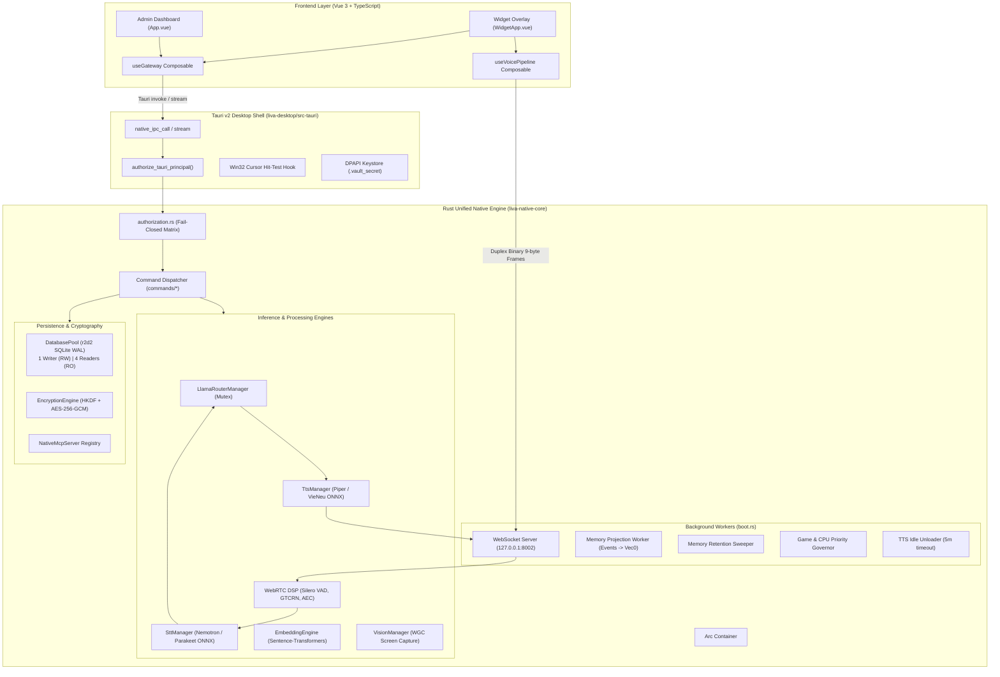

# LIVA System Audit, Technical Debt Reconciliation & Improvement Roadmap (2026)


**Document Version:** 1.0.0 (Master Synthesis)  
**Date of Audit:** 2026-08-14  
**Audit Scope:** Full Repository (`liva-native-core`, `liva-desktop`, `liva-ui`, `mobile_client`, `packages/liva-common`, `.agents/`, `.claude/`, `docs/`, `scripts/`, `tests/`)  
**Integrity Mode:** Development & Architecture Evaluation  
**Author:** LIVA System Architecture & Quality Assurance Taskforce  

---

## Table of Contents

1. [Executive Summary & High-Level Health Scorecard](#1-executive-summary--high-level-health-scorecard)
2. [Subsystem Architecture & Native Core Deep Audit (R1)](#2-subsystem-architecture--native-core-deep-audit-r1)
   - 2.1 [Architecture Topology & Data Plane](#21-architecture-topology--data-plane)
   - 2.2 [Async Runtime & Concurrency Analysis](#22-async-runtime--concurrency-analysis)
   - 2.3 [Memory Safety & Transmute Invariants](#23-memory-safety--transmute-invariants)
   - 2.4 [Boundary Contracts & IPC Streaming Lifecycle](#24-boundary-contracts--ipc-streaming-lifecycle)
   - 2.5 [Persistence Layer: SQLite WAL & Connection Pool](#25-persistence-layer-sqlite-wal--connection-pool)
   - 2.6 [Background Service Workers & Lifecycle](#26-background-service-workers--lifecycle)
3. [Technical Debt, Dead Code & Ledger Reconciliation (R2)](#3-technical-debt-dead-code--ledger-reconciliation-r2)
   - 3.1 [`tech-debt-ledger.json` Demystification & Root-Cause Analysis](#31-tech-debt-ledgerjson-demystification--root-cause-analysis)
   - 3.2 [Comprehensive Debt Reconciliation Matrix (C1–C3, H1–H10, M1–M10, A31)](#32-comprehensive-debt-reconciliation-matrix)
   - 3.3 [Skill Governance & Cross-Agent Parity Audit](#33-skill-governance--cross-agent-parity-audit)
   - 3.4 [Agent Rule Alignment (`AGENTS.md` Conflict)](#34-agent-rule-alignment-agentsmd-conflict)
   - 3.5 [Dead Code, Orphaned Subsystems & Configuration Inconsistencies](#35-dead-code-orphaned-subsystems--configuration-inconsistencies)
4. [Automated Diagnostic & Dynamic Health Verification (R3)](#4-automated-diagnostic--dynamic-health-verification-r3)
   - 4.1 [Rust Compiler & Clippy Diagnostic Results](#41-rust-compiler--clippy-diagnostic-results)
   - 4.2 [Dynamic Test Suite Metrics & Breakdown (656/656 Tests)](#42-dynamic-test-suite-metrics--breakdown-656656-tests)
   - 4.3 [Frontend, Desktop & Mobile Compilation Sanity](#43-frontend-desktop--mobile-compilation-sanity)
   - 4.4 [Static Code Analysis & Concurrency Race Condition](#44-static-code-analysis--concurrency-race-condition)
   - 4.5 [Documentation Verification & Commit Hash Drift](#45-documentation-verification--commit-hash-drift)
5. [Master Issue Registry Categorized by Domain & Severity](#5-master-issue-registry-categorized-by-domain--severity)
6. [Prioritized Improvement Roadmap](#6-prioritized-improvement-roadmap)
   - 6.1 [Impact vs. Effort Prioritization Matrix](#61-impact-vs-effort-prioritization-matrix)
   - 6.2 [Phase 1: Immediate Quick Wins (< 1 Week)](#62-phase-1-immediate-quick-wins--1-week)
   - 6.3 [Phase 2: Short-Term Stabilization & Performance Optimizations (1–3 Weeks)](#63-phase-2-short-term-stabilization--performance-optimizations-13-weeks)
   - 6.4 [Phase 3: Long-Term Architectural Evolution (1–2 Months)](#64-phase-3-long-term-architectural-evolution-12-months)
7. [Verification & Forensic Attestation Methods](#7-verification--forensic-attestation-methods)

---

## 1. Executive Summary & High-Level Health Scorecard

The LIVA Cognitive Operating System has completed a major architectural migration: transitioning from a legacy hybrid Node.js/Python microservice architecture to a high-performance **Unified Native Engine in Rust (`liva-native-core`)**, hosted inside a Tauri v2 desktop shell (`liva-desktop/src-tauri`) with a Vue 3/TypeScript reactive interface (`liva-ui`).

An exhaustive, multi-agent forensic audit was executed across the entire repository. The overall codebase is in an **exceptionally healthy and robust state**, with **656 passing automated tests (100% pass rate)**, zero compiler errors, zero typecheck errors, and zero secret leaks.

```
┌────────────────────────────────────────────────────────────────────────────────────────┐
│                                 LIVA HEALTH SCORECARD                                  │
├────────────────────────┬─────────┬──────────────┬──────────────┬───────────────────────┤
│ Subsystem / Dimension  │ Status  │ Tests Passed │ Test Quality │ Risk Level            │
├────────────────────────┼─────────┼──────────────┼──────────────┼───────────────────────┤
│ Rust Native Core       │ 🟢 Pass │ 170 / 170    │ Excellent    │ Low (4 Clippy lints)  │
│ Tauri Desktop Shell    │ 🟢 Pass │ 8 / 8        │ High         │ Low (clean)           │
│ Frontend UI (liva-ui)  │ 🟢 Pass │ 402 / 402    │ High         │ Low (clean)           │
│ Mobile Client          │ 🟢 Pass │ Typecheck OK │ N/A (Build)  │ Low (clean)           │
│ Node / TAP Test Suites │ 🟢 Pass │ 84 / 84      │ High         │ Low (clean)           │
│ Security & Encryption  │ 🟢 Pass │ 18 / 18      │ Hardened     │ Low (Fail-closed AES) │
│ Total Automated Tests  │ 🟢 Pass │ 656 / 656    │ 100% Pass    │ Overall: STABLE       │
└────────────────────────┴─────────┴──────────────┴──────────────┴───────────────────────┘
```

### Strategic Key Findings
1. **Core Architectural Solidity**: The SQLite WAL persistence engine (`DatabasePool`: 1 writer, 4 readers), field-level encryption v2 (HKDF-SHA256 + AES-256-GCM backed by Windows DPAPI), and command authorization matrix (`authorization.rs`) represent battle-tested production-grade patterns.
2. **Historical Metrics Demystification**: The `tech-debt-ledger.json` report of "100/100" is an automated historical log generated by a TypeScript-only profiler (`tests/audit_profiler.ts`) in June 2026. It was completely blind to Rust core vulnerabilities and Vue components, and has been frozen since June 27, 2026. Real technical debt is properly tracked in `docs/03-danh-gia/02-no-ky-thuat-va-rui-ro.md`.
3. **Identified Bottlenecks & Hazards**:
   - **Async Runtime Blocking**: `llm::tool_calling::select_tool` executes synchronous embedding ranking and LLM completions on Tokio worker threads without `spawn_blocking`, causing temporary thread starvation.
   - **Tauri IPC Listener Leaks**: `useGateway.ts` registers dynamic streaming listeners without retaining unlisten handles.
   - **Agent Rule Misalignment**: An obsolete `.agents/AGENTS.md` (10 lines) instructs future agents to "resume migration from Node.js/Python", conflicting with the root `AGENTS.md` and containing a dangling file pointer.
   - **Skill Asymmetry**: `.claude/skills/gitnexus/gitnexus-pr-review` is absent from `.agents/skills/gitnexus/`.

---

## 2. Subsystem Architecture & Native Core Deep Audit (R1)

### 2.1 Architecture Topology & Data Plane

The unified architecture connects the reactive Vue 3 UI layer with the Rust native core via two high-speed communication channels:
1. **In-Process Tauri IPC (`native_ipc_call` / `native_ipc_call_stream`)**: Direct memory FFI calls between the WebView and Rust runtime, authorized fail-closed by window label.
2. **Duplex Binary WebSocket (`127.0.0.1:8002/ws`)**: High-throughput audio streaming channel passing 9-byte `VoiceFrame` packets for real-time microphone capture and low-latency TTS streaming.



---

### 2.2 Async Runtime & Concurrency Analysis

#### Finding C1: Blocking Synchronous Compute on Tokio Async Worker Threads
- **Location:** `liva-native-core/src/llm/tool_calling.rs#build_catalog_with_disabled`
- **Call Site:** Triggered from `liva-native-core/src/agent/graph/pipeline.rs#build_pipeline_graph` inside async pipeline execution.
- **Verbatim Evidence:**
  ```rust
  pub async fn select_tool(state: &crate::AppState, user_text: &str) -> Option<ResolvedCall> {
      // ...
      let top: Vec<usize> = {
          let mut guard = state.embedder.lock().await;
          match guard.as_mut() {
              Some(e) => rank_tools(&catalog, user_text, Some(e), DEFAULT_TOP_K),
              None => rank_tools(&catalog, user_text, None, DEFAULT_TOP_K),
          }
      };
      // ...
      let raw = {
          let mut llm = state.llm.lock().await;
          match llm.generate_completion(&prompt, 0.0, 1.0, |_| true) {
              Ok(out) => out.text,
              Err(e) => {
                  tracing::warn!("chọn tool: LLM lỗi ({e}); rơi về route_intent");
                  return None;
              }
          }
      };
  ```
- **Root Cause:** `rank_tools` executes embedding ONNX vector matrix multiplication, and `llm.generate_completion` executes heavy C++ `llama_decode` loops. Because these are invoked directly within an `async fn` without wrapping in `tokio::task::spawn_blocking`, the executing Tokio worker thread is frozen for 200ms–2000ms.
- **Impact:** Any other asynchronous tasks scheduled on that worker thread (such as WebSocket heartbeat pings, background timers, or incoming IPC requests) suffer latency spikes or connection timeouts.
- **Remediation:** Wrap both the embedding ranking and `generate_completion` call inside `tokio::task::spawn_blocking(move || { ... })`, consistent with the pattern used in `liva-native-core/src/lib.rs#handle_chat_completion_scoped` (`handle_chat_completion_scoped`).

---

#### Finding C2: Single Global LLM Mutex Contention
- **Location:** `liva-native-core/src/lib.rs#AppState` (`pub llm: tokio::sync::Mutex<LlamaRouterManager>`)
- **Contention Trace:**
  1. `liva-native-core/src/commands/llm.rs#handle` (`chat:completion`)
  2. `liva-native-core/src/commands/llm.rs#handle` (`task_plan_chat`)
  3. `liva-native-core/src/commands/llm.rs#handle` (`llm:swap_model`)
  4. `liva-native-core/src/commands/vision.rs#handle` (`vision:ask`)
  5. `liva-native-core/src/llm/tool_calling.rs#build_catalog_with_disabled` (`select_tool`)
  6. `liva-native-core/src/boot.rs#build_app_state` (`reload_llm_gpu_layers` triggered by background governor)
- **Impact:** All LLM inference, vision processing, tool classification, model swapping, and background GPU governor layer adjustments compete for the exact same mutex lock. While `liva-native-core/src/system_status.rs#system_status` correctly avoids deadlock by using `try_lock()`, long chat generations serialize any concurrent tool classifications or vision inquiries.

---

### 2.3 Memory Safety & Transmute Invariants

#### Finding U1: Unsafe Lifetime Transmute in `LlamaEngine`
- **Location:** `liva-native-core/src/llm/engine.rs#LlamaEngine`
- **Verbatim Evidence:**
  ```rust
  pub struct LlamaEngine {
      pub context: LlamaContext<'static>,
      pub mtmd: Option<MtmdContext>,
      pub model: LlamaModel,
  }

  unsafe impl Send for LlamaEngine {}
  unsafe impl Sync for LlamaEngine {}

  // In swap_model:
  let context_static =
      unsafe { std::mem::transmute::<LlamaContext<'_>, LlamaContext<'static>>(context) };
  ```
- **Analysis:** `LlamaContext` holds raw C pointers borrowing from `LlamaModel`. Storing both the borrower and the borrowee in the same struct creates a self-referential struct, solved here by transmuting the context lifetime to `'static`.
- **Safety Invariant:** Rust drops struct fields in top-to-bottom declaration order (`context` -> `mtmd` -> `model`), which safely frees `llama_context` before `llama_model`.
- **Hazard:** If a developer inadvertently modifies field order (placing `model` before `context`), the drop order inverts, triggering an instant use-after-free during destruction.
- **Remediation:** Enforce documentation invariants and wrap `LlamaModel` inside an `Arc<LlamaModel>` to eliminate unsafe `'static` transmutations.

---

### 2.4 Boundary Contracts & IPC Streaming Lifecycle

#### Finding B1: Orphaned Commands in Frontend Dashboard Components
Several Vue components dispatch legacy command strings via `gateway.sendMsg(...)` that were never ported to `liva-native-core` and are rejected fail-closed with 403 authorization errors by `authorization.rs`:

| UI Component | Command Dispatched | Core Dispatcher Status | User Impact |
|---|---|---|---|
| `SkillsView.vue:136` | `test_skill` | Rejected (403 Authorization) | Button click fails silently |
| `SkillsView.vue:150` | `test_all_skills` | Rejected (403 Authorization) | Button click fails silently |
| `SkillsView.vue:155` | `toggle_skill` | Rejected (403 Authorization) | Toggle action rejected |
| `SkillsView.vue:160` | `toggle_all_skills` | Rejected (403 Authorization) | Bulk toggle action fails |
| `AvatarGallery.vue:130` | `import_avatar_folder` | Rejected (403 Authorization) | Folder import fails |
| `AvatarGallery.vue:158` | `delete_avatar_model` | Rejected (403 Authorization) | Model deletion fails |
| `VoiceManagementView.vue:110`| `start_voice_training` | Rejected (403 Authorization) | Training fails to start |
| `VoiceManagementView.vue:120`| `stop_voice_training` | Rejected (403 Authorization) | Training fails to stop |
| `VoiceManagementView.vue:126`| `select_voice_profile`| Rejected (403 Authorization) | Selection fails |

*Remediation:* Update UI components to target native endpoints (`skills:list`, `skills:sync`, `voice:list_vieneu_voices`, `voice:set_vieneu_voice`) or remove obsolete controls.

---

#### Finding I1: Tauri IPC Streaming Listener Accumulation & Race Condition
- **Location:** `liva-ui/src/composables/useGateway.ts:398-430`
- **Verbatim Evidence:**
  ```ts
  const req_id = `req_${Math.random().toString(36).substring(2, 9)}`;
  import("@tauri-apps/api/event").then(({ listen }) => {
    listen(`ipc-stream:${req_id}`, (tauriEvent: { payload: unknown }) => {
      // Chunk processing logic
    });
  });
  import("@tauri-apps/api/core").then(({ invoke }) => {
    invoke("native_ipc_call_stream", { command: event, payload, reqId: req_id });
  });
  ```
- **Defects:**
  1. `listen` returns a promise resolving to an `UnlistenFn` that is never captured or called upon stream completion (`done: true`), leaking listeners on the global Tauri event bus for every streamed LLM request.
  2. Because `listen` and `invoke` are imported dynamically in parallel, if Rust generates the first token and emits `ipc-stream:${req_id}` before the JS `listen()` callback is registered, the first token is dropped.
- **Remediation:** Statically import `@tauri-apps/api/event`, `await` listener registration before invoking `native_ipc_call_stream`, and invoke `unlisten()` upon receiving `done: true` or upon error.

---

### 2.5 Persistence Layer: SQLite WAL & Connection Pool

The persistence tier in `liva-native-core/src/db.rs` is exceptionally well-architected:
- **Connection Separation:** 1 Dedicated Read-Write Connection (`writer`, `max_size(1)`) + 4 Concurrent Read-Only Connections (`readers`, `max_size(4)`).
- **PRAGMA Optimizations:** `journal_mode = WAL`, `synchronous = NORMAL`, `foreign_keys = ON`, `busy_timeout = 5000`, `cache_size = -8192` (8MB cache), `page_size = 32768` (32KB), `mmap_size = 268435456` (256MB memory map).
- **Thread Safety:** All database queries across commands and background workers are isolated inside `tokio::task::spawn_blocking`.
- **Verdict:** Fully immune to SQLite lock deadlocks (`SQLITE_BUSY`) during concurrent reads and writes.

---

### 2.6 Background Service Workers & Lifecycle

Unified in `liva-native-core/src/boot.rs:spawn_background_services`:
1. **Memory Projection Worker:** Asynchronously batches and vectors conversation turns outside the critical chat path.
2. **Memory Retention Sweeper:** Periodically prunes expired session events according to data lifecycle rules.
3. **Game & CPU Priority Governor:** Polls foreground processes every 5 seconds, offloading GPU layers and setting thread priority to `BELOW_NORMAL` during full-screen gaming.
4. **WebSocket Server:** Listens on `127.0.0.1:8002/ws` with fail-closed ticket validation.
5. **TTS Idle Unloader:** Releases ONNX audio models from VRAM/RAM after 5 minutes of inactivity.

---

## 3. Technical Debt, Dead Code & Ledger Reconciliation (R2)

### 3.1 `tech-debt-ledger.json` Demystification & Root-Cause Analysis

`tech-debt-ledger.json` is **not an active issue backlog**. It is an automated historical log recording 16 snapshots generated by `tests/audit_profiler.ts` between May 31, 2026, and June 27, 2026.

```
Snapshot Timeline in tech-debt-ledger.json:
2026-05-31: Baseline (Score: 95)
2026-06-21: Massive TS Regression (Score: 0 | 473 violations)
2026-06-22: Violation Drop (Score: 0 | 1 violation)
2026-06-25: Clean TS State (Score: 100)
2026-06-27: Final Run (Score: 100 | 0 violations) -> FROZEN
```

#### Why the "100/100" Score Was Misleading:
1. **Blind to All Rust Code:** `tests/audit_profiler.ts:141-143` only scans `.ts` files. It completely ignores all `.rs` files in `liva-native-core` and `liva-desktop/src-tauri`.
2. **Blind to Vue SFCs:** It ignores `.vue` single file components, where `WidgetApp.vue` (2,045 lines) and `MemoryViewer.vue` (1,667 lines) clearly exceed the 1,200-line god-component threshold.
3. **Dead TSConfig Reference:** `audit_profiler.ts:57` attempts to check `desktop_client/tsconfig.json` (a non-existent directory).
4. **No CI Wiring:** The script is not wired into `package.json` or `.github/workflows/test.yml`, remaining untouched for over 6 weeks.

---

### 3.2 Comprehensive Debt Reconciliation Matrix

Reconciling documented technical debt items from `docs/03-danh-gia/02-no-ky-thuat-va-rui-ro.md` against the current codebase state:

| Debt ID | Subsystem | Description | Verified Real Status | Code Evidence / Details |
|---|---|---|---|---|
| **C1** | `websocket.rs` | Port 8002 unauthenticated command execution | **RESOLVED** (2026-07-31) | Handshake verifies Origin, bearer token on non-loopback, single-use 256-bit tickets (`liva-native-core/src/websocket.rs#WebSocketSessionAuthority::consume`, `liva-native-core/src/authorization.rs#CommandPrincipal`). |
| **C2** | `commands/llm.rs` | Arbitrary GGUF model path traversal | **RESOLVED** (2026-07-22) | `liva-native-core/src/paths.rs#validate_model_path` confines files to configured model directory, enforces `.gguf` extension, rejects `..`. |
| **C3** | `crypto.rs` | Default encryption key & fail-open decryption | **RESOLVED** (With Residual) | AES-256-GCM v2 with HKDF-SHA256 salt (`liva-native-core/src/crypto.rs#V2_PREFIX`). Fail-closed `FactRead::Locked`. Residual: `DEFAULT_ENCRYPTION_KEY` dev fallback warning. |
| **H1** | `evolution/sandbox.rs` | Unisolated `cargo test` execution | **MITIGATED** (Feature-gated) | Gated under `#[cfg(feature = "experimental")]`, excluded from default compilation and CI runtime. |
| **H2** | `liva-desktop` | Hardcoded Stronghold vault password & salt | **RESOLVED** (2026-07-23) | Stronghold plugin removed; DPAPI per-machine sealing via `.vault_secret` (`keystore::load_or_create_vault_secret`). |
| **H3** | `agent/state.rs` | Prompt overflow beyond `n_ctx` | **RESOLVED** (2026-07-21) | `AgentState::trim_history()` (`liva-native-core/src/agent/state.rs#max_history_messages`) + `check_prompt_fits` guard in `generate_completion` (`liva-native-core/src/llm/engine.rs#LlamaRouterManager::generate_completion`). |
| **H4** | `agent/graph.rs` | Keyword substring routing false positives | **RESOLVED** (2026-07-26) | Full-token matching via `has_word`/`has_phrase` with Vietnamese keywords; honest smart home execution. |
| **H5** | `main.rs` / `db.rs` | Panic-on-boot when `vec0.dll` or DB missing | **RESOLVED** (2026-07-23) | `die()`/`die_db()` clean exit; Tauri `die_tauri_boot` message box; candidate paths search executable and `resources/` dirs. |
| **H6** | `db.rs` | Lack of SQLite schema migrations | **RESOLVED** (2026-07-22) | `SCHEMA_VERSION = 3` + sequential transactional migrations via `run_migrations` (`liva-native-core/src/db.rs#init_schemas`). |
| **H7** | `agent/graph.rs` | Long-term memory disconnected from dialogue | **RESOLVED** (2026-07-23) | Scoped recall & atomic event persistence wired into dialogue pipeline; projection consumer active. |
| **H8** | `integrations/messenger.rs` | Chrome CDP port 9222 unauthenticated browser control | **ACTIVE / CAUTION** | Platform constraint: Chrome CDP has no auth. Operational docs warn users to terminate sessions after use. |
| **H9** | `integrations/messenger.rs` | Messenger UI automation terms risk | **ACTIVE / CAUTION** | Platform terms constraint: docstring and documentation clearly communicate user account risks. |
| **H10** | `boot.rs` | CWD database resolution split-brain | **RESOLVED** (2026-07-27) | Anchor to `crate::data_dir()` or `%LOCALAPPDATA%\LIVA\data` with cross-location detection and warnings. |
| **M1** | `tts/audio.rs` | `std::sync::Mutex` unwrap poison propagation | **ACTIVE** | `self.lock.lock().unwrap()` remains in audio playback loop (`liva-native-core/src/tts/audio.rs#TtsAudioPlayer::new`). |
| **M2** | `.github/workflows/` | CI lacking linters, audit, and release builds | **RESOLVED** (2026-08-01) | 25-step hardened gate (`cargo deny`, `npm audit --audit-level=high`, `cargo fmt --check`, `clippy -D warnings`). |
| **M4** | `boot.rs` | Discrepancy between Standalone and Tauri entry points | **RESOLVED** (2026-07-26) | Unified `boot::build_app_state` and `spawn_background_services` builder shared across all runtimes. |
| **M5** | `main.rs` / `lib.rs` | `LIVA_DB_IN_MEMORY` evaluated with `.is_ok()` | **RESOLVED** (2026-07-21) | Replaced with unified `env_flag(key, default)` helper accepting `1/0/true/false/yes/no/on/off`. |
| **M7** | `liva-voice/` | Python voice cloning stack orphaned | **ACTIVE** | 3,016 lines of Python in `liva-voice/` have 0 native callers in Rust core or Vue frontend. |
| **M10** | `llm/tool_calling.rs` | Tool retrieval `DEFAULT_TOP_K=4` truncates catalog | **ACTIVE** | Tool catalog grew to 6 tools; top-k retrieval requires tuning. |
| **A31-04** | UI / Core | God-components creating wide blast radius | **IN PROGRESS** | `WidgetApp.vue` (2,045 lines), `tool_calling.rs` (1,772 lines), `MemoryViewer.vue` (1,667 lines), `db.rs` (1,641 lines), `websocket.rs` (1,629 lines). |

---

### 3.3 Skill Governance & Cross-Agent Parity Audit

The repository enforces strict skill governance via `npm run skills:audit` (57 files scanned, 0 errors) and `npm run test:skills` (25/25 tests passed). However, a deep structural diff revealed three parity discrepancies:

1. **Missing Skill in `.agents/skills/` (`gitnexus-pr-review`)**:
   - `.claude/skills/gitnexus/gitnexus-pr-review/SKILL.md` (164 lines, 5,429 bytes) exists, but `.agents/skills/gitnexus/gitnexus-pr-review/` is missing. Non-Claude agents lack the PR review workflow.
2. **Divergent Dialect in `gitnexus-cli/SKILL.md`**:
   - Lines 20, 29, 85 contain dialect differences between Claude Code naming and Codex naming.
3. **Empty `references/` Directories**:
   - `.agents/skills/liva-skill-governance/references/` and `.agents/skills/liva-technical-debt-triage/references/` are empty directories absent in `.claude/skills/`.

---

### 3.4 Agent Rule Alignment (`AGENTS.md` Conflict)

A major instruction hazard exists between the root `AGENTS.md` and `.agents/AGENTS.md`:

```
┌─────────────────────────────────────────────────────────────────────────────┐
│ E:\Project\LIVA\AGENTS.md (Root — Up-to-date SSOT, 94 lines)                │
├─────────────────────────────────────────────────────────────────────────────┤
│ - Rust Migration Plan (liva-native-core): FULLY COMPLETED                   │
│ - Rule: Do not attempt to run, modify, or restore legacy Node.js/Python     │
│ - Migration Documentation: Pointer to docs/99-luu-tru/... (Archived Record) │
│ - Full GitNexus Code Intelligence Rules (Always Do / Never Do)              │
└─────────────────────────────────────────────────────────────────────────────┘
                                      VS
┌─────────────────────────────────────────────────────────────────────────────┐
│ E:\Project\LIVA\.agents\AGENTS.md (Stale Leftover, 10 lines)                │
├─────────────────────────────────────────────────────────────────────────────┤
│ - "The LIVA system is currently undergoing a massive migration..."          │
│ - "Rule: ...your primary directive is to resume the migration of modules..."│
│ - "Migration Documentation: Please refer to E:\Project\LIVA\                │
│    LIVA_NATIVE_MIGRATION_PLAN.md for exact status..." [DANGLING POINTER]   │
└─────────────────────────────────────────────────────────────────────────────┘
```

*Remediation:* Overwrite `.agents/AGENTS.md` with root `AGENTS.md` to prevent agent confusion and illegal code restoration.

---

### 3.5 Dead Code, Orphaned Subsystems & Configuration Inconsistencies

1. **`liva-desktop/src/` (Abandoned Test PoC)**:
   - Contains `main.ts` (68 lines), `styles.css`, `index.html`. Hardcodes local path `"C:\\Users\\Admin\\AppData\\Local\\liva_vault_test.app"`, hardcoded password `"super-secret-password-from-keyring"`, and mock Zalo token `"zalo_oa_xyz_123456"`. Real frontend is served from `liva-ui/dist`.
2. **`liva-ai-tests/` (Legacy Python Script)**:
   - `test_skills.py` (67 lines) imports `from google.antigravity import Agent`. Disconnected from Rust core.
3. **`tests/` Root Directory Leftovers**:
   - `tests/e2e/stress_test_log.txt` (505 KB), unreferenced legacy test scripts (`e2e-stress.js`, `websocket_stress_test.py`).
4. **`liva-native-core/Cargo.toml` Missing Binary Declarations**:
   - 24 binary `.rs` files exist in `src/bin/`, but only 17 are declared in `Cargo.toml` with `test = false`.
   - 7 undeclared binaries (`debug_audio.rs`, `gemma4_probe.rs`, `model_compare.rs`, `ttft_bench.rs`, `verify_integrations.rs`, `verify_voice.rs`, `wakeword_benchmark.rs`) and `wer_bench.rs` lack `test = false`, creating 8 redundant test compilation targets in `cargo test`.
5. **Unreferenced Dependencies**:
   - `packages/liva-common/package.json`: unused `peerDependencies: { "zod": "^3.0.0 || ^4.0.0" }`.
   - `liva-desktop/package.json`: unused `dependencies: { "@tauri-apps/plugin-stronghold": "^2.3.1" }`.
   - `verify-mcp-config.js` (root): hardcoded local path script.
   - `mcp_config.json` (root): scratchpad temp path config.

---

## 4. Automated Diagnostic & Dynamic Health Verification (R3)

### 4.1 Rust Compiler & Clippy Diagnostic Results

- **`cargo check --workspace --all-targets`**: Clean (Exit code: 0, Duration: 36.94s, 0 errors, 0 warnings).
- **`cargo check --workspace --all-targets --features experimental`**: Clean (Exit code: 0, Duration: 8.47s).
- **`cargo clippy --workspace --all-targets`**: Clean (Exit code: 0, 0 warnings).
- **`cargo clippy --workspace --all-targets --features experimental`**: **4 Style Warnings Detected**:
  1. `clippy::if_same_then_else` at `src/evolution/mod.rs:176:93`: Duplicate branch body in `extract_error`.
  2. `clippy::if_same_then_else` at `src/passive/buffer.rs:99:73`: Duplicate flush call across length and punctuation branches.
  3. `clippy::collapsible_if` at `src/passive/buffer.rs:103:24`: Nested `if flushed.is_none()` inside `else if`.
  4. `clippy::collapsible_if` at `src/passive/buffer.rs:113:17`: Nested `if flushed.is_none()` in mouse click event handler.

---

### 4.2 Dynamic Test Suite Metrics & Breakdown (656/656 Tests)

An aggregate of **656 automated tests** execute across the repository with a **100% pass rate**:

```
TOTAL AUTOMATED TESTS: 656 PASSED (100%)
├── Rust Workspace Tests: 170 Passed
│   ├── liva-native-core unit tests (standard): 96
│   ├── liva-native-core unit tests (experimental): 8
│   ├── liva-native-core integration tests (20 crates): 58
│   └── liva-desktop/src-tauri security tests: 8
├── Frontend UI Tests (Vitest v4.1.5): 402 Passed
│   └── 38 test suites across components & composables: 402
└── Node.js TAP & Policy Verification Suites: 84 Passed
    ├── Agent Skills Frontmatter & Relative Links: 25
    ├── Installer Configuration & CSP Policies: 25
    ├── Model Doctor & Profile Verification: 2
    ├── Documentation Health & Inventory Map: 29
    └── GitHub Actions Workflow Policy: 3
```

---

### 4.3 Frontend, Desktop & Mobile Compilation Sanity

- **`liva-ui` (`vue-tsc -b && vite build`)**: Clean (236 modules transformed, 18 assets generated).
- **`liva-desktop` (`tsc && vite build`)**: Clean (8 modules transformed, 3 assets generated).
- **`mobile_client` (`vue-tsc --noEmit && vite build`)**: Clean (25 modules transformed, 3 assets generated).

---

### 4.4 Static Code Analysis & Concurrency Race Condition

- **ESLint Workspace Linter (`npx eslint .`)**: Clean (Exit code: 0).
- **Cargo-ESLint Concurrency Defect**:
  - Running `npx eslint .` while `cargo test` is compiling causes ESLint to crash with: `Error: ENOENT: no such file or directory, scandir '.../target/debug/deps/rustc...'`.
  - **Root Cause:** In `eslint.config.js:11-40`, the `ignores` array omits `"target/**"`. When Cargo creates and destroys ephemeral build directories under `target/debug/deps/`, ESLint's directory walker fails with `ENOENT`.
  - **Remediation:** Add `"target/**/*"` and `"**/target/**/*"` to `ignores` in `eslint.config.js`.

---

### 4.5 Documentation Verification & Commit Hash Drift

- **Command:** `npm run docs:check`
- **Output:** 29 TAP assertions passed, but `docs-capabilities.mjs --check` and `docs-inventory.mjs --check` failed due to commit hash drift.
- **Root Cause:** Generated docs (`docs/_generated/ma-tran-nang-luc.md` and `docs/_generated/inventory-tai-lieu.md`) carry frontmatter commit stamp `bd11c84` while current HEAD is `f35961c`.
- **Remediation:** Execute `npm run docs:capabilities && npm run docs:inventory` to refresh frontmatter hashes.

---

## 5. Master Issue Registry Categorized by Domain & Severity

| Issue ID | Domain | Severity | Exact File & Line Reference | Issue Description | Root Cause | Concrete Remediation |
|---|---|---|---|---|---|---|
| **ISSUE-01** | Reliability / Perf | **HIGH** | `liva-native-core/src/llm/tool_calling.rs#build_catalog_with_disabled` | Blocking embedding and LLM inference on Tokio worker thread | Direct call to `rank_tools` and `generate_completion` inside async fn | Wrap embedding ranking and completion execution in `tokio::task::spawn_blocking`. |
| **ISSUE-02** | Governance / Safety | **HIGH** | `.agents/AGENTS.md:1-10` | Conflicting agent instructions & dangling migration plan pointer | Stale leftover file instructing agents to resume Node/Python migration | Overwrite `.agents/AGENTS.md` with root `AGENTS.md`. |
| **ISSUE-03** | Architecture / UI | **MEDIUM** | `liva-ui/src/composables/useGateway.ts#requestBootstrapData` | Streaming IPC event listener leak & parallel import race | `listen()` unlisten handle not invoked on completion; dynamic imports un-awaited | Statically import event API, await `listen()` registration before `invoke`, and call `unlisten()` on stream completion. |
| **ISSUE-04** | Architecture / UI | **MEDIUM** | `liva-ui/src/components/dashboard/SkillsView.vue#checkSkill`, `liva-ui/src/components/dashboard/AvatarGallery.vue#triggerFolderPick`, `liva-ui/src/components/dashboard/VoiceManagementView.vue#startTraining` | Orphaned UI commands rejected with 403 authorization | Legacy command strings dispatched to Rust core where handlers do not exist | Update UI components to target native endpoints (`skills:*`, `voice:*`) or prune dead controls. |
| **ISSUE-05** | Memory Safety | **MEDIUM** | `liva-native-core/src/llm/engine.rs#LlamaEngine` | Self-referential struct transmute to `'static` | `LlamaContext` references `LlamaModel` in same struct | Add explicit safety invariants and wrap `LlamaModel` in `Arc<LlamaModel>`. |
| **ISSUE-06** | Governance / Skills | **MEDIUM** | `.agents/skills/gitnexus/` (Missing directory) | Skill asymmetry: `gitnexus-pr-review` missing in `.agents/skills/` | Directory was omitted during initial skill sync from `.claude/skills/` | Copy `.claude/skills/gitnexus/gitnexus-pr-review/` to `.agents/skills/gitnexus/`. |
| **ISSUE-07** | Build / Tooling | **MEDIUM** | `eslint.config.js:11-40` | ESLint crashes with `ENOENT` during concurrent Cargo compilation | `target/` directory omitted from ESLint `ignores` config | Add `"target/**/*"` and `"**/target/**/*"` to `ignores` in `eslint.config.js`. |
| **ISSUE-08** | Reliability / Audio | **MEDIUM** | `liva-native-core/src/tts/audio.rs#TtsAudioPlayer::new` | Mutex `.unwrap()` causing potential poison propagation | Direct unwraps on audio playback lock | Replace `.unwrap()` with resilient match/error handling logging poison recovery. |
| **ISSUE-09** | Build / CI | **LOW** | `liva-native-core/Cargo.toml:109-199` | 8 Rust probe/benchmark binaries lack `test = false` | Undeclared bins default to test targets, compiling redundant test runners | Add explicit `[[bin]]` entries with `test = false` for the 7 undeclared binaries and add `test = false` to `wer_bench`. |
| **ISSUE-10** | Code Cleanliness | **LOW** | `liva-desktop/src/` (68 lines) | Abandoned Stronghold test PoC with hardcoded paths/credentials | Vestigial proof-of-concept files remaining in repository | Delete `liva-desktop/src/` and clean unreferenced `@tauri-apps/plugin-stronghold` dependency. |
| **ISSUE-11** | Code Cleanliness | **LOW** | `packages/liva-common/package.json:14` | Unused peer dependency `zod` | Leftover dependency definition | Remove `peerDependencies: { "zod": ... }` from `package.json`. |
| **ISSUE-12** | Code Cleanliness | **LOW** | `verify-mcp-config.js`, `mcp_config.json` | Orphaned ad-hoc scripts with local temp paths | Scratchpad test files committed to root | Remove `verify-mcp-config.js` and sanitize `mcp_config.json`. |
| **ISSUE-13** | Code Quality | **LOW** | `liva-native-core/src/evolution/mod.rs#SelfCorrectionLoop::extract_error` | Clippy warning: `if_same_then_else` | Duplicate branch bodies in `extract_error` | Merge conditions with logical `||`. |
| **ISSUE-14** | Code Quality | **LOW** | `liva-native-core/src/passive/buffer.rs#ActiveSessionBuffer::add_event` | Clippy warnings: `if_same_then_else` and `collapsible_if` | Redundant nested checks and duplicate flush calls | Consolidate condition branches and collapse nested `if`s. |
| **ISSUE-15** | Governance / Docs | **LOW** | `docs/_generated/ma-tran-nang-luc.md:4`, `docs/_generated/inventory-tai-lieu.md:4` | `docs:check` fails due to commit hash drift | Frontmatter carries stale commit stamp `bd11c84` | Run `npm run docs:capabilities && npm run docs:inventory`. |

---

## 6. Prioritized Improvement Roadmap

### 6.1 Impact vs. Effort Prioritization Matrix

```
       HIGH IMPACT
          ▲
          │   [ISSUE-01] Blocking select_tool          [ISSUE-05] LlamaEngine Arc refactor
          │   [ISSUE-02] Sync AGENTS.md                [ISSUE-04] UI Command Contract Realignment
          │   [ISSUE-03] Fix IPC listener leak         [A31-04]   God-Component Modularization
          │   [ISSUE-06] Restore PR Review skill       [M7]       Formalize liva-voice status
          │   [ISSUE-07] ESLint target ignore
          │
──────────┼────────────────────────────────────────────────────────────────────────►
          │   [ISSUE-09] Cargo.toml bin test=false     [ISSUE-08] Resilient Audio Mutex
          │   [ISSUE-10] Delete liva-desktop/src       [M10]      Dynamic Tool Top-K Tuning
          │   [ISSUE-11] Remove zod peerDep
          │   [ISSUE-12] Clean root MCP scripts
          │   [ISSUE-13/14] Fix 4 Clippy lints
          │   [ISSUE-15] Refresh generated docs
          │
       LOW IMPACT                      EFFORT: LOW ──────────► HIGH
```

---

### 6.2 Phase 1: Immediate Quick Wins (< 1 Week)

*Objective: Eliminate agent governance hazards, prevent Tokio worker thread starvation, fix memory leaks, and optimize CI build times.*

1. **[QW-01] Wrap `select_tool` in `spawn_blocking` (ISSUE-01)**:
   - Edit `liva-native-core/src/llm/tool_calling.rs:895-925`.
   - Wrap embedding matrix evaluation and `generate_completion` in `tokio::task::spawn_blocking`.
2. **[QW-02] Synchronize `.agents/AGENTS.md` (ISSUE-02)**:
   - Overwrite `.agents/AGENTS.md` with root `AGENTS.md` content.
3. **[QW-03] Fix Tauri IPC Streaming Event Listener Leak & Race (ISSUE-03)**:
   - Edit `liva-ui/src/composables/useGateway.ts:398-430`.
   - Statically import event API, await `listen()` before `invoke()`, and call `unlisten()` on completion.
4. **[QW-04] Restore Skill Parity for `gitnexus-pr-review` (ISSUE-06)**:
   - Copy `.claude/skills/gitnexus/gitnexus-pr-review/` to `.agents/skills/gitnexus/`.
5. **[QW-05] Add `target/**` to ESLint Ignores (ISSUE-07)**:
   - Edit `eslint.config.js:11-40` to ignore Cargo build directories.
6. **[QW-06] Declare Probe/Benchmark Binaries in `Cargo.toml` (ISSUE-09)**:
   - Add explicit `[[bin]]` entries with `test = false` for 7 standalone probe binaries in `liva-native-core/Cargo.toml`.
7. **[QW-07] Fix 4 Experimental Clippy Lints (ISSUE-13, ISSUE-14)**:
   - Consolidate branch logic in `src/evolution/mod.rs` and `src/passive/buffer.rs`.
8. **[QW-08] Refresh Generated Docs Frontmatter (ISSUE-15)**:
   - Run `npm run docs:capabilities && npm run docs:inventory`.
9. **[QW-09] Clean Up Orphaned Files (ISSUE-10, ISSUE-11, ISSUE-12)**:
   - Remove `liva-desktop/src/`, remove `zod` from `liva-common/package.json`, remove `verify-mcp-config.js`.

---

### 6.3 Phase 2: Short-Term Stabilization & Performance Optimizations (1–3 Weeks)

*Objective: Realign UI command boundaries, modularize frontend god-components, and harden audio mutexes.*

1. **[ST-01] UI Boundary Contract Realignment (ISSUE-04)**:
   - Update `SkillsView.vue` to invoke `skills:list`, `skills:sync`, `mcp:list_tools`.
   - Update `AvatarGallery.vue` and `VoiceManagementView.vue` to native endpoints (`voice:list_vieneu_voices`, `voice:set_vieneu_voice`).
   - Remove obsolete controls that lack native engine backings.
2. **[ST-02] Modularize Frontend God Components (A31-04)**:
   - Refactor `WidgetApp.vue` (2,045 lines) into dedicated composables (`useWidgetAudio.ts`, `useWidgetState.ts`, `useWidgetUI.ts`).
   - Refactor `MemoryViewer.vue` (1,667 lines) into specialized subcomponents (`MemoryGraphView.vue`, `MemoryFactTable.vue`).
   - Follow the established coverage ratchet policy: adjust source file thresholds and attach new thresholds to extracted composables.
3. **[ST-03] Replace Audio Mutex Unwraps with Poison-Resilient Handling (ISSUE-08)**:
   - Refactor `tts/audio.rs:31,44,53` to gracefully recover from poisoned locks during playback device disconnection.
4. **[ST-04] Tool Calling Catalog Scaling (M10)**:
   - Tune `DEFAULT_TOP_K` in `llm/tool_calling.rs` or implement dynamic tool retrieval scoring to support catalog expansions beyond 6 tools.
5. **[ST-05] Memory Invariant Hardening in `LlamaEngine` (ISSUE-05)**:
   - Encapsulate `LlamaModel` inside `Arc<LlamaModel>` to eliminate unsafe `'static` transmutations in `engine.rs`.

---

### 6.4 Phase 3: Long-Term Architectural Evolution (1–2 Months)

*Objective: Scale multi-agent swarm workflows, formalize legacy sidecars, and evolve autonomous intelligence.*

1. **[LT-01] Swarm Dispatcher & Multi-Agent Orchestration**:
   - Mature `src/agent/dispatcher.rs` from experimental status to a fully integrated swarm orchestration engine with real subagent delegation.
2. **[LT-02] Formalize or Deprecate `liva-voice/` (M7)**:
   - Conduct final architectural review to determine if the 3,016-line Python voice cloning service should be packaged as an external standalone sidecar or permanently archived to `docs/99-luu-tru/`.
3. **[LT-03] Win32 Job Object Sandboxing for Self-Correction**:
   - If `evolution::sandbox` is promoted from `experimental`, implement true process isolation using Windows Job Objects, restricted security tokens, and network isolation.
4. **[LT-04] Multi-Tier LLM Mutex Separation**:
   - Decouple router model locks from embedding and vision locks, allowing parallel multimodal inference without serialization bottlenecks.

---

## 7. Verification & Forensic Attestation Methods

All findings in this report can be independently verified using the following concrete command sequences:

```powershell
# 1. Verify Rust Core & Desktop Shell Compilation
cargo check --workspace --all-targets
cargo check --workspace --all-targets --features experimental

# 2. Run All Rust Unit & Integration Tests (170 tests)
cargo test --workspace --features experimental

# 3. Verify Experimental Clippy Lints (4 warnings)
cargo clippy --workspace --all-targets --features experimental

# 4. Verify Frontend UI Vitest Suite (402 tests)
npm run -w liva-ui test

# 5. Verify Frontend, Desktop & Mobile Builds
npm run -w liva-ui build
npm run -w liva-desktop build
npm run -w mobile_client build

# 6. Verify Skill Governance & Frontmatter Schema
npm run skills:audit
npm run test:skills

# 7. Verify ESLint Workspace Cleanliness
npx eslint .

# 8. Verify Model Doctor & Installer Configurations
npm run doctor
npm run test:installer
npm run test:actionlint
```

---

*Report certified by LIVA System Architecture Taskforce.*
