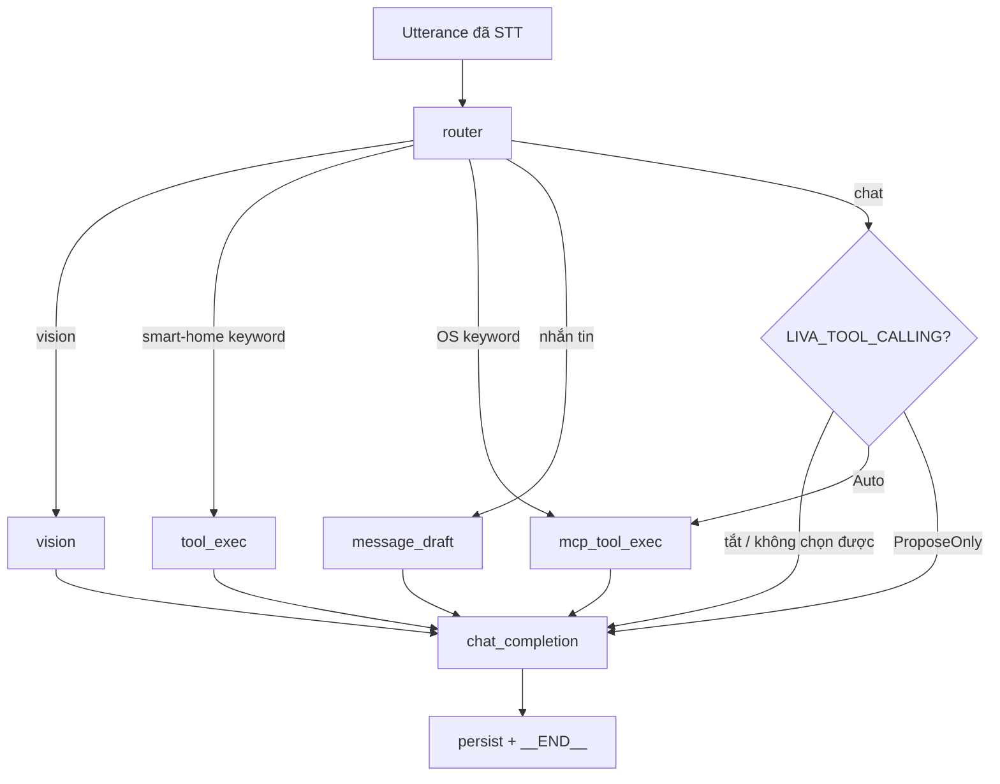
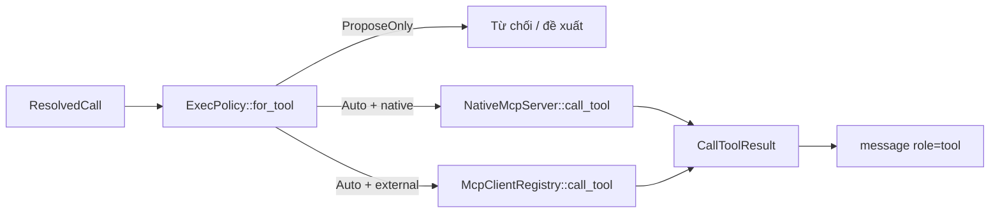
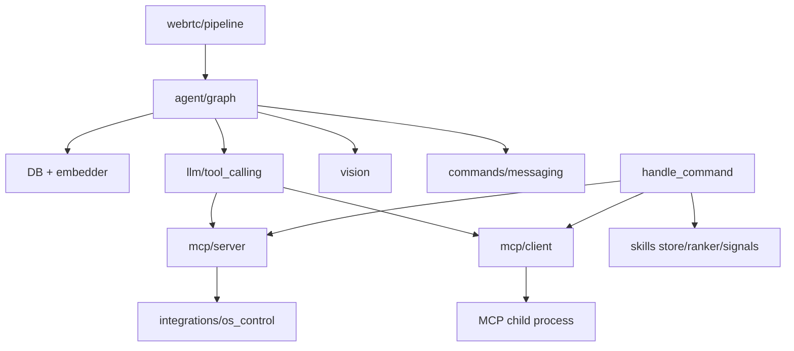

# Agent và tool runtime — kiến trúc as-built

[⬆ Mục lục](../README.md) · [Action policy](../05-chat-luong/action-policy.md) · [Cognitive Runtime đích](../01-kien-truc/cognitive-runtime.md)

## 1. Phạm vi và kết luận

Đây là nguồn chuẩn cho agent/tool **đang chạy** trong Unified Native Engine Rust. Trạng thái
sản phẩm vẫn do hai capability `agent.tool-runtime` và `agent.action-policy` trong
`docs/_data/capabilities.json` sở hữu.

Kết luận ngắn:

- `StateGraph` là runtime thật nhưng hiện chỉ được dựng trên đường voice/WebRTC.
- UI chat và Telegram dùng `handle_chat_completion_scoped`; chúng có memory/RAG nhưng không
  chạy `StateGraph` và không đi qua LLM tool selector.
- Keyword router là reflex lane mặc định cho voice.
- LLM tool selection đã nối vào graph nhưng `LIVA_TOOL_CALLING` mặc định tắt.
- Tool được chọn không đồng nghĩa được chạy; executor kiểm lại `ExecPolicy`.
- Kho skill Rust đã có sync/version/search/signal, nhưng nội dung skill chưa được đưa vào
  tool-selection prompt và chưa tự thi hành.
- Swarm dispatcher và self-correction chỉ là nhánh `experimental`, không phải hành vi sản phẩm.

## 2. Ba entry point không tương đương

| Entry point | Luồng thật | Tool runtime |
|---|---|---|
| Voice/WebRTC | `WebRTCActor` → `build_pipeline_graph` → `StateGraph::run` | keyword fast path; LLM selector khi opt-in |
| UI/WebSocket chat | `handle_chat_completion_scoped` | không dựng graph, không gọi `select_tool` |
| Telegram | `route_input_to_agent` → `handle_chat_completion_scoped` | không dựng graph, không gọi `select_tool` |
| IPC gọi tool trực tiếp | `handle_command` → native/external MCP | bỏ qua selector nhưng phải qua `guard_direct_call` |

Bằng chứng composition của voice nằm tại
`liva-native-core/src/webrtc/pipeline.rs#WebRTCActor::spawn_llm_and_tts`.
Đường Telegram nằm tại `liva-native-core/src/telegram.rs#route_input_to_agent`.

Không được mô tả LIVA như có một “agent loop chung cho mọi kênh”: hiện chưa có loop thống nhất
như vậy.

## 3. Luồng voice agent hiện hành



`liva-native-core/src/agent/graph/pipeline.rs#build_pipeline_graph` đăng ký sáu node:

| Node | Trách nhiệm | Side effect |
|---|---|---|
| `router` | gọi `route_intent`, hoặc thử `select_tool` khi intent là chat | không |
| `mcp_tool_exec` | dựng `ResolvedCall`, gọi executor, chuyển observation thành message `tool` | có, theo policy |
| `message_draft` | tạo bản nháp và yêu cầu xác nhận | outbox SQLite mã hoá, TTL 300 giây, sống qua restart |
| `tool_exec` | gọi placeholder smart-home theo keyword | adapter hiện chưa điều khiển thiết bị thật |
| `vision` | chụp/đọc màn hình rồi tạo context | đọc |
| `chat_completion` | RAG, prompt, stream LLM, persist turn | ghi memory/event |

Tên khóa lịch sử `state-graph-4-node` đã được thay bằng `state-graph-agent`: graph hiện có sáu
node, nên tiếp tục gọi “4 node” là sai as-built.

## 4. Reflex lane

`liva-native-core/src/agent/graph/intent.rs#route_intent` định tuyến tất định:

1. nhắn tin;
2. vision;
3. điều khiển volume/media;
4. smart-home;
5. chat.

Thứ tự là một phần của safety contract. Nhắn tin đứng trước vì nội dung tin có thể chứa từ
khóa của các nhánh khác. OS control chỉ nhận từ vựng tiếng Việt đã giới hạn để tránh dương tính
giả. Khi không khớp, graph mới cân nhắc LLM selector.

Reflex lane không tốn thêm lượt LLM, là fallback khi selector lỗi và vẫn hoạt động khi
`LIVA_TOOL_CALLING=0`.

## 5. LLM tool-selection loop

Luồng trong `liva-native-core/src/llm/tool_calling.rs#select_tool`:

1. kiểm feature flag bằng `enabled`;
2. dựng catalog bằng `build_catalog`;
3. xếp top-k bằng `rank_tools`;
4. render schema gọn và compile qua chat template;
5. sinh hai dòng `TOOL`/`ARGS` ở temperature 0;
6. parse bằng `parse_selection`;
7. kiểm tham số bằng `validate_arguments`;
8. gắn `ExecPolicy` nhưng chưa chạy.

`DEFAULT_TOP_K` là 4 để giới hạn prompt trên model 2–4B. Có embedder thì ranking dùng cosine;
thiếu hoặc lỗi embedder thì fallback về token overlap. Hai thang điểm khác nhau, nên roadmap
chưa được phép đặt một retrieval threshold chung khi chưa có corpus đo thật.

Mọi lỗi selection trả `None` và rơi về chat cũ. Hệ thống không đoán tool hay tham số khi output
LLM không đọc được.

## 6. Catalog và executor

`liva-native-core/src/llm/tool_calling.rs#build_catalog` gộp:

- tool native từ `NativeMcpServer::list_tools`;
- tool của các server trong `LIVA_TOOL_CALLING_SERVERS`.

Native catalog hiện có bảy tool:

| Tool | Loại | Mặc định |
|---|---|---|
| `read_markdown` | đọc vault | Auto |
| `write_markdown` | ghi vault | ProposeOnly |
| `search_vault` | tìm vault | Auto |
| `control_smarthome` | hành động vật lý placeholder | Auto, nhưng adapter chưa thật |
| `control_volume` | OS reversible | Auto |
| `control_media` | OS reversible | Auto |
| `get_weather` | đọc dữ liệu thời tiết qua Open-Meteo | Auto; cần Internet, định vị IP phải opt-in |

`get_weather` nhận location tường minh hoặc dùng profile/định vị coarse đã opt-in; timeout cứng và
trả lỗi rõ khi offline. Nó là ngoại lệ mạng read-only, không phải bằng chứng LIVA đã chuyển sang
cloud-first.

`liva-native-core/src/llm/tool_calling.rs#execute_call` là cửa thi hành của đường agent:



Executor không tin trường `policy` do caller truyền vào; nó gọi lại
`ExecPolicy::for_tool` ngay trước side effect.

## 7. Native MCP và external MCP

`liva-native-core/src/mcp/server.rs#NativeMcpServer::call_tool` sở hữu tool nội bộ. Các thao
tác vault đều đi qua `NativeMcpServer::resolve_path`, gồm kiểm path tuyệt đối, `..` và
canonical containment để chặn symlink/junction thoát vault.

`liva-native-core/src/mcp/client.rs#McpClientRegistry::get_or_connect` nối lười tới server
ngoài:

- chỉ spawn server khi được gọi;
- tuần tự hóa connect để không spawn trùng;
- bỏ client chết và nối lại;
- đọc lại `mcp_config.json` khi tra cấu hình;
- chỉ trả tên biến môi trường trong status, không trả secret.

`global_registry` giữ tiến trình con dùng chung toàn process. Đây là lifecycle registry, không
phải action policy.

## 8. IPC direct-call

Hai lệnh `mcp:call_tool` và `mcp_client:call_tool` không đi qua selector. Chúng gọi
`liva-native-core/src/llm/tool_calling.rs#guard_direct_call` trước executor cụ thể.

Điều này đóng đường gọi trực tiếp tới `write_markdown` hoặc tool server ngoài theo mặc định.
WebSocket/Tauri còn đi qua `authorization::authorize_command`: query tự khai principal không được
tin, scope đặc quyền chỉ đến từ exact Tauri label hoặc session ticket loopback dùng một lần.
`guard_direct_call` vẫn cần vì principal chỉ trả lời *ai được gọi command*, không quyết định tool
nào được auto-execute.

Test nối dây và guard:

- `liva-native-core/tests/mcp_client_e2e.rs#ba_lenh_mcp_client_da_noi_vao_dispatch`;
- `liva-native-core/tests/mcp_vault_sandbox_escape.rs#junction_trong_vault_khong_duoc_dan_ra_ngoai`.

## 9. Skill runtime cục bộ

Kho skill Rust là một subsystem dữ liệu đã nối vào IPC:

- `SkillStore::sync_tree` đồng bộ `SKILL.md` vào SQLite với version DAG;
- `rank_skills_with_prior` xếp hạng BM25/embedding và quality prior;
- `skills:signal` ghi tín hiệu lỗi/chất lượng;
- UI có thể list/search/history/pin ID qua các lệnh `skills:*`.

Ranh giới hiện tại:

- skill search không được gọi từ `select_tool`;
- nội dung `SKILL.md` không được chèn vào selection prompt;
- skill được tìm thấy không được auto-exec;
- signals tác động thứ hạng skill, không mở quyền tool.

Vì vậy “kho skill đã chạy” là đúng; “agent tự học skill rồi tự hành động” là sai.

Test contract nằm tại
`liva-native-core/tests/skills_commands.rs#nam_lenh_skills_da_noi_vao_dispatch`.

## 10. Nhánh experimental không thuộc sản phẩm

`agent::dispatcher` và `evolution` nằm sau feature `experimental`:

- `AgentDispatcher`/`SwarmAgent` có test nhưng không có production caller;
- `SelfCorrectionLoop` không có `CodeAgent` production;
- sandbox chạy test không phải OS/process isolation đủ cho self-modifying code.

Chúng không được tính vào capability agent đang hoạt động. Mọi kế hoạch bật lại phải đi sau
policy, audit, worktree isolation và rollback trong master roadmap.

## 11. Dependency map



Depth 1 là graph/tool selector; depth 2 là MCP, memory, vision, messaging; depth 3 là
filesystem, OS integration, child process và SQLite.

## 12. Error handling, performance và security

- Selection fail-open về **chat**, nhưng execution fail-closed về **không chạy tool**.
- JSON schema ref ngoài không được tải qua network.
- External server không spawn nếu chưa được gọi.
- Tool selection thêm một lượt LLM; vì vậy mặc định tắt cho tới khi có threshold/corpus.
- `AppState.llm` và `AppState.embedder` dùng lock chung; selection làm tăng contention trên
  đường voice.
- Direct MCP guard là allowlist cục bộ, chưa phải policy/audit contract toàn hệ thống.
- Smart-home được allowlist nhưng backend còn placeholder; không được báo thành công vật lý.
- Outbox messaging dùng RAM; restart làm mất bản nháp.

## 13. Acceptance

```powershell
cargo test --manifest-path liva-native-core/Cargo.toml tool_calling
cargo test --manifest-path liva-native-core/Cargo.toml --test mcp_client_e2e
cargo test --manifest-path liva-native-core/Cargo.toml --test skills_commands
```

Probe model thật:

```powershell
$env:LIVA_TOOL_CALLING="1"
.\liva-native-core\target\release\tool_calling_probe.exe <model.gguf>
.\liva-native-core\target\release\os_control_probe.exe <model.gguf>
```

Unit test chứng minh parser, policy và dispatch; probe mới chứng minh accuracy/latency của model.

## 14. Metadata và bước tiếp theo

- Ngày khảo sát: 2026-07-30.
- Độ sâu dependency: 3.
- Runtime được xác nhận bằng GitNexus: `build_pipeline_graph` có caller production từ
  `WebRTCActor`; `select_tool` và `execute_call` chỉ có caller từ graph; Telegram gọi
  `handle_chat_completion_scoped`.
- Bước tiếp theo thuộc GĐ1: retrieval threshold, corpus song ngữ, action contract thống nhất,
  idempotency/cancellation/audit và sau đó mới cân nhắc bật LLM selector mặc định.
