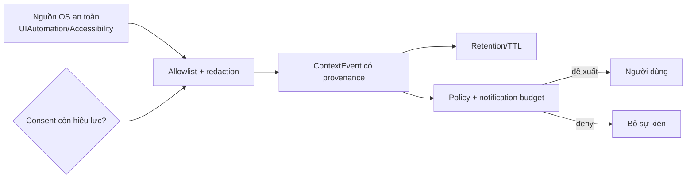

# Context broker — ranh giới quan sát chủ động và proactive runtime

[⬆ Mục lục](../README.md) · [Vision runtime](vision.md) ·
[Action policy](../05-chat-luong/action-policy.md) ·
[Threat model](../05-chat-luong/threat-model.md)

## 1. Kết luận as-built

LIVA **chưa có context broker production** và chưa chủ động quan sát desktop:

- build mặc định không chứa module `passive`;
- không có collector được spawn trong `boot::spawn_background_services`;
- `consent:get|grant|revoke` đã nối UI và lưu quyết định bền vững, nhưng trường `active` luôn
  `false`;
- `system.proactiveEnabled: true` trong config mặc định chưa có reader thực thi;
- Vision watch chỉ chạy sau thao tác tường minh của người dùng và chỉ diff pixel.

Do đó không được mô tả LIVA hiện tại là “luôn nhìn”, “biết người dùng đang làm gì” hoặc “chủ động
nhắc việc theo ngữ cảnh màn hình”.

## 2. Code experimental đang tồn tại

`liva-native-core/Cargo.toml` đặt `default = []`; feature `experimental` mới biên dịch
`liva-native-core/src/passive/mod.rs`. CI chỉ compile-check feature này, không đưa nó vào binary
giao người dùng.

Nếu bật feature, `liva-native-core/src/passive/hook.rs:233` cài hook bàn phím và chuột
toàn hệ thống trên Windows. Event có thể chứa:

- ký tự hoặc virtual-key code;
- nút và tọa độ click chuột;
- tiêu đề cửa sổ foreground;
- tên tiến trình foreground.

`liva-native-core/src/passive/buffer.rs#ActiveSessionBuffer::add_event` ghép **nội dung gõ chính
xác**, xử lý Backspace, và flush khi Enter/Tab, đổi cửa sổ, vượt ngưỡng độ dài hoặc timeout.
Về bản chất an toàn, đây là keylogger đầy đủ chức năng. Nó không phải nền móng được phép bật dần
chỉ vì “chạy local”.

## 3. Consent hiện hành

`liva-native-core/src/consent.rs#ObservationConsent::is_capture_allowed` mặc định fail-closed.
Thiếu file, JSON hỏng hoặc sai schema đều trả trạng thái chưa đồng ý. `grant` và `revoke` ghi
`data/consent.json`; mỗi lần đọc lấy lại từ đĩa nên thu hồi có hiệu lực ngay đối với collector
tương lai.

`liva-native-core/src/consent.rs#is_capture_active` luôn trả `false`. UI phải phân biệt:

- `granted`: người dùng đã cấp quyền để chuẩn bị cho tính năng tương lai;
- `active`: collector thực sự đang chạy.

Panel Settings hiện nói rõ chưa có dữ liệu nào bị ghi. Consent này không cấp quyền cho vision
capture, tool execution, messaging hay MCP.

## 4. Vì sao module passive không được nối lại

Hook toàn hệ thống có bốn nhóm rủi ro chưa được giải quyết:

| Rủi ro | Hậu quả |
|---|---|
| Thu mật khẩu/token/nội dung riêng tư | dữ liệu nhạy cảm xuất hiện trước khi có redaction |
| Hook low-level bị anti-cheat nhận diện | có thể gây khóa tài khoản hoặc thiết bị |
| Không có provenance/retention contract | không biết dữ liệu nào sinh từ đâu, giữ bao lâu |
| Không có notification/action budget | quan sát có thể biến thành làm phiền hoặc side effect ngoài ý muốn |

“Offline” chỉ giảm rủi ro truyền dữ liệu; nó không loại bỏ rủi ro thu thập quá mức, truy cập cục
bộ trái phép, backup bị lộ hoặc hành vi không minh bạch.

## 5. Kiến trúc đích tối thiểu



Collector production tương lai phải ưu tiên API Accessibility/UIAutomation để đọc metadata có
chủ đích; không được dựa trên keyboard hook. Mỗi `ContextEvent` tối thiểu cần:

- source và timestamp;
- purpose/capability ID;
- độ nhạy và redaction đã áp dụng;
- TTL hoặc retention class;
- correlation ID để audit;
- policy decision tách khỏi observation.

## 6. Cổng bắt buộc trước khi có collector

Không được chuyển `active` sang `true` hoặc spawn collector cho đến khi tất cả điều kiện sau có
test:

1. opt-in tường minh, mặc định tắt, revoke dừng collector ngay;
2. chỉ báo đang ghi luôn nhìn thấy trong UI;
3. allowlist nguồn và app; loại trừ password field/incognito/secure desktop;
4. redaction trước khi ghi, không sau khi đã persist;
5. encrypted persistence, TTL, delete propagation và backup policy;
6. provenance/audit không chứa nội dung nhạy cảm;
7. notification budget, quiet hours và deduplication;
8. mọi action đi qua [Action policy](../05-chat-luong/action-policy.md), không thực thi trực tiếp
   từ event;
9. negative tests cho missing/corrupt consent, revoke đang chạy và restart;
10. review threat model riêng cho Windows/macOS/Linux.

Giá trị `proactiveEnabled` chỉ được xem là cấu hình sản phẩm khi có reader, migration, UI phản
ánh trạng thái thật và test end-to-end. Trước đó nó không phải bằng chứng capability.

## 7. Acceptance hiện tại

```powershell
cargo test -p liva-native-core consent
cargo check -p liva-native-core --all-targets --features experimental
npm run test:coverage -w liva-ui
npm run docs:cite
```

Kết quả mong đợi ở trạng thái hiện nay: consent fail-closed, `active=false`, feature experimental
compile được nhưng không có call-site production.
