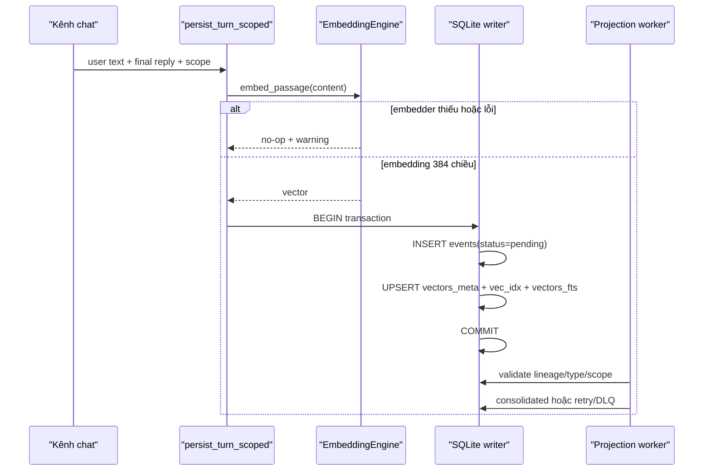
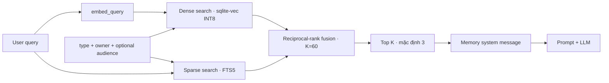
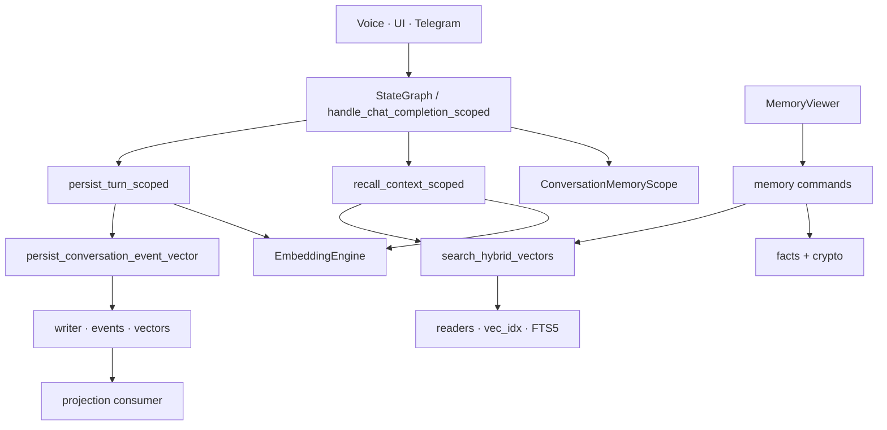
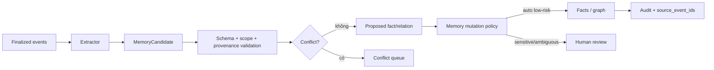

# Memory runtime — kiến trúc as-built và kế hoạch nâng cấp

[⬆ Mục lục](../README.md) · [Agent và tools](agent-tools.md) ·
[Cognitive Runtime đích](../01-kien-truc/cognitive-runtime.md) ·
[Master roadmap](../06-ke-hoach/roadmap.md) ·
[Bản HTML quét nhanh](memory.html)

## 1. Overview

Đây là nguồn chuẩn cho bộ nhớ **đang chạy** trong Unified Native Engine Rust và thứ tự nâng cấp nó
thành trí nhớ kiểu JARVIS. Trạng thái sản phẩm vẫn do hai capability
`memory.cross-session-recall` và `memory.semantic-consolidation` trong
`docs/_data/capabilities.json` sở hữu.

Kết luận ngắn:

- LIVA đã ghi và truy hồi lượt hội thoại qua nhiều lần khởi động bằng SQLite, hybrid search
  `sqlite-vec + FTS5`, trên voice, UI/WebSocket và Telegram.
- Memory hội thoại được cách ly theo `owner_domain`; Telegram group còn giới hạn recall theo đúng
  audience/conversation.
- Mỗi lượt được ghi atomic thành một event ledger và một vector projection có cùng ID.
- Worker tên “consolidation” hiện chỉ **kiểm định projection rồi finalize event**. Nó không gọi LLM,
  không trích facts, không tạo quan hệ và không tạo L3.
- `facts` là vùng nhớ duy nhất có mã hóa nội dung. Nội dung vector hội thoại và checkpoint agent
  vẫn là plaintext trong SQLite.
- `turn_layer_nodes`, L0.5, `l3_nodes` và `l3_edges` có schema/UI nhưng chưa có production writer.
- Thiếu model embedding làm recall và persist hội thoại trở thành no-op; không tạo event mồ côi.
- Dashboard đang hiển thị một mô hình L0–L3 giàu hơn runtime thật và có các contract chưa nối dây.

Không được dùng tài liệu Node.js lưu trữ tại `docs/99-luu-tru/` để mô tả runtime hiện hành.

## 2. Implementation details

### 2.1 Bốn miền memory độc lập

| Miền | Vai trò thật | Vòng đời | Mức hoàn thiện |
|---|---|---|---|
| Agent checkpoint | Lưu `AgentState` để voice graph tiếp tục trong cùng kết nối | theo `conversation_id` WebSocket | hoạt động |
| Conversational RAG | Ghi lượt hội thoại và truy hồi qua restart/conversation | theo owner, tùy kênh có audience scope | hoạt động khi có embedder |
| Structured facts | KV fact có metadata và mã hóa `value` | tồn tại đến khi ghi đè/xóa | CRUD hoạt động, chưa auto-extract |
| Event projection | Xác nhận event có vector projection đúng lineage/scope | pending → consolidated hoặc DLQ | hoạt động, chưa semantic |

`SqliteCheckpointer` tại `liva-native-core/src/agent/memory.rs#SqliteCheckpointer::save_checkpoint` không phải long-term
semantic memory. Nó serialize toàn bộ `AgentState` vào `agent_checkpoints.state_json`.

Conversational RAG nằm trong `liva-native-core/src/agent/graph/memory_scope.rs#recall_context_scoped` và
`liva-native-core/src/agent/graph/memory_scope.rs#persist_turn_scoped`.

Facts đi qua `liva-native-core/src/db.rs#set_fact` và `liva-native-core/src/db.rs#get_fact`.

Projection worker nằm tại
`liva-native-core/src/memory_consolidation.rs#run_default_projection_consumer`.

### 2.2 Entry points

| Kênh | Scope lưu | Scope recall | Đường gọi |
|---|---|---|---|
| Voice/WebRTC | `memory_owner:local` + `conversation:<WS conversation_id>` | mọi conversation của owner local | `StateGraph` |
| UI/WebSocket chat | như voice theo kết nối | mọi conversation của owner local | `handle_chat_completion_scoped` |
| Tauri IPC `chat:completion` | `memory_owner:local` + `conversation:default` | mọi conversation của owner local | command LLM |
| Telegram DM | `memory_owner:telegram:<user>` + chat hiện tại | mọi DM/conversation cùng owner | `route_input_to_agent` |
| Telegram group | owner người gửi + group hiện tại | chỉ đúng group/audience hiện tại | audience-scoped |

Voice dựng scope tại `liva-native-core/src/webrtc/pipeline.rs#WebRTCActor::spawn_llm_and_tts`.
WebSocket dựng scope tại `liva-native-core/src/websocket.rs#handle_ws_connection`.
Telegram dựng scope tại `liva-native-core/src/telegram.rs#telegram_memory_scope`.

### 2.3 Write path



`liva-native-core/src/db.rs#persist_conversation_event_vector` giữ ba bất biến:

1. `events.eventId == vectors_meta.vec_id`;
2. `vectors_meta.source_event_ids == [eventId]`;
3. event và ba projection (`vectors_meta`, `vec_idx`, `vectors_fts`) commit hoặc rollback cùng nhau.

Nội dung lưu là:

```text
Người dùng: <user_text>
LIVA: <reply>
```

Event chỉ giữ metadata điều phối; `rawUserMsg` và `rawAiReply` không được ghi ở đường này.

### 2.4 Recall path



`liva-native-core/src/db.rs#search_hybrid_vectors` lấy pool `top_k × 3`, hợp nhất dense và sparse
bằng reciprocal-rank fusion rồi cắt top-k. `LIVA_RAG_TOP_K` mặc định 3, chỉ nhận 1–20.

`liva-native-core/src/agent/graph/memory_scope.rs#memory_system_message` chèn kết quả như một system message.
Memory được xem là dữ liệu tham khảo, không phải instruction có quyền cao hơn persona/policy.

Recall không làm hỏng lượt chat: query rỗng, thiếu embedder, lỗi ONNX, lỗi DB hoặc không có hit đều trả
`None` và tiếp tục không có RAG.

### 2.5 Scope và lineage

`liva-native-core/src/agent/graph/memory_scope.rs#ConversationMemoryScope::recall_filter` tách hai khái niệm:

- `domain = memory_owner:<owner_id>` là ranh giới bảo mật;
- `category = conversation:<conversation_id>` là lineage/audience.

Scope thường chỉ filter `type + domain`, nên nhớ xuyên conversation của cùng owner. Scope
`new_audience_scoped` thêm category vào filter, dùng cho Telegram group để không đưa ký ức DM hoặc
group khác vào câu trả lời công khai.

Owner/conversation rỗng bị từ chối. Migration schema v2 chuyển các `conversation_turn` cũ không có
owner sang `memory_owner:legacy_unowned`; chúng không tự lọt vào recall owner mới.

Raw command `memory:search_hybrid` không có server identity đáng tin cậy, vì vậy
`liva-native-core/src/lib.rs#parse_untrusted_memory_search_filter` cấm truy vấn
`conversation_turn`. Nó chỉ cho tìm loại memory không phải hội thoại với filter tường minh.

### 2.6 Projection consumer

`liva-native-core/src/memory_consolidation.rs#process_pending_batch`:

- chạy tick đầu ngay khi spawn, sau đó mỗi 30 giây;
- batch mặc định 25, clamp tối đa 100;
- dùng `BEGIN IMMEDIATE` trên writer pool;
- đọc pending theo `(timestamp, eventId)`;
- xác minh type `conversation_turn`, domain, category và `source_event_ids`;
- hợp lệ → `consolidated`;
- không hợp lệ → tăng `retry_count`;
- lần thứ ba → `dlq` và ghi `dlq_consolidation`;
- ghi checkpoint cùng transaction; checkpoint lỗi làm rollback cả trạng thái event.

Tên `consolidation` dễ gây hiểu sai. Trong runtime hiện nay:

> `consolidated` chỉ có nghĩa “projection hiện có đã được xác minh và finalize”.

Worker không tạo summary, fact, relationship, AXIOM, ANCHOR hay knowledge graph.

### 2.7 Facts và mã hóa

`facts.value` được mã hóa AES-256-GCM v2, mỗi bản ghi có salt riêng và dẫn xuất khóa bằng
HKDF-SHA256. Boot đọc được v1 và nâng lên v2.

Các guardrail tại `liva-native-core/src/db.rs#set_fact`:

- mã hóa trước khi ghi;
- nếu fact cũ không giải mã được, sao lưu ciphertext vào `facts_locked_backup` trước khi ghi đè;
- backup và ghi mới cùng transaction;
- không ghi đè lost-update khi rekey;
- fact locked không bị lộ ciphertext ra UI.

`delete_memory_fact` từ chối xóa fact locked. UI Settings không còn gọi `reset_memory`;
nó gọi `memory:delete_subject {dryRun:false}` sau modal xác nhận. Alias `reset_memory` cũ
vẫn fail rõ để client cũ không vô tình thực hiện destructive action thiếu payload.

### 2.8 Schema thực tế

| Bảng/index | Writer production | Reader production | Nội dung nhạy cảm | Trạng thái |
|---|---|---|---|---|
| `agent_checkpoints` | checkpointer voice | checkpointer voice | `state_json` AES-GCM | hoạt động |
| `events` | conversational persist | worker + dashboard | metadata scope/lineage; producer mới không nhân raw transcript | hoạt động |
| `vectors_meta` | conversational persist + raw upsert | hybrid search + dashboard | conversation content AES-GCM; loại khác theo contract riêng | hoạt động |
| `vec_idx` | vector upsert | dense search | INT8 embedding 384 chiều | hoạt động |
| `vectors_fts` | vector upsert | FTS5 search | không chứa `conversation_turn`; loại non-conversation còn searchable | hoạt động |
| `facts` | `memory:set_fact` | get/viewer | `value` được mã hóa; metadata plaintext | hoạt động |
| `facts_locked_backup` | backup-before-overwrite | recovery thủ công | ciphertext cũ | hoạt động |
| `consolidation_checkpoints` | projection worker | test/diagnostic | counters/state | hoạt động |
| `dlq_consolidation` | projection worker | diagnostic | event ID + lỗi | hoạt động |
| `turn_layer_nodes` | không có | dashboard/Telegram fallback | schema cho raw turns | chưa nối |
| `l3_nodes`, `l3_edges` | không có | không có production reader | knowledge graph dự kiến | chưa nối |

Không được gọi `turn_layer_nodes` là “L0 RAM”: nó là bảng SQLite và hiện không có writer.

### 2.9 IPC và Dashboard

`liva-native-core/src/commands/memory.rs#handle` sở hữu 11 command:

| Command | Hành vi |
|---|---|
| `get_memory_data` | đọc tối đa 100 hàng từ turns, facts, events, vectors |
| `memory:set_fact` | ghi fact có mã hóa |
| `memory:get_fact` | đọc một fact |
| `delete_memory_fact` | xóa fact nếu không locked |
| `memory:delete_conversation` | dry-run/audit hoặc xóa một hội thoại theo owner/category |
| `memory:delete_subject` | dry-run/audit hoặc xóa toàn bộ subject local; owner khác fail-closed |
| `memory:sweep_retention` | dry-run/execute hội thoại quá hạn, batch tối đa 25 |
| `consolidate_memory` | chạy ngay một batch validation event→vector; không giả là semantic learning |
| `reset_memory` | alias cũ trả lỗi rõ; UI không gọi nữa |
| `memory:search_hybrid` | tìm loại non-conversation có filter |
| `memory:upsert_vector` | ghi vector 384 chiều |

Ba khoảng trống UI cần sửa trước khi mở rộng tính năng:

1. Nút “Kiểm tra projection” gọi `consolidate_memory`; đây chỉ là validation/finalization
   event→vector, không tạo summary/fact/L3.
2. L0 đọc `turn_layer_nodes` và L0.5 là chuỗi rỗng cố định; cả hai không có writer.
3. Backend trả cả `id` và alias tương thích `vecId`; tab vector không còn lọc mất dữ liệu hợp lệ.

Các khoảng trống trên là sai contract/observability, không phải bằng chứng semantic memory đang chạy.

## 3. Dependencies — độ sâu 3



- Độ sâu 1: entry point, scope, recall và persist.
- Độ sâu 2: embedder, hybrid retrieval, command memory, checkpointer, projection consumer.
- Độ sâu 3: ONNX Runtime, r2d2 pools, rusqlite, sqlite-vec, FTS5 và AES-GCM/HKDF.

External/generated code không thuộc bản đồ này.

## 4. Error handling, performance và security

### 4.1 Error handling

- Recall/persist hội thoại là best-effort và không làm hỏng câu trả lời.
- Projection worker cảnh báo theo batch và tiếp tục tick sau.
- Batch projection atomic; checkpoint lỗi rollback event state.
- Fact đọc fail-closed: ciphertext sai khóa không đi vào UI/prompt.
- Vector sai 384 chiều bị từ chối trước khi chạm sqlite-vec.
- DB có schema version; runtime từ chối DB do bản LIVA mới hơn tạo.

### 4.2 Performance

- Writer pool có 1 connection; reader pool có 4.
- Embedding và SQLite được đưa vào `spawn_blocking`, tránh chặn Tokio control path.
- `AppState.embedder` dùng mutex chung; recall/persist tuần tự hóa inference embedding.
- Vector được quantize INT8, kích thước cố định 384.
- Projection dùng `BEGIN IMMEDIATE`; batch lớn có thể tranh writer với persist/fact mutation.
- Hybrid search gọi dense và sparse tuần tự, rồi hợp nhất trong bộ nhớ.
- Chưa có benchmark retrieval corpus, p50/p95 latency, hit-rate hay memory-injection precision.

### 4.3 Security và privacy

| Dữ liệu | At-rest hiện tại | Rủi ro |
|---|---|---|
| `facts.value` | AES-256-GCM v2 | metadata vẫn plaintext |
| vector conversation content | AES-256-GCM | metadata owner/category/timestamp còn plaintext |
| FTS content | conversation không được ghi FTS | loại non-conversation vẫn plaintext theo contract |
| agent checkpoint | AES-256-GCM | cần đúng khóa thiết bị/escrow để khôi phục |
| event metadata | plaintext | lộ owner/category/timestamp |

Các thiếu hụt:

- encryption envelope đã có cho transcript/checkpoint; metadata vẫn plaintext;
- DeleteConversation/DeleteSubject local và retention opt-in đã có; DeleteSubject non-local
  bị từ chối vì projection lịch sử chưa đủ owner identity;
- chưa có provenance/confidence/conflict cho facts;
- chưa có audit cho đọc/sửa/xóa/export memory;
- lỗi FTS fallback có thể in query người dùng ra stderr;
- `memory:upsert_vector` là raw write command, chưa có capability/identity policy thống nhất.

## 5. Additional insights

### 5.1 Những gì LIVA đã có

- Recall xuyên restart có đường E2E thật.
- Scope owner/audience có test hồi quy.
- Producer event/vector atomic.
- Projection retry/DLQ/checkpoint atomic.
- Fact encryption, rekey và backup-before-overwrite có test.
- Missing embedder fail-soft, không sinh ledger mồ côi.

### 5.2 Những gì chưa được phép tuyên bố

- “LIVA có bộ nhớ bốn tầng L0–L3 hoàn chỉnh.”
- “Consolidation tự suy ngẫm và học facts.”
- “Mọi owner đều có DeleteSubject” — hiện chỉ local; hội thoại owner khác chỉ có DeleteConversation.
- “Toàn bộ memory được mã hóa.”
- “Dashboard phản ánh chính xác mọi tầng memory.”
- “LIVA có Ebbinghaus decay/reconsolidation/contradiction resolution đang chạy.”

### 5.3 Ranh giới giữa checkpoint và long-term memory

Checkpoint khôi phục state của voice graph trong **cùng conversation ID**. Nó không tìm semantic,
không sống như một identity xuyên kết nối và không thay thế RAG. Long-term memory dùng owner scope,
vector dense và sống qua restart; conversation không còn nằm trong FTS. Retention local là
opt-in theo last activity; checkpoint bị xóa cùng DeleteConversation/DeleteSubject.

## 6. Memory upgrade plan

Thứ tự ưu tiên: tính đúng và quyền riêng tư → đo retrieval → semantic learning → UX/lifecycle →
multimodal/proactive.

### M0 — Truthful memory surface

Mục tiêu: giao diện và API chỉ nói những gì runtime làm thật.

- bỏ hoặc nối thật `consolidate_memory`;
- sửa contract `id/vecId`;
- đổi nhãn L0/L0.5/L1/L2/L3 sang tên lưu trữ thật;
- hiển thị embedder on/off, pending/retry/DLQ và locked facts;
- thêm command read-only cho projection health;
- không dùng timer giả làm completion.

Acceptance:

- không command UI nào không có backend owner;
- vector đã lưu xuất hiện trong viewer;
- tầng không có writer hiển thị “chưa triển khai”, không hiển thị như bộ nhớ rỗng;
- UI dùng response thật để kết thúc loading.

### M1 — Privacy, identity và lifecycle contract

Mục tiêu: biết memory thuộc ai, lưu gì, bao lâu và xóa thế nào.

- định nghĩa `MemoryRecord`, `MemorySource`, `Provenance`, `RetentionPolicy`;
- đưa identity/capability vào mọi raw memory command;
- mã hóa hoặc tách kho plaintext conversation vectors/checkpoints;
- thêm delete graph: event → vector meta → vec index → FTS → derived facts/edges;
- backup bằng SQLite-safe snapshot; không copy file WAL đang chạy;
- redacted audit cho read/mutate/delete/export;
- khóa `memory:upsert_vector` sau action policy.

Acceptance:

- test không recall chéo owner/audience;
- xóa source event làm mọi projection dẫn xuất biến mất;
- không plaintext hội thoại trong DB khi privacy mode bắt buộc;
- restart giữa delete/consolidate không tạo record mồ côi;
- export và backup phục hồi được trên DB mới.

### M2 — Retrieval quality gate

Mục tiêu: đo được LIVA nhớ đúng hay chỉ “có vector”.

- dựng corpus song ngữ Việt/Anh gồm exact fact, paraphrase, temporal, contradiction, irrelevant,
  cross-owner và group-audience;
- tách deterministic retrieval score khỏi stochastic answer score;
- đo Recall@K, MRR, precision của memory injection, p50/p95 latency và prompt budget;
- benchmark dense-only, sparse-only và RRF;
- thêm similarity/quality threshold; không inject hit yếu;
- chống prompt injection từ memory bằng structured untrusted context.

Acceptance đề xuất:

- cross-owner/audience leak = 0;
- Recall@3 ≥ 0,90 trên exact/paraphrase test set;
- irrelevant injection ≤ 0,05;
- p95 retrieval ≤ 150 ms trên máy beta chuẩn, không tính model load;
- memory context không vượt 20% prompt budget mặc định;
- corpus và kết quả benchmark được version hóa.

Các ngưỡng trên là **target**, chưa phải số đo đã đạt.

### M3 — Semantic consolidator v1

Mục tiêu: biến lượt hội thoại finalized thành memory candidate có provenance, không cho LLM tự ghi
thẳng vào facts.



- chỉ đọc event đã finalized;
- schema typed cho fact, preference, relationship và temporal claim;
- giữ nguyên `source_event_ids`, owner, confidence và extractor version;
- deduplicate theo normalized key + evidence, không theo hallucinated summary;
- conflict không ghi đè im lặng;
- dữ liệu nhạy cảm/suy luận cá nhân cần review;
- mỗi mutation idempotent và replay-safe;
- không gọi LLM khi governor báo tài nguyên bận.

Acceptance:

- re-run cùng batch không tạo duplicate;
- mọi fact/edge truy ngược được về source event;
- conflict tạo queue, không overwrite;
- extractor lỗi đi DLQ có reason typed;
- cancellation/shutdown không để trạng thái nửa ghi.

### M4 — Human memory controls

Mục tiêu: người dùng xem, sửa, khóa, quên và xuất ký ức.

- viewer theo record/provenance thay vì tên tầng giả;
- pin/lock/edit/forget từng record;
- preview tác động trước khi delete cascade;
- “không dùng cho recall” tách khỏi “xóa vật lý”;
- export có lọc owner/category/time;
- thao tác nguy hiểm cần confirmation và action ID.

Acceptance:

- mọi mutation có before/after và audit;
- fact locked không thể bị automation ghi đè;
- delete preview khớp số hàng thực sự xóa;
- restart không làm mất trạng thái operation.

### M5 — Temporal, graph và multimodal memory

Chỉ bắt đầu sau M0–M4:

- temporal validity (`valid_from`, `valid_to`, supersedes);
- L3 graph có writer/reader và query contract;
- contradiction resolution dựa trên evidence;
- decay/retention theo loại memory, không xóa mù theo score;
- vision/audio memory opt-in, mặc định không lưu screenshot/raw audio;
- proactive recall phải qua consent, context broker và action policy.

Không đưa MemoryDreaming, autonomous self-editing hoặc auto-commit tri thức vào production trước
provenance, review, rollback và audit.

## 7. Visual acceptance matrix

| Gate | Unit/integration | E2E/model thật | Trạng thái |
|---|---|---|---|
| checkpoint round-trip | `agent::memory` tests | voice reconnect scenario | unit có |
| event/vector atomicity | `db` tests | DB file cô lập | unit có |
| owner/audience isolation | `agent::graph` + Telegram tests | multi-user Telegram sandbox | unit có |
| projection retry/DLQ | `memory_consolidation` tests | background worker | unit có |
| cross-restart recall | DB helper | `scripts/e2e-memory.mjs` | script có, cần model |
| retrieval accuracy | chưa có corpus | benchmark release | thiếu |
| delete propagation | chưa có | restart/crash injection | thiếu |
| encryption coverage | facts tests | DB-at-rest inspection | chỉ facts |
| semantic extraction | chưa có | provenance/conflict corpus | thiếu |
| memory UI truth | component/contract tests | desktop walkthrough | thiếu |

## 8. Verification commands

Không cần model:

```powershell
cargo test --manifest-path liva-native-core/Cargo.toml memory
cargo test --manifest-path liva-native-core/Cargo.toml consolidation
cargo test --manifest-path liva-native-core/Cargo.toml conversation_turn
cargo test --manifest-path liva-native-core/Cargo.toml fact
```

Cần LLM + embedding model và DB thử nghiệm cô lập:

```powershell
$env:LIVA_SERVER_PORT="8099"
$env:LIVA_DB_PATH="C:\tmp\e2e_memory.sqlite"
.\liva-native-core\target\release\liva-native-core.exe

# Cửa sổ khác
$env:LIVA_DB_PATH="C:\tmp\e2e_memory.sqlite"
node scripts/e2e-memory.mjs

# Sau khi restart gateway cùng DB
$env:CHI_HOI="1"
node scripts/e2e-memory.mjs
```

E2E hiện có phần kiểm tra cứng DB và phần đánh giá mềm câu trả lời LLM. Nó chưa thay thế retrieval
benchmark M2.

## 9. Metadata

- Ngày khảo sát: 2026-07-30.
- Commit khảo sát: `3688b5f`.
- Ngôn ngữ/runtime: Rust, SQLite WAL, sqlite-vec, FTS5, ONNX Runtime; Vue/TypeScript cho viewer.
- Độ sâu dependency: 3.
- Entry points đã xác nhận bằng GitNexus:
  `handle_chat_completion_scoped`, `recall_context_scoped`, `persist_turn_scoped`,
  `persist_conversation_event_vector`, `process_pending_batch`.
- Tài liệu Vault tham chiếu:
  `Knowledge/memory_architecture.md`, `Rules/coding_standards.md`,
  `Rules/shutdown_chain.md`.

## 10. Next steps

- [ ] M0: sửa memory surface và observability.
- [ ] M1: chốt privacy/identity/delete contract.
- [ ] M2: dựng corpus và benchmark retrieval.
- [ ] M3: semantic consolidator có provenance.
- [ ] M4: human memory controls.
- [ ] M5: temporal graph và multimodal opt-in.

Việc triển khai code cho từng milestone phải có GitNexus impact analysis trước khi sửa symbol và có
acceptance test tương ứng; tài liệu này không tự cấp quyền triển khai các thay đổi runtime.
