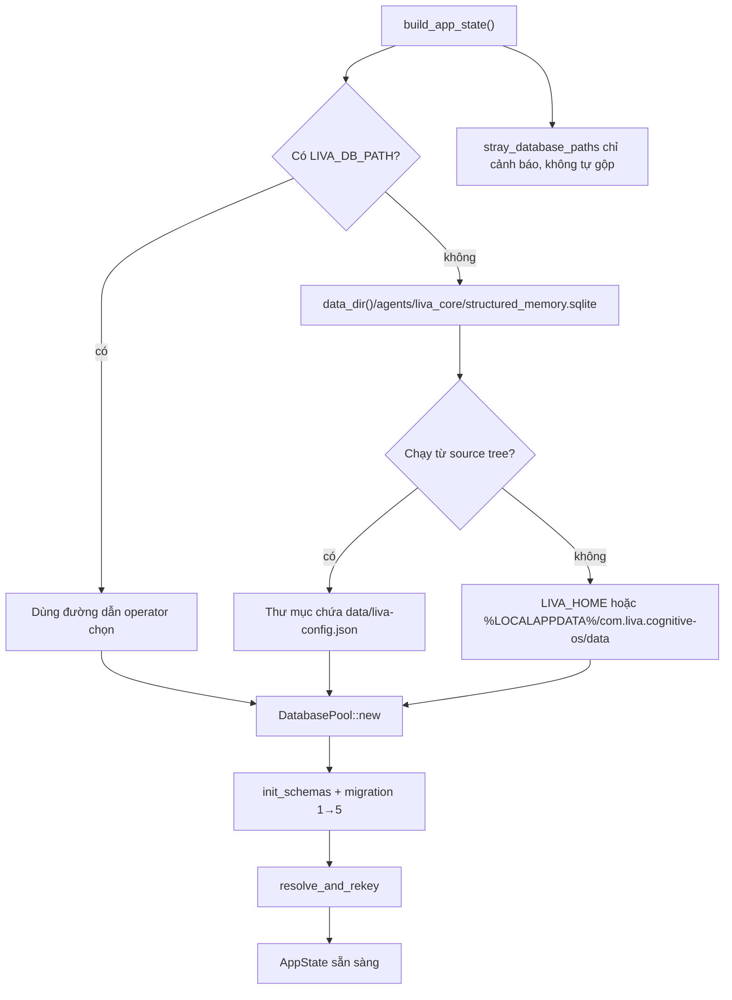
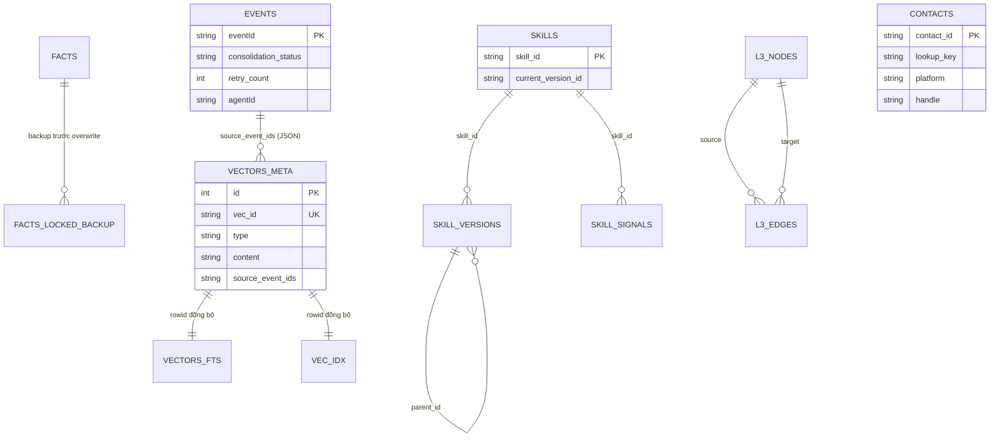

# Persistence runtime — dữ liệu bền, schema và kế hoạch nâng cấp

[⬆ Mục lục](../README.md) · [Memory runtime](memory.md) ·
[Threat model](../05-chat-luong/threat-model.md) · [Master roadmap](../06-ke-hoach/roadmap.md)

## 1. Kết luận as-built

Đây là nguồn chuẩn cho nơi LIVA đặt dữ liệu ghi được, hợp đồng SQLite, migration và vòng đời
dữ liệu. Trạng thái hiện hành:

- Unified Native Engine dùng một SQLite chính ở
  `data/agents/liva_core/structured_memory.sqlite`; `LIVA_DB_PATH` có quyền ghi đè.
- Pool có một writer, bốn reader; writer chạy WAL và `synchronous=NORMAL`.
- Schema hiện tại là phiên bản 5 với **20 bảng**, không phải 15 bảng như snapshot 07 cũ.
- 14/20 bảng có production writer; sáu bảng chỉ có schema hoặc reader/UI.
- Migration 1→5 chạy tuần tự, mỗi bước trong transaction và từ chối database mới hơn binary.
- Config JSON được thay atomically. Consent và user profile chưa dùng cùng một data-root contract.
- Core đã có online backup/restore SQLite nhất quán, manifest SHA-256, kiểm tra integrity/FK,
  key-ID compatibility, atomic swap và bản rollback; runbook vận hành nằm tại
  [Backup và restore SQLite](../02-van-hanh/06-backup-restore-sqlite.md).
- Mọi connection bật `PRAGMA foreign_keys=ON`; boot chạy `foreign_key_check` sau migration.
  Cascade skill graph và L3 vì vậy là bất biến được SQLite thực thi.
- Retention conversation local đã có sweeper opt-in, batch 1–25 và mặc định tắt;
  `DeleteSubject(local)` đã xóa các projection có thể quy owner an toàn.

Phần mã hóa, khóa, quyền truy cập và bề mặt tấn công thuộc
[Threat model](../05-chat-luong/threat-model.md), không lặp lại tại đây.

## 2. Luồng khởi động và vị trí dữ liệu

`liva-native-core/src/boot.rs#build_app_state` tạo thư mục cha, mở pool, sau đó mới giải quyết
khóa mã hóa. `liva-native-core/src/paths.rs#data_dir` là neo chung của config và database:

1. source tree: thư mục chứa `data/liva-config.json`;
2. bản cài: `LIVA_HOME`, data root mới của bundle hoặc root legacy khi thật sự có dữ liệu cũ;
3. fallback cuối: `./data`.

`liva-native-core/src/paths.rs#stray_database_paths` dò các DB từng bị tạo theo working directory
và chỉ cảnh báo. Không tự merge là lựa chọn an toàn vì hai DB có thể cùng chứa lịch sử hợp lệ.

### 2.1 Những nơi chưa theo neo chung

| Dữ liệu | Đường hiện hành | Durability | Vấn đề |
|---|---|---|---|
| SQLite chính | `data_dir()/agents/liva_core/structured_memory.sqlite` | WAL | đã không phụ thuộc cwd |
| Config | `data_dir()/liva-config.json` | temp + flush + atomic replace | patch không có schema/allowlist khóa |
| Consent | bộ dò riêng cho `data/consent.json` | ghi trực tiếp | còn phụ thuộc cwd, có thể rách file |
| User profile | `data/user_profile.json` tương đối | chỉ đọc | khác data root; fallback chứa hồ sơ cá nhân hard-code |
| Stronghold | Tauri app-local-data | snapshot riêng | thuộc threat model |
| Model tải về | `resource_write_root()/models` | manifest + SHA-256 | không thuộc DB |

Config đi qua `liva-native-core/src/paths.rs#update_config_file_at`: khóa process-wide, ghi file tạm
`create_new`, `sync_all`, rồi thay atomically. Consent tại
`liva-native-core/src/consent.rs#save_to` chưa có cùng bảo đảm này.

## 3. ERD logic của 20 bảng

Các liên kết event→vector nằm trong JSON và rowid, không phải foreign key SQL. ERD vì vậy mô tả
quan hệ logic; chỉ skill và L3 khai báo foreign key thật. `configure_connection` bật foreign key
trên cả reader/writer và `ensure_foreign_key_integrity` chặn boot nếu phát hiện orphan.

## 4. Danh mục schema và ownership ghi

Nguồn schema là `liva-native-core/src/db.rs#init_schemas` và
`liva-native-core/src/db.rs#MIGRATIONS`.

| Bảng | Miền | Production writer | Nội dung mã hóa | Trạng thái |
|---|---|---|---|---|
| `facts` | fact KV | có | `value` AES-GCM | hoạt động |
| `facts_locked_backup` | cứu khóa | có | giữ ciphertext gốc | hoạt động |
| `agent_checkpoints` | agent state | có | `state_json` AES-GCM | hoạt động |
| `events` | event ledger | có | không | hoạt động |
| `vectors_meta` | metadata + text recall | có | content AES-GCM khi `conversation_turn` | hoạt động |
| `vectors_fts` | full-text projection | có | không chứa `conversation_turn` | hoạt động |
| `vec_idx` | vector projection | có | vector không mã hóa | hoạt động |
| `consolidation_checkpoints` | worker cursor | có | không | hoạt động |
| `dlq_consolidation` | lỗi projection | có | không | hoạt động |
| `tasks` | task manager | có | không | hoạt động |
| `skills` | skill identity | có | không | hoạt động |
| `skill_versions` | version DAG | có | không | hoạt động |
| `skill_signals` | evidence signal | có | không | hoạt động |
| `contacts` | danh bạ | có | không | hoạt động |
| `vector_dlq` | delete vector DLQ | **không** | không | schema-only |
| `turn_layer_nodes` | tầng lượt cũ | **không** | không | schema/UI-only |
| `daily_briefings` | briefing | **không** | không | schema-only |
| `personality_state` | trạng thái persona | **không** | không | schema-only |
| `l3_nodes` | semantic graph | **không** | không | schema/UI-only |
| `l3_edges` | semantic graph | **không** | không | schema/UI-only |

“Có writer” nghĩa là có đường ghi trong production source, không chỉ fixture/test. Chi tiết memory
event/vector và sáu bảng chưa có writer nằm tại [Memory runtime](memory.md).

## 5. Pool, PRAGMA và migration

### 5.1 Connection contract

`liva-native-core/src/db.rs#DatabasePool::new` tạo:

- writer pool `max_size=1`, read-write-create;
- reader pool `max_size=4`, read-only;
- `busy_timeout=5000`;
- `foreign_keys=ON` trên mọi connection;
- cache khoảng 8 MiB, page size 32 KiB, mmap 256 MiB;
- writer: `journal_mode=WAL`, `synchronous=NORMAL`, `wal_autocheckpoint=500`;
- reader: `synchronous=NORMAL`.

Một writer giúp giảm cạnh tranh ghi nhưng không thay thế transaction cho các bất biến nhiều bảng.
`synchronous=NORMAL` là đánh đổi hiệu năng: chống hỏng cấu trúc tốt trong WAL, nhưng giao dịch vừa
commit có thể mất khi hệ điều hành mất điện.

Sau khi schema và migration hoàn tất, `ensure_foreign_key_integrity` chạy
`PRAGMA foreign_key_check`. Database có orphan bị từ chối ngay khi boot; test khóa cả việc bật lại
PRAGMA lẫn `ON DELETE CASCADE`.

### 5.2 Migration contract

`SCHEMA_VERSION=5`. `liva-native-core/src/db.rs#run_migrations`:

1. đọc `PRAGMA user_version`;
2. từ chối mở DB có version lớn hơn binary;
3. DB version 0 được đóng dấu baseline 1 sau khi `init_schemas` idempotent đã chạy;
4. áp lần lượt 2, 3, 4, 5, mỗi bước một transaction;
5. cập nhật `user_version` trong cùng transaction.

Khoảng trống còn lại: chưa tự động tạo snapshot trước mọi migration và chưa có ma trận restore từ
artifact của từng bản phát hành.

### 5.3 Backup/restore contract

`liva-native-core/src/persistence_backup.rs` cung cấp:

- `backup_database`: dùng SQLite Online Backup API trên writer đang hoạt động, ghi file tạm,
  chạy `quick_check` + `foreign_key_check`, `fsync`, tạo manifest rồi atomic rename;
- manifest v2 cạnh file backup chứa version manifest, thời điểm, số byte, SHA-256,
  `PRAGMA user_version` và key-ID 128-bit; không chứa encryption key;
- `restore_database`: từ chối key-ID không tương thích trước khi đụng target, sau đó xác minh
  manifest/hash/schema/integrity, restore vào file mới rồi atomic swap;
- database, WAL và SHM trước restore được giữ cùng bản `.rollback`; nếu swap thất bại, target cũ
  được đưa trở lại.

Restore là thao tác offline: phải dừng mọi tiến trình LIVA dùng target trước khi chạy. Bài test
`sqlite_backup_restore.rs` khóa round-trip, rollback, backup bị sửa, sai recovery key không được
chạm database hiện hành và đúng recovery key đọc lại được canary mã hóa.

### 5.4 sqlite-vec

`liva-native-core/src/db.rs#load_sqlite_vec` chỉ bật extension loading trong lúc thử nạp, rồi tắt.
Các candidate gồm đường dev quanh cwd, cạnh executable/resources và tên DLL trần. Hai hệ quả:

- thiếu `vec0` làm init `vec_idx` thất bại và chặn boot; chưa có degraded mode không-vector;
- candidate tương đối hoặc tên trần làm trust root của DLL rộng hơn artifact đã ký/manifest.

Đây vừa là reliability gap vừa là supply-chain boundary; hướng xử lý nằm ở §8 và threat model.

## 6. Bất biến dữ liệu hiện có

| Bất biến | Cơ chế | Mức tin cậy |
|---|---|---|
| Không có hai writer đồng thời trong process | writer pool size 1 | enforced |
| Config không lộ trạng thái nửa ghi | temp + flush + atomic replace | enforced trong một process |
| Event và vector cùng lineage | transaction/ID chung trong persist turn | enforced khi embedder có |
| Locked fact không bị mất khi overwrite | copy ciphertext sang backup trước ghi | enforced |
| Transcript/checkpoint không nằm plaintext trong DB/WAL | field encryption + bỏ conversation FTS + boot purge | byte-level E2E |
| Migration không áp nửa bước | transaction mỗi version | enforced |
| Skill version bị xóa theo skill | `ON DELETE CASCADE` + FK trên mọi connection | enforced |
| L3 edge phải trỏ node tồn tại | foreign key + boot integrity check | enforced |
| Xóa một hội thoại xóa mọi projection hiện hành | `DeleteConversation` dry-run/audit + transaction + secure-delete/WAL truncate | byte-level E2E |
| Xóa subject local không xóa event/vector owner khác | `DeleteSubject` local-only + transaction + audit hash | byte-level E2E + isolation fixture |
| Retention không xóa hội thoại còn hoạt động | chọn theo `MAX(timestamp/created_at)` và owner domain | integration test batch/retry |
| Khôi phục đúng khóa sau mất/corrupt DB | manifest key-ID + integrity + atomic restore + rollback | core API + recovery drill |

## 7. Rủi ro ưu tiên

| ID | Mức | Rủi ro | Bằng chứng / tác động |
|---|---|---|---|
| D-P0-1 | đã đóng | foreign key trên mọi connection | unit test FK, orphan và cascade |
| D-P0-2 | đã đóng ở core | backup/restore an toàn | còn thiếu lịch backup tự động và release restore matrix |
| D-P0-3 | đã đóng cho local beta | DeleteConversation, DeleteSubject local và retention opt-in | raw DB/WAL, owner isolation, last-activity và bounded-batch tests xanh; non-local DeleteSubject fail-closed |
| D-P1-1 | vừa | consent/profile còn lệch data root | đổi cwd/profile chạy có thể đọc nhầm hoặc mất trạng thái |
| D-P1-2 | vừa | consent ghi trực tiếp | kill/power loss có thể tạo JSON rách; fail-closed nhưng UX hỏng |
| D-P1-3 | vừa | sáu bảng không writer | schema/UI tạo ảo giác capability đã tồn tại |
| D-P1-4 | vừa | vec0 là boot-hard dependency | thiếu DLL làm toàn runtime không lên |
| D-P2-1 | thấp | schema truth viết tay | số bảng/writer dễ lại trôi như snapshot 15 bảng |

## 8. Kế hoạch nâng cấp

### D0 — Cưỡng chế toàn vẹn cơ sở — hoàn tất 2026-07-30

- Bật `PRAGMA foreign_keys=ON` trên **mọi** connection writer/reader.
- Thêm `foreign_key_check`, orphan fixtures và delete-cascade tests.
- Quyết định rõ relation event→vector: foreign key chuẩn hóa hoặc invariant transaction có checker.
- Gate: boot DB v0/v1/v3/v5, migration lại idempotent, không orphan.

### D1 — Backup và restore có thể diễn tập — core + key recovery hoàn tất 2026-07-31

- Tạo snapshot bằng SQLite backup API hoặc `VACUUM INTO`, không copy file DB đang mở.
- Manifest chứa schema version, app version, checksum, thời điểm và key-ID; không chứa khóa.
- Restore vào file mới, `quick_check` + `foreign_key_check`, rồi atomic swap.
- Giữ ít nhất last-known-good trước migration; giới hạn dung lượng/retention.
- Gate: backup khi app đang ghi, phá bản chính, restore và recall lại fixture đã biết.

### D2 — Vòng đời và quyền quên — core local beta hoàn tất 2026-07-31

- `memory:delete_conversation` mặc định `dryRun: true`, chỉ Dashboard được gọi; execute
  phải gửi `dryRun: false` rõ ràng.
- Core scope bằng `memory_owner:{owner}` + `conversation:{id}`, ghi audit với scope hash
  thay vì giữ định danh plaintext.
- Xóa đồng bộ event, `vectors_meta`, `vectors_fts`, `vec_idx`, checkpoint local, DLQ,
  fact có `sourceTurnId` và locked backup; projection ngoài scope phải còn nguyên.
- `secure_delete` + `wal_checkpoint(TRUNCATE)` chạy sau commit; report không tuyên bố
  byte-level hoàn tất nếu WAL còn reader giữ.
- `memory:delete_subject` mặc định dry-run, chỉ Dashboard được gọi và chỉ nhận owner
  local. Settings gửi execute tường minh; core xóa facts/backup, local+legacy event/vector,
  FTS/vec index, checkpoint, turn layer, consolidation state/DLQ liên quan và L3 trong
  một transaction. Owner khác bị từ chối vì các projection lịch sử chưa có owner column.
- `memory:sweep_retention` nhận `maxAgeDays`, `batchLimit` và mặc định dry-run. Runtime
  sweeper chỉ bật khi export `LIVA_MEMORY_RETENTION_DAYS > 0`; mặc định không tự xóa.
  Mỗi hội thoại có transaction/audit riêng, batch tối đa 25; nếu dừng giữa batch thì lần
  sau chọn từ dữ liệu còn lại, tạo checkpoint idempotent mà không cần cursor ngoài.
- Eligibility dùng hoạt động mới nhất từ event **và** vector; một turn mới giữ lại toàn bộ
  hội thoại. Worker chạy trong `spawn_blocking`, nhịp tối thiểu 60 giây và retry ở nhịp sau.
- DeleteFact audit riêng vẫn là hardening P2; xóa toàn subject/hội thoại đã có audit hash.
- Gate: test tạo dữ liệu xuyên mọi projection, xóa, quét raw DB xác nhận không còn.

### D3 — Một data-root contract

- Đưa consent và profile qua `data_dir()`; migration không phá dữ liệu legacy.
- Dùng cùng atomic writer cho mọi JSON ghi được.
- Xóa fallback hồ sơ cá nhân hard-code; trả trạng thái “chưa thiết lập”.
- Thêm schema/allowlist cho config và tách secret khỏi config.
- Gate: chạy từ repo root, crate, Tauri dev và bản cài đều đọc cùng một state.

### D4 — Reliability và observability

- Ghim `vec0` vào artifact/resource đã kiểm checksum; bỏ tìm DLL trần trong production.
- Thiết kế degraded mode: facts/checkpoint/config vẫn chạy khi vector extension hỏng.
- Metrics: WAL size, busy rate, migration duration, backup age, DLQ depth, orphan count.
- Sinh bảng schema/writer ownership từ SQLite + code inventory để tài liệu không đếm tay.
- Gate: fault injection thiếu vec0, full disk, kill giữa write, DB busy và DB mới hơn binary.

## 9. Dependency depth

| Độ sâu | Thành phần | Ảnh hưởng khi đổi |
|---|---|---|
| 0 | `DatabasePool`, schema, `data_dir`, config writer | mọi persistence path |
| 1 | boot, memory, skills, contacts, consent/config commands | khởi động và feature storage |
| 2 | agent graph, Telegram, UI/WebSocket commands | trải nghiệm người dùng |
| 3 | installer, backup tooling, docs/tests | phát hành và phục hồi |

Mọi thay đổi schema phải cập nhật migration, test upgrade, backup compatibility và tài liệu này
trong cùng change set. Không dùng mã Node/Python trong `docs/99-luu-tru/` làm hướng dẫn runtime.

## 10. Acceptance checklist

- [x] `foreign_keys=ON` trên mọi connection và `foreign_key_check` sạch.
- [x] Online backup/restore, tamper rejection và rollback được diễn tập bằng fixture SQLite.
- [ ] Xóa conversation/fact loại bỏ đủ projection và có audit.
- [ ] Consent, profile, config và DB dùng một neo dữ liệu.
- [ ] Secret không nằm trong config JSON.
- [ ] Missing vec0 có thông báo chữa được hoặc degraded mode.
- [ ] Schema inventory được sinh hoặc kiểm tự động.
- [ ] Các test migration, crypto boot, đường dẫn bản cài và crash write đều xanh.
