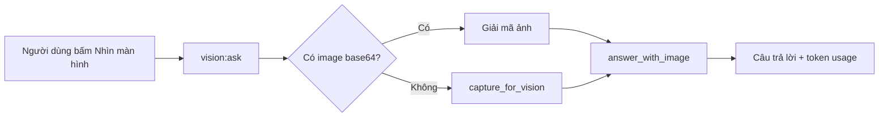

# Vision runtime — chụp màn hình, diff vùng và hỏi đáp đa phương thức

[⬆ Mục lục](../README.md) · [Context broker](context-broker.md) ·
[Resource governor](../05-chat-luong/resource-governor.md) ·
[Threat model](../05-chat-luong/threat-model.md)

## 1. Kết luận as-built

Vision là perception **theo yêu cầu của người dùng**, không phải một context broker tự trị:

- `vision:capture` chụp màn hình chính, nén PNG rồi trả base64;
- `vision:add_region`, `vision:remove_region`, `vision:set_config` và
  `vision:get_changed_regions` quản lý vùng và so sánh hai khung hình;
- `vision:ask` nhận ảnh base64 hoặc tự chụp, rồi gọi model VL cục bộ;
- Dashboard có hai thao tác tường minh: “Nhìn màn hình” và “Canh chừng màn hình”;
- “Canh chừng” là polling diff điểm ảnh mỗi 3 giây sau khi người dùng bấm bật. Nó không gọi
  model, không hiểu ngữ nghĩa và không tự thực hiện hành động.

`liva-native-core/src/commands/vision.rs#handle` là router chuẩn cho sáu lệnh. Cả desktop
Tauri và binary standalone dựng cùng `VisionManager` trong
`liva-native-core/src/boot.rs#build_app_state`.

## 2. Hợp đồng lệnh

| Lệnh | Đầu vào | Kết quả | Ghi chú |
|---|---|---|---|
| `vision:capture` | `{}` | `width`, `height`, `format: "png"`, `data`, `raw_bytes`, `png_bytes` | capture, đổi RGB, nén PNG và base64 đều chạy ngoài worker async |
| `vision:add_region` | `ScreenRegion` | `{ success: true }` | từ chối ID trùng, kích thước 0, threshold ngoài 0…1 hoặc vượt số vùng tối đa |
| `vision:remove_region` | `{ id }` | `{ success: true }` | lỗi nếu thiếu hoặc không thấy ID |
| `vision:get_changed_regions` | `{}` | mảng `RegionDiffResult` | khung đầu là baseline với difference 1.0; lần sau diff từng vùng |
| `vision:set_config` | `VisionConfig` | `{ success: true }` | mặc định tolerance 5, tối đa 64 vùng |
| `vision:ask` | `question?`, `image?`, `temperature?`, `top_p?` | `text` và token usage | nếu không có ảnh thì tự chụp; câu hỏi mặc định bằng tiếng Việt |

Đường capture nằm tại `liva-native-core/src/commands/vision.rs#capture`. Mutex của
`VisionManager` chỉ được giữ để lấy capturer/cập nhật frame; capture và encode nặng chạy trong
`spawn_blocking`, tránh chặn Tokio runtime.

Đường diff nằm tại `liva-native-core/src/commands/vision.rs#get_changed_regions` và gọi
`liva-native-core/src/vision/diff.rs#DiffEngine::diff_region`. `VisionManager::add_region`
khóa các bất biến vùng trước khi vùng đi vào đường chạy.

## 3. Đường hỏi đáp ảnh



`liva-native-core/src/commands/vision.rs#ask` giữ toàn bộ capture/giải mã và suy luận trong
blocking task. `liva-native-core/src/vision/capture.rs#capture_for_vision` chọn:

- `LIVA_VISION_REGION=full`: toàn màn hình;
- `cursor`: crop quanh con trỏ, mặc định 512 px hoặc `LIVA_VISION_CROP`;
- `auto`/giá trị khác: crop chỉ khi một cửa sổ ngoài LIVA đang fullscreen.

Đường `auto` dùng `liva-native-core/src/governor.rs#game_mode_active_now`, không dùng ngưỡng
CPU/GPU của governor có cache. Vì vậy tài liệu hoặc UI không được tuyên bố rằng render/compile
không-fullscreen cũng tự kích hoạt crop.

`liva-native-core/src/llm/engine.rs#LlamaRouterManager::answer_with_image` yêu cầu:

1. model đã được nạp và không ở chế độ vocab-only;
2. `ai.mmprojModel` đã được cấu hình và artifact vượt qua trust verification khi autoload;
3. trên Windows phải chạy release build vì debug CRT có thể abort trong loader mmproj.

Lỗi hard-code ChatML trong `answer_with_image` đã được gỡ ở `e69f47d`; prompt ảnh nay dùng chat
template của chính model nên hoạt động với Gemma-4 hiện hành lẫn Qwen3-VL thay thế. Trên máy CUDA
đủ VRAM, phép đo 05/08/2026 đạt khoảng **937 ms** với `n_gpu_layers=99`; CPU-only vẫn có thể ở
mức hàng chục giây, vì vậy preflight phải báo theo quyết định GPU thật của runtime.
Đó là bằng chứng kỹ thuật point-in-time, không phải SLO sản phẩm.

## 4. “Canh chừng màn hình” trong Dashboard

`liva-ui/src/composables/useGateway.ts#useGateway` cung cấp `startScreenWatch`, thực hiện:

1. gọi `vision:capture` một lần để lấy kích thước pixel vật lý và mồi baseline;
2. đăng ký vùng toàn màn hình với threshold 0,02;
3. gọi `vision:get_changed_regions` mỗi 3 giây;
4. chỉ ghi event UI khi vùng trả `is_changed`;
5. khi dừng, hủy timer và gọi `vision:remove_region`.

Một lỗi ở capture/add-region/get-changed-regions dừng hẳn timer, tránh vòng lặp lỗi. Đây vẫn là
phiên quan sát do người dùng bật trong Dashboard; không có suy luận ngữ nghĩa, notification
policy hay action loop tự động.

## 5. Ranh giới quyền riêng tư và quyền lệnh

Ảnh màn hình có thể chứa secret, tin nhắn, tài liệu và dữ liệu cá nhân. Ranh giới hiện hành:

- principal widget chỉ được `vision:capture` và `vision:ask`;
- principal dashboard được cả sáu lệnh;
- principal remote không có lệnh vision;
- quyết định nằm trong `liva-native-core/src/authorization.rs#authorize_command`;
- không có upload cloud trong command vision; model mặc định chạy cục bộ;
- command capture không hỏi consent riêng cho từng khung. Hành động tường minh của người dùng và
  authorization theo session là ranh giới hiện tại.

Không được tái sử dụng đường này làm collector nền trước khi hoàn tất contract ở
[Context broker](context-broker.md): opt-in rõ ràng, chỉ báo đang ghi, redaction, retention,
provenance và notification budget.

## 6. Giới hạn và acceptance

| Giới hạn | Trạng thái đúng |
|---|---|
| Hiểu thay đổi trong watch | chưa có; chỉ có tỷ lệ pixel |
| Nhiều màn hình | capturer mặc định display 0 |
| Crop tự động khi máy bận CPU/GPU | chưa có; auto crop chỉ xét fullscreen |
| Vision trên Windows debug | bị từ chối sạch |
| SLO latency có GPU | chưa có benchmark release chuẩn |
| Consent từng frame | chưa có |

Các cổng tối thiểu khi sửa subsystem:

```powershell
cargo test -p liva-native-core vision
npm run test:coverage -w liva-ui
npm run build -w liva-ui
npm run docs:cite
```

Thay đổi command hoặc manager phải chạy GitNexus impact trước khi sửa và kiểm tra lại luồng
`handle → capture/diff/ask` sau khi sửa.
