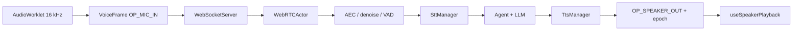

# Voice runtime — kiến trúc as-built

[⬆ Mục lục](../README.md) · [Voice SLO](../05-chat-luong/voice-slo.md) · [Wake word](wake-word.md)

## 1. Phạm vi

Đây là canonical as-built cho đường voice đang chạy. Trạng thái sản phẩm vẫn do
`experience.voice-conversation` trong `docs/_data/capabilities.json` sở hữu.

`liva-voice` là dịch vụ chuyên biệt cho voice clone/tiện ích Python; đường hội thoại mặc định
được điều phối trong Rust, không đi qua backend Node/Python cũ.

## 2. Composition

Standalone và Tauri cùng gọi
`liva-native-core/src/boot.rs#build_app_state`. Composition root tạo một `AppState` và
`VoiceRuntimeComponents`; WebSocket voice dùng cùng state đó.

## 3. Capture và transport

- Browser dùng `liva-ui/src/composables/useVoicePipeline.ts#useVoicePipeline`; worklet gom
  512 mẫu mỗi frame, tương đương 32 ms ở 16 kHz.
- Wire contract decode nằm ở `liva-native-core/src/webrtc/frame.rs#VoiceFrame::decode`.
- PCM loa mang `turn_epoch`; core tạo frame tại
  `liva-native-core/src/webrtc/frame.rs#speaker_frames`.
- UI loại audio cũ và xử lý flush trong
  `liva-ui/src/composables/useSpeakerPlayback.ts#useSpeakerPlayback`.
- WebSocket server được tái sử dụng giữa standalone/Tauri; contract bind/handshake có test tại
  `liva-native-core/tests/websocket_transport.rs#reusable_server_binds_and_echoes_voice_handshake`.

## 4. Turn processing và cancellation

`liva-native-core/src/webrtc/pipeline.rs#WebRTCActor::run` nhận frame và điều phối turn.
Khi có speech start/end hoặc turn mới:

1. epoch tác vụ tăng;
2. STT/LLM/TTS cũ bị hủy;
3. control frame `OP_FLUSH` đi qua hàng ưu tiên;
4. speaker PCM của epoch cũ bị loại trước enqueue và một lần nữa tại UI.

Việc enqueue speaker là fail-fast khi queue đầy tại
`liva-native-core/src/webrtc/pipeline.rs#VoiceOutbound::blocking_send_speaker_if_current`.
Điều này bảo vệ blocking worker khỏi treo vì client phát âm thanh chậm.

## 5. Tiền xử lý audio

`liva-native-core/src/webrtc/session.rs#VoiceRuntimeComponents::load` nạp một lần theo process và fork
state phù hợp theo session:

| Thành phần | Mặc định sản phẩm | Vai trò |
|---|---|---|
| Silero VAD | bật | phát hiện speech start/end |
| GTCRN denoise | bật nếu model tồn tại | giảm nhiễu trước STT |
| SmartTurn | tắt | classifier kết thúc lượt thử nghiệm |
| Self AEC | tắt | bổ sung cho WebRTC AEC khi được bật |

Nguồn cấu hình là
`liva-native-core/src/webrtc/session.rs#VoiceRuntimeConfig::from_env`. Thiếu model tùy chọn làm
thành phần đó degraded về `None`, không được làm boot toàn bộ ứng dụng thất bại.

## 6. STT

Owner runtime được dựng tại `liva-native-core/src/stt/mod.rs#SttManager::new`.

| Engine | Đường dùng | Trạng thái |
|---|---|---|
| Nemotron ONNX | streaming và fallback tiếng Việt | hoạt động; decoder bootstrap được kiểm tensor finite/shape |
| Parakeet VI | whole-utterance tiếng Việt mặc định; `LIVA_STT_VI_ENGINE=nemotron` để opt-out | lazy-load; lỗi model/vocab thì ghi lý do và lùi Nemotron; không dùng cho wake probe |

Nemotron engine được dựng tại `liva-native-core/src/stt/engine.rs#SttEngine::new`; bootstrap decoder được
xác nhận một lần rồi clone snapshot khi reset utterance. Parakeet không được lazy-load chỉ để
nghe wake word.

## 7. TTS

Owner runtime được dựng tại `liva-native-core/src/tts/mod.rs#TtsManager::from_bin`. Clause được tạo bởi
`liva-native-core/src/tts/mod.rs#TtsChunker::push`; mỗi clause đi qua kế hoạch fallback:

1. VieNeu nếu được bật và phù hợp;
2. Piper theo ngôn ngữ;
3. Kokoro fallback cuối.

Trước chunker/TTS, `tts/avatar_control.rs#AvatarSpeechFilter::push` loại control tag avatar khỏi câu đọc.
Nó chấp nhận 11 tag cảm xúc/hành động và `[anim:<id>]`, kể cả tag bị cắt giữa hai token stream;
ngoặc thường trong thân câu vẫn được giữ. Danh sách phải đồng bộ với
`liva-ui/src/utils/avatarControlTags.ts` để UI và TTS không hiểu hai schema khác nhau.

Đường thoại còn có state machine gửi tin nhiều lượt ở
`messaging/voice_dialogue.rs#VoiceMessageDialogue::begin`: hỏi phần thân/nền tảng còn thiếu, tạo draft,
đợi xác nhận hoặc huỷ. Side effect vẫn đi qua outbox SQLite consume-once; hội thoại không được
gửi trực tiếp chỉ vì STT nghe thấy một câu giống lệnh.

Fallback được thực thi tại `liva-native-core/src/tts/mod.rs#run_synthesis_fallback`; cancellation
được kiểm trước mỗi backend nên turn đã hủy không được phát sinh side effect âm thanh mới.

## 8. Bằng chứng và giới hạn

| Bằng chứng | Chứng minh |
|---|---|
| `liva-native-core/tests/voice_runtime_components.rs` | cùng cấu hình component cho composition root |
| `liva-native-core/tests/websocket_transport.rs` | server bind/handshake dùng lại được |
| unit tests trong `webrtc/frame.rs` | frame bound, epoch gate và flush |
| unit tests trong `webrtc/pipeline.rs` | control priority, queue fail-fast, loại epoch cũ |
| `scripts/e2e-gateway-ci.mjs` | đường gateway cấp tiến trình |

Các test trên chưa chứng minh latency trên Tauri release hoặc chất lượng âm thanh bằng tai. Hai
điểm đó thuộc [Voice SLO](../05-chat-luong/voice-slo.md).

## 9. Không được hiểu sai

- Có code SmartTurn/AEC không có nghĩa chúng bật mặc định.
- Unit test với model giả không phải chất lượng STT/TTS thực.
- `working` ở từng engine không nâng toàn capability voice lên `working` khi chưa có SLO đầu-cuối.
- Tọa độ và khảo sát chi tiết trước 30/07/2026 được giữ trong tài liệu voice cũ đã đóng băng.
