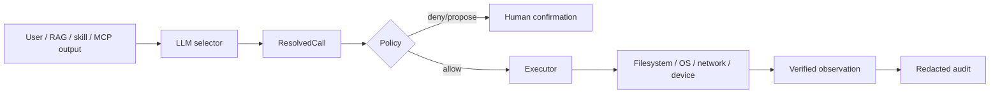

# Action policy — ranh giới an toàn và acceptance gates

[⬆ Mục lục](../README.md) · [Agent và tools](../03-he-thong-con/agent-tools.md) · [Master roadmap](../06-ke-hoach/roadmap.md)

## 1. Trạng thái

Capability `agent.action-policy` đang `partial`. LIVA có ba guardrail cục bộ:

1. `ExecPolicy` cho tool;
2. draft-confirm-take cho messaging;
3. consent store fail-closed cho passive observation tương lai.

Ba cơ chế này không dùng một action contract chung. Hiện chưa có `ActionProposal`,
`PolicyDecision`, risk tier chuẩn, action ID, idempotency key, audit record hay
`ToolObservation` dùng xuyên mọi side effect.

## 2. Ma trận policy hiện hành

| Đường | Quyết định | Mặc định | Khoảng trống |
|---|---|---|---|
| LLM/native tool | `ExecPolicy::for_tool` | reversible/read-only Auto; ghi file ProposeOnly | không có confirmation continuation |
| LLM/external MCP | `ExecPolicy::for_tool` | ProposeOnly | env có thể mở cả server bằng `server/*` |
| IPC direct MCP | principal command allow-list → `guard_direct_call` | chỉ principal được cấp command, rồi mới xét tool allowlist | thiếu audit action chung |
| Messaging | draft SQLite mã hoá → UI confirm → consume-once | bắt buộc xác nhận, dùng một lần, sống qua restart | chưa có action envelope/audit chung |
| Passive consent | `ObservationConsent::is_capture_allowed` | fail-closed | collector chưa tồn tại |
| Smart home | keyword/tool | được gọi nhưng adapter placeholder | không có read-after-write hay physical consent |

## 3. Bất biến đang được thực thi

### 3.1 Tool selection tách khỏi execution

`liva-native-core/src/llm/tool_calling.rs#select_tool` chỉ tạo `ResolvedCall`.
`liva-native-core/src/llm/tool_calling.rs#execute_call` gọi lại
`ExecPolicy::for_tool` ngay trước side effect.

Không được tin `policy` nằm trong object do caller dựng.

### 3.2 Unknown tool mặc định bị chặn

`ExecPolicy::for_tool` dùng allowlist:

- native read/search và OS reversible được Auto;
- native write bị ProposeOnly;
- external MCP bị ProposeOnly;
- `LIVA_MCP_AUTOEXEC` là override tường minh.

Override này là cấu hình quyền, không phải bằng chứng người dùng vừa xác nhận một action cụ thể.

### 3.3 Gửi tin dùng một lần

`liva-native-core/src/messaging/outbox.rs` lưu draft mã hoá trong SQLite; confirm tiêu thụ atomically
trước khi gửi. Lần xác nhận thứ hai không còn draft để thi hành. Draft hết hạn sau 300 giây và
sống qua restart trong thời hạn đó.

Đây là consume-once bền qua restart cho riêng messaging, chưa phải idempotency contract dùng
chung cho mọi tool/action.

### 3.4 Consent fail-closed

`liva-native-core/src/consent.rs#ObservationConsent::is_capture_allowed` mặc định `false`.
Thiếu file hoặc JSON hỏng cũng trả chưa đồng ý. `revoke` ghi thời điểm thu hồi.

Consent này chỉ dành cho passive observation; nó không cấp quyền tool, messaging hay MCP.

## 4. Threat model tối thiểu



Hiện LIVA có phần đầu đến `EXEC` cho một số đường. `Verified observation` và audit chung chưa
có.

Các nguồn không tin cậy:

- user text;
- memory/RAG;
- nội dung skill;
- mô tả/output MCP server ngoài;
- WebSocket client đã qua Origin/Bearer/session-ticket handshake nhưng vẫn là input không tin cậy.

Origin/Bearer không tự cấp scope. `authorization::authorize_command` quyết định command theo
principal kênh; action policy vẫn phải quyết định side effect theo tool/risk.

## 5. Khoảng trống P0

| ID | Khoảng trống | Rủi ro | Acceptance bắt buộc |
|---|---|---|---|
| AP-01 | chưa có action envelope chung | mỗi adapter tự đặt luật | mọi side effect nhận cùng `ActionProposal` |
| AP-02 | chưa có risk tier chuẩn | allowlist rải rác | catalogue khai `read/reversible/external/irreversible` |
| AP-03 | chưa có action ID/idempotency bền | retry có thể lặp side effect | restart/retry không gửi hoặc ghi hai lần |
| AP-04 | chưa có audit chung | không trả lời được ai/lúc nào/vì sao | audit redacted, truy theo action ID |
| AP-05 | chưa có read-after-write | báo thành công giả | observation xác minh hoặc trạng thái `unknown` |
| ~~AP-06~~ | ~~chưa có channel identity~~ | baseline principal + permission matrix đã có; chưa phải device identity/mTLS | **đã đóng baseline**, giữ audit/action ID ở AP-04 |
| AP-07 | `server/*` mở quyền rộng | config sai mở toàn bộ server ngoài | cảnh báo và explicit per-tool default |

## 6. Contract đích cho GĐ1

```text
PerceptionEvent
  → ActionProposal { action_id, actor, channel, tool, args_hash, risk, deadline }
  → PolicyDecision { allow | deny | confirm, reason, policy_version }
  → Executor { timeout, cancellation, idempotency_key }
  → ToolObservation { verified | failed | unknown, redacted_output }
  → AuditRecord
```

Planner/LLM chỉ tạo proposal. Policy quyết định. Executor không được nhận lệnh chưa có decision.

## 7. Acceptance gates

### Gate hiện hành

```powershell
cargo test --manifest-path liva-native-core/Cargo.toml tool_calling
cargo test --manifest-path liva-native-core/Cargo.toml --test mcp_client_e2e
cargo test --manifest-path liva-native-core/Cargo.toml --test mcp_vault_sandbox_escape
cargo test --manifest-path liva-native-core/Cargo.toml messaging
cargo test --manifest-path liva-native-core/Cargo.toml consent
```

### Gate trước khi nâng capability lên working

- 100% external/irreversible action đi qua một policy contract.
- Unknown tool và unknown caller fail-closed.
- Retry và reconnect không tạo side effect trùng.
- Mọi action có outcome `verified`, `failed` hoặc `unknown`; không báo thành công theo giả định.
- Audit không chứa credential, token, raw sensitive content.
- Revocation có hiệu lực trước side effect kế tiếp.
- LLM tool selection đạt ≥95% trên corpus versioned Việt/Anh và không làm chat thường trả thêm
  lượt LLM khi retrieval dưới threshold.

## 8. Debt được chọn và phần hoãn

Đợt tài liệu này xử lý debt “agent/tool as-built bị trộn với memory, swarm và evolution”.

Hoãn sang implementation:

- action contract thống nhất;
- persistence cho messaging outbox;
- channel identity;
- smart-home adapter và read-after-write;
- retrieval threshold/corpus model thật.

Không bật swarm hoặc self-correction để “chứng minh agentic” trước khi các gate trên hoàn tất.

## 9. Metadata và bước tiếp theo

- Ngày khảo sát: 2026-07-30.
- Nguồn: code Rust, test, capability registry, GitNexus context.
- Blast radius tài liệu: không đổi runtime.
- Bước tiếp theo của migration docs: memory; bước tiếp theo của runtime roadmap: GĐ1
  ActionProposal/PolicyDecision/ToolObservation.
