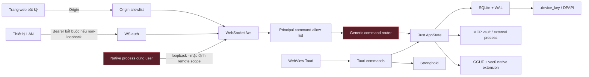
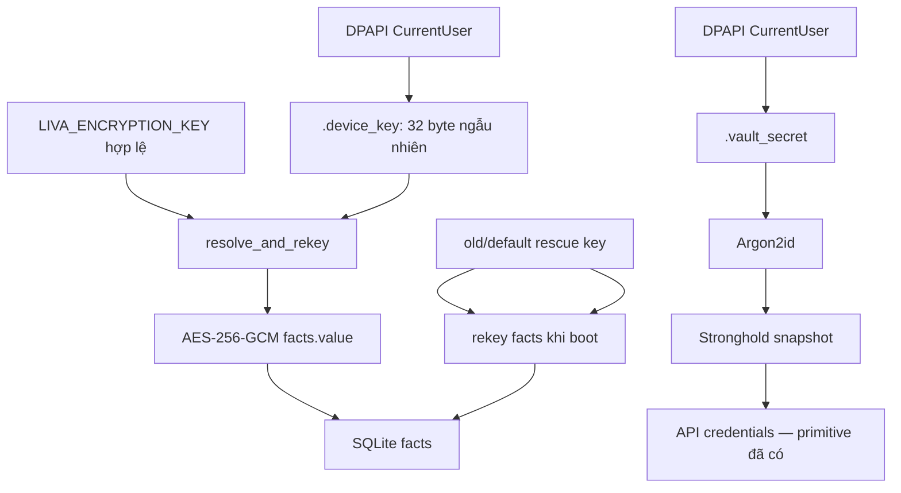

# Threat model — ranh giới tin cậy, mã hóa và kế hoạch hardening

[⬆ Mục lục](../README.md) · [Persistence](../03-he-thong-con/persistence.md) ·
[Action policy](action-policy.md) · [Master roadmap](../06-ke-hoach/roadmap.md)

## 1. Security posture hiện hành

LIVA hiện là ứng dụng local-first cho **một người dùng hệ điều hành đáng tin cậy**, không phải dịch
vụ LAN hoặc môi trường multi-user. Mô hình bảo vệ tốt nhất hiện có:

- trình duyệt web bị chặn bởi WebSocket Origin allowlist;
- WebSocket bind non-loopback bắt buộc Bearer token tối thiểu 32 byte;
- native process cùng máy mặc định chỉ nhận scope `WebSocketRemote`;
- fact value dùng AES-256-GCM; khóa DB Windows được DPAPI CurrentUser bảo vệ;
- Tauri Stronghold có secret riêng, cũng được DPAPI bảo vệ;
- đường dẫn MCP vault chống absolute path, `..` và symlink/junction escape;
- command Tauri/WebSocket đi qua principal allow-list fail-closed;
- query WebSocket tự khai `widget`/`dashboard` bị từ chối 403; scope đặc quyền chỉ được suy ra từ
  session ticket 256-bit, TTL 30 giây, dùng một lần do capability Tauri widget/dashboard cấp;
- widget/dashboard/setup có capability Tauri độc lập;
- CSP chỉ cho script/style bundle từ `self`, cấm object/base/frame và không còn inline asset;
- GGUF, mmproj và vec0 phải canonicalize trong trust root và khớp SHA-256 manifest nhúng;
- Telegram fail-closed khi allowlist ID rỗng;
- tool side effect có policy cục bộ và principal theo kênh, nhưng chưa có action ID/audit thống nhất.

Các giới hạn quan trọng:

- Bearer token non-loopback là shared secret, chưa phải device identity hay mTLS; session ticket
  đặc quyền chỉ hợp lệ trên loopback.
- `facts.value`, checkpoint và content của `conversation_turn` đã được mã hóa; config, contacts,
  tasks/events, vector embedding và nhiều metadata vẫn là plaintext.
- runner tên `Sandbox` chỉ chạy `cargo test` bằng quyền user trên host, không phải OS sandbox.

## 2. Tài sản, đối thủ và giả định

### 2.1 Tài sản cần bảo vệ

1. Lịch sử hội thoại, facts, checkpoint, danh bạ và hồ sơ người dùng.
2. API tokens, Stronghold snapshot, DB device key và recovery key.
3. Quyền gọi tool: file vault, messaging, model load, config, MCP process.
4. Integrity của model/DLL, config, SQLite và audit trail.
5. Microphone, transcript, screen/passive signals khi các capability tương lai được bật.

### 2.2 Đối thủ trong phạm vi

| Đối thủ | Khả năng | Phải phòng vệ |
|---|---|---|
| Trang web độc hại | mở WS từ browser, gửi command | có |
| Process native cùng user | mở loopback WS, đọc file user | **chưa** là ranh giới được bảo vệ |
| Thiết bị LAN | kết nối khi host bind ngoài loopback | có trước khi cho phép non-loopback |
| Prompt/tool input độc hại | chọn tool/path/model, làm lộ dữ liệu | có |
| Artifact/DLL bị thay | nạp native code hoặc model độc | có |
| Người có quyền admin/đọc profile OS | đọc RAM/file, hook process | ngoài bảo đảm tuyệt đối của app |
| Mất điện/crash | làm rách hoặc mất dữ liệu gần nhất | thuộc persistence threat |

### 2.3 Bất biến mục tiêu

- Secret không đi qua log, config plaintext, telemetry hoặc command response rộng.
- Mọi command có identity kênh, scope quyền và audit phù hợp rủi ro.
- Non-loopback mặc định bị từ chối nếu chưa cấu hình auth mạnh.
- Path/model/DLL chỉ được giải quyết dưới trust root canonical đã cấu hình bởi operator.
- Dữ liệu nhạy cảm có at-rest policy rõ, backup không tách rời key recovery.
- UI chỉ tuyên bố “đã mã hóa” khi đường ghi thực sự đi qua keystore.

## 3. Bản đồ ranh giới tin cậy

Principal/authorization baseline đã có: query không tự khai được scope, ticket đặc quyền chỉ do
Tauri exact-label cấp và dùng một lần trên loopback. Origin bảo vệ browser cross-site; Bearer bảo
vệ non-loopback. Loopback vẫn không phải security boundary trước malware/process khác cùng user,
và shared secret chưa phải device identity.

## 4. Mã hóa và quản lý khóa

### 4.1 DB field encryption

`liva-native-core/src/crypto.rs#EncryptionEngine::encrypt` dùng AES-256-GCM, HKDF-SHA256,
salt ngẫu nhiên 16 byte và IV ngẫu nhiên 16 byte. Format v2 giữ salt, IV, tag và ciphertext;
reader vẫn hiểu legacy v1.

`liva-native-core/src/crypto.rs#EncryptionEngine::try_decrypt` fail-closed. Fact/checkpoint/
conversation không giải mã được trở thành trạng thái locked hoặc bị bỏ khỏi recall, không trả
ciphertext như plaintext. Trước khi overwrite fact locked, DB giữ ciphertext tại
`facts_locked_backup`.

`liva-native-core/src/lib.rs#resolve_and_rekey` chọn khóa:

1. `LIVA_ENCRYPTION_KEY` khác giá trị mặc định;
2. in-memory DB dùng env/default;
3. on-disk Windows dùng `liva-native-core/src/keystore.rs#load_or_create_device_key`.

Device key được DPAPI CurrentUser seal, tạo bằng `create_new` và không overwrite key đã khóa.
Non-Windows phải cấp key qua môi trường. Cùng live key mã hóa `facts.value`,
`agent_checkpoints.state_json` và `vectors_meta.content` của `conversation_turn`.

Boot migration cứu plaintext/ciphertext khóa cũ bằng default key hoặc
`LIVA_ENCRYPTION_KEY_OLD`, giữ nguyên bản không khóa nào mở được, xóa FTS conversation legacy,
rồi `secure_delete` + truncate WAL + `VACUUM` trên DB đĩa. Quyết định và đánh đổi dense-only nằm
tại [ADR-001](../01-kien-truc/adr-001-ma-hoa-du-lieu-ca-nhan-beta.md).

### 4.2 Recovery key delivery

Khi sinh device key lần đầu, native binary và Tauri chỉ giao recovery key qua local modal
`show_message_box`; không còn ghi key ra stderr/log. Regression tests trong cả hai entry point chặn
việc đưa `escrow_message` trở lại `eprint!`. Modal chỉ xuất hiện khi `escrow_hex` tồn tại, tức một
lần lúc sinh key mới.

Khoảng trống còn lại: chưa có bước xác nhận người dùng đã cất key và chưa có secure export flow
được quản lý vòng đời.

Giá trị mặc định toàn số 0 không được chọn làm live write key cho on-disk DB, nhưng vẫn là rescue
key để rekey dữ liệu cũ. Phải có kế hoạch loại bỏ sau khi migration population được đo xong.

### 4.3 Stronghold

Các helper private đọc/ghi/xóa Stronghold dùng Stronghold trực tiếp. Password/salt
per-machine được DPAPI seal trong `.vault_secret`; Argon2id sinh key Stronghold. Migration từ khóa
legacy dùng file `.new`, verify rồi atomic rename; snapshot khóa không mở được sẽ được backup trước
khi reset.

Renderer chỉ thấy ba command theo mục đích:

- `vault_secret_present` trả boolean, không trả plaintext;
- `store_vault_secret` ghi write-only;
- `delete_vault_secret` xóa có chủ ý.

Namespace được allowlist và giới hạn 16 KiB. `AISettings.vue`/`ApiManagementView.vue` chỉ giữ input
thay thế trong RAM, xóa input sau save và không dựng `.env`. `get_config` redacts secret legacy;
`update_config` từ chối mọi secret field và hướng người gọi sang Stronghold.

## 5. Data-at-rest coverage

| Dữ liệu | At-rest hiện tại | Đánh giá |
|---|---|---|
| `facts.value` | AES-256-GCM per record | tốt trong phạm vi khóa user |
| `.device_key` | DPAPI CurrentUser | tốt trên Windows; one-time recovery dialog, còn thiếu confirmation UX |
| Stronghold secret/snapshot | DPAPI + Argon2id + Stronghold | UI write-only đã nối |
| `vectors_meta.content` của `conversation_turn` | AES-256-GCM per record | dense recall giải mã sau candidate selection |
| FTS của `conversation_turn` | không tồn tại | lexical-only recall bị bỏ để không lưu bản plaintext |
| `agent_checkpoints.state_json` | AES-256-GCM per record | sai khóa fail-closed |
| contacts/tasks/events | plaintext | metadata cá nhân |
| `liva-config.json` | plaintext | không được chứa secret |
| backup SQLite | online backup + manifest v2 SHA-256/key-ID + rollback | key lưu riêng; restore sai key-ID bị từ chối |

Quyết định kiến trúc tách hai mục tiêu:

- **secret storage**: Stronghold/keychain;
- **bulk personal data beta**: field encryption cho transcript/checkpoint, dense-only cho
  conversation; metadata còn lại là phạm vi hậu beta.

Không mã hóa mù mọi cột. [ADR-001](../01-kien-truc/adr-001-ma-hoa-du-lieu-ca-nhan-beta.md) ghi
phương án SQLCipher/OS/field encryption, tác động tìm kiếm, migration, backup và rollback.

## 6. Bề mặt tấn công

### 6.1 WebSocket command plane

`WebSocketServer::bind` mặc định loopback. Khi địa chỉ resolve thành non-loopback,
`auth_token_for_ip` bắt buộc `LIVA_WS_AUTH_TOKEN` gồm 32–4096 visible ASCII byte; thiếu/yếu làm bind
thất bại. HTTP upgrade phải có chính xác `Authorization: Bearer <token>`; token được so sánh
constant-time và không log. Sai/mất token nhận 401 trước khi vào command router.

Server vẫn chỉ chấp nhận `/ws`, giới hạn message/frame khoảng 1 MiB và gọi `origin_allowed`.
`OP_AUTH_HANDSHAKE` chỉ phản chiếu payload và không được mô tả là authentication. Query chứa
`principal=` bị từ chối 403 ngay trong HTTP handshake, kể cả loopback. Không có `session` thì
principal luôn là `WebSocketRemote`. Vỏ Tauri giữ `WebSocketSessionAuthority` trong native state;
chỉ command `issue_websocket_session` của capability widget/dashboard mới cấp vé ngẫu nhiên 32
byte. Server chỉ lưu SHA-256 của vé, xóa khi dùng, từ chối vé hết hạn/replay/khai báo lặp và không
chấp nhận session đặc quyền từ peer ngoài loopback. Bearer và Origin được kiểm trước khi tiêu thụ
vé. Legacy event và generic request đều đi qua cùng command allow-list.

Policy bắt buộc:

- bind mặc định `127.0.0.1` được giữ;
- nếu host không phải loopback mà thiếu auth key/certificate, boot phải fail;
- giữ TTL ngắn, single-use, giới hạn số vé chờ và chỉ cấp qua exact Tauri window capability;
- command registry khai báo scope, risk tier, payload limit và audit behavior.

### 6.2 Model path và native extension

`artifact_trust.rs` nhúng `data/models-manifest.json` vào binary làm trust anchor. Trước khi đưa
GGUF/mmproj vào llama.cpp, runtime canonicalize root và target, chặn traversal/junction escape,
đối chiếu đường dẫn tương đối với entry `llm` trong manifest rồi băm toàn file bằng SHA-256.
`llm:swap_model` và autoload dùng cùng verifier.

`vec0` chỉ còn candidate dưới compile-time dev root hoặc cạnh executable/`resources`; không dùng
cwd, relative path hay bare DLL search. Mỗi candidate được canonicalize và phải khớp SHA-256
`runtimeArtifacts.vec0` trước `load_extension`.

Phần còn mở: `ai.localModelsDir` vẫn là config có thể sửa; exact manifest hash ngăn nạp nội dung lạ,
nhưng một release cứng hơn nên tách operator-owned root khỏi product preference và giảm TOCTOU giữa
hash và native loader.

### 6.3 MCP vault và external MCP

`liva-native-core/src/mcp/server.rs#NativeMcpServer::resolve_path` có ba lớp:

1. chặn absolute/root/`..`;
2. lexical containment;
3. canonicalize tổ tiên gần nhất để chặn symlink/junction escape kể cả file chưa tồn tại.

Search walk bỏ symlink; test `mcp_vault_sandbox_escape.rs` bao phủ read/write escape. External MCP
mặc định `ProposeOnly`, danh sách server chỉ trả tên biến env chứ không trả giá trị.

Khoảng trống nằm ở caller identity và confirmation continuation, không phải path resolver. Xem
[Action policy](action-policy.md).

### 6.4 Tauri/WebView

`tauri.conf.json` chỉ cho `script-src 'self'` và `style-src 'self'`, đồng thời chặn
`object-src`, `base-uri` và `frame-ancestors`. `setup.html` và `wake-word-test.html` dùng asset
JS/CSS ngoài; progress động dùng thuộc tính DOM/class thay vì inline style. Installer validator quét
toàn bộ `public/*.html` và làm build đỏ nếu inline script/style quay lại.
Ba capability `widget.json`, `dashboard.json`, `setup.json` chỉ gán đúng một window. Widget/setup
không có vault, dialog hoặc process; dashboard không có command điều khiển widget. App commands
được khai báo trong `AppManifest` để Tauri ACL thực sự kiểm soát được.

`read_vault_key`/`write_vault_key` chỉ nhận namespace allow-list và secret tối đa 16 KiB. XSS vẫn
là rủi ro ứng dụng cần phòng thủ theo chiều sâu, nhưng inline execution đã bị CSP chặn và blast
radius tiếp tục bị giới hạn theo cửa sổ.

### 6.5 Telegram

`liva-native-core/src/telegram.rs#TelegramBotManager::new` dùng allowlist ID; allowlist rỗng nghĩa là
không ai được phép. Preflight cảnh báo token có mặt nhưng allowlist trống. Đây là default fail-closed
đúng, cần giữ khi thêm role/group policy.

### 6.6 Evolution “Sandbox”

`liva-native-core/src/evolution/sandbox.rs#Sandbox::run_tests` chạy `cargo test` trên host với quyền
filesystem/network/process của user. Nó chỉ có target dir riêng, timeout và kill process tree.
`SelfCorrectionLoop` không có production caller và module evolution nằm ngoài default build.

Không được mô tả cơ chế này là sandbox bảo mật. Chỉ được bật production sau khi có VM/container/
Windows Sandbox, network deny, read-only source, resource quota, patch provenance và human review.

### 6.7 HTTP tương thích OpenAI

`openai_api.rs` chỉ mở khi có `LIVA_OPENAI_PORT`; endpoint không có xác thực nội tại. Default tắt
và host nên giữ `127.0.0.1`. Nếu bind ra LAN, operator phải đặt reverse proxy TLS + token phía
trước; Bearer/session ticket của WebSocket **không** tự bảo vệ HTTP này. Memory từ API được tách
owner `openai_api`, nhưng tách scope dữ liệu không thay thế network authentication.

## 7. Risk register

| ID | Mức | Rủi ro | Trạng thái |
|---|---|---|---|
| S-P0-1 | vừa/cao | query không còn là identity; WS mặc định remote, principal đặc quyền chỉ từ session ticket do exact Tauri label/capability cấp | đã đóng |
| S-P0-2 | cao | credential UI đi Stronghold write-only; config reject/redact secret | đã đóng |
| S-P0-3 | cao | recovery key không còn đi stderr/log | đã đóng |
| S-P0-4 | cao | bulk hội thoại/checkpoint plaintext trong DB/WAL | đã đóng mức beta bằng ADR-001 + byte-level tests |
| S-P1-1 | vừa | model canonical + manifest hash đã chốt; config root vẫn sửa được và còn TOCTOU path loader | một phần |
| S-P1-4 | cao nếu bind LAN | OpenAI-compatible HTTP không auth; default tắt/loopback | một phần — cần reverse proxy hoặc auth native trước khi hỗ trợ LAN |
| S-P1-2 | cao | vec0 chỉ nạp từ trust root canonical và đúng manifest hash | đã đóng |
| S-P1-3 | vừa/cao | capability Tauri đã tách và vault key có allowlist | đã đóng |
| S-P1-4 | vừa | CSP self-only; toàn bộ public HTML có regression gate cấm inline | đã đóng |
| S-P2-1 | nghiêm trọng nếu bật | evolution runner không OS isolation | dormant |
| S-P2-2 | vừa | secret file ignore policy lệch giữa `.gitignore` và `.aiexclude` | mở |

## 8. Kế hoạch hardening

### S0 — Truthful credential path — hoàn tất 2026-07-30

- Gỡ mọi secret khỏi config schema và response `get_config`.
- UI chỉ gọi `present/store/delete`; không có command trả plaintext secret.
- Allowlist namespace (`openai/api_key`, `telegram/token`, …), giới hạn kích thước và xóa có chủ ý.
- Không dựng/xuất `.env` chứa secret trong frontend.
- Gate: quét config/log/IPC trace không thấy canary secret; restart vẫn dùng được Stronghold.

### S1 — Identity và command authorization — hoàn tất baseline 2026-07-31

- Đã định nghĩa principal Tauri widget/dashboard/setup, WebSocket widget/dashboard/remote, CLI
  local, Telegram và test; dispatcher fail-closed theo command allow-list.
- Tauri principal lấy từ exact window label; WebSocket query không thể tự khai identity.
- WebSocket không có session là remote; `?principal=widget|dashboard` bị handshake từ chối 403.
- Widget/dashboard có thể xin session ticket 256-bit qua command Tauri riêng; setup/label lạ bị
  từ chối. Vé chỉ dùng trên loopback, TTL 30 giây, dùng một lần và server chỉ giữ digest.
- Widget production xin ticket mới trước mỗi kết nối/reconnect và chỉ mở socket sau khi kiểm token
  64 ký tự hex; component regression test khóa URL `?session=…`.
- Non-loopback fail bind nếu thiếu Bearer token mạnh; integration test khóa 401 và exact-token path.
- Audit correlation ID và redact payload nhạy cảm vẫn là hardening kế tiếp.
- Gate: negative tests từng principal; replay/expired/self-declared/non-loopback session, browser
  evil Origin, native client không token và LAN đều bị chặn.

### S2 — At-rest ADR và key lifecycle — hoàn tất baseline beta 2026-07-31

- ADR-001 chọn field encryption cho hội thoại + checkpoint; conversation recall dùng dense-only.
- Recovery key chỉ hiện one-time trong secure UI; không log; có kiểm tra người dùng đã lưu.
- Backup manifest v2 gắn key-ID; restore kiểm compatibility trước khi đụng target nhưng không
  nhúng key.
- Đo và kết thúc đường rescue default key.
- Gate đã xanh: raw DB/WAL và backup không chứa canary; restore sai key-ID giữ target nguyên,
  đúng recovery key đọc lại được payload.

### S3 — Artifact và path trust — hoàn tất baseline 2026-07-31

- Đã canonicalize root + target cho model và native extension.
- Đã nhúng trust manifest vào binary; GGUF/mmproj/vec0 lệch SHA-256 bị từ chối.
- Đã bỏ DLL bare-name/cwd và có traversal/junction/tamper negative tests.
- Còn hardening hậu beta: operator-owned root bất biến và giảm TOCTOU path loader.

### S4 — Least privilege desktop — hoàn tất baseline 2026-07-31

- Đã tách capability theo widget/dashboard/setup; widget/setup không có vault/dialog/process.
- Vault command chỉ nhận namespace key allow-list, không raw arbitrary key.
- Đã loại `'unsafe-inline'`; HTML ship chỉ tham chiếu JS/CSS tĩnh và có regression test.
- Gate: mỗi cửa sổ có negative permission suite.

### S5 — Audit, redaction và response

- Structured audit cho config/tool/vault/model/messaging, không log secret hoặc nội dung đầy đủ mặc định.
- Central redaction cho tracing/error/UI diagnostics.
- Secret scan đồng bộ `.gitignore`, `.aiexclude`, release bundle và CI.
- Runbook rotate key, Stronghold reset, lost device key, suspicious WS và corrupted backup.
- Gate: canary-secret test xuyên log, crash report, support bundle và exported diagnostics.

## 9. Security acceptance gate cho beta

- [x] UI credential dùng Stronghold thật và không còn plaintext fallback.
- [x] Recovery/device key không đi qua stderr hoặc log.
- [x] Gateway loopback-only hoặc có authentication bắt buộc.
- [x] Command được scope theo principal; negative tests chứng minh quyền dư bị từ chối.
- [x] Session WebSocket đặc quyền ngắn hạn, single-use và chỉ được cấp từ capability Tauri tin cậy.
- [x] Model/DLL chỉ nạp từ trust root canonical + manifest.
- [x] Data-at-rest ADR được chấp thuận và triển khai cho transcript/checkpoint theo mức beta.
- [x] Capability Tauri tách theo cửa sổ.
- [x] CSP không còn inline script/style.
- [x] Backup/restore và key recovery được diễn tập cùng nhau.
- [x] “Sandbox” không được nối production trước OS isolation (feature `experimental`, không có
  production caller; chỉ compile-check).

Tài liệu đánh giá rủi ro cũ là bằng chứng lịch sử. Khi kết luận cũ khác tài liệu này, mã nguồn/test
tại commit nêu trong frontmatter và threat model này là nguồn chuẩn hiện hành.
