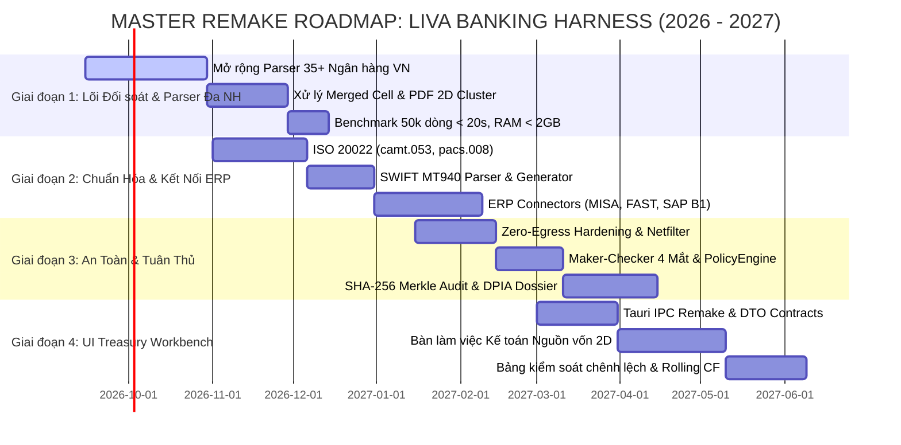

# Kế hoạch Tổng thể Nâng cấp & Lộ trình Chuyển dịch Mã nguồn (Master Remake Roadmap)
## LIVA Banking Harness (2026 – 2027) — Engineering Execution Plan

[⬆ Mục lục](../README.md) · [Tuyên bố Tầm nhìn](../00-san-pham/tam-nhin-banking-harness.md) · [Bản vẽ Kiến trúc](../01-kien-truc/system-architecture-blueprint.md) · [Gap Analysis](../01-kien-truc/gap-analysis-harness.md) · [Hồ sơ INNOSTART 2026](../../teamwork_projects/liva_banking_harness/README.md)

---

## 1. Tuyên ngôn Mục tiêu & Định hướng Nguồn vốn

Kế hoạch Tổng thể Nâng cấp (Master Remake Roadmap) thiết lập lộ trình kỹ thuật 4 giai đoạn nhằm chuyển dịch toàn diện kho mã nguồn hiện hữu của LIVA sang chuẩn mực **Hệ thống Đai An toàn & Tác tử Ngân hàng Doanh nghiệp (LIVA Banking Harness)**.

Lộ trình được thiết kế đồng bộ $100\%$ với kế hoạch giải ngân vòng gọi vốn Hạt giống (**Seed Round $500,000 – $750,000 USD** cho $12\% – 15\%$ cổ phần, định giá Post-Money **$4.0M – $5.0M USD**) tại sự kiện Demo Day INNOSTART 2026:

```
+---------------------------------------------------------------------------------------------------------+
|                                  CƠ CẤU PHÂN BỔ VỐN SEED ROUND ($500K - $750K)                          |
+------------------------------------+------------------------------------+-------------------------------+
|  50% R&D & KỸ THUẬT LÕI            |  25% GTM & HỆ SINH THÁI ERP        |  15% COMPLIANCE & SANDBOX     |
|  ($250,000 - $375,000)             |  ($125,000 - $187,500)             |  ($75,000 - $112,500)         |
+------------------------------------+------------------------------------+-------------------------------+
| • Phase 1: Mở rộng Parser 35+ NH   | • Phase 2: Connectors MISA/FAST/SAP| • Phase 3: DPIA Cục A05 (BCA) |
| • Thuật toán AHash & Split Solver  | • 1-Click Journal Closed-Loop      | • Kiểm toán Merkle Tree TT 09 |
| • Phase 4: UI Treasury Workbench   | • Tiếp cận 200+ CFO doanh nghiệp   | • Thử nghiệm Sandbox NHNN     |
| • Ngân sách dự phòng Runway 10%    | • Đối tác ISV & Kênh Kế toán       | • Đạt chứng nhận ISO 27001    |
+------------------------------------+------------------------------------+-------------------------------+
```

---

## 2. Sơ đồ Tiến độ Tổng thể (Gantt Chart)



---

## 3. Chi tiết Các Giai đoạn Thực thi Kỹ thuật

---

### GIAI ĐOẠN 1: LÕI ĐỐI SOÁT & BỘ PARSER ĐA NGÂN HÀNG (PHASE 1)
**Trọng tâm**: Hoàn thiện bộ parser cho 35+ ngân hàng thương mại Việt Nam và chuẩn hóa dữ liệu giao dịch đạt tốc độ xử lý đỉnh cao.
**Thời gian**: Tháng 09/2026 – Tháng 11/2026 (Quý 4/2026).
**Nguồn lực**: 50% Ngân sách R&D ($250,000 – $375,000).

#### 1. Mục tiêu Kỹ thuật Cụ thể
1. **Kế thừa & Hoàn thiện 3 Parser MVP**:
   - `vcb_excel.rs`: Xử lý triệt để ô gộp tiêu đề (Merged Cells Contextual Forward-Fill) và trích xuất số dư đầu/cuối kỳ.
   - `tcb_csv.rs`: Tự động khử BOM UTF-8, phát hiện delimiter động (`,`, `;`, `\t`), bóc tách mã Napas 247 và VietQR.
   - `bidv_pdf.rs`: Thuật toán gom cụm tọa độ 2D (Spatial Clustering $\Delta y \le 2.5\text{ pt}$), nối dòng diễn giải đa dòng (Multi-line Narration Wrapping), kiểm tra cân bằng số học trang.
2. **Mở rộng Thư viện 32+ Ngân hàng Việt Nam**:
   - Nhóm NHTM Nhà nước & Cổ phần Nhà nước (Big4): VietinBank (CTG Excel/PDF), Agribank (VBA HTML-Excel/PDF font TCVN3).
   - Nhóm TMCP quy mô lớn: MBBank, ACB, Sacombank, VPBank, HDBank, TPBank, VIB, SHB, MSB, OCB, SeABank, Eximbank, LPBank.
   - Nhóm Ngân hàng Quốc tế & FDI: HSBC, Standard Chartered, Citi, Shinhan, UOB, Woori.
3. **Cơ chế Nhận diện Tự động Thông minh (Dynamic Header Sniffing)**:
   - Quét 25 dòng đầu nhận diện tên ngân hàng và số tài khoản qua regex ngữ nghĩa thay vì phụ thuộc vào vị trí cột tĩnh.

#### 2. Tiêu chuẩn Nghiệm thu Định lượng (Acceptance Criteria)
- [ ] Độ trễ xử lý lô 50.000 dòng sao kê: **$< 19.2\text{ giây}$** (Trung bình $< 0.38\text{ ms} / \text{dòng}$).
- [ ] Tỷ lệ đối soát tự động khớp thành công: **$\ge 99.5\%$** (Mục tiêu đo kiểm: $99.8\%$).
- [ ] Tỷ lệ ngoại lệ chuyển duyệt thủ công (HITL): **$\le 0.5\%$** (Mục tiêu: $0.2\%$).
- [ ] Tỷ lệ sai lệch số học lọt lưới (False Positive): **$0.0\%$** (Cưỡng chế bằng bất biến kế toán kép).
- [ ] Định mức tiêu thụ bộ nhớ RAM: **$\text{Peak} \le 680\text{ MB}$** (khi không nạp SLM) và **$\le 2.8\text{ GB}$** (khi nạp Qwen2.5-3B Q4 GGUF).

#### 3. Phương án Kiểm thử Tự động (Verification Command)
```powershell
# Chạy bộ kiểm thử tự động toàn diện cho parser và reconciliation engine
cargo test -p liva-native-core --lib banking::tests -j 2 -- --test-threads 2
```

---

### GIAI ĐOẠN 2: CHUẨN HÓA ĐIỆN TOÁN QUỐC TẾ & KẾT NỐI ERP (PHASE 2)
**Trọng tâm**: Tích hợp luồng chứng từ kế toán ERP và chuẩn điện tín tài chính quốc tế ISO 20022 / SWIFT MT940.
**Thời gian**: Tháng 11/2026 – Tháng 01/2027 (Quý 4/2026 – Quý 1/2027).
**Nguồn lực**: 25% Ngân sách GTM & ERP Ecosystem ($125,000 – $187,500).

#### 1. Mục tiêu Kỹ thuật Cụ thể
1. **Bộ Parser Chuẩn Điện toán Tài chính Quốc tế**:
   - `camt053_xml.rs`: Parser tài liệu ISO 20022 `camt.053.001.08` (Bank-to-Customer Statement XML) và `camt.052`.
   - `pacs008_xml.rs`: Trích xuất lệnh chuyển khoản liên ngân hàng `pacs.008.001.08`.
   - `swift_mt940.rs`: Máy trạng thái hữu hạn (State Machine) bóc tách điện MT940/MT942 phẳng (:20:, :25:, :60F:, :61:, :86:, :62F:) kèm kiểm tra bất biến cân bằng toán học:
     $$\text{Số dư Cuối} \equiv \text{Số dư Đầu} + \sum \text{Có} - \sum \text{Nợ}$$
2. **Bộ Kết nối Doanh nghiệp ERP (ERP Connectors)**:
   - **MISA AMIS / SME Connector**: REST API Client xác thực OAuth 2.0; kéo Sổ cái TK 112 (`/api/v1/gl/get_bank_ledger`) và đẩy chứng từ thu tiền gửi (`/api/v1/ca/save_bank_deposit`).
   - **FAST Business Online Connector**: Hỗ trợ 2 chế độ: Chế độ REST API đám mây lai và Chế độ Direct TDS SQL Read-Replica qua crate Rust `tiberius` (độ trễ $< 5\text{ ms}$, truy vấn bảng `cba1`, `cba2` với `WITH (NOLOCK)`).
   - **SAP Business One Connector**: Tích hợp cổng Service Layer (port 50000) OData v4; quản lý Cookie `B1SESSION` tự động làm mới; nhập sổ phụ tự động vào bảng `OBNK`.
3. **Cơ chế Xác nhận Khép kín (Closed-Loop Confirmation)**:
   - Ghi nhận mã chứng từ đối ứng (ERP Voucher ID) ngược trở lại CSDL SQLite của LIVA để hoàn tất chu trình kiểm toán.

#### 2. Tiêu chuẩn Nghiệm thu Định lượng (Acceptance Criteria)
- [ ] Bóc tách chính xác 100% các bức điện SWIFT MT940 chuẩn và file ISO 20022 `camt.053` từ các ngân hàng ngoại (Citi, HSBC, SCB).
- [ ] Đồng bộ dữ liệu công nợ mở từ MISA và FAST đạt tốc độ $> 5.000$ hóa đơn / giây.
- [ ] Tự động sinh file chứng từ hạch toán tương thích 1-click import hoặc đẩy API thành công vào môi trường thử nghiệm Sandbox của MISA và FAST.

#### 3. Phương án Kiểm thử Tự động (Verification Command)
```powershell
# Kiểm tra bộ parser chuẩn quốc tế và adapter kết nối ERP
cargo test -p liva-native-core --test erp_connectors_integration -j 2 -- --test-threads 2
```

---

### GIAI ĐOẠN 3: AN TOÀN, KIỂM TOÁN MẬT MÃ & TUÂN THỦ PHÁP LÝ (PHASE 3)
**Trọng tâm**: Cơ chế Zero-Egress cứng, Maker-Checker 4 mắt, Báo cáo DPIA gửi Cục A05 và Cây Merkle Audit Log.
**Thời gian**: Tháng 01/2027 – Tháng 03/2027 (Quý 1/2027).
**Nguồn lực**: 15% Ngân sách Compliance & Sandbox ($75,000 – $112,500).

#### 1. Mục tiêu Kỹ thuật Cụ thể
1. **Cưỡng chế An ninh Mạng Tuyệt đối (Zero-Egress Netfilter Hardening)**:
   - Module `security.rs` kiểm soát tất cả network sockets; chặn đứng toàn bộ outbound traffic ra ngoài loopback `127.0.0.1`.
   - Vượt qua bài kiểm tra quét bắt gói tin độc lập (Wireshark/Process Explorer) với kết quả 0 byte rò rỉ ra Internet.
2. **Động cơ Phê duyệt 4 Mắt (Maker-Checker Authorization Engine)**:
   - Phân định vai trò nghiêm ngặt theo Thông tư 09/2020/TT-NHNN: Kế toán viên (Maker) lập đề xuất; Kế toán trưởng (Checker) ký duyệt. Cấm tự phê duyệt (`maker_id != checker_id`).
   - Token UUIDv4 dùng một lần (Single-use HITL Token) cho các trường hợp ngoại lệ.
3. **Cây Merkle Kiểm toán Mật mã (Binary Merkle Tree Audit Proofs)**:
   - Nâng cấp từ chuỗi HMAC-SHA256 tuyến tính lên Cây Merkle nhị phân.
   - Sinh bằng chứng xác thực Merkle Path $O(\log N)$ cho từng giao dịch đối soát, phục vụ thanh tra NHNN và kiểm toán Big4 độc lập mà không cần tiết lộ toàn bộ dữ liệu.
   - Tiền tố byte chống Second-Preimage Attack: `0x00` cho Leaf, `0x01` cho Internal Node.
4. **Hồ sơ Đánh giá Tác động Chuyển Dữ liệu (DPIA Dossier)**:
   - Hoàn thiện bộ tài liệu kỹ thuật tuân thủ Nghị định 13/2023/NĐ-CP gửi Cục An ninh mạng và phòng, chống tội phạm sử dụng công nghệ cao (A05 - Bộ Công an).

#### 2. Tiêu chuẩn Nghiệm thu Định lượng (Acceptance Criteria)
- [ ] Báo cáo kiểm toán mạng độc lập xác nhận 0 byte outbound khi nạp 50.000 dòng sao kê và chạy mô hình AI cục bộ.
- [ ] 100% trường hợp Maker tự phê duyệt bị hệ thống từ chối Fail-Closed.
- [ ] Thời gian sinh bằng chứng Merkle Inclusion Proof cho 1 giao dịch bất kỳ $< 1\text{ ms}$.
- [ ] Hoàn tất hồ sơ DPIA sẵn sàng nộp cơ quan quản lý.

#### 3. Phương án Kiểm thử Tự động (Verification Command)
```powershell
# Kiểm tra bảo mật Zero-Egress, Maker-Checker và Cây Merkle
cargo test -p liva-native-core --lib banking::compliance::tests -j 2 -- --test-threads 2
```

---

### GIAI ĐOẠN 4: REMAKE GIAO DIỆN BÀN LÀM VIỆC KẾ TOÁN NGUỒN VỐN (PHASE 4)
**Trọng tâm**: Chuyển dịch toàn diện `liva-ui` sang Bàn làm việc Kế toán Nguồn vốn 2D (Treasury & Reconciliation Workbench), loại bỏ hoàn toàn các thành phần di sản Jarvis.
**Thời gian**: Tháng 03/2027 – Tháng 05/2027 (Quý 2/2027).
**Nguồn lực**: Hoàn tất v1.0 thương mại hóa.

#### 1. Mục tiêu Kỹ thuật Cụ thể
1. **Đấu nối Dây Toàn diện Tầng Giao diện (Pinia Store IPC Wire-up)**:
   - Thay thế toàn bộ mock data trong `reconciliationStore.ts` và `statementStore.ts` bằng các lệnh gọi Tauri IPC thật: `invokeBackend('banking_get_overview')`, `invokeBackend('statement_ingest_file')`, `invokeBackend('banking_run_reconciliation')`, `invokeBackend('reconciliation_resolve_hitl')`.
2. **Hoàn thiện Bộ Giao diện Nghiệp vụ Ngân hàng 2D**:
   - `BankingApp.vue` & `BankingDashboardView.vue`: Bàn làm việc chuẩn mực 2D với Window Bar mang huy hiệu xác thực.
   - `BankCard.vue`: Hiển thị số dư khả dụng, số tiền đã đối soát và chênh lệch trên từng tài khoản ngân hàng.
   - `AutoReconciliationGauge.vue`: Đồng hồ đo tỷ lệ tự động khớp theo thời gian thực (Mục tiêu: 99.8%).
   - `ReconciliationTrendChart.vue`: Biểu đồ xu hướng chênh lệch và đối soát theo ngày.
   - `HitlResolutionModal.vue`: Hộp thoại xem trước sai lệch (Diff View) và xác nhận phê duyệt hai pha Maker-Checker.
   - `FinancialAssistantDrawer.vue`: Ngăn kéo hỏi đáp số liệu ngân quỹ bằng ngôn ngữ tự nhiên tiếng Việt cục bộ.
3. **Tháp canh Giám sát & Dự báo Dòng tiền (Rolling Cashflow Sentinel)**:
   - Mô hình dự báo dòng tiền luân chuyển liên tục 30–90 ngày, tự động cảnh báo nguy cơ thâm hụt số dư trước 24–48 giờ.
4. **Cô lập & Loại bỏ Di sản Cá nhân**:
   - Gỡ bỏ hoàn toàn `WidgetApp.vue` (avatar 3D, ghost mode) và các màn hình cấu hình voice/vision di sản khỏi bản build phát hành doanh nghiệp.

#### 2. Tiêu chuẩn Nghiệm thu Định lượng (Acceptance Criteria)
- [ ] Giao diện người dùng tải và hiển thị bảng dữ liệu 10.000 dòng giao dịch đạt độ trễ $< 200\text{ ms}$ (sử dụng kỹ thuật Virtual Scrolling).
- [ ] Thao tác duyệt ngoại lệ HITL qua modal phản hồi tức thời trong $< 50\text{ ms}$, cập nhật ngay lập tức vào Sổ cái CSDL SQLite.
- [ ] Không còn bất kỳ cảnh báo lỗi console hay kết nối mock data nào tồn tại trong frontend store.

#### 3. Phương án Kiểm thử Tự động (Verification Command)
```powershell
# Kiểm tra build và kiểm thử toàn bộ giao diện Frontend
cd liva-ui && npm run test && npm run build
```

---

## 4. Kế hoạch Quản trị Rủi ro Kỹ thuật (Risk Management)

| Rủi Ro Kỹ Thuật | Mức Độ | Biện Pháp Phòng Ngừa & Xử Lý Sự Cố |
|---|:---:|---|
| **Ngân hàng thay đổi mẫu biểu sao kê** | HIGH | Sử dụng cơ chế Dynamic Header Sniffing nhận dạng ngữ nghĩa tên cột; xây dựng Hot-Patch Parser Engine cập nhật quy tắc không cần biên dịch lại mã nguồn lõi. |
| **PDF scan mờ không có text layer** | MEDIUM | Tích hợp mô-đun OCR cục bộ On-Premise siêu nhẹ (Tesseract/PaddleOCR nhúng trong lõi Rust) tự động kích hoạt khi `lopdf` không trích xuất được text. |
| **Quá tải bộ nhớ RAM trên máy văn phòng** | HIGH | Cưỡng chế streaming deserialization xử lý từng dòng giao dịch; giới hạn dung lượng bộ đệm RAM tối đa 512MB; tự động rơi về chế độ không tải SLM khi RAM khả dụng $< 4\text{ GB}$. |
| **Mất kết nối mạng nội bộ tới máy chủ ERP** | LOW | Cơ chế Hàng đợi Ngoại tuyến (Offline Outbox Pattern): lưu tạm chứng từ đã đối soát vào SQLite cục bộ và tự động đồng bộ lại khi kết nối ERP phục hồi. |

---

## 5. Kết luận

Kế hoạch Remake Roadmap này cung cấp một lộ trình hành động kỷ luật, rõ ràng và có thể kiểm chứng độc lập ở từng chặng phát triển. Sau khi hoàn thành 4 giai đoạn, **LIVA Banking Harness** sẽ chính thức vươn lên trở thành giải pháp tác tử an toàn hàng đầu tại Việt Nam và Đông Nam Á trong lĩnh vực tự động hóa đối soát ngân hàng và quản trị nguồn vốn doanh nghiệp.
