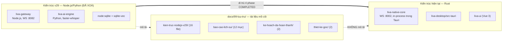

# ⚠️ THƯ MỤC LƯU TRỮ — KHÔNG DÙNG LÀM TÀI LIỆU THAM CHIẾU

> **CẢNH BÁO**
>
> **Mọi tài liệu trong `docs/99-luu-tru/` KHÔNG mô tả code hiện tại của LIVA.**
>
> Phần lớn chúng mô tả một hệ thống **Node.js / TypeScript đã bị xoá khỏi repo** (`liva-gateway`, `openclaw-gateway`, `liva-ai-engine`, `node:sqlite`, `ts-morph`, `isolated-vm`, `onnxruntime-node`, WebSocket cổng **8082**). Kiểm chứng bằng `ls`: **không tồn tại** `openclaw-gateway/`, `liva-gateway/`, `liva-ai-engine/`. Grep các symbol chủ đạo của bộ tài liệu này (`CoreKernel|AgentLoop|ZMASGuard|LACPProtocol|ASTCodeSurgeon|MicroVMDaemon|ModelOrchestrator|SemanticRouter|ConsolidationCron|VRAMGuard`) cho **22 file khớp, KHÔNG file nào là mã Rust đang chạy** — file Rust duy nhất khớp là `db.rs` và chỉ ở chuỗi `personality_state`.
>
> Chúng được giữ lại **chỉ để tham chiếu lịch sử**: hiểu ý đồ thiết kế gốc, truy nguyên vì sao một bảng SQL hay một tên hàm lại tồn tại, và đối chiếu "tuyên bố vs thực tế".
>
> **Nguyên tắc bắt buộc khi đọc thư mục này:**
> 1. **KHÔNG** trích số liệu, tên module, hay cổng mạng từ đây vào tài liệu/báo cáo/hồ sơ dự thi.
> 2. **KHÔNG** coi bất kỳ mô tả nào ở đây là "đã kiểm chứng" — mọi thứ đã kiểm chứng nằm ở `docs/01-ban-ve/`, `docs/02-van-hanh/`, `docs/03-danh-gia/`.
> 3. Khi cần biết code thật làm gì, đọc **code thật** hoặc bộ tài liệu mới, không đọc thư mục này.

---

## 1. Vì sao tồn tại thư mục này

LIVA đã trải qua một cuộc di trú kiến trúc lớn: từ kiến trúc **ba tiến trình Node.js + Python** (`liva-gateway` + `liva-ai-engine` + UI) sang **một lõi Rust duy nhất** (`liva-native-core`) nhúng in-process vào vỏ Tauri v2. Kế hoạch di trú (`ke-hoach-da-hoan-thanh/LIVA_NATIVE_MIGRATION_PLAN.md`) ghi cả 4 phase **COMPLETED**, và mã Node/Python cũ đã bị xoá.

Toàn bộ tài liệu thiết kế viết cho kiến trúc cũ **không bị xoá theo** — chúng bị dồn vào đây. Mốc thời gian đóng băng: 7 file `kien-truc-nodejs-v29/0X_*.md` sửa lần cuối **30/05/2026**, `codebase_architecture.md` **31/05/2026 (nhãn v26)** — tức bản vẽ đã đứng yên **khoảng hai tháng** so với thời điểm khảo sát.

---

## 2. `kien-truc-nodejs-v29/` — 16 file · **toàn bộ LỖI THỜI**

Bộ bản vẽ "v29 Enterprise-Ready Cognitive OS". Đây là phần nguy hiểm nhất của thư mục lưu trữ: văn phong tự tin, đầy số liệu, nhưng mô tả hệ thống **không tồn tại**.

| File | Viết khi nào | Mô tả cái gì | Vì sao lỗi thời | Thay thế bởi |
|---|---|---|---|---|
| `01_System_Overview.md` | 30/05/2026 | Triết lý **Hybrid Intelligence**; 4 nguyên tắc (Trí Tuệ Lai, Zero-Leak & Zero-VRAM, Ghost Mode, Micro-Services In-Process); **5 trụ cột** (Preemptive VRAM Yielding, Semantic Action Cache L0.5 `<5 ms`, Wake-Word Edge Offloading, On-Demand Zero-Trust Vision, Sequential Hot-Swap Router 4B ↔ Expert 26B với Expert Cooldown TTL 120–180 s); 6 khu vực Gateway; giao tiếp kép **UI↔Gateway WS 8082** + **Gateway↔Engine gRPC** | Port thật là **8002**, **không có tầng gRPC nào**. `ModelOrchestrator`, `EmbeddingWorker` không tồn tại trong Rust. `:20` định tuyến inference sang **Cloud API** khi có game, `:33` gửi frame màn hình lên **Cloud Vision** — trái hẳn định hướng offline hiện tại (governor xử lý game-aware **cục bộ**, vision đã sang **Qwen3-VL-2B local**) | [`../01-ban-ve/01-kien-truc-tong-the.md`](../01-ban-ve/01-kien-truc-tong-the.md) · [`../01-ban-ve/00-tong-quan-he-thong.md`](../01-ban-ve/00-tong-quan-he-thong.md) |
| `02_Memory_Subsystem.md` | 30/05/2026 | **H-MEM v18**: sơ đồ L0→L3 (`TurboQuantStore` memCache 200 msgs → `EventRepository` → `VectorRepository` INT8 Hybrid RRF → `PersonalKnowledge` + Ebbinghaus Decay). Debounced Memory Touch (queue 1000, early flush 900, xả 15 s); RRF `Score = Σ 1/(60 + Rank)`; decay `S(t) = S₀ × e^(−λ × days_since_access)`, xoá ký ức `strength < 0.1`. **Sáu daemon**: `SemanticRouter`, `ReflectionDaemon` (debounce 12 s), `ConsolidationCron` (idle 30 phút, battery throttling ×5, RAPTOR Tree, Reconsolidation, Dynamic Taxonomy, WAL Checkpoint + `VACUUM INTO`), `ContradictionResolver` (cosine > 0.85 → `obsolete = 1`), `ArchivingCron` (24 h, >30 ngày & `access_count ≤ 2` → `.jsonl`), `SemanticCache` (500 câu, Levenshtein ≥ 0.95) | **Một phần schema có thật**: `turn_layer_nodes` + `idx_turns_temporal` (`db.rs:243,249`), `vectors_fts USING fts5` (`db.rs:318`), `vec_idx USING vec0(embedding int8[384])` (`db.rs:348`) — INT8 384 chiều đúng thiết kế. Nhưng **không grep thấy** `AXIOM`/`ANCHOR` hay bất kỳ tên nào trong 6 daemon ở mã Rust ⇒ tầng logic là bản vẽ, không phải code | [`../03-danh-gia/00-bao-cao-khao-sat-goc-2026-07.md`](../03-danh-gia/00-bao-cao-khao-sat-goc-2026-07.md) (chương tầng dữ liệu & bộ nhớ) · các bản vẽ trong [`../01-ban-ve/`](../01-ban-ve/) |
| `03_Agent_Control_Flow.md` | 30/05/2026 | State machine `AgentLoop` 4 pha **IDLE → THINKING → ACTING → REFLECTING**; **LACP** (2-Phase Commit, JWS + AES-256-GCM HMAC, `lru-cache` TTL chống Zombie Transaction); `SkillCircuitBreaker` (3 lần fail → OPEN → `PromptBuilder` gỡ mô tả Skill khỏi System Prompt); Preemptive VRAM Mutex bằng `AbortController`; **Two-Stage Barge-in** (Silero `speech_start` → hạ TTS xuống **20%** chứ không ngắt; rồi `BackchannelDetector` phân loại "ừm/ok" vs lời thật); **Latency Masking** filler tiếng Việt khi hot-swap 5–15 s | `agent/state.rs` chỉ có `pub struct AgentState` (dòng 6) — **không có enum trạng thái nào**; máy trạng thái 4 pha **không tồn tại trong lõi Rust**. Thứ tương ứng thật là `governor.rs` với `GovernorMode` — tên và API **hoàn toàn khác** bản vẽ. LACP tự tài liệu viết ở **thì tương lai** | [`../03-danh-gia/00-bao-cao-khao-sat-goc-2026-07.md`](../03-danh-gia/00-bao-cao-khao-sat-goc-2026-07.md) (chương hệ agent + chương đường ống thoại) |
| `04_Evolution_Singularity.md` | 30/05/2026 | Pipeline DAG 5 bước (Planning → Coding `AIScientist` → AST Surgery → Sandboxing → Rollback/Commit); `ASTCodeSurgeon` (`ts-morph`), `MicroVMDaemon` (`isolated-vm`/WASI, boot `<1 ms`, `<15 MB` RAM), `RollbackManager` (`.src.rollback.bak`), `GitNexus Dual System`; **Sáu Pha Sinh Tồn** (Phân Lập → Thẩm tra Mục Tiêu → AST Patch Generation với **Luật Anti-Structural Hallucination** → Merge & Verification `npx tsc --noEmit` + Vitest → Feedback Loop tối đa 3 vòng → Checkpoint & Distillation); 4 Guardrails (`MAX_ITERATIONS = 5`, `300 000 ms`, MicroVM Air-Gap, `jsonrepair`) | **Lỗi cấu trúc ngay trong file**: đánh số mục trùng (mục 5 → nhảy về mục 2 → mục 3) ⇒ đây là **hai tài liệu bị ghép nối chưa biên tập**, văn phong nửa sau khác hẳn. Repo Rust có `src/evolution/` với **đúng 2 file** — không `ts-morph`, không `RollbackManager`, không DAG 6 pha. Toàn bộ hạ tầng mô tả là TypeScript | [`../03-danh-gia/00-bao-cao-khao-sat-goc-2026-07.md`](../03-danh-gia/00-bao-cao-khao-sat-goc-2026-07.md) (chương agent/bộ nhớ/tiến hoá) |
| `05_Security_Guardrails.md` | 30/05/2026 | Mở đầu nói "**3 cổng Guardrails**" nhưng liệt kê **5 mục**: Secure Credential Vault (AES-256-GCM + salt → `liva_vault.json`, tự xoá khỏi `.env`, Master Key qua Keychain OS); Zero-Leak Guard (cấm Sync I/O ở Main Thread, `withSafeTimeout`, `Map` → `LRUCache`); `ZMAS_Guard` (quét 100% output LLM, chặn `rm -rf`/`DROP TABLE`); Sensory Anti-Injection (`sanitizeSensoryData()` chặt **2000 ký tự**, bóc `<script>`, mã hoá control char); HITL Guard (`ApprovalEngine`, **60 s không duyệt → tự huỷ**) | Tự mâu thuẫn về số cổng. `EncryptionEngine` / `liva_vault.json` / `ZMASGuard` / `ApprovalEngine` **không grep thấy trong Rust** (chỉ ý tưởng vault + AES là có đối ứng). Mục "Zero-Leak" là quy tắc Node.js thuần — nhưng **tinh thần vẫn sống ở tầng TS/Vue** qua rule ESLint (cấm `console.*`, cấm `fetch` native, cấm `fs*Sync`) | [`../03-danh-gia/00-bao-cao-khao-sat-goc-2026-07.md`](../03-danh-gia/00-bao-cao-khao-sat-goc-2026-07.md) (chương tầng dữ liệu & bảo mật) · [`../04-quy-trinh/KNOWLEDGE_BASE.md`](../04-quy-trinh/KNOWLEDGE_BASE.md) |
| `06_Hardware_UX_Optimization.md` | 30/05/2026 | Khai triển 5 trụ cột theo cặp **Vấn đề → Giải pháp**; `hey_liva.onnx` **<5 KB**, CPU **0-1%**; loại trừ Picovoice; `EXPERT_COOLDOWN_MS` 120–180 s chống "VRAM Thrashing"; lập luận VRAM 12 GB không tải nổi đồng thời 4B + 26B | **Mâu thuẫn nội tại**: Pillar 1 và Pillar 3 đều coi **Cloud API là fallback mặc định** (Gemini/Groq, Cloud Vision). Code thật đi ngược: `governor.rs` xử lý game-aware **hoàn toàn cục bộ**, vision đã chuyển sang **Qwen3-VL-2B local**. Wake-word thật hiện là mô hình đã huấn luyện (`wake_liva_en`/`wake_liva_vi`), không phải `hey_liva.onnx` | [`../02-van-hanh/02-mo-hinh-ai-va-tai-nguyen.md`](../02-van-hanh/02-mo-hinh-ai-va-tai-nguyen.md) · [`../02-van-hanh/03-trien-khai-va-runtime.md`](../02-van-hanh/03-trien-khai-va-runtime.md) |
| `07_Hybrid_Cloud_Architecture.md` | 30/05/2026 | Tiêu đề bên trong khác hẳn tên file, **không có nhãn v29** ⇒ có vẻ là tài liệu nghiên cứu riêng. Mô hình 3 thực thể (máy chủ tính toán cục bộ + VPS trung gian + thiết bị đầu cuối); CGNAT tại VN → **Tailscale/WireGuard** P2P 1-3 ms (vs Cloudflare Tunnels, SSH Reverse Tunneling); VPS 2 vCPU / 2–4 GB, **Hà Nội/HCM < 20 ms** vs Singapore 40–60 ms; Nginx/Envoy + JWT 15–60 phút; **gRPC cổng 8100**; Blue-Green canary 5% + Auto-Rollback qua Prometheus; loại Docker → **Firecracker MicroVMs** (snapshot **<150 ms**); **MITM Proxy Secret Injection** (`:63`) qua `nftables` L4; Mobile **Flutter**, Desktop **Tauri 2.0** | Cần tách hai loại "cloud": phần **VPS làm relay mạng KHÔNG mâu thuẫn** với offline (`:7` khẳng định *"toàn bộ inference và lưu trữ đều thực hiện nội bộ"* — đây là remote-access cho hệ offline). Nhưng **mâu thuẫn trực diện** ở chỗ khác: vLLM + Prometheus (`:38,48`) không có trong repo; **Firecracker yêu cầu KVM/Linux** trong khi máy đích là **Windows 11** ⇒ bất khả thi. Còn **mâu thuẫn chéo**: `04:27` chọn `isolated-vm`/WASI (`<1 ms`), `07:60` chọn Firecracker (`<150 ms`) — hai tài liệu cùng series đề xuất hai công nghệ khác nhau mà không nhắc nhau. Mobile thật là PoC **Capacitor**, không phải Flutter | Xếp vào **"tầm nhìn / tiềm năng"**, tuyệt đối không trình bày như đã kiểm chứng. Thực tế triển khai: [`../02-van-hanh/03-trien-khai-va-runtime.md`](../02-van-hanh/03-trien-khai-va-runtime.md) |
| `codebase_architecture.md` | 31/05/2026 | Nhãn **v26** (cũ hơn 01–06 vốn ghi v29), 343 dòng — **tài liệu giàu sơ đồ nhất**: 4 khối mermaid gồm (1) tổng quan hệ thống với `openclaw-gateway`, (2) sequence Message Flow & Reconsolidation — **nguồn duy nhất cho tên hàm API thiết kế**: `prepareFullAiMessages()`, `getHybridContext()`, `generateStream()`, `broadcastUIEvent()`, `addMessage()`, `consolidateNow()`, `sweepAndReconcile(AXIOMs)`, `upsertVector()`, `markEdgeObsolete()`, (3) H-MEM v18, (4) Directory Map | **Lỗi ngay trong sơ đồ 1**: dòng `class SingleExpertModel model` tham chiếu node **không tồn tại**; nhiều node khai báo mà **không có cạnh nào nối vào** (mô tả inventory chứ không mô tả luồng). **Lỗi trong sơ đồ 4**: gọi root là **`openclaw_remake/`** — tên dự án đời trước cả `LIVA`; và `liva-gateway/` ở sơ đồ 4 mâu thuẫn với `openclaw-gateway` ở sơ đồ 1 **trong cùng một file**. Mục 4 chỉ liệt kê **BỐN** trụ cột (thiếu Sequential Hot-Swap) ⇒ xác nhận file đứng ở mốc v26 | [`../01-ban-ve/01-kien-truc-tong-the.md`](../01-ban-ve/01-kien-truc-tong-the.md) · [`../01-ban-ve/10-phu-thuoc-module-va-tra-cuu.md`](../01-ban-ve/10-phu-thuoc-module-va-tra-cuu.md) |
| `personality_architecture_report.md` | 22/06/2026 | **Tài liệu duy nhất trong thư mục này có đối ứng code thật** (và duy nhất viết tiếng Anh). Hệ toạ độ cảm xúc **5 chiều**: Valence (**-1.0 → 1.0**), Arousal, Friendliness, Verbosity, Assertiveness (0→1). Hybrid Storage Pattern: đọc đồng bộ zero-latency + ghi bất đồng bộ qua `DatabaseWorkerBridge`. Cơ sở học thuật: **PAD Emotional State Model — Mehrabian & Russell (1974)**, LIVA ánh xạ Valence←Pleasure, Arousal←Arousal, Assertiveness←Dominance, **thêm** Friendliness + Verbosity. Lý do chọn: KV Cache Efficiency (đóng gói trong thẻ `<TONE_CONSTRAINTS>`), No Main-Thread Blocking, Deterministic (chống *"style drift"*) | **Schema khớp chính xác** — `db.rs:290-296` có đủ 5 cột `valence/arousal/friendliness/verbosity/assertiveness`. **Nhưng**: (a) tài liệu khai `Valence ∈ [-1.0, 1.0]` trong khi schema `DEFAULT 0.5` ⇒ hoặc LIVA khởi động ở trạng thái hơi tích cực, hoặc cột này thực chất theo thang [0,1] trái tài liệu (chưa xác minh logic clamp); (b) `DatabaseWorkerBridge` **không tồn tại trong Rust**; (c) **bảng này không có writer lẫn reader nào** ⇒ hệ toạ độ tính cách hiện là **[THIẾU]** | Giữ làm **tham chiếu thiết kế cho việc nối dây sau này**. Hiện trạng: [`../03-danh-gia/00-bao-cao-khao-sat-goc-2026-07.md`](../03-danh-gia/00-bao-cao-khao-sat-goc-2026-07.md) |
| `AI_CONTEXT.md` | 21/06/2026 | Chỉ thị bắt buộc cho AI dev: persona Principal Engineer, `[NO-YAPPING]`, `[GIT-COMMIT-STYLE]`, Strict Non-Assumption Protocol, "Git Remote Operations Are USER-ONLY"; **bảng tech stack cho phép/cấm** (Node.js v22 ESM, TS 5.x, `node:sqlite` + `sqlite-vec` + FTS5, `safeFetch()`, `isolated-vm`/WASI, `worker_threads`, `pino`, `lru-cache`) | Bảng tech stack là của **runtime Node.js đã bị xoá** (`node:sqlite`, `isolated-vm`, `worker_threads`, `pino`). Chỉ **phần quy ước hành vi** còn giá trị và **đã được chuyển sang `AGENTS.md` / `CLAUDE.md` ở gốc repo** — đó mới là nguồn quy ước cao nhất hiện hành | `AGENTS.md` và `CLAUDE.md` ở gốc repo · [`../04-quy-trinh/KNOWLEDGE_BASE.md`](../04-quy-trinh/KNOWLEDGE_BASE.md) |
| `Architectural_Teardown_Proposal.md` | 25/06/2026 (ghi 24/06) | Đề xuất tháo dỡ kiến trúc, viết **ngay trước** khi di trú Rust. Ghi kết quả 3 bộ test cũ (Gateway `npm run test:strict` 271 suite/2743 test; UI 21 file/220 test; AI Engine pytest 48 passed/7 skipped) và các nút thắt: **B1** SQLite serial hoá trong một `worker_thread` (`SQLITE_BUSY`, `QUERY_TIMEOUT_MS = 30000`), **B2** WS handshake không verify token (`token: null` ở `useGateway.ts` + `lib.rs`), **B3** chunking `TTSFormatter.ts` + Kokoro ONNX chạy trong event loop đơn luồng gây giật tiếng | Đây là **lý do lịch sử để LIVA chuyển sang Rust** — mọi nút thắt mô tả đều thuộc runtime Node.js đã xoá. Số liệu test (2743/220/48) là của codebase không còn tồn tại, **không được trích dẫn như thành tích hiện tại** | [`../02-van-hanh/04-kiem-thu-va-ci.md`](../02-van-hanh/04-kiem-thu-va-ci.md) (số test thật hiện tại) |
| `skills_development_guide.md` | 10/06/2026 | Hướng dẫn viết skill TypeScript trong `src/skills/` | **CHẾT** — thư mục `src/skills/` **không tồn tại**; mô hình skill TS đã bị thay bằng cơ chế lệnh/tool trong lõi Rust | [`../03-danh-gia/00-bao-cao-khao-sat-goc-2026-07.md`](../03-danh-gia/00-bao-cao-khao-sat-goc-2026-07.md) (chương tích hợp ngoài / MCP) |
| `STARTUP_GUIDE.md` | 30/05/2026 | Quy trình khởi động 3 bước: `cd liva-ai-engine; .\venv\Scripts\pip install faster-whisper torch numpy`, thêm `TAVILY_API_KEY` vào `liva-gateway/.env`, rồi start tất cả | **CHẾT HOÀN TOÀN** — cả `liva-ai-engine/` lẫn `liva-gateway/` đều đã bị xoá. Làm theo hướng dẫn này sẽ hỏng ngay bước 1. Lệnh thật hiện tại là `npm run dev` ở gốc → `scripts\start_all.ps1` | [`../02-van-hanh/03-trien-khai-va-runtime.md`](../02-van-hanh/03-trien-khai-va-runtime.md) |
| `streaming_optimization.md` | 10/06/2026 | Benchmark tối ưu streaming | **CHẾT** — benchmark chạy trên `liva_native_engine.py` (Python đã xoá). Tệ hơn: **kết luận trong file mâu thuẫn với chính bảng số của nó** — viết *"drastically reduces latency"* trong khi speedup đo được là **1,00×** ở 20/50 TPS. Không được trích | [`../02-van-hanh/04-kiem-thu-va-ci.md`](../02-van-hanh/04-kiem-thu-va-ci.md) · số liệu voice mới nhất ở `bao-cao-lich-su/LIVA_OSS_Research_2026-07.md` |
| `PROJECT.md` | 27/06/2026 | Bảng milestone cho một đợt **redesign UI desktop** (M0 Codebase Exploration, M2B UI Redesign, M2C Scaling & Event-Driven Click-Through, M1A Test Infrastructure) — tất cả **DONE** | Là log milestone của **một task đơn lẻ đã đóng**, không phải kế hoạch dự án. Còn dùng tên `desktop_client` (đã đổi thành `liva-desktop` + `liva-ui`) | [`../03-danh-gia/00-bao-cao-khao-sat-goc-2026-07.md`](../03-danh-gia/00-bao-cao-khao-sat-goc-2026-07.md) (chương frontend & vỏ Tauri) |
| `TEST_READY.md` | 27/06/2026 | Công bố bộ E2E 4 tier (**71 test** E2E/Integration + 3 unit = 74), chạy bằng `npm run test` trong thư mục `desktop_client` | Thư mục `desktop_client` không còn; con số 74 test là của bộ E2E cũ. Bộ test hiện tại là vitest ở `liva-ui` + `cargo test` ở `liva-native-core` | [`../02-van-hanh/04-kiem-thu-va-ci.md`](../02-van-hanh/04-kiem-thu-va-ci.md) |

---

## 3. `thiet-ke-goc/` — 2 file · **có 1 file VẪN ĐÚNG**

Đây là thư mục **ít lỗi thời nhất** trong `99-luu-tru/`. Đọc bảng kỹ trước khi bỏ qua.

| File | Viết khi nào | Mô tả cái gì | Vì sao lưu trữ | Thay thế / kế thừa bởi |
|---|---|---|---|---|
| `LIVA_CLIENT_SERVER_DESIGN.md` | 27/06/2026 | Thiết kế **đề xuất** mô hình client-server của LIVA, kèm **đặc tả protocol WebSocket chi tiết** | ⚠️ **Phần protocol WS vẫn KHỚP CODE** — đây là lý do file được giữ nguyên vẹn. Phần lỗi thời là mô tả model: nói **Gemma + Kokoro**, trong khi router thật hiện là **Qwen3-VL-2B** (lõi text + vision) và tuyến TTS đã có thêm VieNeu/Piper | **Được kế thừa trực tiếp** bởi [`../01-ban-ve/02-giao-thuc-ipc-va-websocket.md`](../01-ban-ve/02-giao-thuc-ipc-va-websocket.md) — dùng bản mới, chỉ mở file gốc khi cần truy nguyên ý đồ thiết kế |
| `ORIGINAL_REQUEST.md` | 27/06/2026 | Yêu cầu gốc bằng tiếng Việt cho **Giai đoạn 4 — Self-Evolving Codebase**: R1 Test Execution Sandbox (`src/evolution/sandbox.rs` spawn `cargo test`, bắt stdout/stderr), R2 Self-Correction Loop (parse lỗi → Mock Agent sinh patch → ghi đè file, **tối đa 3 lần**), R3 Unit Tests | **Đây là yêu cầu của MỘT task đơn lẻ, KHÔNG phải tầm nhìn dự án.** Rất dễ bị hiểu nhầm là "bản yêu cầu gốc của LIVA" vì tên file. Giữ lại để hiểu vì sao `src/evolution/` tồn tại và vì sao có hằng số retry = 3 | [`../03-danh-gia/00-bao-cao-khao-sat-goc-2026-07.md`](../03-danh-gia/00-bao-cao-khao-sat-goc-2026-07.md) (chương agent / tiến hoá — hiện trạng thật của `src/evolution/`) |

---

## 4. `ke-hoach-da-hoan-thanh/` — 2 file · **kế hoạch đã đóng**

Không lỗi thời về nội dung — chúng **đúng tại thời điểm viết và đã hoàn thành 100%**. Giữ lại làm bằng chứng lịch sử di trú, không phải việc cần làm.

| File | Viết khi nào | Mô tả cái gì | Trạng thái | Kết quả nằm ở đâu |
|---|---|---|---|---|
| `LIVA_NATIVE_MIGRATION_PLAN.md` | 25/06/2026 | Kế hoạch gộp `liva-gateway` (Node.js) + `liva-ai-engine` (Python) thành **một binary Rust + Tokio** (`liva-native-core`). Phase 1 Foundation, Phase 2 Database Migration (SQLite WAL + `sqlite-vec`), Phase 3 AI Engine Migration (`llama-cpp-2` cho router, `ort` cho STT, Kokoro TTS stream thẳng ra `cpal`/`rodio`, VAD + full duplex WebRTC), Phase 4 Integration & Decommission | **ĐÓNG — cả 4 phase COMPLETED** | Kiến trúc kết quả: [`../01-ban-ve/01-kien-truc-tong-the.md`](../01-ban-ve/01-kien-truc-tong-the.md) |
| `parakeet_vi_integration_plan.md` | 05/07/2026 | Kế hoạch tích hợp Parakeet-CTC tiếng Việt làm engine STT offline | **ĐÃ HOÀN THÀNH** — hiện là tuỳ chọn opt-in qua `LIVA_STT_VI_ENGINE=parakeet` (+ `LIVA_PARAKEET_MODEL_PATH`, `LIVA_PARAKEET_THREADS`) | [`../02-van-hanh/01-cau-hinh-va-bien-moi-truong.md`](../02-van-hanh/01-cau-hinh-va-bien-moi-truong.md) · [`../02-van-hanh/02-mo-hinh-ai-va-tai-nguyen.md`](../02-van-hanh/02-mo-hinh-ai-va-tai-nguyen.md) |

---

## 5. `bao-cao-lich-su/` — 12 mục · **hỗn hợp: có 2 file VẪN LÀ NGUỒN CHÍNH**

Đây là thư mục **cần đọc bảng kỹ nhất** — không phải mọi thứ ở đây đều chết.

| File | Viết khi nào | Mô tả cái gì | Trạng thái & vì sao | Thay thế bởi |
|---|---|---|---|---|
| `LIVA_OSS_Research_2026-07.md` | 04/07/2026 | Khảo sát OSS + số đo thật cho toàn bộ module voice: **118/118 lib test** + `verify_duplex` + `verify_integrations` xanh (`:25`); **GTCRN** đo bằng `gtcrn_probe` RMS 0,0403 → 0,0256, **RTF 0,0544 CPU (~18× realtime)**, upstream 48,2K params / 33 MMACs-s, PESQ 2,87 VCTK-DEMAND; **`wake_liva_en`** eval 17,85 h (2 000 positive + 32 124 negative) → recall 98,8% FPPH 1,74 @0.5, ngưỡng 0,77 → recall 98,15% FPPH 0,168; **`wake_liva_vi`** recall 91,5% FPPH 19,4 @0.5; **Smart Turn v3.2** 8M params, int8 8 MB, ~12 ms CPU, tiếng Việt 81,27% / en 94,31%; **WER** Nemotron 14,45, Parakeet-CTC-vi 5,15 in-domain / 9,30 blind test; **Piper RTF 0,05 CPU**; **Sonora AEC3** frame 10 ms ~4–13 µs; **Silero VAD v6.0** −16% lỗi noisy | ✅ **KHÔNG lỗi thời — vẫn là nguồn CHÍNH XÁC NHẤT về module voice.** Nằm ở đây vì là báo cáo có mốc thời gian, không phải vì sai. **Số liệu file này ĐÈ LÊN mọi số cũ hơn.** | Không có gì thay thế; các tài liệu mới **trích dẫn ngược về file này** |
| `LIVA_Acceptance_Report_2026.md` | 25/06/2026 | **Ma trận KPI nghiệm thu** (`:20-29`) so Legacy (Node/Python) vs Native (Rust): VAD 150 µs (target <15 ms), Preemption 17,7 µs (<10 ms), TTS Barge-in Lock Contention 0,0 ms (<10 ms), STT Avg Chunk 135,31 ms (<200 ms), TTS Avg Phrase 521,20 ms (<800 ms), Hot-Swap 116,2 ms (tổng ~616 ms kể cả sleep/VRAM), Idle Memory 20,95 MB (<100 MB), Peak Memory 97,60 MB (<250 MB). Correctness gates (`:42-62`): ASR context corruption (decoder ONNX từng chạy mỗi step kể cả blank → *"increased processing time by 10-20x"*, fix ở `stt/engine.rs`, verify bằng `verify_round2.exe` trên **67 263 audio samples**); TTS preemption 218 ms → 0 ms; fade-out async tick **50 lần trong 300,8 ms**; LLM sliding window `n_ctx=16` → prune `n_past=14` | ✅ **Vẫn là NGUỒN KPI CHÍNH** cho các chỉ số hiệu năng lõi. ⚠️ Một mâu thuẫn nội tại cần biết khi trích: hàng **Hot-Swap ghi target <100 ms nhưng đo 116,2 ms mà vẫn gắn PASSED**. Số test (43 Rust test thời điểm đó) đã bị `LIVA_OSS_Research_2026-07.md` (118) đè lên | Số test: xem `LIVA_OSS_Research_2026-07.md` và [`../02-van-hanh/04-kiem-thu-va-ci.md`](../02-van-hanh/04-kiem-thu-va-ci.md) |
| `LIVA_Architecture_Audit_2026.md` | 26/05/2026 | Audit kiến trúc thời Node.js | ❌ **LỖI THỜI HOÀN TOÀN** — audit một codebase đã bị xoá | [`../03-danh-gia/00-bao-cao-khao-sat-goc-2026-07.md`](../03-danh-gia/00-bao-cao-khao-sat-goc-2026-07.md) |
| `liva_test_report.md` | 27/06/2026 | Báo cáo test với **43 Rust test** | ❌ Số liệu đã cũ — `LIVA_OSS_Research_2026-07.md` ghi **118** | [`../02-van-hanh/04-kiem-thu-va-ci.md`](../02-van-hanh/04-kiem-thu-va-ci.md) |
| `architecture-review/architecture-review-report-2026-05-31.md` | 31/05/2026 | Review chấm **9/10**, khen Sequential Hot-Swap (Gemma 4 E4B ↔ 26B A4B, cooldown 3 phút), Decoupled CPU Embedding (`EmbeddingWorker.ts` + `onnxruntime-node`), Event Loop Protection (`ASTWorker.ts`, `VADWorker.ts`), Web Audio VAD Offloading (Vue 3 WASM worker); FSM **XState v5** (IDLE/THINKING/STREAMING/ABORTING); `StructuredMemory.sqlite` FTS5 + `sqlite-vec` INT8; rủi ro: `ALTER TABLE ADD COLUMN` chạy mỗi lần boot | ❌ Review **codebase TypeScript đã xoá** — mọi tên file `*.ts` trong báo cáo đều không còn. Điểm 9/10 **không áp dụng cho code hiện tại** | [`../03-danh-gia/00-bao-cao-khao-sat-goc-2026-07.md`](../03-danh-gia/00-bao-cao-khao-sat-goc-2026-07.md) |
| `architecture-review/architecture-review-report-2026-05-31-20-12.md` | 01/06/2026 | Bản chạy lại cùng ngày của review trên | ❌ Cùng lý do; hai bản trùng nội dung, giữ để đối chiếu | như trên |
| `spring-cleaning/spring-cleaning-report-2026-05-31.md` | 31/05/2026 | Dọn dẹp code chết: `npm run typecheck` sạch sau khi sửa bug import `CSHSAnalyzer`; giữ `src/incubating/WriteValidationGate.ts` (chờ NLI classifier); đề xuất dời script scratch ONNX (`export_weights.py`, `fix_onnx.py`, `print_onnx*.py`, `test_onnx.js`) vào `scripts/onnx_debug/` | ❌ Toàn bộ đường dẫn `src/` là của cây TypeScript đã xoá | [`../03-danh-gia/00-bao-cao-khao-sat-goc-2026-07.md`](../03-danh-gia/00-bao-cao-khao-sat-goc-2026-07.md) (chương nợ kỹ thuật) |
| `vieneu_poc_samples/out_vi.wav` | 04/07/2026 | Mẫu âm thanh PoC VieNeu tiếng Việt (bản Python tham chiếu) | 🎧 **Không phải tài liệu — là bằng chứng nghe.** Giữ để so sánh chất lượng giọng | — |
| `vieneu_poc_samples/out_en_codeswitch.wav` | 04/07/2026 | Mẫu VieNeu chuyển mã Anh-Việt (bản Python tham chiếu) | 🎧 như trên | — |
| `vieneu_poc_samples/rust_out_vi.wav` | 07/07/2026 | Mẫu tiếng Việt sinh bởi **port Rust thuần** của VieNeu | 🎧 Dùng để đối chiếu port Rust vs bản Python gốc | — |
| `vieneu_poc_samples/rust_out_en_codeswitch.wav` | 07/07/2026 | Mẫu chuyển mã sinh bởi port Rust | 🎧 như trên | — |
| `vieneu_poc_samples/gtcrn_denoised_sample.wav` | 04/07/2026 | Mẫu đầu ra khử nhiễu GTCRN | 🎧 Bằng chứng nghe cho số RMS 0,0403 → 0,0256 trong `LIVA_OSS_Research_2026-07.md` | — |

---

## 6. Đã xoá khỏi repo (21/07/2026)

Hai nhóm sau từng nằm trong thư mục lưu trữ này và **đã được xoá hẳn** — chúng không mô tả LIVA ở bất kỳ mức độ nào, và việc giữ lại chỉ gây nhiễu cho grep, index và RAG chạy trên `docs/`. Vẫn khôi phục được từ lịch sử git nếu cần.

| Nhóm | Gồm gì | Vì sao xoá |
|---|---|---|
| `mau-ngoai-lai/` (7 file) | `consolidate_docs.ps1`, `example.GEMINI.global.md`, `example.GEMINI.local.md`, `example.CHANGELOG.md`, `example.gitignore`, `example.knip.jsonc`, `example.package.json` | Template và ví dụ của một dự án khác ("Antigravity 2.0 / Vibe Coding"), lạc vào repo. Quy ước thật của LIVA nằm ở `AGENTS.md`, `CLAUDE.md`, `.gitignore` và `package.json` ở gốc repo |
| `khong-lien-quan/` (1 file) | `LMS_Strategic_Plan_2026.md` | Kế hoạch chiến lược cho một **hệ thống quản lý học tập (LMS) doanh nghiệp**, tham chiếu Nghị định 13/2023. Không có một dòng nào nói về trợ lý ảo, Rust, LLM hay voice |

Khôi phục nếu cần: `git log --diff-filter=D --name-only -- "example.*" "docs/reports/LMS_Strategic_Plan_2026.md"` rồi `git checkout <commit>^ -- <đường-dẫn>`.

---

## 8. Bảng tra nhanh: "tôi cần biết X, đọc ở đâu?"

| Muốn biết | ĐỪNG đọc trong `99-luu-tru/` | Đọc thay bằng |
|---|---|---|
| Kiến trúc hệ thống hiện tại | `codebase_architecture.md`, `01_System_Overview.md` | [`../01-ban-ve/01-kien-truc-tong-the.md`](../01-ban-ve/01-kien-truc-tong-the.md) |
| LIVA là gì, chạy được đến đâu | bất kỳ file nào ở `kien-truc-nodejs-v29/` | [`../01-ban-ve/00-tong-quan-he-thong.md`](../01-ban-ve/00-tong-quan-he-thong.md) |
| Giao thức WebSocket / IPC | `thiet-ke-goc/LIVA_CLIENT_SERVER_DESIGN.md` (phần model đã lệch) | [`../01-ban-ve/02-giao-thuc-ipc-va-websocket.md`](../01-ban-ve/02-giao-thuc-ipc-va-websocket.md) |
| Biến môi trường, cấu hình | `STARTUP_GUIDE.md`, `AI_CONTEXT.md` | [`../02-van-hanh/01-cau-hinh-va-bien-moi-truong.md`](../02-van-hanh/01-cau-hinh-va-bien-moi-truong.md) |
| Model AI nào đang dùng | `06_Hardware_UX_Optimization.md` (nói Gemma 4B/26B + Cloud) | [`../02-van-hanh/02-mo-hinh-ai-va-tai-nguyen.md`](../02-van-hanh/02-mo-hinh-ai-va-tai-nguyen.md) |
| Cách chạy dự án | `STARTUP_GUIDE.md` (chết hoàn toàn) | [`../02-van-hanh/03-trien-khai-va-runtime.md`](../02-van-hanh/03-trien-khai-va-runtime.md) |
| Bao nhiêu test, chạy thế nào | `TEST_READY.md`, `liva_test_report.md` | [`../02-van-hanh/04-kiem-thu-va-ci.md`](../02-van-hanh/04-kiem-thu-va-ci.md) |
| Số đo hiệu năng voice | các báo cáo cũ hơn 04/07/2026 | `bao-cao-lich-su/LIVA_OSS_Research_2026-07.md` (**vẫn là nguồn chính**) |
| KPI nghiệm thu lõi Rust | — | `bao-cao-lich-su/LIVA_Acceptance_Report_2026.md` (**vẫn là nguồn chính**, chú ý mâu thuẫn Hot-Swap) |
| Phụ thuộc giữa các module | `codebase_architecture.md` sơ đồ 4 (root sai tên) | [`../01-ban-ve/10-phu-thuoc-module-va-tra-cuu.md`](../01-ban-ve/10-phu-thuoc-module-va-tra-cuu.md) |
| Toàn bộ kết quả khảo sát code thật | — | [`../03-danh-gia/00-bao-cao-khao-sat-goc-2026-07.md`](../03-danh-gia/00-bao-cao-khao-sat-goc-2026-07.md) |
| Quy ước làm việc, commit, review | `AI_CONTEXT.md` (bảng tech stack đã chết) | `AGENTS.md` / `CLAUDE.md` ở gốc repo · [`../04-quy-trinh/KNOWLEDGE_BASE.md`](../04-quy-trinh/KNOWLEDGE_BASE.md) |

---

## 9. Ba cái bẫy hay gặp nhất ở thư mục này

1. **Cổng 8082.** Xuất hiện khắp `kien-truc-nodejs-v29/`. Cổng thật của lõi Rust là **8002** (`LIVA_SERVER_PORT`, mặc định trong `main.rs`).
2. **"Sequential Hot-Swap Router 4B ↔ Expert 26B".** Đây là ý đồ thiết kế, không phải cơ chế đang chạy. Router thật hiện là **Qwen3-VL-2B** (lõi text + vision), và **chưa có code swap sang expert**.
3. **Số liệu test 2743 / 271 suite / 220 / 48.** Của ba bộ test Node.js + Python đã bị xoá (`Architectural_Teardown_Proposal.md`). Không được trình bày như thành tích của LIVA hiện tại. Con số hiện hành: **118 lib test** (`LIVA_OSS_Research_2026-07.md:25`) cộng vitest ở `liva-ui`.

---

## Liên quan

- [Tổng quan hệ thống LIVA](../01-ban-ve/00-tong-quan-he-thong.md) — cửa vào của bộ tài liệu mới
- [Kiến trúc tổng thể](../01-ban-ve/01-kien-truc-tong-the.md) — thay thế `codebase_architecture.md` và `01_System_Overview.md`
- [Giao thức IPC và WebSocket](../01-ban-ve/02-giao-thuc-ipc-va-websocket.md) — kế thừa `thiet-ke-goc/LIVA_CLIENT_SERVER_DESIGN.md`
- [Phụ thuộc module và tra cứu](../01-ban-ve/10-phu-thuoc-module-va-tra-cuu.md)
- [Cấu hình và biến môi trường](../02-van-hanh/01-cau-hinh-va-bien-moi-truong.md) — thay thế `STARTUP_GUIDE.md`
- [Mô hình AI và tài nguyên](../02-van-hanh/02-mo-hinh-ai-va-tai-nguyen.md) — thay thế `06_Hardware_UX_Optimization.md`
- [Triển khai và runtime](../02-van-hanh/03-trien-khai-va-runtime.md)
- [Kiểm thử và CI](../02-van-hanh/04-kiem-thu-va-ci.md) — thay thế `TEST_READY.md`, `liva_test_report.md`
- [Báo cáo khảo sát gốc 2026-07](../03-danh-gia/00-bao-cao-khao-sat-goc-2026-07.md) — nguồn dữ liệu của toàn bộ bộ tài liệu mới
- [Knowledge base quy trình](../04-quy-trinh/KNOWLEDGE_BASE.md)
