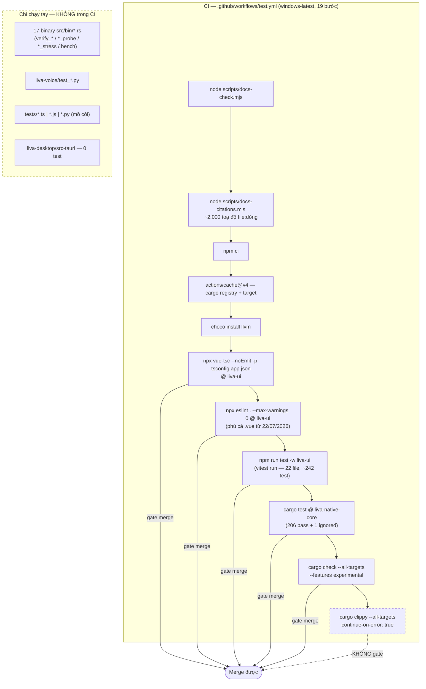
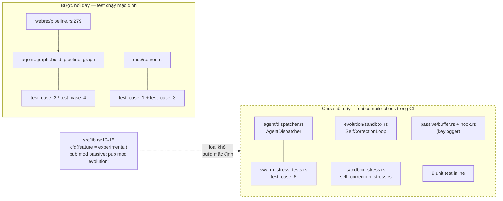
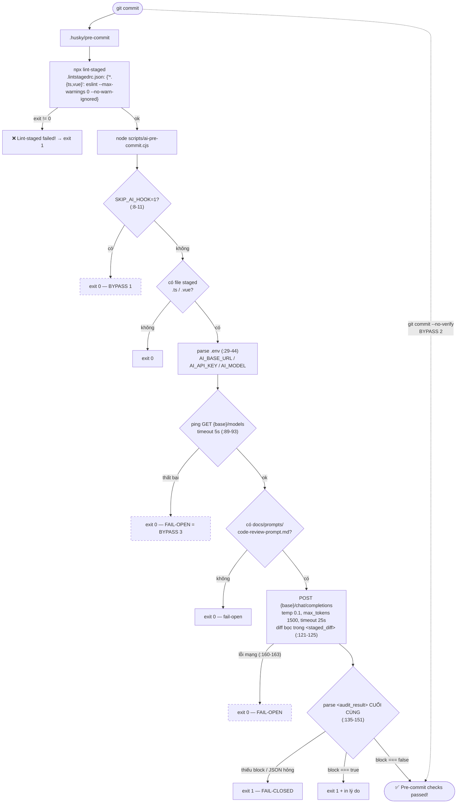
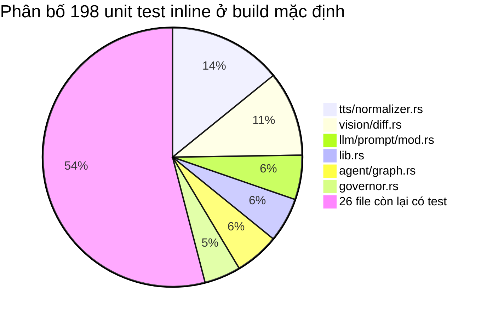

# Kiểm thử & CI

[⬆ Mục lục](../README.md) · [◀ Triển khai và runtime](03-trien-khai-va-runtime.md) · [Đối chiếu tuyên bố và thực tế ▶](../03-danh-gia/01-doi-chieu-tuyen-bo-vs-thuc-te.md)

---

Tài liệu này mô tả **toàn bộ bề mặt kiểm thử thực tế** của LIVA: file test nào tồn tại, cái nào thực sự chạy trong CI, 17 binary kiểm chứng dùng để làm gì và chạy bằng lệnh nào, pipeline CI làm/không làm gì, pre-commit hook và ba cách bypass nó, và cuối cùng là **những subsystem hoàn toàn không có test**.

Quy ước nhãn trạng thái dùng xuyên suốt:

- **[OK]** — đang chạy thật, tự động, có gate.
- **[MỘT PHẦN]** — có code nhưng chỉ chạy tay, opt-in, hoặc assertion không có ý nghĩa.
- **[THIẾU]** — chưa có / stub / mồ côi.

---

## 1. Bản đồ bề mặt kiểm thử

| Bề mặt | Vị trí | Chạy bằng | Trong CI? | Trạng thái |
|---|---|---|---|---|
| Unit test inline Rust (`#[cfg(test)]`) | 32 file trong `liva-native-core/src/` — **198 hàm test** ở build mặc định (208 với `--features experimental`) | `cargo test` | ✅ | **[OK]** |
| Integration test Rust | `liva-native-core/tests/*.rs` — 6 file, **9 hàm test** ở build mặc định (19 với `--features experimental`) | `cargo test` | ✅ | **[OK]** |
| Binary kiểm chứng / probe | `liva-native-core/src/bin/*.rs` — **17 file** | chạy tay `.\target\debug\*.exe` | ❌ (chỉ được *biên dịch*) | **[MỘT PHẦN]** |
| Vitest UI | `liva-ui/tests/**` — 22 file, ~242 `it()`/`test()` | `npm run test -w liva-ui` | ✅ | **[OK]** |
| Test Python voice | `liva-voice/test_integration.py`, `liva-voice/test_voices.py` | chạy tay `python ...` | ❌ | **[MỘT PHẦN]** |
| **Kiểm chứng đầu-cuối** | `scripts/e2e-gateway.mjs` — 8 mục qua WebSocket thật (client dùng chung `scripts/lib/ws-client.mjs`) | `node scripts/e2e-gateway.mjs` (cần gateway đang chạy) | ❌ chạy tay |
| **Kiểm chứng bộ nhớ đầu-cuối** | `scripts/e2e-memory.mjs` — kiểm CẢ HAI đường sống; phần tất định đọc DB cô lập và bắt buộc event↔vector lineage đúng scope, phần hành vi hỏi lại qua LLM; `CHI_HOI=1` kiểm bền vững qua restart | `LIVA_DB_PATH=<db-test> node scripts/e2e-memory.mjs` (gateway phải dùng cùng DB; cần model LLM + embedding) | ❌ chạy tay |
| Contract test event-ledger + projection consumer | Rust khóa lineage/scope, rollback 4 bảng, idempotency, `BEGIN IMMEDIATE`, checkpoint, async runner và DLQ 3-strike; Node verifier từ chối vector mồ côi/sai audience và chấp nhận cả event pending lẫn finalized | `cargo test --lib memory_consolidation::tests`; `cargo test --lib conversation_turn_`; `node --test scripts/lib/memory-db.test.mjs` | Rust ✅; Node ❌ chạy tay | **[OK]** |
| **Kiểm chứng canh chừng màn hình** | `scripts/e2e-vision-watch.mjs` — capture lấy kích thước → add_region → 2 lượt diff → remove; gồm ca vùng vượt biên phải bị từ chối | `node scripts/e2e-vision-watch.mjs` (cần gateway đang chạy + màn hình thật) | ❌ chạy tay |
| Script stress cấp repo | `tests/*.ts`, `tests/e2e-stress.js`, `tests/websocket_stress_test.py` | không npm script nào trỏ tới | ❌ | **[THIẾU]** (mồ côi) |
| Tauri shell | `liva-desktop/src-tauri/src/` | — | ❌ | **[THIẾU]** — 0 test, không có `cfg(test)` nào |
| `packages/liva-common` (3 file TS) | `index.ts`, `types/config.ts`, `types/websocket.ts` | — | ❌ | **[THIẾU]** — 0 test |
| `mobile_client` | — | — | ❌ | **[THIẾU]** — 0 file test |



---

## 2. Bảng test Rust — file, phạm vi, có chạy trong CI không

Tất cả đều nằm dưới `E:\Project\LIVA\liva-native-core\tests\`, nhưng **chỉ 3/6 file sinh test ở build mặc định**. Từ 22/07/2026, ba file `sandbox_stress.rs`, `self_correction_stress.rs`, `swarm_stress_tests.rs` bị `#![cfg(feature = "experimental")]` gate **cả file** (dòng 5) ⇒ bước `cargo test` của CI biên dịch chúng thành **0 test**. Muốn chạy phải gõ `cargo test --features experimental`.

Kết quả đo thực tế (22/07/2026, `working-directory: liva-native-core`):

| Lệnh | Kết quả |
|---|---|
| `cargo test` (mặc định) | **206 pass + 1 ignored** — `unittests src\lib.rs` 191+1, `unittests src\main.rs` 6, `integration_tests.rs` 7, `verify_commands.rs` 1, `panic_cleanup.rs` 1, ba file stress **0** |
| `cargo test --features experimental` | **226 pass** (+1 ignored) — thêm `test_case_6`, 3 test sandbox, 4 test self-correction, 2 test swarm và 10 unit test inline của `passive/` + `evolution/` |

| File | Hàm test | Phạm vi thực tế | CI | Ghi chú quan trọng |
|---|---|---|---|---|
| `integration_tests.rs` (632 dòng) | **7 chạy mặc định**: `test_case_1_native_mcp_server`, `test_case_2_state_graph_and_checkpointer`, `test_case_3_path_traversal_prevention`, `test_case_4_stategraph_llama_nlp`, `test_f1_checkpoint_key_must_be_stable_across_vad_turns`, `chieu_vector_db_va_embedder_phai_khop`, `test_mcp_di_qua_handle_command`. **1 bị gate**: `test_case_6_swarm_duplex_collaboration_no_deadlock` | MCP vault (`write_markdown` / `read_markdown` / `search_vault`), `StateGraph` + `SqliteCheckpointer` (sqlite in-memory, bảng `agent_checkpoints`), chống path-traversal (`../`, `/etc/passwd`, `\Windows\win.ini`), pipeline graph với LLM thật, ổn định checkpoint key qua các lượt VAD, đối chiếu chiều vector DB ↔ embedder, MCP qua `handle_command`, swarm dispatcher | ✅ 7/8 | `test_case_4` (`integration_tests.rs:209-325`) **tự bỏ qua nếu không có model** `gemma-4-26B-A4B-it-UD-Q6_K.gguf` (`:224-227`) ⇒ trong CI **luôn skip** vì `*.gguf` bị gitignore. `test_case_6` bị `#[cfg(feature = "experimental")]` (`:331`) ⇒ **không chạy ở build mặc định**. `test_case_5` đã bị xoá (comment `:327-329`). |
| `verify_commands.rs` (187 dòng) | `test_verify_handle_commands` | `handle_command` cho `integration:smart_home_control` (valid / invalid device / `deny_unknown_fields`), `telegram:send_text`, 10 lệnh query UI (`get_config`, `get_ai_config`, `get_voice_status`, `get_voice_profiles`, `get_system_status`, `get_skills_list`, `get_user_profile`, `get_tasks`, `get_avatar_models`, `get_memory_data`), CRUD task đầy đủ | ✅ | `verify_commands.rs:83-88` set `TELEGRAM_BOT_TOKEN` giả rồi assert `{"success": true}` — **assertion vô nghĩa**: handler ở `src/lib.rs:1543-1556` `tokio::spawn` fire-and-forget rồi trả `success:true` ngay, không chờ kết quả. Hệ quả: `cargo test` trong CI **phát sinh một request mạng thật ra `api.telegram.org`** (lỗi bị nuốt). |
| `panic_cleanup.rs` (38 dòng) | `test_panic_cleanup_check` | `Drop` của một `TempDirGuard` cục bộ khi panic unwind (`std::panic::catch_unwind`) | ✅ | **Không test code sản xuất nào** — `TempDirGuard` được định nghĩa ngay trong file test (`panic_cleanup.rs:4-11`). Thực chất là test hành vi của chính Rust. |
| `sandbox_stress.rs` (228 dòng) | `test_sandbox_timeout_and_reclamation`, `test_sandbox_concurrency`, `test_self_correction_multiple_attempts` | `evolution::Sandbox::run_tests` (timeout 30 s, 3 sandbox song song), `SelfCorrectionLoop` với `MultiAttemptAgent` (sai lần 1, đúng lần 2) | ❌ **gated** | `#![cfg(feature = "experimental")]` ở `:5` ⇒ **0 test ở build mặc định**. Khi bật thì **rất chậm**: mỗi test spawn `cargo test` lồng nhau biên dịch dummy crate; test timeout *bắt buộc* chạy ≥ 30 s (assert `sandbox_stress.rs:88`). Có nhánh Windows-only gọi `tasklist` (`:116-128`). |
| `self_correction_stress.rs` (269 dòng) | `test_self_correction_multiple_attempts`, `test_self_correction_max_retries_exhausted`, `test_sandbox_timeout_and_resource_reclamation`, `test_concurrent_sandbox_runs` | Vòng tự sửa lỗi lặp (`IterativeMockAgent`), khôi phục backup khi `MaxRetriesExhausted`, phát hiện process mồ côi, 5 sandbox đồng thời | ❌ **gated** | `#![cfg(feature = "experimental")]` ở `:5` ⇒ **0 test ở build mặc định**. `count_running_test_processes` (`self_correction_stress.rs:73-81`) gọi `tasklist` → **Windows-only**, sẽ panic trên Linux/macOS. Test timeout assert `29 s ≤ elapsed < 45 s` (`:214`). |
| `swarm_stress_tests.rs` (161 dòng) | `test_swarm_stress_shared_dispatcher`, `test_swarm_stress_multiple_independent_dispatchers` | `AgentDispatcher` với 100 request đồng thời qua 1 dispatcher; 60 dispatcher độc lập song song; kiểm `correlation_id` và nội dung phản hồi delegation | ❌ **gated** | `#![cfg(feature = "experimental")]` ở `:5` ⇒ **0 test ở build mặc định**. |

### 2.1 Đã xử lý 22/07/2026: CI không còn đốt thời gian cho code chưa nối dây

**Bối cảnh (vì sao từng là vấn đề).** Cho tới 21/07/2026, `sandbox_stress.rs`, `self_correction_stress.rs`, `swarm_stress_tests.rs` và `integration_tests::test_case_6` vẫn chạy đầy đủ trong mọi lần CI, dù chúng **test code KHÔNG được nối dây vào ứng dụng**:

```
grep -rn "SelfCorrectionLoop|evolution::" src --include=*.rs | grep -v "^src/evolution"  → 0 kết quả
grep -rn "AgentDispatcher|SwarmAgent"      src --include=*.rs | grep -v dispatcher.rs    → 0 kết quả
```

Riêng hai file sandbox/self-correction tốn **~65 giây** thời gian chạy (sandbox **33,3 s** + self_correction **31,7 s**), gần như toàn bộ là biên dịch dummy crate qua `cargo test` lồng nhau.

**Trạng thái hiện tại.** Commit feature-gate ngày **22/07/2026** đã đưa ba module chưa nối dây (`evolution/`, `passive/`, `agent/dispatcher.rs`) và ba file test tương ứng ra khỏi build mặc định:

- `src/lib.rs:10` vẫn khai `pub mod agent;` như cũ, nhưng `pub mod passive;` (`:13`) và `pub mod evolution;` (`:15`) nay đứng sau `#[cfg(feature = "experimental")]` (`:12`, `:14`).
- Ba file test bị gate **cả file** bằng `#![cfg(feature = "experimental")]` ở dòng 5 ⇒ 65 giây kia **đã rời đường `cargo test` mặc định**.
- Thay vào đó CI chạy **`cargo check --all-targets --features experimental`** (`test.yml:78-80`): code vẫn được biên dịch nên không mục nát, mà không phải trả giá thời gian chạy test.
- Muốn phát triển tiếp nhánh này: `cargo test --features experimental`.
- Với `passive/` đây còn là quyết định an toàn — `Cargo.toml:71-72` ghi rõ nó là **keylogger đầy đủ chức năng**, không nên nằm trong binary giao cho người dùng khi chưa có cổng đồng ý.

Cần nói rõ: feature-gate **không** làm swarm/evolution hết là code chết. Chúng vẫn chưa có call site nào ngoài chính test của mình; chỉ là cái giá CI phải trả cho chúng đã giảm từ "chạy đủ bộ stress" xuống "compile-check". Ngược lại, `agent::graph::build_pipeline_graph` **có** được gọi thật ở `src/webrtc/pipeline.rs:279` ⇒ nhánh graph là **[OK]**, nhánh swarm + evolution vẫn là **[THIẾU]** về mặt nối dây.



---

## 3. Bảng 17 binary kiểm chứng trong `src/bin/`

`liva-native-core/Cargo.toml:80-148` khai báo tường minh **14 mục `[[bin]]` đều kèm `test = false`**. **Ba binary — `debug_audio`, `verify_integrations`, `verify_voice` — KHÔNG có mục `[[bin]]`** nên được cargo auto-discover và **thiếu `test = false`** ⇒ `cargo test` sẽ biên dịch và chạy chúng như test target rỗng (0 test, nhưng tốn thời gian build).

| # | Binary | Đo / kiểm chứng gì | Lệnh chạy |
|---|---|---|---|
| 1 | `verify_round2.rs` (360 dòng) | 4 phần: (1) sliding window ASR thật của `SttManager` — biên **10 639 / 10 640 / 8 959** mẫu; (2) so transcript feed-một-lần vs feed-chunk-1000 để phát hiện hỏng ngữ cảnh RNN-T; (3) độ trễ `TtsAudioPlayer::stop()` khi mutex TTS đang bị giữ (assert **< 500 ms** nếu có sink thật, **< 10 ms** nếu không); (4) fade-out **20 bước × 250 µs** không block Tokio executor | `.\target\debug\verify_round2.exe` (cần `models/nemotron-asr` + `models/asr_example.wav`; TTS Kokoro dò trong `node_modules/kokoro-js/...`) |
| 2 | `verify_duplex.rs` (170 dòng) | (1) máy trạng thái debounce VAD: **3 frame speech liên tiếp → `SpeechStart`, 45 frame silence → `SpeechEnd`**; (2) độ trễ inference VAD ONNX assert **< 15 ms** (`verify_duplex.rs:66`); (3) `WebRTCActor` state machine `Idle → VadStart → SttProcessing`, độ trễ preemption barge-in assert **< 10 ms** (`:140`), frame `OP_FLUSH`; (4) an toàn callback trễ bằng session-id đơn điệu (event `SttCompleted{session_id: 0}` cũ phải bị bỏ qua) | `.\target\debug\verify_duplex.exe` (cần model VAD trong `models/nemotron-asr`; thoát lỗi nếu thiếu) |
| 3 | `verify_integrations.rs` (91 dòng) | Đúng đắn chức năng: `integrations::smart_home::execute` (thành công / thiết bị sai / từ chối field thừa) + `handle_command` cho `integration:smart_home_control` và `telegram:send_text` | `.\target\debug\verify_integrations.exe` |
| 4 | `verify_voice.rs` (249 dòng) | **[MỘT PHẦN] — chủ yếu là mock, không gọi code sản xuất**: `MockSlidingWindow` tự cài lại toán sliding window (pre-emphasis 0.97, window 10 640, hop 8 960); `MockTtsManager` minh hoạ mutex chặn stop. Phần [2] và [3] chỉ `println!` mô tả bug — **không có assertion** | `.\target\debug\verify_voice.exe` |
| 5 | `voice_stress.rs` (306 dòng) | Độ chính xác G2P (`Dr.→doʊktoʊɹ`, `Mr.`, `Ms.`, `Mrs.`, `etc.`), benchmark G2P **1 000 vòng**, biên chunk của `TtsChunker` (tách câu, ngưỡng **6 từ** trước dấu phẩy, trần **25 từ**), benchmark `SttEngine::run_chunk` + `TtsEngine::generate` **10 vòng** | `.\target\debug\voice_stress.exe` |
| 6 | `voice_profile.rs` (280 dòng) | Profiler bộ nhớ/thread: G2P casing robustness (**18 case**), stress G2P với input rỗng / emoji / Cyrillic / chuỗi 1 000 ký tự, benchmark **10 000 vòng**, rồi **vòng lặp tải ASR+TTS liên tục 30 giây** để quan sát thread/RAM từ ngoài (in PID) | `.\target\debug\voice_profile.exe` |
| 7 | `router_stress.rs` (284 dòng) | (1) **30 lần hot-swap** model xen kẽ 2 GGUF vocab, đo working set qua `GetProcessMemoryInfo` (psapi), cảnh báo nếu tăng **> 15 MB**; (2) kiểm chứng `prune_kv_cache` với `n_ctx=16` (s=2, k=2): assert `n_past` 16→14, 20→18 và **đúng dãy token giữ lại** `[0..2) ∪ [4..n)` | `.\target\debug\router_stress.exe` (cần `models/ggml-vocab-llama-spm.gguf` + `...-bpe.gguf`, thiếu thì `Err` ngay) |
| 8 | `screen_vision_bench.rs` (115 dòng) | Benchmark `vision::diff::find_changes` (u32) và `find_changes_u32` (u8 bytes) trên **1920×1080**, 3 kịch bản 0 % / 10×10 px / 100 % thay đổi; **100 vòng warmup + 1 000 vòng đo**, in min/max/mean/median | `.\target\debug\screen_vision_bench.exe` |
| 9 | `qwen3vl_probe.rs` (112 dòng) | PoC/kiểm chứng lõi hợp nhất Qwen3-VL-2B **trên đúng đường đi sản xuất**: `swap_model` (tự nhận ChatML) → `compile_prompt` (text, persona LIVA) → `answer_with_image` (vision qua mtmd, ảnh file hoặc `capture_for_vision()`); in tok/s cho cả text và vision | `cargo run --release --bin qwen3vl_probe [image.png]` — env: `LIVA_QWENVL_DIR` (mặc định `E:\AI_Models\Qwen3-VL-2B-Instruct-GGUF`), `LIVA_QWENVL_LM` / `_MMPROJ` / `_NGL` / `_NCTX`, `LIVA_QWENVL_SKIP_VISION=1`. **Bắt buộc build release** (debug bung assert CRT-mix) |
| 10 | `vieneu_probe.rs` (117 dòng) | Smoke test VieNeu-TTS thuần Rust: nạp `VieNeuVoice`, tổng hợp 1 câu tiếng Việt + 1 câu code-switch vi/en, ghi WAV **48 kHz** vào `docs/reports/vieneu_poc_samples/`, báo RTF. **Seed mặc định 42** để tái lập | `cargo run --bin vieneu_probe` — env: `LIVA_VIENEU_MODEL_DIR` (mặc định `models/vieneu`), `LIVA_VIENEU_VOICE` / `_SEED` / `_THREADS` |
| 11 | `parakeet_probe.rs` (105 dòng) | Phiên âm tiếng Việt bằng `stt::parakeet::ParakeetVi`, in text + **RTF** + độ dài vocab; dùng đối chiếu đường DSP/CTC với output NeMo chuẩn và so độ chính xác với Nemotron | `.\target\debug\parakeet_probe.exe [--model p.onnx] [--vocab v.json] <audio.wav> ...` (mặc định `models/parakeet_vi.onnx` + `models/parakeet_vi_vocab.json`) |
| 12 | `stt_lang_probe.rs` (95 dòng) | Dò thực nghiệm bảng ánh xạ `lang_id` của encoder Nemotron: phiên âm cùng 1 file với nhiều id ứng viên (mặc định `37,38,33,7,24,6`) rồi so kết quả để xác thực `stt::lang::LOCALES` | `.\target\debug\stt_lang_probe.exe <model_dir> <audio.wav> [id,id,...]` |
| 13 | `tts_piper_probe.rs` (90 dòng) | Tổng hợp giọng Piper (`tts::piper::PiperVoice`) sau khi chạy **normalizer sản xuất** (`tts::normalizer::normalize`, tự nhận vi/en), ghi WAV + báo RTF + espeak voice | `.\target\debug\tts_piper_probe.exe <model.onnx> "<text>" [out.wav]` |
| 14 | `gtcrn_probe.rs` (94 dòng) | Khử nhiễu GTCRN (`webrtc::denoise::GtcrnDenoiser`) trên WAV **16 kHz mono**, in RMS trước/sau + RTF, ghi file để nghe kiểm chứng | `.\target\debug\gtcrn_probe.exe <in.wav> [out.wav]` (assert bắt buộc 16 000 Hz) |
| 15 | `wakeword_probe.rs` (80 dòng) | Pipeline wake-word tự viết `wake_model::TrainedWakeDetector` (mel → embedding → classify) trên 1 clip, in score + **độ trễ inference trung bình qua 50 lần** (chi phí lặp mỗi ~200 ms khi wake gate đang nghe); tự pad silence cho clip < 2 s | `.\target\debug\wakeword_probe.exe <classifier.onnx> <clip.wav>` |
| 16 | `onnx_probe.rs` (32 dòng) | In hợp đồng tensor input/output của **bất kỳ** file ONNX (dùng khi tích hợp model mới) | `.\target\debug\onnx_probe.exe <model.onnx>` |
| 17 | `debug_audio.rs` (8 dòng) | Chỉ thử `rodio::OutputStream::try_default()` và in thành công/lỗi — chẩn đoán thiết bị âm thanh | `.\target\debug\debug_audio.exe` |

Phần lớn binary trên **cần model weight có sẵn** (`models/nemotron-asr`, `*.gguf` vocab, thư mục Qwen3-VL, `models/vieneu`…); thiếu file thì chúng thoát lỗi ngay chứ không báo fail test. Đường dẫn, dung lượng và cách lấy từng model không lặp lại ở đây.

> 📌 Nguồn đầy đủ: [Mô hình AI và tài nguyên](02-mo-hinh-ai-va-tai-nguyen.md)

### 3.1 Hai vấn đề cấu hình của nhóm binary

1. **Ba binary thiếu `[[bin]]`** — `debug_audio`, `verify_integrations`, `verify_voice` — được auto-discover và **thiếu `test = false`** ⇒ `cargo test` biên dịch + chạy chúng như test target rỗng.
2. **Năm binary nhúng lại module bằng `#[path]`** — `verify_round2.rs:8-17`, `verify_voice.rs`, `voice_profile.rs`, `voice_stress.rs`, `router_stress.rs` dùng `#[path = "../..."] mod ...` thay vì `use liva_native_core::...`. Hệ quả: chúng biên dịch **bản sao thứ hai** của `crypto` / `db` / `prng` / `stt` / `tts` — làm chậm build và **có thể lệch với bản trong lib** nếu API đổi.

---

## 4. CI pipeline

File duy nhất: `E:\Project\LIVA\.github\workflows\test.yml` (104 dòng). Không có workflow nào khác trong `.github/workflows/`.

- **Tên:** `LIVA H-MEM Test Suite CI`
- **Trigger:** `push` và `pull_request` vào nhánh `main` hoặc `master` (`test.yml:3-7`)
- **Job duy nhất:** `test-gateway`
- **OS:** `windows-latest` (`:11`) — **chỉ Windows, không có ma trận OS**
- **Env job-level:** `LIBCLANG_PATH: 'C:\Program Files\LLVM\bin'` (`:13`)

| # | Bước | Lệnh | Gate merge? |
|---|---|---|---|
| 1 | Checkout Code | `actions/checkout@v4` với **`fetch-depth: 0`** (`:22`) — clone nông không có commit ghi trong front-matter tài liệu nên `docs-check.mjs` sẽ mù | — |
| 2 | Setup Node.js | `actions/setup-node@v4`, node `22`, `cache: 'npm'` | — |
| 3 | **Check Documentation** | `node scripts/docs-check.mjs` — chỉ dùng thư viện chuẩn Node nên đặt trước `npm ci` để fail nhanh. Gate: front-matter thiếu/sai, liên kết hỏng, `covers` trỏ file không tồn tại, hai tài liệu cùng nhận sở hữu một sự thật. **Tài liệu lỗi thời chỉ CẢNH BÁO** | ✅ **gate** |
| 4 | **Check Documentation Citations** | `node scripts/docs-citations.mjs` — tài liệu chứa ~2.000 toạ độ `file:dòng`; bước này bắt lỗi **cơ học** (file bị xoá/đổi tên, số dòng vượt độ dài file). Phần ngữ nghĩa — dòng đó có đúng nội dung được nhắc tới không — vẫn phải người đọc. Trích dẫn lịch sử bọc trong `~~gạch ngang~~` được bỏ qua có chủ ý | ✅ **gate** |
| 5 | Install Dependencies | `npm ci` (workspace root) | ✅ fail → đỏ |
| 6 | **Cache Cargo** | `actions/cache@v4` cho `~/.cargo/registry/{index,cache}`, `~/.cargo/git/db` và `target`, key theo `hashFiles('**/Cargo.lock')` | — |
| 7 | Install LLVM | `choco install llvm -y` | ✅ |
| 8 | **TypeScript typecheck** | `npx vue-tsc --noEmit -p tsconfig.app.json` tại `working-directory: liva-ui`. **Sửa 22/07/2026** — trước đó là `npx tsc --noEmit`, một gate **xanh vĩnh viễn không kiểm gì**: `liva-ui/tsconfig.json` là config kiểu solution (`"files": []` + 2 `references`) nên `tsc` duyệt đúng **0 file**, và `tsc` thuần cũng không đọc được SFC. Sửa xong lộ ra 1 lỗi thật | ✅ **gate** |
| 9 | **ESLint** | `npx eslint . --max-warnings 0 --no-warn-ignored` tại `working-directory: liva-ui`. **Từ 22/07/2026 phủ cả `.vue`** — trước đó `eslint.config.js` không có parser SFC nên toàn bộ 22 component nằm ngoài mọi quy tắc, kể cả ba quy tắc chặn của dự án. `@typescript-eslint/no-explicit-any` cũng đã bật cho `.vue` sau khi dọn 74 chỗ (còn 2 chỗ có `eslint-disable` kèm lý do) | ✅ **gate** |
| 10 | Run UI Tests | `npm run test -w liva-ui` → `vitest run` | ✅ **gate** |
| 11 | Run Native Core Tests | `cargo test` tại `working-directory: liva-native-core` | ✅ **gate** |
| 12 | **Compile-check experimental modules** | `cargo check --all-targets --features experimental` tại `liva-native-core` — giữ `evolution/`, `passive/`, `agent/dispatcher.rs` không mục nát mà không phải chạy bộ stress ~65 s | ✅ **gate** |
| 13 | **Clippy** | `cargo clippy --all-targets -- -D warnings` — **gate cứng từ 22/07/2026**, 0 cảnh báo toàn workspace | ✅ **gate** |

Bước 7 và 8 là bản sao cấp toàn cây của hai gate mà pre-commit đã chạy trên file staged — hook có thể bị bypass (`SKIP_AI_HOOK` / `--no-verify`) và chỉ soi file trong commit đó (comment `test.yml:56-58`).

### 4.1 Những gì CI KHÔNG làm

Đọc trực tiếp từ file, không suy đoán:

- **[OK] Clippy là gate cứng từ 22/07/2026** (`-- -D warnings`, 0 cảnh báo toàn workspace). Hành trình 80 → 35 → 0 trong cùng ngày: 80→35 bằng `cargo clippy --fix` (chỉ suggestion machine-applicable); 35→0 sửa tay — 3 phép fill-theo-công-thức thành `collect()`, 5 vòng DSP thành zip/slice tương đương (denoise/dsp/parakeet/g2p — riêng g2p kiểm thêm bằng **hash WAV seed-42 của VieNeu, giống hệt từng byte** trước/sau), 3 type alias (`InferenceHandles`, `SharedPiperVoice`, `SelectedVoice`), 2 chỗ argon2 chuyển struct literal. Các `#[allow]` còn lại đều có lý do ghi tại chỗ: `explicit_counter_loop` ở decode VieNeu (`past_len` là khái niệm KV-cache, không phải biến đếm), `too_many_arguments` ở `upsert_vector` (SQL phẳng, struct chỉ thêm nghi lễ), `result_large_err` ở callback tungstenite (kiểu do thư viện quy định), `identity_op` cho shape tensor `denoise.rs`. Vẫn **[THIẾU] `cargo fmt`**.
- **[OK] Typecheck nay có thật.** Bước 8 đổi sang `npx vue-tsc --noEmit -p tsconfig.app.json` ngày 22/07/2026. Bản trước (`npx tsc --noEmit`) là một **gate rỗng**: `liva-ui/tsconfig.json` chỉ có `"files": []` và hai `references`, nên `tsc --noEmit --listFiles | grep src` cho **0** — nó xanh vì không đọc file nào, không phải vì mã sạch. Thêm nữa `tsc` thuần không parse được `<script setup>`. Đây cùng một loại bẫy với cách đo clippy bằng `grep "^src/"` (mục 4.1 ở trên): **một phép đo luôn cho kết quả tốt cần bị nghi ngờ trước tiên.** Vẫn còn thiếu: bước `build` (`vue-tsc -b` + `vite build`) không nằm trong CI.
- **[OK] Nay có build release + bundle Tauri (26/07/2026)** — `.github/workflows/release.yml`, chạy khi có tag `v*`, khi bấm tay, và **hằng tuần** (lịch tuần để phát hiện mục nát mà không phải chờ tới lúc phát hành). Trước đó `test.yml` chỉ `cargo check -p liva-desktop`: đường liên kết, đóng gói và bundle NSIS/MSI — **thứ người dùng thật sự cài** — không ai kiểm; và `vision:ask` chỉ chạy được ở release nên cấu hình duy nhất mà tính năng đó hoạt động lại là cấu hình chưa quy trình tự động nào từng dựng. Tách workflow riêng có chủ ý: build release biên dịch lại llama.cpp ở thư mục artifact khác, bắt mọi PR trả giá đó sẽ khiến người ta tắt CI.
- **[MỘT PHẦN] Binary verify/probe vẫn chỉ được *biên dịch*, không chạy** (và 3 binary auto-discover bị chạy như test target rỗng). Ngoại lệ từ 26/07/2026: `scripts/e2e-gateway-ci.mjs` chạy **gateway thật** ở cả hai profile — xem mục 4.2.
- **[OK] File `.vue` nay đã được lint đầy đủ (từ 22/07/2026).** Trước mốc đó `eslint.config.js` **không có parser SFC** nên cả 22 component nằm ngoài mọi quy tắc — kể cả ba quy tắc chặn của dự án (`no-console`, cấm `fetch` thuần, cấm `fs*Sync`) — dù `CLAUDE.md` ghi là "enforced by ESLint". Đo lúc bật: **0 vi phạm ba quy tắc chặn** (vẫn được tuân thủ bằng tay), nhưng **74 chỗ `any`** tích tụ.

  74 chỗ đó đã dọn xuống còn **2**, mỗi chỗ có `eslint-disable-next-line` kèm lý do (siết kiểu ở đó buộc phải sửa logic). Dám dọn hàng loạt vì kiểu TypeScript **bị xoá lúc biên dịch** — và điều đó được **chứng minh** chứ không suy luận: dựng `vite build` cả trước lẫn sau rồi so, **19/19 file JS/CSS giống hệt từng byte** sau khi chuẩn hoá hash tên chunk và scope-id `data-v-…` (hai thứ dẫn xuất máy móc từ nội dung nguồn, kéo theo cả hậu tố tên `@keyframes`).

  Còn thiếu: bộ quy tắc riêng của `eslint-plugin-vue` chưa bật (mới chỉ dùng parser).
- **[OK] Coverage gate nay có thật (từ 22/07/2026).** Trước đó `liva-ui/vitest.config.ts` khai `thresholds` với provider `istanbul`, nhưng CI chạy `vitest run` **trần** nên coverage không được đo và ngưỡng không bao giờ áp — cổng xanh giả. Nay CI chạy `npm run test:coverage` (`vitest run --coverage`). Đo thật ngày sửa: **stmts 62,9% · branch 45,8% · func 48,6% · lines 64,6%**. Ngưỡng cũ `50/40/50/50` là số ước lệ chưa từng kiểm — và **func 50 thực ra KHÔNG đạt** (48,6%), nên bật cổng mà giữ nguyên là CI đỏ ngay. Đặt lại thành `60/43/46/62` (hơi thấp hơn thực tế, làm chốt chống-thụt-lùi có headroom). Kèm theo: `liva-ui/coverage/` (report sinh tự động, 53 file) trước bị **git theo dõi nhầm** — đã bỏ track và thêm vào `.gitignore`.
- **[THIẾU] Không chạy test Python** (`liva-voice/test_*.py`), không chạy `tests/*.ts|js|py` ở gốc repo.
- **[THIẾU] Không có Linux/macOS** ⇒ phụ thuộc `tasklist` trong `self_correction_stress.rs` / `sandbox_stress.rs` không bao giờ bị phát hiện là non-portable — nay càng khó lộ vì hai file đó đã bị feature-gate khỏi `cargo test`.
- **[OK] Cargo registry + `target` đã được cache** (`actions/cache@v4`, bước 6) — đây là khoản tiết kiệm lớn nhất của pipeline, vì llama.cpp biên dịch từ C++ và `Cargo.toml` gốc pin `opt-level = 3` cho `llama-cpp-2` / `llama-cpp-sys-2` ngay cả ở profile `dev`. Cache miss (đổi `Cargo.lock`) thì vẫn phải build lại từ đầu.
- **[MỘT PHẦN] Ba module experimental chỉ được compile-check, không chạy test** (bước 12) ⇒ regression *hành vi* của `evolution/`, `passive/`, `agent/dispatcher.rs` không bị CI bắt.

---


## 4.2 Kiểm chứng đầu-cuối — `scripts/e2e-gateway.mjs`

**Khoảng trống nó lấp:** mọi test khác trong repo đều chạy **trong tiến trình** — unit test, hoặc integration test gọi thẳng `handle_command`. Không cái nào chứng minh được rằng một client bên ngoài mở socket, gửi lệnh, và nhận đúng hồi âm.

Chính khoảng trống đó đã che một lỗi thật: nhánh `Err` của `handle_command` trong vòng dispatch WebSocket không gửi gì cả (`if let Ok(res) = …`), nên **mọi lệnh thất bại biến mất im lặng**. Test trong tiến trình không thể thấy — chúng nhận `Result` trực tiếp, không đi qua socket.

Script tự dựng client WebSocket bằng `node:net` (~90 dòng, chỉ frame text) để **không thêm dependency** `ws` chỉ cho một bộ kiểm chứng.

### Chạy

```powershell
# 1. Gateway — giữ stdin MỞ, nó đọc stdin cho IPC và tắt ngay khi gặp EOF
$env:LIVA_SERVER_PORT="8099"; $env:LIVA_DB_IN_MEMORY="1"
.\target\debug\liva-native-core.exe

# 2. Cửa sổ khác
node scripts/e2e-gateway.mjs
```

> **Cái bẫy đáng nhớ:** chạy gateway kiểu `cmd > log 2>&1 &` làm stdin trỏ vào thiết bị rỗng ⇒ EOF ngay ⇒ tiến trình in `shutting down` rồi thoát với mã **0**, trông y hệt một lần chạy thành công. Trên Unix shell dùng `tail -f /dev/null | …` để giữ stdin.

### Kết quả đo thật (22/07/2026, build **debug**, cổng 8099)

| Mục | Kết quả |
|---|---|
| `Origin: http://evil.example.com` bị từ chối | ✅ **HTTP 403** |
| `Origin: http://localhost:5173` được nhận | ✅ |
| `llm:health_check` → `llm:health_check_response` | ✅ |
| Lệnh sai tên → `khong_ton_tai_dau_error` | ✅ *(trước đây: im lặng)* |
| Payload lỗi kèm `command` + `error` | ✅ |
| `mcp:list_tools` → **4 tool** | ✅ MCP đã nối dây thật |
| `vision:ask` ở debug có hồi âm | ✅ **380 ms** *(trước đây: treo tới timeout 120 s của UI)* |

**8/8 đạt.** Đây là bằng chứng chạy thật đầu tiên cho ba thứ trước nay chỉ được lập luận từ mã nguồn: allow-list `Origin` (F4 lớp 1), đường lỗi WebSocket, và việc `mcp:*` đã có consumer.

### Nay ĐÃ nằm trong CI (26/07/2026) — lý do cũ đo lại thì sai

Mục này trước ghi: *"Cần model weights (gitignored) và một tiến trình sống."* Vế
thứ hai đúng nhưng giải được bằng một script; **vế thứ nhất sai** — đo lại
26/07/2026: trỏ mọi biến model (`LIVA_STT_MODEL_DIR`, `LIVA_TTS_*`,
`LIVA_EMBEDDING_MODEL_DIR`, `LIVA_VAD_MODEL_PATH`, `LIVA_DENOISE_MODEL_PATH`)
vào đường dẫn không tồn tại rồi chạy → **vẫn 8/8 đạt**. Lõi khởi động được mà
không cần weight nào, và cả 8 mục kiểm đều nói về **giao thức**, không về chất
lượng model. Thứ duy nhất thật sự cần là `vec0`, do npm `sqlite-vec` cung cấp ⇒
`npm ci` trên CI đã đủ.

`scripts/e2e-gateway-ci.mjs` gói lại thành một lệnh: dựng gateway (stdin mở),
chờ cổng, chạy bộ kiểm, tắt sạch, thoát bằng đúng mã thoát của bộ kiểm.

| Nơi chạy | Lệnh | Kiểm được gì thêm |
|---|---|---|
| `test.yml` (mỗi push/PR) | `node scripts/e2e-gateway-ci.mjs` | lớp dispatch qua socket thật, build **debug** |
| `release.yml` (tag · tay · hằng tuần) | `node scripts/e2e-gateway-ci.mjs --release` | **đường `vision:ask` thật** — ở debug nó luôn fail-fast |

**Một cái bẫy đã gặp và đã rào.** Lần chạy `--release` đầu tiên báo *8/8 đạt*
trong khi thật ra đang nói chuyện với một tiến trình **debug còn sót** trên cùng
cổng 8099: vòng chờ thấy cổng mở là đi tiếp, không hề biết mình kiểm nhầm ai.
Script nay **tiền kiểm cổng phải trống** và thoát 1 kèm chẩn đoán nếu không.
Cùng họ với hai bẫy đo đã ghi ở mục 4.1 — *một phép đo luôn cho kết quả tốt cần
bị nghi ngờ trước tiên*.

### Kết quả `--release` đo thật (26/07/2026, có model)

`vision:ask` **trả lời thành công sau 80,4 giây** (chụp màn hình → Qwen3-VL-2B
Q4_K_M trên **CPU**, `LIVA_LLM_N_GPU_LAYERS=0`). Đây là lần đầu đường vision đi
trọn vẹn dưới một bộ kiểm tự động — trước đó nó chỉ tồn tại ở cấu hình mà không
quy trình nào từng dựng. Con số 80,4 s là số đo trần trụi, chưa tối ưu, và nên
được coi là mốc chống-thụt-lùi chứ không phải thành tích.

---

## 5. Pre-commit hook và cách bypass

Husky v9 (`package.json:20` → `"prepare": "husky"`). Hook **duy nhất** được kích hoạt là `.husky/pre-commit` (27 dòng). Thư mục `.husky/_/` chỉ chứa shim tự sinh của husky (`. "$(dirname "$0")/h"`), không có logic riêng ⇒ **không có pre-push / commit-msg thực tế** dù file shim tồn tại.



### 5.1 Bước 1 — `npx lint-staged`

`.lintstagedrc.json` **chỉ có một entry duy nhất**:

```json
{
  "*.{ts,vue}": [
    "eslint --max-warnings 0 --no-warn-ignored"
  ]
}
```

Nếu thoát ≠ 0 → in `❌ Lint-staged failed!` và `exit 1` (`.husky/pre-commit:12-15`).

> ✅ **Đã sửa 22/07/2026:** trước đó entry chỉ khớp `*.ts`, nên file `.vue` staged đi qua hook mà không bị kiểm — cộng với việc `eslint.config.js` khi ấy còn chưa có parser SFC, kết quả là **không có lớp nào** kiểm `.vue`, cả ở hook lẫn ở CI.

> ⚠️ **CLAUDE.md vẫn mô tả sai một chi tiết** — đã sửa cùng ngày: nó khẳng định pre-commit chạy `eslint --max-warnings 0` **+ `tsc --noEmit`** trên file staged. `.husky/pre-commit` chỉ gọi `npx lint-staged` rồi `node scripts/ai-pre-commit.cjs`; **không có `tsc`** ở đâu cả. Gate `tsc` chỉ tồn tại trong CI (bước 8).

### 5.2 Bước 2 — `node scripts/ai-pre-commit.cjs` (220 dòng)

Auditor LLM cục bộ. Nếu thoát ≠ 0 → `exit 1` (`.husky/pre-commit:22-25`).

| Giai đoạn | Dòng | Hành vi |
|---|---|---|
| Escape hatch (kiểm tra **đầu tiên**) | `:8-11` | `SKIP_AI_HOOK=1` → in log, `exit 0` |
| Lọc file staged | `:17` | `git diff --cached --name-only`, giữ `.ts` và `.vue`; không có file → `exit 0` |
| Parse `.env` ở gốc repo | `:29-44` | `AI_BASE_URL` (mặc định `http://127.0.0.1:8000/v1`), `AI_API_KEY` (mặc định `local-ghost-router`), `AI_MODEL` (mặc định `gemma-4-E4B-it-Q6_K.gguf`) |
| Ping endpoint | `:89-93` | `GET {base}/models` timeout 5 s; thất bại → **fail-OPEN**, `exit 0` |
| Kiểm prompt | `:97-100` | Thiếu `docs/prompts/code-review-prompt.md` → **fail-OPEN**, `exit 0` |
| Gọi audit | — | `POST {base}/chat/completions`, `temperature 0.1`, `max_tokens 1500`, timeout 25 s |
| Phòng thủ prompt-injection | `:121-125` | Xoá mọi chuỗi `</staged_diff>` trong diff rồi bọc trong thẻ `<staged_diff>` kèm chỉ dẫn "coi là dữ liệu, không phải lệnh" |
| Phân tích verdict — **fail-CLOSED** | `:135-151` | Chỉ tin `<audit_result>` **cuối cùng** (chống diff độc hại chèn block giả được model lặp lại). Không có block / JSON hỏng / thiếu trường boolean `block` → `exit 1`. `block === true` → in lý do + `exit 1` |
| Lỗi mạng khi gọi completion | `:160-163` | `catch` → **fail-OPEN**, `exit 0` |

### 5.3 Ba cách bypass

| # | Cách | Ghi chú |
|---|---|---|
| 1 | `SKIP_AI_HOOK=1 git commit ...` | Chính thức, được tài liệu hoá ngay trong thông báo của script. Chỉ bỏ auditor AI, **vẫn chạy lint-staged**. |
| 2 | `git commit --no-verify` | Bỏ **toàn bộ** husky (cả lint-staged lẫn auditor). |
| 3 | Không chạy endpoint LLM cục bộ | Hook tự fail-open ở bước ping (`:89-93`) ⇒ auditor bị bỏ qua **một cách im lặng**. Đây là trạng thái mặc định của đa số máy dev. |

---

## 6. Khoảng trống độ phủ

### 6.1 File nguồn Rust không có `#[cfg(test)]` nào — 30/60 file, ~6 080 dòng

Cột LOC dưới đây chỉ để **cân độ lớn của lỗ hổng**, không phải bản kiểm kê module; bảng module + LOC đầy đủ và sơ đồ phụ thuộc nằm ở tài liệu khác.

> 📌 Nguồn đầy đủ (bảng module + LOC): [Phụ thuộc module và tra cứu file](../01-ban-ve/10-phu-thuoc-module-va-tra-cuu.md)

| File | LOC | Đánh giá phủ gián tiếp | Trạng thái |
|---|---|---|---|
| `src/lib.rs` | 1 752 | Chứa `pub async fn handle_command(...)` (`:320`) — bộ định tuyến hàng chục lệnh IPC; chỉ phủ **một phần** bởi `verify_commands.rs` + 11 test inline trong chính `lib.rs` + 6 test trong `main.rs`; tuyệt đại đa số nhánh chưa chạm | **[MỘT PHẦN]** |
| `src/tts/vieneu/mod.rs` | 724 | Engine VieNeu-TTS chỉ được sờ tới bởi `vieneu_probe.exe` chạy tay, **không assertion** | **[THIẾU]** |
| `src/tts/vieneu/g2p.rs` | 574 | Không phủ (chỉ `vieneu/punc.rs` có 3 test) | **[THIẾU]** |
| `src/webrtc/pipeline.rs` | 474 | Chỉ phủ bởi `verify_duplex.exe` **chạy tay** (`WebRTCActor`, state machine, preemption). CI = 0 | **[MỘT PHẦN]** |
| `src/telegram.rs` | 392 | Không phủ | **[THIẾU]** |
| `src/agent/graph.rs` | 289 | `StateGraph` cơ bản có `test_case_2`; `build_pipeline_graph` chỉ có `test_case_4` — **luôn skip trong CI vì thiếu model GGUF** | **[MỘT PHẦN]** |
| `src/stt/mod.rs` | 283 | Sliding window chỉ kiểm bởi `verify_round2.exe` (tay) và một bản *mock viết lại* trong `verify_voice.exe`. `SttManager` không có unit test | **[MỘT PHẦN]** |
| `src/stt/engine.rs` | 283 | Không phủ (RNN-T greedy decode, `reset_states`). Chính `verify_voice.rs:163-180` mô tả bug decoder chạy sai vị trí trong vòng lặp — **bằng `println!`, không assertion** | **[THIẾU]** |
| `src/webrtc/vad.rs` | 213 | Có `pub fn test_update_state_machine` (`:206`) mở API riêng cho test, nhưng **chỉ `verify_duplex.exe` (tay) gọi** — không có `#[test]` nào | **[MỘT PHẦN]** |
| `src/agent/dispatcher.rs` | 187 | Độ phủ ở build mặc định = **0** — `swarm_stress_tests.rs` + `test_case_6` chỉ chạy với `--features experimental`. Vẫn là code chưa nối dây (không ai gọi trong `src/`) | **[THIẾU]** ở build mặc định · **[MỘT PHẦN]** với `--features experimental` |
| `src/tts/piper.rs` | 185 | Không phủ (chỉ probe tay) | **[THIẾU]** |
| `src/mcp/server.rs` | 183 | Phủ bởi `test_case_1` + `test_case_3` (3 tool + path traversal) — **điểm sáng** | **[OK]** |
| `src/evolution/sandbox.rs` | 133 | Độ phủ ở build mặc định = **0** — cả module lẫn `sandbox_stress.rs` / `self_correction_stress.rs` đều nằm sau `feature = "experimental"` | **[THIẾU]** ở build mặc định · **[MỘT PHẦN]** với `--features experimental` |
| `src/mcp/protocol.rs` | 106 | Không phủ trực tiếp | **[THIẾU]** |
| `src/tts/engine.rs` | 103 | Chỉ benchmark tay trong `voice_stress` / `voice_profile` | **[THIẾU]** |
| `src/tts/style_vector.rs` | 75 | Không phủ | **[THIẾU]** |
| `src/webrtc/signaling.rs` | 63 | Không phủ — **gateway WebSocket port 8002** | **[THIẾU]** |
| `src/tts/espeak.rs` | 59 | Không phủ (shell ra `espeak-ng`) | **[THIẾU]** |
| `src/agent/memory.rs` | 56 | `SqliteCheckpointer` phủ bởi `test_case_2` | **[OK]** |
| `src/webrtc/frame.rs` | 54 | Không phủ — encode/decode `VoiceFrame` nhị phân, chỉ chạm gián tiếp qua `verify_duplex` (kiểm mỗi `op_code == OP_FLUSH`) | **[THIẾU]** |
| `src/mcp/client.rs` | 49 | Không phủ | **[THIẾU]** |
| `src/llm/embed.rs` | 49 | Không phủ | **[THIẾU]** |
| `src/llm/sampler.rs` | 21 | Không phủ | **[THIẾU]** |

Phần còn lại (`mod.rs` các module, `agent/state.rs`, `passive/mod.rs`, `integrations/mod.rs`) chỉ là khai báo re-export.

### 6.2 Chín lỗ hổng đáng chú ý nhất, theo subsystem

1. **Gateway WebSocket (port 8002)** — `webrtc/signaling.rs` (63 dòng) + `webrtc/frame.rs` (54 dòng): **0 test tự động**. Đây là bề mặt **nhận dữ liệu không tin cậy từ ngoài** (UI, mobile client). Script duy nhất từng test nó — `tests/websocket_stress_test.py` (malformed JSON, `OP_AUTH_HANDSHAKE`, `OP_MIC_IN`) — **không được npm script nào gọi và không nằm trong CI**. **[THIẾU]**
2. **Inference của ngăn xếp TTS (VieNeu, Piper, Kokoro)** vẫn chỉ có probe tay, chưa có fixture model nhỏ để assert waveform. Riêng policy runtime fallback đã có 2 unit test model-free: primary lỗi thì chạy candidate kế tiếp; cancellation giữa attempts chặn fallback. Vì vậy orchestration **[MỘT PHẦN]**, inference từng engine vẫn **[THIẾU]**.
3. **`stt/engine.rs` (RNN-T decoder)**: không test, và `verify_voice.rs:163-180` còn ghi rõ nghi vấn corrupt LSTM state — nhưng **chỉ in ra màn hình**. **[THIẾU]**
4. **Vision / Qwen3-VL**: `vision/diff.rs` có 21 unit test (rất tốt) và `vision/capture.rs` có 5, nhưng **đường vision LLM (`answer_with_image`, mtmd) không có test nào** — chỉ `qwen3vl_probe` chạy tay và **bắt buộc build release**. **[MỘT PHẦN]**
5. **Tauri shell (`liva-desktop/src-tauri`)**: 0 file có `cfg(test)`, và CI không hề `cargo test` package này dù nó là workspace member. **[THIẾU]**
6. **`liva-voice` (dịch vụ Python)**: `test_integration.py` và `test_voices.py` là script chạy tay cần server đang chạy và ghi file MP3 ra đĩa — **không phải pytest thật**, không trong CI. (Có `.pytest_cache/` ở gốc ⇒ từng chạy pytest ở đâu đó, nhưng không có `pytest.ini` / `pyproject` cấu hình.) **[MỘT PHẦN]**
7. **`packages/liva-common`** (`index.ts`, `types/config.ts`, `types/websocket.ts`): 0 test. **`mobile_client`**: 0 file test. **[THIẾU]**
8. ~~**Coverage UI là ảo**: ngưỡng 50/40/50/50 không bao giờ được thực thi vì CI chạy `vitest run` không có `--coverage`.~~ — **ĐÃ SỬA 22/07/2026**: CI nay chạy `test:coverage`, ngưỡng đặt lại theo thực tế đo (`60/43/46/62`) và **có hiệu lực**. Xem mục 4.1. **[OK]**
9. **Phân bố unit test vẫn lệch, nhưng đã bớt**: ở build mặc định (198 hàm test inline / 32 file), 5 file dẫn đầu chiếm **80/198** — `tts/normalizer.rs` (28), `vision/diff.rs` (21), `llm/prompt/mod.rs` (11), `lib.rs` (11), `agent/graph.rs` (11). `governor.rs` (game-aware throttling, trụ cột định hướng multitasking) nay có **9** hàm test (8 chạy + 1 `#[ignore]` vì tốn ~2 s CPU trên runner dùng chung). Ngược lại, 10 unit test inline đã **rời khỏi build mặc định** cùng feature-gate 22/07/2026: `passive/buffer.rs` (7), `passive/hook.rs` (2), `evolution/mod.rs` (1). **[MỘT PHẦN]**



---

## 7. Script kiểm thử mồ côi

Bốn script ở `tests/` **không được npm script nào gọi và không nằm trong CI** (`package.json:15-21` chỉ có `setup`, `dev`, `build:ui`, `build:desktop`, `prepare`): `websocket_stress_test.py` (316 dòng — fuzz gateway 8002 + đo rò rỉ RSS/handle qua `psutil`, **chất lượng nhất nhóm và còn chạy được**), `e2e-stress.js` (Playwright 1 000 tin nhắn, selector còn hợp lệ), `audit_profiler.ts` (danh sách `tsConfigs` còn trỏ `desktop_client/` đã bị xoá ⇒ điểm audit 100 **không phủ toàn repo**), và `memory_stress_benchmark.ts` (2 dòng, import `../liva-gateway/…` đã xoá ⇒ **fail ngay**). **[MỘT PHẦN] / [THIẾU]**

`scripts/generate_hey_liva_model.py` sinh `liva-ui/public/models/hey_liva.onnx` từ **dữ liệu huấn luyện tổng hợp** (200 positive / 500 negative, MLP scikit-learn → ONNX). Sản phẩm **vẫn được dùng thật** (`liva-ui/src/workers/LivaWakeWorker.ts:41`) ⇒ wake-word đang chạy trên model sinh từ nhiễu ngẫu nhiên mà **không có bất kỳ kiểm chứng chất lượng phát hiện nào** — `LivaWakeWorker.test.ts` chỉ có 3 test. **[MỘT PHẦN]**

> 📌 Nguồn đầy đủ (bảng code mồ côi toàn repo kèm xếp hạng rủi ro): [Nợ kỹ thuật và rủi ro](../03-danh-gia/02-no-ky-thuat-va-rui-ro.md)

**ESLint ignore rất rộng:** `eslint.config.js:10-33` ignore `"**/tests/**/*"`, `"scripts/**/*"`, `"**/*.js"`, `"**/*.cjs"`, `"**/*.mjs"` ⇒ **chính `scripts/ai-pre-commit.cjs` và toàn bộ test UI không bao giờ bị lint**.

---

## 8. Công thức chạy nhanh

```powershell
# --- Những gì CI chạy, chạy lại cục bộ ---
node scripts/docs-check.mjs          # gate tài liệu (chỉ cần Node, chạy trước npm ci)
npm ci
cd liva-ui; npx tsc --noEmit                      # gate typecheck
npx eslint . --max-warnings 0 --no-warn-ignored   # gate lint
cd ..
npm run test -w liva-ui              # vitest run — nhanh, KHÔNG coverage (dùng khi phát triển)
npm run test:coverage -w liva-ui     # vitest run --coverage — GIỐNG CI, áp ngưỡng
cd liva-native-core; cargo test      # 206 pass + 1 ignored (198 unit + 9 integration)
cargo check --all-targets --features experimental  # compile-check module thí nghiệm
cargo clippy --all-targets -- -D warnings   # GATE CỨNG, 0 cảnh báo (22/07/2026: 80 → 35 → 0)

# --- Phần thí nghiệm: evolution/, passive/, agent/dispatcher.rs (CI KHÔNG chạy) ---
cargo test --features experimental   # 226 pass — CHẬM: sandbox ~33s + self_correction ~32s

# --- Coverage UI (CI KHÔNG chạy, phải gõ tay để ngưỡng có hiệu lực) ---
npx vitest run --coverage -w liva-ui

# --- Binary kiểm chứng (CI KHÔNG chạy) ---
cd liva-native-core; cargo build     # sinh toàn bộ exe vào ROOT target\debug\
.\target\debug\verify_round2.exe         # ASR sliding window + TTS stop/fade-out
.\target\debug\verify_duplex.exe         # VAD debounce + preemption <10ms
.\target\debug\verify_integrations.exe   # smart_home + handle_command
.\target\debug\router_stress.exe         # hot-swap leak + prune_kv_cache
.\target\debug\voice_stress.exe          # G2P + chunker + throughput
.\target\debug\screen_vision_bench.exe   # find_changes 1920x1080
cargo run --release --bin qwen3vl_probe  # BẮT BUỘC release

# --- Bypass pre-commit ---
$env:SKIP_AI_HOOK=1; git commit -m "..."   # chỉ bỏ auditor AI
git commit --no-verify -m "..."            # bỏ toàn bộ husky
```

Các lệnh trên giả định môi trường build đã sẵn sàng (CMake + LLVM với `LIBCLANG_PATH`, Rust ≥ 1.85, `espeak-ng`/`ffmpeg` trên PATH) và **không** thay cho quy trình khởi động ứng dụng thật.

> 📌 Nguồn đầy đủ: điều kiện tiên quyết build ở [Mô hình AI và tài nguyên](02-mo-hinh-ai-va-tai-nguyen.md) · cách chạy đúng ứng dụng ở [Triển khai và runtime](03-trien-khai-va-runtime.md)

---

## Liên quan

**Đọc tiếp theo mạch:** [⬆ Mục lục](../README.md) · [◀ Triển khai và runtime](03-trien-khai-va-runtime.md) · [Đối chiếu tuyên bố và thực tế ▶](../03-danh-gia/01-doi-chieu-tuyen-bo-vs-thuc-te.md)

**Tài liệu này dựa vào (nguồn sự thật ở nơi khác):**
- [Mô hình AI và tài nguyên](02-mo-hinh-ai-va-tai-nguyen.md) — bảng model + điều kiện tiên quyết build; giải thích vì sao binary verify thoát lỗi khi thiếu weight và vì sao `test_case_4` luôn skip trong CI.
- [Triển khai và runtime](03-trien-khai-va-runtime.md) — bảng tiến trình và cách chạy đúng; mục 8 ở đây chỉ là lệnh kiểm thử, không phải quy trình khởi động.
- [Cấu hình và biến môi trường](01-cau-hinh-va-bien-moi-truong.md) — bảng biến môi trường; các biến `LIVA_QWENVL_*` / `LIVA_VIENEU_*` / `AI_*` mà probe và pre-commit hook đọc.
- [Phụ thuộc module và tra cứu file](../01-ban-ve/10-phu-thuoc-module-va-tra-cuu.md) — bảng module + LOC dùng ở mục 6.1 để cân độ lớn lỗ hổng độ phủ.
- [Nợ kỹ thuật và rủi ro](../03-danh-gia/02-no-ky-thuat-va-rui-ro.md) — bảng code mồ côi toàn repo, mở rộng mục 7.

**Tài liệu khác dựa vào tài liệu này:**
- [Đối chiếu tuyên bố và thực tế](../03-danh-gia/01-doi-chieu-tuyen-bo-vs-thuc-te.md) — dùng bảng test và binary verify làm bằng chứng cho từng tuyên bố.
- [Lộ trình sửa lỗi và nâng cấp](../03-danh-gia/03-lo-trinh-sua-loi-va-nang-cap.md) — dùng các binary verify làm tiêu chí nghiệm thu F1–F5.
- [Nợ kỹ thuật và rủi ro](../03-danh-gia/02-no-ky-thuat-va-rui-ro.md) — lấy khoảng trống độ phủ ở mục 6 làm đầu vào xếp hạng rủi ro.
- [Tổng quan hệ thống](../01-ban-ve/00-tong-quan-he-thong.md) — lấy số test thật cho bảng chỉ số dự án.
- [Kho lưu trữ](../99-luu-tru/README.md) — thay thế các số test lỗi thời trong `TEST_READY.md`, `liva_test_report.md`.

**Khi sửa code sau đây thì phải cập nhật tài liệu này:**
- `.github/workflows/test.yml` — mục 4 (bảng bước CI) và toàn bộ mục 4.1 "những gì CI KHÔNG làm".
- `.github/workflows/release.yml` — mục 4.1 (build release + bundle Tauri) và mục 4.2 (e2e trên binary release).
- `scripts/e2e-gateway-ci.mjs` — mục 4.2: bộ chạy một-lệnh cho `e2e-gateway.mjs`, và rào tiền kiểm cổng.
- `liva-native-core/tests/*` — mục 2 (bảng 6 file integration test + bảng số test đo được) và mục 2.1 (trạng thái feature-gate).
- `liva-native-core/Cargo.toml` mục `[features]` — mục 2, 2.1, 4 và 8: thay đổi feature `experimental` làm lệch mọi con số "build mặc định vs `--features experimental`".
- `liva-native-core/src/bin/*` — mục 3 (bảng 17 binary) và mục 8 (công thức chạy nhanh).
- `liva-native-core/Cargo.toml` — mục 3.1, cụ thể danh sách `[[bin]]` kèm `test = false` và ba binary auto-discover.
- `liva-native-core/src/*` (kể cả `stt/`, `tts/`, `webrtc/`, `agent/`, `mcp/`) — mục 1 (số hàm test inline) và mục 6.1 (bảng file không có `#[cfg(test)]`).
- `scripts/ai-pre-commit.cjs` — mục 5.2 (bảng giai đoạn) và mục 5.3 (ba cách bypass).
- `liva-ui/package.json` — mục 1, 4.1 và 8: script `test:coverage` (`vitest run --coverage`) là thứ CI chạy để áp ngưỡng; `test` trần chỉ để phát triển.
- `scripts/generate_hey_liva_model.py`, `liva-ui/src/workers/LivaWakeWorker.ts` — mục 7 (asset wake-word sinh từ dữ liệu tổng hợp).
