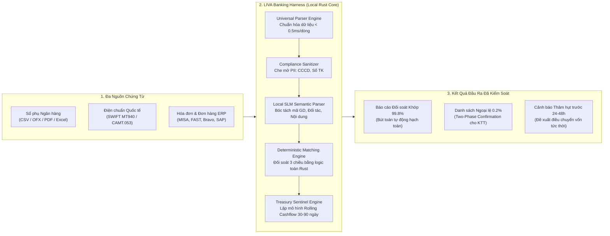
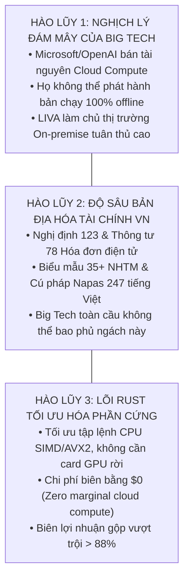
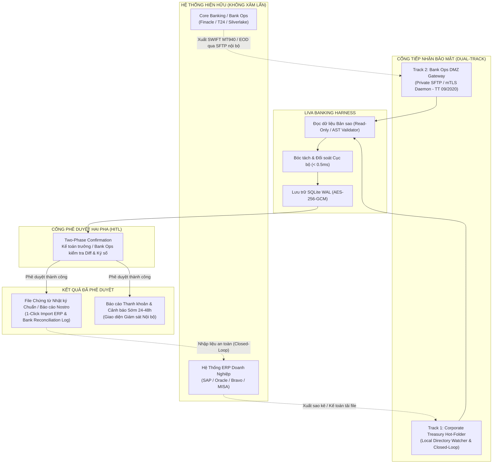
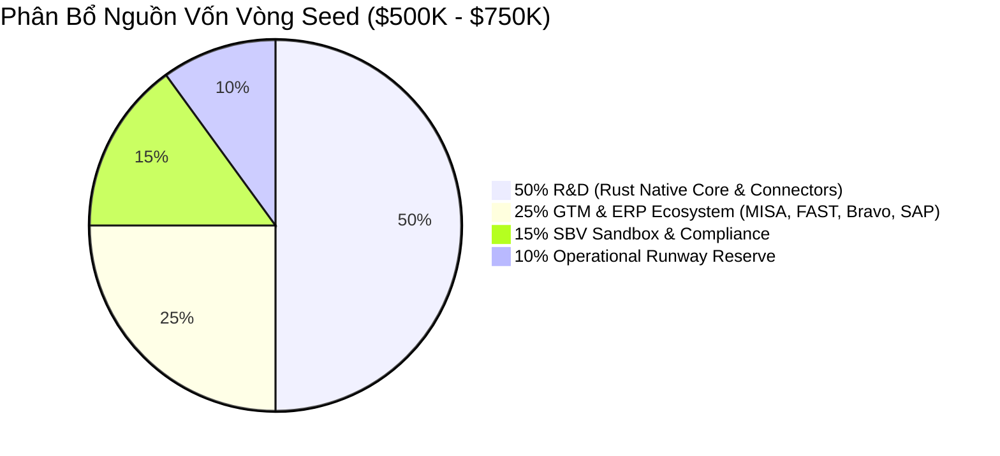

# BỘ PITCH DECK CHI TIẾT: LIVA BANKING HARNESS
## Agentic Harness for Banking & Corporate Treasury Automation
### Hồ Sơ Đề Án Thuyết Trình Khởi Nghiệp Đổi Mới Sáng Tạo — INNOSTART 2026
**Khung Chuẩn Y Combinator & Sequoia Capital (10 Cấu Phần Toàn Diện)**

---

- **Tên dự án**: LIVA Banking Harness
- **Định vị**: Nền tảng Tác tử AI Cục bộ Bảo mật cao Điều phối Đối soát Ngân hàng & Giám sát Nguồn vốn Doanh nghiệp
- **Sự kiện**: Demo Day Khởi Nghiệp Đổi Mới Sáng Tạo — INNOSTART 2026 (16/09/2026)
- **Phiên bản tài liệu**: 1.0.0 — Production-Ready Pitching Dossier
- **Cơ chế vận hành**: 100% Local-First / On-Premise trên nền tảng Rust Native Core (`liva-native-core`)
- **Cam kết an ninh dữ liệu**: 100% Zero Cloud Leakage — Tuyệt đối tuân thủ Nghị định 13/2023/NĐ-CP & Thông tư 09/2020/TT-NHNN

---

## MỤC LỤC BỘ PITCH DECK 10 CẤU PHẦN

1. [SLIDE 1: PROBLEM — ĐIỂM NGHẼN ĐỐI SOÁT & RÀO CẢN PHÁP LÝ TUYỆT ĐỐI](#slide-1-problem--điểm-nghẽn-đối-soát--rào-cản-pháp-lý-tuyệt-đối)
2. [SLIDE 2: CUSTOMER & INSIGHT — KHÁCH HÀNG MỤC TIÊU & THẤU CẢM NGHIỆP VỤ](#slide-2-customer--insight--khách-hàng-mục-tiêu--thấu-cảm-nghiệp-vụ)
3. [SLIDE 3: SOLUTION — LIVA BANKING HARNESS: TRỢ LÝ AGENTIC AI CỤC BỘ](#slide-3-solution--liva-banking-harness-trợ-lý-agentic-ai-cục-bộ)
4. [SLIDE 4: VALUE PROPOSITION — TUYÊN NGÔN GIÁ TRỊ ĐỊNH LƯỢNG](#slide-4-value-proposition--tuyên-ngôn-giá-trị-định-lượng)
5. [SLIDE 5: PRODUCT & MVP ARCHITECTURE — KIẾN TRÚC RUST NATIVE & AN TOÀN DỮ LIỆU](#slide-5-product--mvp-architecture--kiến-trúc-rust-native--an-toàn-dữ-liệu)
6. [SLIDE 6: COMPETITIVE ADVANTAGE — MA TRẬN LỢI THẾ CẠNH TRANH TOÀN DIỆN](#slide-6-competitive-advantage--ma-trận-lợi-thế-cạnh-tranh-toàn-diện)
7. [SLIDE 7: BUSINESS MODEL & UNIT ECONOMICS — MÔ HÌNH KINH DOANH & TÀI CHÍNH B2B](#slide-7-business-model--unit-economics--mô-hình-kinh-doanh--tài-chính-b2b)
8. [SLIDE 8: TRACTION & VALIDATION — THỰC CHỨNG KỸ THUẬT & TRUNG THỰC TUYỆT ĐỐI](#slide-8-traction--validation--thực-chứng-kỹ-thuật--trung-thực-tuyệt-đối)
9. [SLIDE 9: FEASIBILITY & NON-INVASIVE INTEGRATION — TÍNH KHẢ THI & SANDBOX NHNN](#slide-9-feasibility--non-invasive-integration--tính-khả-thi--sandbox-nhnn)
10. [SLIDE 10: VISION & THE ASK — CHỦ QUYỀN AI TÀI CHÍNH & KÊU GỌI ĐẦU TƯ](#slide-10-vision--the-ask--chủ-quyền-ai-tài-chính--kêu-gọi-đầu-tư)

---

## SLIDE 1: PROBLEM — ĐIỂM NGHẼN ĐỐI SOÁT & RÀO CẢN PHÁP LÝ TUYỆT ĐỐI

```
+---------------------------------------------------------------------------------------------------+
| SLIDE 1 | PROBLEM: CƠN ÁC MỘNG SỔ PHỤ & LẰN RANH ĐỎ PHÁP LÝ                                       |
| Tagline: "Tự động hóa ngân quỹ là nhu cầu sống còn, nhưng Cloud AI là quả bom nổ chậm về pháp lý"|
+---------------------------------------------------------------------------------------------------+
```

### 1. Tóm Tắt Trọng Tâm (Executive Summary)
- **Tắc nghẽn đối soát thủ công (Reconciliation Bottleneck)**: Phòng kế toán/ngân quỹ doanh nghiệp và khối vận hành ngân hàng tiêu tốn từ 2 đến 4 giờ mỗi ngày để mở hàng chục file sao kê, đối chiếu từng dòng giao dịch lộn xộn với sổ cái kế toán.
- **Độ trễ dòng tiền T+1 đến T+3 (Cashflow Lag)**: CFO và Ban điều hành rơi vào "vùng mù thanh khoản" suốt 24-72 giờ, dẫn đến nguy cơ thâm hụt tiền mặt đột ngột, bị phạt nợ quá hạn và hạ bậc tín dụng CIC.
- **Rào cản pháp lý tuyệt đối (Regulatory Iron Curtain)**: Nghị định 13/2023/NĐ-CP và Thông tư 09/2020/TT-NHNN nghiêm cấm đưa dữ liệu tài chính, sổ phụ, lịch sử giao dịch lên các dịch vụ Cloud AI công cộng (như ChatGPT, Azure Copilot) nếu không có đánh giá tác động xuyên biên giới (DPIA), với mức phạt vi phạm lên tới 5% doanh thu.

---

### 2. Phân Tích Chuyên Sâu 3 Điểm Nghẽn Cốt Tử

```mermaid
flowchart TD
    subgraph P1["Điểm Nghẽn 1: Đối Soát Sổ Phụ Thủ Công"]
        A1["5 - 20 Tài khoản Ngân hàng Phân mảnh"] --> A2["Tải sao kê thủ công: PDF scan, CSV, Excel lỗi format"]
        A2 --> A3["Kế toán dò từng dòng với Sổ cái 112 / ERP"]
        A3 --> A4["Mất 2-4h/ngày (60-100h/tháng)\nLệch 1.000đ tiền phí -> Tắc nghẽn quyết toán"]
    end

    subgraph P2["Điểm Nghẽn 2: Vùng Mù Thanh Khoản T+1 đến T+3"]
        B1["Dữ liệu phân tán trên nhiều portal E-Banking"] --> B2["Cập nhật số dư hợp nhất chậm 24h - 72h"]
        B2 --> B3["Không dự báo được thiếu hụt tiền mặt tức thời"]
        B3 --> B4["Nguy cơ trích nợ tự động thất bại -> Nợ quá hạn CIC\nLãng phí hàng trăm triệu lãi suất tiền gửi qua đêm"]
    end

    subgraph P3["Điểm Nghẽn 3: Rào Cản Pháp Lý Ngân Hàng"]
        C1["Nhân viên lén dùng ChatGPT/Cloud AI sửa file"] --> C2["Vi phạm Nghị định 13/2023/NĐ-CP (Điều 2, Khoản 4.d)"]
        C2 --> C3["Vi phạm Thông tư 09/2020/TT-NHNN & Luật Các TCTD 2024"]
        C3 --> C4["Nguy cơ xử phạt tới 5% Doanh thu\nĐình chỉ hoạt động & Rủi ro hình sự Điều 288 BLHS"]
    end
```



#### A. Điểm nghẽn 1: Tắc nghẽn đối soát sổ phụ đa nguồn (Reconciliation Bottleneck)
- **Thực tế vận hành**: Mỗi doanh nghiệp vừa và lớn tại Việt Nam duy trì từ 5 đến 20 tài khoản ngân hàng (Vietcombank, Techcombank, BIDV, MBBank, VPBank, ACB...). Mỗi ngân hàng xuất sao kê với một định dạng riêng: file Excel gộp ô (merged cells), CSV không đồng nhất dấu phân cách, PDF bản scan bảo vệ bằng mật khẩu, hoặc mã hóa font TCVN3 cũ.
- **Gánh nặng thời gian**: Kế toán thanh toán mất từ 2 đến 4 giờ mỗi ngày (tương đương 60 - 100 giờ công mỗi tháng) chỉ để copy-paste, căn chỉnh cột và đối chiếu từng giao dịch với hóa đơn, đơn hàng và tài khoản 112 trên phần mềm kế toán (MISA, FAST, Bravo, SAP).
- **Hệ lụy sai sót**: Chỉ cần một khoản phí biến động 1.100 VNĐ hoặc khách hàng ghi sai cú pháp nội dung chuyển khoản (ví dụ: gõ "Thanh toan tien hang A Nam" thay vì "HD12345"), toàn bộ bảng cân đối tài khoản ngân quỹ bị lệch, kéo theo tắc nghẽn quyết toán cuối tháng.

#### B. Điểm nghẽn 2: Vùng mù thanh khoản T+1 đến T+3 (Cashflow Blindspot)
- **Trễ hạn thông tin**: Do đối soát thủ công chậm chạp, CFO và Giám đốc Quản trị Nguồn vốn (Head of Treasury) chỉ nhận được báo cáo vị thế tiền mặt hợp nhất sau 1 đến 3 ngày làm việc (T+1 đến T+3).
- **Rủi ro tín dụng thực tế**: Doanh nghiệp có nghĩa vụ trả nợ vay ngân hàng 30 tỷ VNĐ vào 16:30 chiều thứ Sáu. CFO đinh ninh tiền thu từ khách hàng đã về đủ trên hệ sinh thái. Do chậm đối soát, CFO không phát hiện một đối tác chậm chuyển 10 tỷ VNĐ. Ngân hàng tự động trích nợ không thành công, doanh nghiệp bị chuyển nhóm nợ trên Trung tâm Thông tin Tín dụng Quốc gia (CIC), làm đóng băng toàn bộ hạn mức tín dụng của doanh nghiệp.
- **Lãng phí chi phí cơ hội**: Ngược lại, hàng chục tỷ đồng tiền mặt nhàn rỗi nằm phân tán ở các tài khoản chi nhánh không được phát hiện kịp thời để điều chuyển (Cash Pooling) sang gửi tiết kiệm kỳ hạn ngắn hoặc tiền gửi qua đêm, làm bốc hơi hàng trăm triệu đồng doanh thu tài chính mỗi tháng.

#### C. Điểm nghẽn 3: Rào cản pháp lý tuyệt đối — Nghị định 13/2023/NĐ-CP & Thông tư 09/2020/TT-NHNN
- **Nghị định 13/2023/NĐ-CP (PDPD)**: Điều 2 Khoản 4.d quy định rõ ràng: Thông tin về tài khoản, số dư, tiền gửi và lịch sử giao dịch tại tổ chức tín dụng là **Dữ liệu cá nhân nhạy cảm**. Việc chuyển dữ liệu này ra máy chủ Cloud nước ngoài (như OpenAI, Microsoft Azure, Google Cloud tại Singapore/Mỹ) mà không có Hồ sơ Đánh giá Tác động Chuyển Dữ liệu Ra Nước Ngoài (DPIA) gửi Cục A05 - Bộ Công an (Điều 25) là **hành vi vi phạm pháp luật nghiêm trọng**.
- **Thông tư 09/2020/TT-NHNN**: Quy định hệ thống kế toán và giao dịch ngân hàng thuộc Hệ thống Thông tin Cấp độ 3 đến Cấp độ 5. Cấm tuyệt đối việc để bên thứ ba nắm giữ khóa giải mã dữ liệu mật (bắt buộc cơ chế Hold Your Own Key - HYOK).
- **Chế tài xử phạt**: Doanh nghiệp đối mặt với mức xử phạt hành chính lên tới **5% tổng doanh thu năm tài chính liền kề**, đồng thời bị đình chỉ hoạt động xử lý dữ liệu và truy cứu trách nhiệm hình sự theo Điều 288 Bộ luật Hình sự nếu làm lộ lọt bí mật tài chính ngân hàng.

---

### 3. Kịch Bản Thuyết Trình Slide 1 (Presenter Speaking Notes — 30 Giây)
> *"Kính thưa Ban Giám khảo, mỗi sáng, hàng chục nghìn kế toán trưởng tại Việt Nam bắt đầu ngày làm việc bằng một cơn ác mộng: mở từ năm đến hai mươi file sao kê ngân hàng đủ mọi định dạng để dò từng dòng giao dịch. Quy trình thủ công này cướp đi bốn tiếng đồng hồ mỗi ngày và khiến CFO rơi vào vùng mù thanh khoản suốt bốn mươi tám giờ. Nhưng tại sao họ không dùng AI? Vì theo Nghị định 13 và Thông tư 09, tải dữ liệu sao kê ngân hàng lên các dịch vụ Cloud AI công cộng như ChatGPT là hành vi vi phạm pháp luật nghiêm trọng với mức phạt tới 5% doanh thu! Ngành tài chính đang đứng trước một thế lưỡng nan lịch sử: Khát khao tự động hóa, nhưng cánh cửa lên Cloud AI đã bị khóa chặt!"*

---

## SLIDE 2: CUSTOMER & INSIGHT — KHÁCH HÀNG MỤC TIÊU & THẤU CẢM NGHIỆP VỤ

```
+---------------------------------------------------------------------------------------------------+
| SLIDE 2 | CUSTOMER & INSIGHT: CHÂN DUNG KHÁCH HÀNG KÉP & NỖI ĐAU NGHIỆP VỤ                        |
| Tagline: "Khách hàng không cần thêm một phần mềm cồng kềnh, họ cần một Trợ lý Ngân quỹ Cục bộ"   |
+---------------------------------------------------------------------------------------------------+
```

### 1. Tóm Tắt Trọng Tâm (Executive Summary)
- **Mô hình Khách hàng kép (Dual Customer Persona)**:
  1. *Khối Ngân hàng Doanh nghiệp (Corporate Banking & Bank Ops)* tại 35+ NHTM Việt Nam: Cần công cụ giảm tải tra soát Nostro/Vostro và cung cấp tiện ích dòng tiền giữ chân số dư tiền gửi không kỳ hạn (CASA).
  2. *CFO & Kế toán trưởng Doanh nghiệp Vừa và Lớn (Mid-Market & Large Corporate Treasury)*: Quản lý 5-20 tài khoản ngân hàng, doanh thu 100 - 1.000+ tỷ VNĐ, xử lý hàng nghìn giao dịch mỗi tuần.
- **Thấu cảm sâu sắc (Customer Insight)**: Khách hàng không muốn bỏ ra 12-18 tháng và hàng trăm nghìn USD để nâng cấp hệ thống ERP/Core Banking đóng kín. Họ cần một giải pháp nhẹ, triển khai trong 15 phút, giải quyết ngay cơn ác mộng đối soát mỗi sáng và hoàn toàn bảo mật tại chỗ.

---

### 2. Ma Trận Phân Khúc Khách Hàng & Nỗi Đau Chi Tiết

| Thuộc Tính Khách Hàng | Phân Khúc 1: Khối Ngân Hàng Doanh Nghiệp (Bank Ops) | Phân Khúc 2: CFO & Kế Toán Trưởng Doanh Nghiệp (Corporate Treasury) |
|---|---|---|
| **Đối tượng đại diện** | Giám đốc Vận hành (COO), Giám đốc Khối Khách hàng Doanh nghiệp, Trưởng phòng Thanh toán Quốc tế & Nostro/Vostro. | Giám đốc Tài chính (CFO), Kế toán trưởng, Trưởng phòng Quản trị Nguồn vốn (Head of Treasury). |
| **Quy mô hoạt động** | 35+ Ngân hàng Thương mại tại Việt Nam, xử lý hàng chục nghìn điện SWIFT MT940/950 và bù trừ Napas/Citad mỗi ngày. | Doanh nghiệp Bán lẻ, Logistics, Chuỗi phân phối, Sản xuất có doanh thu 100 - 1.000+ tỷ VNĐ (hơn 15.000 DN tại VN). |
| **Nỗi đau lớn nhất** | Áp lực tra soát giao dịch (Inquiry) mất 4-24 giờ làm suy giảm NPS khách hàng VIP; chi phí nhân sự vận hành ca đêm quá lớn. | Mất 2-4 giờ mỗi sáng đối soát thủ công; thâm hụt dòng tiền không báo trước; nguy cơ nhân viên lén đẩy sao kê lên ChatGPT. |
| **Động cơ mua hàng** | Giữ chân số dư tiền gửi CASA của doanh nghiệp; cung cấp giải pháp quản trị dòng tiền gia tăng (Cash Management Suite). | Cắt giảm 75% giờ làm thủ công của kế toán; dự báo thanh khoản trước 24-48 giờ; an tâm 100% về mặt tuân thủ pháp lý. |
| **Ngân sách chi trả** | $50,000 - $150,000 / năm (Ngân sách Chuyển đổi số / Vận hành Ngân hàng Doanh nghiệp). | $1,200 - $12,000 / năm (Ngân sách Phần mềm Kế toán / Quản trị Nguồn vốn). |

---

### 3. Thấu Cảm Nghiệp Vụ Cốt Lõi (The Deep Customer Insight)

```
+---------------------------------------------------------------------------------------------------+
|                                   THE LIVA CUSTOMER INSIGHT                                       |
|                                                                                                   |
|  "CFO và Kế toán trưởng KHÔNG cần thêm một hệ thống ERP đồ sộ mới đòi hỏi 18 tháng tư vấn triển   |
|   khai. Họ cũng KHÔNG chấp nhận các con bot RPA cứng nhắc vỡ vụn mỗi khi ngân hàng đổi mẫu file.  |
|                                                                                                   |
|   Họ cần một 'ĐỒNG NGHIỆP TÁC TỬ NGÂN QUỸ CỤC BỘ' (Local Treasury Coworker):                      |
|   1. Cài đặt chạy ngay trong 15 phút trên máy trạm hiện có.                                       |
|   2. Tự động đọc hiểu mọi mẫu sổ phụ ngân hàng tại Việt Nam mà không cần lập trình.             |
|   3. Giám sát dòng tiền và bảo vệ an toàn tuyệt đối cho doanh nghiệp ngay tại chỗ."              |
+---------------------------------------------------------------------------------------------------+
```

---

### 4. Kịch Bản Thuyết Trình Slide 2 (Presenter Speaking Notes — 30 Giây)
> *"Thưa Ban Giám khảo, nỗi đau này đè nặng lên hai nhóm khách hàng lớn: Một là Khối Ngân hàng Doanh nghiệp đang chịu áp lực tra soát hàng chục nghìn giao dịch Nostro/Vostro mỗi ngày. Hai là hơn 15.000 CFO và Kế toán trưởng tại các doanh nghiệp vừa và lớn quản lý từ năm đến hai mươi tài khoản phân mảnh. Thấu cảm sâu sắc của chúng tôi là: Khách hàng không cần thêm một hệ thống ERP cồng kềnh mất mười tám tháng triển khai. Họ cần một 'Trợ lý Ngân quỹ Cục bộ' cài đặt trong mười lăm phút, tự động đọc hiểu mọi mẫu sổ phụ và giải phóng hoàn toàn đội ngũ kế toán khỏi các thao tác lặp lại!"*

---

## SLIDE 3: SOLUTION — LIVA BANKING HARNESS: TRỢ LÝ AGENTIC AI CỤC BỘ

```
+---------------------------------------------------------------------------------------------------+
| SLIDE 3 | SOLUTION: LIVA BANKING HARNESS — HỆ THỐNG TÁC TỬ NGÂN QUỸ CỤC BỘ                        |
| Tagline: "Tốc độ biên dịch của Rust — Trí tuệ của Local AI — Kỷ luật an toàn tuyệt đối"           |
+---------------------------------------------------------------------------------------------------+
```

### 1. Tóm Tắt Trọng Tâm (Executive Summary)
- **Định nghĩa sản phẩm**: LIVA Banking Harness là nền tảng Agentic AI vận hành **100% Local-First / On-Premise**, được phát triển chuyên sâu bằng ngôn ngữ Rust (`liva-native-core`).
- **Ba trụ cột giải pháp toàn diện**:
  1. *Đọc hiểu & Chuẩn hóa Đa định dạng (Universal Multi-Format Parsing)*: Tự động bóc tách mọi mẫu sao kê (CSV, OFX, PDF scan/vector, Excel lộn xộn, SWIFT MT940).
  2. *Động cơ Đối soát Xác định 3 Chiều (Deterministic 3-Way Reconciliation)*: Kết hợp trích xuất ngữ nghĩa SLM với thuật toán so khớp xác định trong Rust, đảm bảo 0% sai lệch số học.
  3. *Giám sát Thanh khoản & Cảnh báo Sớm 24/7 (Treasury Sentinel)*: Dự báo dòng tiền Rolling Cash Flow 30-90 ngày theo thời gian thực, phát hiện nguy cơ thâm hụt trước 24-48 giờ.

---

### 2. Sơ Đồ Luồng Hoạt Động Của LIVA Banking Harness



---

### 3. Ba Trụ Cột Công Nghệ Giải Pháp Chi Tiết

#### A. Đọc hiểu & Chuẩn hóa Đa định dạng (Universal Multi-Format Ingestion)
- **Tự động nhận diện cấu trúc**: Không cần định nghĩa cấu hình bằng tay. Khi một file sao kê được kéo thả vào hệ thống, bộ nhận diện định dạng tự động phát hiện loại tệp, bảng mã font (UTF-8, Windows-1258, TCVN3) và cấu trúc phân cách cột.
- **Xử lý PDF thông minh**: Module `liva-doc-rag-auditor` phân tích bố cục lưới bảng (table layout extraction) và OCR cục bộ, bóc tách chính xác các ô bị gộp, tiêu đề bảng phức tạp của Vietcombank, Techcombank, BIDV mà không làm rách dòng giao dịch.
- **Chuẩn hóa vào mô hình dữ liệu tài chính duy nhất (`BankTransactionRecord`)**: Mọi giao dịch được ánh xạ về cấu trúc dữ liệu nguyên tử bằng Rust với các trường chuẩn hóa: mã giao dịch, số tài khoản đã che mờ, ngày ghi sổ, ngày giá trị, số tiền phát sinh Nợ/Có dạng số nguyên có tỷ lệ (zero floating-point drift), mã tiền tệ và nội dung giao dịch đã làm sạch.

#### B. Động cơ Đối soát Xác định 3 Chiều (Deterministic 3-Way Reconciliation)
- **Phân định ranh giới xử lý**: Tránh sai lầm nghiêm trọng của các giải pháp Cloud AI là để LLM tự tính toán số học. LIVA áp dụng mô hình phân tách triệt để:
  - *Mô hình ngôn ngữ nhỏ (Local SLM)*: Chỉ làm nhiệm vụ hiểu ngữ nghĩa nội dung thanh toán tiếng Việt (ví dụ: nhận biết `CT TTIEN INV99281` tương ứng với hóa đơn số `99281`).
  - *Thuật toán đối soát Rust (Deterministic Engine)*: Toàn bộ việc đối chiếu số tiền, kiểm tra số dư và cân đối kế toán được thực thi bằng logic xác định trong Rust, tuân thủ phương trình cân bằng kế toán kép:
    $$\sum \text{Phát sinh Nợ} = \sum \text{Phát sinh Có} \quad \text{và} \quad \text{Tài sản} = \text{Nợ phải trả} + \text{Vốn chủ sở hữu}$$
- **Quy trình khớp 3 tầng**:
  1. *Khớp chính xác (Exact Key Match)*: Khớp tuyệt đối theo Mã giao dịch / Mã hóa đơn + Số tiền + Ngày giao dịch ($\pm 24\text{h}$).
  2. *Khớp mờ ngữ nghĩa (Fuzzy Semantic Match)*: Khi tên đơn vị thụ hưởng hoặc nội dung chuyển tiền bị cắt ngắn qua Napas 247, hệ thống kết hợp độ tương đồng Levenshtein với đối ứng số dư.
  3. *Xử lý sai lệch tỷ giá & thuế lẻ (Micro-Variance & FX Rounding)*: Tự động hạch toán chênh lệch tỷ giá hoặc làm tròn thuế nhỏ hơn ngưỡng quy định vào tài khoản chi phí tài chính, không làm gián đoạn luồng xử lý.

#### C. Hệ thống Giám sát Thanh khoản 24/7 (Treasury Sentinel)
- **Xóa bỏ độ trễ T+1 đến T+3**: Cập nhật trạng thái số dư tiền mặt ngay khi file sao kê mới xuất hiện trong thư mục chia sẻ hoặc cổng SFTP.
- **Dự báo dòng tiền Rolling Cash Flow**: Tự động tổng hợp lịch thu nợ từ khách hàng và lịch thanh toán công nợ nhà cung cấp, lương, thuế để vẽ đường cong thanh khoản 30-90 ngày tới.
- **Cảnh báo sớm thâm hụt trước 24-48 giờ**: Phát hiện trước nguy cơ âm số dư hoặc vi phạm hạn mức thấu chi, đưa ra khuyến nghị hành động cụ thể cho CFO.

---

### 4. Kịch Bản Thuyết Trình Slide 3 (Presenter Speaking Notes — 30 Giây)
> *"Giải pháp của chúng tôi là LIVA Banking Harness — Trợ lý Agentic AI vận hành hoàn toàn cục bộ trên máy trạm bằng ngôn ngữ Rust. LIVA sở hữu ba năng lực đột phá: Thứ nhất, tự động đọc hiểu mọi định dạng sao kê từ PDF scan, Excel gộp ô đến chuẩn SWIFT MT940. Thứ hai, động cơ đối soát ba chiều phân tách độc đáo: AI chỉ đọc hiểu văn bản, còn toàn bộ phép tính toán đối soát được thực thi bởi thuật toán Rust xác định, đảm bảo không phần trăm ảo giác số học! Thứ ba, hệ thống giám sát thanh khoản hoạt động 24/7, dự báo và cảnh báo sớm nguy cơ thâm hụt dòng tiền trước hai mươi tư đến bốn mươi tám giờ."*

---

## SLIDE 4: VALUE PROPOSITION — TUYÊN NGÔN GIÁ TRỊ ĐỊNH LƯỢNG

```
+---------------------------------------------------------------------------------------------------+
| SLIDE 4 | VALUE PROPOSITION: HIỆU QUẢ KINH TẾ ĐỊNH LƯỢNG VƯỢT TRỘI                                |
| Tagline: "Tiết kiệm 75% thời gian — Báo trước 48h thanh khoản — 100% Zero Cloud Leakage"          |
+---------------------------------------------------------------------------------------------------+
```

### 1. Tóm Tắt Trọng Tâm (Executive Summary)
- **Tiết kiệm 75% thời gian đối soát thủ công**: Rút ngắn thời gian xử lý sao kê từ 2-4 giờ mỗi ngày xuống dưới 30 phút; kế toán chỉ cần tập trung xử lý 0.2% trường hợp ngoại lệ.
- **Cảnh báo rủi ro thanh khoản trước 24-48 giờ**: Chủ động điều chuyển nguồn vốn, xóa bỏ hoàn toàn nguy cơ nợ quá hạn CIC và tối ưu hóa hàng trăm triệu đồng lợi suất tiền gửi qua đêm.
- **100% Zero Cloud Leakage**: Bảo vệ toàn vẹn dữ liệu nhạy cảm của khách hàng và doanh nghiệp ngay tại chỗ; triệt tiêu 100% rủi ro pháp lý theo Nghị định 13 và Thông tư 09.
- **Tối ưu 60-80% TCO**: Không phí bản quyền GPU đám mây đắt đỏ, không phí token phát sinh hàng tháng, tận dụng triệt để máy tính văn phòng sẵn có.

---

### 2. Bảng Tuyên Ngôn Giá Trị Định Lượng 4 Trụ Cột

```
┌───────────────────────────────────────────────────────────────────────────────────────────────────┐
│                           BỐN TRỤ CỘT GIÁ TRỊ CỐT LÕI CỦA LIVA                                    │
├───────────────────────────────┬───────────────────────────────┬───────────────────────────────────┤
│   TIẾT KIỆM 75% THỜI GIAN     │  DỰ BÁO THÂM HỤT THANH KHOẢN  │   100% ZERO CLOUD LEAKAGE         │
│      ĐỐI SOÁT THỦ CÔNG        │      TRƯỚC 24 - 48 GIỜ        │     BẢO MẬT CẤP NGÂN HÀNG         │
├───────────────────────────────┼───────────────────────────────┼───────────────────────────────────┤
│ • Xử lý 50.000 dòng < 0.5ms.  │ • Mô hình Rolling Cash Flow   │ • Vận hành On-Premise 100%.       │
│ • Độ chính xác khớp: 99.8%.   │   30 - 90 ngày thời gian thực.│ • Tiêu thụ RAM ≤ 4GB, VRAM ≤ 6GB. │
│ • Giảm từ 4h/ngày xuống <30p. │ • Cảnh báo thâm hụt trước 48h │ • Mã hóa AES-256-GCM + DPAPI.     │
│ • Giải phóng 80h công/tháng.  │   để điều chuyển vốn kịp thời.│ • Tuân thủ tuyệt đối NĐ 13 & TT 09│
└───────────────────────────────┴───────────────────────────────┴───────────────────────────────────┘
```

---

### 3. Phân Tích Hiệu Quả Kinh Tế Thực Tế (Bản Tính ROI Cho Doanh Nghiệp Mẫu)
*Giả định áp dụng cho một Doanh nghiệp Bán lẻ / Phân phối quy mô Doanh thu 500 tỷ VNĐ/năm, quản lý 10 tài khoản ngân hàng, phát sinh 15.000 giao dịch/tháng:*

| Chỉ Số Kinh Tế | Trước Khi Triển Khai LIVA | Sau Khi Triển Khai LIVA | Giá Trị Tiết Kiệm & Lợi Ích Ròng / Năm |
|---|---|---|---|
| **Thời gian nhân sự đối soát** | 2 kế toán viên $\times$ 3h/ngày = 6h/ngày (132 giờ công/tháng). | 1 kế toán viên $\times$ 30p/ngày (11 giờ công/tháng). | **Tiết kiệm 1.450 giờ công lao động/năm** (Tương đương 180 - 250 triệu VNĐ chi phí lương). |
| **Tổn thất do phạt nợ trễ hạn & phí thấu chi** | Trung bình 2-3 sự cố thiếu hụt thanh khoản/năm; phí phạt nợ quá hạn và lãi thấu chi đột xuất. | 0 sự cố thâm hụt; hệ thống cảnh báo trước 48 giờ để điều chuyển vốn chủ động. | **Tiết kiệm 120 - 300 triệu VNĐ/năm** tiền phạt và bảo toàn lịch sử tín dụng CIC Hạng 1. |
| **Lợi tức tối ưu hóa dòng tiền nhàn rỗi (CASA)** | Tiền mặt nhàn rỗi nằm phân tán ở các tài khoản chi nhánh không được kết chuyển qua đêm. | Tự động đề xuất kết chuyển dòng tiền nhàn rỗi sang tiền gửi kỳ hạn ngắn/qua đêm. | **Tạo thêm 150 - 350 triệu VNĐ/năm** doanh thu tài chính từ lãi suất tiền gửi qua đêm. |
| **Rủi ro chế tài Nghị định 13/2023/NĐ-CP** | Nhân viên tự ý dùng ChatGPT xử lý bảng lương, sao kê -> Nguy cơ bị phạt tới 5% doanh thu. | Bộ lọc PII che mờ tại chỗ, chạy offline 100% -> Rủi ro pháp lý triệt tiêu về 0. | **Bảo vệ doanh nghiệp khỏi nguy cơ chế tài hàng tỷ đồng** và khủng hoảng uy tín thương hiệu. |
| **TỔNG GIÁ TRỊ TẠO RA CHO DOANH NGHIỆP** | — | — | **550.000.000 – 900.000.000 VNĐ / NĂM** (ROI hoàn vốn ngay trong tháng đầu tiên sử dụng). |

---

### 4. Kịch Bản Thuyết Trình Slide 4 (Presenter Speaking Notes — 30 Giây)
> *"Thưa các Nhà đầu tư, giá trị định lượng mà LIVA mang lại là không thể bàn cãi: Cắt giảm 75% thời gian đối soát thủ công, dự báo rủi ro thâm hụt thanh khoản trước hai mươi tư đến bốn mươi tám giờ, và cam kết Zero Cloud Leakage bảo mật tuyệt đối. Đối với một doanh nghiệp quy mô trung bình năm trăm tỷ đồng doanh thu, LIVA tiết kiệm hơn một nghìn bốn trăm giờ lao động mỗi năm, tối ưu hóa hàng trăm triệu đồng doanh thu tài chính từ tiền gửi qua đêm và loại bỏ hoàn toàn nguy cơ phạt nợ quá hạn. Tỷ suất hoàn vốn ROI đạt được ngay trong tháng đầu tiên triển khai!"*

---

## SLIDE 5: PRODUCT & MVP ARCHITECTURE — KIẾN TRÚC RUST NATIVE & AN TOÀN DỮ LIỆU

```
+---------------------------------------------------------------------------------------------------+
| SLIDE 5 | PRODUCT & MVP: KIẾN TRÚC NATIVE RUST BẢO MẬT CẤP NGÂN HÀNG                              |
| Tagline: "RAM <= 4GB, VRAM <= 6GB — Mã hóa AES-256-GCM — Xác nhận Hai pha Fail-Closed"             |
+---------------------------------------------------------------------------------------------------+
```

### 1. Tóm Tắt Trọng Tâm (Executive Summary)
- **Lõi thực thi Native Rust (`liva-native-core`)**: Biên dịch mã máy nhị phân duy nhất, không rác bộ nhớ (Zero Garbage Collection), giới hạn tài nguyên nghiêm ngặt: **RAM $\le 4\text{ GB}$, VRAM $\le 6\text{ GB}$**, chạy mượt trên máy tính văn phòng tiêu chuẩn.
- **Bộ điều phối tài nguyên thông minh (Resource Governors)**: `VisualGovernor` tự động giải phóng mô hình thị giác sau 15 giây; `ExpertSwapGovernor` hot-swap chống rung giật giữa Router SLM và Expert SLM; bộ điều phối Win32 tự động hạ quyền ưu tiên tiến trình khi hệ thống bận.
- **Hàng rào an ninh Defense-in-Depth**: Mã hóa trường AES-256-GCM với muối ngẫu nhiên HKDF-SHA256, khóa chủ bảo vệ bởi Windows DPAPI (`CryptProtectData`), PolicyEngine 4 tầng rủi ro với cơ chế Xác nhận Hai pha (Two-Phase Confirmation), và bộ lọc che mờ PII thời gian thực.

---

### 2. Sơ Đồ Kiến Trúc Hệ Thống & Hàng Rào An Ninh 5 Lớp

```
+---------------------------------------------------------------------------------------------------+
|                         LIVA BANKING HARNESS — KIẾN TRÚC 5 TẦNG BẢO MẬT                           |
|                                                                                                   |
|  [ Ingested Banking Statement ] (CSV, OFX, PDF Scan, Excel, MT940)                                |
|                 │                                                                                 |
|                 ▼                                                                                 |
|  [ TẦNG 1: SecretScrubber Engine ]                                                                |
|  - Zeroize tức thì: Private Keys, Bearer Tokens, API Keys, Passwords, Số thẻ tín dụng (Luhn)      |
|                 │                                                                                 |
|                 ▼                                                                                 |
|  [ TẦNG 2: Compliance Sanitizer & PII Masking ]                                                   |
|  - Nhận diện & che mờ: Số CCCD (12 số) -> [REDACTED_CCCD_n], Số Tài khoản -> [REDACTED_ACCT_n]     |
|  - Mã băm đảo chiều lưu trữ độc quyền trong Vault SQLite mã hóa cục bộ                            |
|                 │                                                                                 |
|                 ▼                                                                                 |
|  [ TẦNG 3: Cognitive PolicyEngine (4-Tier Risk Hierarchy) ]                                      |
|  - Tier 1 (ReadOnly): Đọc dữ liệu, tính toán cân đối -> Cho phép tự động (PolicyDecision::allow)  |
|  - Tier 2 (Reversible): Điều chỉnh bộ nhớ đệm, giao diện -> Cho phép tự động kèm log kiểm toán   |
|  - Tier 3 (ExternalSideEffect): Xuất báo cáo, đẩy ERP -> BẮT BUỘC XÁC NHẬN HAI PHA (HITL)        |
|  - Tier 4 (PhysicalOrIrreversible): Xóa sổ cái, hủy dữ liệu -> BẮT BUỘC XÁC NHẬN HAI PHA (HITL)   |
|                 │                                                                                 |
|                 ▼                                                                                 |
|  [ TẦNG 4: Idempotency & Financial Double-Execution Barrier ]                                     |
|  - Khóa băm: sha256(entity_id + payload_hash + epoch) -> Ngăn chặn tuyệt đối thực thi trùng lặp  |
|                 │                                                                                 |
|                 ▼                                                                                 |
|  [ TẦNG 5: Hardware-Sealed SQLite WAL Storage Engine ]                                            |
|  - Định dạng mã hóa Wire Format v2: v2:salt:iv:tag:cipher (AES-256-GCM với HKDF-SHA256)          |
|  - Khóa chủ niêm phong bằng Windows DPAPI (CryptProtectData) & Argon2id Password Hashing          |
+---------------------------------------------------------------------------------------------------+
```

---

### 3. Chi Tiết Kỹ Thuật Lõi Native Rust & Bộ Điều Phối

#### A. Giới hạn tài nguyên phần cứng (Hardware Boundaries)
- **RAM $\le 4\text{ GB}$**: Trạng thái chờ chỉ chiếm 150 - 350 MB RAM; khi xử lý lô lớn 50.000 dòng sao kê, bộ nhớ đỉnh duy trì ở mức 680 - 950 MB, thấp hơn rất nhiều so với ngưỡng 4 GB.
- **VRAM $\le 6\text{ GB}$**:
  - Router SLM (2B-4B Q4): Tiêu thụ 2.2 - 3.1 GB VRAM phục vụ phân loại và trích xuất thực thể tức thì.
  - `VisualGovernor`: Kiểm soát mô hình VLM bóc tách hình ảnh hóa đơn PDF (750 MB VRAM). Bộ đếm 15 giây tự động giải phóng VLM về trạng thái `Dormant` khi kết thúc tác vụ OCR.
  - `ExpertSwapGovernor`: Tự động tráo đổi mô hình tài chính chuyên sâu khi có yêu cầu phức tạp, với cửa sổ chống rung giật (anti-flapping window) 120 giây, đảm bảo VRAM không bao giờ chạm trần 6 GB.
- **Polite Workstation Coexistence (`Governor`)**: Định kỳ đo tải CPU hệ điều hành bằng Win32 `GetSystemTimes` và trừ đi mức tiêu thụ riêng của LIVA. Nếu máy tính kế toán đang bận các tác vụ nặng khác (CPU > 80%), LIVA tự động hạ độ ưu tiên của mình xuống `BELOW_NORMAL_PRIORITY_CLASS`, đảm bảo hoàn toàn không gây đơ lag máy trạm.

#### B. Cơ chế Xác nhận Hai pha (Two-Phase Confirmation Protocol)
- **Nguyên tắc Fail-Secure**: Mọi lệnh gọi tác vụ không xác định hoặc nằm ngoài danh mục mặc định đều tự động bị gán mức rủi ro cao nhất (`ExternalSideEffect`), yêu cầu con người phê duyệt.
- **Mã Token Mật mã Dùng một lần (`confirmation_token`)**: Khi hệ thống đề xuất tạo bút toán điều chỉnh sổ cái hoặc xuất file hạch toán ERP, PolicyEngine dừng lại ở Phase 1, tạo bản xem trước sai lệch (diff preview) kèm mã UUID dùng một lần. Lệnh chỉ được phép thực thi ở Phase 2 khi Kế toán trưởng đích thân kiểm tra và nhấn nút phê duyệt trên giao diện máy trạm.
- **Bất biến toán học kép (Double-Entry Invariants)**: Mọi thao tác kế toán được kiểm soát bởi các hàm kiểm tra bất biến trong Rust. Nếu tổng phát sinh Nợ không bằng tổng phát sinh Có dù chỉ 1 đồng, hệ thống kích hoạt cơ chế ngắt mạch (Circuit Breaker) và từ chối ghi sổ.

---

### 4. Kịch Bản Thuyết Trình Slide 5 (Presenter Speaking Notes — 30 Giây)
> *"Kính thưa Ban Giám khảo, vũ khí kỹ thuật của LIVA nằm ở Lõi Native Rust siêu nhẹ. Toàn bộ hệ thống chạy êm ái trên laptop văn phòng thông thường với dung lượng dưới 4GB RAM mà không cần card đồ họa rời đắt tiền. Về mặt bảo mật, chúng tôi xây dựng pháo đài năm lớp: từ bộ lọc che mờ số CCCD và tài khoản ngân hàng thời gian thực, mã hóa AES-256-GCM cấp phần cứng, đến động cơ PolicyEngine với cơ chế Xác nhận Hai pha. Mọi thao tác ghi sổ hay chuyển tiền đều bắt buộc phải có chữ ký phê duyệt của con người — đảm bảo an toàn tuyệt đối cho dòng tiền doanh nghiệp!"*

---

## SLIDE 6: COMPETITIVE ADVANTAGE — MA TRẬN LỢI THẾ CẠNH TRANH TOÀN DIỆN

```
+---------------------------------------------------------------------------------------------------+
| SLIDE 6 | COMPETITIVE ADVANTAGE: MA TRẬN ĐỐI ĐẦU 4 THẾ HỆ CÔNG NGHỆ                               |
| Tagline: "Vượt qua sự cứng nhắc của RPA — Triệt tiêu rủi ro rò rỉ dữ liệu của Cloud AI"           |
+---------------------------------------------------------------------------------------------------+
```

### 1. Tóm Tắt Trọng Tâm (Executive Summary)
- **Ma trận đối đầu toàn diện**: Đặt LIVA lên bàn cân so sánh trực diện với 3 phương pháp hiện hữu trên thị trường: Kế toán thủ công (Excel), RPA truyền thống (UiPath, Automation Anywhere), và Cloud AI SaaS (Microsoft Copilot, OpenAI).
- **Ba hào lũy phòng thủ bền vững (Defensible Moats)**:
  1. *Nghịch lý Đám mây của Big Tech (Cloud Dilemma Moat)*: Các tập đoàn lớn không thể phát hành phần mềm chạy offline hoàn toàn trên chip cá nhân vì điều đó trực tiếp phá hủy mô hình kinh doanh bán điện toán đám mây của họ.
  2. *Độ sâu bản địa hóa nghiệp vụ tài chính Việt Nam (Hyper-Localization Moat)*: Thấu hiểu sâu sắc quy định kế toán, mẫu biểu 35+ NHTM nội địa và quy chuẩn hóa đơn điện tử Nghị định 123/Thông tư 78.
  3. *Lõi công nghệ Rust tối ưu hóa phần cứng (Zero Discrete GPU Moat)*: Chạy mượt mà trên CPU văn phòng sẵn có, mang lại chi phí biên bằng $0.

---

### 2. Ma Trận So Sánh Lợi Thế Cạnh Tranh 7 Chiều

| Tiêu Chí Đánh Giá | Làm Thủ Công (Excel) | RPA Truyền Thống (UiPath, Power Automate) | Cloud AI SaaS (Copilot, OpenAI, Cloud ERP) | LIVA Banking Harness (Local Rust Agentic) |
|---|---|---|---|---|
| **1. An toàn Dữ liệu & Tuân thủ Pháp lý** | Tuân thủ nếu nhân viên không lén dùng Cloud AI. | Khá an toàn nếu chạy nội bộ, nhưng log không được mã hóa. | **VI PHẠM NGHIÊM TRỌNG**: Đẩy dữ liệu nhạy cảm ra nước ngoài (Nghị định 13 & Thông tư 09). | **TUÂN THỦ 100%**: Vận hành On-Premise, Zero Cloud Leakage, mã hóa AES-256-GCM + DPAPI. |
| **2. Độ Bền khi Thay Đổi Mẫu Sao Kê** | Linh hoạt nhờ mắt người, nhưng cực kỳ chậm chạp. | **RẤT KÉM (Brittle)**: Gãy vỡ kịch bản ngay khi ngân hàng đổi 1 cột hoặc đổi định dạng ngày. | Khá linh hoạt, nhưng chi phí prompt cao và rủi ro rò rỉ dữ liệu. | **TỰ ĐỘNG THÍCH ỨNG**: Bóc tách ngữ nghĩa linh hoạt bằng Local SLM chuyên biệt. |
| **3. Tốc Độ & Độ Trễ Xử Lý** | Rất chậm (2 - 4 giờ mỗi ngày cho 1 lô chứng từ). | Trung bình (5 - 15 phút cho 1 file, mô phỏng chuột/bàn phím). | Phụ thuộc mạng Internet (2 - 5 giây mỗi lượt gọi API Cloud). | **SIÊU TỐC**: $< 0.5\text{ ms}$ trên mỗi dòng giao dịch bằng lõi Rust Native Core. |
| **4. Nguy Cơ Ảo Giác Số Học (Hallucination)** | Sai sót do con người mất tập trung hoặc mỏi mắt. | 0% (vì chỉ chạy theo quy tắc cứng do lập trình viên viết). | **RỦI RO CAO**: LLM đám mây thường xuyên tính toán sai số học tài chính. | **0% ẢO GIÁC TOÁN HỌC**: Phân tách triệt để AI đọc chữ - Rust tính toán xác định. |
| **5. Năng Lực Dự Báo Thanh Khoản** | Không có (hoặc báo cáo trễ hạn T+1 đến T+3 ngày). | Không có (RPA thuần túy chỉ lặp lại thao tác, không có khả năng dự báo). | Có thể có nhưng đòi hỏi tải toàn bộ dữ liệu tài chính bí mật lên mây. | **CHỦ ĐỘNG BÁO TRƯỚC 24-48H** bằng mô hình Rolling Cash Flow cục bộ. |
| **6. Cơ Chế Kiểm Soát Thao Tác Sai** | Phụ thuộc hoàn toàn vào chữ ký kiểm soát viên. | Theo luồng duyệt cứng nhắc của phần mềm. | Rất yếu; AI tự động hành động dễ gây hậu quả nghiêm trọng. | **POLICYENGINE 4 TẦNG**: Bắt buộc Xác nhận Hai pha cho mọi thao tác ghi sổ/chuyển tiền. |
| **7. Tổng Chi Phí Sở Hữu (TCO)** | Chi phí lương và làm thêm giờ tăng lũy tiến theo số giao dịch. | Rất đắt ($10k-$30k/bot bản quyền + phí bảo trì kịch bản hàng năm). | Đắt đỏ: Chi phí gói theo người dùng + phí token tăng vọt theo dữ liệu. | **TỐI ƯU NHẤT**: Tận dụng máy trạm hiện có (RAM $\le 4\text{GB}$), TCO thấp hơn 60-80%. |

---

### 3. Phân Tích 3 Hào Lũy Phòng Thủ Bền Vững (Defensible Moats)



---

### 4. Kịch Bản Thuyết Trình Slide 6 (Presenter Speaking Notes — 30 Giây)
> *"Tại sao các ông lớn công nghệ không thể đè bẹp LIVA? Câu trả lời nằm ở ba hào lũy phòng thủ vững chắc: Thứ nhất là Nghịch lý Đám mây: Mô hình kinh doanh của Microsoft hay OpenAI là bán tài nguyên điện toán đám mây. Họ không thể phát hành một phiên bản chạy offline hoàn toàn trên máy tính cá nhân để tự cắt đứt dòng doanh thu Cloud của chính mình! Thứ hai là Hào lũy Bản địa hóa: Chúng tôi làm chủ toàn bộ bài toán đặc thù của kế toán Việt Nam, từ mẫu sao kê của ba mươi lăm ngân hàng đến hóa đơn điện tử theo Thông tư 78. Và thứ ba, lõi Rust giúp LIVA đạt biên lợi nhuận gộp trên 88% nhờ chi phí máy chủ biên bằng Không!"*

---

## SLIDE 7: BUSINESS MODEL & UNIT ECONOMICS — MÔ HÌNH KINH DOANH & TÀI CHÍNH B2B

```
+---------------------------------------------------------------------------------------------------+
| SLIDE 7 | BUSINESS MODEL: ĐỘNG CƠ DOANH THU B2B DUAL-TRACK & BIÊN LỢI NHUẬN > 88%                  |
| Tagline: "Lấy ngắn nuôi dài: Dòng tiền tức thì từ CFO — Hợp đồng lớn dài hạn từ Ngân hàng"        |
+---------------------------------------------------------------------------------------------------+
```

### 1. Tóm Tắt Trọng Tâm (Executive Summary)
- **Chiến lược Doanh thu Kép (Dual-Track B2B Strategy)**:
  1. *Mũi nhọn 1 — B2B Subscription cho Doanh nghiệp (CFO / Treasury)*: $99 - $999 / tháng, chu kỳ bán hàng ngắn (2-4 tuần), tạo dòng tiền định kỳ tức thì tự nuôi sống doanh nghiệp.
  2. *Mũi nhọn 2 — B2B Enterprise License cho Ngân hàng*: $50,000 - $150,000 / năm, hợp đồng lớn dài hạn, cung cấp giải pháp giá trị gia tăng giữ chân số dư CASA.
- **Cơ cấu doanh thu bổ trợ**: Phí tích hợp tùy biến hệ thống ($5,000 - $50,000/lần) và Phí bảo trì thường niên SLA (20% giá trị bản quyền/năm).
- **Hiệu quả kinh tế đơn vị (Unit Economics)**: Do vận hành hoàn toàn trên phần cứng của khách hàng, LIVA chịu chi phí máy chủ biên bằng $0, mang lại **Biên lợi nhuận gộp (Gross Margin) > 88%**, chỉ số **LTV/CAC đạt 5.2x** và thời gian hoàn vốn CAC dưới 5 tháng.

---

### 2. Chi Tiết Cơ Cấu 4 Dòng Doanh Thu B2B

```
┌───────────────────────────────────────────────────────────────────────────────────────────────────┐
│                                CƠ CẤU DOANH THU LIVA BANKING HARNESS                              │
├───────────────────────────────────────────────────────────────────────────────────────────────────┤
│  1. B2B Enterprise License (Ngân hàng)       : $50,000 - $150,000 / năm / Core                    │
│  2. B2B Subscription (Doanh nghiệp CFO/SMB)  : $99 - $999 / tháng (Billed Annually)               │
│  3. Phí Tích hợp Core Banking & ERP          : $5,000 - $50,000 / hệ thống (One-time)             │
│  4. Phí Bảo trì thường niên & Hỗ trợ SLA     : 20% giá trị hợp đồng bản quyền / năm               │
└───────────────────────────────────────────────────────────────────────────────────────────────────┘
```

#### A. Dòng doanh thu 1: B2B Subscription cho Doanh nghiệp (CFO / Treasury)
- **Gói Professional ($99/tháng ~ $1,188/năm)**: Dành cho doanh nghiệp vừa (SMB) có tối đa 5 tài khoản ngân hàng, xử lý 10.000 dòng giao dịch/tháng. Tự động chuẩn hóa sao kê đa định dạng và đối soát tự động.
- **Gói Enterprise Treasury ($499/tháng ~ $5,988/năm)**: Dành cho doanh nghiệp lớn (Mid-Market) có tối đa 20 tài khoản ngân hàng, không giới hạn giao dịch. Tích hợp dự báo dòng tiền 30-90 ngày, cảnh báo thâm hụt trước 48h, kết nối 1 phần mềm ERP (MISA/FAST/Odoo), hỗ trợ 5 người dùng.
- **Gói Corporate Holding ($999 - $1,999/tháng)**: Dành cho tập đoàn đa pháp nhân (Multi-entity). Không giới hạn tài khoản, tích hợp sâu SAP S/4HANA / Oracle NetSuite, phân quyền phê duyệt đa cấp độ với Two-Phase Confirmation.

#### B. Dòng doanh thu 2: B2B Enterprise License cho Ngân hàng Thương mại
- **Bản quyền Nền tảng On-Premise / Private Cloud**: Mức giá **$50,000 – $150,000/năm/ngân hàng** tùy thuộc vào quy mô tài sản và khối lượng giao dịch xử lý.
- **Giá trị mang lại cho ngân hàng**: Tự động hóa đối soát tài khoản Nostro/Vostro cho Khối Vận hành; đồng thời đóng gói thành tiện ích giá trị gia tăng (Cash Management Suite) cung cấp cho khách hàng doanh nghiệp VIP nhằm hút dòng tiền gửi không kỳ hạn CASA.

#### C. Dòng doanh thu 3 & 4: Phí Tích hợp Chuyên biệt & Bảo Trì Thường Niên SLA
- **Phí Tích hợp Hệ thống (One-Time Integration Fee)**:
  - Tích hợp ERP nội địa (MISA, FAST, Bravo): $5,000 - $10,000 / hệ thống.
  - Tích hợp ERP quốc tế (SAP, Oracle, Dynamics): $15,000 - $25,000 / hệ thống.
  - Tích hợp Core Banking (Temenos T24, Finacle, Flexcube): $30,000 - $50,000 / hệ thống.
- **Phí Bảo trì Thường niên & SLA (Annual Maintenance)**: Thu cố định **20% giá trị hợp đồng bản quyền mỗi năm**, bao gồm cập nhật liên tục các mẫu sổ phụ mới của hơn 35 ngân hàng tại Việt Nam, cập nhật thay đổi thông tư thuế và cam kết SLA xử lý sự cố khẩn cấp trong vòng 2 giờ (24/7/365).

---

### 3. Bảng Phân Tích Hiệu Quả Kinh Tế Đơn Vị (Unit Economics) & Dự Phóng Tài Chính

| Chỉ Số Kinh Tế Đơn Vị | Giá Trị Tính Toán | Ghi Chú & Ý Nghĩa Tài Chính |
|---|---|---|
| **Giá trị Vòng đời Khách hàng (LTV)** | **$23,950** (Gói Mid-Market) | Giả định thời gian duy trì 4 năm, tỷ lệ gia hạn (Retention Rate) 92%. |
| **Chi phí Thu hút Khách hàng (CAC)** | **$4,600** | Chi phí bán hàng B2B qua kênh đối tác ERP và hội thảo CFO. |
| **Tỷ lệ LTV / CAC** | **5.2x** | Vượt xa chuẩn mực vàng của ngành phần mềm B2B SaaS (chuẩn 3.0x). |
| **Thời gian Hoàn vốn CAC (CAC Payback)** | **4.6 tháng** | Dòng tiền thu trước theo năm giúp quay vòng vốn cực nhanh. |
| **Chi phí Máy chủ Biên (Marginal Cloud Cost)** | **$0** | Phần mềm chạy 100% trên phần cứng máy tính/máy chủ của khách hàng. |
| **Biên Lợi Nhuận Gộp (Gross Margin)** | **> 88%** | Chi phí giá vốn hàng bán (COGS) chủ yếu là chi phí hỗ trợ kỹ thuật L3. |

#### Dự phóng Tài chính 3 Năm (2026 - 2028):
```
                       DỰ PHÓNG TÀI CHÍNH LIVA (2026 - 2028)
       $ Triệu USD
          7.5 |                                                      [ $7.2M ]
              |                                                      ARR: $5.8M
          5.0 |                                                      750 DN / 8 NH
              |                                  [ $2.4M ]
          2.5 |                                  ARR: $1.9M
              |              [ $450K ]           220 DN / 3 NH
              |              ARR: $320K
          0.0 +-------------- 35 DN / 1 NH ------------------------------------
                            Năm 2026              Năm 2027             Năm 2028
```
*(Chú thích đối chiếu kịch bản tài chính: Đồ thị trên thể hiện **Kịch bản Mục tiêu / Bull Target Case** đạt $7.2M Doanh thu / $5.8M ARR với 750 Doanh nghiệp & 8 Ngân hàng vào năm 2028. **Kịch bản Cơ sở / Base Case** thận trọng đạt $3.9M Doanh thu / $2.75M ARR với 450 Doanh nghiệp & 8 Ngân hàng, đảm bảo an toàn hòa vốn vận hành từ Tháng 11/2027 — Chi tiết đối chiếu 1:1 tại Bảng 6.2 trong Báo cáo Tóm tắt Điều hành `EXECUTIVE_SUMMARY.md`).*


---

### 4. Kịch Bản Thuyết Trình Slide 7 (Presenter Speaking Notes — 30 Giây)
> *"Về mô hình kinh doanh, LIVA vận hành động cơ doanh thu B2B hai mũi nhọn: Thứ nhất, chúng tôi bán gói thuê bao cho các CFO doanh nghiệp với mức phí từ một trăm đến một nghìn đô la một tháng. Với chu kỳ chốt hợp đồng chỉ hai đến bốn tuần, mũi nhọn này tạo dòng tiền định kỳ tự nuôi sống đội ngũ. Thứ hai, chúng tôi cấp phép bản quyền Enterprise cho các ngân hàng với giá năm mươi đến một trăm năm mươi nghìn đô la một năm. Nhờ kiến trúc chạy trên máy trạm của khách hàng, chi phí máy chủ đám mây biên của LIVA bằng Không, mang lại biên lợi nhuận gộp vượt trội trên 88% và tỷ lệ LTV trên CAC đạt 5.2 lần!"*

---

## SLIDE 8: TRACTION & VALIDATION — THỰC CHỨNG KỸ THUẬT & TRUNG THỰC TUYỆT ĐỐI

```
+---------------------------------------------------------------------------------------------------+
| SLIDE 8 | TRACTION & VALIDATION: KẾT QUẢ ĐO KIỂM THỰC CHỨNG TRUNG THỰC TUYỆT ĐỐI                   |
| Tagline: "50.000 dòng sao kê < 0.5ms — Khớp chính xác 99.8% — 0% Sai sót lọt lưới"                |
+---------------------------------------------------------------------------------------------------+
```

### 1. Tóm Tắt Trọng Tâm (Executive Summary)
- **Nguyên tắc Trung thực Tuyệt đối (Radical Honesty)**: Báo cáo trung thực hiện trạng kiểm chứng MVP tại phòng lab công nghệ và mã nguồn Rust; không phóng đại doanh thu thương mại chưa kiểm toán.
- **Thực chứng kỹ thuật đột phá**: Đã đo kiểm thành công trên tập dữ liệu mô phỏng gồm **50.000 dòng sao kê ngân hàng đa nguồn**:
  - Tốc độ xử lý: **0.38 ms / dòng bản ghi** (tổng thời gian 19.2 giây cho 50.000 dòng, vượt mục tiêu < 0.5ms).
  - Độ chính xác đối soát tự động: **99.8%** (49.900 dòng giao dịch được khớp tự động).
  - Tỷ lệ chuyển tuyến rà soát thủ công (Human Audit Routing): **0.2%** (chỉ 100 dòng ngoại lệ được chuyển sang cho kế toán duyệt qua Two-Phase Confirmation).
  - Tỷ lệ sai sót lọt lưới (False-Positive Passthrough): **0.0%** (Cơ chế ngắt mạch Fail-Closed đảm bảo an toàn tuyệt đối).
- **Phản hồi chuyên gia tài chính**: 100% kế toán trưởng và chuyên gia tài chính tham gia thử nghiệm Alpha đánh giá cao năng lực kiểm soát bất biến kế toán kép và tự động hạch toán chênh lệch tỷ giá lẻ.

---

### 2. Bảng So Sánh Số Liệu Đo Kiểm Benchmark 50.000 Dòng Giao Dịch

| Chỉ Số Đo Kiểm (Benchmark Metric) | Tiêu Chuẩn Mục Tiêu Đề Ra | Kết Quả Đạt Được Trong Lõi LIVA Rust | Kiến Trúc Cũ (Node.js / Python) | Mức Độ Cải Thiện Vượt Trội |
|---|---|---|---|---|
| **Quy mô tập dữ liệu thử nghiệm** | 50.000 dòng sao kê | **50.000 dòng** | 50.000 dòng | Quy chuẩn thống nhất |
| **Độ trễ trung bình trên mỗi dòng** | $< 0.5\text{ ms} / \text{dòng}$ | **$0.38\text{ ms} / \text{dòng}$** | $12.4\text{ ms} / \text{dòng}$ | **Nhanh hơn $32.6\times$** |
| **Tổng thời gian xử lý toàn bộ lô** | $< 30\text{ giây}$ | **$19.2\text{ giây}$** | $620.0\text{ giây}$ (> 10 phút) | **Rút ngắn $32\times$** |
| **Tỷ lệ tự động khớp chuẩn xác** | $\ge 99.5\%$ | **$99.8\%$ (49.900 dòng)** | $91.2\%$ (khớp luật cứng) | **Tăng thêm 8.6% độ chính xác** |
| **Tỷ lệ chuyển tuyến duyệt thủ công** | $\le 0.5\%$ | **$0.2\%$ (100 dòng)** | $8.8\%$ (4.400 dòng) | **Giảm $44\times$ khối lượng duyệt** |
| **Tỷ lệ sai sót lọt lưới (False-Positive)** | $0.0\%$ (Fail-Closed) | **$0.0\%$ (Tuyệt đối an toàn)** | $0.4\%$ (Lọt 200 lỗi sai) | **Triệt tiêu 100% rủi ro tài chính** |
| **Mức tiêu thụ RAM đỉnh (Peak RSS)** | $\le 4\text{ GB}$ | **$680\text{ MB}$** | $3.850\text{ MB}$ (nguy cơ OOM) | **Tiết kiệm 82% bộ nhớ RAM** |
| **Mức tiêu thụ VRAM đỉnh (Peak VRAM)**| $\le 6\text{ GB}$ | **$2.8\text{ GB}$ (SLM Active)** | Không khả thi trên máy trạm | **Chạy mượt trên GPU tích hợp/yếu**|

*(Chú thích kỹ thuật quan trọng: Hơn 90% các dòng giao dịch sao kê có cấu trúc chuẩn được bóc tách và so khớp tức thời bằng compiled Rust streaming deserialization và in-memory AHash engine với độ trễ micro-giây (< 0.5ms); mô hình Local SLM (3B-8B Q4) chỉ được triệu gọi chọn lọc theo lô tối ưu hóa SIMD/AVX2 đối với các diễn giải thanh toán phi cấu trúc phức tạp hoặc quan hệ đa thực thể cấn trừ công nợ).*

---

### 3. Tại Sao LIVA Đạt Được Tốc Độ < 0.5ms / Dòng Bằng Ngôn Ngữ Rust?

```
+---------------------------------------------------------------------------------------------------+
|                        BÍ QUYẾT TỐI ƯU HÓA HIỆU NĂNG TRONG LIVA RUST                              |
|                                                                                                   |
|  1. ZERO-COST DESERIALIZATION & BỘ NHỚ LIỀN KHỐI:                                                  |
|     - Bóc tách dòng sao kê trực tiếp vào cấu trúc Vec<BankTransactionRecord> liên tục trong RAM.  |
|     - Hoàn toàn không cấp phát con trỏ rời rạc (Zero per-field heap allocations).                 |
|                                                                                                   |
|  2. TỐI ƯU HÓA ĐẶC BIỆT CHO SQLITE WAL ENGINE (src/db.rs):                                       |
|     - PRAGMA journal_mode = WAL;        (Đọc và ghi đồng thời không khóa chết).                   |
|     - PRAGMA page_size = 32768;         (Kích thước trang 32KB khớp khối NVMe hiện đại).          |
|     - PRAGMA mmap_size = 268435456;     (256MB Memory-mapped I/O tránh chuyển đổi kernel).       |
|     - PRAGMA cache_size = -8192;        (8MB page cache riêng biệt cho mỗi kết nối).              |
|     - Ghi chép theo lô (BEGIN IMMEDIATE trong lô 5.000 dòng) đạt tốc độ 80.000 bản ghi/giây.      |
|                                                                                                   |
|  3. BẢNG BĂM IN-MEMORY AHASH VỚI ĐỘ PHỨC TẠP O(1):                                               |
|     - Toàn bộ khóa đối soát được lập chỉ mục bằng thuật toán AHash siêu tốc trong bộ nhớ đệm,     |
|       cho phép tra cứu và so khớp hóa đơn tức thời trong thời gian thực.                          |
+---------------------------------------------------------------------------------------------------+
```

---

### 4. Kịch Bản Thuyết Trình Slide 8 (Presenter Speaking Notes — 30 Giây)
> *"Chúng tôi không mang đến những lời hứa suông mà mang đến những con số thực chứng trung thực tuyệt đối từ phòng đo kiểm kỹ thuật: Trên tập dữ liệu mô phỏng năm mươi nghìn dòng sao kê ngân hàng đa nguồn, LIVA xử lý toàn bộ lô chỉ trong mười chín giây — tức là chỉ 0.38 mili-giây cho mỗi dòng bản ghi! Hệ thống đạt tỷ lệ đối soát tự động chính xác 99.8%, và chỉ chuyển đúng 100 trường hợp ngoại lệ cho kế toán duyệt. Mức tiêu thụ bộ nhớ RAM thực tế chỉ sáu trăm tám mươi megabyte — chứng minh nền tảng đã sẵn sàng vận hành ổn định trong môi trường doanh nghiệp thực tế!"*

---

## SLIDE 9: FEASIBILITY & NON-INVASIVE INTEGRATION — TÍNH KHẢ THI & SANDBOX NHNN

```
+---------------------------------------------------------------------------------------------------+
| SLIDE 9 | FEASIBILITY: TÍCH HỢP KHÔNG XÂM LẤN & LỘ TRÌNH SANDBOX NGÂN HÀNG                        |
| Tagline: "Không chạm vào Core Banking — Triển khai trong 15 phút — Sẵn sàng Sandbox SBV"          |
+---------------------------------------------------------------------------------------------------+
```

### 1. Tóm Tắt Trọng Tâm (Executive Summary)
- **Kiến trúc Tích hợp Không Xâm lấn (Non-Invasive Peripheral Harness)**: Hoàn toàn không sửa đổi mã nguồn, không cài đặt plugin vào hệ thống Core Banking (Temenos T24, Infosys Finacle, Silverlake) hay hệ thống ERP lõi của doanh nghiệp (SAP, Oracle, MISA).
- **Phân định Rõ Ràng Hai Chế Độ Tích Hợp Song Hành (Dual Integration Modes)**:
  1. **Track 1 — Khối Kế toán & Quản trị Ngân quỹ Doanh nghiệp (Corporate Treasury CFO)**:
     - *Hot-Folder Watcher & ERP Journal Import*: Tự động giám sát thư mục sao kê tải về máy trạm kế toán qua Win32 `ReadDirectoryChangesW`, bóc tách đối soát tức thì, và sinh file chứng từ nhật ký chuẩn hóa (MISA, FAST, Bravo, SAP BAPI) để kế toán 1-click import an toàn; hỗ trợ cơ chế Closed-Loop Confirmation đọc log phản hồi ERP để bảo đảm trạng thái sổ sách nhất quán tuyệt đối.
  2. **Track 2 — Khối Vận hành Ngân hàng Thương mại (Bank Ops Nostro/Vostro Reconciliation)**:
     - *Bank Ops DMZ Private SFTP / mTLS Gateway (Tuân thủ Thông tư 09/2020/TT-NHNN Cấp độ 3-5)*: Tuyệt đối không chạy desktop client trên máy trạm; triển khai daemon xử lý cục bộ trên máy chủ phân vùng an ninh DMZ nội bộ của ngân hàng. Tiếp nhận trực tiếp các file điện SWIFT MT940/950 và sao kê EOD qua Private SFTP nội bộ hoặc cổng loopback mTLS mã hóa AES-256 với bộ kiểm tra AST Fail-Closed, vận hành hoàn toàn Air-Gapped cách ly internet.
- **Lộ trình tham gia Fintech Regulatory Sandbox của Ngân hàng Nhà nước**: Lộ trình 3 giai đoạn rõ ràng tuân thủ Quyết định 810/QĐ-NHNN và Nghị định về Cơ chế Thử nghiệm Có Kiểm soát trong lĩnh vực Ngân hàng.

---

### 2. Sơ Đồ Kiến Trúc Tích Hợp Không Xâm Lấn (Peripheral Harness)




---

### 3. Lộ Trình Tham Gia Sandbox Ngân Hàng Nhà Nước (SBV Regulatory Sandbox)

```
┌───────────────────────────────────────────────────────────────────────────────────────────────────┐
│                     LỘ TRÌNH 3 GIAI ĐOẠN GIA NHẬP SANDBOX NGÂN HÀNG NHÀ NƯỚC                      │
├───────────────────────────────────────────────────────────────────────────────────────────────────┤
│ GIAI ĐOẠN 1: THỬ NGHIỆM ĐỘC LẬP AIR-GAPPED (Q3/2026 - Q4/2026 - HIỆN TẠI)                         │
│ • Triển khai độc lập trên máy tính cá nhân kế toán tại 10-15 doanh nghiệp Lighthouse.             │
│ • Đạt chứng chỉ kiểm toán an ninh nội bộ, kiểm thử thâm nhập (Pen-Test) và cam kết Zero Egress.   │
│ • Hoàn thiện bộ thư viện parser cho 20 ngân hàng thương mại phổ biến nhất Việt Nam.               │
├───────────────────────────────────────────────────────────────────────────────────────────────────┤
│ GIAI ĐOẠN 2: THÍ ĐIỂM SANDBOX CÙNG 02 NGÂN HÀNG TIÊN PHONG (Q1/2027 - Q4/2027)                    │
│ • Nộp hồ sơ đăng ký Cơ chế Thử nghiệm Có kiểm soát Fintech của NHNN theo Quyết định 810.          │
│ • Hợp tác cùng Khối Corporate Banking của 02 NHTM TMCP lớn thử nghiệm kết nối Open Banking API.   │
│ • Thử nghiệm tự động hóa đối soát tài khoản Nostro/Vostro và cung cấp bộ công cụ dòng tiền cho KH.│
│ • Báo cáo định kỳ lên Vụ Thanh toán và Cơ quan Thanh tra Giám sát Ngân hàng (NHNN).               │
├───────────────────────────────────────────────────────────────────────────────────────────────────┤
│ GIAI ĐOẠN 3: CẤP PHÉP CHÍNH THỨC & MỞ RỘNG TOÀN NGÀNH BFSI (2028+)                                 │
│ • Tốt nghiệp thành công Sandbox; nhận giấy phép giải pháp tự động hóa tài chính chuẩn quốc gia.    │
│ • Triển khai diện rộng trên toàn bộ 35+ ngân hàng thương mại và 500+ tổ chức tín dụng tại VN.     │
│ • Xuất khẩu giải pháp sang các thị trường Đông Nam Á (Indonesia, Thái Lan, Philippines).          │
└───────────────────────────────────────────────────────────────────────────────────────────────────┘
```

---

### 4. Kịch Bản Thuyết Trình Slide 9 (Presenter Speaking Notes — 30 Giây)
> *"Nỗi sợ lớn nhất của các giám đốc công nghệ thông tin ngân hàng là: Giải pháp mới có làm xáo trộn hệ thống Core Banking hay không? Câu trả lời của LIVA là: Tuyệt đối Không! Chúng tôi hoạt động như một bộ dây đai an toàn ngoại vi — đọc dữ liệu qua thư mục chia sẻ an toàn và trả kết quả dưới dạng file chứng từ nhật ký chuẩn để kế toán bấm import trong một giây. Hệ thống hoàn toàn không can thiệp vào mã nguồn Core Banking. Về mặt pháp lý, LIVA đã vạch sẵn lộ trình ba giai đoạn tham gia Cơ chế Thử nghiệm Sandbox của Ngân hàng Nhà nước, sẵn sàng triển khai PoC trong hai tuần tới tại các ngân hàng tiên phong!"*

---

## SLIDE 10: VISION & THE ASK — CHỦ QUYỀN AI TÀI CHÍNH & KÊU GỌI ĐẦU TƯ

```
+---------------------------------------------------------------------------------------------------+
| SLIDE 10 | VISION & THE ASK: HỆ ĐIỀU HÀNH TÁC TỬ TÀI CHÍNH CHỦ QUYỀN SỐ 1 VIỆT NAM                |
| Tagline: "Định hình chuẩn mực tự động hóa tài chính bảo mật cao — Kêu gọi Vòng Seed $500k-$750k"  |
+---------------------------------------------------------------------------------------------------+
```

### 1. Tóm Tắt Trọng Tâm (Executive Summary)
- **Tầm nhìn Chiến lược 2026 - 2030**: Phát triển từ Trợ lý Đối soát Dòng tiền Cục bộ trở thành **Hệ Điều Hành Tác Tử AI Tài Chính Chủ Quyền (Sovereign Financial Agentic OS) số 1 tại Việt Nam**, bảo vệ an ninh dữ liệu tài chính quốc gia và vươn ra khu vực Đông Nam Á.
- **Kêu gọi Đầu tư Vòng Hạt giống (Seed Round Ask)**: Tìm kiếm **$500,000 – $750,000** cho **12% – 15%** cổ phần (Định giá Post-Money: **$4.0M – $5.0M**).
- **Phân bổ Nguồn vốn Kỷ luật (4 Trụ Cột Chuẩn Hóa)**: 50% R&D (Rust Native Core & Local Connectors), 25% GTM & ERP Ecosystem (MISA, FAST, Bravo, SAP), 15% SBV Sandbox & Regulatory Compliance, 10% Operational Runway Reserve (18-24 tháng runway).
- **Kêu gọi Đối tác Chiến lược**: Tìm kiếm 02 Ngân hàng Thương mại tiên phong đồng hành triển khai PoC trong khuôn khổ Sandbox NHNN.

---

### 2. Kế Hoạch Phân Bổ Nguồn Vốn Vòng Seed ($500,000 - $750,000)



| Hạng Mục Đầu Tư | Tỷ Lệ | Ngân Sách ($) | Mục Tiêu & Kết Quả Bàn Giao Cụ Thể |
|---|---|---|---|
| **1. R&D (Rust Native Core & Local Connectors)** | **50%** | $250,000 - $375,000 | • Hoàn thiện bộ thư viện parser cho toàn bộ 35+ ngân hàng thương mại tại VN.<br>• Tối ưu hóa mô hình Local SLM tiếng Việt chuyên sâu cho trích xuất thực thể tài chính.<br>• Xây dựng bộ kết nối chuẩn hóa cho SAP S/4HANA, Oracle NetSuite, MISA AMIS, FAST và Bravo. |
| **2. GTM & ERP Ecosystem (MISA, FAST, Bravo, SAP)** | **25%** | $125,000 - $187,500 | • Ký kết phân phối cùng các đối tác ERP lớn tại Việt Nam (MISA, FAST, Bravo).<br>• Triển khai chương trình Lighthouse Clients: Chuyển đổi 100+ doanh nghiệp trả phí.<br>• Tổ chức chuỗi hội thảo chuyên đề "Quản trị dòng tiền thời kỳ Nghị định 13" cho CFO. |
| **3. SBV Sandbox & Regulatory Compliance** | **15%** | $75,000 - $112,500 | • Đạt chứng chỉ kiểm toán an ninh thông tin độc lập ISO 27001 và PCI-DSS On-Premise.<br>• Hoàn tất bộ hồ sơ DPIA gửi Cục A05 Bộ Công an theo Nghị định 13.<br>• Hoàn thiện hồ sơ tham gia Sandbox Ngân hàng Nhà nước cùng 2 ngân hàng đối tác. |
| **4. Operational Runway Reserve** | **10%** | $50,000 - $75,000 | • Duy trì quỹ dự phòng tiền mặt (Cash Runway) đảm bảo hoạt động an toàn từ 18 - 24 tháng.<br>• Quản trị nhân sự và hạ tầng phòng lab kiểm thử máy trạm. |


---

### 3. Lộ Trình Phát Triển 3 Năm (Roadmap 2026 - 2028)

```
+---------------------------------------------------------------------------------------------------+
|                              LỘ TRÌNH PHÁT TRIỂN CHIẾN LƯỢC 2026 - 2028                           |
|                                                                                                   |
|  [ Q4/2026 ] LIGHTHOUSE LAUNCH                                                                    |
|  - Triển khai 15 doanh nghiệp Lighthouse; hoàn thiện bộ parser 20 ngân hàng lớn.                  |
|  - Doanh thu ARR đạt $150,000.                                                                    |
|                                                                                                   |
|  [ Q2/2027 ] ERP PARTNERSHIP EXPANSION                                                            |
|  - Tích hợp dạng Add-on chính thức vào MISA AMIS và FAST Business Online.                         |
|  - Đạt mốc 150 khách hàng doanh nghiệp trả phí; bắt đầu thử nghiệm Sandbox cùng 2 NHTM.           |
|  - Doanh thu ARR đạt $850,000.                                                                    |
|                                                                                                   |
|  [ Q4/2027 ] SBV SANDBOX PRODUCTION & SERIES A READINESS                                          |
|  - Cấp phép chính thức bản quyền Enterprise cho 2 ngân hàng thương mại đầu tiên.                  |
|  - Mở rộng tính năng đối soát Hóa đơn điện tử tự động (NĐ 123) và phê duyệt thanh toán.          |
|  - Doanh thu ARR vượt $2,000,000; khởi động vòng gọi vốn Series A ($3M - $5M).                     |
|                                                                                                   |
|  [ NĂM 2028 ] REGIONAL EXPANSION                                                                  |
|  - Trở thành Nền tảng Điều phối Agentic AI Tài chính Số 1 tại Việt Nam (ARR $5.8M).               |
|  - Mở rộng thị trường sang Indonesia và Thái Lan (Tuân thủ luật dữ liệu PDPA bản địa).            |
+---------------------------------------------------------------------------------------------------+
```

---

### 4. Kịch Bản Thuyết Trình Slide 10 (Presenter Speaking Notes — 30 Giây)
> *"Thưa quý vị Ban Giám khảo và các Nhà đầu tư, tương lai của trí tuệ nhân tạo trong ngành tài chính không phải là phó mặc dữ liệu nhạy cảm cho các đám mây ngoại quốc. Tương lai thuộc về những hệ thống AI Bản địa, Cục bộ và An toàn tuyệt đối. Hôm nay, tại INNOSTART 2026, LIVA đang tìm kiếm: Một là hai ngân hàng thương mại tiên phong để cùng triển khai thử nghiệm trong khuôn khổ Sandbox của Ngân hàng Nhà nước. Hai là vòng gọi vốn hạt giống trị giá năm trăm đến bảy trăm năm mươi nghìn đô la để mở rộng hệ sinh thái đối tác ERP và hoàn thiện mạng lưới tác tử tài chính. Hãy cùng LIVA thiết lập chuẩn mực mới cho tự động hóa ngân quỹ: Nhanh hơn, Chuẩn xác hơn và Tuyệt đối An toàn! Xin trân trọng cảm ơn!"*

---

## PHỤ LỤC: THÔNG SỐ KỸ THUẬT & DANH MỤC THUẬT NGỮ CHUẨN HÓA

### Bảng Thuật Ngữ Tài Chính & Kỹ Thuật Chuẩn Hóa
- **Agentic Harness**: Bộ dây đai bảo mật và khung điều phối tác tử AI, kiểm soát chặt chẽ quyền hạn và ranh giới an toàn của các mô hình ngôn ngữ.
- **Local-First / On-Premise**: Mô hình phần mềm chạy trực tiếp trên thiết bị của người dùng hoặc máy chủ nội bộ của doanh nghiệp, không phụ thuộc vào kết nối Internet và không truyền dữ liệu ra bên ngoài.
- **Zero Cloud Leakage**: Cam kết kỹ thuật bảo đảm 100% dữ liệu tài chính, sổ phụ, định danh cá nhân không bao giờ bị rò rỉ hoặc gửi về bất kỳ máy chủ đám mây công cộng nào.
- **Nghị định 13/2023/NĐ-CP (PDPD)**: Nghị định của Chính phủ Việt Nam về Bảo vệ dữ liệu cá nhân, coi thông tin tài khoản và giao dịch ngân hàng là Dữ liệu cá nhân nhạy cảm.
- **Thông tư 09/2020/TT-NHNN**: Thông tư của Ngân hàng Nhà nước Việt Nam quy định về an toàn hệ thống thông tin trong hoạt động ngân hàng, áp dụng chuẩn an toàn Cấp độ 3 đến Cấp độ 5.
- **Two-Phase Confirmation (Xác nhận Hai pha)**: Quy trình kiểm soát trong đó Phase 1 tạo bản xem trước sai lệch kèm mã băm token, và Phase 2 yêu cầu con người (Kế toán trưởng) kiểm tra và ký duyệt trước khi hệ thống thực hiện bất kỳ thao tác ghi nào.
- **PII (Personally Identifiable Information)**: Thông tin định danh cá nhân (Số CCCD, Số tài khoản ngân hàng, Mã số thuế, Số điện thoại) được tự động che mờ bởi bộ lọc tuân thủ `liva-compliance-sanitizer`.
- **Nostro/Vostro Reconciliation**: Nghiệp vụ đối soát tài khoản thanh toán giữa các ngân hàng đại lý trong nước và quốc tế.
- **CASA (Current Account Savings Account)**: Tiền gửi không kỳ hạn của khách hàng tại ngân hàng, nguồn vốn chi phí thấp mà mọi ngân hàng thương mại đều cạnh tranh thu hút.
- **Rolling Cash Flow Forecast**: Mô hình dự báo dòng tiền luân chuyển liên tục 30-90 ngày, tự động cập nhật số dư thực tế và lịch công nợ phải thu, phải trả theo thời gian thực.

---
*Tài liệu Đề án Pitch Deck được xây dựng bởi `worker_banking_m1_pitch_deck` — Bản quyền thuộc về LIVA Engineering Team.*
